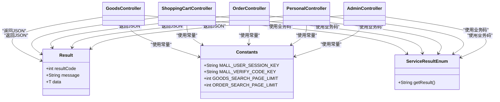

# API接口文档

<cite>
**本文引用的文件**
- [API.md](file://docs/API.md)
- [GoodsController.java](file://src/main/java/ltd/newbee/mall/controller/mall/GoodsController.java)
- [OrderController.java](file://src/main/java/ltd/newbee/mall/controller/mall/OrderController.java)
- [ShoppingCartController.java](file://src/main/java/ltd/newbee/mall/controller/mall/ShoppingCartController.java)
- [PersonalController.java](file://src/main/java/ltd/newbee/mall/controller/mall/PersonalController.java)
- [AdminController.java](file://src/main/java/ltd/newbee/mall/controller/admin/AdminController.java)
- [Result.java](file://src/main/java/ltd/newbee/mall/util/Result.java)
- [Constants.java](file://src/main/java/ltd/newbee/mall/common/Constants.java)
- [ServiceResultEnum.java](file://src/main/java/ltd/newbee/mall/common/ServiceResultEnum.java)
- [NewBeeMallExceptionHandler.java](file://src/main/java/ltd/newbee/mall/controller/common/NewBeeMallExceptionHandler.java)
- [NewBeeMallUserVO.java](file://src/main/java/ltd/newbee/mall/controller/vo/NewBeeMallUserVO.java)
</cite>

## 目录
1. [简介](#简介)
2. [项目结构](#项目结构)
3. [核心组件](#核心组件)
4. [架构总览](#架构总览)
5. [详细组件分析](#详细组件分析)
6. [依赖关系分析](#依赖关系分析)
7. [性能与安全考量](#性能与安全考量)
8. [故障排查指南](#故障排查指南)
9. [结论](#结论)
10. [附录](#附录)

## 简介
本文件基于仓库中的API文档与实际控制器实现，生成面向开发者的RESTful API参考手册。文档覆盖前台商城与后台管理的所有公开接口，明确各端点的HTTP方法、URL路径、请求参数、请求体结构、响应格式与状态码；重点阐述商品搜索、购物车增删改查、订单提交与查询、用户登录注册等关键流程；说明基于Cookie的Session认证机制如何在接口访问中生效；提供典型请求/响应示例路径，帮助快速集成；同时总结API版本控制策略、错误处理模式（Result封装类）、安全性考虑（输入校验与防刷机制）。

## 项目结构
- 前台控制器位于 mall 包，包含商品、购物车、订单、个人中心等接口。
- 后台控制器位于 admin 包，包含管理员登录、商品管理、分类管理、订单管理、会员管理等接口。
- 工具与常量位于 util、common 包，统一返回体 Result、业务状态枚举 ServiceResultEnum、会话与分页常量 Constants。
- 异常处理采用全局 RestControllerAdvice，自动区分JSON与HTML响应。

图表来源
- [GoodsController.java](file://src/main/java/ltd/newbee/mall/controller/mall/GoodsController.java#L40-L90)
- [ShoppingCartController.java](file://src/main/java/ltd/newbee/mall/controller/mall/ShoppingCartController.java#L36-L129)
- [OrderController.java](file://src/main/java/ltd/newbee/mall/controller/mall/OrderController.java#L44-L159)
- [PersonalController.java](file://src/main/java/ltd/newbee/mall/controller/mall/PersonalController.java#L62-L137)
- [AdminController.java](file://src/main/java/ltd/newbee/mall/controller/admin/AdminController.java#L37-L138)
- [Result.java](file://src/main/java/ltd/newbee/mall/util/Result.java#L1-L58)
- [Constants.java](file://src/main/java/ltd/newbee/mall/common/Constants.java#L18-L48)
- [ServiceResultEnum.java](file://src/main/java/ltd/newbee/mall/common/ServiceResultEnum.java#L17-L91)
- [NewBeeMallExceptionHandler.java](file://src/main/java/ltd/newbee/mall/controller/common/NewBeeMallExceptionHandler.java#L22-L56)

章节来源
- [API.md](file://docs/API.md#L1-L120)

## 核心组件
- 统一返回体 Result：所有JSON接口均以统一结构返回，包含 resultCode、message、data 字段。
- 业务状态枚举 ServiceResultEnum：封装通用与业务错误码，便于前后端约定。
- 会话常量 Constants：定义会话键名（如用户会话键、验证码键）与分页限制。
- 全局异常处理器 NewBeeMallExceptionHandler：自动识别AJAX与非AJAX请求，分别返回JSON或HTML错误页。

章节来源
- [Result.java](file://src/main/java/ltd/newbee/mall/util/Result.java#L1-L58)
- [ServiceResultEnum.java](file://src/main/java/ltd/newbee/mall/common/ServiceResultEnum.java#L17-L91)
- [Constants.java](file://src/main/java/ltd/newbee/mall/common/Constants.java#L18-L48)
- [NewBeeMallExceptionHandler.java](file://src/main/java/ltd/newbee/mall/controller/common/NewBeeMallExceptionHandler.java#L22-L56)

## 架构总览
- 前台接口：主要通过Thymeleaf模板渲染页面，部分接口返回JSON（如登录/注册、购物车、订单状态变更）。
- 后台接口：主要返回JSON，配合管理端UI使用。
- 认证机制：基于Cookie的Session，登录后在会话中存储用户标识；多数需要登录的接口通过会话键获取当前用户。

图表来源
- [PersonalController.java](file://src/main/java/ltd/newbee/mall/controller/mall/PersonalController.java#L62-L121)
- [ShoppingCartController.java](file://src/main/java/ltd/newbee/mall/controller/mall/ShoppingCartController.java#L63-L105)
- [OrderController.java](file://src/main/java/ltd/newbee/mall/controller/mall/OrderController.java#L44-L107)
- [GoodsController.java](file://src/main/java/ltd/newbee/mall/controller/mall/GoodsController.java#L40-L72)

## 详细组件分析

### 商品相关
- 商品搜索
  - 方法与路径：GET /search
  - 请求参数：keyword（可选）、goodsCategoryId（可选）、orderBy（可选，new/price）、page（可选，默认1）
  - 响应：HTML（Thymeleaf模板）
  - 行为要点：默认每页条数由常量控制；支持按分类与排序回显；仅展示上架商品。
  - 参考实现：[searchPage](file://src/main/java/ltd/newbee/mall/controller/mall/GoodsController.java#L40-L72)

- 商品详情
  - 方法与路径：GET /goods/detail/{goodsId}
  - 请求参数：goodsId（路径参数）
  - 响应：HTML（Thymeleaf模板）
  - 行为要点：校验参数合法性；仅允许已上架商品访问；封装详情VO返回。
  - 参考实现：[detailPage](file://src/main/java/ltd/newbee/mall/controller/mall/GoodsController.java#L74-L88)

章节来源
- [API.md](file://docs/API.md#L60-L100)
- [GoodsController.java](file://src/main/java/ltd/newbee/mall/controller/mall/GoodsController.java#L40-L88)
- [Constants.java](file://src/main/java/ltd/newbee/mall/common/Constants.java#L40-L48)

### 购物车相关
- 查看购物车
  - 方法与路径：GET /shop-cart
  - 请求参数：无（需要登录）
  - 响应：HTML（Thymeleaf模板）
  - 行为要点：从会话中获取用户ID，计算商品总数与总价，渲染页面。
  - 参考实现：[cartListPage](file://src/main/java/ltd/newbee/mall/controller/mall/ShoppingCartController.java#L36-L61)

- 添加商品到购物车
  - 方法与路径：POST /shop-cart
  - 请求体：NewBeeMallShoppingCartItem（goodsId、goodsCount）
  - 响应：JSON(Result)
  - 行为要点：将userId注入后调用服务层保存；成功/失败返回对应Result。
  - 参考实现：[saveNewBeeMallShoppingCartItem](file://src/main/java/ltd/newbee/mall/controller/mall/ShoppingCartController.java#L63-L76)

- 更新购物车商品数量
  - 方法与路径：PUT /shop-cart
  - 请求体：NewBeeMallShoppingCartItem（cartItemId、goodsCount）
  - 响应：JSON(Result)
  - 行为要点：注入userId后更新；返回Result。
  - 参考实现：[updateNewBeeMallShoppingCartItem](file://src/main/java/ltd/newbee/mall/controller/mall/ShoppingCartController.java#L78-L91)

- 删除购物车商品
  - 方法与路径：DELETE /shop-cart/{cartItemId}
  - 请求参数：cartItemId（路径参数）
  - 响应：JSON(Result)
  - 行为要点：校验删除权限后删除；失败时返回通用操作失败码。
  - 参考实现：[updateNewBeeMallShoppingCartItem](file://src/main/java/ltd/newbee/mall/controller/mall/ShoppingCartController.java#L93-L105)

- 结算页面
  - 方法与路径：GET /shop-cart/settle
  - 请求参数：无（需要登录）
  - 响应：HTML（Thymeleaf模板）
  - 行为要点：计算总价并渲染结算页；若购物车为空则重定向回购物车。
  - 参考实现：[settlePage](file://src/main/java/ltd/newbee/mall/controller/mall/ShoppingCartController.java#L107-L129)

章节来源
- [API.md](file://docs/API.md#L101-L179)
- [ShoppingCartController.java](file://src/main/java/ltd/newbee/mall/controller/mall/ShoppingCartController.java#L36-L129)
- [Constants.java](file://src/main/java/ltd/newbee/mall/common/Constants.java#L32-L48)
- [NewBeeMallUserVO.java](file://src/main/java/ltd/newbee/mall/controller/vo/NewBeeMallUserVO.java#L14-L75)

### 订单相关
- 订单结算页面
  - 方法与路径：GET /shop-cart/settle
  - 请求参数：无（需要登录）
  - 响应：HTML（Thymeleaf模板）
  - 行为要点：与购物车结算一致。
  - 参考实现：[settlePage](file://src/main/java/ltd/newbee/mall/controller/mall/ShoppingCartController.java#L107-L129)

- 生成订单
  - 方法与路径：GET /saveOrder
  - 请求参数：无（需要登录）
  - 响应：重定向到订单详情页
  - 行为要点：校验收货地址与购物车项；调用服务层生成订单并重定向。
  - 参考实现：[saveOrder](file://src/main/java/ltd/newbee/mall/controller/mall/OrderController.java#L67-L83)

- 我的订单列表
  - 方法与路径：GET /orders
  - 请求参数：page（可选，默认1）、status（可选）
  - 响应：HTML（Thymeleaf模板）
  - 行为要点：注入用户ID与分页参数，查询订单列表。
  - 参考实现：[orderListPage](file://src/main/java/ltd/newbee/mall/controller/mall/OrderController.java#L52-L65)

- 订单详情
  - 方法与路径：GET /orders/{orderNo}
  - 请求参数：orderNo（路径参数）
  - 响应：HTML（Thymeleaf模板）
  - 行为要点：校验订单归属与状态，封装VO返回。
  - 参考实现：[orderDetailPage](file://src/main/java/ltd/newbee/mall/controller/mall/OrderController.java#L44-L50)

- 取消订单
  - 方法与路径：PUT /orders/{orderNo}/cancel
  - 请求参数：orderNo（路径参数）
  - 响应：JSON(Result)
  - 行为要点：调用服务层取消订单，返回Result。
  - 参考实现：[cancelOrder](file://src/main/java/ltd/newbee/mall/controller/mall/OrderController.java#L85-L95)

- 确认收货
  - 方法与路径：PUT /orders/{orderNo}/finish
  - 请求参数：orderNo（路径参数）
  - 响应：JSON(Result)
  - 行为要点：调用服务层完成订单，返回Result。
  - 参考实现：[finishOrder](file://src/main/java/ltd/newbee/mall/controller/mall/OrderController.java#L97-L107)

- 支付类型选择
  - 方法与路径：GET /selectPayType
  - 请求参数：orderNo（查询参数）
  - 响应：HTML（Thymeleaf模板）
  - 行为要点：校验订单归属与状态，渲染支付选择页。
  - 参考实现：[selectPayType](file://src/main/java/ltd/newbee/mall/controller/mall/OrderController.java#L109-L124)

- 支付页面
  - 方法与路径：GET /payPage
  - 请求参数：orderNo（查询参数）、payType（查询参数）
  - 响应：HTML（Thymeleaf模板）
  - 行为要点：校验订单归属与状态，按支付类型返回不同模板。
  - 参考实现：[payOrder](file://src/main/java/ltd/newbee/mall/controller/mall/OrderController.java#L126-L145)

- 支付成功
  - 方法与路径：GET /paySuccess
  - 请求参数：orderNo（查询参数）、payType（查询参数）
  - 响应：JSON(Result)
  - 行为要点：调用服务层标记支付成功，返回Result。
  - 参考实现：[paySuccess](file://src/main/java/ltd/newbee/mall/controller/mall/OrderController.java#L147-L157)

章节来源
- [API.md](file://docs/API.md#L181-L293)
- [OrderController.java](file://src/main/java/ltd/newbee/mall/controller/mall/OrderController.java#L44-L159)
- [Constants.java](file://src/main/java/ltd/newbee/mall/common/Constants.java#L40-L48)

### 用户相关
- 用户注册
  - 方法与路径：POST /register
  - 请求参数：loginName、password、verifyCode
  - 响应：JSON(Result)
  - 行为要点：参数校验与验证码校验；调用服务层注册；返回Result。
  - 参考实现：[register](file://src/main/java/ltd/newbee/mall/controller/mall/PersonalController.java#L93-L121)

- 用户登录
  - 方法与路径：POST /login
  - 请求参数：loginName、password、verifyCode
  - 响应：JSON(Result)
  - 行为要点：参数校验与验证码校验；登录成功后删除验证码键；返回Result。
  - 参考实现：[login](file://src/main/java/ltd/newbee/mall/controller/mall/PersonalController.java#L62-L91)

- 用户登出
  - 方法与路径：POST /logout
  - 请求参数：无
  - 响应：HTML（跳转到登录页）
  - 行为要点：移除会话中的用户标识。
  - 参考实现：[logout](file://src/main/java/ltd/newbee/mall/controller/mall/PersonalController.java#L41-L45)

- 个人信息
  - 方法与路径：GET /personal
  - 请求参数：无（需要登录）
  - 响应：HTML（Thym菜谱模板）
  - 行为要点：设置导航路径，返回个人中心页。
  - 参考实现：[personalPage](file://src/main/java/ltd/newbee/mall/controller/mall/PersonalController.java#L34-L39)

- 修改个人信息
  - 方法与路径：POST /personal/updateInfo
  - 请求体：MallUser（nickName、introduceSign等）
  - 响应：JSON(Result)
  - 行为要点：调用服务层更新用户信息，返回Result。
  - 参考实现：[updateInfo](file://src/main/java/ltd/newbee/mall/controller/mall/PersonalController.java#L123-L136)

章节来源
- [API.md](file://docs/API.md#L295-L388)
- [PersonalController.java](file://src/main/java/ltd/newbee/mall/controller/mall/PersonalController.java#L34-L136)
- [Constants.java](file://src/main/java/ltd/newbee/mall/common/Constants.java#L36-L40)

### 后台管理相关
- 管理员登录页面
  - 方法与路径：GET /admin/login
  - 请求参数：无
  - 响应：HTML（Thymeleaf模板）
  - 参考实现：[login](file://src/main/java/ltd/newbee/mall/controller/admin/AdminController.java#L37-L40)

- 管理员登录
  - 方法与路径：POST /admin/login
  - 请求参数：userName、password、verifyCode
  - 响应：HTML（登录成功重定向，失败返回登录页并提示错误）
  - 行为要点：验证码校验与登录逻辑；成功写入会话。
  - 参考实现：[login](file://src/main/java/ltd/newbee/mall/controller/admin/AdminController.java#L54-L83)

- 管理员登出
  - 方法与路径：GET /admin/logout
  - 请求参数：无
  - 响应：HTML（跳转到登录页）
  - 行为要点：清理会话。
  - 参考实现：[logout](file://src/main/java/ltd/newbee/mall/controller/admin/AdminController.java#L132-L138)

- 管理员个人资料
  - 方法与路径：GET /admin/profile
  - 请求参数：无
  - 响应：HTML（Thymeleaf模板）
  - 行为要点：从会话读取管理员信息并渲染。
  - 参考实现：[profile](file://src/main/java/ltd/newbee/mall/controller/admin/AdminController.java#L85-L96)

- 修改管理员密码
  - 方法与路径：POST /admin/profile/password
  - 请求参数：originalPassword、newPassword
  - 响应：JSON字符串（SUCCESS或失败提示）
  - 行为要点：参数校验与密码更新；成功后清理会话并返回成功码。
  - 参考实现：[passwordUpdate](file://src/main/java/ltd/newbee/mall/controller/admin/AdminController.java#L98-L115)

章节来源
- [API.md](file://docs/API.md#L390-L474)
- [AdminController.java](file://src/main/java/ltd/newbee/mall/controller/admin/AdminController.java#L37-L138)

### 公共接口
- 获取验证码
  - 方法与路径：GET /common/kaptcha
  - 请求参数：无
  - 响应：图片流（image/jpeg）
  - 行为要点：生成并返回验证码图片。
  - 参考实现：[Kaptcha控制器](file://src/main/java/ltd/newbee/mall/controller/common/CommonController.java)

- 文件上传
  - 方法与路径：POST /admin/upload/file
  - 请求参数：file（MultipartFile）
  - 响应：JSON(Result)，data为文件访问路径
  - 行为要点：上传成功返回访问路径。
  - 参考实现：[UploadController](file://src/main/java/ltd/newbee/mall/controller/common/UploadController.java)

章节来源
- [API.md](file://docs/API.md#L909-L945)

## 依赖关系分析
- 控制器依赖
  - 控制器通过会话键 Constants.MALL_USER_SESSION_KEY 获取当前用户身份，用于鉴权与业务处理。
  - 控制器统一返回 Result，避免直接抛异常导致格式不一致。
- 服务层与DAO
  - 控制器调用服务层接口，服务层再访问DAO与数据库，保证职责清晰。
- 异常处理
  - 全局异常处理器区分AJAX与非AJAX请求，AJAX返回JSON(Result)，非AJAX返回错误页视图。

图表来源
- [Result.java](file://src/main/java/ltd/newbee/mall/util/Result.java#L1-L58)
- [Constants.java](file://src/main/java/ltd/newbee/mall/common/Constants.java#L18-L48)
- [ServiceResultEnum.java](file://src/main/java/ltd/newbee/mall/common/ServiceResultEnum.java#L17-L91)
- [GoodsController.java](file://src/main/java/ltd/newbee/mall/controller/mall/GoodsController.java#L40-L90)
- [ShoppingCartController.java](file://src/main/java/ltd/newbee/mall/controller/mall/ShoppingCartController.java#L36-L129)
- [OrderController.java](file://src/main/java/ltd/newbee/mall/controller/mall/OrderController.java#L44-L159)
- [PersonalController.java](file://src/main/java/ltd/newbee/mall/controller/mall/PersonalController.java#L62-L136)
- [AdminController.java](file://src/main/java/ltd/newbee/mall/controller/admin/AdminController.java#L37-L138)

## 性能与安全考量
- 性能
  - 分页限制：搜索与订单列表默认分页条数由常量控制，避免一次性加载过多数据。
  - 购物车限制：单个商品购买数量与购物车总容量有限制，防止异常数据。
- 安全
  - 认证机制：所有需要登录的接口均依赖Cookie中的Session，会话键在常量中定义。
  - 输入校验：登录/注册接口对用户名、密码、验证码进行非空校验；验证码通过会话校验。
  - 防刷与风控：验证码强制校验，建议在网关或拦截器层增加频率限制与IP白名单策略（本项目未内置，可在拦截器扩展）。
  - 错误处理：全局异常处理器区分JSON与HTML，AJAX请求返回统一Result，非AJAX返回错误页，避免敏感堆栈泄露。
- 版本控制
  - 文档版本：v1.0.0（见文档末尾）。项目未在URL中体现版本号，建议后续引入/v1前缀或Accept头版本协商。

章节来源
- [API.md](file://docs/API.md#L947-L1046)
- [Constants.java](file://src/main/java/ltd/newbee/mall/common/Constants.java#L32-L48)
- [NewBeeMallExceptionHandler.java](file://src/main/java/ltd/newbee/mall/controller/common/NewBeeMallExceptionHandler.java#L22-L56)

## 故障排查指南
- 通用错误
  - 服务器内部错误：全局异常处理器捕获未知异常并返回JSON(Result)，resultCode=500。
  - 业务错误：根据 ServiceResultEnum 中的业务码定位问题（如登录失败、验证码错误、订单状态异常等）。
- 登录/注册问题
  - 验证码错误：确认会话中验证码是否存在且匹配；检查验证码接口是否正确返回图片。
  - 参数缺失：检查必填字段是否传入（用户名、密码、验证码）。
- 购物车问题
  - 购物车为空或价格异常：确认购物车项数量与单价是否有效；检查会话用户是否正确。
- 订单问题
  - 地址为空：确认用户地址信息已填写；检查收货地址校验逻辑。
  - 订单状态异常：确认订单状态是否符合操作要求（如仅预支付状态可支付）。
- 后台管理
  - 登录失败：检查验证码、用户名与密码；确认会话写入成功。

章节来源
- [NewBeeMallExceptionHandler.java](file://src/main/java/ltd/newbee/mall/controller/common/NewBeeMallExceptionHandler.java#L22-L56)
- [ServiceResultEnum.java](file://src/main/java/ltd/newbee/mall/common/ServiceResultEnum.java#L17-L91)
- [PersonalController.java](file://src/main/java/ltd/newbee/mall/controller/mall/PersonalController.java#L62-L121)
- [ShoppingCartController.java](file://src/main/java/ltd/newbee/mall/controller/mall/ShoppingCartController.java#L36-L105)
- [OrderController.java](file://src/main/java/ltd/newbee/mall/controller/mall/OrderController.java#L67-L159)
- [AdminController.java](file://src/main/java/ltd/newbee/mall/controller/admin/AdminController.java#L54-L83)

## 结论
本API文档基于实际控制器实现与官方API文档，系统梳理了前台与后台的关键接口，明确了认证机制、请求/响应规范、错误处理模式与安全注意事项。建议在生产环境中结合拦截器实现频率限制与IP白名单，并在网关层引入版本控制策略，以进一步提升系统的稳定性与安全性。

## 附录
- 统一返回体结构
  - 字段：resultCode（状态码）、message（消息）、data（数据）
  - 参考：[Result](file://src/main/java/ltd/newbee/mall/util/Result.java#L1-L58)
- 业务状态码
  - 参考：[ServiceResultEnum](file://src/main/java/ltd/newbee/mall/common/ServiceResultEnum.java#L17-L91)
- 会话与分页常量
  - 参考：[Constants](file://src/main/java/ltd/newbee/mall/common/Constants.java#L18-L48)
- 典型请求/响应示例路径
  - 登录/注册/购物车/订单状态变更：参考各控制器方法注释中的示例JSON结构
  - 商品搜索/详情：返回HTML页面，示例见API文档对应章节