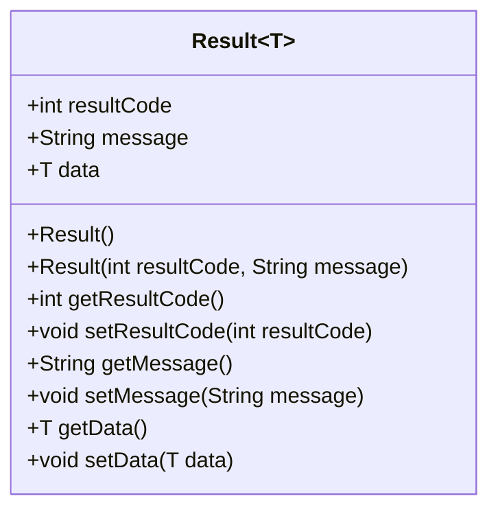
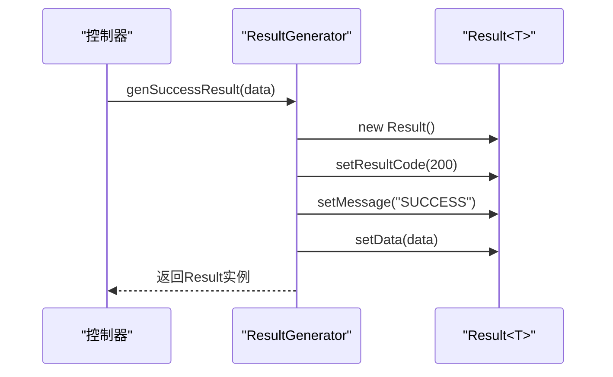
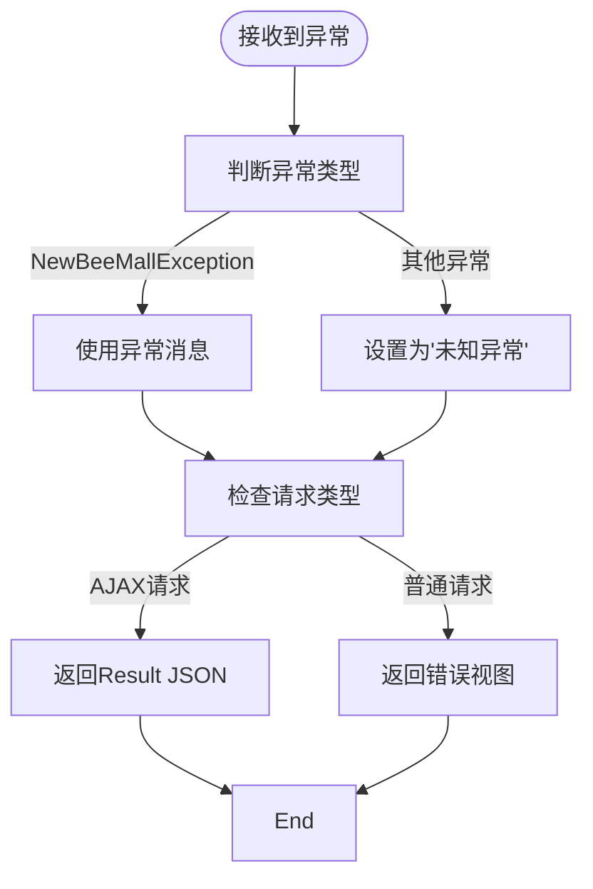

# 公共接口与响应规范

<cite>
**本文档引用文件**  
- [Result.java](file://src/main/java/ltd/newbee/mall/util/Result.java)
- [ResultGenerator.java](file://src/main/java/ltd/newbee/mall/util/ResultGenerator.java)
- [ServiceResultEnum.java](file://src/main/java/ltd/newbee/mall/common/ServiceResultEnum.java)
- [NewBeeMallExceptionHandler.java](file://src/main/java/ltd/newbee/mall/controller/common/NewBeeMallExceptionHandler.java)
- [NewBeeMallGoodsController.java](file://src/main/java/ltd/newbee/mall/controller/admin/NewBeeMallGoodsController.java)
- [PersonalController.java](file://src/main/java/ltd/newbee/mall/controller/mall/PersonalController.java)
</cite>

## 目录
1. [引言](#引言)
2. [统一响应数据结构](#统一响应数据结构)
3. [Result<T>泛型类设计](#resultt泛型类设计)
4. [ResultGenerator工具类](#resultgenerator工具类)
5. [常见resultCode值及其业务含义](#常见resultcode值及其业务含义)
6. [JSON响应示例](#json响应示例)
7. [前端解析与用户提示](#前端解析与用户提示)
8. [控制器中的强制应用](#控制器中的强制应用)
9. [异常处理机制](#异常处理机制)
10. [总结](#总结)

## 引言
本规范文档旨在定义新蜂商城（newbee-mall）系统的公共API响应格式，确保所有接口返回的数据结构统一、规范。通过定义标准化的响应体，提高前后端协作效率，降低集成成本，并为用户提供一致的体验。该规范基于`Result<T>`泛型类和`ResultGenerator`工具类实现，贯穿于所有控制器（Controller）中，是系统API设计的核心原则。

## 统一响应数据结构
系统所有API接口的响应数据均采用统一的三段式结构，包含状态码（resultCode）、消息（message）和数据（data）三个核心字段。这种设计模式使得客户端能够以一致的方式处理成功响应和错误情况，无需针对不同接口编写特殊逻辑。

```json
{
  "resultCode": 200,
  "message": "SUCCESS",
  "data": {}
}
```

**响应字段说明：**
- **resultCode**: 整数类型，表示请求的处理结果状态，如200表示成功，500表示服务器错误。
- **message**: 字符串类型，提供关于请求结果的可读性描述，用于前端展示给用户或日志记录。
- **data**: 泛型类型，携带实际的业务数据，当请求失败时通常为null。

**Section sources**
- [Result.java](file://src/main/java/ltd/newbee/mall/util/Result.java#L13-L15)

## Result<T>泛型类设计
`Result<T>`类是系统响应数据结构的核心实现，位于`ltd.newbee.mall.util`包中。该类实现了`Serializable`接口，确保响应对象可以被序列化为JSON格式进行网络传输。

### 核心字段
- **resultCode**: 私有整型字段，存储响应状态码。通过`getResultCode()`和`setResultCode()`方法进行访问和修改。
- **message**: 私有字符串字段，存储响应消息。通过`getMessage()`和`setMessage()`方法进行访问和修改。
- **data**: 私有泛型字段，存储实际的业务数据。通过`getData()`和`setData(T data)`方法进行访问和修改，支持任意类型的数据封装。

### 设计优势
使用泛型`<T>`允许`Result`类在不牺牲类型安全的前提下，灵活地封装各种类型的业务数据。例如，可以返回单个商品对象、商品列表或分页结果，而无需为每种数据类型创建不同的响应类。



**Diagram sources**
- [Result.java](file://src/main/java/ltd/newbee/mall/util/Result.java#L11-L57)

**Section sources**
- [Result.java](file://src/main/java/ltd/newbee/mall/util/Result.java#L11-L57)

## ResultGenerator工具类
`ResultGenerator`类是生成标准化响应的工具类，位于`ltd.newbee.mall.util`包中。它提供了一系列静态方法，简化了成功和失败响应的创建过程。

### 核心方法
- **genSuccessResult()**: 生成一个默认的成功响应，`resultCode`为200，`message`为"SUCCESS"。
- **genSuccessResult(String message)**: 生成一个带有自定义消息的成功响应。
- **genSuccessResult(Object data)**: 生成一个包含业务数据的成功响应，`message`为默认的"SUCCESS"。
- **genFailResult(String message)**: 生成一个失败响应，`resultCode`为500，`message`为传入的错误信息；若消息为空，则使用默认的"FAIL"。
- **genErrorResult(int code, String message)**: 生成一个自定义状态码和消息的错误响应，用于处理特定的业务异常。

### 使用场景
该工具类在所有控制器中被广泛使用，确保了响应格式的一致性。例如，在商品管理控制器中，查询商品列表成功后，调用`ResultGenerator.genSuccessResult(pageResult)`即可返回分页数据。



**Diagram sources**
- [ResultGenerator.java](file://src/main/java/ltd/newbee/mall/util/ResultGenerator.java#L13-L58)
- [NewBeeMallGoodsController.java](file://src/main/java/ltd/newbee/mall/controller/admin/NewBeeMallGoodsController.java#L142)

**Section sources**
- [ResultGenerator.java](file://src/main/java/ltd/newbee/mall/util/ResultGenerator.java#L13-L58)

## 常见resultCode值及其业务含义
系统定义了一套标准的`resultCode`值，用于标识不同的请求处理结果。这些值在`ResultGenerator`类和`ServiceResultEnum`枚举中被定义和引用。

### 标准状态码
| resultCode | 含义 | 使用场景 |
| :--- | :--- | :--- |
| 200 | 成功 | 所有成功的API调用 |
| 500 | 服务器错误 | 系统内部异常、数据库操作失败等 |

### 业务异常码
虽然`resultCode`主要使用200和500，但具体的业务错误信息通过`ServiceResultEnum`枚举的`result`字段传递。例如：
- **DATA_NOT_EXIST**: "未查询到记录！" - 当查询的数据不存在时使用。
- **SAME_CATEGORY_EXIST**: "已存在同级同名的分类！" - 在添加商品分类时发现重复名称。
- **LOGIN_NAME_NULL**: "请输入登录名！" - 用户登录时用户名为空。
- **GOODS_PUT_DOWN**: "商品已下架！" - 用户尝试访问已下架的商品详情。
- **SHOPPING_CART_ITEM_LIMIT_NUMBER_ERROR**: "超出单个商品的最大购买数量！" - 购物车中某商品数量超过限制。

这些枚举值在`ResultGenerator.genFailResult()`方法中被用作`message`参数，实现了业务错误的标准化。

**Section sources**
- [ResultGenerator.java](file://src/main/java/ltd/newbee/mall/util/ResultGenerator.java#L16-L17)
- [ServiceResultEnum.java](file://src/main/java/ltd/newbee/mall/common/ServiceResultEnum.java#L18-L76)

## JSON响应示例
以下展示了系统在正常和异常情况下的典型JSON响应格式。

### 正常数据返回
当API调用成功并返回数据时，响应如下：
```json
{
  "resultCode": 200,
  "message": "SUCCESS",
  "data": {
    "totalCount": 10,
    "pageSize": 10,
    "totalPage": 1,
    "currPage": 1,
    "list": [
      {
        "goodsId": 10001,
        "goodsName": "iPhone 13",
        "sellingPrice": 5999
      },
      {
        "goodsId": 10002,
        "goodsName": "Samsung Galaxy S21",
        "sellingPrice": 4999
      }
    ]
  }
}
```
此示例展示了商品列表查询的响应，`data`字段包含一个`PageResult`对象，其中`list`数组包含了具体的商品数据。

### 错误情况响应
当API调用失败时，响应如下：
```json
{
  "resultCode": 500,
  "message": "用户名已存在！",
  "data": null
}
```
此示例展示了用户注册时用户名重复的错误响应。`resultCode`为500，`message`字段明确指出了错误原因，`data`为null。

**Section sources**
- [Result.java](file://src/main/java/ltd/newbee/mall/util/Result.java#L13-L15)
- [ResultGenerator.java](file://src/main/java/ltd/newbee/mall/util/ResultGenerator.java#L41-L49)

## 前端解析与用户提示
前端应用通过解析`Result`对象的`resultCode`和`message`字段来决定用户界面的展示逻辑。

### 解析逻辑
1. **检查resultCode**: 前端首先检查`resultCode`是否为200。
2. **处理成功响应**: 如果`resultCode`为200，则从`data`字段提取业务数据并更新UI。
3. **处理失败响应**: 如果`resultCode`不为200，则直接将`message`字段的内容作为错误提示展示给用户。

### 用户提示实现
```javascript
fetch('/api/goods/list')
  .then(response => response.json())
  .then(result => {
    if (result.resultCode === 200) {
      // 成功：更新商品列表
      updateProductList(result.data.list);
    } else {
      // 失败：弹出错误提示
      alert(result.message);
    }
  })
  .catch(error => {
    // 网络错误等异常情况
    alert('网络请求失败，请检查网络连接');
  });
```
这种统一的处理模式简化了前端代码，提高了开发效率和用户体验的一致性。

**Section sources**
- [Result.java](file://src/main/java/ltd/newbee/mall/util/Result.java#L25-L38)

## 控制器中的强制应用
该响应规范在所有控制器中被强制应用，确保了API响应的一致性。无论是管理后台的REST API还是用户端的接口，都遵循相同的响应格式。

### 应用示例
在`NewBeeMallGoodsController`的`list`方法中：
```java
@RequestMapping(value = "/goods/list", method = RequestMethod.GET)
@ResponseBody
public Result list(@RequestParam Map<String, Object> params) {
    if (ObjectUtils.isEmpty(params.get("page")) || ObjectUtils.isEmpty(params.get("limit"))) {
        return ResultGenerator.genFailResult("参数异常！");
    }
    PageQueryUtil pageUtil = new PageQueryUtil(params);
    return ResultGenerator.genSuccessResult(newBeeMallGoodsService.getNewBeeMallGoodsPage(pageUtil));
}
```
此方法在参数校验失败时返回失败响应，在查询成功时返回包含分页数据的成功响应。

在`PersonalController`的`login`方法中：
```java
@PostMapping("/login")
@ResponseBody
public Result login(@RequestParam("loginName") String loginName, ...) {
    if (!StringUtils.hasText(loginName)) {
        return ResultGenerator.genFailResult(ServiceResultEnum.LOGIN_NAME_NULL.getResult());
    }
    ...
    if (ServiceResultEnum.SUCCESS.getResult().equals(loginResult)) {
        return ResultGenerator.genSuccessResult();
    }
    return ResultGenerator.genFailResult(loginResult);
}
```
登录接口根据业务逻辑返回成功或失败的标准化响应。

**Section sources**
- [NewBeeMallGoodsController.java](file://src/main/java/ltd/newbee/mall/controller/admin/NewBeeMallGoodsController.java#L137-L143)
- [PersonalController.java](file://src/main/java/ltd/newbee/mall/controller/mall/PersonalController.java#L64-L90)

## 异常处理机制
系统通过全局异常处理器`NewBeeMallExceptionHandler`来捕获未处理的异常，并将其转换为标准化的`Result`响应。

### 处理逻辑
- **自定义异常**: 如果抛出的是`NewBeeMallException`，则直接使用其消息作为`Result`的`message`字段。
- **未知异常**: 对于其他类型的异常，`message`字段设置为"未知异常"，并打印堆栈信息以便调试。

### 请求类型判断
处理器会检查HTTP请求头，判断请求是否为AJAX请求：
- **AJAX请求**: 返回`Result`对象的JSON串。
- **普通请求**: 返回错误视图（error view），提供更友好的错误页面。



**Diagram sources**
- [NewBeeMallExceptionHandler.java](file://src/main/java/ltd/newbee/mall/controller/common/NewBeeMallExceptionHandler.java#L25-L54)

**Section sources**
- [NewBeeMallExceptionHandler.java](file://src/main/java/ltd/newbee/mall/controller/common/NewBeeMallExceptionHandler.java#L25-L54)

## 总结
本规范通过`Result<T>`泛型类和`ResultGenerator`工具类，建立了一套完整、统一的API响应体系。该体系确保了所有接口返回的数据结构一致，简化了前后端的集成工作。通过定义标准的`resultCode`和丰富的`ServiceResultEnum`，系统能够清晰地传达各种成功和失败状态。全局异常处理器进一步保证了即使在发生未预期错误时，也能返回格式化的响应，提升了系统的健壮性和用户体验。所有控制器都强制应用此规范，是新蜂商城API设计的基石。