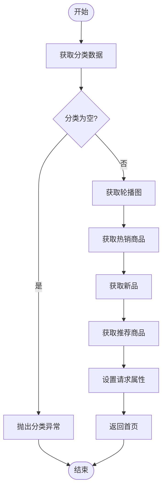

# 前台API

<cite>
**本文档中引用的文件**  
- [GoodsController.java](file://src/main/java/ltd/newbee/mall/controller/mall/GoodsController.java)
- [OrderController.java](file://src/main/java/ltd/newbee/mall/controller/mall/OrderController.java)
- [PersonalController.java](file://src/main/java/ltd/newbee/mall/controller/mall/PersonalController.java)
- [IndexController.java](file://src/main/java/ltd/newbee/mall/controller/mall/IndexController.java)
- [ShoppingCartController.java](file://src/main/java/ltd/newbee/mall/controller/mall/ShoppingCartController.java)
- [Result.java](file://src/main/java/ltd/newbee/mall/util/Result.java)
- [ResultGenerator.java](file://src/main/java/ltd/newbee/mall/util/ResultGenerator.java)
- [Constants.java](file://src/main/java/ltd/newbee/mall/common/Constants.java)
- [ServiceResultEnum.java](file://src/main/java/ltd/newbee/mall/common/ServiceResultEnum.java)
- [NewBeeMallGoodsService.java](file://src/main/java/ltd/newbee/mall/service/NewBeeMallGoodsService.java)
- [NewBeeMallGoodsDetailVO.java](file://src/main/java/ltd/newbee/mall/controller/vo/NewBeeMallGoodsDetailVO.java)
- [NewBeeMallShoppingCartItemVO.java](file://src/main/java/ltd/newbee/mall/controller/vo/NewBeeMallShoppingCartItemVO.java)
- [NewBeeMallUserVO.java](file://src/main/java/ltd/newbee/mall/controller/vo/NewBeeMallUserVO.java)
- [NewBeeMallLoginInterceptor.java](file://src/main/java/ltd/newbee/mall/interceptor/NewBeeMallLoginInterceptor.java)
</cite>

## 目录
1. [简介](#简介)
2. [项目结构](#项目结构)
3. [核心组件](#核心组件)
4. [架构概述](#架构概述)
5. [详细组件分析](#详细组件分析)
6. [依赖分析](#依赖分析)
7. [性能考虑](#性能考虑)
8. [故障排除指南](#故障排除指南)
9. [结论](#结论)

## 简介
本文档详细描述了newbee-mall前台商城API的完整接口规范，涵盖首页、商品、购物车、订单和用户模块的所有RESTful接口。文档重点说明了各端点的HTTP方法、URL路径、请求参数（路径、查询、表单）、请求体结构及响应格式。特别关注商品搜索与详情、购物车增删改查、订单创建与状态更新、用户注册登录等核心接口的行为规范。通过分析GoodsController、OrderController等实际代码，解释了接口如何通过Result类封装返回结果，以及Session机制在身份验证中的作用。文档提供了典型请求/响应示例，包括成功与错误场景，并说明了分页参数（page, limit）在列表接口中的使用方式，以及输入校验规则和安全性措施（如验证码验证）。

## 项目结构
newbee-mall项目采用典型的Spring Boot MVC架构，分为多个逻辑模块。前台商城API主要位于`src/main/java/ltd/newbee/mall/controller/mall/`目录下，包含处理商品、订单、购物车、用户等业务的控制器。核心组件包括控制器层（Controller）、服务层（Service）、数据访问层（DAO）和实体层（Entity）。工具类和常量定义在`util`和`common`包中，视图对象（VO）位于`controller/vo`包中。拦截器用于处理身份验证和权限控制。

**图示来源**  
- [IndexController.java](file://src/main/java/ltd/newbee/mall/controller/mall/IndexController.java)
- [GoodsController.java](file://src/main/java/ltd/newbee/mall/controller/mall/GoodsController.java)
- [OrderController.java](file://src/main/java/ltd/newbee/mall/controller/mall/OrderController.java)
- [ShoppingCartController.java](file://src/main/java/ltd/newbee/mall/controller/mall/ShoppingCartController.java)
- [PersonalController.java](file://src/main/java/ltd/newbee/mall/controller/mall/PersonalController.java)
- [ResultGenerator.java](file://src/main/java/ltd/newbee/mall/util/ResultGenerator.java)
- [NewBeeMallLoginInterceptor.java](file://src/main/java/ltd/newbee/mall/interceptor/NewBeeMallLoginInterceptor.java)

**章节来源**  
- [src/main/java/ltd/newbee/mall/controller/mall/](file://src/main/java/ltd/newbee/mall/controller/mall/)

## 核心组件
newbee-mall前台API的核心组件包括商品管理、购物车管理、订单处理、用户认证和个人中心等模块。这些组件通过RESTful接口提供服务，使用Result类统一封装响应结果。身份验证通过Session机制实现，关键操作需要用户登录。系统使用拦截器（NewBeeMallLoginInterceptor）来保护需要身份验证的接口。商品搜索和详情、购物车增删改查、订单创建与状态更新、用户注册登录等是系统的核心功能。

**章节来源**  
- [GoodsController.java](file://src/main/java/ltd/newbee/mall/controller/mall/GoodsController.java)
- [OrderController.java](file://src/main/java/ltd/newbee/mall/controller/mall/OrderController.java)
- [ShoppingCartController.java](file://src/main/java/ltd/newbee/mall/controller/mall/ShoppingCartController.java)
- [PersonalController.java](file://src/main/java/ltd/newbee/mall/controller/mall/PersonalController.java)

## 架构概述
newbee-mall前台API采用分层架构设计，遵循MVC模式。前端通过HTML页面发起请求，后端控制器接收请求并调用相应的服务层方法。服务层处理业务逻辑并调用数据访问层进行数据库操作。所有响应结果通过Result类统一封装，确保API返回格式的一致性。系统使用Spring MVC的拦截器机制实现身份验证，确保敏感操作的安全性。常量和枚举类用于统一管理系统配置和状态码。

**图示来源**  
- [GoodsController.java](file://src/main/java/ltd/newbee/mall/controller/mall/GoodsController.java)
- [NewBeeMallGoodsService.java](file://src/main/java/ltd/newbee/mall/service/NewBeeMallGoodsService.java)
- [NewBeeMallGoodsMapper.java](file://src/main/java/ltd/newbee/mall/dao/NewBeeMallGoodsMapper.java)

## 详细组件分析

### 商品模块分析
商品模块提供商品搜索和详情查看功能。搜索接口支持分页和分类过滤，详情接口验证商品上架状态。所有商品相关接口都遵循RESTful设计原则，使用标准的HTTP方法和状态码。

#### 商品搜索接口

**图示来源**  
- [GoodsController.java](file://src/main/java/ltd/newbee/mall/controller/mall/GoodsController.java#L40-L71)

#### 商品详情接口

**图示来源**  
- [GoodsController.java](file://src/main/java/ltd/newbee/mall/controller/mall/GoodsController.java#L74-L87)

**章节来源**  
- [GoodsController.java](file://src/main/java/ltd/newbee/mall/controller/mall/GoodsController.java)
- [NewBeeMallGoodsDetailVO.java](file://src/main/java/ltd/newbee/mall/controller/vo/NewBeeMallGoodsDetailVO.java)

### 订单模块分析
订单模块处理订单的创建、查询、取消和完成等操作。订单创建需要验证用户地址和购物车内容，状态更新操作需要验证用户权限和订单状态。

#### 订单创建流程

**图示来源**  
- [OrderController.java](file://src/main/java/ltd/newbee/mall/controller/mall/OrderController.java#L67-L82)

#### 订单状态更新接口

**图示来源**  
- [OrderController.java](file://src/main/java/ltd/newbee/mall/controller/mall/OrderController.java)
- [NewBeeMallOrderService.java](file://src/main/java/ltd/newbee/mall/service/NewBeeMallOrderService.java)
- [Result.java](file://src/main/java/ltd/newbee/mall/util/Result.java)

**章节来源**  
- [OrderController.java](file://src/main/java/ltd/newbee/mall/controller/mall/OrderController.java)
- [NewBeeMallOrderDetailVO.java](file://src/main/java/ltd/newbee/mall/controller/vo/NewBeeMallOrderDetailVO.java)

### 购物车模块分析
购物车模块提供购物车项的增删改查功能，支持结算流程。所有操作都需要用户身份验证。

#### 购物车操作接口

**图示来源**  
- [ShoppingCartController.java](file://src/main/java/ltd/newbee/mall/controller/mall/ShoppingCartController.java)
- [NewBeeMallShoppingCartService.java](file://src/main/java/ltd/newbee/mall/service/NewBeeMallShoppingCartService.java)
- [NewBeeMallShoppingCartItemVO.java](file://src/main/java/ltd/newbee/mall/controller/vo/NewBeeMallShoppingCartItemVO.java)
- [Result.java](file://src/main/java/ltd/newbee/mall/util/Result.java)

**章节来源**  
- [ShoppingCartController.java](file://src/main/java/ltd/newbee/mall/controller/mall/ShoppingCartController.java)
- [NewBeeMallShoppingCartItemVO.java](file://src/main/java/ltd/newbee/mall/controller/vo/NewBeeMallShoppingCartItemVO.java)

### 用户模块分析
用户模块处理用户注册、登录、信息更新等操作，包含验证码验证等安全措施。

#### 用户登录流程

**图示来源**  
- [PersonalController.java](file://src/main/java/ltd/newbee/mall/controller/mall/PersonalController.java#L62-L90)

#### 用户信息更新接口

**图示来源**  
- [PersonalController.java](file://src/main/java/ltd/newbee/mall/controller/mall/PersonalController.java)
- [NewBeeMallUserService.java](file://src/main/java/ltd/newbee/mall/service/NewBeeMallUserService.java)
- [MallUser.java](file://src/main/java/ltd/newbee/mall/entity/MallUser.java)
- [NewBeeMallUserVO.java](file://src/main/java/ltd/newbee/mall/controller/vo/NewBeeMallUserVO.java)
- [Result.java](file://src/main/java/ltd/newbee/mall/util/Result.java)

**章节来源**  
- [PersonalController.java](file://src/main/java/ltd/newbee/mall/controller/mall/PersonalController.java)
- [NewBeeMallUserVO.java](file://src/main/java/ltd/newbee/mall/controller/vo/NewBeeMallUserVO.java)

### 首页模块分析
首页模块提供首页数据的获取，包括轮播图、分类、热销商品、新品和推荐商品等。

#### 首页数据加载流程

**图示来源**  
- [IndexController.java](file://src/main/java/ltd/newbee/mall/controller/mall/IndexController.java#L40-L55)

**章节来源**  
- [IndexController.java](file://src/main/java/ltd/newbee/mall/controller/mall/IndexController.java)
- [NewBeeMallIndexCategoryVO.java](file://src/main/java/ltd/newbee/mall/controller/vo/NewBeeMallIndexCategoryVO.java)
- [NewBeeMallIndexCarouselVO.java](file://src/main/java/ltd/newbee/mall/controller/vo/NewBeeMallIndexCarouselVO.java)

## 依赖分析
newbee-mall前台API的各个组件之间存在明确的依赖关系。控制器层依赖服务层，服务层依赖数据访问层。公共组件如Result、ResultGenerator、Constants等被多个模块共享使用。身份验证拦截器被需要登录的控制器引用。

**图示来源**  
- [IndexController.java](file://src/main/java/ltd/newbee/mall/controller/mall/IndexController.java)
- [GoodsController.java](file://src/main/java/ltd/newbee/mall/controller/mall/GoodsController.java)
- [OrderController.java](file://src/main/java/ltd/newbee/mall/controller/mall/OrderController.java)
- [ShoppingCartController.java](file://src/main/java/ltd/newbee/mall/controller/mall/ShoppingCartController.java)
- [PersonalController.java](file://src/main/java/ltd/newbee/mall/controller/mall/PersonalController.java)
- [ResultGenerator.java](file://src/main/java/ltd/newbee/mall/util/ResultGenerator.java)
- [NewBeeMallLoginInterceptor.java](file://src/main/java/ltd/newbee/mall/interceptor/NewBeeMallLoginInterceptor.java)

**章节来源**  
- [src/main/java/ltd/newbee/mall/controller/mall/](file://src/main/java/ltd/newbee/mall/controller/mall/)
- [src/main/java/ltd/newbee/mall/util/](file://src/main/java/ltd/newbee/mall/util/)
- [src/main/java/ltd/newbee/mall/interceptor/](file://src/main/java/ltd/newbee/mall/interceptor/)

## 性能考虑
newbee-mall前台API在设计时考虑了性能优化。商品搜索和订单列表接口都实现了分页功能，避免一次性加载过多数据。常量类中定义了合理的分页大小，默认搜索页为10条，订单列表页为3条。购物车中商品数量也有限制，防止数据过大影响性能。系统使用VO（View Object）模式，只传输前端需要的数据，减少网络传输量。

## 故障排除指南
当API调用出现问题时，可以参考以下常见错误及其解决方案：

**章节来源**  
- [ServiceResultEnum.java](file://src/main/java/ltd/newbee/mall/common/ServiceResultEnum.java)
- [NewBeeMallException.java](file://src/main/java/ltd/newbee/mall/common/NewBeeMallException.java)

### 常见错误码
| 错误码 | 错误信息 | 可能原因 | 解决方案 |
|--------|---------|---------|---------|
| 500 | LOGIN_NAME_NULL | 登录名为空 | 检查请求中是否包含loginName参数 |
| 500 | LOGIN_PASSWORD_NULL | 密码为空 | 检查请求中是否包含password参数 |
| 500 | LOGIN_VERIFY_CODE_NULL | 验证码为空 | 检查请求中是否包含verifyCode参数 |
| 500 | LOGIN_VERIFY_CODE_ERROR | 验证码错误 | 重新获取验证码并正确输入 |
| 500 | NULL_ADDRESS_ERROR | 地址为空 | 用户需先设置收货地址 |
| 500 | SHOPPING_ITEM_ERROR | 购物车数据异常 | 检查购物车中是否有商品 |
| 500 | ORDER_STATUS_ERROR | 订单状态异常 | 检查订单当前状态是否允许操作 |
| 500 | NO_PERMISSION_ERROR | 无权限 | 检查操作用户是否为订单所有者 |
| 500 | GOODS_PUT_DOWN | 商品已下架 | 选择其他上架状态的商品 |

### 身份验证问题
如果遇到身份验证相关的问题，请检查：
1. 用户是否已登录
2. Session是否过期
3. 请求是否携带了正确的Cookie
4. 拦截器配置是否正确

### 数据验证问题
对于数据验证失败的情况，请确保：
1. 所有必填字段都已提供
2. 数据格式符合要求
3. 验证码正确输入
4. 购物车商品数量在允许范围内

## 结论
newbee-mall前台API设计合理，功能完整，遵循RESTful设计原则。系统通过Result类统一封装响应结果，确保API返回格式的一致性。身份验证通过Session机制和拦截器实现，保证了系统的安全性。各模块职责清晰，依赖关系明确，便于维护和扩展。通过详细的文档说明，开发者可以快速理解和使用API，提高开发效率。