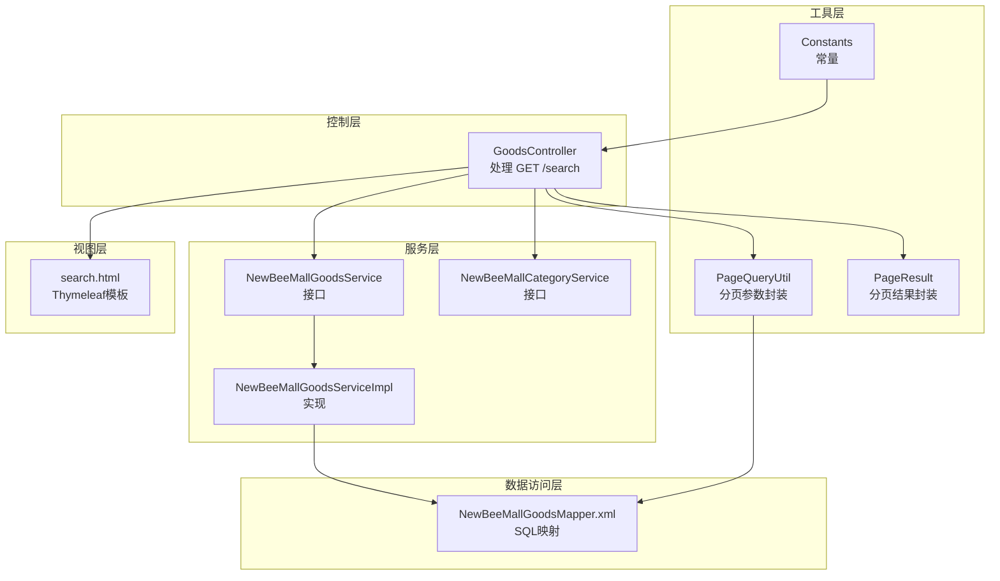
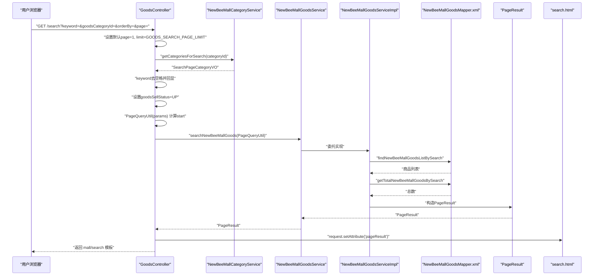
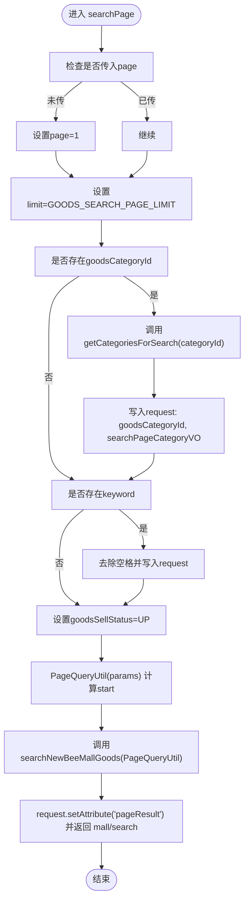
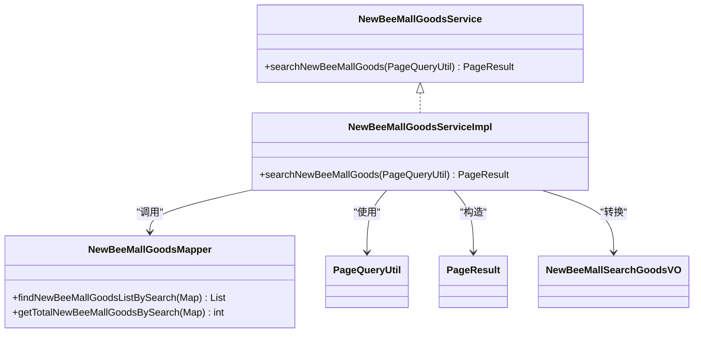
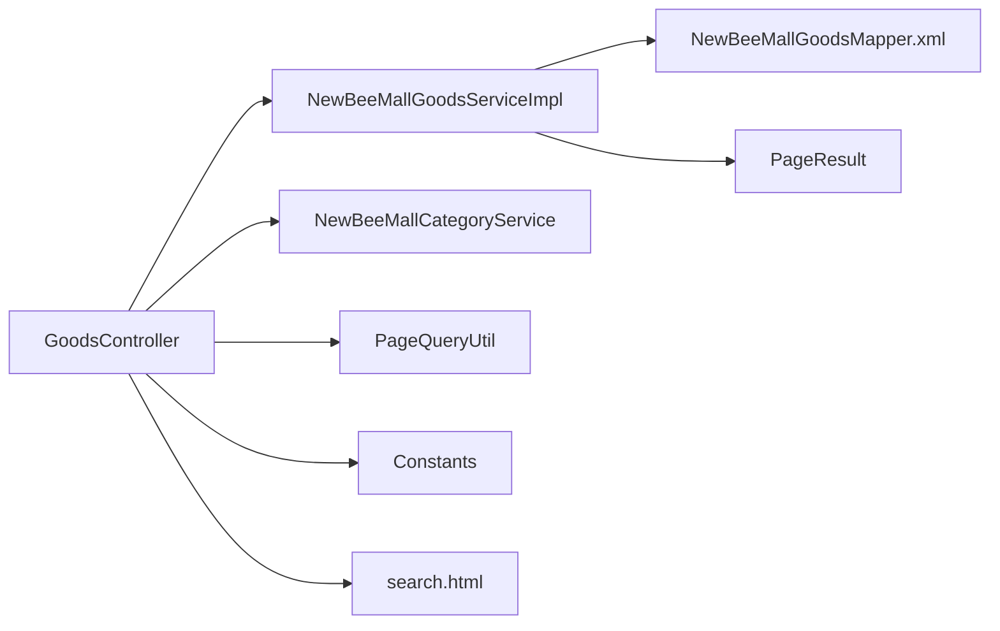

# 商品搜索

<cite>
**本文引用的文件**
- [GoodsController.java](file://src/main/java/ltd/newbee/mall/controller/mall/GoodsController.java)
- [NewBeeMallGoodsService.java](file://src/main/java/ltd/newbee/mall/service/NewBeeMallGoodsService.java)
- [NewBeeMallGoodsServiceImpl.java](file://src/main/java/ltd/newbee/mall/service/impl/NewBeeMallGoodsServiceImpl.java)
- [NewBeeMallCategoryService.java](file://src/main/java/ltd/newbee/mall/service/NewBeeMallCategoryService.java)
- [PageQueryUtil.java](file://src/main/java/ltd/newbee/mall/util/PageQueryUtil.java)
- [PageResult.java](file://src/main/java/ltd/newbee/mall/util/PageResult.java)
- [Constants.java](file://src/main/java/ltd/newbee/mall/common/Constants.java)
- [NewBeeMallGoodsMapper.xml](file://src/main/resources/mapper/NewBeeMallGoodsMapper.xml)
- [search.html](file://src/main/resources/templates/mall/search.html)
- [API.md](file://docs/API.md)
</cite>

## 目录
1. [简介](#简介)
2. [项目结构](#项目结构)
3. [核心组件](#核心组件)
4. [架构总览](#架构总览)
5. [详细组件分析](#详细组件分析)
6. [依赖关系分析](#依赖关系分析)
7. [性能考量](#性能考量)
8. [故障排查指南](#故障排查指南)
9. [结论](#结论)
10. [附录](#附录)

## 简介
本文件面向“newbee-mall”商品搜索API，聚焦于GET /search接口的实现机制与数据流。文档围绕以下关键点展开：
- 请求参数keyword（搜索关键词）、goodsCategoryId（分类ID）、orderBy（排序方式）、page（页码）的处理逻辑
- 控制器通过Map接收参数并使用PageQueryUtil进行分页封装
- 调用NewBeeMallGoodsService的searchNewBeeMallGoods方法执行搜索
- 参数默认值设置（如limit=Constants.GOODS_SEARCH_PAGE_LIMIT）
- 搜索条件过滤（仅查询上架商品）
- 分类面包屑数据封装（通过NewBeeMallCategoryService.getCategoriesForSearch）
- 搜索关键词的空格清理处理
- 页面属性设置与Thymeleaf模板渲染流程
- 前端通过request.setAttribute传递数据至模板

## 项目结构
与搜索功能直接相关的模块与文件如下：
- 控制层：GoodsController（处理GET /search）
- 服务层：NewBeeMallGoodsService接口及其实现NewBeeMallGoodsServiceImpl（搜索业务）
- 分类服务：NewBeeMallCategoryService（提供搜索页分类面包屑）
- 工具层：PageQueryUtil（分页参数封装）、PageResult（分页结果封装）、Constants（常量）
- 数据访问层：NewBeeMallGoodsMapper.xml（SQL映射）
- 视图层：search.html（Thymeleaf模板）

图表来源
- [GoodsController.java](file://src/main/java/ltd/newbee/mall/controller/mall/GoodsController.java#L40-L72)
- [NewBeeMallGoodsService.java](file://src/main/java/ltd/newbee/mall/service/NewBeeMallGoodsService.java#L66-L73)
- [NewBeeMallGoodsServiceImpl.java](file://src/main/java/ltd/newbee/mall/service/impl/NewBeeMallGoodsServiceImpl.java#L114-L137)
- [NewBeeMallCategoryService.java](file://src/main/java/ltd/newbee/mall/service/NewBeeMallCategoryService.java#L43-L49)
- [PageQueryUtil.java](file://src/main/java/ltd/newbee/mall/util/PageQueryUtil.java#L20-L30)
- [PageResult.java](file://src/main/java/ltd/newbee/mall/util/PageResult.java#L35-L41)
- [Constants.java](file://src/main/java/ltd/newbee/mall/common/Constants.java#L40-L46)
- [NewBeeMallGoodsMapper.xml](file://src/main/resources/mapper/NewBeeMallGoodsMapper.xml#L102-L151)
- [search.html](file://src/main/resources/templates/mall/search.html#L1-L111)

章节来源
- [GoodsController.java](file://src/main/java/ltd/newbee/mall/controller/mall/GoodsController.java#L40-L72)
- [NewBeeMallGoodsService.java](file://src/main/java/ltd/newbee/mall/service/NewBeeMallGoodsService.java#L66-L73)
- [NewBeeMallGoodsServiceImpl.java](file://src/main/java/ltd/newbee/mall/service/impl/NewBeeMallGoodsServiceImpl.java#L114-L137)
- [NewBeeMallCategoryService.java](file://src/main/java/ltd/newbee/mall/service/NewBeeMallCategoryService.java#L43-L49)
- [PageQueryUtil.java](file://src/main/java/ltd/newbee/mall/util/PageQueryUtil.java#L20-L30)
- [PageResult.java](file://src/main/java/ltd/newbee/mall/util/PageResult.java#L35-L41)
- [Constants.java](file://src/main/java/ltd/newbee/mall/common/Constants.java#L40-L46)
- [NewBeeMallGoodsMapper.xml](file://src/main/resources/mapper/NewBeeMallGoodsMapper.xml#L102-L151)
- [search.html](file://src/main/resources/templates/mall/search.html#L1-L111)

## 核心组件
- 控制器GoodsController.searchPage
  - 使用Map接收请求参数，设置默认page=1与limit=Constants.GOODS_SEARCH_PAGE_LIMIT
  - 对keyword进行空格清理并回显到页面
  - 过滤条件：仅查询上架商品（goodsSellStatus=SELL_STATUS_UP）
  - 分类面包屑：当存在goodsCategoryId时，调用NewBeeMallCategoryService.getCategoriesForSearch封装SearchPageCategoryVO
  - 分页封装：将参数交由PageQueryUtil构造start/limit/page
  - 调用NewBeeMallGoodsService.searchNewBeeMallGoods执行搜索并将结果以pageResult存入request
  - 返回模板mall/search

- 服务层NewBeeMallGoodsServiceImpl.searchNewBeeMallGoods
  - 通过Mapper执行SQL查询，统计总数，封装为PageResult
  - 将实体列表转换为NewBeeMallSearchGoodsVO并做字符串截断处理

- 分类服务NewBeeMallCategoryService.getCategoriesForSearch
  - 提供搜索页所需的分类面包屑数据结构SearchPageCategoryVO

- 工具类PageQueryUtil
  - 从Map读取page/limit，计算start=start=(page-1)*limit，并将start/page/limit写回Map

- 结果封装PageResult
  - 计算totalPage并提供getter/setter

- 常量Constants
  - GOODS_SEARCH_PAGE_LIMIT=10
  - SELL_STATUS_UP=0

章节来源
- [GoodsController.java](file://src/main/java/ltd/newbee/mall/controller/mall/GoodsController.java#L40-L72)
- [NewBeeMallGoodsServiceImpl.java](file://src/main/java/ltd/newbee/mall/service/impl/NewBeeMallGoodsServiceImpl.java#L114-L137)
- [NewBeeMallCategoryService.java](file://src/main/java/ltd/newbee/mall/service/NewBeeMallCategoryService.java#L43-L49)
- [PageQueryUtil.java](file://src/main/java/ltd/newbee/mall/util/PageQueryUtil.java#L20-L30)
- [PageResult.java](file://src/main/java/ltd/newbee/mall/util/PageResult.java#L35-L41)
- [Constants.java](file://src/main/java/ltd/newbee/mall/common/Constants.java#L40-L46)

## 架构总览
下面的序列图展示了从HTTP请求到Thymeleaf渲染的完整流程。

图表来源
- [GoodsController.java](file://src/main/java/ltd/newbee/mall/controller/mall/GoodsController.java#L40-L72)
- [NewBeeMallGoodsService.java](file://src/main/java/ltd/newbee/mall/service/NewBeeMallGoodsService.java#L66-L73)
- [NewBeeMallGoodsServiceImpl.java](file://src/main/java/ltd/newbee/mall/service/impl/NewBeeMallGoodsServiceImpl.java#L114-L137)
- [NewBeeMallGoodsMapper.xml](file://src/main/resources/mapper/NewBeeMallGoodsMapper.xml#L102-L151)
- [search.html](file://src/main/resources/templates/mall/search.html#L1-L111)

## 详细组件分析

### 控制器：GoodsController.searchPage
- 参数接收与默认值
  - 使用Map<String,Object> params接收所有查询参数
  - 若未传page则默认为1；固定limit=Constants.GOODS_SEARCH_PAGE_LIMIT
- 关键参数处理
  - keyword：去除前后空格后回显到页面并写入params
  - goodsSellStatus：强制设置为上架状态常量
  - orderBy：支持new（按发布时间降序）、price（按价格升序），其他情况默认按库存降序
  - goodsCategoryId：存在时调用分类服务生成面包屑SearchPageCategoryVO，并将categoryId与SearchPageCategoryVO写入request
- 分页封装
  - 通过PageQueryUtil(params)自动计算start=(page-1)*limit，并将page/limit/start写回Map
- 数据渲染
  - 调用searchNewBeeMallGoods返回PageResult，写入request.setAttribute("pageResult")
  - 返回模板mall/search

图表来源
- [GoodsController.java](file://src/main/java/ltd/newbee/mall/controller/mall/GoodsController.java#L40-L72)
- [Constants.java](file://src/main/java/ltd/newbee/mall/common/Constants.java#L40-L46)
- [PageQueryUtil.java](file://src/main/java/ltd/newbee/mall/util/PageQueryUtil.java#L20-L30)

章节来源
- [GoodsController.java](file://src/main/java/ltd/newbee/mall/controller/mall/GoodsController.java#L40-L72)
- [Constants.java](file://src/main/java/ltd/newbee/mall/common/Constants.java#L40-L46)
- [PageQueryUtil.java](file://src/main/java/ltd/newbee/mall/util/PageQueryUtil.java#L20-L30)

### 服务层：NewBeeMallGoodsServiceImpl.searchNewBeeMallGoods
- 查询逻辑
  - 通过Mapper执行findNewBeeMallGoodsListBySearch，传入PageQueryUtil封装的参数（包含keyword、goodsCategoryId、goodsSellStatus、orderBy、start、limit）
  - 统计总数getTotalNewBeeMallGoodsBySearch
  - 将实体列表复制为NewBeeMallSearchGoodsVO列表，并对名称与简介进行长度截断，避免显示溢出
- 结果封装
  - 使用PageResult(list,total,limit,page)构造分页结果对象

图表来源
- [NewBeeMallGoodsService.java](file://src/main/java/ltd/newbee/mall/service/NewBeeMallGoodsService.java#L66-L73)
- [NewBeeMallGoodsServiceImpl.java](file://src/main/java/ltd/newbee/mall/service/impl/NewBeeMallGoodsServiceImpl.java#L114-L137)
- [NewBeeMallGoodsMapper.xml](file://src/main/resources/mapper/NewBeeMallGoodsMapper.xml#L102-L151)

章节来源
- [NewBeeMallGoodsServiceImpl.java](file://src/main/java/ltd/newbee/mall/service/impl/NewBeeMallGoodsServiceImpl.java#L114-L137)
- [NewBeeMallGoodsMapper.xml](file://src/main/resources/mapper/NewBeeMallGoodsMapper.xml#L102-L151)

### 分类服务：NewBeeMallCategoryService.getCategoriesForSearch
- 功能：为搜索页提供分类面包屑数据结构SearchPageCategoryVO，包含一级、二级、三级分类及当前分类名称等
- 控制器在存在goodsCategoryId时调用该方法，并将结果写入request以便模板渲染

章节来源
- [NewBeeMallCategoryService.java](file://src/main/java/ltd/newbee/mall/service/NewBeeMallCategoryService.java#L43-L49)
- [GoodsController.java](file://src/main/java/ltd/newbee/mall/controller/mall/GoodsController.java#L47-L54)
- [SearchPageCategoryVO.java](file://src/main/java/ltd/newbee/mall/controller/vo/SearchPageCategoryVO.java#L1-L71)

### 分页工具：PageQueryUtil
- 作用：从Map读取page/limit，计算start=(page-1)*limit，并将start/page/limit写回Map，供Mapper使用
- 复杂度：O(1)，空间开销极小

章节来源
- [PageQueryUtil.java](file://src/main/java/ltd/newbee/mall/util/PageQueryUtil.java#L20-L30)

### 结果封装：PageResult
- 作用：承载分页结果，包含list、totalCount、pageSize、currPage、totalPage
- 复杂度：O(1)，主要用于模板渲染

章节来源
- [PageResult.java](file://src/main/java/ltd/newbee/mall/util/PageResult.java#L35-L41)

### 数据访问层：NewBeeMallGoodsMapper.xml
- 查询SQL
  - findNewBeeMallGoodsListBySearch：支持keyword模糊匹配（goods_name或goods_intro）、goodsCategoryId精确匹配、goodsSellStatus=UP过滤
  - orderBy支持new（按goods_id降序）、price（按selling_price升序），否则默认按stock_num降序
  - 通过start/limit实现分页
- 统计SQL
  - getTotalNewBeeMallGoodsBySearch：统计满足条件的商品总数

章节来源
- [NewBeeMallGoodsMapper.xml](file://src/main/resources/mapper/NewBeeMallGoodsMapper.xml#L102-L151)

### 视图层：search.html
- 面包屑渲染：当存在SearchPageCategoryVO时显示二级与三级分类链接；否则显示keyword搜索提示
- 排序切换：提供default/new/price三种排序方式的URL拼接
- 分页渲染：根据PageResult渲染上一页/下一页与页码跳转链接
- 商品列表：遍历pageResult.list输出封面图、名称、简介、价格

章节来源
- [search.html](file://src/main/resources/templates/mall/search.html#L1-L111)

## 依赖关系分析
- 控制器依赖
  - NewBeeMallGoodsService（搜索）、NewBeeMallCategoryService（分类）、PageQueryUtil（分页）、Constants（常量）
- 服务实现依赖
  - NewBeeMallGoodsMapper（SQL执行）、BeanUtil（对象复制）、PageResult（结果封装）
- 模板依赖
  - request.setAttribute("pageResult"/"keyword"/"goodsCategoryId"/"searchPageCategoryVO"/"orderBy")用于渲染

图表来源
- [GoodsController.java](file://src/main/java/ltd/newbee/mall/controller/mall/GoodsController.java#L40-L72)
- [NewBeeMallGoodsServiceImpl.java](file://src/main/java/ltd/newbee/mall/service/impl/NewBeeMallGoodsServiceImpl.java#L114-L137)
- [NewBeeMallGoodsMapper.xml](file://src/main/resources/mapper/NewBeeMallGoodsMapper.xml#L102-L151)
- [search.html](file://src/main/resources/templates/mall/search.html#L1-L111)

章节来源
- [GoodsController.java](file://src/main/java/ltd/newbee/mall/controller/mall/GoodsController.java#L40-L72)
- [NewBeeMallGoodsServiceImpl.java](file://src/main/java/ltd/newbee/mall/service/impl/NewBeeMallGoodsServiceImpl.java#L114-L137)
- [NewBeeMallGoodsMapper.xml](file://src/main/resources/mapper/NewBeeMallGoodsMapper.xml#L102-L151)
- [search.html](file://src/main/resources/templates/mall/search.html#L1-L111)

## 性能考量
- 分页参数
  - 默认每页10条（GOODS_SEARCH_PAGE_LIMIT=10），合理控制网络传输与前端渲染压力
- SQL优化
  - keyword使用LIKE模糊匹配，建议在goods_name与goods_intro建立合适的索引以提升检索效率
  - orderBy为多分支选择，注意在大数据量场景下对goods_id/selling_price/stock_num建立索引
- 结果集处理
  - 对名称与简介进行截断，减少DOM节点文本长度，提高页面渲染性能
- 缓存策略
  - 可考虑对热门关键词与热门分类的搜索结果进行缓存（需结合业务场景评估）

## 故障排查指南
- 关键参数缺失
  - page未传：控制器会默认page=1，确保分页正常
  - keyword为空：不会影响查询，但不会在面包屑中显示关键词
- 排序异常
  - orderBy非new/price时走默认排序（库存降序），如需调整可检查SQL分支
- 分类面包屑不显示
  - goodsCategoryId无效或分类服务返回null时不会写入request属性
- 搜索结果为空
  - 确认goodsSellStatus=UP过滤是否符合预期；检查keyword与goodsCategoryId组合条件
- 模板渲染问题
  - 确保request.setAttribute("pageResult")已正确设置；检查search.html中th:if/th:each语法

章节来源
- [GoodsController.java](file://src/main/java/ltd/newbee/mall/controller/mall/GoodsController.java#L40-L72)
- [NewBeeMallGoodsMapper.xml](file://src/main/resources/mapper/NewBeeMallGoodsMapper.xml#L102-L151)
- [search.html](file://src/main/resources/templates/mall/search.html#L1-L111)

## 结论
GET /search接口通过控制器统一处理请求参数、设置默认值与过滤条件，借助PageQueryUtil完成分页封装，再由服务层执行SQL查询与结果封装，最终通过Thymeleaf模板渲染。整体设计清晰、职责明确，具备良好的扩展性与可维护性。建议在生产环境中关注索引与缓存策略，以进一步提升搜索性能与用户体验。

## 附录
- API定义参考
  - 请求参数：keyword（关键词，可选）、goodsCategoryId（分类ID，可选）、orderBy（排序方式，可选，new/price）、page（页码，可选，默认1）
  - 响应：返回商品列表页面（mall/search）

章节来源
- [API.md](file://docs/API.md#L68-L81)