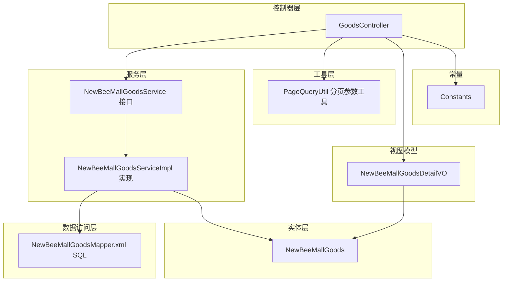
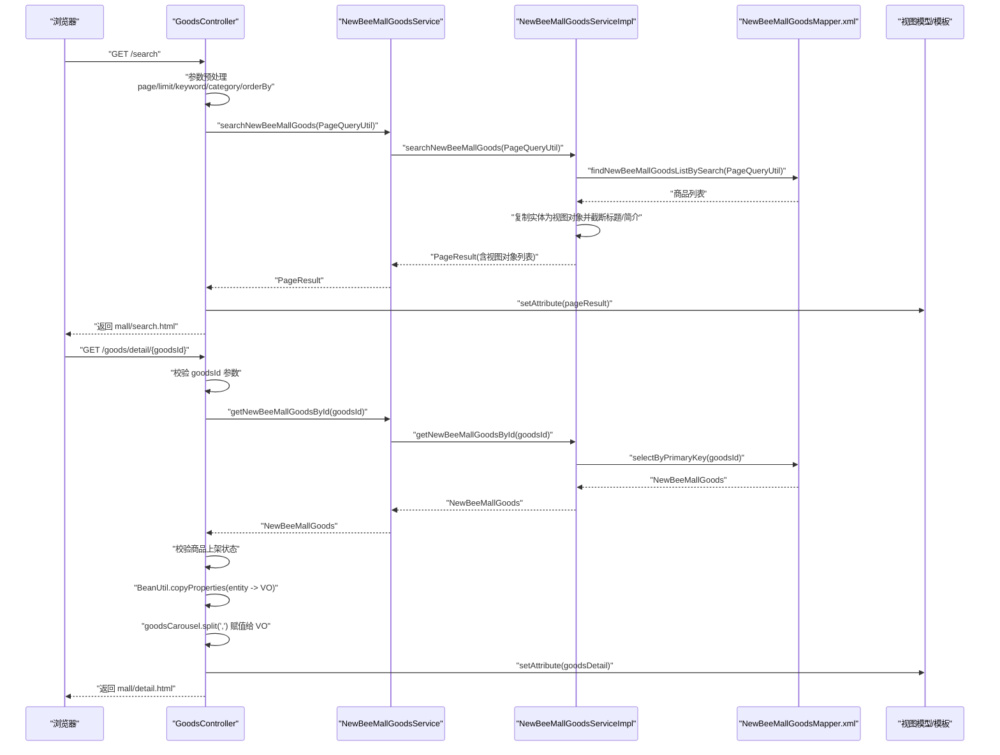
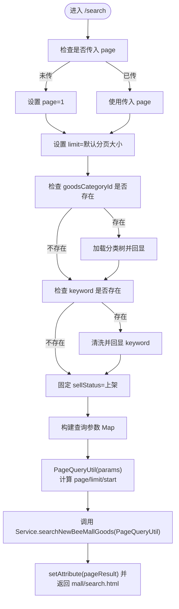
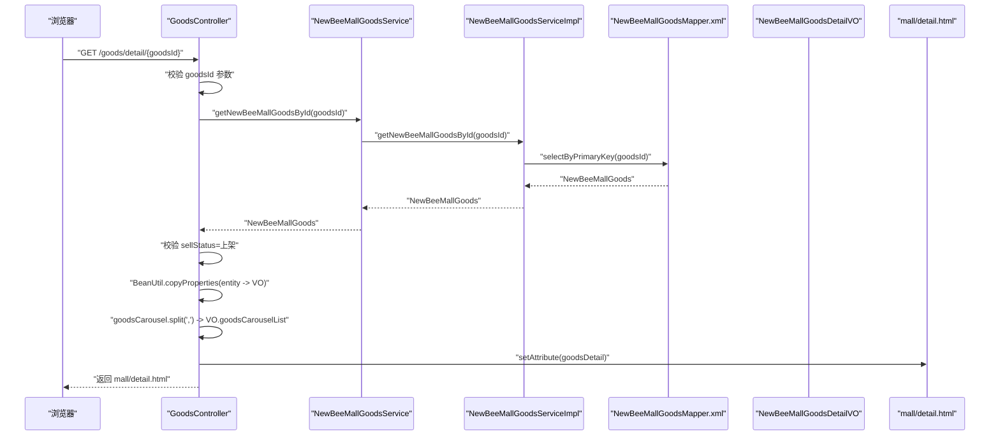
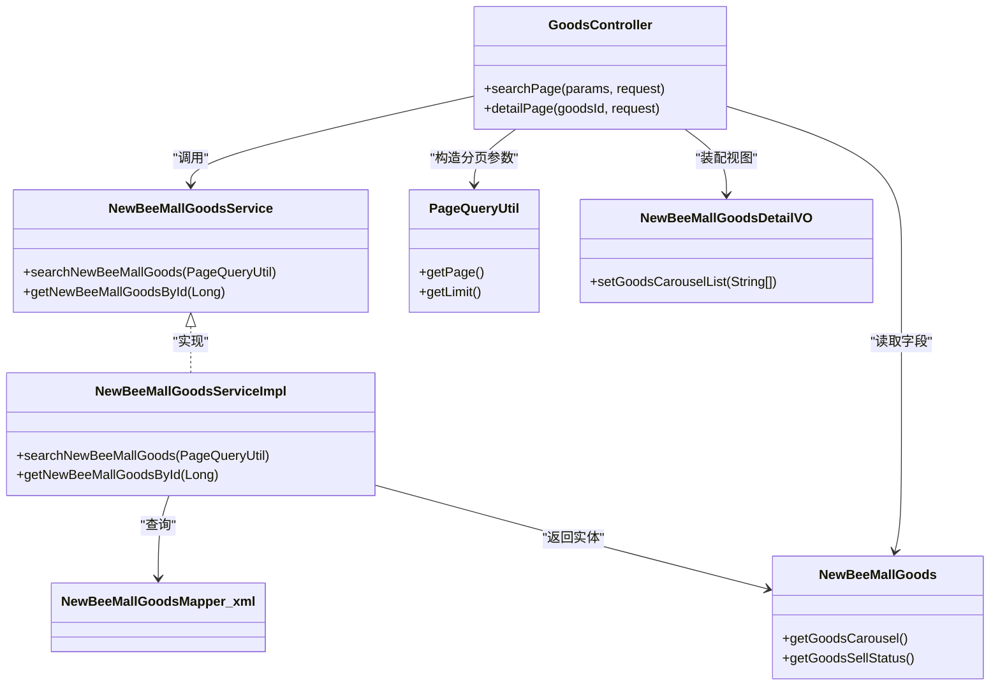

# 商品相关

<cite>
**本文引用的文件**
- [GoodsController.java](file://src/main/java/ltd/newbee/mall/controller/mall/GoodsController.java)
- [NewBeeMallGoodsService.java](file://src/main/java/ltd/newbee/mall/service/NewBeeMallGoodsService.java)
- [NewBeeMallGoodsServiceImpl.java](file://src/main/java/ltd/newbee/mall/service/impl/NewBeeMallGoodsServiceImpl.java)
- [PageQueryUtil.java](file://src/main/java/ltd/newbee/mall/util/PageQueryUtil.java)
- [NewBeeMallGoodsDetailVO.java](file://src/main/java/ltd/newbee/mall/controller/vo/NewBeeMallGoodsDetailVO.java)
- [NewBeeMallGoods.java](file://src/main/java/ltd/newbee/mall/entity/NewBeeMallGoods.java)
- [Constants.java](file://src/main/java/ltd/newbee/mall/common/Constants.java)
- [NewBeeMallGoodsMapper.xml](file://src/main/resources/mapper/NewBeeMallGoodsMapper.xml)
- [search.html](file://src/main/resources/templates/mall/search.html)
- [detail.html](file://src/main/resources/templates/mall/detail.html)
</cite>

## 目录
1. [简介](#简介)
2. [项目结构](#项目结构)
3. [核心组件](#核心组件)
4. [架构总览](#架构总览)
5. [详细组件分析](#详细组件分析)
6. [依赖关系分析](#依赖关系分析)
7. [性能考虑](#性能考虑)
8. [故障排查指南](#故障排查指南)
9. [结论](#结论)

## 简介
本文件面向“newbee-mall”商品相关API，聚焦两个核心接口：
- GET /search：商品搜索，支持关键词、分类、排序、分页等参数，返回搜索结果页
- GET /goods/detail/{goodsId}：商品详情，按路径参数获取商品详情，校验上架状态，并将实体转换为视图对象用于前端渲染

文档将详细说明请求参数、处理流程、分页机制、参数校验、业务异常处理，以及商品轮播图字符串分割的实现细节。

## 项目结构
围绕商品搜索与详情的关键代码位于以下层次：
- 控制器层：GoodsController 提供REST风格的页面控制器，负责参数接收、参数预处理、调用服务层、装配视图模型
- 服务层：NewBeeMallGoodsService 定义接口；NewBeeMallGoodsServiceImpl 实现搜索、分页、详情查询等
- 工具层：PageQueryUtil 将HTTP参数转换为分页查询参数（page、limit、start）
- 数据访问层：MyBatis映射文件 NewBeeMallGoodsMapper.xml 定义SQL查询与排序策略
- 视图模型：NewBeeMallGoodsDetailVO 作为商品详情的视图对象，承载前端渲染所需字段
- 实体层：NewBeeMallGoods 商品实体，包含轮播图字段
- 常量：Constants 定义默认分页大小、上下架状态等常量

图表来源
- [GoodsController.java](file://src/main/java/ltd/newbee/mall/controller/mall/GoodsController.java#L40-L90)
- [NewBeeMallGoodsService.java](file://src/main/java/ltd/newbee/mall/service/NewBeeMallGoodsService.java#L17-L73)
- [NewBeeMallGoodsServiceImpl.java](file://src/main/java/ltd/newbee/mall/service/impl/NewBeeMallGoodsServiceImpl.java#L100-L137)
- [PageQueryUtil.java](file://src/main/java/ltd/newbee/mall/util/PageQueryUtil.java#L14-L56)
- [NewBeeMallGoodsMapper.xml](file://src/main/resources/mapper/NewBeeMallGoodsMapper.xml#L102-L136)
- [NewBeeMallGoodsDetailVO.java](file://src/main/java/ltd/newbee/mall/controller/vo/NewBeeMallGoodsDetailVO.java#L1-L99)
- [NewBeeMallGoods.java](file://src/main/java/ltd/newbee/mall/entity/NewBeeMallGoods.java#L1-L202)
- [Constants.java](file://src/main/java/ltd/newbee/mall/common/Constants.java#L18-L48)

章节来源
- [GoodsController.java](file://src/main/java/ltd/newbee/mall/controller/mall/GoodsController.java#L40-L90)
- [NewBeeMallGoodsService.java](file://src/main/java/ltd/newbee/mall/service/NewBeeMallGoodsService.java#L17-L73)
- [NewBeeMallGoodsServiceImpl.java](file://src/main/java/ltd/newbee/mall/service/impl/NewBeeMallGoodsServiceImpl.java#L100-L137)
- [PageQueryUtil.java](file://src/main/java/ltd/newbee/mall/util/PageQueryUtil.java#L14-L56)
- [NewBeeMallGoodsMapper.xml](file://src/main/resources/mapper/NewBeeMallGoodsMapper.xml#L102-L136)
- [NewBeeMallGoodsDetailVO.java](file://src/main/java/ltd/newbee/mall/controller/vo/NewBeeMallGoodsDetailVO.java#L1-L99)
- [NewBeeMallGoods.java](file://src/main/java/ltd/newbee/mall/entity/NewBeeMallGoods.java#L1-L202)
- [Constants.java](file://src/main/java/ltd/newbee/mall/common/Constants.java#L18-L48)

## 核心组件
- GoodsController：提供/search与/goods/detail/{goodsId}两个页面控制器方法，负责参数预处理、调用服务层、装配视图模型并返回模板
- NewBeeMallGoodsService：定义搜索、分页、详情查询等接口
- NewBeeMallGoodsServiceImpl：实现搜索与分页查询，将实体列表转换为视图对象列表，并进行字符串截断优化
- PageQueryUtil：将HTTP参数转换为分页参数（page、limit、start），并注入到查询条件中
- NewBeeMallGoodsMapper.xml：定义搜索SQL、排序策略、分页起止位置
- NewBeeMallGoodsDetailVO：商品详情视图对象，包含轮播图数组字段
- NewBeeMallGoods：商品实体，包含轮播图字符串字段
- Constants：定义默认分页大小、上下架状态等常量

章节来源
- [GoodsController.java](file://src/main/java/ltd/newbee/mall/controller/mall/GoodsController.java#L40-L90)
- [NewBeeMallGoodsService.java](file://src/main/java/ltd/newbee/mall/service/NewBeeMallGoodsService.java#L17-L73)
- [NewBeeMallGoodsServiceImpl.java](file://src/main/java/ltd/newbee/mall/service/impl/NewBeeMallGoodsServiceImpl.java#L100-L137)
- [PageQueryUtil.java](file://src/main/java/ltd/newbee/mall/util/PageQueryUtil.java#L14-L56)
- [NewBeeMallGoodsMapper.xml](file://src/main/resources/mapper/NewBeeMallGoodsMapper.xml#L102-L136)
- [NewBeeMallGoodsDetailVO.java](file://src/main/java/ltd/newbee/mall/controller/vo/NewBeeMallGoodsDetailVO.java#L1-L99)
- [NewBeeMallGoods.java](file://src/main/java/ltd/newbee/mall/entity/NewBeeMallGoods.java#L1-L202)
- [Constants.java](file://src/main/java/ltd/newbee/mall/common/Constants.java#L18-L48)

## 架构总览
下面以序列图展示两个核心接口的调用链路与数据流。

图表来源
- [GoodsController.java](file://src/main/java/ltd/newbee/mall/controller/mall/GoodsController.java#L40-L90)
- [NewBeeMallGoodsService.java](file://src/main/java/ltd/newbee/mall/service/NewBeeMallGoodsService.java#L17-L73)
- [NewBeeMallGoodsServiceImpl.java](file://src/main/java/ltd/newbee/mall/service/impl/NewBeeMallGoodsServiceImpl.java#L100-L137)
- [NewBeeMallGoodsMapper.xml](file://src/main/resources/mapper/NewBeeMallGoodsMapper.xml#L102-L136)
- [NewBeeMallGoodsDetailVO.java](file://src/main/java/ltd/newbee/mall/controller/vo/NewBeeMallGoodsDetailVO.java#L1-L99)
- [NewBeeMallGoods.java](file://src/main/java/ltd/newbee/mall/entity/NewBeeMallGoods.java#L1-L202)

## 详细组件分析

### GET /search 商品搜索接口
- 请求路径：GET /search 或 /search.html
- 支持参数：
  - keyword：关键词，用于模糊匹配商品名称或简介
  - goodsCategoryId：分类ID，用于按分类过滤
  - orderBy：排序方式，可选值为 new（按发布时间倒序）、price（按售价升序）、默认（按库存降序）
  - page：页码，默认1
- 处理逻辑要点：
  - 若未传page，默认设为1
  - 设置limit为常量默认值（每页10条）
  - 若传入goodsCategoryId，封装分类数据到request作用域，供模板显示
  - 对keyword进行空值与空白过滤后回显并参与查询
  - 固定查询条件：仅查询上架状态的商品（SELL_STATUS_UP）
  - 使用PageQueryUtil封装分页参数（page、limit、start），并将keyword、categoryId、sellStatus等注入
  - 调用NewBeeMallGoodsService.searchNewBeeMallGoods(PageQueryUtil)执行搜索
  - 将PageResult放入request作用域，返回 mall/search.html

- 排序策略（来自Mapper XML）：
  - orderBy=new：按商品ID倒序（新品优先）
  - orderBy=price：按售价升序
  - 其他情况：默认按库存数量降序
  - 当存在分类ID时，按分类精确过滤
  - 关键词同时匹配商品名与简介

- 分页参数计算：
  - PageQueryUtil在构造时计算start=(page-1)*limit，并将page、limit、start写入参数映射，供Mapper使用

- 返回页面：
  - mall/search.html 展示分类筛选、排序切换、分页导航与商品卡片列表

图表来源
- [GoodsController.java](file://src/main/java/ltd/newbee/mall/controller/mall/GoodsController.java#L40-L72)
- [Constants.java](file://src/main/java/ltd/newbee/mall/common/Constants.java#L40-L46)
- [PageQueryUtil.java](file://src/main/java/ltd/newbee/mall/util/PageQueryUtil.java#L14-L56)
- [NewBeeMallGoodsServiceImpl.java](file://src/main/java/ltd/newbee/mall/service/impl/NewBeeMallGoodsServiceImpl.java#L114-L137)
- [NewBeeMallGoodsMapper.xml](file://src/main/resources/mapper/NewBeeMallGoodsMapper.xml#L102-L136)
- [search.html](file://src/main/resources/templates/mall/search.html#L43-L104)

章节来源
- [GoodsController.java](file://src/main/java/ltd/newbee/mall/controller/mall/GoodsController.java#L40-L72)
- [Constants.java](file://src/main/java/ltd/newbee/mall/common/Constants.java#L40-L46)
- [PageQueryUtil.java](file://src/main/java/ltd/newbee/mall/util/PageQueryUtil.java#L14-L56)
- [NewBeeMallGoodsServiceImpl.java](file://src/main/java/ltd/newbee/mall/service/impl/NewBeeMallGoodsServiceImpl.java#L114-L137)
- [NewBeeMallGoodsMapper.xml](file://src/main/resources/mapper/NewBeeMallGoodsMapper.xml#L102-L136)
- [search.html](file://src/main/resources/templates/mall/search.html#L43-L104)

### GET /goods/detail/{goodsId} 商品详情接口
- 请求路径：GET /goods/detail/{goodsId}
- 参数：
  - goodsId：路径参数，必须为正整数
- 处理逻辑要点：
  - 参数校验：goodsId < 1 抛出业务异常
  - 查询商品：调用NewBeeMallGoodsService.getNewBeeMallGoodsById(goodsId)
  - 上架状态校验：若商品状态非上架（SELL_STATUS_UP），抛出业务异常
  - 视图转换：使用BeanUtil将实体复制到NewBeeMallGoodsDetailVO
  - 轮播图处理：将实体中的goodsCarousel字符串按逗号分割为字符串数组，赋值给VO的goodsCarouselList
  - 返回 mall/detail.html，携带goodsDetail属性

- 异常处理：
  - 参数非法：直接抛出业务异常
  - 商品不存在：服务层在查询不到时抛出业务异常
  - 商品已下架：校验不通过时抛出业务异常

- 前端渲染：
  - mall/detail.html 读取goodsDetail中的字段（名称、简介、封面图、原价、现价、详情内容、轮播数组）进行展示

图表来源
- [GoodsController.java](file://src/main/java/ltd/newbee/mall/controller/mall/GoodsController.java#L74-L88)
- [NewBeeMallGoodsService.java](file://src/main/java/ltd/newbee/mall/service/NewBeeMallGoodsService.java#L50-L57)
- [NewBeeMallGoodsServiceImpl.java](file://src/main/java/ltd/newbee/mall/service/impl/NewBeeMallGoodsServiceImpl.java#L100-L107)
- [NewBeeMallGoodsMapper.xml](file://src/main/resources/mapper/NewBeeMallGoodsMapper.xml#L43-L50)
- [NewBeeMallGoodsDetailVO.java](file://src/main/java/ltd/newbee/mall/controller/vo/NewBeeMallGoodsDetailVO.java#L1-L99)
- [NewBeeMallGoods.java](file://src/main/java/ltd/newbee/mall/entity/NewBeeMallGoods.java#L1-L202)
- [detail.html](file://src/main/resources/templates/mall/detail.html#L20-L65)

章节来源
- [GoodsController.java](file://src/main/java/ltd/newbee/mall/controller/mall/GoodsController.java#L74-L88)
- [NewBeeMallGoodsService.java](file://src/main/java/ltd/newbee/mall/service/NewBeeMallGoodsService.java#L50-L57)
- [NewBeeMallGoodsServiceImpl.java](file://src/main/java/ltd/newbee/mall/service/impl/NewBeeMallGoodsServiceImpl.java#L100-L107)
- [NewBeeMallGoodsMapper.xml](file://src/main/resources/mapper/NewBeeMallGoodsMapper.xml#L43-L50)
- [NewBeeMallGoodsDetailVO.java](file://src/main/java/ltd/newbee/mall/controller/vo/NewBeeMallGoodsDetailVO.java#L1-L99)
- [NewBeeMallGoods.java](file://src/main/java/ltd/newbee/mall/entity/NewBeeMallGoods.java#L1-L202)
- [detail.html](file://src/main/resources/templates/mall/detail.html#L20-L65)

## 依赖关系分析
- 控制器依赖服务接口与工具类，服务实现依赖Mapper与实体
- PageQueryUtil与Mapper共同决定分页与起始偏移
- Mapper根据orderBy动态选择排序字段
- VO与Entity之间通过BeanUtil进行属性复制

图表来源
- [GoodsController.java](file://src/main/java/ltd/newbee/mall/controller/mall/GoodsController.java#L40-L90)
- [NewBeeMallGoodsService.java](file://src/main/java/ltd/newbee/mall/service/NewBeeMallGoodsService.java#L17-L73)
- [NewBeeMallGoodsServiceImpl.java](file://src/main/java/ltd/newbee/mall/service/impl/NewBeeMallGoodsServiceImpl.java#L100-L137)
- [PageQueryUtil.java](file://src/main/java/ltd/newbee/mall/util/PageQueryUtil.java#L14-L56)
- [NewBeeMallGoods.java](file://src/main/java/ltd/newbee/mall/entity/NewBeeMallGoods.java#L1-L202)
- [NewBeeMallGoodsDetailVO.java](file://src/main/java/ltd/newbee/mall/controller/vo/NewBeeMallGoodsDetailVO.java#L1-L99)
- [NewBeeMallGoodsMapper.xml](file://src/main/resources/mapper/NewBeeMallGoodsMapper.xml#L102-L136)

章节来源
- [GoodsController.java](file://src/main/java/ltd/newbee/mall/controller/mall/GoodsController.java#L40-L90)
- [NewBeeMallGoodsService.java](file://src/main/java/ltd/newbee/mall/service/NewBeeMallGoodsService.java#L17-L73)
- [NewBeeMallGoodsServiceImpl.java](file://src/main/java/ltd/newbee/mall/service/impl/NewBeeMallGoodsServiceImpl.java#L100-L137)
- [PageQueryUtil.java](file://src/main/java/ltd/newbee/mall/util/PageQueryUtil.java#L14-L56)
- [NewBeeMallGoods.java](file://src/main/java/ltd/newbee/mall/entity/NewBeeMallGoods.java#L1-L202)
- [NewBeeMallGoodsDetailVO.java](file://src/main/java/ltd/newbee/mall/controller/vo/NewBeeMallGoodsDetailVO.java#L1-L99)
- [NewBeeMallGoodsMapper.xml](file://src/main/resources/mapper/NewBeeMallGoodsMapper.xml#L102-L136)

## 性能考虑
- 分页参数：PageQueryUtil统一计算start=(page-1)*limit，避免重复计算
- 查询条件：搜索接口固定只查上架商品，减少无效数据扫描
- 排序策略：orderBy=new与orderBy=price分别走不同的索引/排序路径，建议在数据库层面为常用排序字段建立合适索引
- 字符串截断：服务层对商品名与简介进行截断，降低前端渲染压力
- 轮播图处理：一次性split为数组，避免多次字符串处理

[本节为通用性能建议，无需特定文件来源]

## 故障排查指南
- 参数异常
  - goodsId < 1：控制器直接抛出业务异常
  - 关键字为空：控制器会清空keyword并回显空字符串，不影响查询
- 商品不存在
  - 服务层在查询不到时抛出业务异常
- 商品已下架
  - 控制器校验sellStatus非上架时抛出业务异常
- 分页异常
  - page未传时自动设为1；limit使用默认常量；若传入非法数值，PageQueryUtil会尝试解析，建议确保传入合法数字
- 排序无效
  - orderBy仅支持 new、price 与默认；其他值将走默认库存降序
- 轮播图不显示
  - 确认实体goodsCarousel为逗号分隔的字符串；控制器会将其分割为数组赋值给VO

章节来源
- [GoodsController.java](file://src/main/java/ltd/newbee/mall/controller/mall/GoodsController.java#L74-L88)
- [NewBeeMallGoodsServiceImpl.java](file://src/main/java/ltd/newbee/mall/service/impl/NewBeeMallGoodsServiceImpl.java#L100-L107)
- [Constants.java](file://src/main/java/ltd/newbee/mall/common/Constants.java#L40-L46)
- [PageQueryUtil.java](file://src/main/java/ltd/newbee/mall/util/PageQueryUtil.java#L14-L56)
- [NewBeeMallGoodsMapper.xml](file://src/main/resources/mapper/NewBeeMallGoodsMapper.xml#L118-L133)

## 结论
- /search接口通过参数预处理、分页参数封装与排序策略，实现了灵活的商品检索与展示
- /goods/detail/{goodsId}接口在参数校验、状态校验与视图转换方面逻辑清晰，轮播图字符串分割细节完善
- 服务层对实体到视图对象的转换与字符串截断提升了前端渲染效率
- 建议在数据库层面为常用查询字段建立索引，进一步提升搜索性能