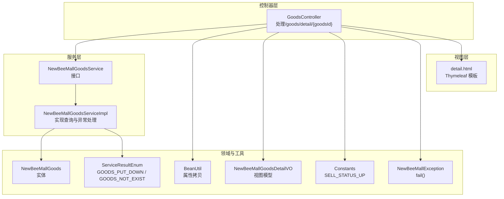
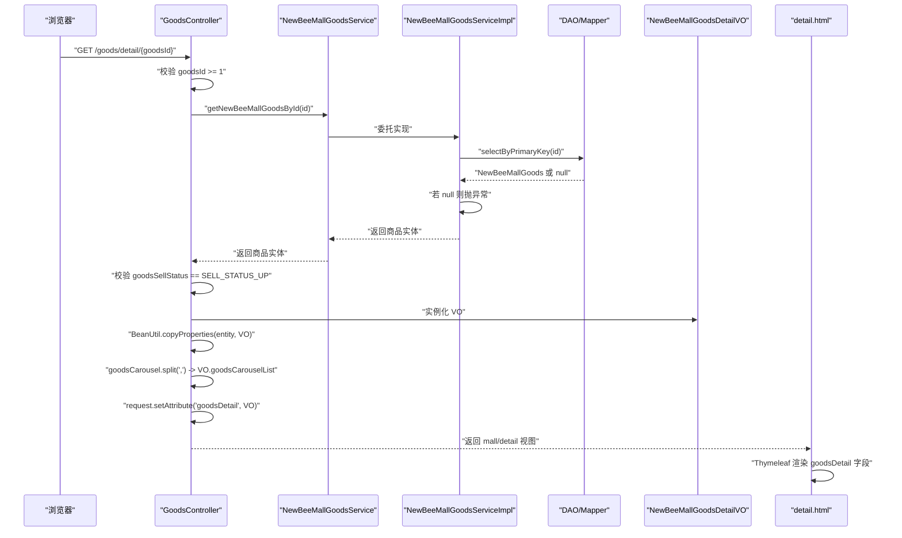
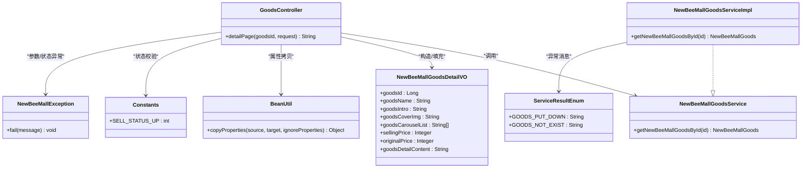

# 商品详情

<cite>
**本文引用的文件**
- [GoodsController.java](file://src/main/java/ltd/newbee/mall/controller/mall/GoodsController.java)
- [NewBeeMallGoodsService.java](file://src/main/java/ltd/newbee/mall/service/NewBeeMallGoodsService.java)
- [NewBeeMallGoodsServiceImpl.java](file://src/main/java/ltd/newbee/mall/service/impl/NewBeeMallGoodsServiceImpl.java)
- [NewBeeMallGoodsDetailVO.java](file://src/main/java/ltd/newbee/mall/controller/vo/NewBeeMallGoodsDetailVO.java)
- [Constants.java](file://src/main/java/ltd/newbee/mall/common/Constants.java)
- [BeanUtil.java](file://src/main/java/ltd/newbee/mall/util/BeanUtil.java)
- [NewBeeMallException.java](file://src/main/java/ltd/newbee/mall/common/NewBeeMallException.java)
- [ServiceResultEnum.java](file://src/main/java/ltd/newbee/mall/common/ServiceResultEnum.java)
- [NewBeeMallExceptionHandler.java](file://src/main/java/ltd/newbee/mall/controller/common/NewBeeMallExceptionHandler.java)
- [detail.html](file://src/main/resources/templates/mall/detail.html)
</cite>

## 目录
1. [简介](#简介)
2. [项目结构](#项目结构)
3. [核心组件](#核心组件)
4. [架构总览](#架构总览)
5. [详细组件分析](#详细组件分析)
6. [依赖分析](#依赖分析)
7. [性能考虑](#性能考虑)
8. [故障排查指南](#故障排查指南)
9. [结论](#结论)

## 简介
本文档围绕 newbee-mall 的“商品详情”功能，聚焦于 GET /goods/detail/{goodsId} 接口的完整执行链路与实现细节，包括：
- 路径参数 goodsId 的合法性校验（拒绝小于1的ID）
- 通过 NewBeeMallGoodsService.getNewBeeMallGoodsById 查询商品实体
- 商品上架状态验证（对比 Constants.SELL_STATUS_UP）
- NewBeeMallGoods 到 NewBeeMallGoodsDetailVO 的转换过程（BeanUtil.copyProperties 属性拷贝；goodsCarousel 字符串 split(",") 处理）
- 异常处理机制（NewBeeMallException.fail 抛出商品下架异常）
- VO 对象的数据结构设计目的
- 将 goodsDetailVO 设置到 request 作用域供 detail.html 模板使用
- 业务逻辑分层调用关系的代码示例路径

## 项目结构
商品详情相关代码分布在以下层次：
- 控制器层：GoodsController 提供 /goods/detail/{goodsId} 路由与视图渲染
- 服务层：NewBeeMallGoodsService 定义接口；NewBeeMallGoodsServiceImpl 实现查询与异常处理
- VO 层：NewBeeMallGoodsDetailVO 作为视图模型承载详情页所需字段
- 工具与常量：BeanUtil 提供属性拷贝；Constants 定义销售状态常量
- 异常与全局处理：NewBeeMallException 与 NewBeeMallExceptionHandler 统一异常处理
- 视图模板：detail.html 使用 Thymeleaf 读取 request 中的 goodsDetail

图表来源
- [GoodsController.java](file://src/main/java/ltd/newbee/mall/controller/mall/GoodsController.java#L74-L88)
- [NewBeeMallGoodsService.java](file://src/main/java/ltd/newbee/mall/service/NewBeeMallGoodsService.java#L50-L57)
- [NewBeeMallGoodsServiceImpl.java](file://src/main/java/ltd/newbee/mall/service/impl/NewBeeMallGoodsServiceImpl.java#L100-L107)
- [NewBeeMallGoodsDetailVO.java](file://src/main/java/ltd/newbee/mall/controller/vo/NewBeeMallGoodsDetailVO.java#L1-L99)
- [BeanUtil.java](file://src/main/java/ltd/newbee/mall/util/BeanUtil.java#L14-L20)
- [Constants.java](file://src/main/java/ltd/newbee/mall/common/Constants.java#L44-L46)
- [NewBeeMallException.java](file://src/main/java/ltd/newbee/mall/common/NewBeeMallException.java#L25-L27)
- [ServiceResultEnum.java](file://src/main/java/ltd/newbee/mall/common/ServiceResultEnum.java#L42-L44)
- [detail.html](file://src/main/resources/templates/mall/detail.html#L20-L65)

章节来源
- [GoodsController.java](file://src/main/java/ltd/newbee/mall/controller/mall/GoodsController.java#L74-L88)
- [NewBeeMallGoodsService.java](file://src/main/java/ltd/newbee/mall/service/NewBeeMallGoodsService.java#L50-L57)
- [NewBeeMallGoodsServiceImpl.java](file://src/main/java/ltd/newbee/mall/service/impl/NewBeeMallGoodsServiceImpl.java#L100-L107)
- [NewBeeMallGoodsDetailVO.java](file://src/main/java/ltd/newbee/mall/controller/vo/NewBeeMallGoodsDetailVO.java#L1-L99)
- [BeanUtil.java](file://src/main/java/ltd/newbee/mall/util/BeanUtil.java#L14-L20)
- [Constants.java](file://src/main/java/ltd/newbee/mall/common/Constants.java#L44-L46)
- [NewBeeMallException.java](file://src/main/java/ltd/newbee/mall/common/NewBeeMallException.java#L25-L27)
- [ServiceResultEnum.java](file://src/main/java/ltd/newbee/mall/common/ServiceResultEnum.java#L42-L44)
- [detail.html](file://src/main/resources/templates/mall/detail.html#L20-L65)

## 核心组件
- 控制器 GoodsController
  - 路由：GET /goods/detail/{goodsId}
  - 参数校验：拒绝 goodsId < 1
  - 业务调用：调用服务层获取商品实体
  - 状态校验：仅允许上架商品（SELL_STATUS_UP）
  - 数据转换：使用 BeanUtil.copyProperties 将实体复制到 VO，并将 goodsCarousel 字符串按逗号拆分为数组
  - 视图绑定：将 goodsDetailVO 放入 request 作用域，返回 mall/detail 视图
- 服务层 NewBeeMallGoodsService/Impl
  - 查询：getNewBeeMallGoodsById 返回实体或抛出异常
  - 异常：当商品不存在时抛出异常
- VO NewBeeMallGoodsDetailVO
  - 字段覆盖：goodsId、goodsName、goodsIntro、goodsCoverImg、goodsCarouselList、sellingPrice、originalPrice、goodsDetailContent
  - 设计目的：隔离持久层实体与前端展示，便于模板渲染与字段裁剪
- 工具与常量
  - BeanUtil.copyProperties：简化实体到 VO 的属性拷贝
  - Constants.SELL_STATUS_UP：统一销售状态常量
  - ServiceResultEnum.GOODS_PUT_DOWN / GOODS_NOT_EXIST：统一错误语义
  - NewBeeMallException.fail：快速抛出业务异常
- 视图 detail.html
  - 使用 Thymeleaf 从 request.getAttribute("goodsDetail") 读取 VO 并渲染

章节来源
- [GoodsController.java](file://src/main/java/ltd/newbee/mall/controller/mall/GoodsController.java#L74-L88)
- [NewBeeMallGoodsService.java](file://src/main/java/ltd/newbee/mall/service/NewBeeMallGoodsService.java#L50-L57)
- [NewBeeMallGoodsServiceImpl.java](file://src/main/java/ltd/newbee/mall/service/impl/NewBeeMallGoodsServiceImpl.java#L100-L107)
- [NewBeeMallGoodsDetailVO.java](file://src/main/java/ltd/newbee/mall/controller/vo/NewBeeMallGoodsDetailVO.java#L1-L99)
- [BeanUtil.java](file://src/main/java/ltd/newbee/mall/util/BeanUtil.java#L14-L20)
- [Constants.java](file://src/main/java/ltd/newbee/mall/common/Constants.java#L44-L46)
- [ServiceResultEnum.java](file://src/main/java/ltd/newbee/mall/common/ServiceResultEnum.java#L42-L44)
- [NewBeeMallException.java](file://src/main/java/ltd/newbee/mall/common/NewBeeMallException.java#L25-L27)
- [detail.html](file://src/main/resources/templates/mall/detail.html#L20-L65)

## 架构总览
下图展示了从客户端请求到页面渲染的端到端流程，涵盖参数校验、服务查询、状态判断、数据转换与视图绑定。

图表来源
- [GoodsController.java](file://src/main/java/ltd/newbee/mall/controller/mall/GoodsController.java#L74-L88)
- [NewBeeMallGoodsService.java](file://src/main/java/ltd/newbee/mall/service/NewBeeMallGoodsService.java#L50-L57)
- [NewBeeMallGoodsServiceImpl.java](file://src/main/java/ltd/newbee/mall/service/impl/NewBeeMallGoodsServiceImpl.java#L100-L107)
- [BeanUtil.java](file://src/main/java/ltd/newbee/mall/util/BeanUtil.java#L14-L20)
- [detail.html](file://src/main/resources/templates/mall/detail.html#L20-L65)

## 详细组件分析

### 控制器层：GoodsController
- 路由与参数校验
  - 使用 @PathVariable("goodsId") 接收路径参数
  - 当 goodsId < 1 时，调用 NewBeeMallException.fail 抛出参数异常
- 业务调用与状态校验
  - 调用服务层 getNewBeeMallGoodsById 获取实体
  - 对比 Constants.SELL_STATUS_UP，若不等于则抛出 ServiceResultEnum.GOODS_PUT_DOWN 的异常信息
- 数据转换与视图绑定
  - 实例化 NewBeeMallGoodsDetailVO
  - 使用 BeanUtil.copyProperties 完成属性拷贝
  - 将 goodsCarousel 字符串按逗号拆分为数组后赋值给 VO
  - 将 goodsDetailVO 放入 request 作用域，返回 mall/detail 视图

章节来源
- [GoodsController.java](file://src/main/java/ltd/newbee/mall/controller/mall/GoodsController.java#L74-L88)
- [Constants.java](file://src/main/java/ltd/newbee/mall/common/Constants.java#L44-L46)
- [NewBeeMallException.java](file://src/main/java/ltd/newbee/mall/common/NewBeeMallException.java#L25-L27)
- [ServiceResultEnum.java](file://src/main/java/ltd/newbee/mall/common/ServiceResultEnum.java#L42-L44)
- [BeanUtil.java](file://src/main/java/ltd/newbee/mall/util/BeanUtil.java#L14-L20)
- [NewBeeMallGoodsDetailVO.java](file://src/main/java/ltd/newbee/mall/controller/vo/NewBeeMallGoodsDetailVO.java#L1-L99)

### 服务层：NewBeeMallGoodsService/Impl
- 接口职责
  - 定义 getNewBeeMallGoodsById(id) 方法，供控制器调用
- 实现要点
  - 通过 Mapper 查询实体
  - 若实体为空，抛出异常（异常消息来自 ServiceResultEnum.GOODS_NOT_EXIST）
  - 返回实体供控制器进一步校验与转换

章节来源
- [NewBeeMallGoodsService.java](file://src/main/java/ltd/newbee/mall/service/NewBeeMallGoodsService.java#L50-L57)
- [NewBeeMallGoodsServiceImpl.java](file://src/main/java/ltd/newbee/mall/service/impl/NewBeeMallGoodsServiceImpl.java#L100-L107)
- [ServiceResultEnum.java](file://src/main/java/ltd/newbee/mall/common/ServiceResultEnum.java#L42-L44)

### VO 层：NewBeeMallGoodsDetailVO
- 字段设计
  - 商品标识与名称、简介、封面图
  - 销售价与原价
  - 商品详情富文本内容
  - 轮播图数组 goodsCarouselList
- 设计目的
  - 隔离实体与视图，避免直接暴露数据库字段
  - 便于模板渲染与字段裁剪（例如将逗号分隔的字符串拆分为数组）

章节来源
- [NewBeeMallGoodsDetailVO.java](file://src/main/java/ltd/newbee/mall/controller/vo/NewBeeMallGoodsDetailVO.java#L1-L99)

### 工具与常量：BeanUtil、Constants
- BeanUtil.copyProperties
  - 简化实体到 VO 的属性拷贝，减少样板代码
- Constants.SELL_STATUS_UP
  - 统一销售状态常量，避免魔法数字

章节来源
- [BeanUtil.java](file://src/main/java/ltd/newbee/mall/util/BeanUtil.java#L14-L20)
- [Constants.java](file://src/main/java/ltd/newbee/mall/common/Constants.java#L44-L46)

### 异常处理：NewBeeMallException 与全局处理器
- NewBeeMallException.fail
  - 快速抛出业务异常，携带友好消息
- 全局异常处理器 NewBeeMallExceptionHandler
  - 区分自定义异常与未知异常
  - AJAX 请求返回 JSON 结果；非 AJAX 请求返回 error 视图
  - 在 detail.html 中，若发生异常，最终由全局处理器接管并返回错误页面

章节来源
- [NewBeeMallException.java](file://src/main/java/ltd/newbee/mall/common/NewBeeMallException.java#L25-L27)
- [NewBeeMallExceptionHandler.java](file://src/main/java/ltd/newbee/mall/controller/common/NewBeeMallExceptionHandler.java#L25-L55)
- [ServiceResultEnum.java](file://src/main/java/ltd/newbee/mall/common/ServiceResultEnum.java#L42-L44)

### 视图层：detail.html
- 使用 Thymeleaf 从 request.getAttribute("goodsDetail") 读取 VO
- 渲染商品封面图、名称、简介、价格、详情富文本等
- 通过 goodsDetail.goodsId 传递到前端交互函数

章节来源
- [detail.html](file://src/main/resources/templates/mall/detail.html#L20-L65)

## 依赖分析
- 控制器依赖服务接口与 VO 类型
- 服务实现依赖 DAO/Mapper 与枚举常量
- 控制器依赖工具 BeanUtil 与异常类型
- 视图依赖 request 中的 goodsDetail

图表来源
- [GoodsController.java](file://src/main/java/ltd/newbee/mall/controller/mall/GoodsController.java#L74-L88)
- [NewBeeMallGoodsService.java](file://src/main/java/ltd/newbee/mall/service/NewBeeMallGoodsService.java#L50-L57)
- [NewBeeMallGoodsServiceImpl.java](file://src/main/java/ltd/newbee/mall/service/impl/NewBeeMallGoodsServiceImpl.java#L100-L107)
- [NewBeeMallGoodsDetailVO.java](file://src/main/java/ltd/newbee/mall/controller/vo/NewBeeMallGoodsDetailVO.java#L1-L99)
- [BeanUtil.java](file://src/main/java/ltd/newbee/mall/util/BeanUtil.java#L14-L20)
- [Constants.java](file://src/main/java/ltd/newbee/mall/common/Constants.java#L44-L46)
- [NewBeeMallException.java](file://src/main/java/ltd/newbee/mall/common/NewBeeMallException.java#L25-L27)
- [ServiceResultEnum.java](file://src/main/java/ltd/newbee/mall/common/ServiceResultEnum.java#L42-L44)

## 性能考虑
- 查询效率：getNewBeeMallGoodsById 为单条主键查询，复杂度 O(1)，建议确保 goods_id 建有索引
- 属性拷贝成本：BeanUtil.copyProperties 为浅拷贝，开销极低
- 字符串拆分：goodsCarousel.split(",") 为线性扫描，复杂度 O(n)，在商品轮播图数量有限的情况下可忽略
- 视图渲染：detail.html 通过 Thymeleaf 渲染，注意避免在模板中进行复杂计算

## 故障排查指南
- 参数非法
  - 现象：抛出参数异常
  - 排查：确认 goodsId >= 1
  - 参考路径：[GoodsController.java](file://src/main/java/ltd/newbee/mall/controller/mall/GoodsController.java#L74-L88)
- 商品不存在
  - 现象：服务层抛出异常（消息来自 ServiceResultEnum.GOODS_NOT_EXIST）
  - 排查：确认数据库中是否存在对应 ID 的商品
  - 参考路径：[NewBeeMallGoodsServiceImpl.java](file://src/main/java/ltd/newbee/mall/service/impl/NewBeeMallGoodsServiceImpl.java#L100-L107)
- 商品已下架
  - 现象：抛出“商品已下架”异常
  - 排查：确认商品销售状态为上架（SELL_STATUS_UP）
  - 参考路径：[GoodsController.java](file://src/main/java/ltd/newbee/mall/controller/mall/GoodsController.java#L74-L88)，[Constants.java](file://src/main/java/ltd/newbee/mall/common/Constants.java#L44-L46)
- 视图未显示
  - 现象：detail.html 页面空白或字段缺失
  - 排查：确认控制器已将 goodsDetailVO 放入 request 作用域
  - 参考路径：[GoodsController.java](file://src/main/java/ltd/newbee/mall/controller/mall/GoodsController.java#L74-L88)，[detail.html](file://src/main/resources/templates/mall/detail.html#L20-L65)
- 全局异常处理
  - 现象：AJAX 请求返回 JSON，非 AJAX 请求返回错误页面
  - 排查：检查请求头 Content-Type/Accept/X-Requested-With
  - 参考路径：[NewBeeMallExceptionHandler.java](file://src/main/java/ltd/newbee/mall/controller/common/NewBeeMallExceptionHandler.java#L25-L55)

## 结论
商品详情接口通过清晰的分层设计实现了从参数校验、服务查询、状态判断到数据转换与视图绑定的完整闭环。VO 的引入提升了前后端解耦与渲染灵活性；BeanUtil 的属性拷贝降低了重复代码；全局异常处理保证了错误信息的一致性与用户体验。建议在后续迭代中关注数据库索引优化与模板渲染性能，以进一步提升整体响应速度与稳定性。