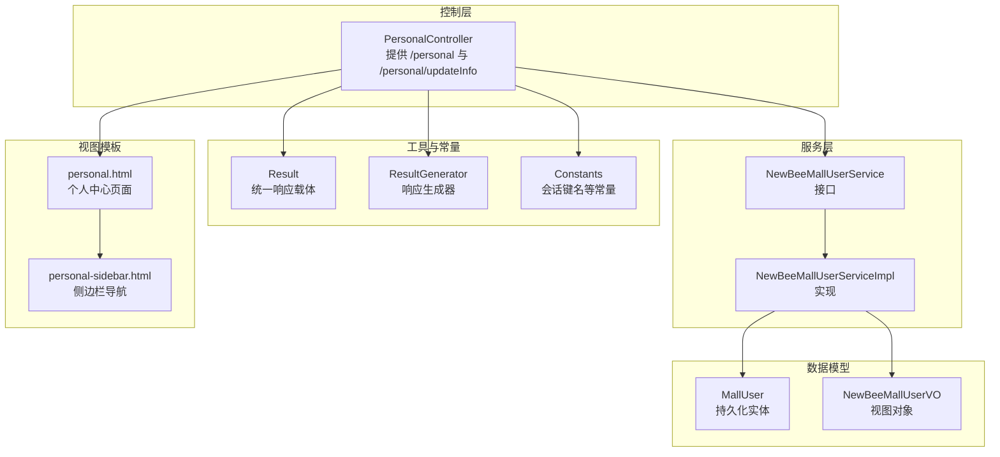
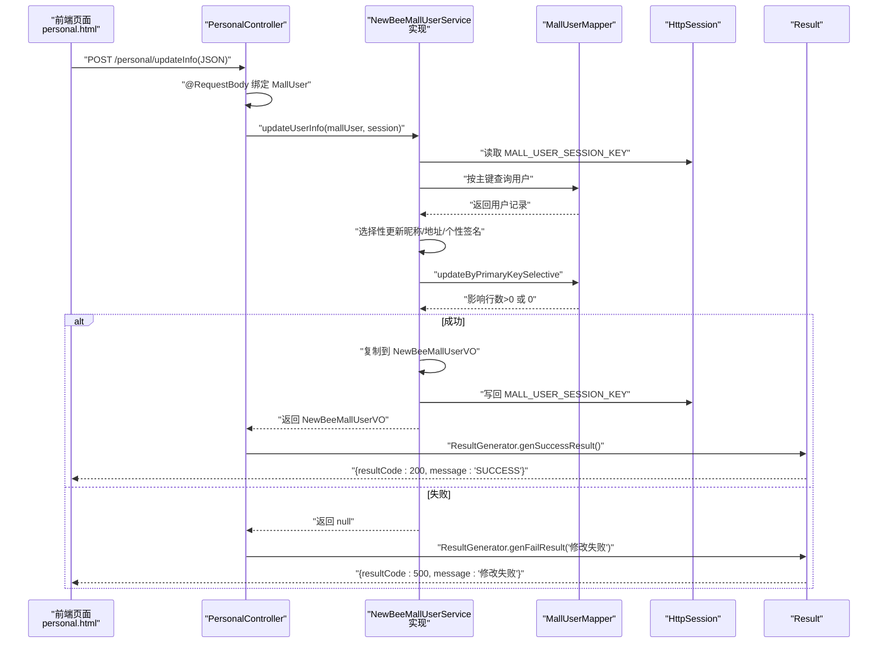
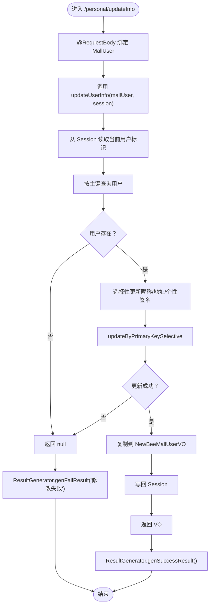
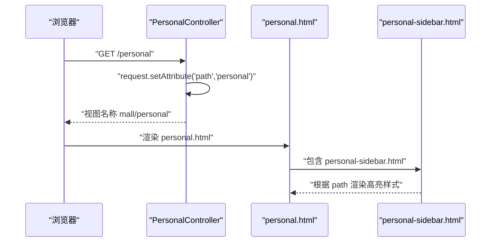
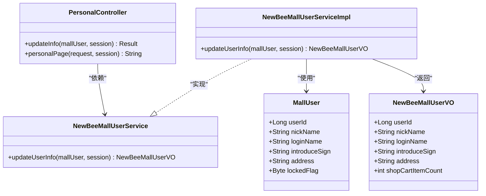
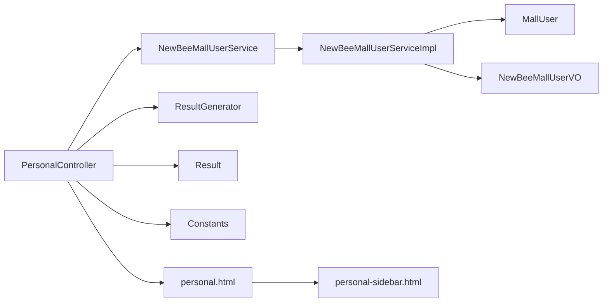

# 用户信息管理

<cite>
**本文引用的文件**
- [PersonalController.java](file://src/main/java/ltd/newbee/mall/controller/mall/PersonalController.java)
- [NewBeeMallUserService.java](file://src/main/java/ltd/newbee/mall/service/NewBeeMallUserService.java)
- [NewBeeMallUserServiceImpl.java](file://src/main/java/ltd/newbee/mall/service/impl/NewBeeMallUserServiceImpl.java)
- [MallUser.java](file://src/main/java/ltd/newbee/mall/entity/MallUser.java)
- [NewBeeMallUserVO.java](file://src/main/java/ltd/newbee/mall/controller/vo/NewBeeMallUserVO.java)
- [Result.java](file://src/main/java/ltd/newbee/mall/util/Result.java)
- [ResultGenerator.java](file://src/main/java/ltd/newbee/mall/util/ResultGenerator.java)
- [Constants.java](file://src/main/java/ltd/newbee/mall/common/Constants.java)
- [personal.html](file://src/main/resources/templates/mall/personal.html)
- [personal-sidebar.html](file://src/main/resources/templates/mall/personal-sidebar.html)
</cite>

## 目录
1. [简介](#简介)
2. [项目结构](#项目结构)
3. [核心组件](#核心组件)
4. [架构总览](#架构总览)
5. [详细组件分析](#详细组件分析)
6. [依赖关系分析](#依赖关系分析)
7. [性能考量](#性能考量)
8. [故障排查指南](#故障排查指南)
9. [结论](#结论)
10. [附录](#附录)

## 简介
本文件聚焦于newbee-mall的用户信息管理API，重点说明以下两个方面：
- POST /personal/updateInfo 接口：接收包含用户信息的JSON数据，通过@RequestBody绑定到MallUser实体对象；该请求调用NewBeeMallUserService.updateUserInfo方法，将更新后的用户信息（NewBeeMallUserVO）同步回Session；接口响应机制为：更新成功返回通用成功结果，失败则返回“修改失败”的错误信息。
- GET /personal 接口：负责渲染个人中心页面，并设置“path”属性用于前端导航高亮。

## 项目结构
围绕用户信息管理的相关模块组织如下：
- 控制层：PersonalController 提供 /personal 页面路由、登录/注册/登出等接口，其中包含 /personal/updateInfo 的处理逻辑。
- 服务层：NewBeeMallUserService 定义用户信息服务契约；NewBeeMallUserServiceImpl 实现用户信息更新、登录、注册等业务逻辑。
- 数据模型：MallUser 为持久化实体；NewBeeMallUserVO 为视图层对象，用于Session存储与前后端交互。
- 工具与常量：Result/ResultGenerator 统一响应结构；Constants 定义Session键名等常量。
- 视图模板：personal.html 与 personal-sidebar.html 负责个人中心页面渲染与导航高亮。

图表来源
- [PersonalController.java](file://src/main/java/ltd/newbee/mall/controller/mall/PersonalController.java#L1-L137)
- [NewBeeMallUserService.java](file://src/main/java/ltd/newbee/mall/service/NewBeeMallUserService.java#L1-L63)
- [NewBeeMallUserServiceImpl.java](file://src/main/java/ltd/newbee/mall/service/impl/NewBeeMallUserServiceImpl.java#L1-L108)
- [MallUser.java](file://src/main/java/ltd/newbee/mall/entity/MallUser.java#L1-L125)
- [NewBeeMallUserVO.java](file://src/main/java/ltd/newbee/mall/controller/vo/NewBeeMallUserVO.java#L1-L75)
- [Result.java](file://src/main/java/ltd/newbee/mall/util/Result.java#L1-L58)
- [ResultGenerator.java](file://src/main/java/ltd/newbee/mall/util/ResultGenerator.java#L1-L59)
- [Constants.java](file://src/main/java/ltd/newbee/mall/common/Constants.java#L1-L48)
- [personal.html](file://src/main/resources/templates/mall/personal.html#L1-L157)
- [personal-sidebar.html](file://src/main/resources/templates/mall/personal-sidebar.html#L1-L14)

章节来源
- [PersonalController.java](file://src/main/java/ltd/newbee/mall/controller/mall/PersonalController.java#L1-L137)
- [personal.html](file://src/main/resources/templates/mall/personal.html#L1-L157)
- [personal-sidebar.html](file://src/main/resources/templates/mall/personal-sidebar.html#L1-L14)

## 核心组件
- 控制器 PersonalController
  - 提供 GET /personal 渲染个人中心页面，并向模板传递 path 属性用于导航高亮。
  - 提供 POST /personal/updateInfo 处理用户信息更新请求，绑定 MallUser 并调用服务层方法，返回 Result 结果。
- 服务接口与实现 NewBeeMallUserService / NewBeeMallUserServiceImpl
  - updateUserInfo 接收 MallUser 与 HttpSession，从 Session 中读取当前用户标识，查询数据库并选择性更新昵称、地址、个性签名等字段；更新成功后将最新用户信息写回 Session 并返回 NewBeeMallUserVO；失败返回 null。
- 数据模型
  - MallUser：包含用户标识与可更新字段（昵称、个性签名、地址等）。
  - NewBeeMallUserVO：用于Session存储与视图展示的用户对象。
- 工具与常量
  - Result/ResultGenerator：统一封装响应码与消息。
  - Constants：定义会话键名 MALL_USER_SESSION_KEY。

章节来源
- [PersonalController.java](file://src/main/java/ltd/newbee/mall/controller/mall/PersonalController.java#L1-L137)
- [NewBeeMallUserService.java](file://src/main/java/ltd/newbee/mall/service/NewBeeMallUserService.java#L1-L63)
- [NewBeeMallUserServiceImpl.java](file://src/main/java/ltd/newbee/mall/service/impl/NewBeeMallUserServiceImpl.java#L1-L108)
- [MallUser.java](file://src/main/java/ltd/newbee/mall/entity/MallUser.java#L1-L125)
- [NewBeeMallUserVO.java](file://src/main/java/ltd/newbee/mall/controller/vo/NewBeeMallUserVO.java#L1-L75)
- [Result.java](file://src/main/java/ltd/newbee/mall/util/Result.java#L1-L58)
- [ResultGenerator.java](file://src/main/java/ltd/newbee/mall/util/ResultGenerator.java#L1-L59)
- [Constants.java](file://src/main/java/ltd/newbee/mall/common/Constants.java#L1-L48)

## 架构总览
POST /personal/updateInfo 的端到端流程如下：
- 前端通过AJAX提交JSON数据到 /personal/updateInfo。
- 控制器使用 @RequestBody 将JSON绑定到 MallUser 对象。
- 控制器调用服务层 updateUserInfo，传入 MallUser 与 HttpSession。
- 服务层从 Session 获取当前用户标识，查询数据库，选择性更新昵称、地址、个性签名等字段。
- 更新成功后，将最新用户信息复制到 NewBeeMallUserVO 并写回 Session，返回 VO；失败返回 null。
- 控制器根据返回值生成 Result：成功返回通用成功结果，失败返回“修改失败”。

图表来源
- [PersonalController.java](file://src/main/java/ltd/newbee/mall/controller/mall/PersonalController.java#L120-L137)
- [NewBeeMallUserServiceImpl.java](file://src/main/java/ltd/newbee/mall/service/impl/NewBeeMallUserServiceImpl.java#L76-L98)
- [ResultGenerator.java](file://src/main/java/ltd/newbee/mall/util/ResultGenerator.java#L1-L59)
- [Constants.java](file://src/main/java/ltd/newbee/mall/common/Constants.java#L1-L48)
- [personal.html](file://src/main/resources/templates/mall/personal.html#L125-L155)

## 详细组件分析

### POST /personal/updateInfo 接口
- 请求方式与路径：POST /personal/updateInfo
- 请求体绑定：@RequestBody MallUser
- 处理流程：
  - 控制器调用服务层 updateUserInfo。
  - 服务层从 Session 读取当前用户标识，查询数据库，仅对非空字段进行选择性更新。
  - 更新成功后，将最新用户信息复制到 NewBeeMallUserVO 并写回 Session，返回 VO；否则返回 null。
  - 控制器根据返回值生成 Result：成功返回通用成功结果，失败返回“修改失败”的错误信息。
- 响应机制：
  - 成功：Result.resultCode=200，message为“SUCCESS”。
  - 失败：Result.resultCode=500，message为“修改失败”。

图表来源
- [PersonalController.java](file://src/main/java/ltd/newbee/mall/controller/mall/PersonalController.java#L120-L137)
- [NewBeeMallUserServiceImpl.java](file://src/main/java/ltd/newbee/mall/service/impl/NewBeeMallUserServiceImpl.java#L76-L98)
- [ResultGenerator.java](file://src/main/java/ltd/newbee/mall/util/ResultGenerator.java#L1-L59)
- [Constants.java](file://src/main/java/ltd/newbee/mall/common/Constants.java#L1-L48)

章节来源
- [PersonalController.java](file://src/main/java/ltd/newbee/mall/controller/mall/PersonalController.java#L120-L137)
- [NewBeeMallUserServiceImpl.java](file://src/main/java/ltd/newbee/mall/service/impl/NewBeeMallUserServiceImpl.java#L76-L98)
- [ResultGenerator.java](file://src/main/java/ltd/newbee/mall/util/ResultGenerator.java#L1-L59)

### GET /personal 接口
- 路径：GET /personal
- 行为：设置 request 属性 path=personal，返回模板 mall/personal。
- 导航高亮：模板 personal-sidebar.html 使用 th:class="${path=='personal'?'active':''}" 实现导航项高亮。

图表来源
- [PersonalController.java](file://src/main/java/ltd/newbee/mall/controller/mall/PersonalController.java#L34-L39)
- [personal.html](file://src/main/resources/templates/mall/personal.html#L1-L40)
- [personal-sidebar.html](file://src/main/resources/templates/mall/personal-sidebar.html#L1-L14)

章节来源
- [PersonalController.java](file://src/main/java/ltd/newbee/mall/controller/mall/PersonalController.java#L34-L39)
- [personal.html](file://src/main/resources/templates/mall/personal.html#L1-L40)
- [personal-sidebar.html](file://src/main/resources/templates/mall/personal-sidebar.html#L1-L14)

### 数据模型与映射
- MallUser：包含用户标识与可更新字段（昵称、个性签名、地址等），用于接收前端JSON并持久化。
- NewBeeMallUserVO：用于Session存储与视图展示，包含用户标识、昵称、登录名、个性签名、地址及购物车数量等。

图表来源
- [MallUser.java](file://src/main/java/ltd/newbee/mall/entity/MallUser.java#L1-L125)
- [NewBeeMallUserVO.java](file://src/main/java/ltd/newbee/mall/controller/vo/NewBeeMallUserVO.java#L1-L75)
- [PersonalController.java](file://src/main/java/ltd/newbee/mall/controller/mall/PersonalController.java#L1-L137)
- [NewBeeMallUserService.java](file://src/main/java/ltd/newbee/mall/service/NewBeeMallUserService.java#L1-L63)
- [NewBeeMallUserServiceImpl.java](file://src/main/java/ltd/newbee/mall/service/impl/NewBeeMallUserServiceImpl.java#L1-L108)

## 依赖关系分析
- 控制器依赖服务接口，服务实现依赖数据访问层与工具类。
- 控制器通过 ResultGenerator 生成统一响应，通过 Constants 使用会话键名。
- 视图模板通过 Thymeleaf 读取 Session 中的用户信息，并根据 path 属性渲染导航高亮。

图表来源
- [PersonalController.java](file://src/main/java/ltd/newbee/mall/controller/mall/PersonalController.java#L1-L137)
- [NewBeeMallUserServiceImpl.java](file://src/main/java/ltd/newbee/mall/service/impl/NewBeeMallUserServiceImpl.java#L1-L108)
- [ResultGenerator.java](file://src/main/java/ltd/newbee/mall/util/ResultGenerator.java#L1-L59)
- [Result.java](file://src/main/java/ltd/newbee/mall/util/Result.java#L1-L58)
- [Constants.java](file://src/main/java/ltd/newbee/mall/common/Constants.java#L1-L48)
- [personal.html](file://src/main/resources/templates/mall/personal.html#L1-L157)
- [personal-sidebar.html](file://src/main/resources/templates/mall/personal-sidebar.html#L1-L14)

## 性能考量
- 选择性更新：服务层仅对非空字段执行更新，减少不必要的数据库写操作。
- Session 写回：更新成功后立即写回 Session，避免后续读取到旧数据。
- 前端校验：模板中对昵称、个性签名、收货信息长度进行前端校验，降低无效请求概率。
- 建议优化点：
  - 对频繁更新的字段可考虑缓存策略或批量更新。
  - 在高并发场景下，可引入乐观锁或事务隔离级别调整以保证一致性。

## 故障排查指南
- 返回“修改失败”
  - 检查 Session 中是否存在 MALL_USER_SESSION_KEY。
  - 确认 MallUser.userId 是否正确传入且与 Session 中用户一致。
  - 查看数据库是否能按主键查询到用户记录。
  - 确认 updateByPrimaryKeySelective 是否返回大于0的影响行数。
- 响应码异常
  - 确认 ResultGenerator.genSuccessResult()/genFailResult() 的调用路径。
  - 检查前端AJAX回调中对 result.resultCode 的判断逻辑。
- 导航高亮不生效
  - 确认 GET /personal 是否设置了 path=personal。
  - 检查 personal-sidebar.html 中 th:class 表达式是否正确匹配。

章节来源
- [PersonalController.java](file://src/main/java/ltd/newbee/mall/controller/mall/PersonalController.java#L34-L39)
- [PersonalController.java](file://src/main/java/ltd/newbee/mall/controller/mall/PersonalController.java#L120-L137)
- [NewBeeMallUserServiceImpl.java](file://src/main/java/ltd/newbee/mall/service/impl/NewBeeMallUserServiceImpl.java#L76-L98)
- [ResultGenerator.java](file://src/main/java/ltd/newbee/mall/util/ResultGenerator.java#L1-L59)
- [personal.html](file://src/main/resources/templates/mall/personal.html#L125-L155)
- [personal-sidebar.html](file://src/main/resources/templates/mall/personal-sidebar.html#L1-L14)

## 结论
POST /personal/updateInfo 通过清晰的控制器-服务-数据层职责划分，实现了用户信息的增量更新与Session同步；GET /personal 则通过设置 path 属性配合Thymeleaf模板完成导航高亮。整体设计简洁、职责明确，具备良好的扩展性与可维护性。

## 附录
- 关键文件与职责
  - PersonalController：路由与请求处理，Result统一响应。
  - NewBeeMallUserService/Impl：用户信息更新、登录、注册等业务逻辑。
  - MallUser/NewBeeMallUserVO：数据模型与视图对象。
  - personal.html/personal-sidebar.html：个人中心页面与导航高亮。
  - Constants：会话键名等常量。