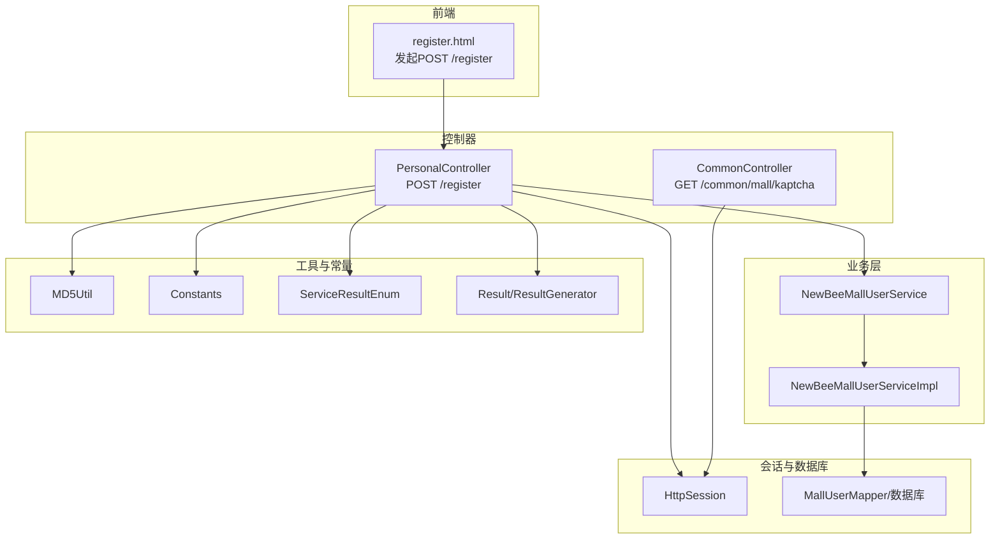
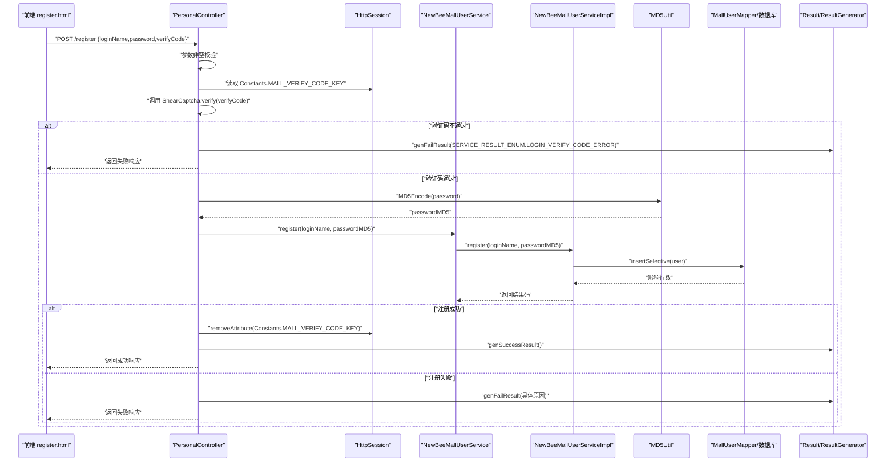
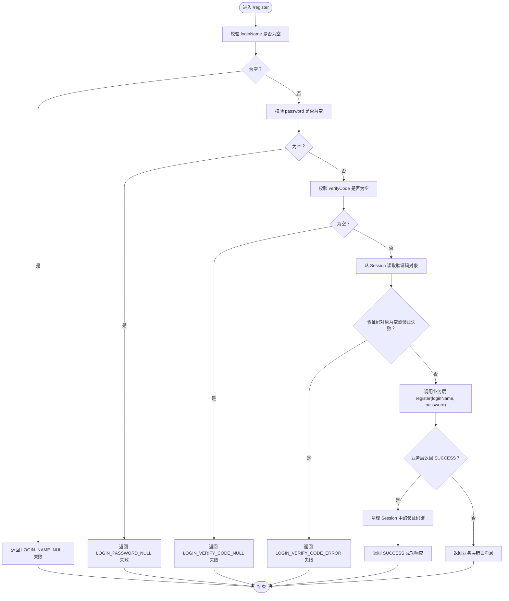
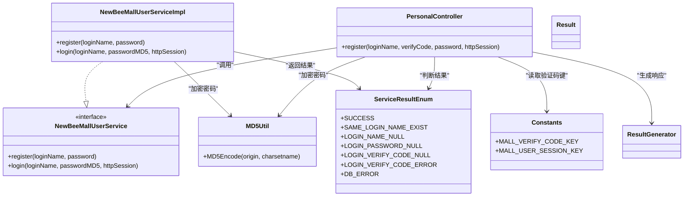

# 用户注册

<cite>
**本文引用的文件**
- [PersonalController.java](file://src/main/java/ltd/newbee/mall/controller/mall/PersonalController.java)
- [NewBeeMallUserService.java](file://src/main/java/ltd/newbee/mall/service/NewBeeMallUserService.java)
- [NewBeeMallUserServiceImpl.java](file://src/main/java/ltd/newbee/mall/service/impl/NewBeeMallUserServiceImpl.java)
- [MD5Util.java](file://src/main/java/ltd/newbee/mall/util/MD5Util.java)
- [Constants.java](file://src/main/java/ltd/newbee/mall/common/Constants.java)
- [ServiceResultEnum.java](file://src/main/java/ltd/newbee/mall/common/ServiceResultEnum.java)
- [CommonController.java](file://src/main/java/ltd/newbee/mall/controller/common/CommonController.java)
- [register.html](file://src/main/resources/templates/mall/register.html)
- [Result.java](file://src/main/java/ltd/newbee/mall/util/Result.java)
- [ResultGenerator.java](file://src/main/java/ltd/newbee/mall/util/ResultGenerator.java)
</cite>

## 目录
1. [简介](#简介)
2. [项目结构](#项目结构)
3. [核心组件](#核心组件)
4. [架构总览](#架构总览)
5. [详细组件分析](#详细组件分析)
6. [依赖关系分析](#依赖关系分析)
7. [性能考虑](#性能考虑)
8. [故障排查指南](#故障排查指南)
9. [结论](#结论)

## 简介
本文档围绕 newbee-mall 的用户注册 API 进行深入解析，重点覆盖以下内容：
- POST /register 接口的实现机制与控制流
- 对请求参数 loginName、password、verifyCode 的非空校验逻辑
- 如何从 HttpSession 中获取由 Constants.MALL_VERIFY_CODE_KEY 标识的验证码对象 ShearCaptcha，并调用其 verify 方法进行匹配验证
- 验证通过后的处理：明文密码经 MD5Util.MD5Encode 加密后，传递给 NewBeeMallUserService.register 完成注册
- 成功与失败返回结果的处理流程
- 注册成功后清理验证码 Session 的机制

## 项目结构
与用户注册相关的关键文件分布如下：
- 控制层：PersonalController 提供 /register 接口与 /login 接口；CommonController 提供 /common/mall/kaptcha 生成验证码图片并写入 Session
- 业务层：NewBeeMallUserService 接口定义注册能力；NewBeeMallUserServiceImpl 实现注册与登录等业务
- 工具层：MD5Util 提供 MD5 加密；Result/ResultGenerator 统一响应结构
- 常量与枚举：Constants 定义 Session 键；ServiceResultEnum 定义业务结果码
- 前端模板：register.html 展示注册表单并发起 AJAX 请求

图表来源
- [PersonalController.java](file://src/main/java/ltd/newbee/mall/controller/mall/PersonalController.java#L93-L121)
- [CommonController.java](file://src/main/java/ltd/newbee/mall/controller/common/CommonController.java#L45-L59)
- [NewBeeMallUserService.java](file://src/main/java/ltd/newbee/mall/service/NewBeeMallUserService.java#L27-L44)
- [NewBeeMallUserServiceImpl.java](file://src/main/java/ltd/newbee/mall/service/impl/NewBeeMallUserServiceImpl.java#L39-L53)
- [MD5Util.java](file://src/main/java/ltd/newbee/mall/util/MD5Util.java#L30-L44)
- [Constants.java](file://src/main/java/ltd/newbee/mall/common/Constants.java#L36-L39)
- [ServiceResultEnum.java](file://src/main/java/ltd/newbee/mall/common/ServiceResultEnum.java#L17-L91)
- [Result.java](file://src/main/java/ltd/newbee/mall/util/Result.java#L11-L58)
- [ResultGenerator.java](file://src/main/java/ltd/newbee/mall/util/ResultGenerator.java#L13-L59)

章节来源
- [PersonalController.java](file://src/main/java/ltd/newbee/mall/controller/mall/PersonalController.java#L93-L121)
- [CommonController.java](file://src/main/java/ltd/newbee/mall/controller/common/CommonController.java#L45-L59)

## 核心组件
- 控制器 PersonalController
  - 提供 POST /register 接口，负责参数校验、验证码验证、调用业务层注册、统一返回结果
- 业务接口与实现 NewBeeMallUserService/NewBeeMallUserServiceImpl
  - register(loginName, password)：检查用户名是否存在，构造用户实体，MD5 加密密码，持久化并返回结果码
- 工具 MD5Util
  - 提供 MD5Encode(origin, charsetname) 将明文密码转换为十六进制字符串
- 常量 Constants
  - MALL_VERIFY_CODE_KEY：验证码在 Session 中的键
  - MALL_USER_SESSION_KEY：用户信息在 Session 中的键
- 结果与枚举
  - ServiceResultEnum：包含 SUCCESS、SAME_LOGIN_NAME_EXIST、LOGIN_NAME_NULL、LOGIN_PASSWORD_NULL、LOGIN_VERIFY_CODE_NULL、LOGIN_VERIFY_CODE_ERROR、DB_ERROR 等
  - Result/ResultGenerator：统一封装响应码、消息与数据

章节来源
- [PersonalController.java](file://src/main/java/ltd/newbee/mall/controller/mall/PersonalController.java#L93-L121)
- [NewBeeMallUserService.java](file://src/main/java/ltd/newbee/mall/service/NewBeeMallUserService.java#L27-L44)
- [NewBeeMallUserServiceImpl.java](file://src/main/java/ltd/newbee/mall/service/impl/NewBeeMallUserServiceImpl.java#L39-L53)
- [MD5Util.java](file://src/main/java/ltd/newbee/mall/util/MD5Util.java#L30-L44)
- [Constants.java](file://src/main/java/ltd/newbee/mall/common/Constants.java#L36-L39)
- [ServiceResultEnum.java](file://src/main/java/ltd/newbee/mall/common/ServiceResultEnum.java#L17-L91)
- [Result.java](file://src/main/java/ltd/newbee/mall/util/Result.java#L11-L58)
- [ResultGenerator.java](file://src/main/java/ltd/newbee/mall/util/ResultGenerator.java#L13-L59)

## 架构总览
POST /register 的端到端流程如下：
- 前端 register.html 通过 AJAX 发送 POST /register，携带 loginName、password、verifyCode
- 控制器 PersonalController 接收请求，执行参数非空校验
- 从 HttpSession 获取验证码对象并调用 verify 进行匹配
- 验证通过后，使用 MD5Util 对密码进行加密，调用业务层 NewBeeMallUserService.register 完成注册
- 根据业务层返回的结果码，统一生成 Result 并返回
- 注册成功后，清理 Session 中的验证码键，防止重复使用

图表来源
- [PersonalController.java](file://src/main/java/ltd/newbee/mall/controller/mall/PersonalController.java#L93-L121)
- [NewBeeMallUserService.java](file://src/main/java/ltd/newbee/mall/service/NewBeeMallUserService.java#L27-L44)
- [NewBeeMallUserServiceImpl.java](file://src/main/java/ltd/newbee/mall/service/impl/NewBeeMallUserServiceImpl.java#L39-L53)
- [MD5Util.java](file://src/main/java/ltd/newbee/mall/util/MD5Util.java#L30-L44)
- [Constants.java](file://src/main/java/ltd/newbee/mall/common/Constants.java#L36-L39)
- [ServiceResultEnum.java](file://src/main/java/ltd/newbee/mall/common/ServiceResultEnum.java#L17-L91)
- [Result.java](file://src/main/java/ltd/newbee/mall/util/Result.java#L11-L58)
- [ResultGenerator.java](file://src/main/java/ltd/newbee/mall/util/ResultGenerator.java#L13-L59)

## 详细组件分析

### 控制器：PersonalController.register
- 参数校验
  - 对 loginName、password、verifyCode 进行非空校验，任一为空则返回对应失败结果
- 验证码校验
  - 从 HttpSession 中读取键为 Constants.MALL_VERIFY_CODE_KEY 的 ShearCaptcha 对象
  - 若对象为空或 verify 失败，则返回验证码错误
- 注册调用
  - 调用 NewBeeMallUserService.register(loginName, password)
  - 注意：此处传入的是明文密码，业务层内部再进行 MD5 加密
- 成功/失败处理
  - 若返回 SUCCESS，则清理 Session 中的验证码键并返回成功响应
  - 否则返回失败响应，消息来自业务层返回的结果码

章节来源
- [PersonalController.java](file://src/main/java/ltd/newbee/mall/controller/mall/PersonalController.java#L93-L121)
- [Constants.java](file://src/main/java/ltd/newbee/mall/common/Constants.java#L36-L39)
- [ServiceResultEnum.java](file://src/main/java/ltd/newbee/mall/common/ServiceResultEnum.java#L17-L91)
- [Result.java](file://src/main/java/ltd/newbee/mall/util/Result.java#L11-L58)
- [ResultGenerator.java](file://src/main/java/ltd/newbee/mall/util/ResultGenerator.java#L13-L59)

### 业务层：NewBeeMallUserServiceImpl.register
- 用户名校验
  - 先查询是否存在相同 loginName，若存在则返回“用户名已存在”
- 密码加密与入库
  - 使用 MD5Util.MD5Encode 将明文密码转换为 MD5 字符串
  - 构造 MallUser 实体，设置登录名与 MD5 密码，插入数据库
- 返回结果
  - 插入成功返回 SUCCESS，否则返回 DB_ERROR

章节来源
- [NewBeeMallUserServiceImpl.java](file://src/main/java/ltd/newbee/mall/service/impl/NewBeeMallUserServiceImpl.java#L39-L53)
- [MD5Util.java](file://src/main/java/ltd/newbee/mall/util/MD5Util.java#L30-L44)
- [ServiceResultEnum.java](file://src/main/java/ltd/newbee/mall/common/ServiceResultEnum.java#L17-L91)

### 验证码生成与存储：CommonController.mallKaptcha
- 生成验证码图片
  - 使用 hutool 的 CaptchaUtil 创建 ShearCaptcha
  - 将验证码对象写入 HttpSession，键为 Constants.MALL_VERIFY_CODE_KEY
  - 输出 PNG 图片字节流
- 前端访问
  - register.html 通过 /common/mall/kaptcha 获取验证码图片
  - 前端提交注册时，携带 verifyCode 与 loginName、password

章节来源
- [CommonController.java](file://src/main/java/ltd/newbee/mall/controller/common/CommonController.java#L45-L59)
- [Constants.java](file://src/main/java/ltd/newbee/mall/common/Constants.java#L36-L39)
- [register.html](file://src/main/resources/templates/mall/register.html#L39-L46)

### 响应结构：Result 与 ResultGenerator
- Result
  - 包含 resultCode、message、data 三个字段
- ResultGenerator
  - genSuccessResult：返回 200 与 SUCCESS 消息
  - genFailResult：返回 500 与错误消息
- 控制器统一使用 ResultGenerator 生成响应，便于前端识别成功/失败

章节来源
- [Result.java](file://src/main/java/ltd/newbee/mall/util/Result.java#L11-L58)
- [ResultGenerator.java](file://src/main/java/ltd/newbee/mall/util/ResultGenerator.java#L13-L59)

### 参数校验流程（流程图）

图表来源
- [PersonalController.java](file://src/main/java/ltd/newbee/mall/controller/mall/PersonalController.java#L93-L121)
- [Constants.java](file://src/main/java/ltd/newbee/mall/common/Constants.java#L36-L39)
- [ServiceResultEnum.java](file://src/main/java/ltd/newbee/mall/common/ServiceResultEnum.java#L17-L91)
- [ResultGenerator.java](file://src/main/java/ltd/newbee/mall/util/ResultGenerator.java#L13-L59)

## 依赖关系分析
- 控制器依赖
  - PersonalController 依赖 NewBeeMallUserService、Constants、ServiceResultEnum、MD5Util、Result/ResultGenerator
- 业务层依赖
  - NewBeeMallUserServiceImpl 依赖 MallUserMapper、MD5Util、ServiceResultEnum
- 前端依赖
  - register.html 依赖 /common/mall/kaptcha 获取验证码图片，并通过 AJAX 调用 /register

图表来源
- [PersonalController.java](file://src/main/java/ltd/newbee/mall/controller/mall/PersonalController.java#L93-L121)
- [NewBeeMallUserService.java](file://src/main/java/ltd/newbee/mall/service/NewBeeMallUserService.java#L27-L44)
- [NewBeeMallUserServiceImpl.java](file://src/main/java/ltd/newbee/mall/service/impl/NewBeeMallUserServiceImpl.java#L39-L53)
- [MD5Util.java](file://src/main/java/ltd/newbee/mall/util/MD5Util.java#L30-L44)
- [Constants.java](file://src/main/java/ltd/newbee/mall/common/Constants.java#L36-L39)
- [ServiceResultEnum.java](file://src/main/java/ltd/newbee/mall/common/ServiceResultEnum.java#L17-L91)
- [Result.java](file://src/main/java/ltd/newbee/mall/util/Result.java#L11-L58)
- [ResultGenerator.java](file://src/main/java/ltd/newbee/mall/util/ResultGenerator.java#L13-L59)

## 性能考虑
- 验证码生成与校验
  - 验证码为一次性使用，注册成功后清理 Session 中的验证码键，避免占用内存与防止复用
- 密码加密
  - 采用 MD5 加密，注意生产环境建议结合盐值与更安全的哈希算法
- 数据库访问
  - 注册前先查重，避免不必要的插入失败；插入成功后返回 SUCCESS，减少后续处理分支

## 故障排查指南
- 常见失败场景与返回
  - 用户名为空：LOGIN_NAME_NULL
  - 密码为空：LOGIN_PASSWORD_NULL
  - 验证码为空：LOGIN_VERIFY_CODE_NULL
  - 验证码错误：LOGIN_VERIFY_CODE_ERROR
  - 用户名已存在：SAME_LOGIN_NAME_EXIST
  - 数据库错误：DB_ERROR
- 前端提示
  - register.html 在 AJAX 回调中根据 resultCode 判断成功/失败，并弹窗提示
- 建议排查步骤
  - 确认 /common/mall/kaptcha 能正常返回验证码图片
  - 确认 /register 请求携带 loginName、password、verifyCode
  - 确认 Session 中存在 Constants.MALL_VERIFY_CODE_KEY 键
  - 观察业务层返回结果码，定位具体问题

章节来源
- [ServiceResultEnum.java](file://src/main/java/ltd/newbee/mall/common/ServiceResultEnum.java#L17-L91)
- [register.html](file://src/main/resources/templates/mall/register.html#L90-L126)

## 结论
POST /register 接口通过严格的参数校验与验证码验证，确保注册流程的安全性与正确性。在验证通过后，控制器将明文密码交由业务层进行 MD5 加密并持久化，最终以统一的 Result 结构返回成功或失败信息。注册成功后清理验证码 Session，有效防止重复使用与资源浪费。整体设计清晰、职责分离明确，具备良好的可维护性与扩展性。