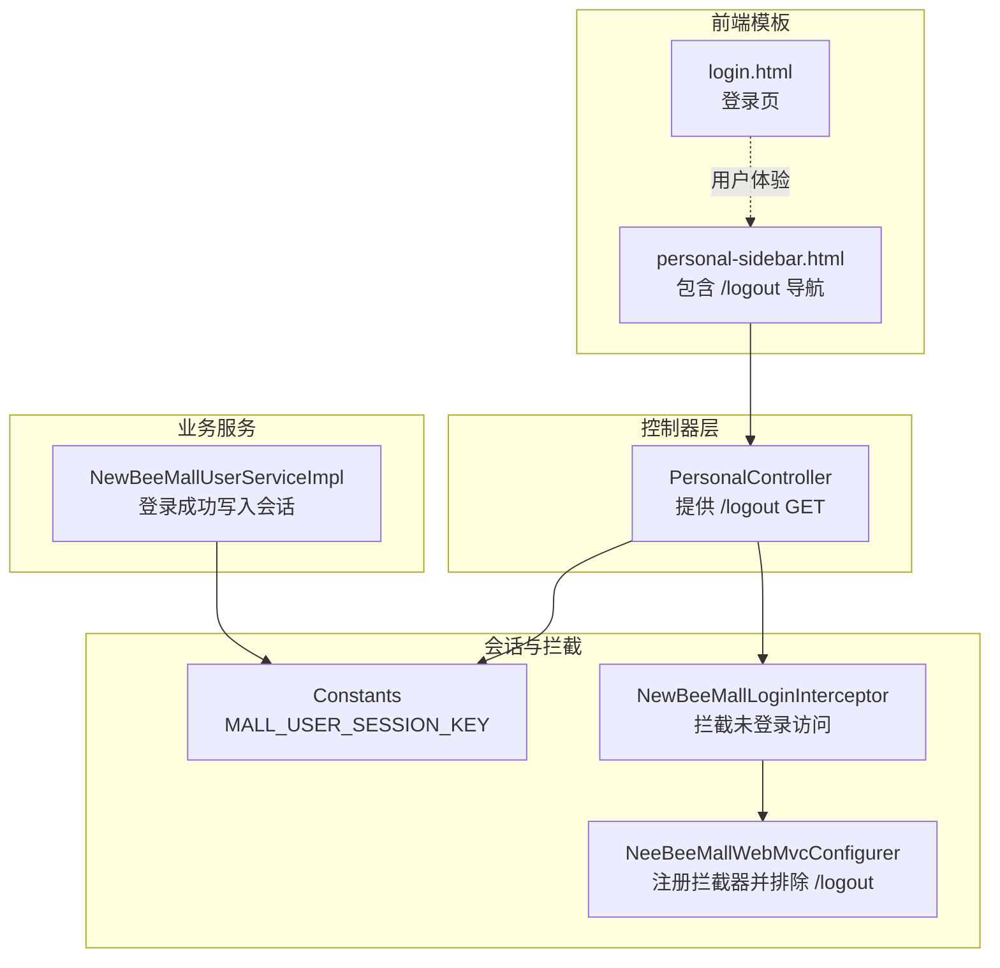
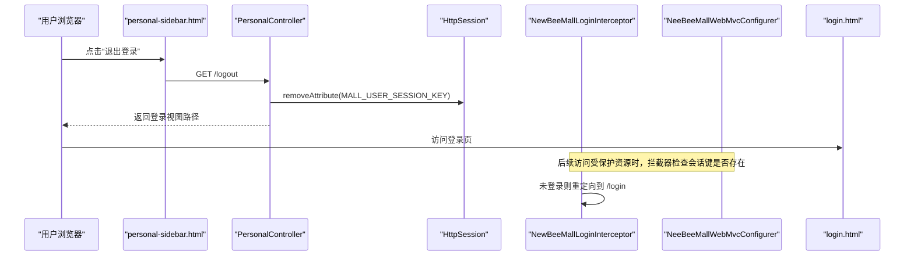
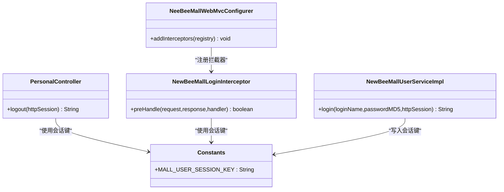

# 用户登出

<cite>
**本文引用的文件**
- [PersonalController.java](file://src/main/java/ltd/newbee/mall/controller/mall/PersonalController.java)
- [Constants.java](file://src/main/java/ltd/newbee/mall/common/Constants.java)
- [NewBeeMallLoginInterceptor.java](file://src/main/java/ltd/newbee/mall/interceptor/NewBeeMallLoginInterceptor.java)
- [NeeBeeMallWebMvcConfigurer.java](file://src/main/java/ltd/newbee/mall/config/NeeBeeMallWebMvcConfigurer.java)
- [personal-sidebar.html](file://src/main/resources/templates/mall/personal-sidebar.html)
- [login.html](file://src/main/resources/templates/mall/login.html)
- [NewBeeMallUserServiceImpl.java](file://src/main/java/ltd/newbee/mall/service/impl/NewBeeMallUserServiceImpl.java)
</cite>

## 目录
1. [简介](#简介)
2. [项目结构](#项目结构)
3. [核心组件](#核心组件)
4. [架构总览](#架构总览)
5. [详细组件分析](#详细组件分析)
6. [依赖关系分析](#依赖关系分析)
7. [性能考量](#性能考量)
8. [故障排查指南](#故障排查指南)
9. [结论](#结论)

## 简介
本文档围绕 newbee-mall 的“用户登出”能力进行系统化说明，重点解释 GET /logout 接口的实现原理：通过 Http Session 移除以 Constants.MALL_USER_SESSION_KEY 为键存储的用户登录会话信息，从而实现安全登出；并阐述该操作如何有效终止当前用户的会话状态，以及在操作完成后将用户重定向至登录页面（mall/login）的完整流程。同时强调该机制在保障用户账户安全方面的重要性，并指出其与前端页面跳转的协同工作方式。

## 项目结构
与“用户登出”直接相关的关键文件与职责如下：
- 控制器层：提供 /logout 的 GET 请求处理，负责移除会话并返回登录视图
- 会话键常量：集中定义会话中用户对象的键名
- 登录拦截器：对需要登录的资源进行拦截，未登录则重定向到登录页
- Web 配置：注册拦截器并对 /logout 进行排除，避免拦截器阻断登出流程
- 前端模板：提供“退出登录”的导航入口，触发 GET /logout
- 登录服务：在登录成功时将用户对象写入会话，形成登出前后的一致性闭环

图表来源
- [PersonalController.java](file://src/main/java/ltd/newbee/mall/controller/mall/PersonalController.java#L41-L45)
- [Constants.java](file://src/main/java/ltd/newbee/mall/common/Constants.java#L36-L39)
- [NewBeeMallLoginInterceptor.java](file://src/main/java/ltd/newbee/mall/interceptor/NewBeeMallLoginInterceptor.java#L30-L38)
- [NeeBeeMallWebMvcConfigurer.java](file://src/main/java/ltd/newbee/mall/config/NeeBeeMallWebMvcConfigurer.java#L31-L60)
- [personal-sidebar.html](file://src/main/resources/templates/mall/personal-sidebar.html#L8-L11)
- [login.html](file://src/main/resources/templates/mall/login.html#L1-L111)
- [NewBeeMallUserServiceImpl.java](file://src/main/java/ltd/newbee/mall/service/impl/NewBeeMallUserServiceImpl.java#L55-L74)

章节来源
- [PersonalController.java](file://src/main/java/ltd/newbee/mall/controller/mall/PersonalController.java#L41-L45)
- [Constants.java](file://src/main/java/ltd/newbee/mall/common/Constants.java#L36-L39)
- [NewBeeMallLoginInterceptor.java](file://src/main/java/ltd/newbee/mall/interceptor/NewBeeMallLoginInterceptor.java#L30-L38)
- [NeeBeeMallWebMvcConfigurer.java](file://src/main/java/ltd/newbee/mall/config/NeeBeeMallWebMvcConfigurer.java#L31-L60)
- [personal-sidebar.html](file://src/main/resources/templates/mall/personal-sidebar.html#L8-L11)
- [login.html](file://src/main/resources/templates/mall/login.html#L1-L111)
- [NewBeeMallUserServiceImpl.java](file://src/main/java/ltd/newbee/mall/service/impl/NewBeeMallUserServiceImpl.java#L55-L74)

## 核心组件
- 登出控制器方法：接收 GET /logout 请求，移除会话中的用户对象键，返回登录视图路径，完成登出动作
- 会话键常量：统一定义会话中用户对象的键名，确保登录与登出两端一致
- 登录拦截器：当会话中不存在用户对象键时，重定向到登录页，保证受保护资源的安全访问
- Web 配置：注册拦截器并对 /logout 进行排除，避免拦截器阻断登出流程
- 前端导航：在个人中心侧边栏提供“退出登录”入口，点击后发起 GET /logout
- 登录服务：登录成功时将用户对象写入会话，形成登出前后的一致性闭环

章节来源
- [PersonalController.java](file://src/main/java/ltd/newbee/mall/controller/mall/PersonalController.java#L41-L45)
- [Constants.java](file://src/main/java/ltd/newbee/mall/common/Constants.java#L36-L39)
- [NewBeeMallLoginInterceptor.java](file://src/main/java/ltd/newbee/mall/interceptor/NewBeeMallLoginInterceptor.java#L30-L38)
- [NeeBeeMallWebMvcConfigurer.java](file://src/main/java/ltd/newbee/mall/config/NeeBeeMallWebMvcConfigurer.java#L31-L60)
- [personal-sidebar.html](file://src/main/resources/templates/mall/personal-sidebar.html#L8-L11)
- [NewBeeMallUserServiceImpl.java](file://src/main/java/ltd/newbee/mall/service/impl/NewBeeMallUserServiceImpl.java#L55-L74)

## 架构总览
下图展示了从用户点击“退出登录”到会话被移除并重定向至登录页的整体流程，以及拦截器如何保障受保护资源的安全访问。

图表来源
- [personal-sidebar.html](file://src/main/resources/templates/mall/personal-sidebar.html#L8-L11)
- [PersonalController.java](file://src/main/java/ltd/newbee/mall/controller/mall/PersonalController.java#L41-L45)
- [Constants.java](file://src/main/java/ltd/newbee/mall/common/Constants.java#L36-L39)
- [NewBeeMallLoginInterceptor.java](file://src/main/java/ltd/newbee/mall/interceptor/NewBeeMallLoginInterceptor.java#L30-L38)
- [NeeBeeMallWebMvcConfigurer.java](file://src/main/java/ltd/newbee/mall/config/NeeBeeMallWebMvcConfigurer.java#L31-L60)
- [login.html](file://src/main/resources/templates/mall/login.html#L1-L111)

## 详细组件分析

### 登出控制器方法（GET /logout）
- 功能定位：提供登出入口，移除会话中的用户对象键，返回登录视图路径
- 关键行为：
  - 通过 HttpSession.removeAttribute 移除以 Constants.MALL_USER_SESSION_KEY 为键的用户对象
  - 返回登录视图路径，使浏览器加载登录页
- 安全意义：彻底清除当前会话中的用户标识，防止后续请求继续以该用户身份访问受保护资源

章节来源
- [PersonalController.java](file://src/main/java/ltd/newbee/mall/controller/mall/PersonalController.java#L41-L45)
- [Constants.java](file://src/main/java/ltd/newbee/mall/common/Constants.java#L36-L39)

### 会话键常量（Constants.MALL_USER_SESSION_KEY）
- 定义位置：集中于 Constants 类，作为会话中用户对象的唯一键名
- 使用场景：
  - 登录成功时由服务层写入会话
  - 登出时由控制器移除
  - 拦截器用于判断是否已登录

章节来源
- [Constants.java](file://src/main/java/ltd/newbee/mall/common/Constants.java#L36-L39)
- [NewBeeMallUserServiceImpl.java](file://src/main/java/ltd/newbee/mall/service/impl/NewBeeMallUserServiceImpl.java#L55-L74)

### 登录拦截器（HandlerInterceptor）
- 功能定位：对需要登录的资源进行拦截，未登录则重定向到登录页
- 关键逻辑：
  - 在 preHandle 中检查会话中是否存在用户对象键
  - 若不存在，则重定向到 /login
  - 若存在，则放行
- 与登出的关系：登出后会话中不再包含用户对象键，后续访问受保护资源会被拦截器重定向到登录页

章节来源
- [NewBeeMallLoginInterceptor.java](file://src/main/java/ltd/newbee/mall/interceptor/NewBeeMallLoginInterceptor.java#L30-L38)

### Web 配置（拦截器注册与排除）
- 注册拦截器：将登录拦截器注册到 MVC 配置中
- 排除规则：明确排除 /logout，避免拦截器阻断登出流程
- 保护范围：对个人中心、订单、购物车等受保护资源生效

章节来源
- [NeeBeeMallWebMvcConfigurer.java](file://src/main/java/ltd/newbee/mall/config/NeeBeeMallWebMvcConfigurer.java#L31-L60)

### 前端导航与登录页
- 个人中心侧边栏提供“退出登录”入口，点击后发起 GET /logout
- 登录页提供登录表单与交互逻辑，完成登录后跳转首页

章节来源
- [personal-sidebar.html](file://src/main/resources/templates/mall/personal-sidebar.html#L8-L11)
- [login.html](file://src/main/resources/templates/mall/login.html#L1-L111)

### 登录服务（会话写入与一致性）
- 登录成功时将用户对象写入会话，键名为 Constants.MALL_USER_SESSION_KEY
- 登出时移除该键，形成登录与登出的一致性闭环

章节来源
- [NewBeeMallUserServiceImpl.java](file://src/main/java/ltd/newbee/mall/service/impl/NewBeeMallUserServiceImpl.java#L55-L74)

## 依赖关系分析
- 控制器依赖会话键常量，确保移除的是正确的用户对象键
- 拦截器依赖会话键常量，用于判断是否已登录
- Web 配置依赖拦截器与排除规则，确保 /logout 不被拦截
- 前端模板依赖控制器提供的 /logout 路径
- 登录服务与控制器共同维护会话键的一致性

图表来源
- [PersonalController.java](file://src/main/java/ltd/newbee/mall/controller/mall/PersonalController.java#L41-L45)
- [Constants.java](file://src/main/java/ltd/newbee/mall/common/Constants.java#L36-L39)
- [NewBeeMallLoginInterceptor.java](file://src/main/java/ltd/newbee/mall/interceptor/NewBeeMallLoginInterceptor.java#L30-L38)
- [NeeBeeMallWebMvcConfigurer.java](file://src/main/java/ltd/newbee/mall/config/NeeBeeMallWebMvcConfigurer.java#L31-L60)
- [NewBeeMallUserServiceImpl.java](file://src/main/java/ltd/newbee/mall/service/impl/NewBeeMallUserServiceImpl.java#L55-L74)

## 性能考量
- 会话移除操作为 O(1) 复杂度，开销极低
- 登录拦截器仅做一次会话键检查，性能开销可忽略
- 建议避免在会话中存储过大对象，以减少内存占用与序列化成本（与登出功能无直接关联）

## 故障排查指南
- 登出后仍可访问受保护资源
  - 检查是否正确移除了会话键
  - 确认拦截器是否生效且未被其他配置覆盖
- 登出后无法跳转到登录页
  - 检查控制器返回的视图路径是否正确
  - 确认 Web 配置中未错误地排除了 /logout
- 登录成功但登出无效
  - 检查登录时写入的会话键与登出时移除的键是否一致

章节来源
- [PersonalController.java](file://src/main/java/ltd/newbee/mall/controller/mall/PersonalController.java#L41-L45)
- [NewBeeMallLoginInterceptor.java](file://src/main/java/ltd/newbee/mall/interceptor/NewBeeMallLoginInterceptor.java#L30-L38)
- [NeeBeeMallWebMvcConfigurer.java](file://src/main/java/ltd/newbee/mall/config/NeeBeeMallWebMvcConfigurer.java#L31-L60)

## 结论
newbee-mall 的用户登出通过“移除会话键 + 拦截器重定向”的组合机制，实现了简洁而可靠的安全登出流程。该设计以 Constants.MALL_USER_SESSION_KEY 为核心，确保登录与登出两端的一致性；Web 配置排除 /logout，避免拦截器阻断；前端导航提供直观入口。这一机制有效终止当前用户的会话状态，保障用户账户安全，并与前端页面跳转协同工作，形成完整的用户体验闭环。