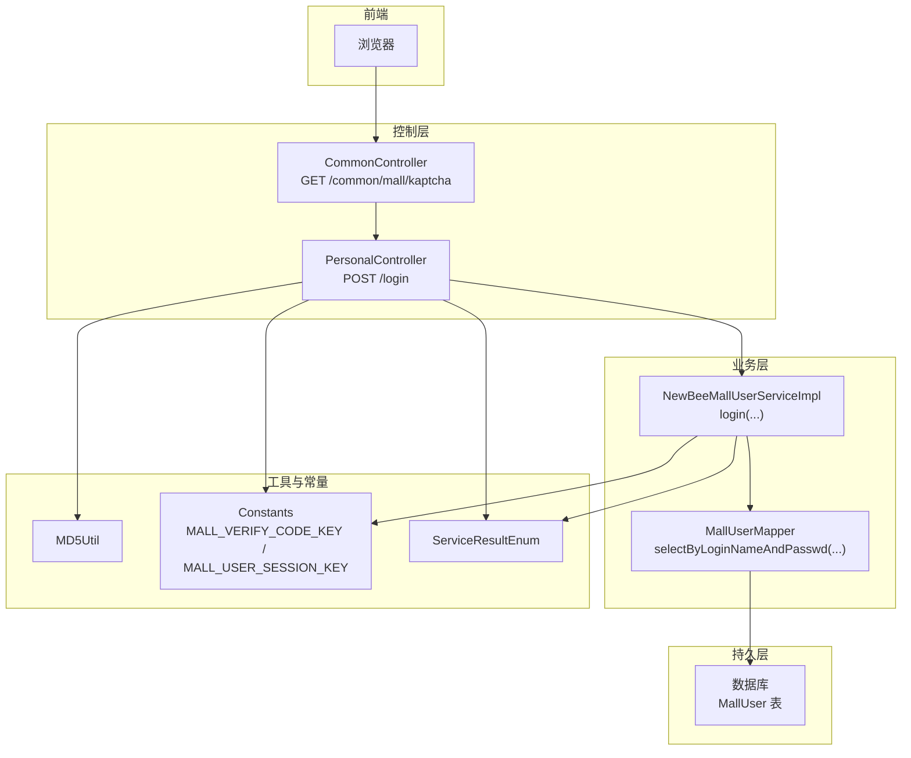
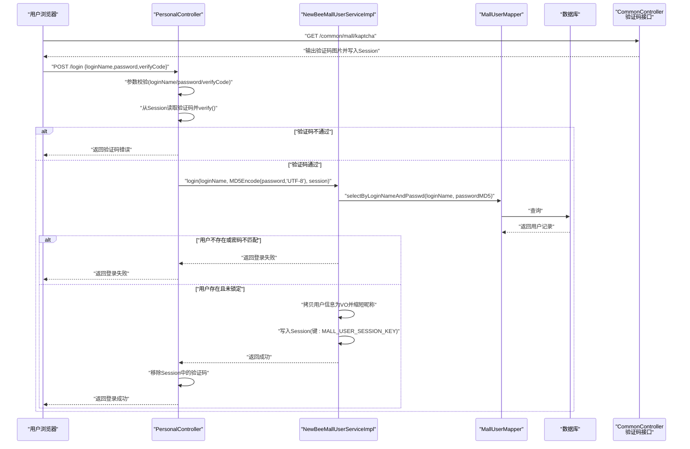
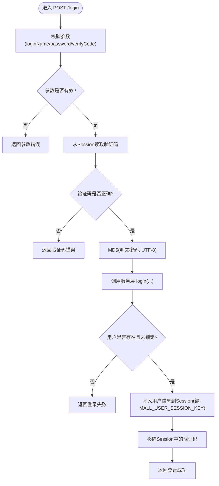
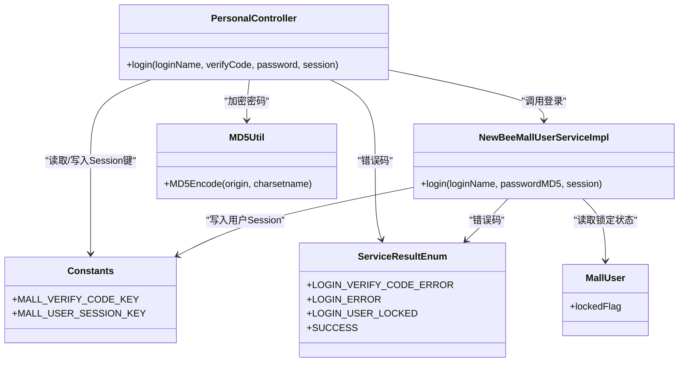

# 用户登录

<cite>
**本文引用的文件**
- [PersonalController.java](file://src/main/java/ltd/newbee/mall/controller/mall/PersonalController.java)
- [NewBeeMallUserServiceImpl.java](file://src/main/java/ltd/newbee/mall/service/impl/NewBeeMallUserServiceImpl.java)
- [NewBeeMallUserService.java](file://src/main/java/ltd/newbee/mall/service/NewBeeMallUserService.java)
- [Constants.java](file://src/main/java/ltd/newbee/mall/common/Constants.java)
- [MD5Util.java](file://src/main/java/ltd/newbee/mall/util/MD5Util.java)
- [CommonController.java](file://src/main/java/ltd/newbee/mall/controller/common/CommonController.java)
- [ServiceResultEnum.java](file://src/main/java/ltd/newbee/mall/common/ServiceResultEnum.java)
- [MallUser.java](file://src/main/java/ltd/newbee/mall/entity/MallUser.java)
- [DEVELOPMENT.md](file://docs/DEVELOPMENT.md)
</cite>

## 目录
1. [简介](#简介)
2. [项目结构](#项目结构)
3. [核心组件](#核心组件)
4. [架构总览](#架构总览)
5. [详细组件分析](#详细组件分析)
6. [依赖关系分析](#依赖关系分析)
7. [性能考虑](#性能考虑)
8. [故障排查指南](#故障排查指南)
9. [结论](#结论)

## 简介
本文件面向开发者与测试人员，系统性梳理 newbee-mall 中“用户登录”API（POST /login）的端到端工作流程，重点覆盖以下内容：
- 请求参数校验：loginName、password、verifyCode 的规则
- 验证码校验：从 HttpSession 中获取 ShearCaptcha 实例并通过 verify 方法比对
- 密码加密：使用 MD5Util 对明文密码按 UTF-8 编码进行 MD5 加密
- 身份认证：调用 NewBeeMallUserService.login 完成用户名与密码匹配及账户锁定检查
- 登录成功：将用户信息写入 Session（键为 Constants.MALL_USER_SESSION_KEY），并清理验证码 Session
- 登录失败：基于 ServiceResultEnum 的错误码返回（如密码错误、账户锁定等）

## 项目结构
围绕登录流程的关键文件与职责如下：
- 控制层：负责接收请求、参数校验、调用服务层、封装响应
- 业务层：负责用户认证、账户状态检查、Session 写入
- 工具类：提供 MD5 加密工具
- 常量：统一管理 Session 键名
- 验证码：公共控制器生成并输出验证码图片，登录前需先获取验证码
- 结果枚举：统一错误码与提示文案

图表来源
- [PersonalController.java](file://src/main/java/ltd/newbee/mall/controller/mall/PersonalController.java#L62-L91)
- [CommonController.java](file://src/main/java/ltd/newbee/mall/controller/common/CommonController.java#L45-L59)
- [NewBeeMallUserServiceImpl.java](file://src/main/java/ltd/newbee/mall/service/impl/NewBeeMallUserServiceImpl.java#L55-L73)
- [MD5Util.java](file://src/main/java/ltd/newbee/mall/util/MD5Util.java#L30-L44)
- [Constants.java](file://src/main/java/ltd/newbee/mall/common/Constants.java#L35-L38)
- [ServiceResultEnum.java](file://src/main/java/ltd/newbee/mall/common/ServiceResultEnum.java#L28-L35)

章节来源
- [PersonalController.java](file://src/main/java/ltd/newbee/mall/controller/mall/PersonalController.java#L62-L91)
- [CommonController.java](file://src/main/java/ltd/newbee/mall/controller/common/CommonController.java#L45-L59)
- [NewBeeMallUserServiceImpl.java](file://src/main/java/ltd/newbee/mall/service/impl/NewBeeMallUserServiceImpl.java#L55-L73)
- [MD5Util.java](file://src/main/java/ltd/newbee/mall/util/MD5Util.java#L30-L44)
- [Constants.java](file://src/main/java/ltd/newbee/mall/common/Constants.java#L35-L38)
- [ServiceResultEnum.java](file://src/main/java/ltd/newbee/mall/common/ServiceResultEnum.java#L28-L35)

## 核心组件
- 控制器 PersonalController
  - 处理 POST /login，接收 loginName、password、verifyCode 三个参数
  - 进行非空校验，获取并验证验证码，调用服务层登录方法，处理成功/失败分支
- 业务实现 NewBeeMallUserServiceImpl
  - 依据 loginName 与 passwordMD5 查询用户，检查锁定状态，成功则将用户 VO 写入 Session
- 工具 MD5Util
  - 提供 UTF-8 编码的 MD5 加密能力
- 常量 Constants
  - 统一验证码与用户 Session 键名
- 结果枚举 ServiceResultEnum
  - 统一错误码与文案，包括登录相关错误
- 实体 MallUser
  - 包含 lockedFlag 字段用于账户锁定判断

章节来源
- [PersonalController.java](file://src/main/java/ltd/newbee/mall/controller/mall/PersonalController.java#L62-L91)
- [NewBeeMallUserServiceImpl.java](file://src/main/java/ltd/newbee/mall/service/impl/NewBeeMallUserServiceImpl.java#L55-L73)
- [MD5Util.java](file://src/main/java/ltd/newbee/mall/util/MD5Util.java#L30-L44)
- [Constants.java](file://src/main/java/ltd/newbee/mall/common/Constants.java#L35-L38)
- [ServiceResultEnum.java](file://src/main/java/ltd/newbee/mall/common/ServiceResultEnum.java#L28-L35)
- [MallUser.java](file://src/main/java/ltd/newbee/mall/entity/MallUser.java#L90-L97)

## 架构总览
POST /login 的端到端调用序列如下：

图表来源
- [PersonalController.java](file://src/main/java/ltd/newbee/mall/controller/mall/PersonalController.java#L62-L91)
- [NewBeeMallUserServiceImpl.java](file://src/main/java/ltd/newbee/mall/service/impl/NewBeeMallUserServiceImpl.java#L55-L73)
- [CommonController.java](file://src/main/java/ltd/newbee/mall/controller/common/CommonController.java#L45-L59)
- [MD5Util.java](file://src/main/java/ltd/newbee/mall/util/MD5Util.java#L30-L44)
- [Constants.java](file://src/main/java/ltd/newbee/mall/common/Constants.java#L35-L38)

## 详细组件分析

### 控制层：PersonalController.login
- 参数校验
  - loginName 必填
  - password 必填
  - verifyCode 必填
- 验证码校验
  - 从 HttpSession 读取键为 Constants.MALL_VERIFY_CODE_KEY 的 ShearCaptcha 实例
  - 调用 verify(verifyCode) 校验；失败则返回验证码错误
- 密码加密与登录
  - 使用 MD5Util.MD5Encode(password, "UTF-8") 对明文密码进行 UTF-8 编码的 MD5 加密
  - 调用 NewBeeMallUserService.login(loginName, passwordMD5, session)
- 成功/失败处理
  - 成功：移除 Session 中的验证码键，返回成功
  - 失败：直接返回服务层返回的错误码字符串

章节来源
- [PersonalController.java](file://src/main/java/ltd/newbee/mall/controller/mall/PersonalController.java#L62-L91)
- [MD5Util.java](file://src/main/java/ltd/newbee/mall/util/MD5Util.java#L30-L44)
- [Constants.java](file://src/main/java/ltd/newbee/mall/common/Constants.java#L35-L38)
- [ServiceResultEnum.java](file://src/main/java/ltd/newbee/mall/common/ServiceResultEnum.java#L28-L35)

### 业务层：NewBeeMallUserServiceImpl.login
- 数据访问
  - 通过 MallUserMapper.selectByLoginNameAndPasswd(loginName, passwordMD5) 查询用户
- 账户状态检查
  - 若用户被锁定（lockedFlag == 1），返回“用户已被禁止登录”
- 用户信息写入 Session
  - 将用户信息转换为 NewBeeMallUserVO 并写入 Session（键为 Constants.MALL_USER_SESSION_KEY）
- 返回值
  - 成功：返回“success”
  - 失败：返回“登录失败”

章节来源
- [NewBeeMallUserServiceImpl.java](file://src/main/java/ltd/newbee/mall/service/impl/NewBeeMallUserServiceImpl.java#L55-L73)
- [MallUser.java](file://src/main/java/ltd/newbee/mall/entity/MallUser.java#L90-L97)
- [Constants.java](file://src/main/java/ltd/newbee/mall/common/Constants.java#L35-L38)
- [ServiceResultEnum.java](file://src/main/java/ltd/newbee/mall/common/ServiceResultEnum.java#L50-L52)

### 验证码生成与存储
- 公共控制器提供验证码接口 GET /common/mall/kaptcha
  - 生成 ShearCaptcha 图片并输出至响应流
  - 将验证码对象存入 HttpSession，键为 Constants.MALL_VERIFY_CODE_KEY
- 登录接口在调用前应先访问该接口获取验证码

章节来源
- [CommonController.java](file://src/main/java/ltd/newbee/mall/controller/common/CommonController.java#L45-L59)
- [Constants.java](file://src/main/java/ltd/newbee/mall/common/Constants.java#L35-L38)

### 密码加密流程
- MD5Util.MD5Encode(origin, charsetname)
  - 使用 UTF-8 编码对明文进行 MD5 加密
  - 返回十六进制小写字符串
- 登录流程中，控制器将 password 交由 MD5Util 加密后再传入服务层

章节来源
- [MD5Util.java](file://src/main/java/ltd/newbee/mall/util/MD5Util.java#L30-L44)
- [PersonalController.java](file://src/main/java/ltd/newbee/mall/controller/mall/PersonalController.java#L82-L82)

### 登录成功与失败的错误码
- 成功
  - 返回“success”，同时写入用户信息到 Session（键为 Constants.MALL_USER_SESSION_KEY）
- 失败场景
  - 验证码错误：返回“验证码错误”
  - 登录失败（用户名或密码不匹配）：返回“登录失败”
  - 账户被锁定：返回“用户已被禁止登录”

章节来源
- [ServiceResultEnum.java](file://src/main/java/ltd/newbee/mall/common/ServiceResultEnum.java#L28-L35)
- [ServiceResultEnum.java](file://src/main/java/ltd/newbee/mall/common/ServiceResultEnum.java#L50-L52)
- [NewBeeMallUserServiceImpl.java](file://src/main/java/ltd/newbee/mall/service/impl/NewBeeMallUserServiceImpl.java#L55-L73)
- [PersonalController.java](file://src/main/java/ltd/newbee/mall/controller/mall/PersonalController.java#L79-L81)

### 登录流程算法图

图表来源
- [PersonalController.java](file://src/main/java/ltd/newbee/mall/controller/mall/PersonalController.java#L62-L91)
- [NewBeeMallUserServiceImpl.java](file://src/main/java/ltd/newbee/mall/service/impl/NewBeeMallUserServiceImpl.java#L55-L73)
- [Constants.java](file://src/main/java/ltd/newbee/mall/common/Constants.java#L35-L38)
- [ServiceResultEnum.java](file://src/main/java/ltd/newbee/mall/common/ServiceResultEnum.java#L28-L35)

## 依赖关系分析
- 控制层依赖
  - PersonalController 依赖 MD5Util、Constants、NewBeeMallUserService、ServiceResultEnum
- 业务层依赖
  - NewBeeMallUserServiceImpl 依赖 MallUserMapper、Constants、ServiceResultEnum、BeanUtil、NewBeeMallUserVO
- 数据模型
  - MallUser 提供 lockedFlag 字段用于账户锁定判断
- 验证码依赖
  - CommonController 生成验证码并写入 Session，PersonalController 从 Session 读取并校验

图表来源
- [PersonalController.java](file://src/main/java/ltd/newbee/mall/controller/mall/PersonalController.java#L62-L91)
- [NewBeeMallUserServiceImpl.java](file://src/main/java/ltd/newbee/mall/service/impl/NewBeeMallUserServiceImpl.java#L55-L73)
- [MD5Util.java](file://src/main/java/ltd/newbee/mall/util/MD5Util.java#L30-L44)
- [Constants.java](file://src/main/java/ltd/newbee/mall/common/Constants.java#L35-L38)
- [ServiceResultEnum.java](file://src/main/java/ltd/newbee/mall/common/ServiceResultEnum.java#L28-L35)
- [MallUser.java](file://src/main/java/ltd/newbee/mall/entity/MallUser.java#L90-L97)

## 性能考虑
- 验证码生成与输出
  - 使用 ShearCaptcha 生成图片，建议在高并发场景下注意缓存与线程安全
- 密码加密
  - MD5 加密为纯 CPU 操作，开销较小；建议结合 HTTPS 传输避免明文泄露
- Session 存储
  - 登录成功后写入用户信息到 Session，注意 Session 大小与内存占用
- 数据库查询
  - loginName 作为查询条件，建议在 MallUser 表上建立索引以提升查询效率

[本节为通用建议，不直接分析具体文件]

## 故障排查指南
- 验证码错误
  - 确认已先访问 GET /common/mall/kaptcha 获取验证码
  - 确认提交的 verifyCode 与 Session 中验证码一致
  - 确认 Session 键名一致（Constants.MALL_VERIFY_CODE_KEY）
- 登录失败
  - 检查 loginName 与 password 是否正确
  - 确认数据库中用户存在且未被锁定（lockedFlag）
- 账户被锁定
  - 服务层在检测到 lockedFlag == 1 时返回“用户已被禁止登录”
- Session 未写入用户信息
  - 确认服务层 login 成功后执行了 Session 写入（键为 Constants.MALL_USER_SESSION_KEY）
- 登录成功但后续接口仍提示未登录
  - 检查拦截器是否正确读取 Session 中的用户键（参考开发文档中的拦截器配置）

章节来源
- [ServiceResultEnum.java](file://src/main/java/ltd/newbee/mall/common/ServiceResultEnum.java#L50-L52)
- [NewBeeMallUserServiceImpl.java](file://src/main/java/ltd/newbee/mall/service/impl/NewBeeMallUserServiceImpl.java#L55-L73)
- [Constants.java](file://src/main/java/ltd/newbee/mall/common/Constants.java#L35-L38)
- [DEVELOPMENT.md](file://docs/DEVELOPMENT.md#L438-L478)

## 结论
POST /login 在 newbee-mall 中实现了标准的“参数校验 -> 验证码校验 -> 密码加密 -> 用户认证 -> Session 写入”的闭环流程。通过统一的常量与错误码管理，系统在易用性与可维护性方面具备良好基础。建议在生产环境中配合 HTTPS、数据库索引优化与验证码缓存策略，进一步提升安全性与性能。