# 用户相关

<cite>
**本文档引用文件**   
- [PersonalController.java](file://src/main/java/ltd/newbee/mall/controller/mall/PersonalController.java)
- [NewBeeMallUserServiceImpl.java](file://src/main/java/ltd/newbee/mall/service/impl/NewBeeMallUserServiceImpl.java)
- [NewBeeMallUserService.java](file://src/main/java/ltd/newbee/mall/service/NewBeeMallUserService.java)
- [Constants.java](file://src/main/java/ltd/newbee/mall/common/Constants.java)
- [ServiceResultEnum.java](file://src/main/java/ltd/newbee/mall/common/ServiceResultEnum.java)
- [MD5Util.java](file://src/main/java/ltd/newbee/mall/util/MD5Util.java)
- [CommonController.java](file://src/main/java/ltd/newbee/mall/controller/common/CommonController.java)
- [MallUser.java](file://src/main/java/ltd/newbee/mall/entity/MallUser.java)
- [NewBeeMallUserVO.java](file://src/main/java/ltd/newbee/mall/controller/vo/NewBeeMallUserVO.java)
- [ResultGenerator.java](file://src/main/java/ltd/newbee/mall/util/ResultGenerator.java)
- [Result.java](file://src/main/java/ltd/newbee/mall/util/Result.java)
- [login.html](file://src/main/resources/templates/mall/login.html)
- [register.html](file://src/main/resources/templates/mall/register.html)
- [personal.html](file://src/main/resources/templates/mall/personal.html)
</cite>

## 目录
1. [简介](#简介)
2. [核心API接口](#核心api接口)
3. [用户注册流程](#用户注册流程)
4. [用户登录流程](#用户登录流程)
5. [用户登出机制](#用户登出机制)
6. [个人信息管理](#个人信息管理)
7. [安全机制](#安全机制)
8. [常量与结果枚举](#常量与结果枚举)
9. [数据模型](#数据模型)
10. [前端交互](#前端交互)

## 简介
本系统实现了完整的用户管理功能，包括用户注册、登录、登出和个人信息管理。系统采用Spring MVC架构，通过RESTful API提供服务，结合Thymeleaf模板引擎实现前后端交互。用户认证采用会话（Session）机制，密码存储使用MD5加密，登录过程包含验证码验证，确保系统安全性。

## 核心API接口
系统提供以下核心用户相关API接口：

| 接口路径 | HTTP方法 | 功能描述 |
|--------|--------|--------|
| `/register` | POST | 用户注册 |
| `/login` | POST | 用户登录 |
| `/logout` | GET | 用户登出 |
| `/personal` | GET | 个人中心页面跳转 |
| `/personal/updateInfo` | POST | 更新用户信息 |

**Section sources**
- [PersonalController.java](file://src/main/java/ltd/newbee/mall/controller/mall/PersonalController.java#L93-L136)

## 用户注册流程

### 注册接口实现
`POST /register` 接口处理用户注册请求，接收 `loginName`、`password` 和 `verifyCode` 参数。

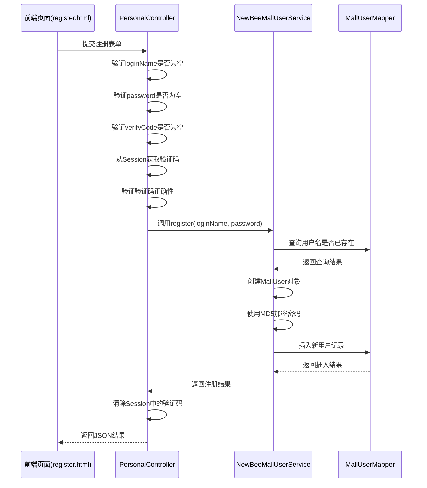

**Diagram sources**
- [PersonalController.java](file://src/main/java/ltd/newbee/mall/controller/mall/PersonalController.java#L93-L121)
- [NewBeeMallUserServiceImpl.java](file://src/main/java/ltd/newbee/mall/service/impl/NewBeeMallUserServiceImpl.java#L40-L53)

### 注册参数校验
系统对注册参数进行严格校验：

1. **loginName校验**：检查是否为空
2. **password校验**：检查是否为空
3. **verifyCode校验**：检查是否为空，并与Session中存储的验证码比对

若任一校验失败，返回相应的错误信息。

**Section sources**
- [PersonalController.java](file://src/main/java/ltd/newbee/mall/controller/mall/PersonalController.java#L99-L111)

## 用户登录流程

### 登录接口实现
`POST /login` 接口处理用户登录请求，接收 `loginName`、`password` 和 `verifyCode` 参数。

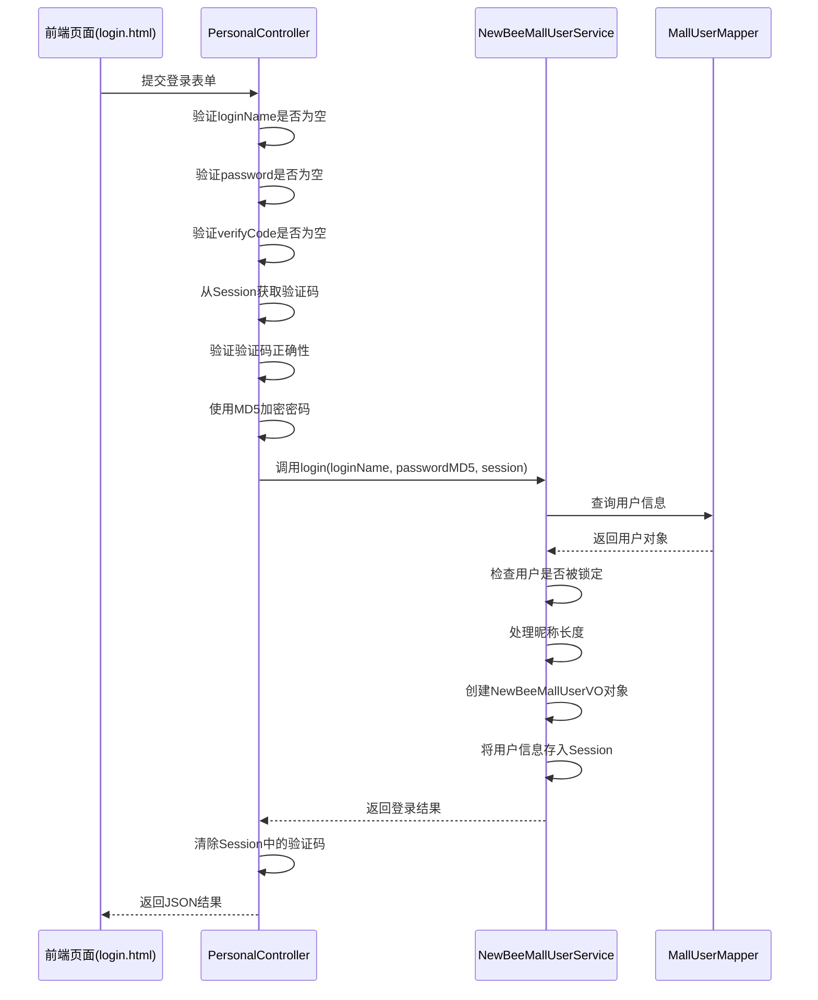

**Diagram sources**
- [PersonalController.java](file://src/main/java/ltd/newbee/mall/controller/mall/PersonalController.java#L62-L91)
- [NewBeeMallUserServiceImpl.java](file://src/main/java/ltd/newbee/mall/service/impl/NewBeeMallUserServiceImpl.java#L56-L74)

### 登录参数校验
系统对登录参数进行严格校验：

1. **loginName校验**：检查是否为空
2. **password校验**：检查是否为空
3. **verifyCode校验**：检查是否为空，并与Session中存储的验证码比对

此外，服务层还会检查用户账户状态（是否被锁定）。

**Section sources**
- [PersonalController.java](file://src/main/java/ltd/newbee/mall/controller/mall/PersonalController.java#L68-L81)
- [NewBeeMallUserServiceImpl.java](file://src/main/java/ltd/newbee/mall/service/impl/NewBeeMallUserServiceImpl.java#L57-L61)

## 用户登出机制

### 登出接口实现
`GET /logout` 接口处理用户登出请求，通过移除会话属性实现登出功能。

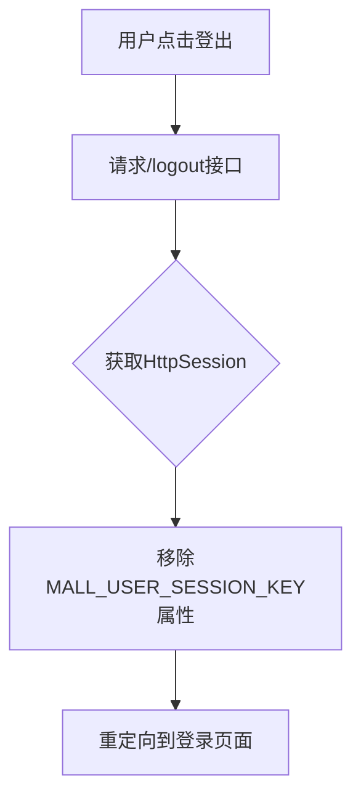

**Diagram sources**
- [PersonalController.java](file://src/main/java/ltd/newbee/mall/controller/mall/PersonalController.java#L41-L45)

### 会话管理
登出操作通过以下代码实现：
```java
httpSession.removeAttribute(Constants.MALL_USER_SESSION_KEY);
```

这会清除存储在会话中的用户信息，实现安全登出。

**Section sources**
- [PersonalController.java](file://src/main/java/ltd/newbee/mall/controller/mall/PersonalController.java#L43)
- [Constants.java](file://src/main/java/ltd/newbee/mall/common/Constants.java#L38)

## 个人信息管理

### 个人中心页面
`GET /personal` 接口处理个人中心页面跳转请求。

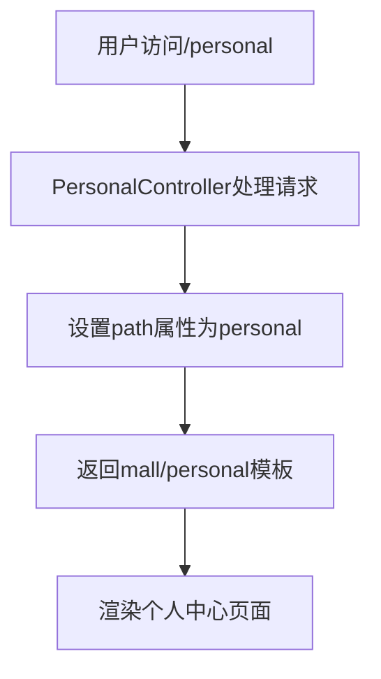

**Diagram sources**
- [PersonalController.java](file://src/main/java/ltd/newbee/mall/controller/mall/PersonalController.java#L34-L39)

### 更新用户信息
`POST /personal/updateInfo` 接口处理用户信息更新请求。

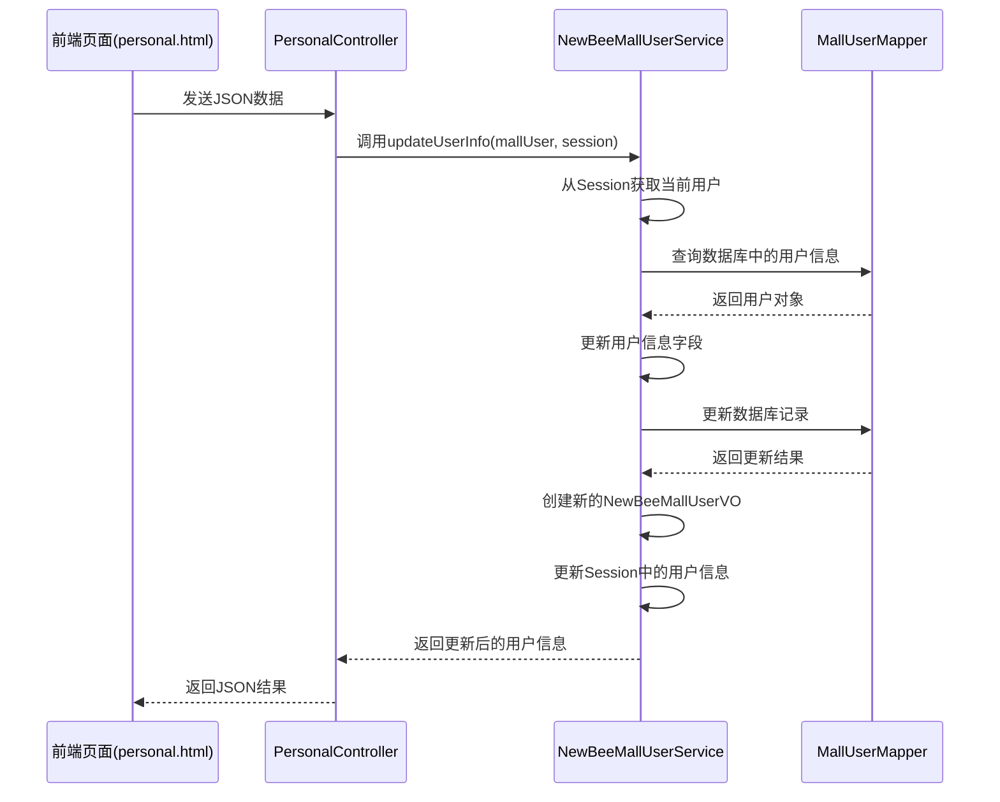

**Diagram sources**
- [PersonalController.java](file://src/main/java/ltd/newbee/mall/controller/mall/PersonalController.java#L123-L135)
- [NewBeeMallUserServiceImpl.java](file://src/main/java/ltd/newbee/mall/service/impl/NewBeeMallUserServiceImpl.java#L76-L97)

## 安全机制

### 密码加密
系统使用MD5Util工具类对用户密码进行MD5加密。

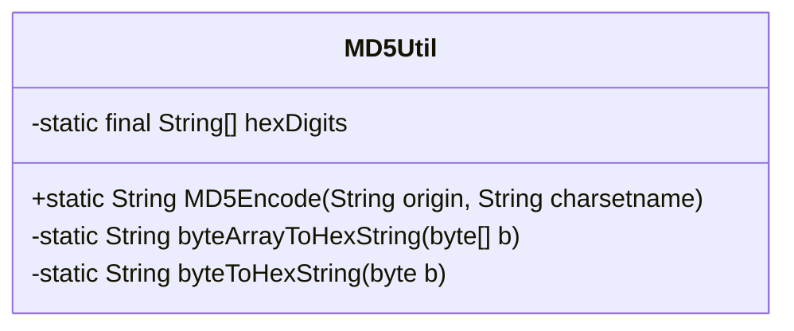

**Diagram sources**
- [MD5Util.java](file://src/main/java/ltd/newbee/mall/util/MD5Util.java#L11-L48)

### 验证码验证
系统使用Hutool库的ShearCaptcha生成和验证验证码。

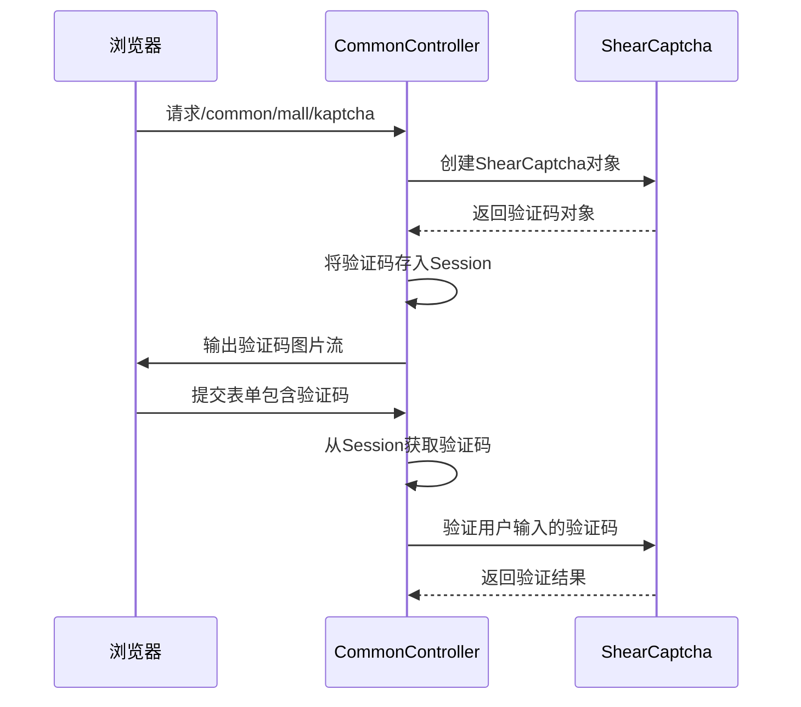

**Diagram sources**
- [CommonController.java](file://src/main/java/ltd/newbee/mall/controller/common/CommonController.java#L45-L59)
- [PersonalController.java](file://src/main/java/ltd/newbee/mall/controller/mall/PersonalController.java#L77-L81)

## 常量与结果枚举

### 常量类
Constants类定义了系统中使用的常量。

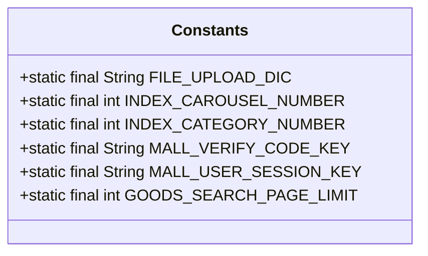

**Diagram sources**
- [Constants.java](file://src/main/java/ltd/newbee/mall/common/Constants.java#L18-L47)

### 结果枚举
ServiceResultEnum定义了系统统一的返回结果。

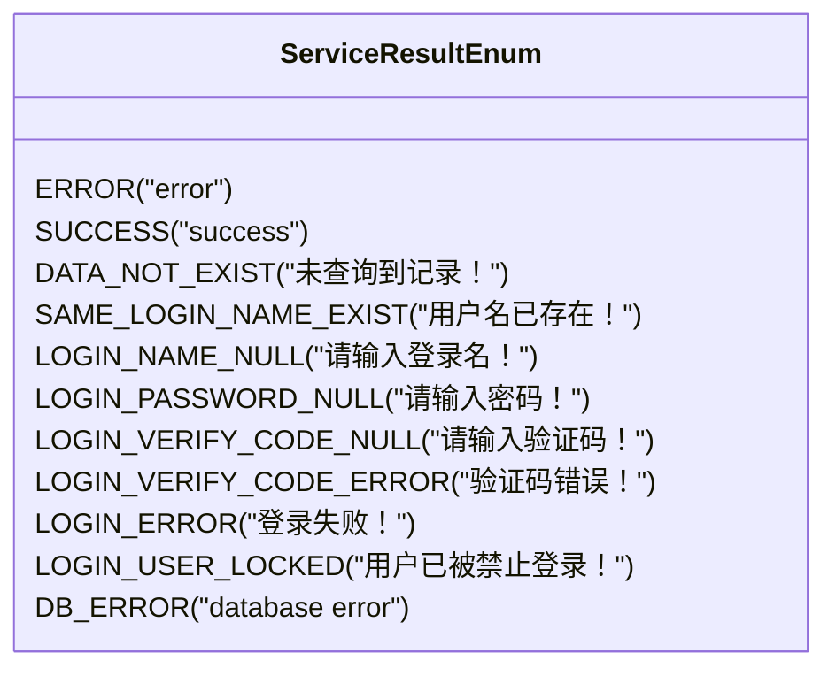

**Diagram sources**
- [ServiceResultEnum.java](file://src/main/java/ltd/newbee/mall/common/ServiceResultEnum.java#L17-L76)

## 数据模型

### 用户实体
MallUser实体类定义了用户数据结构。

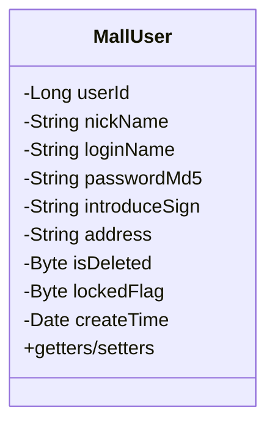

**Diagram sources**
- [MallUser.java](file://src/main/java/ltd/newbee/mall/entity/MallUser.java#L15-L125)

### 用户视图对象
NewBeeMallUserVO是返回给前端的用户视图对象。

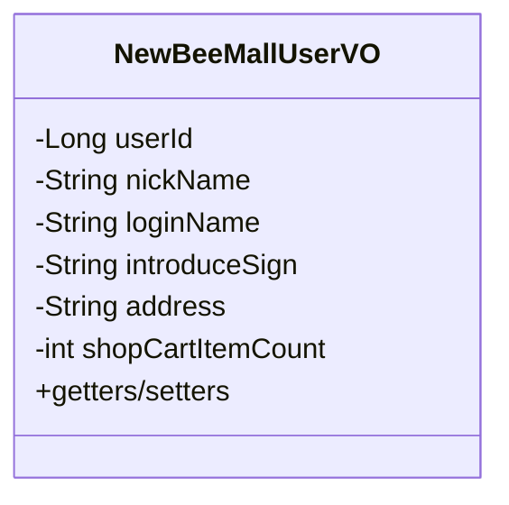

**Diagram sources**
- [NewBeeMallUserVO.java](file://src/main/java/ltd/newbee/mall/controller/vo/NewBeeMallUserVO.java#L13-L75)

## 前端交互

### 响应结果处理
系统使用Result和ResultGenerator统一处理API响应。

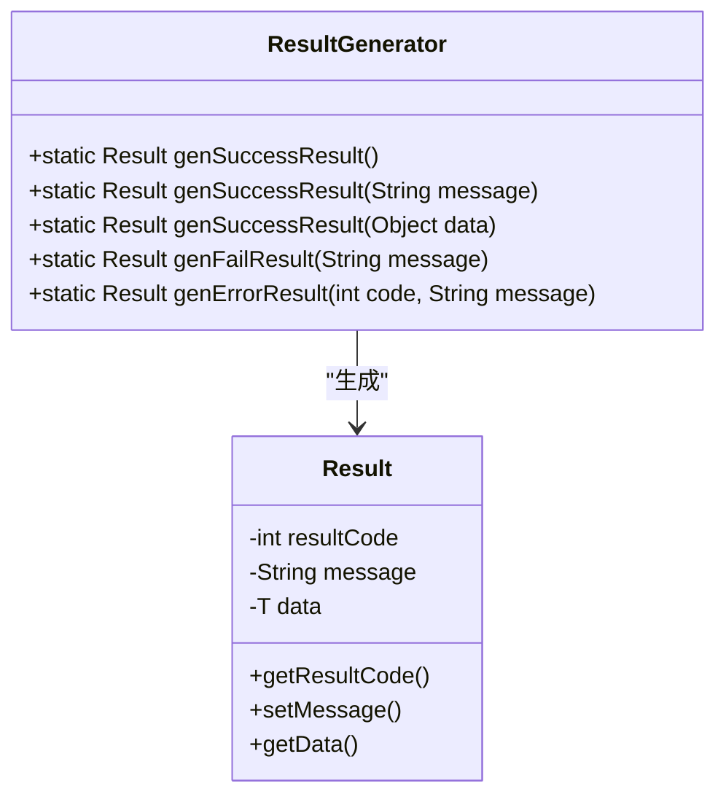

**Diagram sources**
- [Result.java](file://src/main/java/ltd/newbee/mall/util/Result.java#L11-L57)
- [ResultGenerator.java](file://src/main/java/ltd/newbee/mall/util/ResultGenerator.java#L13-L58)

### 前端页面
系统提供了完整的用户交互页面：

- **login.html**: 登录页面，包含验证码显示和表单验证
- **register.html**: 注册页面，包含验证码显示和表单验证
- **personal.html**: 个人中心页面，显示用户信息并提供修改功能

**Section sources**
- [login.html](file://src/main/resources/templates/mall/login.html)
- [register.html](file://src/main/resources/templates/mall/register.html)
- [personal.html](file://src/main/resources/templates/mall/personal.html)