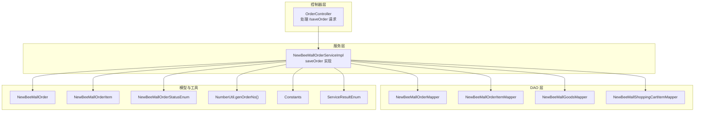
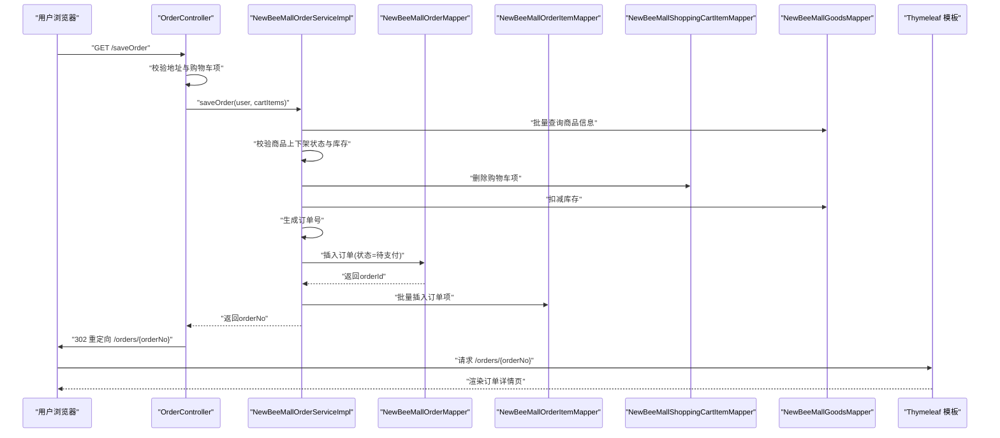
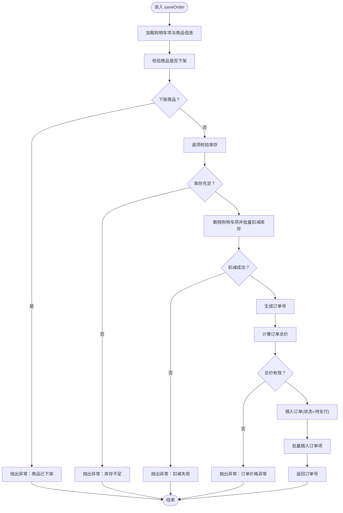
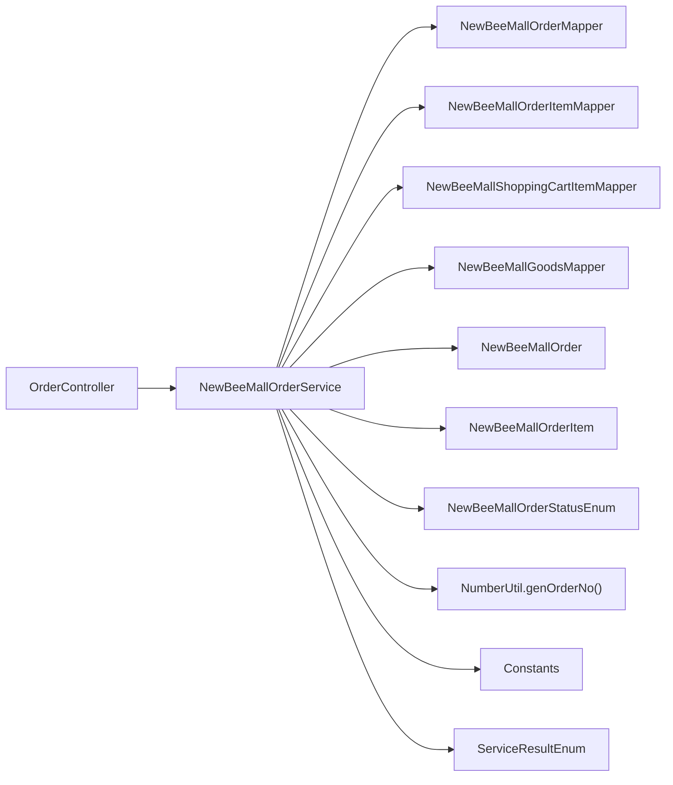

# 订单创建

<cite>
**本文引用的文件**
- [OrderController.java](file://src/main/java/ltd/newbee/mall/controller/mall/OrderController.java)
- [NewBeeMallOrderService.java](file://src/main/java/ltd/newbee/mall/service/NewBeeMallOrderService.java)
- [NewBeeMallOrderServiceImpl.java](file://src/main/java/ltd/newbee/mall/service/impl/NewBeeMallOrderServiceImpl.java)
- [NewBeeMallOrder.java](file://src/main/java/ltd/newbee/mall/entity/NewBeeMallOrder.java)
- [NewBeeMallOrderItem.java](file://src/main/java/ltd/newbee/mall/entity/NewBeeMallOrderItem.java)
- [NewBeeMallOrderMapper.java](file://src/main/java/ltd/newbee/mall/dao/NewBeeMallOrderMapper.java)
- [NewBeeMallOrderItemMapper.java](file://src/main/java/ltd/newbee/mall/dao/NewBeeMallOrderItemMapper.java)
- [NewBeeMallOrderStatusEnum.java](file://src/main/java/ltd/newbee/mall/common/NewBeeMallOrderStatusEnum.java)
- [NumberUtil.java](file://src/main/java/ltd/newbee/mall/util/NumberUtil.java)
- [Constants.java](file://src/main/java/ltd/newbee/mall/common/Constants.java)
- [ServiceResultEnum.java](file://src/main/java/ltd/newbee/mall/common/ServiceResultEnum.java)
- [order-detail.html](file://src/main/resources/templates/mall/order-detail.html)
</cite>

## 目录
1. [简介](#简介)
2. [项目结构](#项目结构)
3. [核心组件](#核心组件)
4. [架构总览](#架构总览)
5. [详细组件分析](#详细组件分析)
6. [依赖关系分析](#依赖关系分析)
7. [性能考量](#性能考量)
8. [故障排查指南](#故障排查指南)
9. [结论](#结论)

## 简介
本文围绕 newbee-mall 的“订单创建”功能展开，重点解析从购物车数据生成订单、库存校验、订单号生成、订单状态初始化（待支付）、事务管理与数据持久化、以及创建成功后的重定向与订单详情页展示。同时覆盖异常处理机制，包括库存不足、购物车数据异常、并发场景下的应对策略等。

## 项目结构
订单创建涉及 MVC 层与服务层、DAO 层的协作：
- 控制器层：负责接收请求、参数校验、调用服务层、重定向到订单详情页
- 服务层：实现业务规则（库存校验、订单号生成、订单与订单项持久化、状态初始化）
- DAO 层：提供订单、订单项、商品、购物车项的数据库访问能力
- 实体模型：订单、订单项、常量、枚举、结果枚举等



图表来源
- [OrderController.java](file://src/main/java/ltd/newbee/mall/controller/mall/OrderController.java#L67-L83)
- [NewBeeMallOrderServiceImpl.java](file://src/main/java/ltd/newbee/mall/service/impl/NewBeeMallOrderServiceImpl.java#L185-L263)
- [NewBeeMallOrderMapper.java](file://src/main/java/ltd/newbee/mall/dao/NewBeeMallOrderMapper.java#L1-L43)
- [NewBeeMallOrderItemMapper.java](file://src/main/java/ltd/newbee/mall/dao/NewBeeMallOrderItemMapper.java#L1-L52)
- [NewBeeMallOrder.java](file://src/main/java/ltd/newbee/mall/entity/NewBeeMallOrder.java#L1-L169)
- [NewBeeMallOrderItem.java](file://src/main/java/ltd/newbee/mall/entity/NewBeeMallOrderItem.java#L1-L111)
- [NewBeeMallOrderStatusEnum.java](file://src/main/java/ltd/newbee/mall/common/NewBeeMallOrderStatusEnum.java#L1-L64)
- [NumberUtil.java](file://src/main/java/ltd/newbee/mall/util/NumberUtil.java#L48-L58)
- [Constants.java](file://src/main/java/ltd/newbee/mall/common/Constants.java#L38-L48)
- [ServiceResultEnum.java](file://src/main/java/ltd/newbee/mall/common/ServiceResultEnum.java#L46-L77)

章节来源
- [OrderController.java](file://src/main/java/ltd/newbee/mall/controller/mall/OrderController.java#L67-L83)
- [NewBeeMallOrderServiceImpl.java](file://src/main/java/ltd/newbee/mall/service/impl/NewBeeMallOrderServiceImpl.java#L185-L263)

## 核心组件
- 订单控制器：负责接收 GET /saveOrder 请求，校验用户地址与购物车项，调用服务层生成订单并重定向到订单详情页
- 订单服务实现：核心业务逻辑，包括库存校验、订单号生成、订单与订单项持久化、状态初始化（待支付）、异常处理
- 订单与订单项实体：映射数据库表结构，承载订单状态、金额、地址等信息
- 订单状态枚举：定义订单状态常量与中文名称
- 工具类：订单号生成工具
- 结果与常量：统一异常与业务结果语义

章节来源
- [OrderController.java](file://src/main/java/ltd/newbee/mall/controller/mall/OrderController.java#L67-L83)
- [NewBeeMallOrderServiceImpl.java](file://src/main/java/ltd/newbee/mall/service/impl/NewBeeMallOrderServiceImpl.java#L185-L263)
- [NewBeeMallOrder.java](file://src/main/java/ltd/newbee/mall/entity/NewBeeMallOrder.java#L1-L169)
- [NewBeeMallOrderItem.java](file://src/main/java/ltd/newbee/mall/entity/NewBeeMallOrderItem.java#L1-L111)
- [NewBeeMallOrderStatusEnum.java](file://src/main/java/ltd/newbee/mall/common/NewBeeMallOrderStatusEnum.java#L1-L64)
- [NumberUtil.java](file://src/main/java/ltd/newbee/mall/util/NumberUtil.java#L48-L58)
- [ServiceResultEnum.java](file://src/main/java/ltd/newbee/mall/common/ServiceResultEnum.java#L46-L77)

## 架构总览
订单创建的端到端流程如下：
- 用户在结算页点击提交订单，触发 GET /saveOrder
- 控制器加载当前用户与购物车项，进行基础校验
- 调用服务层 saveOrder 完成库存校验、订单号生成、订单与订单项持久化、状态初始化
- 成功后返回订单号，控制器重定向到 /orders/{orderNo}
- 前端模板渲染订单详情页，展示订单状态、收货信息、支付入口等



图表来源
- [OrderController.java](file://src/main/java/ltd/newbee/mall/controller/mall/OrderController.java#L67-L83)
- [NewBeeMallOrderServiceImpl.java](file://src/main/java/ltd/newbee/mall/service/impl/NewBeeMallOrderServiceImpl.java#L185-L263)
- [NewBeeMallOrderMapper.java](file://src/main/java/ltd/newbee/mall/dao/NewBeeMallOrderMapper.java#L1-L43)
- [NewBeeMallOrderItemMapper.java](file://src/main/java/ltd/newbee/mall/dao/NewBeeMallOrderItemMapper.java#L1-L52)
- [order-detail.html](file://src/main/resources/templates/mall/order-detail.html#L1-L288)

## 详细组件分析

### 控制器：OrderController.saveOrder
职责与流程要点：
- 从会话中获取当前用户与地址
- 从购物车服务加载当前用户的购物车项
- 校验地址非空与购物车项非空
- 调用服务层 saveOrder 并获得订单号
- 使用订单号重定向到订单详情页

重定向逻辑：
- 成功后返回字符串 "redirect:/orders/{orderNo}"，由 Spring MVC 进行 302 跳转
- 详情页通过路径变量 orderNo 查询订单详情并渲染

章节来源
- [OrderController.java](file://src/main/java/ltd/newbee/mall/controller/mall/OrderController.java#L67-L83)
- [order-detail.html](file://src/main/resources/templates/mall/order-detail.html#L1-L288)

### 服务层：NewBeeMallOrderServiceImpl.saveOrder
事务与一致性：
- 方法标注 @Transactional，确保库存扣减、订单与订单项写入、购物车清理等操作在一个事务内完成，失败回滚

核心步骤与校验：
- 参数与购物车项准备：提取购物车项 ID 与商品 ID 列表
- 商品有效性校验：批量查询商品，过滤下架商品，抛出异常
- 库存校验：逐项比较购物车数量与库存，不足则抛出异常
- 数据清理与库存扣减：删除购物车项，批量扣减库存；扣减失败则抛出异常
- 订单号生成：使用工具类生成全局唯一订单号
- 订单金额计算：按单价×数量累加，金额小于 1 则抛出异常
- 订单持久化：设置订单号、用户 ID、地址、总价、状态为“待支付”，插入订单
- 订单项生成与持久化：遍历购物车项，复制为订单项快照，设置 orderId，批量插入
- 成功返回：返回订单号，供控制器重定向



图表来源
- [NewBeeMallOrderServiceImpl.java](file://src/main/java/ltd/newbee/mall/service/impl/NewBeeMallOrderServiceImpl.java#L185-L263)
- [NumberUtil.java](file://src/main/java/ltd/newbee/mall/util/NumberUtil.java#L48-L58)
- [NewBeeMallOrderStatusEnum.java](file://src/main/java/ltd/newbee/mall/common/NewBeeMallOrderStatusEnum.java#L18-L30)

章节来源
- [NewBeeMallOrderServiceImpl.java](file://src/main/java/ltd/newbee/mall/service/impl/NewBeeMallOrderServiceImpl.java#L185-L263)

### 数据模型与DAO
- 订单实体：包含订单号、用户 ID、总价、支付状态、订单状态、地址、创建/更新时间等
- 订单项实体：包含订单项 ID、订单 ID、商品 ID、商品名称、封面图、销售价、数量等
- 订单 Mapper：提供按主键、订单号查询、分页查询、状态变更（出库、配货完成、关闭）等
- 订单项 Mapper：提供按订单 ID 查询、按订单 ID 列表查询、批量插入等
- 商品 Mapper：提供库存扣减与恢复
- 购物车项 Mapper：提供批量删除

```mermaid
classDiagram
class NewBeeMallOrder {
+Long orderId
+String orderNo
+Long userId
+Integer totalPrice
+Byte payStatus
+Byte payType
+Date payTime
+Byte orderStatus
+String extraInfo
+String userAddress
+Byte isDeleted
+Date createTime
+Date updateTime
}
class NewBeeMallOrderItem {
+Long orderItemId
+Long orderId
+Long goodsId
+String goodsName
+String goodsCoverImg
+Integer sellingPrice
+Integer goodsCount
+Date createTime
}
class NewBeeMallOrderMapper {
+selectByOrderNo(orderNo)
+insertSelective(record)
+updateByPrimaryKeySelective(record)
+findNewBeeMallOrderList(pageUtil)
+getTotalNewBeeMallOrders(pageUtil)
+checkOut(orderIds)
+checkDone(orderIds)
+closeOrder(orderIds,status)
}
class NewBeeMallOrderItemMapper {
+selectByOrderId(orderId)
+selectByOrderIds(orderIds)
+insertBatch(orderItems)
+updateByPrimaryKeySelective(record)
}
NewBeeMallOrderItem --> NewBeeMallOrder : "外键 : orderId"
```

图表来源
- [NewBeeMallOrder.java](file://src/main/java/ltd/newbee/mall/entity/NewBeeMallOrder.java#L1-L169)
- [NewBeeMallOrderItem.java](file://src/main/java/ltd/newbee/mall/entity/NewBeeMallOrderItem.java#L1-L111)
- [NewBeeMallOrderMapper.java](file://src/main/java/ltd/newbee/mall/dao/NewBeeMallOrderMapper.java#L1-L43)
- [NewBeeMallOrderItemMapper.java](file://src/main/java/ltd/newbee/mall/dao/NewBeeMallOrderItemMapper.java#L1-L52)

章节来源
- [NewBeeMallOrder.java](file://src/main/java/ltd/newbee/mall/entity/NewBeeMallOrder.java#L1-L169)
- [NewBeeMallOrderItem.java](file://src/main/java/ltd/newbee/mall/entity/NewBeeMallOrderItem.java#L1-L111)
- [NewBeeMallOrderMapper.java](file://src/main/java/ltd/newbee/mall/dao/NewBeeMallOrderMapper.java#L1-L43)
- [NewBeeMallOrderItemMapper.java](file://src/main/java/ltd/newbee/mall/dao/NewBeeMallOrderItemMapper.java#L1-L52)

### 订单状态初始化与后续流程
- 初始化状态：订单创建时设置为“待支付”
- 支付流程：用户在订单详情页点击“去支付”，跳转到支付类型选择页，再进入具体支付页
- 支付成功回调：服务层将订单状态更新为“已支付”，支付状态更新为成功

章节来源
- [NewBeeMallOrderStatusEnum.java](file://src/main/java/ltd/newbee/mall/common/NewBeeMallOrderStatusEnum.java#L18-L30)
- [OrderController.java](file://src/main/java/ltd/newbee/mall/controller/mall/OrderController.java#L109-L145)
- [NewBeeMallOrderServiceImpl.java](file://src/main/java/ltd/newbee/mall/service/impl/NewBeeMallOrderServiceImpl.java#L374-L394)

### 异常处理机制
- 地址校验：地址为空时抛出“地址不能为空”异常
- 购物车校验：购物车为空时抛出“购物车数据异常”异常
- 商品下架：检测到下架商品时抛出“商品已下架”异常
- 库存不足：购物车数量超过库存时抛出“库存不足”异常
- 订单金额异常：总价小于 1 时抛出“订单价格异常”异常
- 数据库异常：批量扣减、插入失败时抛出“database error”异常
- 关闭订单恢复库存：关闭订单时恢复库存，失败抛出“关闭订单失败”异常

章节来源
- [OrderController.java](file://src/main/java/ltd/newbee/mall/controller/mall/OrderController.java#L67-L83)
- [NewBeeMallOrderServiceImpl.java](file://src/main/java/ltd/newbee/mall/service/impl/NewBeeMallOrderServiceImpl.java#L185-L263)
- [ServiceResultEnum.java](file://src/main/java/ltd/newbee/mall/common/ServiceResultEnum.java#L46-L77)

## 依赖关系分析
- 控制器依赖服务接口与购物车服务
- 服务实现依赖多个 Mapper 与工具类
- 实体与枚举提供状态与字段约束
- 模板依赖服务返回的订单详情视图模型



图表来源
- [OrderController.java](file://src/main/java/ltd/newbee/mall/controller/mall/OrderController.java#L67-L83)
- [NewBeeMallOrderServiceImpl.java](file://src/main/java/ltd/newbee/mall/service/impl/NewBeeMallOrderServiceImpl.java#L185-L263)
- [NewBeeMallOrderMapper.java](file://src/main/java/ltd/newbee/mall/dao/NewBeeMallOrderMapper.java#L1-L43)
- [NewBeeMallOrderItemMapper.java](file://src/main/java/ltd/newbee/mall/dao/NewBeeMallOrderItemMapper.java#L1-L52)
- [NewBeeMallOrder.java](file://src/main/java/ltd/newbee/mall/entity/NewBeeMallOrder.java#L1-L169)
- [NewBeeMallOrderItem.java](file://src/main/java/ltd/newbee/mall/entity/NewBeeMallOrderItem.java#L1-L111)
- [NewBeeMallOrderStatusEnum.java](file://src/main/java/ltd/newbee/mall/common/NewBeeMallOrderStatusEnum.java#L1-L64)
- [NumberUtil.java](file://src/main/java/ltd/newbee/mall/util/NumberUtil.java#L48-L58)
- [Constants.java](file://src/main/java/ltd/newbee/mall/common/Constants.java#L38-L48)
- [ServiceResultEnum.java](file://src/main/java/ltd/newbee/mall/common/ServiceResultEnum.java#L46-L77)

## 性能考量
- 批量操作：库存扣减与订单项批量插入采用批量接口，减少数据库往返次数
- 事务边界：将库存扣减、订单与订单项写入置于同一事务，避免中间态数据
- 查询优化：通过商品 ID 列表一次性批量查询，减少 N+1 查询
- 订单号生成：基于时间戳与随机数拼接，具备高并发下的唯一性保障

## 故障排查指南
- “地址不能为空”：检查用户会话中地址字段是否为空
- “购物车数据异常”：确认购物车项是否为空或被提前清空
- “商品已下架”：确认商品 sellStatus 是否为上架状态
- “库存不足”：核对商品库存与购物车数量，检查是否存在并发扣减导致的瞬时不足
- “订单价格异常”：检查单价与数量乘积是否合理
- “database error”：查看数据库连接与事务日志，确认批量操作是否成功
- “关闭订单失败”：确认订单项与库存恢复是否成功

章节来源
- [ServiceResultEnum.java](file://src/main/java/ltd/newbee/mall/common/ServiceResultEnum.java#L46-L77)
- [NewBeeMallOrderServiceImpl.java](file://src/main/java/ltd/newbee/mall/service/impl/NewBeeMallOrderServiceImpl.java#L185-L263)

## 结论
newbee-mall 的订单创建流程通过严格的参数校验、库存校验与事务保证，实现了从购物车到订单的可靠转换。服务层在事务内完成库存扣减、订单与订单项持久化，并将订单状态初始化为“待支付”。控制器负责重定向到订单详情页，前端模板据此展示订单状态与操作入口。异常处理覆盖常见问题场景，有助于快速定位与修复。建议在高并发场景下关注库存扣减的原子性与幂等性，必要时引入更细粒度的锁或分布式锁策略以进一步提升稳定性。