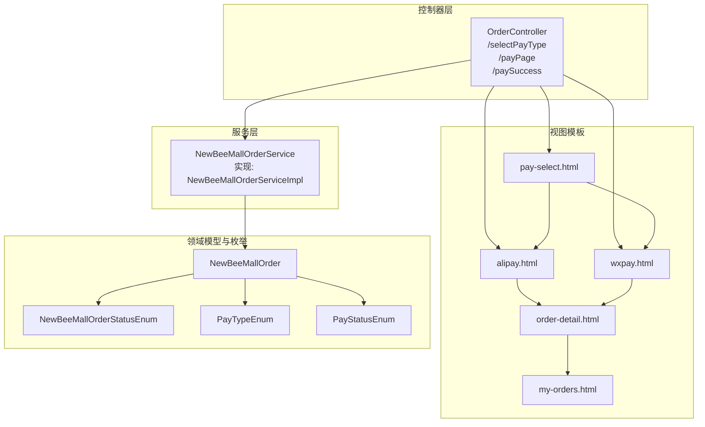
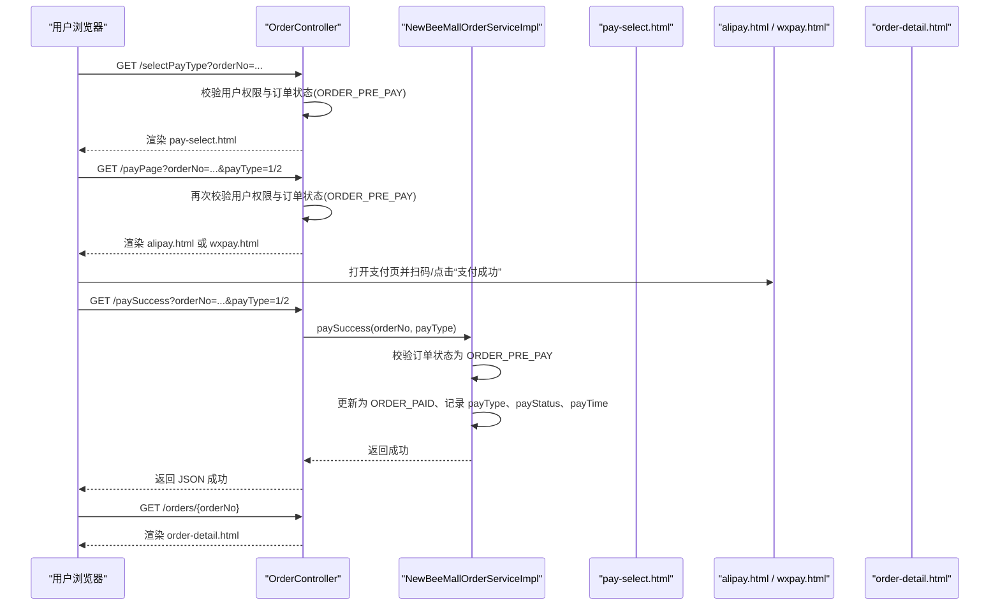
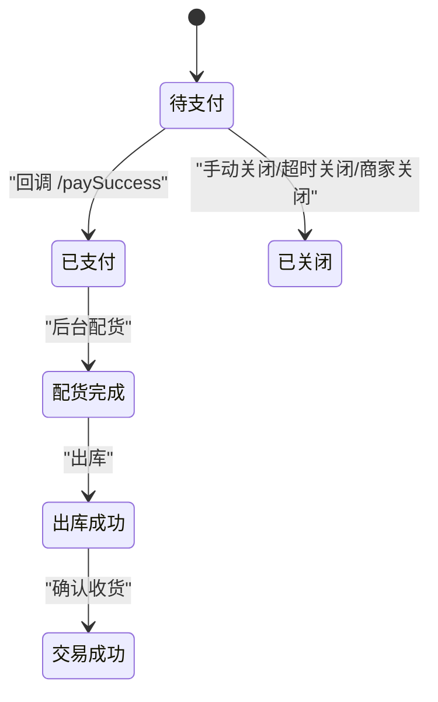
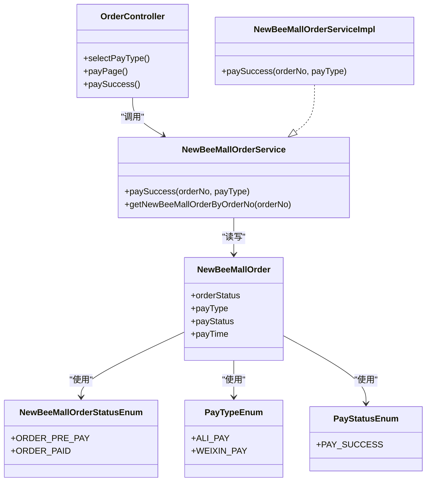

# 订单支付

<cite>
**本文引用的文件**
- [OrderController.java](file://src/main/java/ltd/newbee/mall/controller/mall/OrderController.java)
- [NewBeeMallOrderStatusEnum.java](file://src/main/java/ltd/newbee/mall/common/NewBeeMallOrderStatusEnum.java)
- [PayTypeEnum.java](file://src/main/java/ltd/newbee/mall/common/PayTypeEnum.java)
- [PayStatusEnum.java](file://src/main/java/ltd/newbee/mall/common/PayStatusEnum.java)
- [NewBeeMallOrderService.java](file://src/main/java/ltd/newbee/mall/service/NewBeeMallOrderService.java)
- [NewBeeMallOrderServiceImpl.java](file://src/main/java/ltd/newbee/mall/service/impl/NewBeeMallOrderServiceImpl.java)
- [NewBeeMallOrder.java](file://src/main/java/ltd/newbee/mall/entity/NewBeeMallOrder.java)
- [pay-select.html](file://src/main/resources/templates/mall/pay-select.html)
- [alipay.html](file://src/main/resources/templates/mall/alipay.html)
- [wxpay.html](file://src/main/resources/templates/mall/wxpay.html)
- [order-detail.html](file://src/main/resources/templates/mall/order-detail.html)
- [my-orders.html](file://src/main/resources/templates/mall/my-orders.html)
- [Constants.java](file://src/main/java/ltd/newbee/mall/common/Constants.java)
- [ServiceResultEnum.java](file://src/main/java/ltd/newbee/mall/common/ServiceResultEnum.java)
</cite>

## 目录
1. [简介](#简介)
2. [项目结构与入口](#项目结构与入口)
3. [核心组件](#核心组件)
4. [架构总览](#架构总览)
5. [详细组件分析](#详细组件分析)
6. [依赖关系分析](#依赖关系分析)
7. [性能与并发特性](#性能与并发特性)
8. [安全与防重考虑](#安全与防重考虑)
9. [故障排查指南](#故障排查指南)
10. [结论](#结论)

## 简介
本文件围绕 newbee-mall 的订单支付流程，系统性梳理 `/selectPayType` 与 `/payPage` 接口的协作机制，解释支付方式选择页面的渲染、订单状态校验（必须为待支付）、用户权限验证；重点阐述枚举常量 NewBeeMallOrderStatusEnum.ORDER_PRE_PAY 在支付流程中的关键作用；说明支付宝与微信两种支付类型的页面跳转逻辑；并完整解析支付成功后的 `/paySuccess` 回调接口如何更新订单状态为“已支付”、记录支付时间与支付方式。最后提供支付流程的状态转换图与安全建议（防重复支付与订单篡改）。

## 项目结构与入口
- 控制器层：负责接收前端请求、校验参数与会话、调用服务层并返回视图或JSON响应。
- 服务层：封装业务逻辑，包括订单状态校验、支付结果回调处理等。
- 视图模板：Thymeleaf 模板用于渲染支付选择页、支付宝/微信支付页以及支付成功后的跳转。
- 枚举与实体：定义订单状态、支付类型、支付状态与订单实体字段。

图表来源
- [OrderController.java](file://src/main/java/ltd/newbee/mall/controller/mall/OrderController.java#L109-L156)
- [NewBeeMallOrderServiceImpl.java](file://src/main/java/ltd/newbee/mall/service/impl/NewBeeMallOrderServiceImpl.java#L374-L394)
- [pay-select.html](file://src/main/resources/templates/mall/pay-select.html#L1-L170)
- [alipay.html](file://src/main/resources/templates/mall/alipay.html#L1-L97)
- [wxpay.html](file://src/main/resources/templates/mall/wxpay.html#L1-L95)
- [order-detail.html](file://src/main/resources/templates/mall/order-detail.html#L53-L135)
- [my-orders.html](file://src/main/resources/templates/mall/my-orders.html#L39-L56)
- [NewBeeMallOrder.java](file://src/main/java/ltd/newbee/mall/entity/NewBeeMallOrder.java#L1-L169)
- [NewBeeMallOrderStatusEnum.java](file://src/main/java/ltd/newbee/mall/common/NewBeeMallOrderStatusEnum.java#L18-L30)
- [PayTypeEnum.java](file://src/main/java/ltd/newbee/mall/common/PayTypeEnum.java#L18-L24)
- [PayStatusEnum.java](file://src/main/java/ltd/newbee/mall/common/PayStatusEnum.java#L18-L23)

章节来源
- [OrderController.java](file://src/main/java/ltd/newbee/mall/controller/mall/OrderController.java#L109-L156)
- [NewBeeMallOrderServiceImpl.java](file://src/main/java/ltd/newbee/mall/service/impl/NewBeeMallOrderServiceImpl.java#L374-L394)

## 核心组件
- 订单控制器 OrderController：提供支付相关接口，负责权限校验、状态校验与视图跳转。
- 订单服务 NewBeeMallOrderService/Impl：实现支付回调处理，更新订单状态、支付方式与支付时间。
- 支付页面模板：支付选择页、支付宝页、微信页，分别承载支付交互与回调触发。
- 枚举与实体：订单状态、支付类型、支付状态与订单实体字段，支撑状态机与持久化。

章节来源
- [OrderController.java](file://src/main/java/ltd/newbee/mall/controller/mall/OrderController.java#L109-L156)
- [NewBeeMallOrderServiceImpl.java](file://src/main/java/ltd/newbee/mall/service/impl/NewBeeMallOrderServiceImpl.java#L374-L394)
- [NewBeeMallOrderStatusEnum.java](file://src/main/java/ltd/newbee/mall/common/NewBeeMallOrderStatusEnum.java#L18-L30)
- [PayTypeEnum.java](file://src/main/java/ltd/newbee/mall/common/PayTypeEnum.java#L18-L24)
- [PayStatusEnum.java](file://src/main/java/ltd/newbee/mall/common/PayStatusEnum.java#L18-L23)
- [NewBeeMallOrder.java](file://src/main/java/ltd/newbee/mall/entity/NewBeeMallOrder.java#L1-L169)

## 架构总览
支付流程由三个控制器接口与多个模板组成，形成“选择支付方式—进入支付页—回调更新状态”的闭环。控制器在进入支付页前进行用户权限与订单状态校验，确保仅允许当前用户访问其“待支付”订单；支付成功后通过回调接口将订单状态置为“已支付”，并记录支付方式与支付时间。

图表来源
- [OrderController.java](file://src/main/java/ltd/newbee/mall/controller/mall/OrderController.java#L109-L156)
- [NewBeeMallOrderServiceImpl.java](file://src/main/java/ltd/newbee/mall/service/impl/NewBeeMallOrderServiceImpl.java#L374-L394)
- [pay-select.html](file://src/main/resources/templates/mall/pay-select.html#L1-L170)
- [alipay.html](file://src/main/resources/templates/mall/alipay.html#L1-L97)
- [wxpay.html](file://src/main/resources/templates/mall/wxpay.html#L1-L95)
- [order-detail.html](file://src/main/resources/templates/mall/order-detail.html#L53-L135)

## 详细组件分析

### 支付方式选择页：/selectPayType
- 功能职责
  - 校验当前会话用户与订单归属一致性（防止越权访问）。
  - 校验订单状态必须为“待支付”（ORDER_PRE_PAY），否则拒绝。
  - 将订单号与应付金额放入请求域，渲染支付选择页。
- 关键点
  - 用户权限验证：从会话中读取用户标识并与订单用户ID比对。
  - 订单状态校验：使用枚举 ORDER_PRE_PAY 进行严格判断。
  - 视图渲染：返回 pay-select.html，携带 orderNo 与 totalPrice。

章节来源
- [OrderController.java](file://src/main/java/ltd/newbee/mall/controller/mall/OrderController.java#L109-L124)
- [Constants.java](file://src/main/java/ltd/newbee/mall/common/Constants.java#L36-L40)
- [NewBeeMallOrderStatusEnum.java](file://src/main/java/ltd/newbee/mall/common/NewBeeMallOrderStatusEnum.java#L18-L30)
- [pay-select.html](file://src/main/resources/templates/mall/pay-select.html#L1-L170)

### 支付页面跳转：/payPage
- 功能职责
  - 与 /selectPayType 类似的权限与状态校验。
  - 根据 payType 参数决定跳转到支付宝页或微信页。
- 关键点
  - 支付类型映射：1 表示支付宝，其他视为微信。
  - 视图渲染：返回 alipay.html 或 wxpay.html，携带 orderNo 与 totalPrice。

章节来源
- [OrderController.java](file://src/main/java/ltd/newbee/mall/controller/mall/OrderController.java#L126-L145)
- [PayTypeEnum.java](file://src/main/java/ltd/newbee/mall/common/PayTypeEnum.java#L18-L24)
- [alipay.html](file://src/main/resources/templates/mall/alipay.html#L1-L97)
- [wxpay.html](file://src/main/resources/templates/mall/wxpay.html#L1-L95)

### 支付成功回调：/paySuccess
- 功能职责
  - 服务层 paySuccess 负责最终落库更新：订单状态、支付方式、支付状态、支付时间。
  - 严格校验订单状态必须为“待支付”，避免重复支付或状态倒退。
- 关键点
  - 订单状态转换：ORDER_PRE_PAY -> ORDER_PAID。
  - 字段更新：payType、payStatus、payTime、updateTime。
  - 返回结果：成功返回统一成功结果，失败返回相应错误码。

章节来源
- [OrderController.java](file://src/main/java/ltd/newbee/mall/controller/mall/OrderController.java#L147-L156)
- [NewBeeMallOrderServiceImpl.java](file://src/main/java/ltd/newbee/mall/service/impl/NewBeeMallOrderServiceImpl.java#L374-L394)
- [PayStatusEnum.java](file://src/main/java/ltd/newbee/mall/common/PayStatusEnum.java#L18-L23)
- [NewBeeMallOrder.java](file://src/main/java/ltd/newbee/mall/entity/NewBeeMallOrder.java#L1-L169)

### 支付页面模板与交互
- 支付选择页（pay-select.html）
  - 展示订单号与应付金额。
  - 提供支付方式选择，点击后通过 JS 跳转到 /payPage 并附带 payType。
- 支付宝页（alipay.html）与微信页（wxpay.html）
  - 展示二维码与提示信息。
  - 点击“支付成功”按钮发起 /paySuccess 请求，成功后跳转到订单详情页。

章节来源
- [pay-select.html](file://src/main/resources/templates/mall/pay-select.html#L1-L170)
- [alipay.html](file://src/main/resources/templates/mall/alipay.html#L1-L97)
- [wxpay.html](file://src/main/resources/templates/mall/wxpay.html#L1-L95)
- [order-detail.html](file://src/main/resources/templates/mall/order-detail.html#L53-L135)

### 订单状态转换图

图表来源
- [NewBeeMallOrderStatusEnum.java](file://src/main/java/ltd/newbee/mall/common/NewBeeMallOrderStatusEnum.java#L18-L30)
- [NewBeeMallOrderServiceImpl.java](file://src/main/java/ltd/newbee/mall/service/impl/NewBeeMallOrderServiceImpl.java#L374-L394)

## 依赖关系分析
- 控制器依赖服务层接口，服务层依赖订单 Mapper 与枚举常量。
- 支付页面模板依赖控制器传入的 orderNo 与 totalPrice。
- 订单实体包含支付状态、支付方式、支付时间与订单状态字段，构成状态机基础。

图表来源
- [OrderController.java](file://src/main/java/ltd/newbee/mall/controller/mall/OrderController.java#L109-L156)
- [NewBeeMallOrderService.java](file://src/main/java/ltd/newbee/mall/service/NewBeeMallOrderService.java#L114-L115)
- [NewBeeMallOrderServiceImpl.java](file://src/main/java/ltd/newbee/mall/service/impl/NewBeeMallOrderServiceImpl.java#L374-L394)
- [NewBeeMallOrder.java](file://src/main/java/ltd/newbee/mall/entity/NewBeeMallOrder.java#L1-L169)
- [NewBeeMallOrderStatusEnum.java](file://src/main/java/ltd/newbee/mall/common/NewBeeMallOrderStatusEnum.java#L18-L30)
- [PayTypeEnum.java](file://src/main/java/ltd/newbee/mall/common/PayTypeEnum.java#L18-L24)
- [PayStatusEnum.java](file://src/main/java/ltd/newbee/mall/common/PayStatusEnum.java#L18-L23)

章节来源
- [OrderController.java](file://src/main/java/ltd/newbee/mall/controller/mall/OrderController.java#L109-L156)
- [NewBeeMallOrderServiceImpl.java](file://src/main/java/ltd/newbee/mall/service/impl/NewBeeMallOrderServiceImpl.java#L374-L394)

## 性能与并发特性
- 控制器层为无状态接口，主要承担参数校验与视图转发，性能开销低。
- 服务层 paySuccess 使用事务与严格的状态前置校验，避免重复更新带来的并发问题。
- 前端模板渲染基于 Thymeleaf，静态资源较少，整体响应较快。
- 建议
  - 在高并发场景下，可结合幂等令牌或订单唯一性约束，进一步降低重复回调风险。
  - 对 /paySuccess 的调用应尽量短路，避免阻塞线程。

[本节为通用性能讨论，无需列出具体文件来源]

## 安全与防重考虑
- 防止越权访问
  - 控制器在两个入口均校验当前会话用户与订单归属一致，避免他人代付。
- 防止重复支付
  - 服务层 paySuccess 在更新前再次校验订单状态必须为“待支付”，若状态已改变则拒绝更新，从而天然防重。
- 防止订单篡改
  - 订单状态转换遵循枚举定义，状态变更路径清晰，避免非法状态跳跃。
- 其他建议
  - 引入回调签名验证（如对接第三方支付时），确保回调来源可信。
  - 对 /paySuccess 接口增加幂等控制（例如基于 orderNo 的一次性消费标记），防止重复回调导致多次更新。
  - 对订单号与支付类型进行强类型校验与范围限制，避免注入或越界访问。

章节来源
- [OrderController.java](file://src/main/java/ltd/newbee/mall/controller/mall/OrderController.java#L109-L145)
- [NewBeeMallOrderServiceImpl.java](file://src/main/java/ltd/newbee/mall/service/impl/NewBeeMallOrderServiceImpl.java#L374-L394)
- [ServiceResultEnum.java](file://src/main/java/ltd/newbee/mall/common/ServiceResultEnum.java#L64-L77)

## 故障排查指南
- 常见错误与定位
  - “订单状态异常”：通常由于订单状态非“待支付”导致，检查回调时订单是否已被其他流程修改。
  - “无权限”：当前会话用户与订单用户不一致，检查登录态与订单归属。
  - “订单不存在”：orderNo 错误或数据未生成。
- 排查步骤
  - 确认 /selectPayType 与 /payPage 的权限与状态校验是否通过。
  - 检查 /paySuccess 的请求参数 orderNo 与 payType 是否正确传递。
  - 查看服务层 paySuccess 的返回结果，结合 ServiceResultEnum 判断具体原因。
  - 在 order-detail.html 中核对订单状态与支付信息是否更新。

章节来源
- [ServiceResultEnum.java](file://src/main/java/ltd/newbee/mall/common/ServiceResultEnum.java#L64-L77)
- [OrderController.java](file://src/main/java/ltd/newbee/mall/controller/mall/OrderController.java#L109-L156)
- [order-detail.html](file://src/main/resources/templates/mall/order-detail.html#L53-L135)

## 结论
newbee-mall 的支付流程通过严格的权限与状态校验，确保只有“待支付”订单可被支付；选择支付方式后按支付类型跳转至对应页面，最终通过 /paySuccess 回调将订单状态置为“已支付”，并记录支付方式与支付时间。该设计具备良好的可维护性与安全性，建议在生产环境中配合签名验证与幂等控制，进一步提升可靠性。