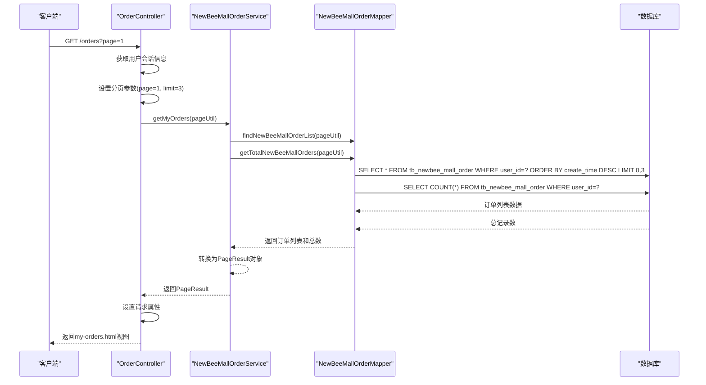
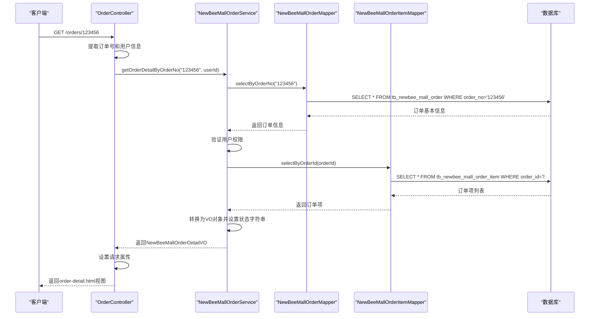
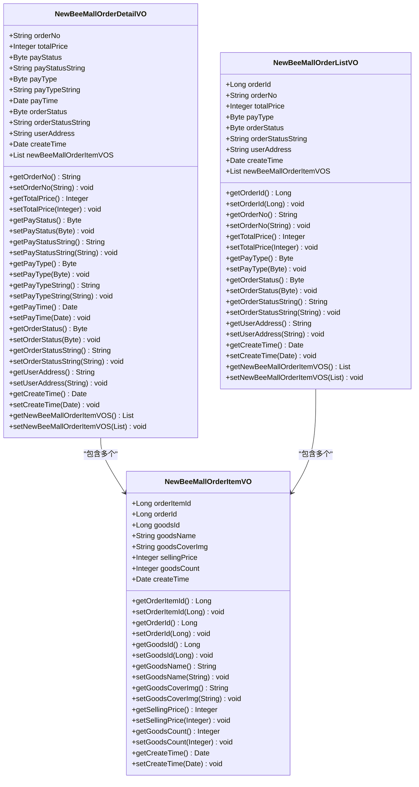
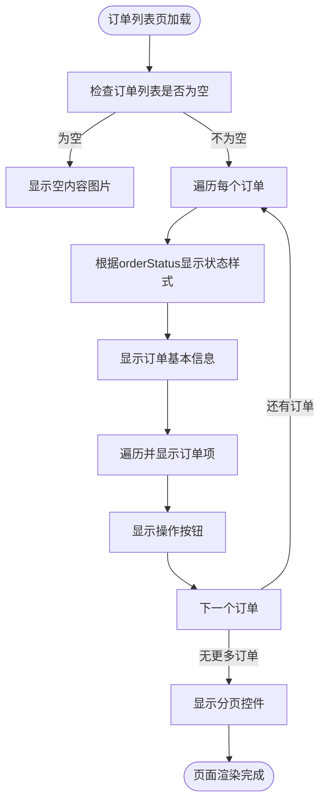
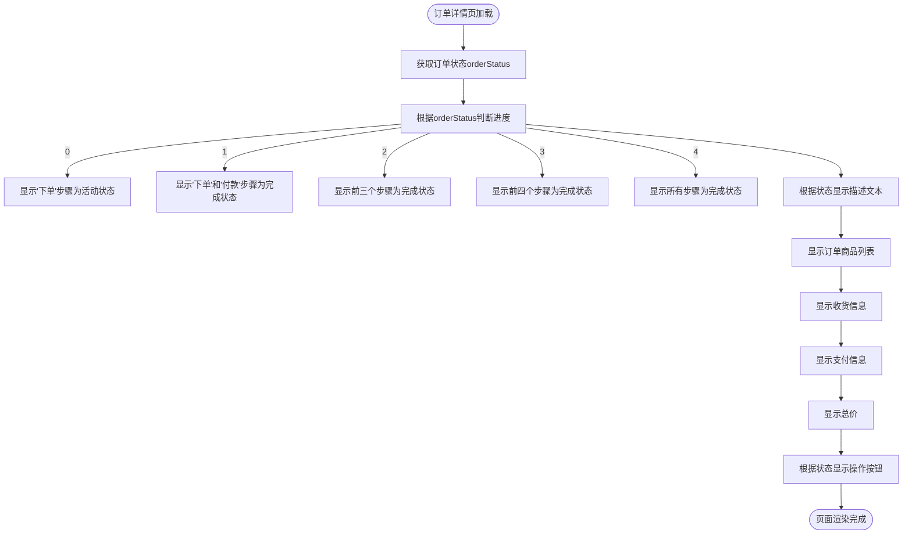

# 订单查询

<cite>
**本文档引用的文件**   
- [OrderController.java](file://src/main/java/ltd/newbee/mall/controller/mall/OrderController.java)
- [NewBeeMallOrderService.java](file://src/main/java/ltd/newbee/mall/service/NewBeeMallOrderService.java)
- [NewBeeMallOrderServiceImpl.java](file://src/main/java/ltd/newbee/mall/service/impl/NewBeeMallOrderServiceImpl.java)
- [NewBeeMallOrderMapper.java](file://src/main/java/ltd/newbee/mall/dao/NewBeeMallOrderMapper.java)
- [NewBeeMallOrderMapper.xml](file://src/main/resources/mapper/NewBeeMallOrderMapper.xml)
- [NewBeeMallOrderDetailVO.java](file://src/main/java/ltd/newbee/mall/controller/vo/NewBeeMallOrderDetailVO.java)
- [NewBeeMallOrderListVO.java](file://src/main/java/ltd/newbee/mall/controller/vo/NewBeeMallOrderListVO.java)
- [NewBeeMallOrderStatusEnum.java](file://src/main/java/ltd/newbee/mall/common/NewBeeMallOrderStatusEnum.java)
- [Constants.java](file://src/main/java/ltd/newbee/mall/common/Constants.java)
- [my-orders.html](file://src/main/resources/templates/mall/my-orders.html)
- [order-detail.html](file://src/main/resources/templates/mall/order-detail.html)
- [my-orders.css](file://src/main/resources/static/mall/styles/my-orders.css)
- [order-detail.css](file://src/main/resources/static/mall/styles/order-detail.css)
</cite>

## 目录
1. [简介](#简介)
2. [订单列表查询实现](#订单列表查询实现)
3. [订单详情查询实现](#订单详情查询实现)
4. [数据传输对象结构](#数据传输对象结构)
5. [用户界面展示逻辑](#用户界面展示逻辑)
6. [性能优化建议](#性能优化建议)
7. [结论](#结论)

## 简介
本文档详细说明newbee-mall系统中订单查询功能的实现机制。重点分析`GET /orders`接口的分页查询实现，包括用户ID筛选、状态过滤和分页参数处理；阐述`GET /orders/{orderNo}`接口获取订单详情的流程；解析`NewBeeMallOrderDetailVO`数据传输对象的构成；并说明订单列表页和详情页的UI展示逻辑，特别是订单状态进度条的实现。最后提供订单查询相关的性能优化建议。

## 订单列表查询实现

订单列表查询功能通过`GET /orders`接口实现，支持分页、用户筛选和状态过滤。该功能主要由`OrderController`、`NewBeeMallOrderService`和`NewBeeMallOrderMapper`三个层次协同完成。

在控制器层，`OrderController`的`orderListPage`方法处理订单列表请求。该方法从HTTP会话中获取当前用户信息，并将用户ID作为查询参数添加到请求参数中，确保用户只能查询自己的订单。同时，方法设置了默认的分页参数：每页显示3条记录（通过`Constants.ORDER_SEARCH_PAGE_LIMIT`常量定义），如果请求中未指定页码，则默认显示第一页。



**图示来源**
- [OrderController.java](file://src/main/java/ltd/newbee/mall/controller/mall/OrderController.java#L52-L65)
- [NewBeeMallOrderServiceImpl.java](file://src/main/java/ltd/newbee/mall/service/impl/NewBeeMallOrderServiceImpl.java#L294-L323)
- [NewBeeMallOrderMapper.xml](file://src/main/resources/mapper/NewBeeMallOrderMapper.xml#L44-L75)

在服务层，`NewBeeMallOrderService`接口定义了`getMyOrders`方法，该方法接收`PageQueryUtil`分页工具对象作为参数。实现类`NewBeeMallOrderServiceImpl`中，该方法首先调用DAO层获取订单总数，然后获取分页后的订单列表数据。获取到订单数据后，服务层会进行数据转换，将实体类`NewBeeMallOrder`转换为视图对象`NewBeeMallOrderListVO`，并设置订单状态的中文显示值。

在数据访问层，`NewBeeMallOrderMapper`接口通过MyBatis映射文件`NewBeeMallOrderMapper.xml`中的SQL语句实现数据查询。`findNewBeeMallOrderList`查询语句根据传入的参数动态构建WHERE条件，支持按订单号、用户ID、支付类型、订单状态等条件筛选，并按创建时间倒序排列，最后应用LIMIT子句实现分页。

**本节来源**
- [OrderController.java](file://src/main/java/ltd/newbee/mall/controller/mall/OrderController.java#L52-L65)
- [NewBeeMallOrderServiceImpl.java](file://src/main/java/ltd/newbee/mall/service/impl/NewBeeMallOrderServiceImpl.java#L294-L323)
- [NewBeeMallOrderMapper.xml](file://src/main/resources/mapper/NewBeeMallOrderMapper.xml#L44-L75)

## 订单详情查询实现

订单详情查询功能通过`GET /orders/{orderNo}`接口实现，用于获取特定订单的完整信息。该功能同样遵循MVC架构模式，由控制器、服务和数据访问层协同完成。

在控制器层，`OrderController`的`orderDetailPage`方法处理订单详情请求。该方法通过`@PathVariable`注解从URL路径中提取订单号，并从HTTP会话中获取当前用户信息。然后调用服务层的`getOrderDetailByOrderNo`方法获取订单详情数据，并将结果设置为请求属性，最后返回`order-detail.html`视图。



**图示来源**
- [OrderController.java](file://src/main/java/ltd/newbee/mall/controller/mall/OrderController.java#L44-L50)
- [NewBeeMallOrderServiceImpl.java](file://src/main/java/ltd/newbee/mall/service/impl/NewBeeMallOrderServiceImpl.java#L264-L287)
- [NewBeeMallOrderMapper.xml](file://src/main/resources/mapper/NewBeeMallOrderMapper.xml#L29-L34)

在服务层，`NewBeeMallOrderServiceImpl`的`getOrderDetailByOrderNo`方法首先调用`NewBeeMallOrderMapper`的`selectByOrderNo`方法根据订单号查询订单基本信息。查询到订单后，方法会验证该订单是否属于当前用户，以确保数据安全。验证通过后，方法调用`NewBeeMallOrderItemMapper`的`selectByOrderId`方法查询该订单的所有订单项。最后，服务层将订单信息和订单项信息封装到`NewBeeMallOrderDetailVO`数据传输对象中，并设置订单状态和支付类型的中文显示字符串。

在数据访问层，`NewBeeMallOrderMapper`的`selectByOrderNo`方法通过MyBatis映射文件中的SQL语句查询订单基本信息，而`NewBeeMallOrderItemMapper`的`selectByOrderId`方法则查询订单项信息。这两个查询操作是独立的，体现了数据库设计中的规范化原则。

**本节来源**
- [OrderController.java](file://src/main/java/ltd/newbee/mall/controller/mall/OrderController.java#L44-L50)
- [NewBeeMallOrderServiceImpl.java](file://src/main/java/ltd/newbee/mall/service/impl/NewBeeMallOrderServiceImpl.java#L264-L287)
- [NewBeeMallOrderMapper.xml](file://src/main/resources/mapper/NewBeeMallOrderMapper.xml#L29-L34)
- [NewBeeMallOrderItemMapper.xml](file://src/main/resources/mapper/NewBeeMallOrderItemMapper.xml#L24-L28)

## 数据传输对象结构

订单查询功能使用了两个主要的数据传输对象（DTO）：`NewBeeMallOrderListVO`用于订单列表展示，`NewBeeMallOrderDetailVO`用于订单详情展示。这些VO对象位于`ltd.newbee.mall.controller.vo`包中，用于在控制器层和视图层之间传输数据。



**图示来源**
- [NewBeeMallOrderDetailVO.java](file://src/main/java/ltd/newbee/mall/controller/vo/NewBeeMallOrderDetailVO.java)
- [NewBeeMallOrderListVO.java](file://src/main/java/ltd/newbee/mall/controller/vo/NewBeeMallOrderListVO.java)
- [NewBeeMallOrderItemVO.java](file://src/main/java/ltd/newbee/mall/controller/vo/NewBeeMallOrderItemVO.java)

`NewBeeMallOrderDetailVO`类包含了订单的完整信息，主要属性包括：
- **订单基本信息**：订单号（orderNo）、总价（totalPrice）、创建时间（createTime）、收货地址（userAddress）
- **支付信息**：支付状态（payStatus）、支付类型（payType）、支付时间（payTime）
- **订单状态**：订单状态码（orderStatus）和状态字符串（orderStatusString）
- **关联数据**：订单项列表（newBeeMallOrderItemVOS）

`NewBeeMallOrderListVO`类是`NewBeeMallOrderDetailVO`的简化版本，主要用于订单列表展示，包含订单的核心信息。两个VO类都包含了`orderStatusString`属性，该属性存储订单状态的中文描述，由服务层根据`NewBeeMallOrderStatusEnum`枚举值设置。

`NewBeeMallOrderItemVO`类表示订单中的单个商品项，包含商品ID、名称、封面图片、售价和数量等信息。在订单详情查询中，一个订单可能包含多个订单项，因此`NewBeeMallOrderDetailVO`中的`newBeeMallOrderItemVOS`属性是一个列表。

**本节来源**
- [NewBeeMallOrderDetailVO.java](file://src/main/java/ltd/newbee/mall/controller/vo/NewBeeMallOrderDetailVO.java)
- [NewBeeMallOrderListVO.java](file://src/main/java/ltd/newbee/mall/controller/vo/NewBeeMallOrderListVO.java)
- [NewBeeMallOrderItemVO.java](file://src/main/java/ltd/newbee/mall/controller/vo/NewBeeMallOrderItemVO.java)

## 用户界面展示逻辑

订单查询功能的用户界面由Thymeleaf模板引擎渲染，主要包括订单列表页（my-orders.html）和订单详情页（order-detail.html）。这两页的UI展示逻辑紧密结合后端数据，提供了清晰的订单信息展示和状态指示。

### 订单列表页UI逻辑

订单列表页通过`my-orders.html`模板实现，展示了用户的所有订单。页面采用分页显示，每页显示3条订单记录。对于每条订单，页面展示了订单状态、下单时间、订单号、应付金额、商品列表和操作按钮。

订单状态的展示采用了条件渲染机制，根据订单状态码显示不同的样式和文字：
- **待支付订单**（状态码0）：显示为蓝色，提示"待支付"
- **已支付订单**（状态码1-3）：显示为绿色，提示"交易成功"
- **其他状态订单**：显示为灰色，提示相应状态



**图示来源**
- [my-orders.html](file://src/main/resources/templates/mall/my-orders.html)
- [my-orders.css](file://src/main/resources/static/mall/styles/my-orders.css)

### 订单详情页UI逻辑

订单详情页通过`order-detail.html`模板实现，展示了单个订单的完整信息。页面的核心是订单状态进度条，直观地展示了订单的处理进度。进度条包含五个步骤：下单、付款、配货、出库和交易成功。



**图示来源**
- [order-detail.html](file://src/main/resources/templates/mall/order-detail.html)
- [order-detail.css](file://src/main/resources/static/mall/styles/order-detail.css)

订单状态进度条的实现基于CSS类控制，通过Thymeleaf的条件判断为不同状态的订单添加相应的CSS类：
- **step-active**：当前进行中的步骤，显示为绿色
- **step-done**：已完成的步骤，显示为绿色
- **step-first**：第一个步骤的特殊样式
- **step-last**：最后一个步骤的特殊样式

订单详情页还根据订单状态显示不同的操作按钮：
- **待支付订单**：显示"去支付"按钮
- **已支付但未收货订单**：显示"取消订单"按钮
- **已出库订单**：显示"确认收货"按钮

这些操作按钮通过JavaScript事件处理函数与后端API交互，如`cancelOrder()`函数通过PUT请求调用`/orders/{orderNo}/cancel`接口取消订单。

**本节来源**
- [my-orders.html](file://src/main/resources/templates/mall/my-orders.html)
- [order-detail.html](file://src/main/resources/templates/mall/order-detail.html)
- [my-orders.css](file://src/main/resources/static/mall/styles/my-orders.css)
- [order-detail.css](file://src/main/resources/static/mall/styles/order-detail.css)

## 性能优化建议

基于对newbee-mall订单查询功能的分析，提出以下性能优化建议，以提高系统响应速度和用户体验。

### 数据库索引优化

当前订单查询主要基于`user_id`和`create_time`字段进行筛选和排序。建议在数据库表`tb_newbee_mall_order`上创建复合索引以优化查询性能：

```sql
-- 为用户订单查询创建复合索引
CREATE INDEX idx_user_create_time ON tb_newbee_mall_order(user_id, create_time DESC);

-- 为订单号查询创建唯一索引
CREATE UNIQUE INDEX idx_order_no ON tb_newbee_mall_order(order_no);

-- 为订单状态查询创建索引
CREATE INDEX idx_order_status ON tb_newbee_mall_order(order_status);
```

这些索引将显著提高`GET /orders`接口的查询速度，特别是当用户拥有大量订单时。复合索引`idx_user_create_time`可以同时满足用户筛选和按时间排序的需求，避免了文件排序操作。

### 缓存策略

建议引入缓存机制来减少数据库访问频率，提高系统性能：

1. **订单详情缓存**：对于`GET /orders/{orderNo}`接口，可以使用Redis等内存数据库缓存订单详情数据。设置合理的过期时间（如15分钟），既能保证数据新鲜度，又能显著减少数据库压力。

2. **订单列表缓存**：对于`GET /orders`接口，可以缓存分页结果。由于订单列表会随着新订单的创建而变化，建议设置较短的过期时间（如5分钟），或在创建新订单时主动清除相关缓存。

3. **缓存键设计**：采用有意义的缓存键命名策略，如`order:detail:{orderNo}`和`order:list:{userId}:{page}`，便于缓存管理和监控。

### 分页优化

当前系统每页显示3条记录，虽然减少了单次查询的数据量，但可能导致用户需要频繁翻页。建议：
- 将每页显示数量调整为10-20条，平衡性能和用户体验
- 实现"加载更多"功能，采用无限滚动替代传统分页
- 对于历史订单查询，提供年份/月份筛选，减少查询范围

### 查询优化

1. **延迟加载**：在订单列表查询中，避免一次性加载所有订单项数据。只有在用户查看订单详情时才查询订单项，减少不必要的数据库访问。

2. **字段选择优化**：在查询中只选择必要的字段，避免使用`SELECT *`。特别是在订单列表查询中，可以只查询订单基本信息，而不包含详细的商品信息。

3. **连接查询优化**：考虑在必要时使用JOIN查询替代多次单表查询，减少数据库往返次数。但需权衡规范化和性能之间的平衡。

**本节来源**
- [NewBeeMallOrderMapper.xml](file://src/main/resources/mapper/NewBeeMallOrderMapper.xml)
- [newbee_mall_schema.sql](file://src/main/resources/newbee_mall_schema.sql)

## 结论

newbee-mall系统的订单查询功能实现了完整的订单管理需求，包括分页查询、详情查看和状态展示。系统采用标准的MVC架构，代码结构清晰，职责分离明确。订单列表查询通过用户ID筛选确保数据安全，分页机制提高了系统性能。订单详情查询提供了完整的订单信息，包括订单项、收货地址和支付信息。

UI展示方面，系统通过状态进度条直观地展示了订单处理流程，提升了用户体验。订单状态管理完善，涵盖了从待支付到交易成功的完整生命周期。

为提高系统性能，建议实施数据库索引优化、引入缓存机制、调整分页策略和优化查询语句。这些优化措施将显著提升订单查询功能的响应速度，特别是在用户量和订单量增长的情况下。

总体而言，newbee-mall的订单查询功能设计合理，实现了电商系统的核心需求，具有良好的可维护性和扩展性。