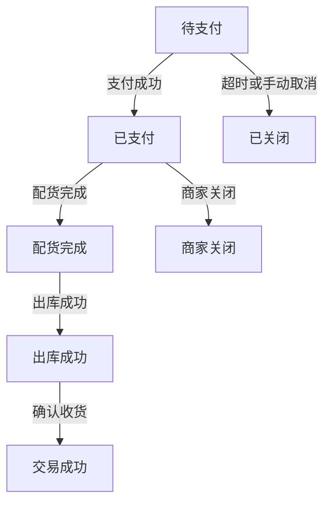
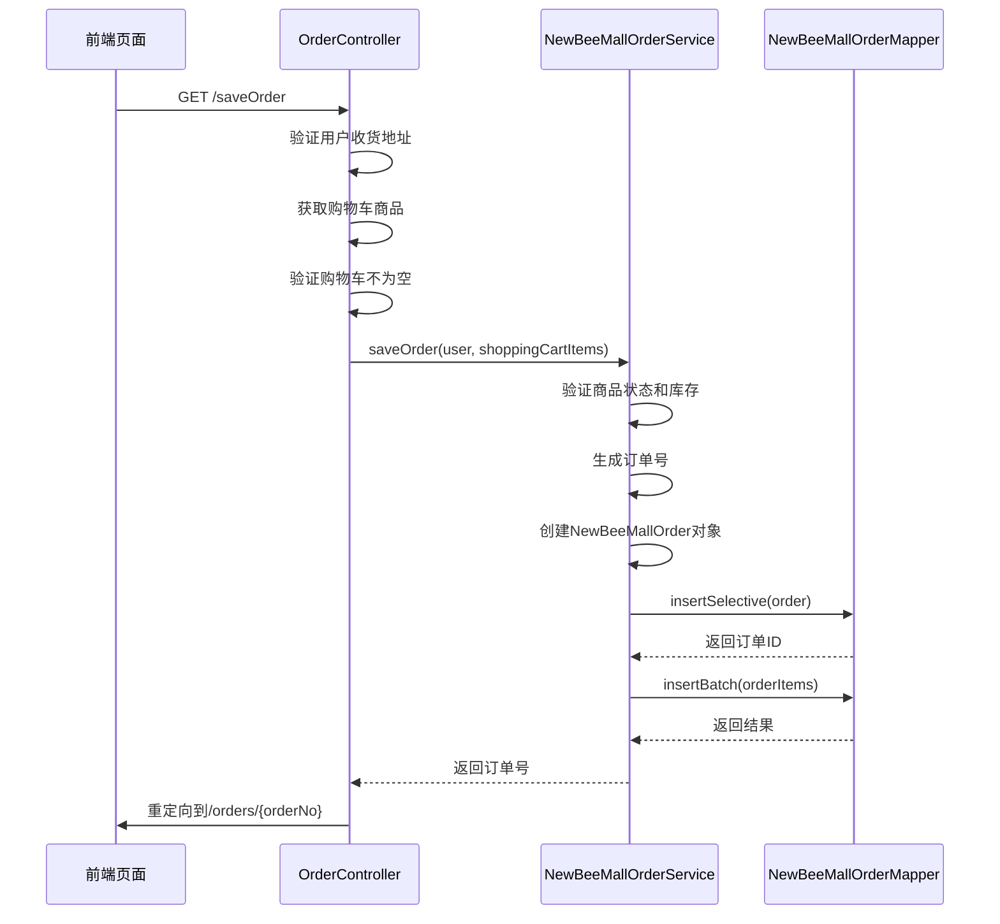
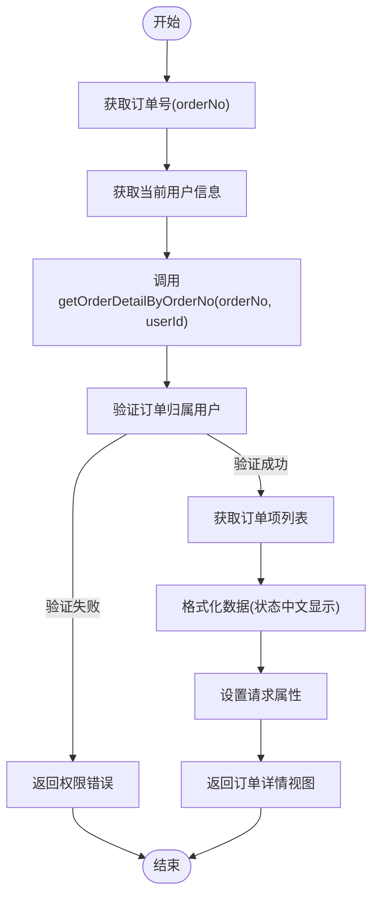
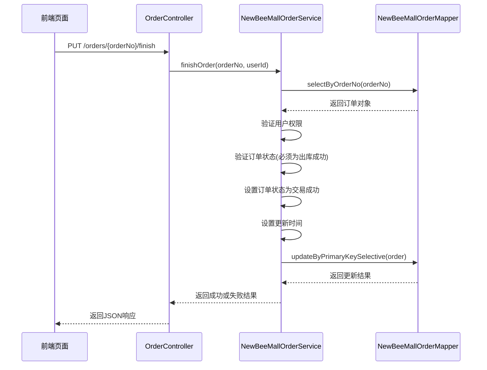
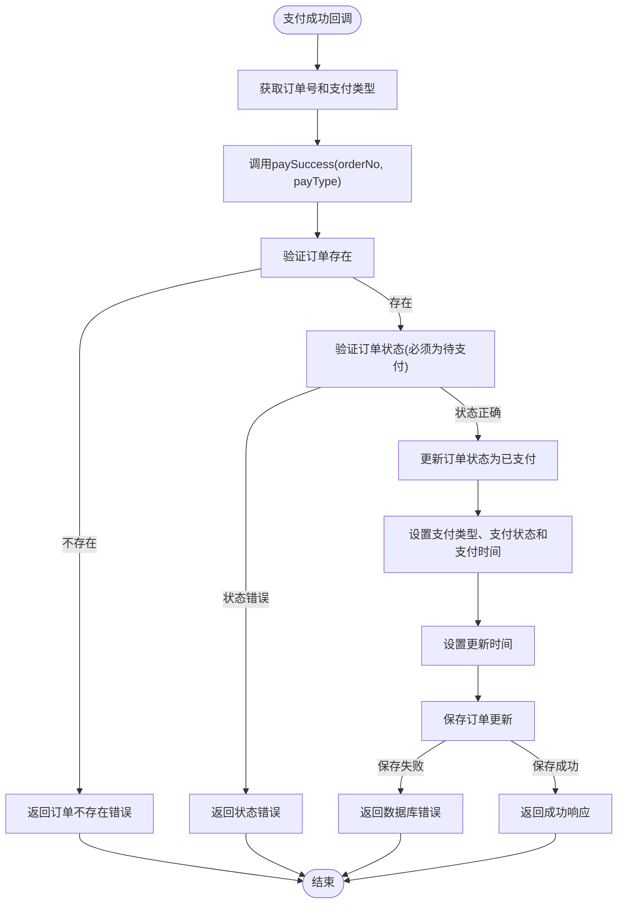

# 订单相关

<cite>
**本文档引用文件**   
- [OrderController.java](file://src/main/java/ltd/newbee/mall/controller/mall/OrderController.java)
- [NewBeeMallOrderService.java](file://src/main/java/ltd/newbee/mall/service/NewBeeMallOrderService.java)
- [NewBeeMallOrderServiceImpl.java](file://src/main/java/ltd/newbee/mall/service/impl/NewBeeMallOrderServiceImpl.java)
- [NewBeeMallOrderStatusEnum.java](file://src/main/java/ltd/newbee/mall/common/NewBeeMallOrderStatusEnum.java)
- [NewBeeMallOrder.java](file://src/main/java/ltd/newbee/mall/entity/NewBeeMallOrder.java)
- [ShoppingCartController.java](file://src/main/java/ltd/newbee/mall/controller/mall/ShoppingCartController.java)
- [NewBeeMallShoppingCartService.java](file://src/main/java/ltd/newbee/mall/service/NewBeeMallShoppingCartService.java)
- [NewBeeMallShoppingCartServiceImpl.java](file://src/main/java/ltd/newbee/mall/service/impl/NewBeeMallShoppingCartServiceImpl.java)
- [NewBeeMallOrderMapper.xml](file://src/main/resources/mapper/NewBeeMallOrderMapper.xml)
- [order-settle.html](file://src/main/resources/templates/mall/order-settle.html)
- [my-orders.html](file://src/main/resources/templates/mall/my-orders.html)
- [order-detail.html](file://src/main/resources/templates/mall/order-detail.html)
- [PayStatusEnum.java](file://src/main/java/ltd/newbee/mall/common/PayStatusEnum.java)
- [PayTypeEnum.java](file://src/main/java/ltd/newbee/mall/common/PayTypeEnum.java)
- [NewBeeMallOrderDetailVO.java](file://src/main/java/ltd/newbee/mall/controller/vo/NewBeeMallOrderDetailVO.java)
- [NewBeeMallOrderListVO.java](file://src/main/java/ltd/newbee/mall/controller/vo/NewBeeMallOrderListVO.java)
</cite>

## 目录
1. [订单生命周期概述](#订单生命周期概述)
2. [结算与创建流程](#结算与创建流程)
3. [订单查询机制](#订单查询机制)
4. [订单状态变更操作](#订单状态变更操作)
5. [支付流程处理](#支付流程处理)
6. [订单状态管理](#订单状态管理)
7. [核心组件分析](#核心组件分析)

## 订单生命周期概述

newbee-mall系统的订单生命周期涵盖了从结算、创建、支付、发货到确认收货的完整流程。订单状态通过`NewBeeMallOrderStatusEnum`枚举进行管理，包含待支付、已支付、配货完成、出库成功和交易成功等状态。用户可以通过前端页面完成订单的全生命周期操作，包括创建订单、查询订单、取消订单和确认收货等。

**订单状态流转图**

**图示来源**
- [NewBeeMallOrderStatusEnum.java](file://src/main/java/ltd/newbee/mall/common/NewBeeMallOrderStatusEnum.java#L18-L28)

## 结算与创建流程

订单的结算与创建流程始于购物车结算页面，通过`GET /shop-cart/settle`接口获取购物车数据并展示结算信息，然后通过`POST /saveOrder`接口创建订单。

### 结算页面获取

`GET /shop-cart/settle`接口负责获取用户购物车中的商品数据并计算总价，为订单创建做准备：

1. 从会话中获取当前用户信息
2. 调用`NewBeeMallShoppingCartService.getMyShoppingCartItems()`获取用户的购物车商品列表
3. 计算购物车商品总价
4. 将购物车商品列表和总价设置到请求属性中
5. 返回订单结算页面视图

当购物车为空时，直接重定向回购物车页面，不进入结算流程。

**图示来源**
- [ShoppingCartController.java](file://src/main/java/ltd/newbee/mall/controller/mall/ShoppingCartController.java#L107-L128)
- [order-settle.html](file://src/main/resources/templates/mall/order-settle.html)

### 订单创建流程

`POST /saveOrder`接口负责创建订单，其处理流程如下：

1. 验证用户收货地址是否存在
2. 获取用户购物车中的商品项
3. 验证购物车不为空
4. 调用`NewBeeMallOrderService.saveOrder()`保存订单
5. 重定向到新创建的订单详情页面

订单创建过程中会进行多项验证，包括收货地址检查、购物车数据验证、商品库存检查和商品状态检查（是否已下架）。

**图示来源**
- [OrderController.java](file://src/main/java/ltd/newbee/mall/controller/mall/OrderController.java#L67-L83)
- [NewBeeMallOrderServiceImpl.java](file://src/main/java/ltd/newbee/mall/service/impl/NewBeeMallOrderServiceImpl.java#L186-L263)

## 订单查询机制

系统提供了两种订单查询接口：`GET /orders`用于分页查询用户的所有订单，`GET /orders/{orderNo}`用于获取特定订单的详细信息。

### 订单列表查询

`GET /orders`接口实现用户订单的分页查询功能：

1. 从会话中获取当前用户信息
2. 设置查询参数，包括用户ID、分页大小（从Constants获取）和当前页码
3. 创建`PageQueryUtil`对象封装查询参数
4. 调用`NewBeeMallOrderService.getMyOrders()`获取订单分页结果
5. 将结果设置到请求属性中
6. 返回订单列表页面视图

该接口支持分页查询，每页显示的订单数量由`Constants.ORDER_SEARCH_PAGE_LIMIT`常量定义。

**图示来源**
- [OrderController.java](file://src/main/java/ltd/newbee/mall/controller/mall/OrderController.java#L52-L65)
- [my-orders.html](file://src/main/resources/templates/mall/my-orders.html)

### 订单详情查询

`GET /orders/{orderNo}`接口用于获取特定订单的详细信息：

1. 从路径变量中获取订单号
2. 从会话中获取当前用户信息
3. 调用`NewBeeMallOrderService.getOrderDetailByOrderNo()`获取订单详情
4. 验证订单属于当前用户（权限验证）
5. 将订单详情设置到请求属性中
6. 返回订单详情页面视图

订单详情包含订单基本信息、订单项列表、支付信息和收货地址等。

**图示来源**
- [OrderController.java](file://src/main/java/ltd/newbee/mall/controller/mall/OrderController.java#L44-L50)
- [NewBeeMallOrderServiceImpl.java](file://src/main/java/ltd/newbee/mall/service/impl/NewBeeMallOrderServiceImpl.java#L264-L287)

## 订单状态变更操作

系统提供了订单状态变更的API接口，包括取消订单和确认收货操作。

### 取消订单

`PUT /orders/{orderNo}/cancel`接口用于取消订单：

1. 从路径变量中获取订单号
2. 从会话中获取当前用户信息
3. 调用`NewBeeMallOrderService.cancelOrder()`执行取消操作
4. 根据返回结果生成成功或失败的响应

在服务层实现中，取消订单需要进行多项验证：
- 验证订单存在且属于当前用户
- 验证订单状态是否允许取消（不能是已成功、已关闭等状态）
- 执行取消操作并恢复商品库存
- 更新订单状态为"手动关闭"

**图示来源**
- [OrderController.java](file://src/main/java/ltd/newbee/mall/controller/mall/OrderController.java#L85-L95)
- [NewBeeMallOrderServiceImpl.java](file://src/main/java/ltd/newbee/mall/service/impl/NewBeeMallOrderServiceImpl.java#L326-L349)

### 确认收货

`PUT /orders/{orderNo}/finish`接口用于确认收货：

1. 从路径变量中获取订单号
2. 从会话中获取当前用户信息
3. 调用`NewBeeMallOrderService.finishOrder()`执行确认收货操作
4. 根据返回结果生成成功或失败的响应

在服务层实现中，确认收货需要验证：
- 订单存在且属于当前用户
- 订单状态为"出库成功"（ORDER_EXPRESS）
- 更新订单状态为"交易成功"（ORDER_SUCCESS）
- 更新订单的更新时间

**图示来源**
- [OrderController.java](file://src/main/java/ltd/newbee/mall/controller/mall/OrderController.java#L97-L107)
- [NewBeeMallOrderServiceImpl.java](file://src/main/java/ltd/newbee/mall/service/impl/NewBeeMallOrderServiceImpl.java#L351-L372)

## 支付流程处理

系统的支付流程包括支付方式选择、支付页面跳转和支付成功回调三个主要环节。

### 支付方式选择

`GET /selectPayType`接口用于引导用户选择支付方式：

1. 从请求参数中获取订单号
2. 从会话中获取当前用户信息
3. 调用`NewBeeMallOrderService.getNewBeeMallOrderByOrderNo()`获取订单信息
4. 验证订单属于当前用户
5. 验证订单状态为"待支付"（ORDER_PRE_PAY）
6. 将订单号和总价设置到请求属性中
7. 返回支付方式选择页面视图

**图示来源**
- [OrderController.java](file://src/main/java/ltd/newbee/mall/controller/mall/OrderController.java#L109-L124)

### 支付页面跳转

`GET /payPage`接口根据用户选择的支付方式跳转到相应的支付页面：

1. 从请求参数中获取订单号和支付类型
2. 从会话中获取当前用户信息
3. 获取订单信息并验证用户权限和订单状态
4. 根据支付类型返回不同的支付页面视图：
   - 支付宝支付（payType=1）：返回alipay.html
   - 微信支付（payType=2）：返回wxpay.html

**图示来源**
- [OrderController.java](file://src/main/java/ltd/newbee/mall/controller/mall/OrderController.java#L126-L145)

### 支付成功回调

`GET /paySuccess`接口处理支付成功后的回调：

1. 从请求参数中获取订单号和支付类型
2. 调用`NewBeeMallOrderService.paySuccess()`处理支付成功逻辑
3. 根据处理结果返回成功或失败的JSON响应

在服务层实现中，支付成功处理包括：
- 验证订单存在
- 验证订单状态为"待支付"
- 更新订单状态为"已支付"
- 设置支付类型、支付状态和支付时间
- 更新订单的更新时间

**图示来源**
- [OrderController.java](file://src/main/java/ltd/newbee/mall/controller/mall/OrderController.java#L147-L156)
- [NewBeeMallOrderServiceImpl.java](file://src/main/java/ltd/newbee/mall/service/impl/NewBeeMallOrderServiceImpl.java#L374-L394)

## 订单状态管理

订单状态通过`NewBeeMallOrderStatusEnum`枚举类进行管理，该枚举定义了订单的所有可能状态及其对应的数值和中文描述。

### 状态枚举定义

`NewBeeMallOrderStatusEnum`枚举包含以下状态：

| 状态值 | 状态名称 | 说明 |
|--------|----------|------|
| 0 | 待支付 | 订单已创建但尚未支付 |
| 1 | 已支付 | 订单已支付成功 |
| 2 | 配货完成 | 订单已完成配货 |
| 3 | 出库成功 | 订单已出库发货 |
| 4 | 交易成功 | 订单已完成交易 |
| -1 | 手动关闭 | 用户手动取消订单 |
| -2 | 超时关闭 | 订单超时未支付自动关闭 |
| -3 | 商家关闭 | 商家关闭订单 |

该枚举还提供了`getNewBeeMallOrderStatusEnumByStatus()`静态方法，可以根据状态值获取对应的枚举实例。

### 状态转换规则

订单状态的转换遵循严格的业务规则，确保状态流转的正确性：

1. **待支付 → 已支付**：用户完成支付后
2. **已支付 → 配货完成**：商家完成配货后
3. **配货完成 → 出库成功**：商家出库发货后
4. **出库成功 → 交易成功**：用户确认收货后
5. **待支付 → 手动关闭**：用户取消订单
6. **待支付 → 超时关闭**：订单超时未支付
7. **任何状态 → 商家关闭**：商家关闭订单

状态转换过程中会进行严格的验证，防止非法状态变更。

**图示来源**
- [NewBeeMallOrderStatusEnum.java](file://src/main/java/ltd/newbee/mall/common/NewBeeMallOrderStatusEnum.java)
- [NewBeeMallOrder.java](file://src/main/java/ltd/newbee/mall/entity/NewBeeMallOrder.java#L30)

## 核心组件分析

### 订单实体类

`NewBeeMallOrder`实体类定义了订单的核心属性，包括订单ID、订单号、用户ID、总价、支付状态、支付类型、支付时间、订单状态、额外信息、收货地址、删除标记、创建时间和更新时间。

该实体类通过MyBatis映射到数据库表`tb_newbee_mall_order`，使用`@JsonFormat`注解格式化日期时间的显示。

**图示来源**
- [NewBeeMallOrder.java](file://src/main/java/ltd/newbee/mall/entity/NewBeeMallOrder.java)
- [NewBeeMallOrderMapper.xml](file://src/main/resources/mapper/NewBeeMallOrderMapper.xml)

### 订单服务接口

`NewBeeMallOrderService`接口定义了订单服务的所有业务方法，包括：

- `saveOrder()`：保存订单
- `getOrderDetailByOrderNo()`：根据订单号获取订单详情
- `getNewBeeMallOrderByOrderNo()`：根据订单号获取订单对象
- `getMyOrders()`：获取用户订单分页列表
- `cancelOrder()`：取消订单
- `finishOrder()`：确认收货
- `paySuccess()`：处理支付成功
- `getOrderItems()`：获取订单项列表

**图示来源**
- [NewBeeMallOrderService.java](file://src/main/java/ltd/newbee/mall/service/NewBeeMallOrderService.java)

### 订单服务实现

`NewBeeMallOrderServiceImpl`类实现了订单服务接口，是订单业务逻辑的核心实现。该类使用了`@Transactional`注解确保数据操作的原子性。

关键实现特点：
- 使用`@Autowired`注入DAO层组件
- 在`saveOrder()`方法中，先删除购物车商品，再更新商品库存，最后创建订单和订单项
- 在状态变更操作中，先验证订单状态和用户权限，再执行状态更新
- 提供`recoverStockNum()`方法用于恢复商品库存

**图示来源**
- [NewBeeMallOrderServiceImpl.java](file://src/main/java/ltd/newbee/mall/service/impl/NewBeeMallOrderServiceImpl.java)

### 订单控制器

`OrderController`类是订单相关的MVC控制器，处理所有订单相关的HTTP请求。该控制器使用了`@Controller`注解，并通过`@Resource`注入了购物车服务和订单服务。

控制器方法特点：
- 使用`@GetMapping`、`@PostMapping`、`@PutMapping`等注解映射HTTP方法
- 使用`@PathVariable`获取路径变量
- 使用`@RequestParam`获取请求参数
- 使用`@ResponseBody`返回JSON响应
- 通过`HttpSession`获取用户会话信息

**图示来源**
- [OrderController.java](file://src/main/java/ltd/newbee/mall/controller/mall/OrderController.java)

### 视图模型

系统使用了两个视图模型类来封装订单数据：

- `NewBeeMallOrderDetailVO`：订单详情视图模型，包含订单基本信息、订单项列表、支付状态中文显示等
- `NewBeeMallOrderListVO`：订单列表视图模型，包含订单基本信息和订单项列表，用于订单列表页面

这些视图模型通过`BeanUtil.copyProperties()`方法从实体类复制属性，实现了数据的转换和封装。

**图示来源**
- [NewBeeMallOrderDetailVO.java](file://src/main/java/ltd/newbee/mall/controller/vo/NewBeeMallOrderDetailVO.java)
- [NewBeeMallOrderListVO.java](file://src/main/java/ltd/newbee/mall/controller/vo/NewBeeMallOrderListVO.java)