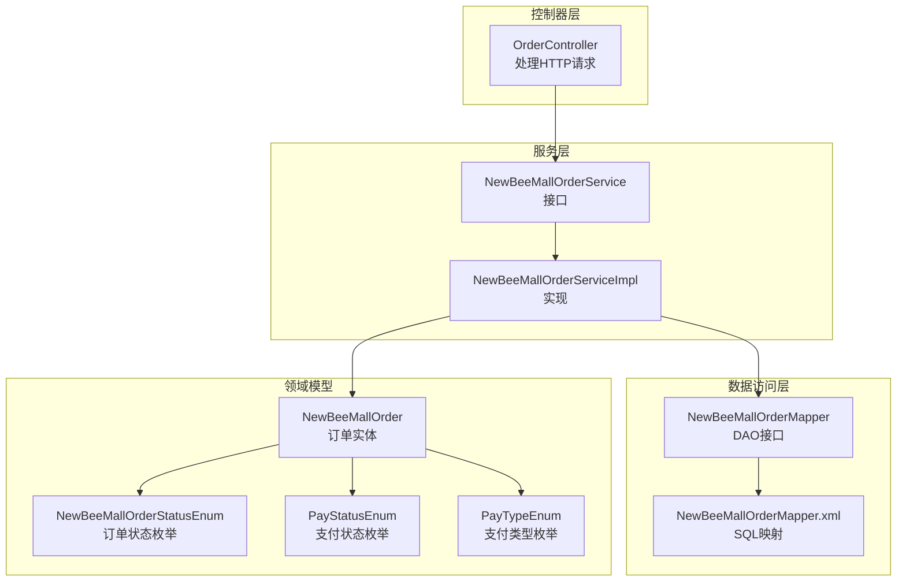
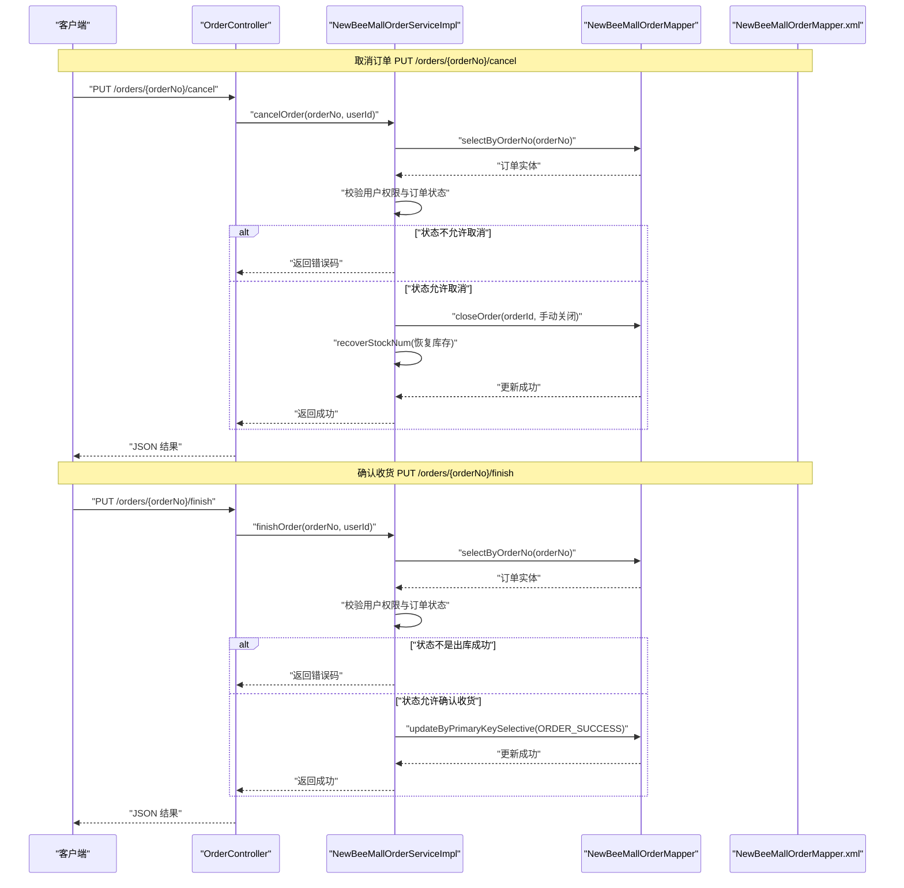
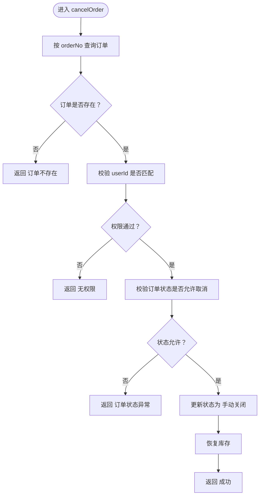
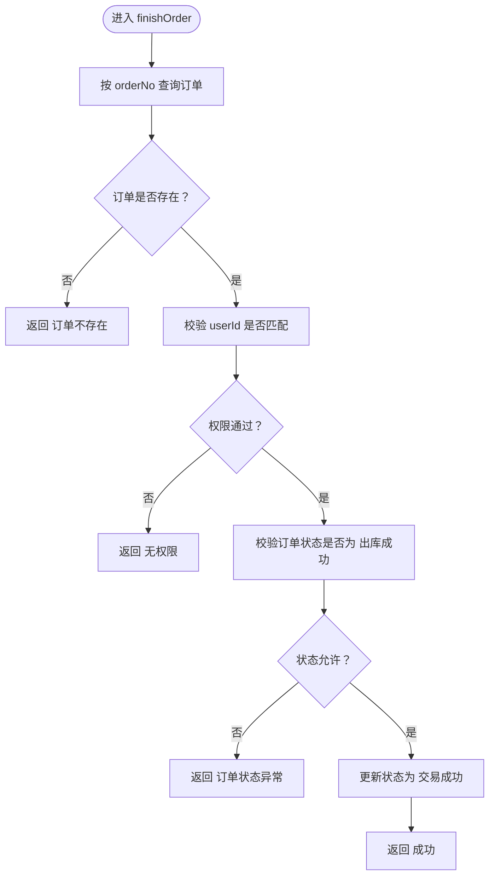
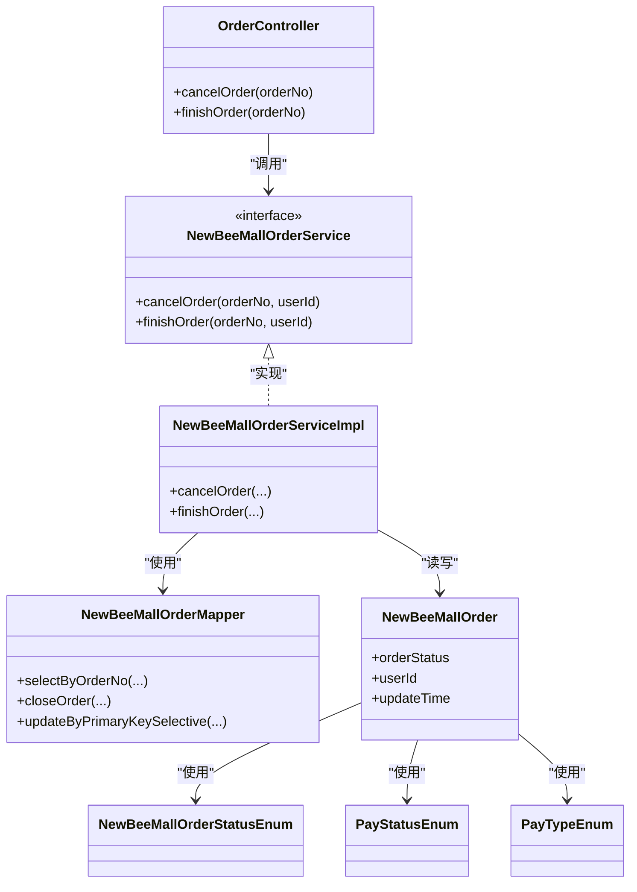
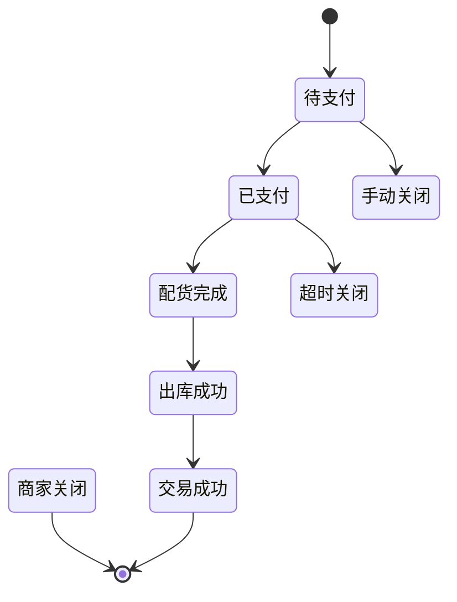

# 订单管理

<cite>
**本文引用的文件**
- [OrderController.java](file://src/main/java/ltd/newbee/mall/controller/mall/OrderController.java)
- [NewBeeMallOrderService.java](file://src/main/java/ltd/newbee/mall/service/NewBeeMallOrderService.java)
- [NewBeeMallOrderServiceImpl.java](file://src/main/java/ltd/newbee/mall/service/impl/NewBeeMallOrderServiceImpl.java)
- [NewBeeMallOrderStatusEnum.java](file://src/main/java/ltd/newbee/mall/common/NewBeeMallOrderStatusEnum.java)
- [PayStatusEnum.java](file://src/main/java/ltd/newbee/mall/common/PayStatusEnum.java)
- [PayTypeEnum.java](file://src/main/java/ltd/newbee/mall/common/PayTypeEnum.java)
- [NewBeeMallOrder.java](file://src/main/java/ltd/newbee/mall/entity/NewBeeMallOrder.java)
- [NewBeeMallOrderMapper.java](file://src/main/java/ltd/newbee/mall/dao/NewBeeMallOrderMapper.java)
- [NewBeeMallOrderMapper.xml](file://src/main/resources/mapper/NewBeeMallOrderMapper.xml)
- [ServiceResultEnum.java](file://src/main/java/ltd/newbee/mall/common/ServiceResultEnum.java)
- [NewBeeMallException.java](file://src/main/java/ltd/newbee/mall/common/NewBeeMallException.java)
</cite>

## 目录
1. [简介](#简介)
2. [项目结构](#项目结构)
3. [核心组件](#核心组件)
4. [架构总览](#架构总览)
5. [详细组件分析](#详细组件分析)
6. [依赖关系分析](#依赖关系分析)
7. [性能与并发特性](#性能与并发特性)
8. [故障排查指南](#故障排查指南)
9. [结论](#结论)
10. [附录：订单状态机与业务规则](#附录订单状态机与业务规则)

## 简介
本文聚焦于 newbee-mall 的订单管理操作，围绕以下两个接口展开：
- PUT /orders/{orderNo}/cancel：取消订单（仅待支付状态可取消），校验用户权限，状态更新为“手动关闭”，并恢复库存。
- PUT /orders/{orderNo}/finish：确认收货（仅在“出库成功”状态下允许），状态更新为“交易成功”，记录更新时间。

同时，本文将系统梳理订单状态机、幂等性设计与异常处理策略，帮助读者全面理解订单生命周期内的关键控制点与约束条件。

## 项目结构
订单管理相关代码采用典型的分层架构：
- 控制器层：接收请求、解析会话、调用服务层。
- 服务层：编排业务逻辑、事务控制、状态校验与持久化。
- 数据访问层：通过 MyBatis 映射订单表的增删改查与状态变更。
- 实体与枚举：定义订单实体、支付状态、支付类型、订单状态枚举。

图表来源
- [OrderController.java](file://src/main/java/ltd/newbee/mall/controller/mall/OrderController.java#L85-L107)
- [NewBeeMallOrderService.java](file://src/main/java/ltd/newbee/mall/service/NewBeeMallOrderService.java#L96-L117)
- [NewBeeMallOrderServiceImpl.java](file://src/main/java/ltd/newbee/mall/service/impl/NewBeeMallOrderServiceImpl.java#L325-L372)
- [NewBeeMallOrderMapper.java](file://src/main/java/ltd/newbee/mall/dao/NewBeeMallOrderMapper.java#L17-L43)
- [NewBeeMallOrderMapper.xml](file://src/main/resources/mapper/NewBeeMallOrderMapper.xml#L205-L228)
- [NewBeeMallOrder.java](file://src/main/java/ltd/newbee/mall/entity/NewBeeMallOrder.java#L1-L169)
- [NewBeeMallOrderStatusEnum.java](file://src/main/java/ltd/newbee/mall/common/NewBeeMallOrderStatusEnum.java#L18-L63)
- [PayStatusEnum.java](file://src/main/java/ltd/newbee/mall/common/PayStatusEnum.java#L18-L58)
- [PayTypeEnum.java](file://src/main/java/ltd/newbee/mall/common/PayTypeEnum.java#L18-L59)

章节来源
- [OrderController.java](file://src/main/java/ltd/newbee/mall/controller/mall/OrderController.java#L85-L107)
- [NewBeeMallOrderService.java](file://src/main/java/ltd/newbee/mall/service/NewBeeMallOrderService.java#L96-L117)
- [NewBeeMallOrderServiceImpl.java](file://src/main/java/ltd/newbee/mall/service/impl/NewBeeMallOrderServiceImpl.java#L325-L372)
- [NewBeeMallOrderMapper.java](file://src/main/java/ltd/newbee/mall/dao/NewBeeMallOrderMapper.java#L17-L43)
- [NewBeeMallOrderMapper.xml](file://src/main/resources/mapper/NewBeeMallOrderMapper.xml#L205-L228)

## 核心组件
- 订单控制器：负责接收取消与确认收货请求，从会话中提取用户标识，调用服务层执行业务逻辑，并返回统一结果。
- 订单服务实现：实现取消与确认收货的具体业务规则，包括权限校验、状态校验、状态更新、库存恢复（取消时）等。
- 订单映射：提供订单状态变更的 SQL 更新语句，确保状态转换原子性与一致性。
- 枚举与实体：定义订单状态、支付状态与支付类型，支撑业务判断与展示。

章节来源
- [OrderController.java](file://src/main/java/ltd/newbee/mall/controller/mall/OrderController.java#L85-L107)
- [NewBeeMallOrderServiceImpl.java](file://src/main/java/ltd/newbee/mall/service/impl/NewBeeMallOrderServiceImpl.java#L325-L372)
- [NewBeeMallOrderMapper.xml](file://src/main/resources/mapper/NewBeeMallOrderMapper.xml#L205-L228)
- [NewBeeMallOrderStatusEnum.java](file://src/main/java/ltd/newbee/mall/common/NewBeeMallOrderStatusEnum.java#L18-L63)
- [NewBeeMallOrder.java](file://src/main/java/ltd/newbee/mall/entity/NewBeeMallOrder.java#L1-L169)

## 架构总览
下面的序列图展示了两个关键接口的端到端调用链路与状态变更。

图表来源
- [OrderController.java](file://src/main/java/ltd/newbee/mall/controller/mall/OrderController.java#L85-L107)
- [NewBeeMallOrderServiceImpl.java](file://src/main/java/ltd/newbee/mall/service/impl/NewBeeMallOrderServiceImpl.java#L325-L372)
- [NewBeeMallOrderMapper.java](file://src/main/java/ltd/newbee/mall/dao/NewBeeMallOrderMapper.java#L17-L43)
- [NewBeeMallOrderMapper.xml](file://src/main/resources/mapper/NewBeeMallOrderMapper.xml#L205-L228)

## 详细组件分析

### 取消订单：PUT /orders/{orderNo}/cancel
- 入口与参数
  - 控制器方法接收路径变量 orderNo 与会话中的用户标识 userId。
- 权限校验
  - 服务层先按订单号查询订单，再比对 userId 与订单所属用户，不一致则返回“无权限”。
- 状态校验
  - 仅当订单状态为“待支付”时允许取消；若订单已是“交易成功”、“手动关闭”、“超时关闭”、“商家关闭”等，则返回“订单状态异常”。
- 状态更新与库存恢复
  - 将订单状态更新为“手动关闭”，并调用库存恢复逻辑，确保取消后商品库存回退。
- 返回结果
  - 成功返回统一成功结果，失败返回对应错误码。

图表来源
- [OrderController.java](file://src/main/java/ltd/newbee/mall/controller/mall/OrderController.java#L85-L95)
- [NewBeeMallOrderServiceImpl.java](file://src/main/java/ltd/newbee/mall/service/impl/NewBeeMallOrderServiceImpl.java#L325-L349)
- [NewBeeMallOrderMapper.xml](file://src/main/resources/mapper/NewBeeMallOrderMapper.xml#L221-L228)

章节来源
- [OrderController.java](file://src/main/java/ltd/newbee/mall/controller/mall/OrderController.java#L85-L95)
- [NewBeeMallOrderServiceImpl.java](file://src/main/java/ltd/newbee/mall/service/impl/NewBeeMallOrderServiceImpl.java#L325-L349)
- [NewBeeMallOrderMapper.xml](file://src/main/resources/mapper/NewBeeMallOrderMapper.xml#L221-L228)

### 确认收货：PUT /orders/{orderNo}/finish
- 入口与参数
  - 控制器方法接收路径变量 orderNo 与会话中的用户标识 userId。
- 权限校验
  - 服务层先按订单号查询订单，再比对 userId 与订单所属用户，不一致则返回“无权限”。
- 状态校验
  - 仅当订单状态为“出库成功”时允许确认收货；其他状态返回“订单状态异常”。
- 状态更新
  - 将订单状态更新为“交易成功”，并记录更新时间。
- 返回结果
  - 成功返回统一成功结果，失败返回对应错误码。

图表来源
- [OrderController.java](file://src/main/java/ltd/newbee/mall/controller/mall/OrderController.java#L97-L107)
- [NewBeeMallOrderServiceImpl.java](file://src/main/java/ltd/newbee/mall/service/impl/NewBeeMallOrderServiceImpl.java#L351-L372)
- [NewBeeMallOrderMapper.xml](file://src/main/resources/mapper/NewBeeMallOrderMapper.xml#L213-L220)

章节来源
- [OrderController.java](file://src/main/java/ltd/newbee/mall/controller/mall/OrderController.java#L97-L107)
- [NewBeeMallOrderServiceImpl.java](file://src/main/java/ltd/newbee/mall/service/impl/NewBeeMallOrderServiceImpl.java#L351-L372)
- [NewBeeMallOrderMapper.xml](file://src/main/resources/mapper/NewBeeMallOrderMapper.xml#L213-L220)

### 幂等性设计与异常处理
- 幂等性
  - 取消接口：若订单状态已是“手动关闭”或“交易成功”等不可取消状态，再次调用将直接返回“订单状态异常”，避免重复操作导致的副作用。
  - 确认收货接口：若订单状态不是“出库成功”，再次调用将返回“订单状态异常”，防止重复确认。
  - 库存恢复：取消时会恢复库存，若重复取消不会重复恢复（由服务层的条件判断与数据库唯一约束共同保证）。
- 异常处理
  - 统一异常：业务异常通过自定义异常抛出，便于集中处理。
  - 统一返回：服务层返回统一的结果枚举，控制器包装为统一响应对象。
  - 错误码：涵盖“订单不存在”“无权限”“订单状态异常”“数据库错误”等场景。

章节来源
- [NewBeeMallOrderServiceImpl.java](file://src/main/java/ltd/newbee/mall/service/impl/NewBeeMallOrderServiceImpl.java#L325-L372)
- [ServiceResultEnum.java](file://src/main/java/ltd/newbee/mall/common/ServiceResultEnum.java#L18-L91)
- [NewBeeMallException.java](file://src/main/java/ltd/newbee/mall/common/NewBeeMallException.java#L11-L29)

## 依赖关系分析
- 控制器依赖服务接口，服务实现依赖 DAO 与枚举。
- 状态变更通过 XML 中的 update 语句执行，确保原子性。
- 实体与枚举贯穿于业务判断与展示。

图表来源
- [OrderController.java](file://src/main/java/ltd/newbee/mall/controller/mall/OrderController.java#L85-L107)
- [NewBeeMallOrderService.java](file://src/main/java/ltd/newbee/mall/service/NewBeeMallOrderService.java#L96-L117)
- [NewBeeMallOrderServiceImpl.java](file://src/main/java/ltd/newbee/mall/service/impl/NewBeeMallOrderServiceImpl.java#L325-L372)
- [NewBeeMallOrderMapper.java](file://src/main/java/ltd/newbee/mall/dao/NewBeeMallOrderMapper.java#L17-L43)
- [NewBeeMallOrder.java](file://src/main/java/ltd/newbee/mall/entity/NewBeeMallOrder.java#L1-L169)
- [NewBeeMallOrderStatusEnum.java](file://src/main/java/ltd/newbee/mall/common/NewBeeMallOrderStatusEnum.java#L18-L63)
- [PayStatusEnum.java](file://src/main/java/ltd/newbee/mall/common/PayStatusEnum.java#L18-L58)
- [PayTypeEnum.java](file://src/main/java/ltd/newbee/mall/common/PayTypeEnum.java#L18-L59)

## 性能与并发特性
- 事务边界：取消与确认收货均在服务层开启事务，确保状态更新与库存恢复的一致性。
- 原子更新：状态变更通过 SQL 原子更新，减少锁竞争与并发冲突。
- 并发建议：若前端需要支持高并发重试，应结合幂等键（如客户端生成的请求 ID）与数据库唯一索引，避免重复提交造成状态反复。

[本节为通用性能讨论，无需列出具体文件来源]

## 故障排查指南
- 常见错误与定位
  - “订单不存在”：确认 orderNo 是否正确，或订单是否被删除。
  - “无权限”：确认会话中的用户是否与订单所属用户一致。
  - “订单状态异常”：确认当前状态是否满足接口前置条件（取消仅待支付；确认收货仅出库成功）。
  - “数据库错误”：检查数据库连接与事务是否正常提交。
- 定位路径
  - 控制器层：请求入口与参数解析。
  - 服务层：权限校验、状态校验、状态更新与库存恢复。
  - 数据访问层：SQL 更新是否执行成功。

章节来源
- [OrderController.java](file://src/main/java/ltd/newbee/mall/controller/mall/OrderController.java#L85-L107)
- [NewBeeMallOrderServiceImpl.java](file://src/main/java/ltd/newbee/mall/service/impl/NewBeeMallOrderServiceImpl.java#L325-L372)
- [ServiceResultEnum.java](file://src/main/java/ltd/newbee/mall/common/ServiceResultEnum.java#L18-L91)

## 结论
- 取消与确认收货两个接口严格遵循订单状态机约束，具备良好的幂等性与异常处理能力。
- 通过服务层的权限校验与状态校验，确保业务正确性；通过 XML 原子更新与事务控制，保障数据一致性。
- 建议在生产环境中配合幂等键与重试策略，进一步提升系统的鲁棒性与用户体验。

[本节为总结性内容，无需列出具体文件来源]

## 附录：订单状态机与业务规则

### 订单状态机（简化）

图表来源
- [NewBeeMallOrderStatusEnum.java](file://src/main/java/ltd/newbee/mall/common/NewBeeMallOrderStatusEnum.java#L18-L63)

### 业务规则与约束
- 取消（仅待支付）
  - 权限：仅订单所属用户可操作。
  - 状态：仅“待支付”可取消；其他状态返回“订单状态异常”。
  - 结果：状态更新为“手动关闭”，并恢复库存。
- 确认收货（仅出库成功）
  - 权限：仅订单所属用户可操作。
  - 状态：仅“出库成功”可确认；其他状态返回“订单状态异常”。
  - 结果：状态更新为“交易成功”，记录更新时间。
- 支付相关
  - 支付状态与支付类型分别由支付状态枚举与支付类型枚举定义，不影响取消与确认收货的前置条件。

章节来源
- [NewBeeMallOrderServiceImpl.java](file://src/main/java/ltd/newbee/mall/service/impl/NewBeeMallOrderServiceImpl.java#L325-L372)
- [NewBeeMallOrderStatusEnum.java](file://src/main/java/ltd/newbee/mall/common/NewBeeMallOrderStatusEnum.java#L18-L63)
- [PayStatusEnum.java](file://src/main/java/ltd/newbee/mall/common/PayStatusEnum.java#L18-L58)
- [PayTypeEnum.java](file://src/main/java/ltd/newbee/mall/common/PayTypeEnum.java#L18-L59)