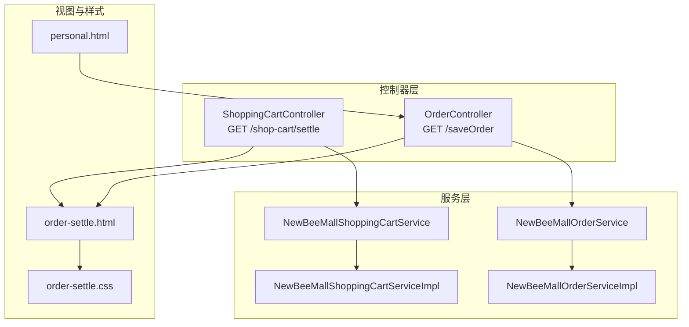
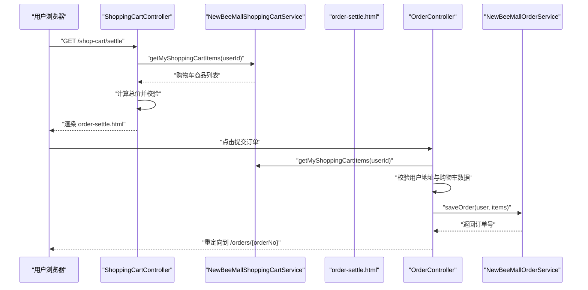
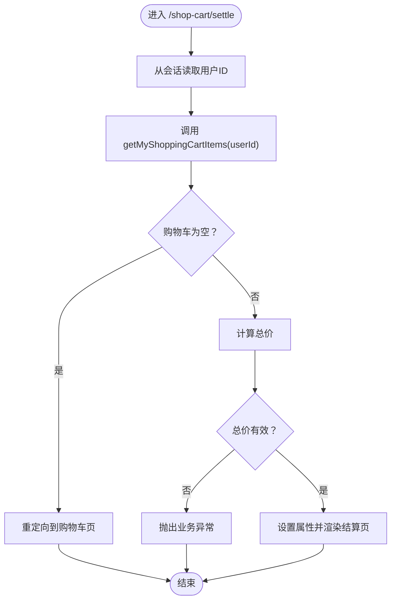
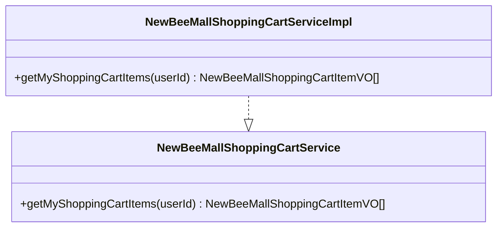
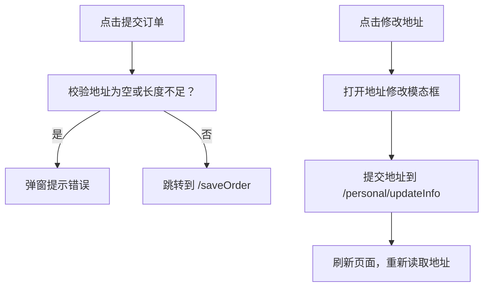
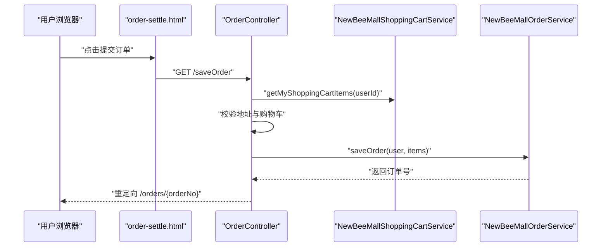
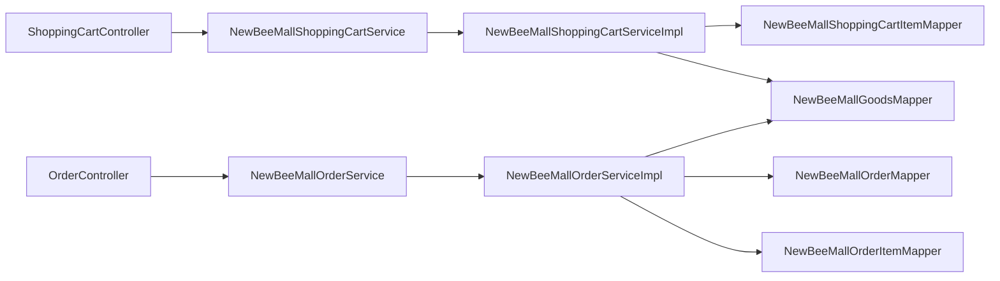

# 订单结算

<cite>
**本文引用的文件**
- [ShoppingCartController.java](file://src/main/java/ltd/newbee/mall/controller/mall/ShoppingCartController.java)
- [OrderController.java](file://src/main/java/ltd/newbee/mall/controller/mall/OrderController.java)
- [NewBeeMallShoppingCartService.java](file://src/main/java/ltd/newbee/mall/service/NewBeeMallShoppingCartService.java)
- [NewBeeMallShoppingCartServiceImpl.java](file://src/main/java/ltd/newbee/mall/service/impl/NewBeeMallShoppingCartServiceImpl.java)
- [NewBeeMallOrderService.java](file://src/main/java/ltd/newbee/mall/service/NewBeeMallOrderService.java)
- [NewBeeMallOrderServiceImpl.java](file://src/main/java/ltd/newbee/mall/service/impl/NewBeeMallOrderServiceImpl.java)
- [order-settle.html](file://src/main/resources/templates/mall/order-settle.html)
- [order-settle.css](file://src/main/resources/static/mall/styles/order-settle.css)
- [personal.html](file://src/main/resources/templates/mall/personal.html)
- [Constants.java](file://src/main/java/ltd/newbee/mall/common/Constants.java)
- [ServiceResultEnum.java](file://src/main/java/ltd/newbee/mall/common/ServiceResultEnum.java)
</cite>

## 目录
1. [简介](#简介)
2. [项目结构](#项目结构)
3. [核心组件](#核心组件)
4. [架构总览](#架构总览)
5. [详细组件分析](#详细组件分析)
6. [依赖关系分析](#依赖关系分析)
7. [性能考量](#性能考量)
8. [故障排查指南](#故障排查指南)
9. [结论](#结论)
10. [附录](#附录)

## 简介
本文件围绕 newbee-mall 的“订单结算”流程展开，重点解析以下内容：
- GET /shop-cart/settle 接口的实现细节：从购物车获取商品数据、计算总价、校验前置条件（如购物车为空、用户地址为空）。
- 结算页面 UI 组件构成：商品列表、收货地址展示与编辑、支付方式说明、应付金额展示。
- NewBeeMallShoppingCartService.getMyShoppingCartItems() 在结算流程中的作用及异常处理策略。
- 结算页面的样式设计与交互逻辑，以及与 /saveOrder 接口的衔接机制。

## 项目结构
与结算功能直接相关的模块与文件如下：
- 控制器层：ShoppingCartController（提供结算页）、OrderController（负责下单）
- 服务层：NewBeeMallShoppingCartService、NewBeeMallOrderService 及其实现类
- 视图模板：order-settle.html（结算页）、personal.html（个人信息与地址修改）
- 样式：order-settle.css（结算页样式）
- 常量与结果枚举：Constants.java、ServiceResultEnum.java

图表来源
- [ShoppingCartController.java](file://src/main/java/ltd/newbee/mall/controller/mall/ShoppingCartController.java#L107-L128)
- [OrderController.java](file://src/main/java/ltd/newbee/mall/controller/mall/OrderController.java#L67-L83)
- [NewBeeMallShoppingCartService.java](file://src/main/java/ltd/newbee/mall/service/NewBeeMallShoppingCartService.java#L52-L59)
- [NewBeeMallShoppingCartServiceImpl.java](file://src/main/java/ltd/newbee/mall/service/impl/NewBeeMallShoppingCartServiceImpl.java#L111-L141)
- [NewBeeMallOrderService.java](file://src/main/java/ltd/newbee/mall/service/NewBeeMallOrderService.java#L62-L70)
- [NewBeeMallOrderServiceImpl.java](file://src/main/java/ltd/newbee/mall/service/impl/NewBeeMallOrderServiceImpl.java#L185-L263)
- [order-settle.html](file://src/main/resources/templates/mall/order-settle.html#L1-L243)
- [order-settle.css](file://src/main/resources/static/mall/styles/order-settle.css#L1-L346)
- [personal.html](file://src/main/resources/templates/mall/personal.html#L1-L157)

章节来源
- [ShoppingCartController.java](file://src/main/java/ltd/newbee/mall/controller/mall/ShoppingCartController.java#L107-L128)
- [OrderController.java](file://src/main/java/ltd/newbee/mall/controller/mall/OrderController.java#L67-L83)
- [order-settle.html](file://src/main/resources/templates/mall/order-settle.html#L1-L243)

## 核心组件
- 结算入口控制器：ShoppingCartController.settlePage() 负责加载结算页，从购物车服务获取商品明细并计算总价，同时进行前置校验。
- 购物车服务：NewBeeMallShoppingCartService.getMyShoppingCartItems() 提供当前用户的购物车商品列表，包含商品封面、名称、单价与数量等。
- 下单控制器：OrderController.saveOrder() 负责最终下单，前置校验用户地址与购物车数据，随后调用订单服务生成订单。
- 订单服务：NewBeeMallOrderServiceImpl.saveOrder() 完成库存校验、删除购物车项、扣减库存、生成订单号、写入订单与订单项等完整事务流程。

章节来源
- [ShoppingCartController.java](file://src/main/java/ltd/newbee/mall/controller/mall/ShoppingCartController.java#L107-L128)
- [NewBeeMallShoppingCartService.java](file://src/main/java/ltd/newbee/mall/service/NewBeeMallShoppingCartService.java#L52-L59)
- [NewBeeMallOrderService.java](file://src/main/java/ltd/newbee/mall/service/NewBeeMallOrderService.java#L62-L70)
- [OrderController.java](file://src/main/java/ltd/newbee/mall/controller/mall/OrderController.java#L67-L83)

## 架构总览
下面的序列图展示了从进入结算页到提交订单的关键交互路径。

图表来源
- [ShoppingCartController.java](file://src/main/java/ltd/newbee/mall/controller/mall/ShoppingCartController.java#L107-L128)
- [NewBeeMallShoppingCartService.java](file://src/main/java/ltd/newbee/mall/service/NewBeeMallShoppingCartService.java#L52-L59)
- [order-settle.html](file://src/main/resources/templates/mall/order-settle.html#L183-L201)
- [OrderController.java](file://src/main/java/ltd/newbee/mall/controller/mall/OrderController.java#L67-L83)
- [NewBeeMallOrderService.java](file://src/main/java/ltd/newbee/mall/service/NewBeeMallOrderService.java#L62-L70)

## 详细组件分析

### 1) GET /shop-cart/settle 接口实现
- 入口：ShoppingCartController.settlePage()
- 主要职责：
  - 从会话中获取当前用户 ID。
  - 调用购物车服务获取购物车商品列表。
  - 若列表为空，直接返回购物车页，避免进入结算页。
  - 计算商品总价（单价×数量之和），并对总价进行异常值校验。
  - 将总价与商品列表放入请求域，渲染结算页模板。
- 异常处理：
  - 购物车为空时直接跳转回购物车页，不进入结算页。
  - 总价异常（小于等于0）抛出业务异常。

图表来源
- [ShoppingCartController.java](file://src/main/java/ltd/newbee/mall/controller/mall/ShoppingCartController.java#L107-L128)

章节来源
- [ShoppingCartController.java](file://src/main/java/ltd/newbee/mall/controller/mall/ShoppingCartController.java#L107-L128)

### 2) 购物车服务：getMyShoppingCartItems() 的作用与实现
- 作用：为结算页提供当前用户购物车的商品明细，包含封面图、名称、单价、数量等。
- 实现要点：
  - 查询用户购物车记录，限制最大数量。
  - 批量查询商品信息，构建商品映射。
  - 将购物车项与商品信息合并，转换为 VO 并截断过长的商品名称，确保 UI 展示稳定。
- 处理逻辑：
  - 当购物车为空时，返回空列表；结算页据此决定是否进入结算页。
  - 当购物车不为空时，由控制器计算总价并校验。

图表来源
- [NewBeeMallShoppingCartService.java](file://src/main/java/ltd/newbee/mall/service/NewBeeMallShoppingCartService.java#L52-L59)
- [NewBeeMallShoppingCartServiceImpl.java](file://src/main/java/ltd/newbee/mall/service/impl/NewBeeMallShoppingCartServiceImpl.java#L111-L141)

章节来源
- [NewBeeMallShoppingCartService.java](file://src/main/java/ltd/newbee/mall/service/NewBeeMallShoppingCartService.java#L52-L59)
- [NewBeeMallShoppingCartServiceImpl.java](file://src/main/java/ltd/newbee/mall/service/impl/NewBeeMallShoppingCartServiceImpl.java#L111-L141)

### 3) 结算页面 UI 组件与交互
- 商品列表区域：遍历 myShoppingCartItems，展示封面图、名称、单价×数量。
- 收货信息区域：展示 session 中的地址；提供“修改”按钮打开模态框。
- 支付方式区域：展示“在线支付”。
- 应付金额区域：展示商品总价（运费为0）。
- 交互逻辑：
  - 点击“提交订单”按钮时，前端先校验地址是否为空或长度不足，通过后再跳转到 /saveOrder。
  - 地址修改通过模态框提交到 /personal/updateInfo，成功后刷新页面。

图表来源
- [order-settle.html](file://src/main/resources/templates/mall/order-settle.html#L183-L201)
- [order-settle.html](file://src/main/resources/templates/mall/order-settle.html#L203-L241)
- [personal.html](file://src/main/resources/templates/mall/personal.html#L95-L155)

章节来源
- [order-settle.html](file://src/main/resources/templates/mall/order-settle.html#L60-L140)
- [order-settle.html](file://src/main/resources/templates/mall/order-settle.html#L183-L241)
- [personal.html](file://src/main/resources/templates/mall/personal.html#L95-L155)

### 4) 与 /saveOrder 接口的衔接机制
- 结算页点击“提交订单”后，前端跳转到 /saveOrder。
- 后端 OrderController.saveOrder()：
  - 再次从购物车服务获取购物车项，确保下单时数据新鲜。
  - 校验用户地址非空。
  - 校验购物车项非空。
  - 调用订单服务生成订单，返回订单号并重定向到订单详情页。

图表来源
- [order-settle.html](file://src/main/resources/templates/mall/order-settle.html#L183-L201)
- [OrderController.java](file://src/main/java/ltd/newbee/mall/controller/mall/OrderController.java#L67-L83)
- [NewBeeMallOrderService.java](file://src/main/java/ltd/newbee/mall/service/NewBeeMallOrderService.java#L62-L70)

章节来源
- [OrderController.java](file://src/main/java/ltd/newbee/mall/controller/mall/OrderController.java#L67-L83)

### 5) 异常处理与边界条件
- 购物车为空：
  - 结算页：直接返回购物车页，不进入结算页。
  - 下单：若购物车为空，抛出“购物车数据异常”。
- 用户无收货地址：
  - 结算页：前端校验地址为空或长度不足时阻止提交。
  - 下单：若地址为空，抛出“地址不能为空”。
- 总价异常：
  - 结算页：当总价小于等于0时抛出业务异常。
  - 下单：当总价异常时抛出“订单价格异常”。

章节来源
- [ShoppingCartController.java](file://src/main/java/ltd/newbee/mall/controller/mall/ShoppingCartController.java#L113-L124)
- [OrderController.java](file://src/main/java/ltd/newbee/mall/controller/mall/OrderController.java#L71-L78)
- [ServiceResultEnum.java](file://src/main/java/ltd/newbee/mall/common/ServiceResultEnum.java#L58-L67)

## 依赖关系分析
- 控制器依赖服务接口，服务实现依赖 DAO 与工具类。
- 结算页依赖购物车服务与会话中的用户信息。
- 下单流程依赖购物车服务、订单服务与用户地址。

图表来源
- [ShoppingCartController.java](file://src/main/java/ltd/newbee/mall/controller/mall/ShoppingCartController.java#L107-L128)
- [OrderController.java](file://src/main/java/ltd/newbee/mall/controller/mall/OrderController.java#L67-L83)
- [NewBeeMallShoppingCartServiceImpl.java](file://src/main/java/ltd/newbee/mall/service/impl/NewBeeMallShoppingCartServiceImpl.java#L111-L141)
- [NewBeeMallOrderServiceImpl.java](file://src/main/java/ltd/newbee/mall/service/impl/NewBeeMallOrderServiceImpl.java#L185-L263)

章节来源
- [NewBeeMallShoppingCartServiceImpl.java](file://src/main/java/ltd/newbee/mall/service/impl/NewBeeMallShoppingCartServiceImpl.java#L111-L141)
- [NewBeeMallOrderServiceImpl.java](file://src/main/java/ltd/newbee/mall/service/impl/NewBeeMallOrderServiceImpl.java#L185-L263)

## 性能考量
- 购物车查询与商品批量查询：
  - getMyShoppingCartItems() 会一次性拉取用户购物车记录并按商品主键批量查询商品信息，减少多次数据库往返。
- 计算总价：
  - 在控制器层进行循环累加，复杂度 O(n)，n 为购物车项数；在当前业务规模下可接受。
- 样式与脚本：
  - order-settle.css 采用内联样式与固定布局，便于快速渲染；建议在移动端适配方面进一步优化。

[本节为通用性能讨论，无需列出具体文件来源]

## 故障排查指南
- 结算页不显示：
  - 检查购物车是否为空；为空时不会进入结算页。
  - 检查会话中是否存在用户信息。
- 提交订单时报错“地址不能为空”：
  - 在结算页点击“修改”，在弹窗中填写正确格式的地址并保存。
- 提交订单时报错“购物车数据异常”：
  - 检查购物车中是否存在已下架或库存不足的商品。
- 提交订单时报错“订单价格异常”：
  - 检查商品单价与数量是否合理，避免出现异常值。

章节来源
- [order-settle.html](file://src/main/resources/templates/mall/order-settle.html#L183-L201)
- [OrderController.java](file://src/main/java/ltd/newbee/mall/controller/mall/OrderController.java#L71-L78)
- [ServiceResultEnum.java](file://src/main/java/ltd/newbee/mall/common/ServiceResultEnum.java#L58-L67)

## 结论
- 结算流程清晰：从购物车数据获取、总价计算与校验，到结算页展示与下单提交，形成闭环。
- 前置校验完善：购物车为空、地址为空、总价异常等关键边界均被覆盖。
- UI 与交互简洁直观：地址编辑与下单提交的交互逻辑明确，用户体验良好。
- 建议优化点：
  - 在移动端对 order-settle.css 进一步优化布局与字体大小。
  - 在结算页增加“查看商品详情”的链接，提升用户信任度。
  - 对购物车商品的库存与上下架状态在结算页提前提示，减少下单失败概率。

[本节为总结性内容，无需列出具体文件来源]

## 附录
- 常量与结果枚举：
  - 购物车最大容量与单件限购数量、会话用户键名等。
  - 业务异常枚举，涵盖地址、购物车、订单价格等常见错误。

章节来源
- [Constants.java](file://src/main/java/ltd/newbee/mall/common/Constants.java#L32-L39)
- [ServiceResultEnum.java](file://src/main/java/ltd/newbee/mall/common/ServiceResultEnum.java#L58-L67)