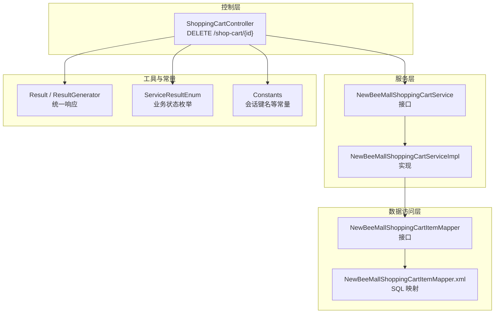
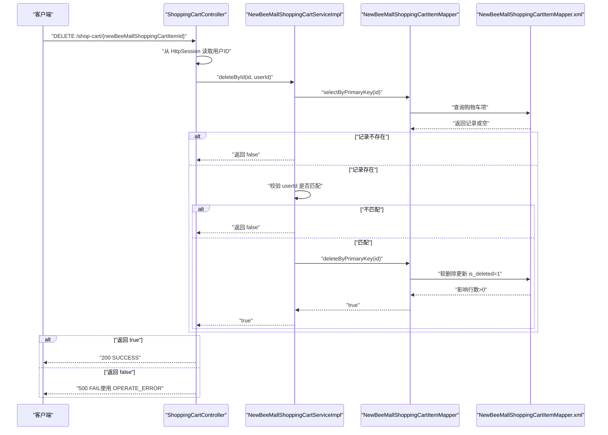
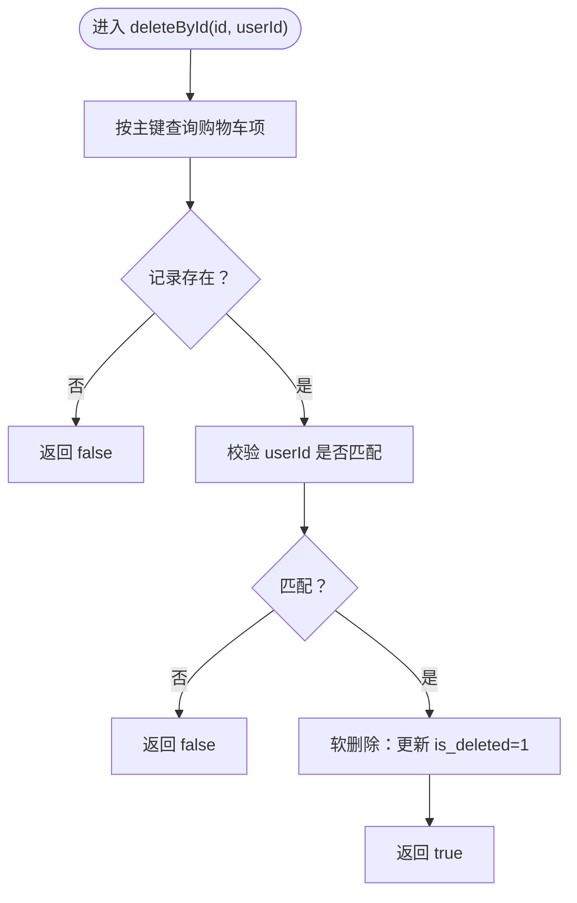
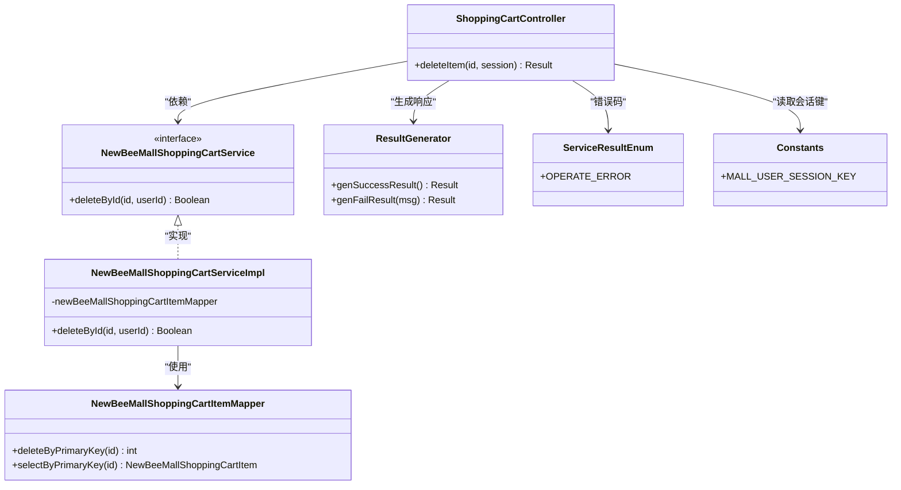
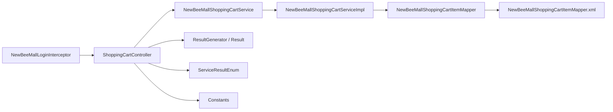

# 删除购物车商品

<cite>
**本文引用的文件**
- [ShoppingCartController.java](file://src/main/java/ltd/newbee/mall/controller/mall/ShoppingCartController.java)
- [NewBeeMallShoppingCartService.java](file://src/main/java/ltd/newbee/mall/service/NewBeeMallShoppingCartService.java)
- [NewBeeMallShoppingCartServiceImpl.java](file://src/main/java/ltd/newbee/mall/service/impl/NewBeeMallShoppingCartServiceImpl.java)
- [ServiceResultEnum.java](file://src/main/java/ltd/newbee/mall/common/ServiceResultEnum.java)
- [Constants.java](file://src/main/java/ltd/newbee/mall/common/Constants.java)
- [Result.java](file://src/main/java/ltd/newbee/mall/util/Result.java)
- [ResultGenerator.java](file://src/main/java/ltd/newbee/mall/util/ResultGenerator.java)
- [NewBeeMallShoppingCartItemMapper.java](file://src/main/java/ltd/newbee/mall/dao/NewBeeMallShoppingCartItemMapper.java)
- [NewBeeMallShoppingCartItemMapper.xml](file://src/main/resources/mapper/NewBeeMallShoppingCartItemMapper.xml)
- [NeeBeeMallWebMvcConfigurer.java](file://src/main/java/ltd/newbee/mall/config/NeeBeeMallWebMvcConfigurer.java)
- [NewBeeMallLoginInterceptor.java](file://src/main/java/ltd/newbee/mall/interceptor/NewBeeMallLoginInterceptor.java)
</cite>

## 目录
1. [简介](#简介)
2. [项目结构](#项目结构)
3. [核心组件](#核心组件)
4. [架构总览](#架构总览)
5. [详细组件分析](#详细组件分析)
6. [依赖关系分析](#依赖关系分析)
7. [性能考量](#性能考量)
8. [故障排查指南](#故障排查指南)
9. [结论](#结论)

## 简介
本文件面向 DELETE /shop-cart/{newBeeMallShoppingCartItemId} 接口，提供从接口定义、权限校验、服务层实现到响应格式的完整说明。重点解释路径参数 newBeeMallShoppingCartItemId 的作用，以及接口如何结合 Http Session 中的用户 ID 进行权限校验，确保用户只能删除自己的购物车项；同时阐述 NewBeeMallShoppingCartService.deleteById() 的实现逻辑（基于 ID 和用户 ID 的双重条件删除），并给出成功与失败（如删除非本人购物车项）的响应结果，以及 ServiceResultEnum.OPERATE_ERROR 在错误处理中的应用。最后提供调用示例与常见问题排查方法。

## 项目结构
围绕“删除购物车商品”这一功能，涉及的主要模块与文件如下：
- 控制层：负责接收请求、读取 Session、调用服务层并返回统一结果对象
- 服务层：封装业务逻辑，包含权限校验与数据持久化
- 数据访问层：通过 MyBatis 映射器执行数据库操作
- 工具与常量：统一响应结构、枚举状态码、会话键名等

图表来源
- [ShoppingCartController.java](file://src/main/java/ltd/newbee/mall/controller/mall/ShoppingCartController.java#L93-L105)
- [NewBeeMallShoppingCartService.java](file://src/main/java/ltd/newbee/mall/service/NewBeeMallShoppingCartService.java#L42-L50)
- [NewBeeMallShoppingCartServiceImpl.java](file://src/main/java/ltd/newbee/mall/service/impl/NewBeeMallShoppingCartServiceImpl.java#L98-L109)
- [NewBeeMallShoppingCartItemMapper.java](file://src/main/java/ltd/newbee/mall/dao/NewBeeMallShoppingCartItemMapper.java#L16-L36)
- [NewBeeMallShoppingCartItemMapper.xml](file://src/main/resources/mapper/NewBeeMallShoppingCartItemMapper.xml#L16-L45)
- [Result.java](file://src/main/java/ltd/newbee/mall/util/Result.java#L1-L58)
- [ResultGenerator.java](file://src/main/java/ltd/newbee/mall/util/ResultGenerator.java#L1-L59)
- [ServiceResultEnum.java](file://src/main/java/ltd/newbee/mall/common/ServiceResultEnum.java#L1-L91)
- [Constants.java](file://src/main/java/ltd/newbee/mall/common/Constants.java#L18-L48)

章节来源
- [ShoppingCartController.java](file://src/main/java/ltd/newbee/mall/controller/mall/ShoppingCartController.java#L93-L105)
- [NeeBeeMallWebMvcConfigurer.java](file://src/main/java/ltd/newbee/mall/config/NeeBeeMallWebMvcConfigurer.java#L31-L60)
- [NewBeeMallLoginInterceptor.java](file://src/main/java/ltd/newbee/mall/interceptor/NewBeeMallLoginInterceptor.java#L30-L38)

## 核心组件
- 控制器层：负责接收 DELETE /shop-cart/{newBeeMallShoppingCartItemId} 请求，从 HttpSession 中取出当前用户 ID，并调用服务层删除方法，最终使用统一结果对象返回。
- 服务层：实现 deleteById(id, userId)，先按主键查询购物车项，再比对用户 ID，最后执行删除。
- 数据访问层：提供按主键删除能力，实际执行软删除（更新 is_deleted 字段）。
- 工具与常量：统一响应结构、业务状态枚举、会话键名常量。

章节来源
- [ShoppingCartController.java](file://src/main/java/ltd/newbee/mall/controller/mall/ShoppingCartController.java#L93-L105)
- [NewBeeMallShoppingCartService.java](file://src/main/java/ltd/newbee/mall/service/NewBeeMallShoppingCartService.java#L42-L50)
- [NewBeeMallShoppingCartServiceImpl.java](file://src/main/java/ltd/newbee/mall/service/impl/NewBeeMallShoppingCartServiceImpl.java#L98-L109)
- [NewBeeMallShoppingCartItemMapper.xml](file://src/main/resources/mapper/NewBeeMallShoppingCartItemMapper.xml#L42-L45)
- [Constants.java](file://src/main/java/ltd/newbee/mall/common/Constants.java#L36-L39)
- [ResultGenerator.java](file://src/main/java/ltd/newbee/mall/util/ResultGenerator.java#L19-L39)
- [ServiceResultEnum.java](file://src/main/java/ltd/newbee/mall/common/ServiceResultEnum.java#L70-L77)

## 架构总览
下面的时序图展示了从客户端发起删除请求到服务端完成删除并返回响应的完整流程。

图表来源
- [ShoppingCartController.java](file://src/main/java/ltd/newbee/mall/controller/mall/ShoppingCartController.java#L93-L105)
- [NewBeeMallShoppingCartServiceImpl.java](file://src/main/java/ltd/newbee/mall/service/impl/NewBeeMallShoppingCartServiceImpl.java#L98-L109)
- [NewBeeMallShoppingCartItemMapper.java](file://src/main/java/ltd/newbee/mall/dao/NewBeeMallShoppingCartItemMapper.java#L16-L21)
- [NewBeeMallShoppingCartItemMapper.xml](file://src/main/resources/mapper/NewBeeMallShoppingCartItemMapper.xml#L16-L45)
- [ResultGenerator.java](file://src/main/java/ltd/newbee/mall/util/ResultGenerator.java#L19-L39)
- [ServiceResultEnum.java](file://src/main/java/ltd/newbee/mall/common/ServiceResultEnum.java#L70-L77)

## 详细组件分析

### 接口定义与权限校验
- 接口路径：DELETE /shop-cart/{newBeeMallShoppingCartItemId}
- 路径参数 newBeeMallShoppingCartItemId：代表要删除的购物车项主键 ID。
- 权限校验机制：
  - 控制器从 HttpSession 中读取当前登录用户的用户 ID（键名来自 Constants.MALL_USER_SESSION_KEY）。
  - 将该用户 ID 作为第二个参数传入服务层 deleteById 方法，服务层在执行删除前会再次核对记录所属用户是否与当前用户一致。
  - 若不一致，直接返回删除失败，避免越权删除他人购物车项。

章节来源
- [ShoppingCartController.java](file://src/main/java/ltd/newbee/mall/controller/mall/ShoppingCartController.java#L93-L105)
- [Constants.java](file://src/main/java/ltd/newbee/mall/common/Constants.java#L36-L39)
- [NeeBeeMallWebMvcConfigurer.java](file://src/main/java/ltd/newbee/mall/config/NeeBeeMallWebMvcConfigurer.java#L45-L59)
- [NewBeeMallLoginInterceptor.java](file://src/main/java/ltd/newbee/mall/interceptor/NewBeeMallLoginInterceptor.java#L30-L38)

### 服务层实现逻辑（NewBeeMallShoppingCartService.deleteById）
- 查询购物车项：按主键查询目标记录是否存在。
- 权限校验：比较记录中的用户 ID 与当前用户 ID 是否一致。
- 删除执行：若一致，执行删除（采用软删除，更新 is_deleted=1）；否则不执行。
- 返回值：布尔型，true 表示删除成功，false 表示删除失败（可能因记录不存在或用户不匹配）。

图表来源
- [NewBeeMallShoppingCartServiceImpl.java](file://src/main/java/ltd/newbee/mall/service/impl/NewBeeMallShoppingCartServiceImpl.java#L98-L109)
- [NewBeeMallShoppingCartItemMapper.xml](file://src/main/resources/mapper/NewBeeMallShoppingCartItemMapper.xml#L42-L45)

章节来源
- [NewBeeMallShoppingCartService.java](file://src/main/java/ltd/newbee/mall/service/NewBeeMallShoppingCartService.java#L42-L50)
- [NewBeeMallShoppingCartServiceImpl.java](file://src/main/java/ltd/newbee/mall/service/impl/NewBeeMallShoppingCartServiceImpl.java#L98-L109)

### 数据访问层与数据库行为
- Mapper 接口提供 deleteByPrimaryKey 方法。
- XML 映射器执行软删除，将 is_deleted 设为 1，而非物理删除。
- 查询时也带有 is_deleted=0 的过滤条件，确保只返回有效记录。

章节来源
- [NewBeeMallShoppingCartItemMapper.java](file://src/main/java/ltd/newbee/mall/dao/NewBeeMallShoppingCartItemMapper.java#L16-L21)
- [NewBeeMallShoppingCartItemMapper.xml](file://src/main/resources/mapper/NewBeeMallShoppingCartItemMapper.xml#L16-L45)

### 响应结果与错误处理
- 成功响应：当服务层返回 true 时，控制器构造统一的成功响应（HTTP 200，消息为默认成功）。
- 失败响应：当服务层返回 false 时，控制器构造统一的失败响应（HTTP 500，消息使用 ServiceResultEnum.OPERATE_ERROR 对应的文本）。
- 统一响应结构：ResultGenerator 提供 genSuccessResult()/genFailResult()/genErrorResult() 等静态方法，Result 封装了 resultCode、message、data 字段。

章节来源
- [ShoppingCartController.java](file://src/main/java/ltd/newbee/mall/controller/mall/ShoppingCartController.java#L93-L105)
- [ResultGenerator.java](file://src/main/java/ltd/newbee/mall/util/ResultGenerator.java#L19-L39)
- [Result.java](file://src/main/java/ltd/newbee/mall/util/Result.java#L1-L58)
- [ServiceResultEnum.java](file://src/main/java/ltd/newbee/mall/common/ServiceResultEnum.java#L70-L77)

### 类关系图（代码级）

图表来源
- [ShoppingCartController.java](file://src/main/java/ltd/newbee/mall/controller/mall/ShoppingCartController.java#L93-L105)
- [NewBeeMallShoppingCartService.java](file://src/main/java/ltd/newbee/mall/service/NewBeeMallShoppingCartService.java#L42-L50)
- [NewBeeMallShoppingCartServiceImpl.java](file://src/main/java/ltd/newbee/mall/service/impl/NewBeeMallShoppingCartServiceImpl.java#L98-L109)
- [NewBeeMallShoppingCartItemMapper.java](file://src/main/java/ltd/newbee/mall/dao/NewBeeMallShoppingCartItemMapper.java#L16-L21)
- [ResultGenerator.java](file://src/main/java/ltd/newbee/mall/util/ResultGenerator.java#L19-L39)
- [ServiceResultEnum.java](file://src/main/java/ltd/newbee/mall/common/ServiceResultEnum.java#L70-L77)
- [Constants.java](file://src/main/java/ltd/newbee/mall/common/Constants.java#L36-L39)

## 依赖关系分析
- 控制器依赖服务接口与工具类，服务实现依赖数据访问接口。
- 数据访问接口与映射文件共同决定删除策略（软删除）。
- 会话拦截器保证只有登录用户可访问购物车相关接口，配合控制器中的用户 ID 校验形成双重保障。

图表来源
- [ShoppingCartController.java](file://src/main/java/ltd/newbee/mall/controller/mall/ShoppingCartController.java#L93-L105)
- [NewBeeMallShoppingCartService.java](file://src/main/java/ltd/newbee/mall/service/NewBeeMallShoppingCartService.java#L42-L50)
- [NewBeeMallShoppingCartServiceImpl.java](file://src/main/java/ltd/newbee/mall/service/impl/NewBeeMallShoppingCartServiceImpl.java#L98-L109)
- [NewBeeMallShoppingCartItemMapper.java](file://src/main/java/ltd/newbee/mall/dao/NewBeeMallShoppingCartItemMapper.java#L16-L21)
- [NewBeeMallShoppingCartItemMapper.xml](file://src/main/resources/mapper/NewBeeMallShoppingCartItemMapper.xml#L42-L45)
- [ResultGenerator.java](file://src/main/java/ltd/newbee/mall/util/ResultGenerator.java#L19-L39)
- [ServiceResultEnum.java](file://src/main/java/ltd/newbee/mall/common/ServiceResultEnum.java#L70-L77)
- [Constants.java](file://src/main/java/ltd/newbee/mall/common/Constants.java#L36-L39)
- [NewBeeMallLoginInterceptor.java](file://src/main/java/ltd/newbee/mall/interceptor/NewBeeMallLoginInterceptor.java#L30-L38)

章节来源
- [NeeBeeMallWebMvcConfigurer.java](file://src/main/java/ltd/newbee/mall/config/NeeBeeMallWebMvcConfigurer.java#L31-L60)

## 性能考量
- 删除操作为 O(1) 查询与更新，数据库层面通过软删除减少全表扫描成本。
- 由于查询与删除均基于主键，索引命中率高，整体延迟较低。
- 若购物车项过多，建议前端仅显示必要字段，避免不必要的数据传输。

[本节为通用指导，无需列出具体文件来源]

## 故障排查指南
- 无法删除他人购物车项
  - 现象：返回失败，但未提示具体原因。
  - 排查：确认当前登录用户与购物车项所属用户一致；检查会话是否正确设置。
  - 参考：控制器读取会话键与服务层二次校验逻辑。
- 记录不存在
  - 现象：返回失败。
  - 排查：确认传入的 newBeeMallShoppingCartItemId 是否正确；检查数据库中是否存在对应记录且未被软删除。
- 会话未登录
  - 现象：被拦截器重定向到登录页或返回未授权。
  - 排查：确认登录状态与会话键是否存在于 HttpSession。
- 响应格式
  - 成功：HTTP 200，消息为默认成功。
  - 失败：HTTP 500，消息为“操作失败”。

章节来源
- [ShoppingCartController.java](file://src/main/java/ltd/newbee/mall/controller/mall/ShoppingCartController.java#L93-L105)
- [NewBeeMallShoppingCartServiceImpl.java](file://src/main/java/ltd/newbee/mall/service/impl/NewBeeMallShoppingCartServiceImpl.java#L98-L109)
- [NewBeeMallShoppingCartItemMapper.xml](file://src/main/resources/mapper/NewBeeMallShoppingCartItemMapper.xml#L16-L45)
- [NewBeeMallLoginInterceptor.java](file://src/main/java/ltd/newbee/mall/interceptor/NewBeeMallLoginInterceptor.java#L30-L38)

## 结论
DELETE /shop-cart/{newBeeMallShoppingCartItemId} 接口通过路径参数定位目标购物车项，并结合 HttpSession 中的用户 ID 实现双重校验，确保用户只能删除自己的购物车项。服务层在删除前进行存在性与归属校验，数据库采用软删除策略。控制器统一返回响应，失败时使用 ServiceResultEnum.OPERATE_ERROR 对应的消息。整体设计清晰、安全可靠，便于扩展与维护。