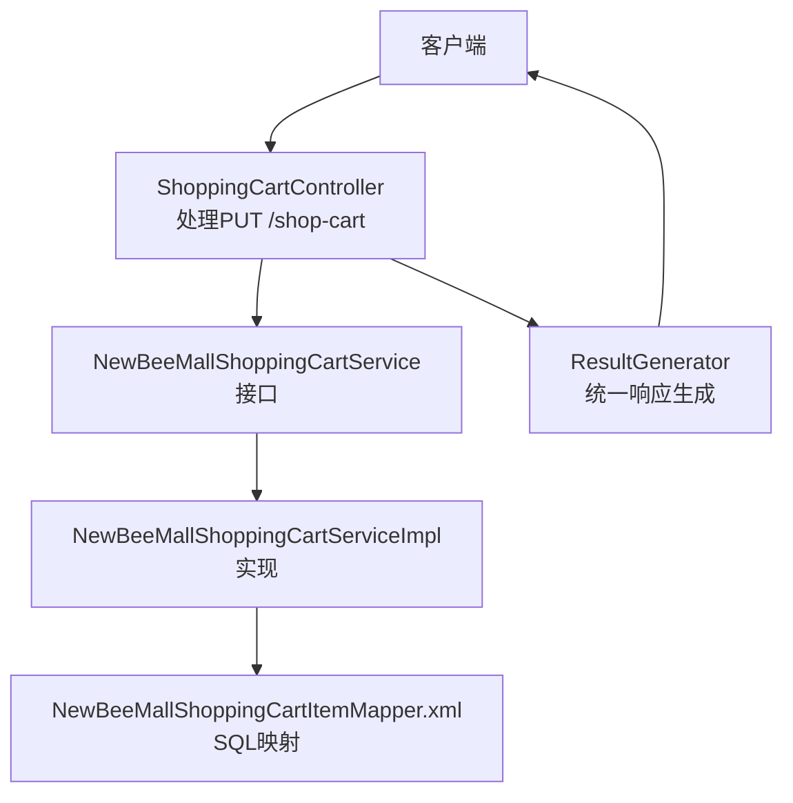
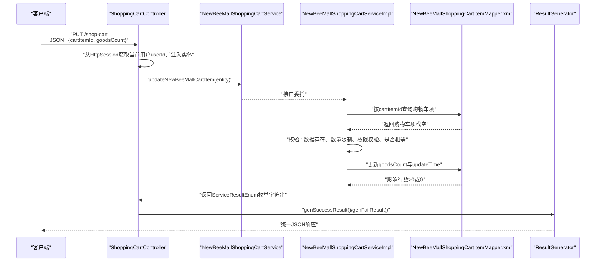
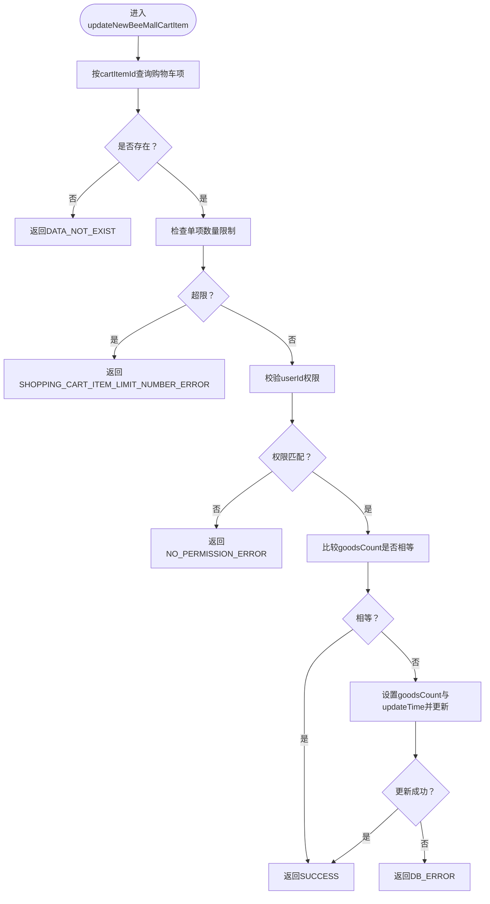
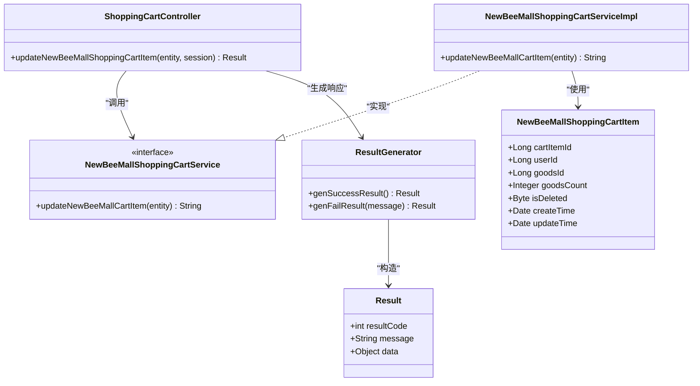

# 更新购物车商品数量

<cite>
**本文引用的文件**
- [ShoppingCartController.java](file://src/main/java/ltd/newbee/mall/controller/mall/ShoppingCartController.java)
- [NewBeeMallShoppingCartService.java](file://src/main/java/ltd/newbee/mall/service/NewBeeMallShoppingCartService.java)
- [NewBeeMallShoppingCartServiceImpl.java](file://src/main/java/ltd/newbee/mall/service/impl/NewBeeMallShoppingCartServiceImpl.java)
- [NewBeeMallShoppingCartItem.java](file://src/main/java/ltd/newbee/mall/entity/NewBeeMallShoppingCartItem.java)
- [Constants.java](file://src/main/java/ltd/newbee/mall/common/Constants.java)
- [ServiceResultEnum.java](file://src/main/java/ltd/newbee/mall/common/ServiceResultEnum.java)
- [ResultGenerator.java](file://src/main/java/ltd/newbee/mall/util/ResultGenerator.java)
- [Result.java](file://src/main/java/ltd/newbee/mall/util/Result.java)
- [NewBeeMallShoppingCartItemMapper.xml](file://src/main/resources/mapper/NewBeeMallShoppingCartItemMapper.xml)
- [API.md](file://docs/API.md)
</cite>

## 目录
1. [简介](#简介)
2. [项目结构](#项目结构)
3. [核心组件](#核心组件)
4. [架构总览](#架构总览)
5. [详细组件分析](#详细组件分析)
6. [依赖关系分析](#依赖关系分析)
7. [性能考量](#性能考量)
8. [故障排查指南](#故障排查指南)
9. [结论](#结论)
10. [附录](#附录)

## 简介
本文档围绕 PUT /shop-cart 接口进行深入解析，说明其如何接收包含 cartItemId 和 goodsCount 的 JSON 请求体，对用户权限进行校验（确保购物车项属于当前用户），随后调用服务层执行更新操作。重点阐述 NewBeeMallShoppingCartService.updateNewBeeMallCartItem() 方法的实现细节，包括数据合法性校验（数量大于0）、购物车单项与总量限制检查、以及数据库更新流程。同时解释 ResultGenerator.genSuccessResult() 与 genFailResult() 在响应生成中的使用，并给出成功与失败响应示例。最后强调该接口的幂等性特点，帮助开发者正确理解与使用该接口。

## 项目结构
- 控制层：负责接收 HTTP 请求、提取会话用户信息、封装请求体为实体对象、调用服务层并生成统一响应。
- 服务层：封装业务逻辑，执行数据校验与数据库操作。
- 实体与映射：购物车项实体、MyBatis 映射器 XML 定义数据库访问。
- 工具与常量：统一响应包装 Result/ResultGenerator、业务常量（如购物车单项与总量上限）、服务层返回枚举。

图表来源
- [ShoppingCartController.java](file://src/main/java/ltd/newbee/mall/controller/mall/ShoppingCartController.java#L78-L91)
- [NewBeeMallShoppingCartService.java](file://src/main/java/ltd/newbee/mall/service/NewBeeMallShoppingCartService.java#L16-L33)
- [NewBeeMallShoppingCartServiceImpl.java](file://src/main/java/ltd/newbee/mall/service/impl/NewBeeMallShoppingCartServiceImpl.java#L66-L91)
- [NewBeeMallShoppingCartItemMapper.xml](file://src/main/resources/mapper/NewBeeMallShoppingCartItemMapper.xml#L1-L144)
- [ResultGenerator.java](file://src/main/java/ltd/newbee/mall/util/ResultGenerator.java#L1-L59)

章节来源
- [ShoppingCartController.java](file://src/main/java/ltd/newbee/mall/controller/mall/ShoppingCartController.java#L78-L91)
- [API.md](file://docs/API.md#L138-L177)

## 核心组件
- 控制器层：PUT /shop-cart 对应 ShoppingCartController.updateNewBeeMallShoppingCartItem()，从请求体读取 NewBeeMallShoppingCartItem，注入 userId（来自会话），调用服务层并根据返回结果生成统一响应。
- 服务层接口：NewBeeMallShoppingCartService.updateNewBeeMallCartItem() 定义更新购物车项数量的契约。
- 服务层实现：NewBeeMallShoppingCartServiceImpl.updateNewBeeMallCartItem() 执行具体业务逻辑，包括查询、权限校验、数量限制检查、相等性判断与数据库更新。
- 实体模型：NewBeeMallShoppingCartItem 定义 cartItemId、userId、goodsId、goodsCount 等字段。
- 常量与枚举：Constants 中定义购物车单项与总量上限；ServiceResultEnum 定义服务层返回消息。
- 统一响应：ResultGenerator 提供 genSuccessResult()/genFailResult()；Result 作为响应载体。

章节来源
- [ShoppingCartController.java](file://src/main/java/ltd/newbee/mall/controller/mall/ShoppingCartController.java#L78-L91)
- [NewBeeMallShoppingCartService.java](file://src/main/java/ltd/newbee/mall/service/NewBeeMallShoppingCartService.java#L16-L33)
- [NewBeeMallShoppingCartServiceImpl.java](file://src/main/java/ltd/newbee/mall/service/impl/NewBeeMallShoppingCartServiceImpl.java#L66-L91)
- [NewBeeMallShoppingCartItem.java](file://src/main/java/ltd/newbee/mall/entity/NewBeeMallShoppingCartItem.java#L1-L100)
- [Constants.java](file://src/main/java/ltd/newbee/mall/common/Constants.java#L32-L34)
- [ServiceResultEnum.java](file://src/main/java/ltd/newbee/mall/common/ServiceResultEnum.java#L46-L48)
- [ResultGenerator.java](file://src/main/java/ltd/newbee/mall/util/ResultGenerator.java#L1-L59)
- [Result.java](file://src/main/java/ltd/newbee/mall/util/Result.java#L1-L58)

## 架构总览
下面的时序图展示了从客户端发起 PUT /shop-cart 到服务层更新并返回统一响应的完整流程。

图表来源
- [ShoppingCartController.java](file://src/main/java/ltd/newbee/mall/controller/mall/ShoppingCartController.java#L78-L91)
- [NewBeeMallShoppingCartServiceImpl.java](file://src/main/java/ltd/newbee/mall/service/impl/NewBeeMallShoppingCartServiceImpl.java#L66-L91)
- [NewBeeMallShoppingCartItemMapper.xml](file://src/main/resources/mapper/NewBeeMallShoppingCartItemMapper.xml#L16-L21)
- [ResultGenerator.java](file://src/main/java/ltd/newbee/mall/util/ResultGenerator.java#L19-L50)

## 详细组件分析

### 控制器：PUT /shop-cart
- 路由与方法：控制器通过 @PutMapping("/shop-cart") 映射到 updateNewBeeMallShoppingCartItem()。
- 请求体绑定：@RequestBody NewBeeMallShoppingCartItem 绑定 cartItemId 与 goodsCount。
- 会话用户注入：从 HttpSession 中取出当前用户 userId 并设置到实体中，确保后续权限校验有效。
- 服务层调用：调用 newBeeMallShoppingCartService.updateNewBeeMallCartItem()，并将返回字符串与 ServiceResultEnum.SUCCESS 比较决定成功或失败响应。
- 响应生成：成功时调用 ResultGenerator.genSuccessResult()，失败时调用 ResultGenerator.genFailResult(updateResult)。

章节来源
- [ShoppingCartController.java](file://src/main/java/ltd/newbee/mall/controller/mall/ShoppingCartController.java#L78-L91)
- [API.md](file://docs/API.md#L138-L177)

### 服务层接口：updateNewBeeMallCartItem
- 方法签名：String updateNewBeeMallCartItem(NewBeeMallShoppingCartItem newBeeMallShoppingCartItem)。
- 返回约定：返回 ServiceResultEnum 的 result 字段字符串，便于控制器侧进行成功/失败判定。

章节来源
- [NewBeeMallShoppingCartService.java](file://src/main/java/ltd/newbee/mall/service/NewBeeMallShoppingCartService.java#L26-L33)

### 服务层实现：updateNewBeeMallCartItem()
- 查询购物车项：根据 cartItemId 查询是否存在该记录。
- 数据存在性校验：若不存在，返回 ServiceResultEnum.DATA_NOT_EXIST。
- 数量限制校验：超过 Constants.SHOPPING_CART_ITEM_LIMIT_NUMBER（单项上限）返回 ServiceResultEnum.SHOPPING_CART_ITEM_LIMIT_NUMBER_ERROR。
- 权限校验：比较实体中的 userId 与查询到的 userId，若不一致返回 ServiceResultEnum.NO_PERMISSION_ERROR。
- 相等性判断：若 goodsCount 与数据库中相同，则直接返回 ServiceResultEnum.SUCCESS，避免不必要的数据库写入。
- 数据更新：设置 goodsCount 与 updateTime，调用 updateByPrimaryKeySelective() 执行更新，成功返回 ServiceResultEnum.SUCCESS，否则返回 ServiceResultEnum.DB_ERROR。

图表来源
- [NewBeeMallShoppingCartServiceImpl.java](file://src/main/java/ltd/newbee/mall/service/impl/NewBeeMallShoppingCartServiceImpl.java#L66-L91)
- [Constants.java](file://src/main/java/ltd/newbee/mall/common/Constants.java#L32-L34)
- [ServiceResultEnum.java](file://src/main/java/ltd/newbee/mall/common/ServiceResultEnum.java#L46-L48)

章节来源
- [NewBeeMallShoppingCartServiceImpl.java](file://src/main/java/ltd/newbee/mall/service/impl/NewBeeMallShoppingCartServiceImpl.java#L66-L91)
- [Constants.java](file://src/main/java/ltd/newbee/mall/common/Constants.java#L32-L34)
- [ServiceResultEnum.java](file://src/main/java/ltd/newbee/mall/common/ServiceResultEnum.java#L46-L48)

### 数据模型与数据库映射
- 实体字段：cartItemId、userId、goodsId、goodsCount、isDeleted、createTime、updateTime。
- MyBatis 映射：selectByPrimaryKey、updateByPrimaryKeySelective 等 SQL 定义了按主键查询与选择性更新逻辑。

章节来源
- [NewBeeMallShoppingCartItem.java](file://src/main/java/ltd/newbee/mall/entity/NewBeeMallShoppingCartItem.java#L1-L100)
- [NewBeeMallShoppingCartItemMapper.xml](file://src/main/resources/mapper/NewBeeMallShoppingCartItemMapper.xml#L16-L21)
- [NewBeeMallShoppingCartItemMapper.xml](file://src/main/resources/mapper/NewBeeMallShoppingCartItemMapper.xml#L110-L133)

### 响应生成：ResultGenerator 与 Result
- 成功响应：genSuccessResult() 设置 resultCode=200，message="SUCCESS"。
- 失败响应：genFailResult(String message) 设置 resultCode=500，message 使用传入的错误字符串。
- 统一载体：Result 包含 resultCode、message、data 三个字段，控制器将服务层返回的字符串作为 message 使用。

章节来源
- [ResultGenerator.java](file://src/main/java/ltd/newbee/mall/util/ResultGenerator.java#L19-L50)
- [Result.java](file://src/main/java/ltd/newbee/mall/util/Result.java#L1-L58)

### 请求体字段与权限校验
- 请求体字段：cartItemId（购物车项ID）、goodsCount（新数量）。
- 权限校验：服务层实现中比较请求实体中的 userId 与数据库查询到的 userId，确保仅能更新自己的购物车项。

章节来源
- [API.md](file://docs/API.md#L138-L177)
- [NewBeeMallShoppingCartServiceImpl.java](file://src/main/java/ltd/newbee/mall/service/impl/NewBeeMallShoppingCartServiceImpl.java#L76-L83)

### 幂等性说明
- 幂等性：多次对同一 cartItemId 发送相同的 goodsCount 不会产生重复副作用，服务层在 goodsCount 相等时直接返回成功，避免重复更新。
- 结论：PUT /shop-cart 具有幂等性，适合前端重试与并发场景。

章节来源
- [NewBeeMallShoppingCartServiceImpl.java](file://src/main/java/ltd/newbee/mall/service/impl/NewBeeMallShoppingCartServiceImpl.java#L80-L83)

## 依赖关系分析
- 控制器依赖服务接口与统一响应工具。
- 服务实现依赖 DAO 映射器与常量、枚举。
- 实体与映射器之间通过 MyBatis 进行数据交互。

图表来源
- [ShoppingCartController.java](file://src/main/java/ltd/newbee/mall/controller/mall/ShoppingCartController.java#L78-L91)
- [NewBeeMallShoppingCartService.java](file://src/main/java/ltd/newbee/mall/service/NewBeeMallShoppingCartService.java#L16-L33)
- [NewBeeMallShoppingCartServiceImpl.java](file://src/main/java/ltd/newbee/mall/service/impl/NewBeeMallShoppingCartServiceImpl.java#L66-L91)
- [NewBeeMallShoppingCartItem.java](file://src/main/java/ltd/newbee/mall/entity/NewBeeMallShoppingCartItem.java#L1-L100)
- [ResultGenerator.java](file://src/main/java/ltd/newbee/mall/util/ResultGenerator.java#L1-L59)
- [Result.java](file://src/main/java/ltd/newbee/mall/util/Result.java#L1-L58)

## 性能考量
- 查询与更新：服务层通过按主键查询一次，再进行权限与数量校验，最后选择性更新，避免不必要的写操作。
- 相等性短路：当 goodsCount 相等时直接返回成功，减少数据库往返。
- 批量与索引：购物车项通常按用户维度查询，建议确保 user_id 与 cart_item_id 的索引优化，提升查询效率。

## 故障排查指南
- 未登录或会话丢失：控制器从会话获取 userId 失败会导致权限校验失败，返回 NO_PERMISSION_ERROR。
- 购物车项不存在：按 cartItemId 查询不到记录，返回 DATA_NOT_EXIST。
- 超过单项数量限制：超过 Constants.SHOPPING_CART_ITEM_LIMIT_NUMBER，返回 SHOPPING_CART_ITEM_LIMIT_NUMBER_ERROR。
- 权限不足：userId 不匹配，返回 NO_PERMISSION_ERROR。
- 数据库异常：更新失败返回 DB_ERROR。
- 响应格式：统一使用 ResultGenerator 生成 JSON，其中 resultCode=200 表示成功，500 表示失败。

章节来源
- [ServiceResultEnum.java](file://src/main/java/ltd/newbee/mall/common/ServiceResultEnum.java#L22-L23)
- [ServiceResultEnum.java](file://src/main/java/ltd/newbee/mall/common/ServiceResultEnum.java#L46-L48)
- [ServiceResultEnum.java](file://src/main/java/ltd/newbee/mall/common/ServiceResultEnum.java#L74-L74)
- [ServiceResultEnum.java](file://src/main/java/ltd/newbee/mall/common/ServiceResultEnum.java#L76-L76)
- [ResultGenerator.java](file://src/main/java/ltd/newbee/mall/util/ResultGenerator.java#L19-L50)

## 结论
PUT /shop-cart 接口通过严格的权限校验与数量限制，结合幂等设计，提供了安全且可重试的购物车数量更新能力。服务层实现清晰地分离了查询、校验与更新逻辑，配合统一响应生成工具，使前后端交互更加规范与稳定。

## 附录

### 请求与响应示例
- 请求示例（JSON）
  - URL: PUT /shop-cart
  - Body:
    - cartItemId: 购物车项ID（Long）
    - goodsCount: 新数量（Integer）

- 成功响应示例（JSON）
  - 结构:
    - resultCode: 200
    - message: "SUCCESS"
    - data: null

- 失败响应示例（JSON）
  - 结构:
    - resultCode: 500
    - message: 错误信息（例如“无权限！”、“超出单个商品的最大购买数量！”、“数据库异常”等）
    - data: null

章节来源
- [API.md](file://docs/API.md#L138-L177)
- [ResultGenerator.java](file://src/main/java/ltd/newbee/mall/util/ResultGenerator.java#L19-L50)
- [ServiceResultEnum.java](file://src/main/java/ltd/newbee/mall/common/ServiceResultEnum.java#L46-L48)
- [ServiceResultEnum.java](file://src/main/java/ltd/newbee/mall/common/ServiceResultEnum.java#L74-L74)
- [ServiceResultEnum.java](file://src/main/java/ltd/newbee/mall/common/ServiceResultEnum.java#L76-L76)