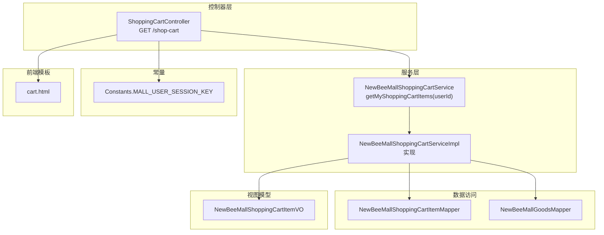
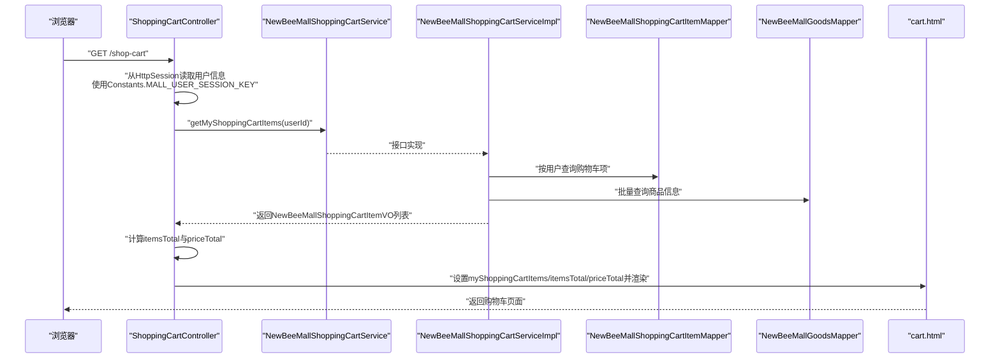
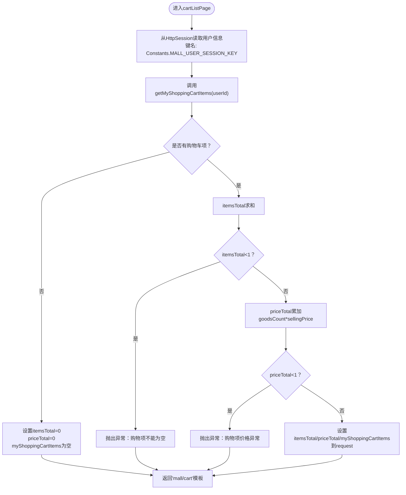
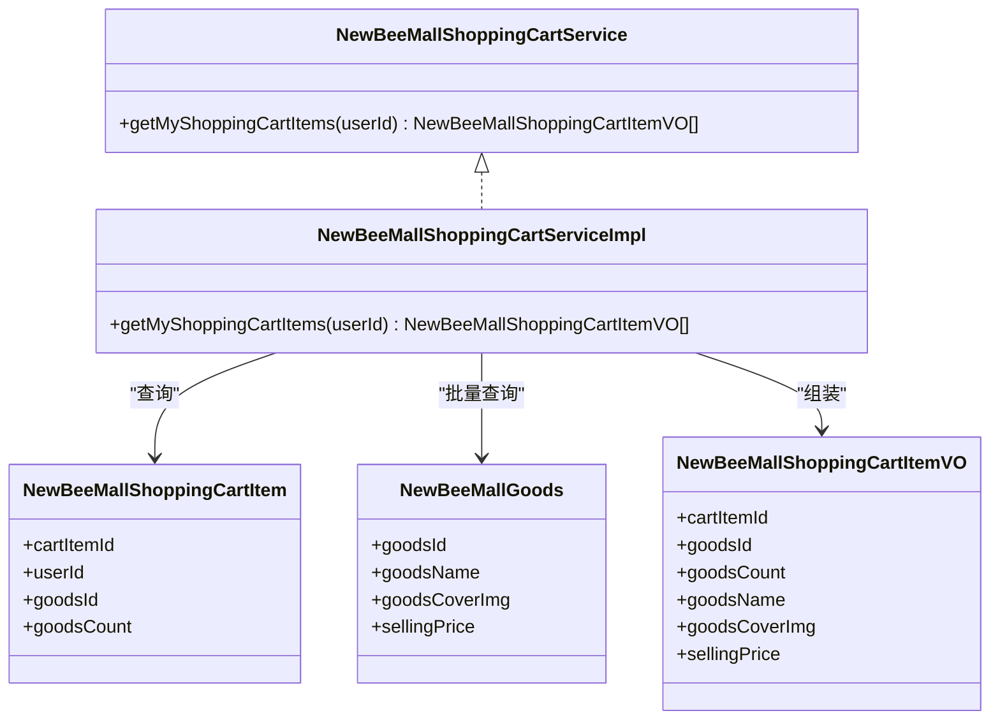
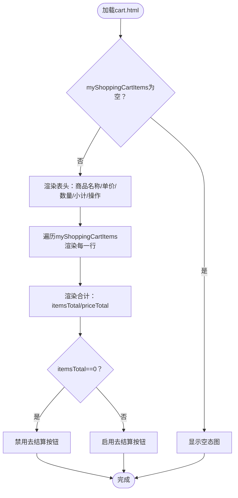
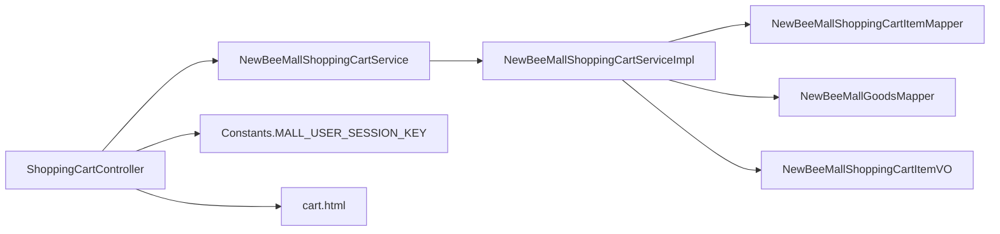

# 查看购物车

<cite>
**本文引用的文件**
- [ShoppingCartController.java](file://src/main/java/ltd/newbee/mall/controller/mall/ShoppingCartController.java)
- [NewBeeMallShoppingCartService.java](file://src/main/java/ltd/newbee/mall/service/NewBeeMallShoppingCartService.java)
- [NewBeeMallShoppingCartServiceImpl.java](file://src/main/java/ltd/newbee/mall/service/impl/NewBeeMallShoppingCartServiceImpl.java)
- [NewBeeMallShoppingCartItemVO.java](file://src/main/java/ltd/newbee/mall/controller/vo/NewBeeMallShoppingCartItemVO.java)
- [NewBeeMallUserVO.java](file://src/main/java/ltd/newbee/mall/controller/vo/NewBeeMallUserVO.java)
- [Constants.java](file://src/main/java/ltd/newbee/mall/common/Constants.java)
- [cart.html](file://src/main/resources/templates/mall/cart.html)
- [NewBeeMallShoppingCartItem.java](file://src/main/java/ltd/newbee/mall/entity/NewBeeMallShoppingCartItem.java)
</cite>

## 目录
1. [简介](#简介)
2. [项目结构](#项目结构)
3. [核心组件](#核心组件)
4. [架构总览](#架构总览)
5. [详细组件分析](#详细组件分析)
6. [依赖关系分析](#依赖关系分析)
7. [性能考量](#性能考量)
8. [故障排查指南](#故障排查指南)
9. [结论](#结论)
10. [附录](#附录)

## 简介
本文件面向“查看购物车”场景，聚焦于 GET /shop-cart 接口的完整流程说明。内容涵盖：
- 如何通过 HttpSession 获取当前登录用户信息
- 控制器如何调用服务层 NewBeeMallShoppingCartService.getMyShoppingCartItems() 获取购物车商品列表
- 服务层返回 NewBeeMallShoppingCartItemVO 视图对象列表的组装过程
- 控制器如何计算商品总数量和总价并存入 request 作用域
- 前端页面如何渲染购物车项（图片、名称、价格、数量、小计）
- 对 Constants.MALL_USER_SESSION_KEY 常量的使用说明
- 当购物车为空时的处理逻辑

## 项目结构
围绕“查看购物车”的关键文件组织如下：
- 控制器层：负责接收请求、从 Session 中取用户、调用服务层、计算统计值并渲染模板
- 服务层：负责从数据库查询购物车项并组装 VO 列表
- 视图模型：VO 类承载购物车项的展示字段
- 常量定义：统一管理 Session 中用户键名
- 前端模板：负责购物车页面的渲染与交互

图表来源
- [ShoppingCartController.java](file://src/main/java/ltd/newbee/mall/controller/mall/ShoppingCartController.java#L36-L61)
- [NewBeeMallShoppingCartService.java](file://src/main/java/ltd/newbee/mall/service/NewBeeMallShoppingCartService.java#L52-L59)
- [NewBeeMallShoppingCartServiceImpl.java](file://src/main/java/ltd/newbee/mall/service/impl/NewBeeMallShoppingCartServiceImpl.java#L111-L141)
- [NewBeeMallShoppingCartItemVO.java](file://src/main/java/ltd/newbee/mall/controller/vo/NewBeeMallShoppingCartItemVO.java#L1-L78)
- [Constants.java](file://src/main/java/ltd/newbee/mall/common/Constants.java#L36-L41)
- [cart.html](file://src/main/resources/templates/mall/cart.html#L1-L210)

章节来源
- [ShoppingCartController.java](file://src/main/java/ltd/newbee/mall/controller/mall/ShoppingCartController.java#L36-L61)
- [NewBeeMallShoppingCartService.java](file://src/main/java/ltd/newbee/mall/service/NewBeeMallShoppingCartService.java#L52-L59)
- [NewBeeMallShoppingCartServiceImpl.java](file://src/main/java/ltd/newbee/mall/service/impl/NewBeeMallShoppingCartServiceImpl.java#L111-L141)
- [Constants.java](file://src/main/java/ltd/newbee/mall/common/Constants.java#L36-L41)
- [cart.html](file://src/main/resources/templates/mall/cart.html#L1-L210)

## 核心组件
- 控制器：GET /shop-cart 负责从 Session 中读取用户信息，调用服务层获取购物车项，计算总数量与总价，将数据放入 request 并渲染 cart 模板。
- 服务接口与实现：提供 getMyShoppingCartItems(userId) 方法，内部完成购物车项与商品信息的联查与 VO 组装。
- 视图模型：NewBeeMallShoppingCartItemVO 承载购物车项的展示字段（如商品封面、名称、单价、数量等）。
- 常量：Constants.MALL_USER_SESSION_KEY 定义了 Session 中存储用户信息的键名。
- 前端模板：cart.html 使用 Thymeleaf 渲染购物车列表、统计信息与交互按钮。

章节来源
- [ShoppingCartController.java](file://src/main/java/ltd/newbee/mall/controller/mall/ShoppingCartController.java#L36-L61)
- [NewBeeMallShoppingCartService.java](file://src/main/java/ltd/newbee/mall/service/NewBeeMallShoppingCartService.java#L52-L59)
- [NewBeeMallShoppingCartServiceImpl.java](file://src/main/java/ltd/newbee/mall/service/impl/NewBeeMallShoppingCartServiceImpl.java#L111-L141)
- [NewBeeMallShoppingCartItemVO.java](file://src/main/java/ltd/newbee/mall/controller/vo/NewBeeMallShoppingCartItemVO.java#L1-L78)
- [Constants.java](file://src/main/java/ltd/newbee/mall/common/Constants.java#L36-L41)
- [cart.html](file://src/main/resources/templates/mall/cart.html#L1-L210)

## 架构总览
下面的序列图展示了从浏览器发起 GET /shop-cart 请求到页面渲染的完整流程。

图表来源
- [ShoppingCartController.java](file://src/main/java/ltd/newbee/mall/controller/mall/ShoppingCartController.java#L36-L61)
- [NewBeeMallShoppingCartService.java](file://src/main/java/ltd/newbee/mall/service/NewBeeMallShoppingCartService.java#L52-L59)
- [NewBeeMallShoppingCartServiceImpl.java](file://src/main/java/ltd/newbee/mall/service/impl/NewBeeMallShoppingCartServiceImpl.java#L111-L141)
- [cart.html](file://src/main/resources/templates/mall/cart.html#L1-L210)

## 详细组件分析

### 控制器：GET /shop-cart
- 用户识别：从 HttpSession 中通过 Constants.MALL_USER_SESSION_KEY 获取 NewBeeMallUserVO，并从中提取 userId。
- 数据获取：调用 NewBeeMallShoppingCartService.getMyShoppingCartItems(userId) 返回购物车项 VO 列表。
- 统计计算：
  - 商品总数量 itemsTotal：对每个 VO 的 goodsCount 求和。
  - 总价 priceTotal：对每个 VO 的 goodsCount × sellingPrice 求和。
- 异常处理：当 itemsTotal 或 priceTotal 出现异常（如小于等于0）时抛出业务异常。
- 数据注入：将 itemsTotal、priceTotal、myShoppingCartItems 放入 request 作用域，转发到模板 mall/cart。
- 返回视图：返回字符串 "mall/cart"，由模板引擎渲染。

图表来源
- [ShoppingCartController.java](file://src/main/java/ltd/newbee/mall/controller/mall/ShoppingCartController.java#L36-L61)

章节来源
- [ShoppingCartController.java](file://src/main/java/ltd/newbee/mall/controller/mall/ShoppingCartController.java#L36-L61)
- [Constants.java](file://src/main/java/ltd/newbee/mall/common/Constants.java#L36-L41)

### 服务层：getMyShoppingCartItems(userId)
- 查询购物车项：按用户 ID 查询购物车记录，限制最大数量。
- 批量查询商品：从商品表中批量查询对应商品，构建 goodsId -> 商品实体的映射。
- VO 组装：
  - 将购物车项复制到 NewBeeMallShoppingCartItemVO
  - 若能匹配到商品信息，则填充 goodsCoverImg、goodsName（截断超长）、sellingPrice
- 返回 VO 列表：供控制器进行统计与渲染。

图表来源
- [NewBeeMallShoppingCartService.java](file://src/main/java/ltd/newbee/mall/service/NewBeeMallShoppingCartService.java#L52-L59)
- [NewBeeMallShoppingCartServiceImpl.java](file://src/main/java/ltd/newbee/mall/service/impl/NewBeeMallShoppingCartServiceImpl.java#L111-L141)
- [NewBeeMallShoppingCartItemVO.java](file://src/main/java/ltd/newbee/mall/controller/vo/NewBeeMallShoppingCartItemVO.java#L1-L78)
- [NewBeeMallShoppingCartItem.java](file://src/main/java/ltd/newbee/mall/entity/NewBeeMallShoppingCartItem.java#L1-L100)

章节来源
- [NewBeeMallShoppingCartService.java](file://src/main/java/ltd/newbee/mall/service/NewBeeMallShoppingCartService.java#L52-L59)
- [NewBeeMallShoppingCartServiceImpl.java](file://src/main/java/ltd/newbee/mall/service/impl/NewBeeMallShoppingCartServiceImpl.java#L111-L141)
- [NewBeeMallShoppingCartItemVO.java](file://src/main/java/ltd/newbee/mall/controller/vo/NewBeeMallShoppingCartItemVO.java#L1-L78)
- [NewBeeMallShoppingCartItem.java](file://src/main/java/ltd/newbee/mall/entity/NewBeeMallShoppingCartItem.java#L1-L100)

### 前端模板：cart.html
- 空购物车处理：当 myShoppingCartItems 为空时显示空态图。
- 列表渲染：遍历 myShoppingCartItems，展示商品封面、名称、单价、数量输入框、小计与删除操作。
- 统计展示：显示 itemsTotal 与 priceTotal；当 itemsTotal 为 0 时禁用“去结算”按钮。
- 交互逻辑：数量变更触发 PUT /shop-cart，删除触发 DELETE /shop-cart/{id}，结算跳转到 /shop-cart/settle。

图表来源
- [cart.html](file://src/main/resources/templates/mall/cart.html#L1-L210)

章节来源
- [cart.html](file://src/main/resources/templates/mall/cart.html#L1-L210)

### 关键常量：Constants.MALL_USER_SESSION_KEY
- 用途：作为 HttpSession 中存储当前登录用户信息的键名，控制器通过该键从 Session 中取出 NewBeeMallUserVO。
- 影响范围：所有需要基于登录用户上下文进行操作的控制器均依赖该常量。

章节来源
- [Constants.java](file://src/main/java/ltd/newbee/mall/common/Constants.java#L36-L41)
- [ShoppingCartController.java](file://src/main/java/ltd/newbee/mall/controller/mall/ShoppingCartController.java#L36-L61)

### 购物车为空时的处理逻辑
- 控制器侧：当 getMyShoppingCartItems 返回空列表时，控制器仍会设置 itemsTotal=0、priceTotal=0，并将空列表放入 request，随后渲染 cart 模板。
- 前端侧：模板检测列表为空时显示空态图；合计区域显示 0；去结算按钮被禁用或提示不可结算。

章节来源
- [ShoppingCartController.java](file://src/main/java/ltd/newbee/mall/controller/mall/ShoppingCartController.java#L36-L61)
- [cart.html](file://src/main/resources/templates/mall/cart.html#L1-L210)

## 依赖关系分析
- 控制器依赖服务接口与常量；服务实现依赖数据访问层与 VO 类型。
- 服务实现内部通过购物车 Mapper 与商品 Mapper 进行联表查询与数据转换。
- 前端模板依赖后端注入的 request 属性（itemsTotal、priceTotal、myShoppingCartItems）。

图表来源
- [ShoppingCartController.java](file://src/main/java/ltd/newbee/mall/controller/mall/ShoppingCartController.java#L36-L61)
- [NewBeeMallShoppingCartService.java](file://src/main/java/ltd/newbee/mall/service/NewBeeMallShoppingCartService.java#L52-L59)
- [NewBeeMallShoppingCartServiceImpl.java](file://src/main/java/ltd/newbee/mall/service/impl/NewBeeMallShoppingCartServiceImpl.java#L111-L141)
- [cart.html](file://src/main/resources/templates/mall/cart.html#L1-L210)

章节来源
- [ShoppingCartController.java](file://src/main/java/ltd/newbee/mall/controller/mall/ShoppingCartController.java#L36-L61)
- [NewBeeMallShoppingCartService.java](file://src/main/java/ltd/newbee/mall/service/NewBeeMallShoppingCartService.java#L52-L59)
- [NewBeeMallShoppingCartServiceImpl.java](file://src/main/java/ltd/newbee/mall/service/impl/NewBeeMallShoppingCartServiceImpl.java#L111-L141)
- [cart.html](file://src/main/resources/templates/mall/cart.html#L1-L210)

## 性能考量
- 批量查询优化：服务层在组装 VO 前先批量查询商品信息，避免 N+1 查询问题，提升性能。
- 统计计算：控制器侧使用流式求和与循环累加，复杂度 O(n)，在购物车项数量有限的情况下开销可控。
- 前端渲染：模板遍历列表渲染，建议控制购物车项上限（由常量限制），避免大量数据导致页面卡顿。

## 故障排查指南
- 用户未登录或 Session 失效：从 Session 中取不到用户信息，可能导致后续服务调用失败或空指针。请检查登录拦截器与 Session 设置。
- 购物车项为空：控制器仍会正确设置 itemsTotal=0、priceTotal=0 并渲染空态；前端按钮禁用或提示不可结算。
- 统计异常：当 itemsTotal 或 priceTotal 小于等于 0 时，控制器会抛出业务异常。请检查商品数量与单价是否合法。
- 前端交互失败：数量变更或删除失败时，前端会弹出错误提示。请检查对应后端接口（PUT /shop-cart、DELETE /shop-cart/{id}）返回结果。

章节来源
- [ShoppingCartController.java](file://src/main/java/ltd/newbee/mall/controller/mall/ShoppingCartController.java#L36-L61)
- [cart.html](file://src/main/resources/templates/mall/cart.html#L1-L210)

## 结论
GET /shop-cart 接口通过 HttpSession 与 Constants.MALL_USER_SESSION_KEY 获取当前登录用户，调用服务层获取购物车项 VO 列表，并在控制器内完成统计与注入，最终由 cart.html 完成渲染。服务层采用批量查询与 VO 组装策略，兼顾性能与可维护性；前端模板对空购物车与交互异常提供了良好的用户体验与容错处理。

## 附录
- 关键路径参考
  - 控制器入口：[GET /shop-cart](file://src/main/java/ltd/newbee/mall/controller/mall/ShoppingCartController.java#L36-L61)
  - 服务接口定义：[getMyShoppingCartItems](file://src/main/java/ltd/newbee/mall/service/NewBeeMallShoppingCartService.java#L52-L59)
  - 服务实现逻辑：[getMyShoppingCartItems 实现](file://src/main/java/ltd/newbee/mall/service/impl/NewBeeMallShoppingCartServiceImpl.java#L111-L141)
  - 视图模型字段：[NewBeeMallShoppingCartItemVO](file://src/main/java/ltd/newbee/mall/controller/vo/NewBeeMallShoppingCartItemVO.java#L1-L78)
  - 用户模型字段：[NewBeeMallUserVO](file://src/main/java/ltd/newbee/mall/controller/vo/NewBeeMallUserVO.java#L1-L75)
  - 常量定义：[MALL_USER_SESSION_KEY](file://src/main/java/ltd/newbee/mall/common/Constants.java#L36-L41)
  - 前端模板：[cart.html](file://src/main/resources/templates/mall/cart.html#L1-L210)
  - 购物车实体：[NewBeeMallShoppingCartItem](file://src/main/java/ltd/newbee/mall/entity/NewBeeMallShoppingCartItem.java#L1-L100)