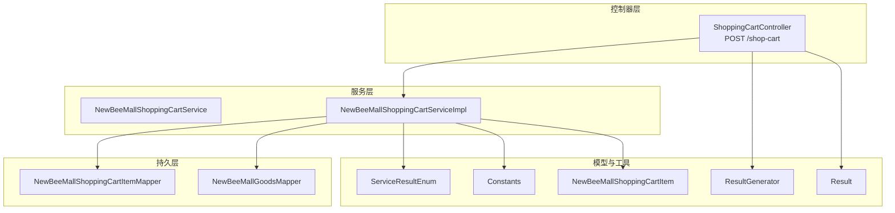
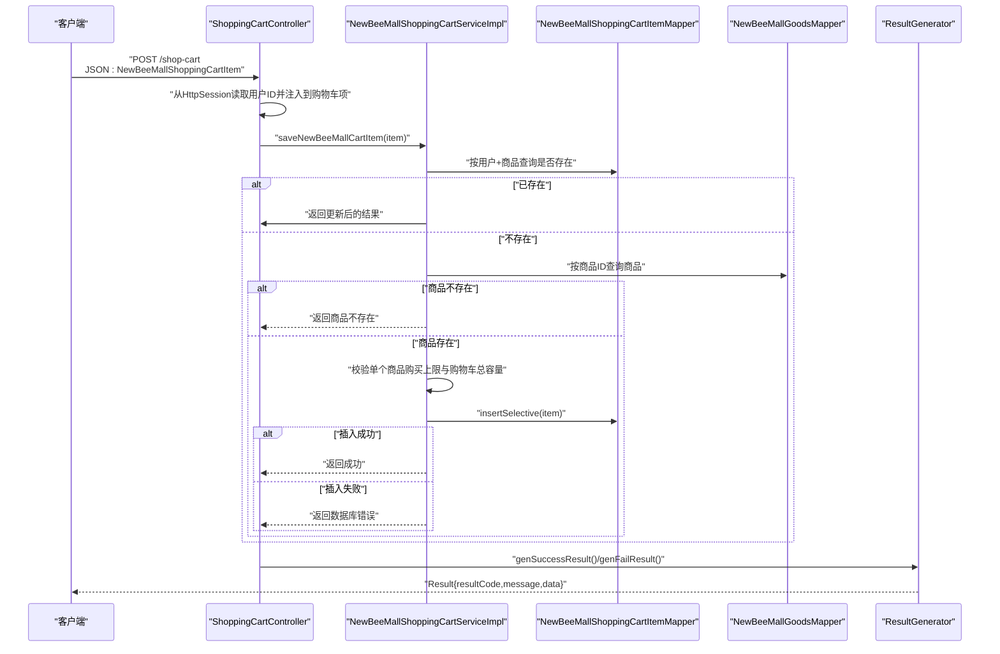
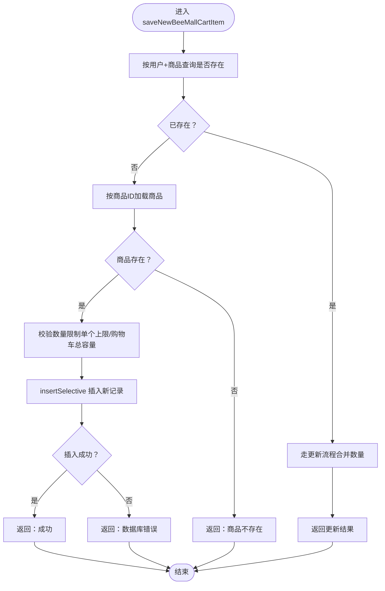
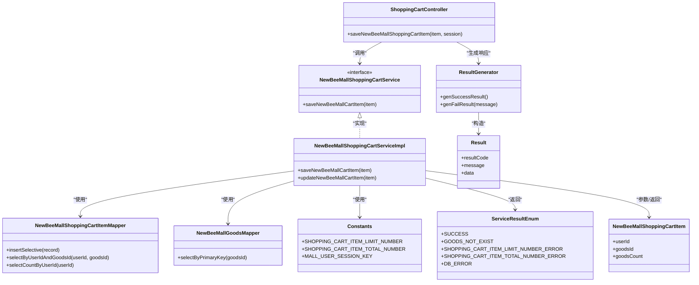

# 添加商品到购物车

<cite>
**本文引用的文件**
- [ShoppingCartController.java](file://src/main/java/ltd/newbee/mall/controller/mall/ShoppingCartController.java)
- [NewBeeMallShoppingCartService.java](file://src/main/java/ltd/newbee/mall/service/NewBeeMallShoppingCartService.java)
- [NewBeeMallShoppingCartServiceImpl.java](file://src/main/java/ltd/newbee/mall/service/impl/NewBeeMallShoppingCartServiceImpl.java)
- [NewBeeMallShoppingCartItem.java](file://src/main/java/ltd/newbee/mall/entity/NewBeeMallShoppingCartItem.java)
- [ServiceResultEnum.java](file://src/main/java/ltd/newbee/mall/common/ServiceResultEnum.java)
- [ResultGenerator.java](file://src/main/java/ltd/newbee/mall/util/ResultGenerator.java)
- [Constants.java](file://src/main/java/ltd/newbee/mall/common/Constants.java)
- [Result.java](file://src/main/java/ltd/newbee/mall/util/Result.java)
- [NewBeeMallShoppingCartItemMapper.java](file://src/main/java/ltd/newbee/mall/dao/NewBeeMallShoppingCartItemMapper.java)
- [NewBeeMallGoodsMapper.java](file://src/main/java/ltd/newbee/mall/dao/NewBeeMallGoodsMapper.java)
- [NewBeeMallOrderServiceImpl.java](file://src/main/java/ltd/newbee/mall/service/impl/NewBeeMallOrderServiceImpl.java)
- [NewBeeMallShoppingCartItemMapper.xml](file://src/main/resources/mapper/NewBeeMallShoppingCartItemMapper.xml)
- [NewBeeMallGoodsMapper.xml](file://src/main/resources/mapper/NewBeeMallGoodsMapper.xml)
</cite>

## 目录
1. [简介](#简介)
2. [项目结构](#项目结构)
3. [核心组件](#核心组件)
4. [架构总览](#架构总览)
5. [详细组件分析](#详细组件分析)
6. [依赖关系分析](#依赖关系分析)
7. [性能考量](#性能考量)
8. [故障排查指南](#故障排查指南)
9. [结论](#结论)
10. [附录：请求与响应示例](#附录请求与响应示例)

## 简介
本文件围绕“POST /shop-cart”接口进行深入解析，覆盖以下要点：
- 接口接收 NewBeeMallShoppingCartItem 实体对象的 JSON 数据
- 如何从 HttpSession 中提取用户 ID 并注入到购物车项中
- Service 层 saveNewBeeMallCartItem 的完整业务流程：重复项合并、数量限制、数据库插入/更新
- ServiceResultEnum 枚举在返回结果中的作用
- ResultGenerator 如何统一生成成功/失败响应
- 请求示例与常见错误场景（商品不存在、库存不足等）

## 项目结构
与“添加商品到购物车”相关的关键模块如下：
- 控制器层：负责接收请求、从 Session 注入用户信息、调用服务层并返回统一响应
- 服务层：实现购物车新增/更新逻辑，包含业务校验与持久化
- 持久层：通过 MyBatis Mapper 访问数据库
- 实体与常量：定义购物车项结构、业务常量（如最大购买数量、购物车容量）
- 统一响应：Result 与 ResultGenerator 提供一致的响应结构

图表来源
- [ShoppingCartController.java](file://src/main/java/ltd/newbee/mall/controller/mall/ShoppingCartController.java#L63-L76)
- [NewBeeMallShoppingCartService.java](file://src/main/java/ltd/newbee/mall/service/NewBeeMallShoppingCartService.java#L18-L24)
- [NewBeeMallShoppingCartServiceImpl.java](file://src/main/java/ltd/newbee/mall/service/impl/NewBeeMallShoppingCartServiceImpl.java#L38-L64)
- [NewBeeMallShoppingCartItemMapper.java](file://src/main/java/ltd/newbee/mall/dao/NewBeeMallShoppingCartItemMapper.java#L17-L36)
- [NewBeeMallGoodsMapper.java](file://src/main/java/ltd/newbee/mall/dao/NewBeeMallGoodsMapper.java#L18-L53)
- [Constants.java](file://src/main/java/ltd/newbee/mall/common/Constants.java#L32-L39)
- [ResultGenerator.java](file://src/main/java/ltd/newbee/mall/util/ResultGenerator.java#L19-L50)
- [Result.java](file://src/main/java/ltd/newbee/mall/util/Result.java#L11-L58)
- [ServiceResultEnum.java](file://src/main/java/ltd/newbee/mall/common/ServiceResultEnum.java#L17-L91)

章节来源
- [ShoppingCartController.java](file://src/main/java/ltd/newbee/mall/controller/mall/ShoppingCartController.java#L63-L76)
- [NewBeeMallShoppingCartServiceImpl.java](file://src/main/java/ltd/newbee/mall/service/impl/NewBeeMallShoppingCartServiceImpl.java#L38-L64)
- [Constants.java](file://src/main/java/ltd/newbee/mall/common/Constants.java#L32-L39)

## 核心组件
- 控制器：接收 JSON，从 Session 获取用户信息，调用服务层，使用 ResultGenerator 生成响应
- 服务接口与实现：封装购物车新增逻辑，含重复项处理、数量限制、数据库操作
- 实体：NewBeeMallShoppingCartItem 描述购物车项字段
- 常量：限制单个商品购买上限与购物车总容量
- 统一响应：Result 与 ResultGenerator 提供标准响应结构

章节来源
- [ShoppingCartController.java](file://src/main/java/ltd/newbee/mall/controller/mall/ShoppingCartController.java#L63-L76)
- [NewBeeMallShoppingCartService.java](file://src/main/java/ltd/newbee/mall/service/NewBeeMallShoppingCartService.java#L18-L24)
- [NewBeeMallShoppingCartServiceImpl.java](file://src/main/java/ltd/newbee/mall/service/impl/NewBeeMallShoppingCartServiceImpl.java#L38-L64)
- [NewBeeMallShoppingCartItem.java](file://src/main/java/ltd/newbee/mall/entity/NewBeeMallShoppingCartItem.java#L13-L82)
- [Constants.java](file://src/main/java/ltd/newbee/mall/common/Constants.java#L32-L39)
- [ResultGenerator.java](file://src/main/java/ltd/newbee/mall/util/ResultGenerator.java#L19-L50)
- [Result.java](file://src/main/java/ltd/newbee/mall/util/Result.java#L11-L58)

## 架构总览
POST /shop-cart 的端到端调用序列如下：

图表来源
- [ShoppingCartController.java](file://src/main/java/ltd/newbee/mall/controller/mall/ShoppingCartController.java#L63-L76)
- [NewBeeMallShoppingCartServiceImpl.java](file://src/main/java/ltd/newbee/mall/service/impl/NewBeeMallShoppingCartServiceImpl.java#L38-L64)
- [NewBeeMallShoppingCartItemMapper.java](file://src/main/java/ltd/newbee/mall/dao/NewBeeMallShoppingCartItemMapper.java#L17-L36)
- [NewBeeMallGoodsMapper.java](file://src/main/java/ltd/newbee/mall/dao/NewBeeMallGoodsMapper.java#L18-L33)
- [ResultGenerator.java](file://src/main/java/ltd/newbee/mall/util/ResultGenerator.java#L19-L50)

## 详细组件分析

### 控制器：POST /shop-cart
- 从 Session 中读取用户信息并设置到请求体的购物车项对象
- 调用服务层保存购物车项
- 使用 ResultGenerator 将服务层返回的字符串结果映射为统一响应

关键路径
- [控制器方法](file://src/main/java/ltd/newbee/mall/controller/mall/ShoppingCartController.java#L63-L76)
- [统一响应生成器](file://src/main/java/ltd/newbee/mall/util/ResultGenerator.java#L19-L50)

章节来源
- [ShoppingCartController.java](file://src/main/java/ltd/newbee/mall/controller/mall/ShoppingCartController.java#L63-L76)
- [ResultGenerator.java](file://src/main/java/ltd/newbee/mall/util/ResultGenerator.java#L19-L50)

### 服务层：saveNewBeeMallCartItem 业务逻辑
- 重复项处理：按用户ID与商品ID查询，若存在则走更新流程
- 商品存在性校验：通过商品ID查询商品，不存在则返回“商品不存在”
- 数量限制校验：
  - 单个商品购买上限：超过常量 SHOPPING_CART_ITEM_LIMIT_NUMBER
  - 购物车总容量：超过常量 SHOPPING_CART_ITEM_TOTAL_NUMBER
- 数据库操作：不存在时执行 insertSelective；存在时走 updateNewBeeMallCartItem

关键路径
- [服务接口定义](file://src/main/java/ltd/newbee/mall/service/NewBeeMallShoppingCartService.java#L18-L24)
- [服务实现入口](file://src/main/java/ltd/newbee/mall/service/impl/NewBeeMallShoppingCartServiceImpl.java#L38-L64)
- [常量定义](file://src/main/java/ltd/newbee/mall/common/Constants.java#L32-L39)
- [购物车 Mapper](file://src/main/java/ltd/newbee/mall/dao/NewBeeMallShoppingCartItemMapper.java#L17-L36)
- [商品 Mapper](file://src/main/java/ltd/newbee/mall/dao/NewBeeMallGoodsMapper.java#L18-L33)

图表来源
- [NewBeeMallShoppingCartServiceImpl.java](file://src/main/java/ltd/newbee/mall/service/impl/NewBeeMallShoppingCartServiceImpl.java#L38-L64)
- [Constants.java](file://src/main/java/ltd/newbee/mall/common/Constants.java#L32-L39)
- [NewBeeMallShoppingCartItemMapper.java](file://src/main/java/ltd/newbee/mall/dao/NewBeeMallShoppingCartItemMapper.java#L17-L36)
- [NewBeeMallGoodsMapper.java](file://src/main/java/ltd/newbee/mall/dao/NewBeeMallGoodsMapper.java#L18-L33)

章节来源
- [NewBeeMallShoppingCartServiceImpl.java](file://src/main/java/ltd/newbee/mall/service/impl/NewBeeMallShoppingCartServiceImpl.java#L38-L64)
- [Constants.java](file://src/main/java/ltd/newbee/mall/common/Constants.java#L32-L39)

### 实体模型：NewBeeMallShoppingCartItem
- 字段包含购物车项主键、用户ID、商品ID、数量、软删标记、创建/更新时间
- 用于控制器接收 JSON 并传递给服务层

关键路径
- [实体定义](file://src/main/java/ltd/newbee/mall/entity/NewBeeMallShoppingCartItem.java#L13-L82)

章节来源
- [NewBeeMallShoppingCartItem.java](file://src/main/java/ltd/newbee/mall/entity/NewBeeMallShoppingCartItem.java#L13-L82)

### 返回结果与统一响应
- 服务层返回字符串标识（来自 ServiceResultEnum），控制器据此生成成功或失败响应
- ResultGenerator 提供成功/失败两种工厂方法，统一返回 Result 结构

关键路径
- [返回枚举定义](file://src/main/java/ltd/newbee/mall/common/ServiceResultEnum.java#L17-L91)
- [统一响应生成器](file://src/main/java/ltd/newbee/mall/util/ResultGenerator.java#L19-L50)
- [响应体结构](file://src/main/java/ltd/newbee/mall/util/Result.java#L11-L58)

章节来源
- [ServiceResultEnum.java](file://src/main/java/ltd/newbee/mall/common/ServiceResultEnum.java#L17-L91)
- [ResultGenerator.java](file://src/main/java/ltd/newbee/mall/util/ResultGenerator.java#L19-L50)
- [Result.java](file://src/main/java/ltd/newbee/mall/util/Result.java#L11-L58)

### 数据持久化：插入与更新
- 新增：insertSelective 将非空字段写入表
- 更新：updateNewBeeMallCartItem 在服务层实现，涉及权限校验与数量变更

关键路径
- [购物车 Mapper XML 插入语句](file://src/main/resources/mapper/NewBeeMallShoppingCartItemMapper.xml#L50-L85)
- [商品 Mapper XML 查询与库存更新](file://src/main/resources/mapper/NewBeeMallGoodsMapper.xml#L33-L60)
- [购物车 Mapper 接口](file://src/main/java/ltd/newbee/mall/dao/NewBeeMallShoppingCartItemMapper.java#L17-L36)
- [商品 Mapper 接口](file://src/main/java/ltd/newbee/mall/dao/NewBeeMallGoodsMapper.java#L18-L53)

章节来源
- [NewBeeMallShoppingCartItemMapper.xml](file://src/main/resources/mapper/NewBeeMallShoppingCartItemMapper.xml#L50-L85)
- [NewBeeMallGoodsMapper.xml](file://src/main/resources/mapper/NewBeeMallGoodsMapper.xml#L33-L60)
- [NewBeeMallShoppingCartItemMapper.java](file://src/main/java/ltd/newbee/mall/dao/NewBeeMallShoppingCartItemMapper.java#L17-L36)
- [NewBeeMallGoodsMapper.java](file://src/main/java/ltd/newbee/mall/dao/NewBeeMallGoodsMapper.java#L18-L53)

## 依赖关系分析
- 控制器依赖服务层接口与统一响应生成器
- 服务层依赖购物车与商品 Mapper、常量、实体
- Mapper 依赖 MyBatis XML 映射文件

图表来源
- [ShoppingCartController.java](file://src/main/java/ltd/newbee/mall/controller/mall/ShoppingCartController.java#L63-L76)
- [NewBeeMallShoppingCartService.java](file://src/main/java/ltd/newbee/mall/service/NewBeeMallShoppingCartService.java#L18-L24)
- [NewBeeMallShoppingCartServiceImpl.java](file://src/main/java/ltd/newbee/mall/service/impl/NewBeeMallShoppingCartServiceImpl.java#L38-L64)
- [NewBeeMallShoppingCartItemMapper.java](file://src/main/java/ltd/newbee/mall/dao/NewBeeMallShoppingCartItemMapper.java#L17-L36)
- [NewBeeMallGoodsMapper.java](file://src/main/java/ltd/newbee/mall/dao/NewBeeMallGoodsMapper.java#L18-L33)
- [NewBeeMallShoppingCartItem.java](file://src/main/java/ltd/newbee/mall/entity/NewBeeMallShoppingCartItem.java#L13-L82)
- [ResultGenerator.java](file://src/main/java/ltd/newbee/mall/util/ResultGenerator.java#L19-L50)
- [Result.java](file://src/main/java/ltd/newbee/mall/util/Result.java#L11-L58)
- [ServiceResultEnum.java](file://src/main/java/ltd/newbee/mall/common/ServiceResultEnum.java#L17-L91)
- [Constants.java](file://src/main/java/ltd/newbee/mall/common/Constants.java#L32-L39)

章节来源
- [ShoppingCartController.java](file://src/main/java/ltd/newbee/mall/controller/mall/ShoppingCartController.java#L63-L76)
- [NewBeeMallShoppingCartServiceImpl.java](file://src/main/java/ltd/newbee/mall/service/impl/NewBeeMallShoppingCartServiceImpl.java#L38-L64)

## 性能考量
- 单次新增仅一次数据库写入（insertSelective），避免不必要的更新
- 重复项合并减少购物车项数量，降低后续查询与渲染成本
- 数量限制在内存中快速判定，避免无效数据库访问
- 建议：购物车列表查询时可结合分页与缓存，进一步优化前端渲染性能

## 故障排查指南
- 商品不存在：服务层返回“商品不存在”，控制器映射为失败响应
- 超出单个商品购买上限：返回“超出单个商品的最大购买数量”
- 超出购物车最大容量：返回“超出购物车最大容量”
- 数据库错误：返回“database error”
- 权限问题：若更新/删除时用户ID不匹配，返回“无权限”

定位参考
- [服务层返回枚举](file://src/main/java/ltd/newbee/mall/common/ServiceResultEnum.java#L17-L91)
- [控制器响应生成](file://src/main/java/ltd/newbee/mall/util/ResultGenerator.java#L19-L50)
- [服务层业务分支](file://src/main/java/ltd/newbee/mall/service/impl/NewBeeMallShoppingCartServiceImpl.java#L38-L64)

章节来源
- [ServiceResultEnum.java](file://src/main/java/ltd/newbee/mall/common/ServiceResultEnum.java#L17-L91)
- [ResultGenerator.java](file://src/main/java/ltd/newbee/mall/util/ResultGenerator.java#L19-L50)
- [NewBeeMallShoppingCartServiceImpl.java](file://src/main/java/ltd/newbee/mall/service/impl/NewBeeMallShoppingCartServiceImpl.java#L38-L64)

## 结论
POST /shop-cart 接口通过控制器注入用户信息、服务层执行业务校验与持久化、统一响应生成器输出标准化结果，形成清晰的职责边界与可维护性。服务层对重复项合并、数量限制与数据库操作的处理，确保了购物车数据的一致性与用户体验。

## 附录：请求与响应示例

- 请求方式与路径
  - 方法：POST
  - 路径：/shop-cart
  - 内容类型：application/json

- 请求体 JSON 字段（对应 NewBeeMallShoppingCartItem）
  - 用户ID：由控制器从 Session 注入，无需显式传入
  - 商品ID：goodsId
  - 数量：goodsCount
  - 其他字段（如 cartItemId、isDeleted、createTime、updateTime）可省略，由服务层处理

- 成功响应
  - 结果码：200
  - 消息：SUCCESS
  - 数据：null 或空对象

- 失败响应
  - 结果码：500
  - 消息：根据 ServiceResultEnum 的具体错误文案
  - 数据：null

- 常见错误场景
  - 商品不存在：消息包含“商品不存在”
  - 超出单个商品购买上限：消息包含“超出单个商品的最大购买数量”
  - 超出购物车最大容量：消息包含“超出购物车最大容量”
  - 数据库错误：消息包含“database error”
  - 权限问题：消息包含“无权限”

章节来源
- [ShoppingCartController.java](file://src/main/java/ltd/newbee/mall/controller/mall/ShoppingCartController.java#L63-L76)
- [NewBeeMallShoppingCartServiceImpl.java](file://src/main/java/ltd/newbee/mall/service/impl/NewBeeMallShoppingCartServiceImpl.java#L38-L64)
- [ServiceResultEnum.java](file://src/main/java/ltd/newbee/mall/common/ServiceResultEnum.java#L17-L91)
- [ResultGenerator.java](file://src/main/java/ltd/newbee/mall/util/ResultGenerator.java#L19-L50)