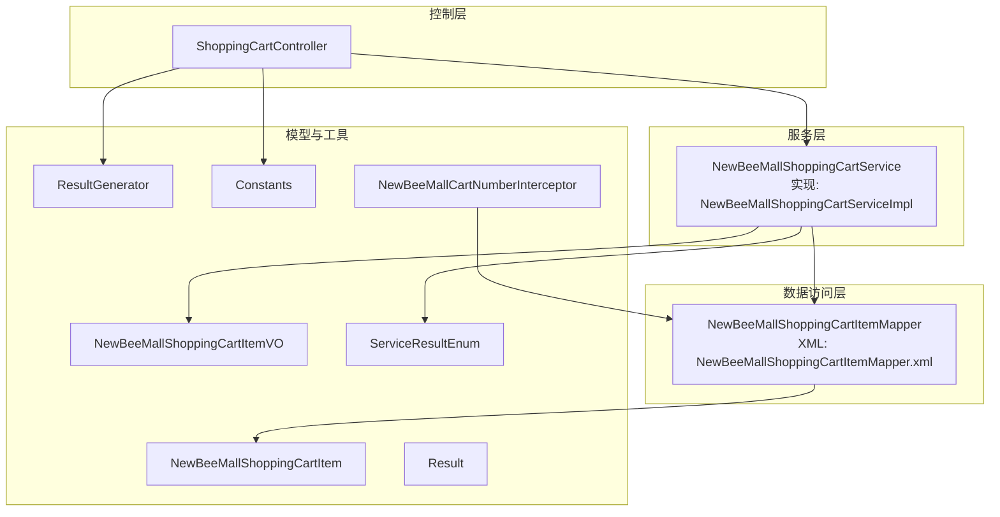
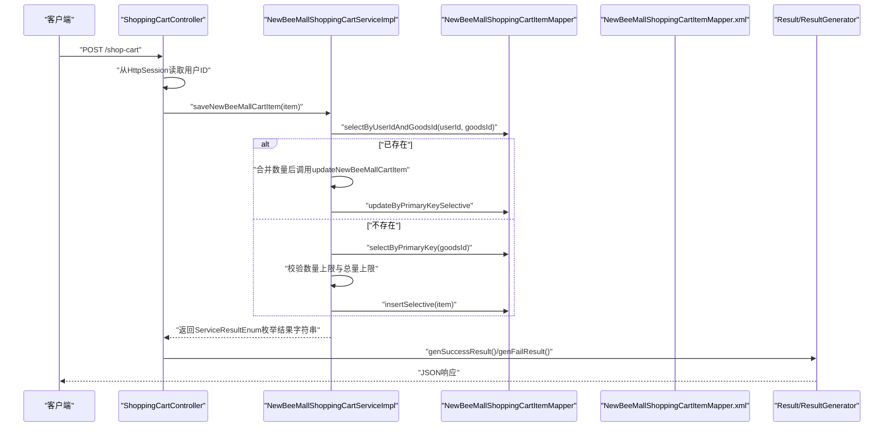
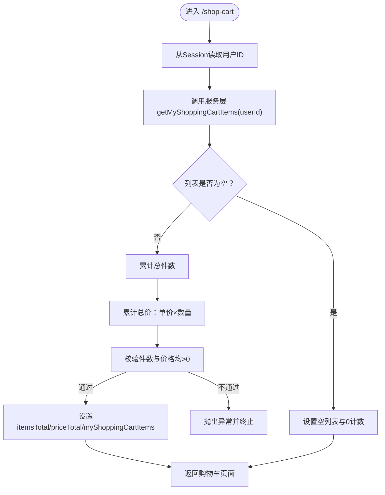
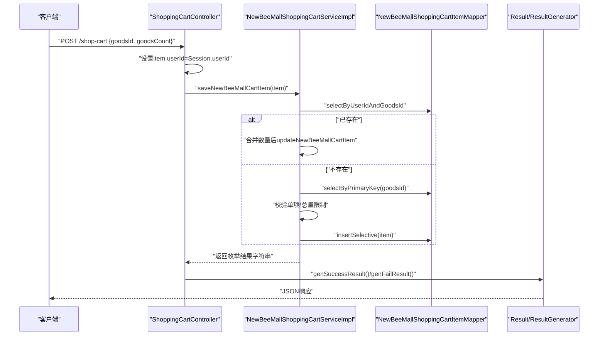
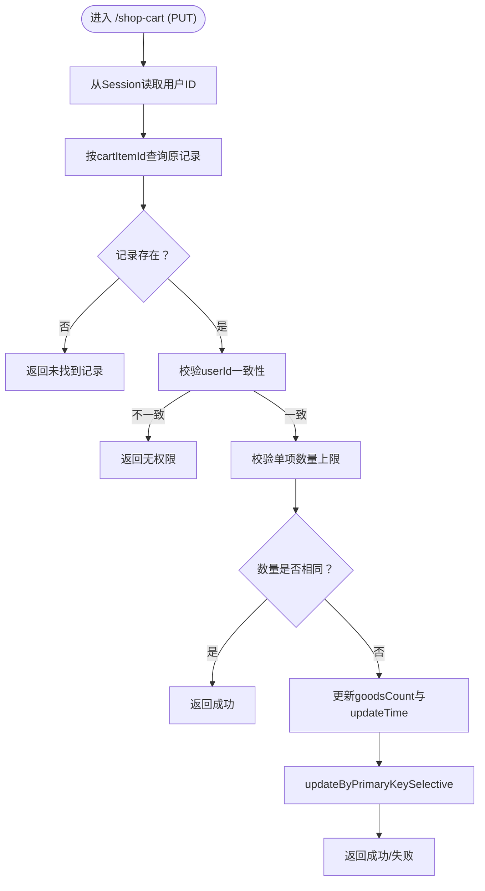
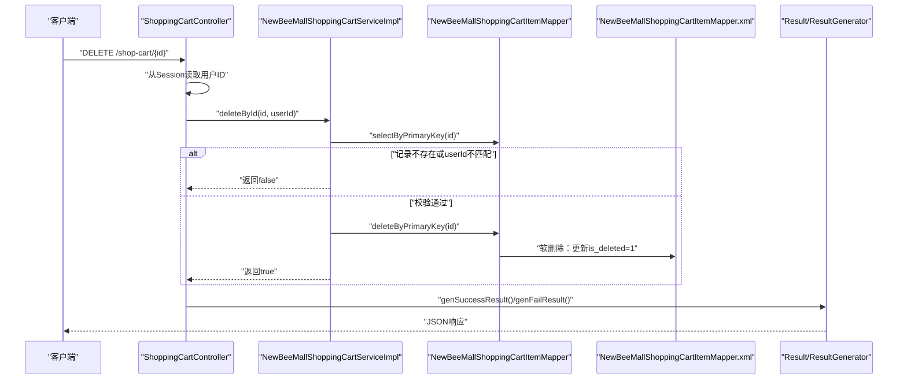
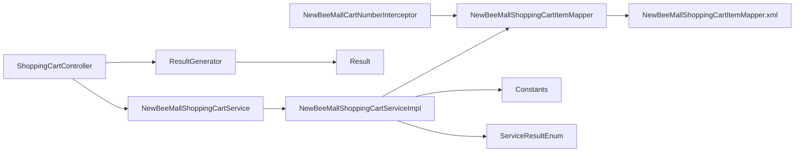

# 购物车相关

<cite>
**本文引用的文件**
- [ShoppingCartController.java](file://src/main/java/ltd/newbee/mall/controller/mall/ShoppingCartController.java)
- [NewBeeMallShoppingCartService.java](file://src/main/java/ltd/newbee/mall/service/NewBeeMallShoppingCartService.java)
- [NewBeeMallShoppingCartServiceImpl.java](file://src/main/java/ltd/newbee/mall/service/impl/NewBeeMallShoppingCartServiceImpl.java)
- [NewBeeMallShoppingCartItem.java](file://src/main/java/ltd/newbee/mall/entity/NewBeeMallShoppingCartItem.java)
- [NewBeeMallShoppingCartItemVO.java](file://src/main/java/ltd/newbee/mall/controller/vo/NewBeeMallShoppingCartItemVO.java)
- [NewBeeMallShoppingCartItemMapper.java](file://src/main/java/ltd/newbee/mall/dao/NewBeeMallShoppingCartItemMapper.java)
- [NewBeeMallShoppingCartItemMapper.xml](file://src/main/resources/mapper/NewBeeMallShoppingCartItemMapper.xml)
- [Result.java](file://src/main/java/ltd/newbee/mall/util/Result.java)
- [ResultGenerator.java](file://src/main/java/ltd/newbee/mall/util/ResultGenerator.java)
- [ServiceResultEnum.java](file://src/main/java/ltd/newbee/mall/common/ServiceResultEnum.java)
- [Constants.java](file://src/main/java/ltd/newbee/mall/common/Constants.java)
- [NewBeeMallCartNumberInterceptor.java](file://src/main/java/ltd/newbee/mall/interceptor/NewBeeMallCartNumberInterceptor.java)
- [API.md](file://docs/API.md)
</cite>

## 目录
1. [简介](#简介)
2. [项目结构](#项目结构)
3. [核心组件](#核心组件)
4. [架构总览](#架构总览)
5. [详细组件分析](#详细组件分析)
6. [依赖关系分析](#依赖关系分析)
7. [性能考量](#性能考量)
8. [故障排查指南](#故障排查指南)
9. [结论](#结论)
10. [附录](#附录)

## 简介
本文件面向开发者与测试人员，系统化梳理 newbee-mall 中“购物车”相关API，覆盖以下能力：
- 查看购物车：GET /shop-cart
- 添加商品：POST /shop-cart
- 更新数量：PUT /shop-cart
- 删除商品：DELETE /shop-cart/{newBeeMallShoppingCartItemId}
并深入解析各接口的控制流、权限校验、数据模型、服务层策略与返回封装机制。同时说明 ResultGenerator 工具类与 ServiceResultEnum 枚举在业务逻辑中的作用。

## 项目结构
购物车模块采用经典的 MVC 分层：
- 控制层：ShoppingCartController 提供 REST 风格接口，负责参数绑定、会话读取、调用服务层并返回 Result 封装。
- 服务层：NewBeeMallShoppingCartService 定义购物车业务契约；NewBeeMallShoppingCartServiceImpl 实现具体规则（数量限制、权限校验、去重合并、VO 转换等）。
- 数据访问层：NewBeeMallShoppingCartItemMapper 与 MyBatis XML 映射文件提供 CRUD 与聚合查询。
- 数据模型：NewBeeMallShoppingCartItem 实体；NewBeeMallShoppingCartItemVO 视图对象。
- 工具与常量：Result/ResultGenerator 统一响应；ServiceResultEnum 统一枚举错误码；Constants 定义购物车数量上限等常量；NewBeeMallCartNumberInterceptor 在拦截器中维护会话中的购物车数量。

图表来源
- [ShoppingCartController.java](file://src/main/java/ltd/newbee/mall/controller/mall/ShoppingCartController.java#L36-L105)
- [NewBeeMallShoppingCartService.java](file://src/main/java/ltd/newbee/mall/service/NewBeeMallShoppingCartService.java#L16-L59)
- [NewBeeMallShoppingCartServiceImpl.java](file://src/main/java/ltd/newbee/mall/service/impl/NewBeeMallShoppingCartServiceImpl.java#L37-L141)
- [NewBeeMallShoppingCartItemMapper.java](file://src/main/java/ltd/newbee/mall/dao/NewBeeMallShoppingCartItemMapper.java#L16-L36)
- [NewBeeMallShoppingCartItemMapper.xml](file://src/main/resources/mapper/NewBeeMallShoppingCartItemMapper.xml#L1-L144)
- [NewBeeMallShoppingCartItem.java](file://src/main/java/ltd/newbee/mall/entity/NewBeeMallShoppingCartItem.java#L1-L100)
- [NewBeeMallShoppingCartItemVO.java](file://src/main/java/ltd/newbee/mall/controller/vo/NewBeeMallShoppingCartItemVO.java#L1-L78)
- [Result.java](file://src/main/java/ltd/newbee/mall/util/Result.java#L1-L58)
- [ResultGenerator.java](file://src/main/java/ltd/newbee/mall/util/ResultGenerator.java#L1-L59)
- [ServiceResultEnum.java](file://src/main/java/ltd/newbee/mall/common/ServiceResultEnum.java#L1-L91)
- [Constants.java](file://src/main/java/ltd/newbee/mall/common/Constants.java#L18-L48)
- [NewBeeMallCartNumberInterceptor.java](file://src/main/java/ltd/newbee/mall/interceptor/NewBeeMallCartNumberInterceptor.java#L30-L58)

章节来源
- [ShoppingCartController.java](file://src/main/java/ltd/newbee/mall/controller/mall/ShoppingCartController.java#L36-L105)
- [NewBeeMallShoppingCartService.java](file://src/main/java/ltd/newbee/mall/service/NewBeeMallShoppingCartService.java#L16-L59)
- [NewBeeMallShoppingCartServiceImpl.java](file://src/main/java/ltd/newbee/mall/service/impl/NewBeeMallShoppingCartServiceImpl.java#L37-L141)
- [NewBeeMallShoppingCartItemMapper.java](file://src/main/java/ltd/newbee/mall/dao/NewBeeMallShoppingCartItemMapper.java#L16-L36)
- [NewBeeMallShoppingCartItemMapper.xml](file://src/main/resources/mapper/NewBeeMallShoppingCartItemMapper.xml#L1-L144)
- [NewBeeMallShoppingCartItem.java](file://src/main/java/ltd/newbee/mall/entity/NewBeeMallShoppingCartItem.java#L1-L100)
- [NewBeeMallShoppingCartItemVO.java](file://src/main/java/ltd/newbee/mall/controller/vo/NewBeeMallShoppingCartItemVO.java#L1-L78)
- [Result.java](file://src/main/java/ltd/newbee/mall/util/Result.java#L1-L58)
- [ResultGenerator.java](file://src/main/java/ltd/newbee/mall/util/ResultGenerator.java#L1-L59)
- [ServiceResultEnum.java](file://src/main/java/ltd/newbee/mall/common/ServiceResultEnum.java#L1-L91)
- [Constants.java](file://src/main/java/ltd/newbee/mall/common/Constants.java#L18-L48)
- [NewBeeMallCartNumberInterceptor.java](file://src/main/java/ltd/newbee/mall/interceptor/NewBeeMallCartNumberInterceptor.java#L30-L58)

## 核心组件
- 控制器接口
  - GET /shop-cart：加载当前用户购物车列表，计算总件数与总价，渲染购物车页面。
  - POST /shop-cart：接收 NewBeeMallShoppingCartItem JSON，写入或合并购物车项，返回 Result。
  - PUT /shop-cart：接收 NewBeeMallShoppingCartItem JSON，更新指定购物车项数量，返回 Result。
  - DELETE /shop-cart/{newBeeMallShoppingCartItemId}：按路径参数删除购物车项，进行用户ID权限校验，返回 Result。
  - GET /shop-cart/settle：进入结算页，计算总价并渲染结算页面。
- 服务层契约与实现
  - 保存/更新/删除/查询：实现数量限制、权限校验、重复项合并、VO 转换等。
- 数据模型
  - 实体 NewBeeMallShoppingCartItem：持久化字段（cartItemId、userId、goodsId、goodsCount、isDeleted、时间戳）。
  - 视图 NewBeeMallShoppingCartItemVO：前端展示所需字段（cartItemId、goodsId、goodsCount、goodsName、goodsCoverImg、sellingPrice）。
- 工具与常量
  - Result/ResultGenerator：统一封装响应码、消息与数据。
  - ServiceResultEnum：统一业务错误码与文案。
  - Constants：定义购物车总量与单项上限、会话键等。
  - NewBeeMallCartNumberInterceptor：在拦截器中刷新会话中的购物车数量。

章节来源
- [ShoppingCartController.java](file://src/main/java/ltd/newbee/mall/controller/mall/ShoppingCartController.java#L36-L128)
- [NewBeeMallShoppingCartService.java](file://src/main/java/ltd/newbee/mall/service/NewBeeMallShoppingCartService.java#L16-L59)
- [NewBeeMallShoppingCartServiceImpl.java](file://src/main/java/ltd/newbee/mall/service/impl/NewBeeMallShoppingCartServiceImpl.java#L37-L141)
- [NewBeeMallShoppingCartItem.java](file://src/main/java/ltd/newbee/mall/entity/NewBeeMallShoppingCartItem.java#L1-L100)
- [NewBeeMallShoppingCartItemVO.java](file://src/main/java/ltd/newbee/mall/controller/vo/NewBeeMallShoppingCartItemVO.java#L1-L78)
- [ResultGenerator.java](file://src/main/java/ltd/newbee/mall/util/ResultGenerator.java#L1-L59)
- [ServiceResultEnum.java](file://src/main/java/ltd/newbee/mall/common/ServiceResultEnum.java#L1-L91)
- [Constants.java](file://src/main/java/ltd/newbee/mall/common/Constants.java#L18-L48)
- [NewBeeMallCartNumberInterceptor.java](file://src/main/java/ltd/newbee/mall/interceptor/NewBeeMallCartNumberInterceptor.java#L30-L58)

## 架构总览
下面以序列图展示关键流程：从客户端请求到服务层处理再到数据访问层与响应封装。

图表来源
- [ShoppingCartController.java](file://src/main/java/ltd/newbee/mall/controller/mall/ShoppingCartController.java#L63-L76)
- [NewBeeMallShoppingCartServiceImpl.java](file://src/main/java/ltd/newbee/mall/service/impl/NewBeeMallShoppingCartServiceImpl.java#L37-L64)
- [NewBeeMallShoppingCartItemMapper.java](file://src/main/java/ltd/newbee/mall/dao/NewBeeMallShoppingCartItemMapper.java#L23-L31)
- [NewBeeMallShoppingCartItemMapper.xml](file://src/main/resources/mapper/NewBeeMallShoppingCartItemMapper.xml#L22-L28)
- [ResultGenerator.java](file://src/main/java/ltd/newbee/mall/util/ResultGenerator.java#L19-L50)
- [ServiceResultEnum.java](file://src/main/java/ltd/newbee/mall/common/ServiceResultEnum.java#L17-L91)

## 详细组件分析

### GET /shop-cart：查看购物车
- 会话读取：从 HttpSession 中取出用户标识（Constants.MALL_USER_SESSION_KEY）。
- 服务调用：调用服务层 getMyShoppingCartItems(userId) 获取购物车项列表。
- 数据计算：遍历 VO 列表计算总件数与总价（单价×数量），并进行基础校验（非空与正数）。
- 页面渲染：将 itemsTotal、priceTotal、myShoppingCartItems 注入请求域，返回购物车模板。

图表来源
- [ShoppingCartController.java](file://src/main/java/ltd/newbee/mall/controller/mall/ShoppingCartController.java#L36-L61)
- [NewBeeMallShoppingCartServiceImpl.java](file://src/main/java/ltd/newbee/mall/service/impl/NewBeeMallShoppingCartServiceImpl.java#L111-L141)
- [Constants.java](file://src/main/java/ltd/newbee/mall/common/Constants.java#L32-L39)

章节来源
- [ShoppingCartController.java](file://src/main/java/ltd/newbee/mall/controller/mall/ShoppingCartController.java#L36-L61)
- [NewBeeMallShoppingCartServiceImpl.java](file://src/main/java/ltd/newbee/mall/service/impl/NewBeeMallShoppingCartServiceImpl.java#L111-L141)
- [Constants.java](file://src/main/java/ltd/newbee/mall/common/Constants.java#L32-L39)

### POST /shop-cart：添加商品
- 请求体：JSON 对象 NewBeeMallShoppingCartItem（goodsId、goodsCount 等）。
- 会话注入：从 Session 获取用户ID并设置到 item.userId。
- 服务处理：
  - 若同一用户已存在相同商品，则合并数量并走更新流程。
  - 否则校验商品是否存在、单项数量与购物车总量限制，再插入。
- 结果封装：依据 ServiceResultEnum 的结果字符串选择成功或失败响应。

图表来源
- [ShoppingCartController.java](file://src/main/java/ltd/newbee/mall/controller/mall/ShoppingCartController.java#L63-L76)
- [NewBeeMallShoppingCartServiceImpl.java](file://src/main/java/ltd/newbee/mall/service/impl/NewBeeMallShoppingCartServiceImpl.java#L37-L64)
- [NewBeeMallShoppingCartItemMapper.java](file://src/main/java/ltd/newbee/mall/dao/NewBeeMallShoppingCartItemMapper.java#L23-L31)
- [ResultGenerator.java](file://src/main/java/ltd/newbee/mall/util/ResultGenerator.java#L19-L50)
- [ServiceResultEnum.java](file://src/main/java/ltd/newbee/mall/common/ServiceResultEnum.java#L17-L91)

章节来源
- [ShoppingCartController.java](file://src/main/java/ltd/newbee/mall/controller/mall/ShoppingCartController.java#L63-L76)
- [NewBeeMallShoppingCartServiceImpl.java](file://src/main/java/ltd/newbee/mall/service/impl/NewBeeMallShoppingCartServiceImpl.java#L37-L64)
- [NewBeeMallShoppingCartItemMapper.java](file://src/main/java/ltd/newbee/mall/dao/NewBeeMallShoppingCartItemMapper.java#L23-L31)
- [ResultGenerator.java](file://src/main/java/ltd/newbee/mall/util/ResultGenerator.java#L19-L50)
- [ServiceResultEnum.java](file://src/main/java/ltd/newbee/mall/common/ServiceResultEnum.java#L17-L91)

### PUT /shop-cart：更新数量
- 请求体：JSON 对象 NewBeeMallShoppingCartItem（cartItemId、goodsCount）。
- 会话注入：从 Session 获取用户ID并设置到 item.userId。
- 权限校验：读取原记录，校验 userId 是否一致，否则返回无权限。
- 数量校验：单项数量不超过上限；若数量未变化直接返回成功。
- 更新持久化：更新 goodsCount 与 updateTime，返回成功或失败。

图表来源
- [ShoppingCartController.java](file://src/main/java/ltd/newbee/mall/controller/mall/ShoppingCartController.java#L78-L91)
- [NewBeeMallShoppingCartServiceImpl.java](file://src/main/java/ltd/newbee/mall/service/impl/NewBeeMallShoppingCartServiceImpl.java#L66-L91)
- [NewBeeMallShoppingCartItemMapper.java](file://src/main/java/ltd/newbee/mall/dao/NewBeeMallShoppingCartItemMapper.java#L23-L31)
- [ServiceResultEnum.java](file://src/main/java/ltd/newbee/mall/common/ServiceResultEnum.java#L17-L91)

章节来源
- [ShoppingCartController.java](file://src/main/java/ltd/newbee/mall/controller/mall/ShoppingCartController.java#L78-L91)
- [NewBeeMallShoppingCartServiceImpl.java](file://src/main/java/ltd/newbee/mall/service/impl/NewBeeMallShoppingCartServiceImpl.java#L66-L91)
- [NewBeeMallShoppingCartItemMapper.java](file://src/main/java/ltd/newbee/mall/dao/NewBeeMallShoppingCartItemMapper.java#L23-L31)
- [ServiceResultEnum.java](file://src/main/java/ltd/newbee/mall/common/ServiceResultEnum.java#L17-L91)

### DELETE /shop-cart/{newBeeMallShoppingCartItemId}：删除商品
- 路径参数：newBeeMallShoppingCartItemId。
- 会话注入：从 Session 获取用户ID。
- 权限校验：读取目标记录，校验 userId 是否一致，否则返回失败。
- 删除持久化：物理删除或软删除（XML 中为软删除），返回布尔结果并封装为 Result。

图表来源
- [ShoppingCartController.java](file://src/main/java/ltd/newbee/mall/controller/mall/ShoppingCartController.java#L93-L105)
- [NewBeeMallShoppingCartServiceImpl.java](file://src/main/java/ltd/newbee/mall/service/impl/NewBeeMallShoppingCartServiceImpl.java#L98-L109)
- [NewBeeMallShoppingCartItemMapper.xml](file://src/main/resources/mapper/NewBeeMallShoppingCartItemMapper.xml#L42-L45)
- [ResultGenerator.java](file://src/main/java/ltd/newbee/mall/util/ResultGenerator.java#L19-L50)

章节来源
- [ShoppingCartController.java](file://src/main/java/ltd/newbee/mall/controller/mall/ShoppingCartController.java#L93-L105)
- [NewBeeMallShoppingCartServiceImpl.java](file://src/main/java/ltd/newbee/mall/service/impl/NewBeeMallShoppingCartServiceImpl.java#L98-L109)
- [NewBeeMallShoppingCartItemMapper.xml](file://src/main/resources/mapper/NewBeeMallShoppingCartItemMapper.xml#L42-L45)
- [ResultGenerator.java](file://src/main/java/ltd/newbee/mall/util/ResultGenerator.java#L19-L50)

### 结算页 GET /shop-cart/settle
- 会话读取：从 Session 获取用户ID。
- 服务调用：获取购物车列表并计算总价。
- 页面渲染：将 priceTotal 与 myShoppingCartItems 注入请求域，返回结算页面模板。

章节来源
- [ShoppingCartController.java](file://src/main/java/ltd/newbee/mall/controller/mall/ShoppingCartController.java#L107-L128)
- [NewBeeMallShoppingCartServiceImpl.java](file://src/main/java/ltd/newbee/mall/service/impl/NewBeeMallShoppingCartServiceImpl.java#L111-L141)

## 依赖关系分析
- 控制器依赖服务接口与工具类（ResultGenerator），并通过 Session 读取用户上下文。
- 服务实现依赖 Mapper 与常量、枚举；Mapper 通过 XML 完成 SQL 映射。
- 拦截器在预处理阶段刷新会话中的购物车数量，确保前端显示一致。

图表来源
- [ShoppingCartController.java](file://src/main/java/ltd/newbee/mall/controller/mall/ShoppingCartController.java#L36-L105)
- [NewBeeMallShoppingCartService.java](file://src/main/java/ltd/newbee/mall/service/NewBeeMallShoppingCartService.java#L16-L59)
- [NewBeeMallShoppingCartServiceImpl.java](file://src/main/java/ltd/newbee/mall/service/impl/NewBeeMallShoppingCartServiceImpl.java#L37-L141)
- [NewBeeMallShoppingCartItemMapper.java](file://src/main/java/ltd/newbee/mall/dao/NewBeeMallShoppingCartItemMapper.java#L16-L36)
- [NewBeeMallShoppingCartItemMapper.xml](file://src/main/resources/mapper/NewBeeMallShoppingCartItemMapper.xml#L1-L144)
- [Constants.java](file://src/main/java/ltd/newbee/mall/common/Constants.java#L18-L48)
- [ServiceResultEnum.java](file://src/main/java/ltd/newbee/mall/common/ServiceResultEnum.java#L17-L91)
- [ResultGenerator.java](file://src/main/java/ltd/newbee/mall/util/ResultGenerator.java#L1-L59)
- [Result.java](file://src/main/java/ltd/newbee/mall/util/Result.java#L1-L58)
- [NewBeeMallCartNumberInterceptor.java](file://src/main/java/ltd/newbee/mall/interceptor/NewBeeMallCartNumberInterceptor.java#L30-L58)

章节来源
- [ShoppingCartController.java](file://src/main/java/ltd/newbee/mall/controller/mall/ShoppingCartController.java#L36-L105)
- [NewBeeMallShoppingCartServiceImpl.java](file://src/main/java/ltd/newbee/mall/service/impl/NewBeeMallShoppingCartServiceImpl.java#L37-L141)
- [NewBeeMallShoppingCartItemMapper.xml](file://src/main/resources/mapper/NewBeeMallShoppingCartItemMapper.xml#L1-L144)
- [NewBeeMallCartNumberInterceptor.java](file://src/main/java/ltd/newbee/mall/interceptor/NewBeeMallCartNumberInterceptor.java#L30-L58)

## 性能考量
- 批量查询优化：服务层在获取购物车列表时，先一次性查询购物车项，再批量查询商品信息并建立映射，避免 N+1 查询。
- 数量限制：通过 Constants 中的上限常量在服务层快速拒绝非法请求，减少无效数据库交互。
- 软删除：删除接口采用软删除策略，降低全表扫描与索引维护成本。
- 拦截器刷新：在拦截器中统一刷新会话中的购物车数量，避免页面与数据库不一致带来的重复查询。

章节来源
- [NewBeeMallShoppingCartServiceImpl.java](file://src/main/java/ltd/newbee/mall/service/impl/NewBeeMallShoppingCartServiceImpl.java#L111-L141)
- [Constants.java](file://src/main/java/ltd/newbee/mall/common/Constants.java#L32-L39)
- [NewBeeMallShoppingCartItemMapper.xml](file://src/main/resources/mapper/NewBeeMallShoppingCartItemMapper.xml#L42-L45)
- [NewBeeMallCartNumberInterceptor.java](file://src/main/java/ltd/newbee/mall/interceptor/NewBeeMallCartNumberInterceptor.java#L36-L46)

## 故障排查指南
- 返回通用失败
  - 现象：接口返回失败但未明确原因。
  - 排查：检查 ServiceResultEnum 的枚举值与对应文案，确认是否触发了单项数量上限、总量上限、无权限、数据库错误等分支。
- 数量异常
  - 现象：前端显示总件数或总价异常。
  - 排查：确认服务层计算逻辑与拦截器刷新逻辑是否生效；检查数据库中 is_deleted 字段是否正确。
- 权限问题
  - 现象：更新或删除返回失败。
  - 排查：确认 Session 中用户ID与记录 userId 是否一致；检查路径参数与请求体字段是否正确传入。
- 响应封装
  - 现象：响应结构不符合预期。
  - 排查：确认 ResultGenerator 使用是否正确；核对 Result 的 resultCode/message/data 字段。

章节来源
- [ServiceResultEnum.java](file://src/main/java/ltd/newbee/mall/common/ServiceResultEnum.java#L17-L91)
- [ShoppingCartController.java](file://src/main/java/ltd/newbee/mall/controller/mall/ShoppingCartController.java#L36-L105)
- [NewBeeMallShoppingCartServiceImpl.java](file://src/main/java/ltd/newbee/mall/service/impl/NewBeeMallShoppingCartServiceImpl.java#L66-L109)
- [ResultGenerator.java](file://src/main/java/ltd/newbee/mall/util/ResultGenerator.java#L19-L50)
- [Result.java](file://src/main/java/ltd/newbee/mall/util/Result.java#L1-L58)

## 结论
newbee-mall 的购物车模块遵循清晰的分层设计：控制层仅负责参数与会话处理、调用服务层并封装响应；服务层承担业务规则与数据校验；数据访问层通过 MyBatis XML 实现高效查询与软删除；工具类与枚举保证了响应与错误码的一致性。通过拦截器刷新会话中的购物车数量，进一步提升了用户体验与数据一致性。

## 附录
- API 文档参考
  - 查看购物车：GET /shop-cart
  - 添加商品：POST /shop-cart
  - 更新数量：PUT /shop-cart
  - 删除商品：DELETE /shop-cart/{newBeeMallShoppingCartItemId}
  - 结算页：GET /shop-cart/settle

章节来源
- [API.md](file://docs/API.md#L101-L178)