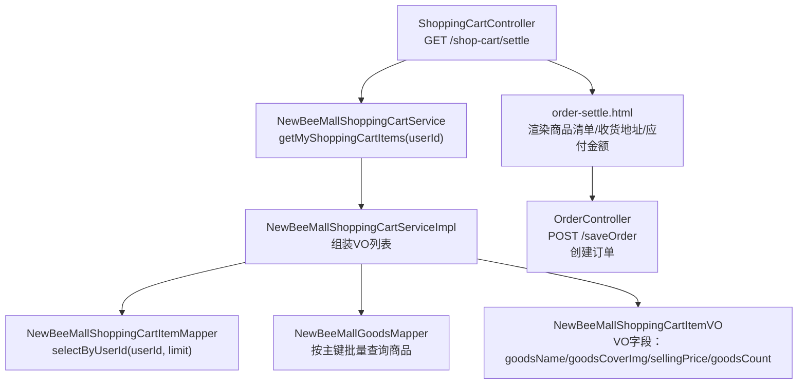
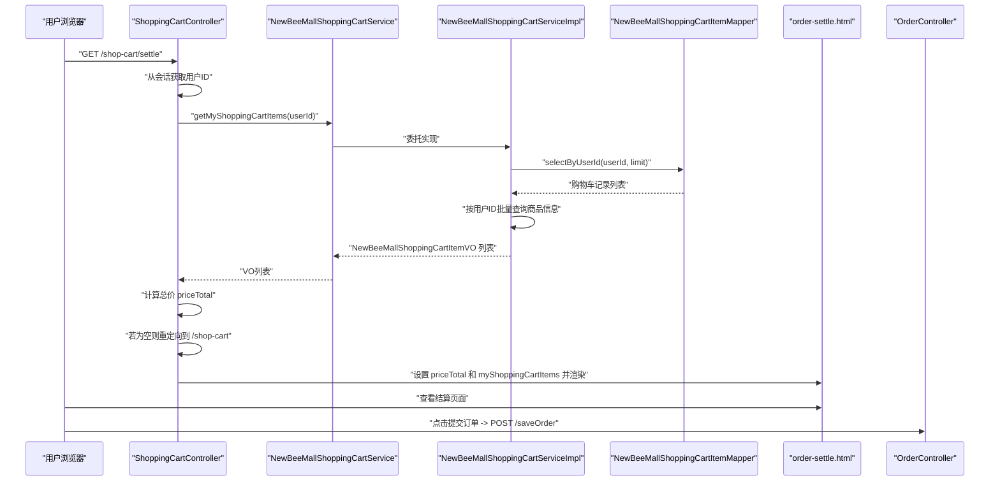
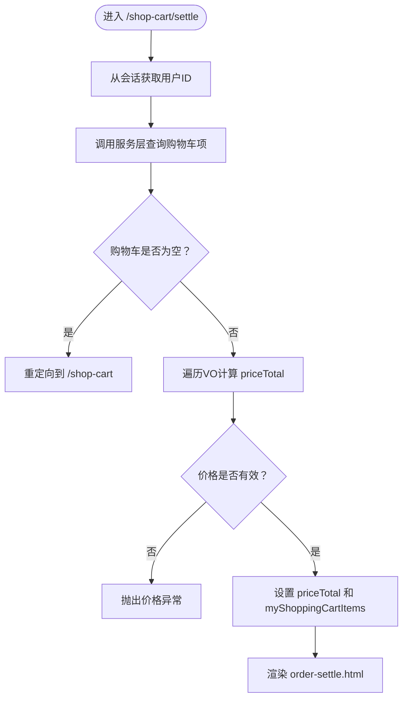
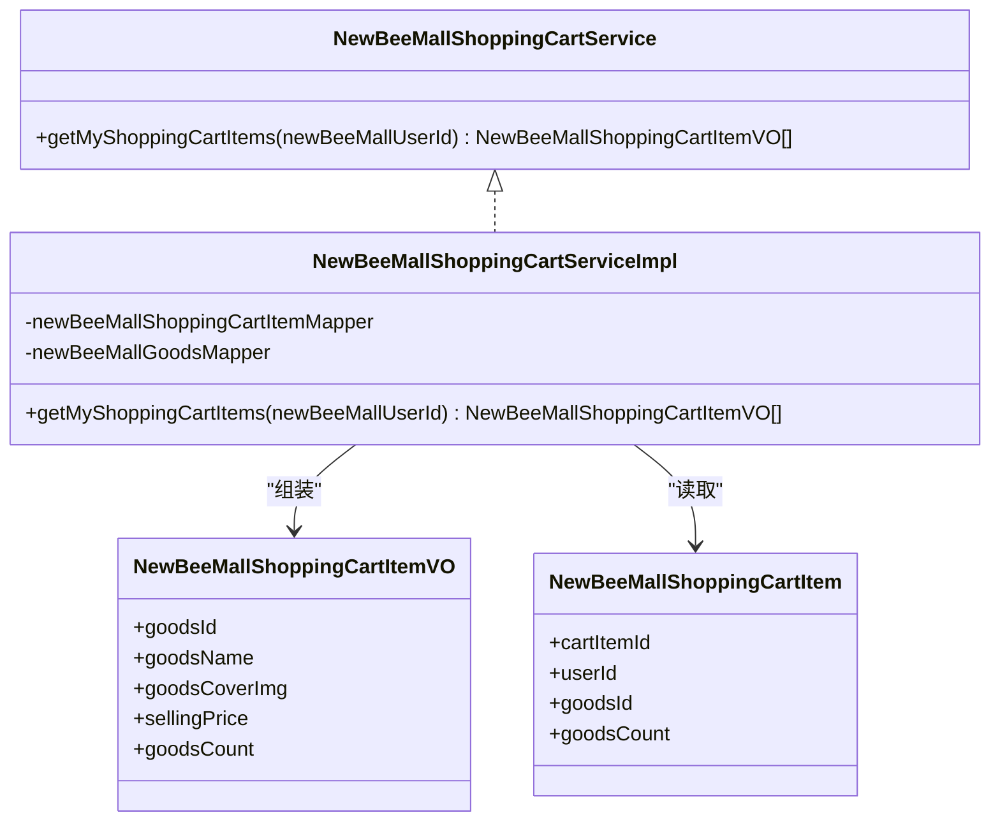
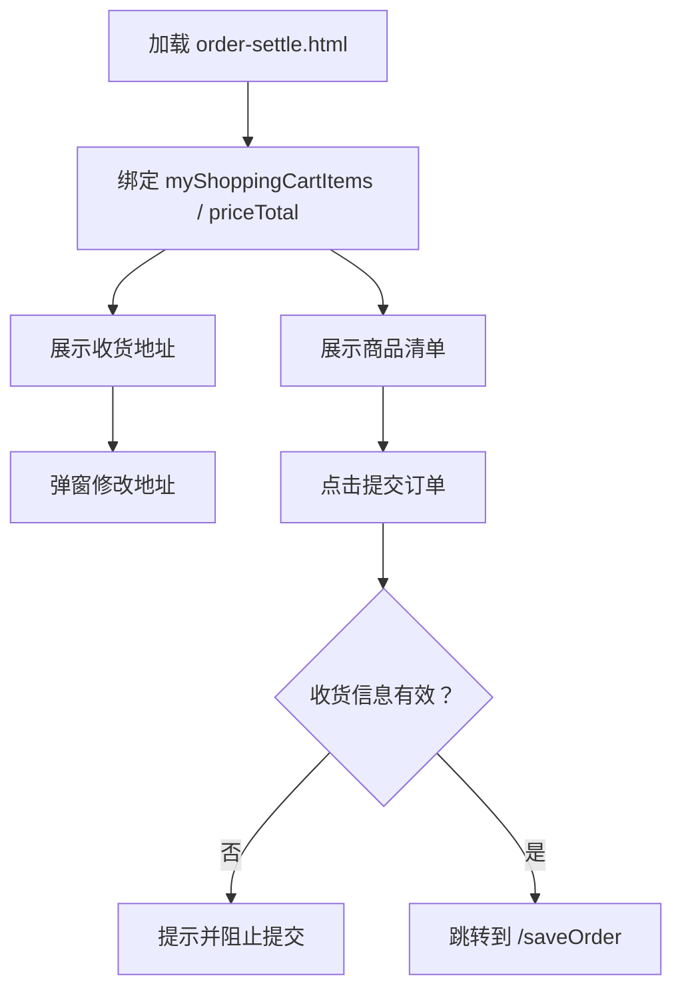
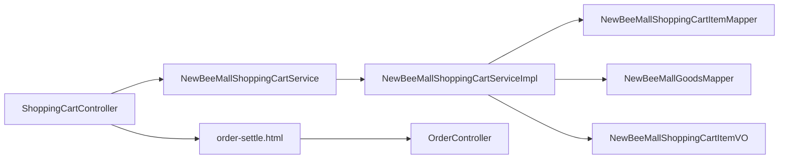

# 购物车结算

<cite>
**本文引用的文件**
- [ShoppingCartController.java](file://src/main/java/ltd/newbee/mall/controller/mall/ShoppingCartController.java)
- [NewBeeMallShoppingCartService.java](file://src/main/java/ltd/newbee/mall/service/NewBeeMallShoppingCartService.java)
- [NewBeeMallShoppingCartServiceImpl.java](file://src/main/java/ltd/newbee/mall/service/impl/NewBeeMallShoppingCartServiceImpl.java)
- [NewBeeMallShoppingCartItemVO.java](file://src/main/java/ltd/newbee/mall/controller/vo/NewBeeMallShoppingCartItemVO.java)
- [NewBeeMallShoppingCartItem.java](file://src/main/java/ltd/newbee/mall/entity/NewBeeMallShoppingCartItem.java)
- [NewBeeMallShoppingCartItemMapper.java](file://src/main/java/ltd/newbee/mall/dao/NewBeeMallShoppingCartItemMapper.java)
- [Constants.java](file://src/main/java/ltd/newbee/mall/common/Constants.java)
- [BeanUtil.java](file://src/main/java/ltd/newbee/mall/util/BeanUtil.java)
- [order-settle.html](file://src/main/resources/templates/mall/order-settle.html)
- [OrderController.java](file://src/main/java/ltd/newbee/mall/controller/mall/OrderController.java)
</cite>

## 目录
1. [简介](#简介)
2. [项目结构](#项目结构)
3. [核心组件](#核心组件)
4. [架构总览](#架构总览)
5. [详细组件分析](#详细组件分析)
6. [依赖关系分析](#依赖关系分析)
7. [性能考量](#性能考量)
8. [故障排查指南](#故障排查指南)
9. [结论](#结论)
10. [附录](#附录)

## 简介
本文件围绕 GET /shop-cart/settle 接口展开，完整说明其如何获取当前用户的购物车商品列表、计算订单总价、在购物车为空时直接重定向回购物车页面的逻辑，以及服务层如何组装 NewBeeMallShoppingCartItemVO 列表（包含商品名称、封面图、售价和数量等），并将这些数据传递给 order-settle.html 模板进行渲染。同时，文档覆盖结算页面的主要功能：选择收货地址、查看商品清单和最终价格，为后续订单创建流程做准备。

## 项目结构
与“购物车结算”相关的关键文件分布如下：
- 控制器层：ShoppingCartController 提供 /shop-cart/settle 的结算入口；OrderController 提供后续订单创建的 /saveOrder 入口。
- 服务层：NewBeeMallShoppingCartService 定义购物车查询接口；NewBeeMallShoppingCartServiceImpl 实现查询与 VO 组装。
- 数据访问层：NewBeeMallShoppingCartItemMapper 提供按用户查询购物车记录的能力。
- 视图层：order-settle.html 展示结算页面，包含商品清单、收货地址、应付金额等。
- VO/实体：NewBeeMallShoppingCartItemVO 作为视图模型承载展示所需字段；NewBeeMallShoppingCartItem 为数据库实体。

图表来源
- [ShoppingCartController.java](file://src/main/java/ltd/newbee/mall/controller/mall/ShoppingCartController.java#L107-L128)
- [NewBeeMallShoppingCartService.java](file://src/main/java/ltd/newbee/mall/service/NewBeeMallShoppingCartService.java#L52-L59)
- [NewBeeMallShoppingCartServiceImpl.java](file://src/main/java/ltd/newbee/mall/service/impl/NewBeeMallShoppingCartServiceImpl.java#L111-L141)
- [NewBeeMallShoppingCartItemMapper.java](file://src/main/java/ltd/newbee/mall/dao/NewBeeMallShoppingCartItemMapper.java#L23-L28)
- [order-settle.html](file://src/main/resources/templates/mall/order-settle.html#L60-L138)
- [OrderController.java](file://src/main/java/ltd/newbee/mall/controller/mall/OrderController.java#L67-L83)

章节来源
- [ShoppingCartController.java](file://src/main/java/ltd/newbee/mall/controller/mall/ShoppingCartController.java#L107-L128)
- [NewBeeMallShoppingCartService.java](file://src/main/java/ltd/newbee/mall/service/NewBeeMallShoppingCartService.java#L52-L59)
- [NewBeeMallShoppingCartServiceImpl.java](file://src/main/java/ltd/newbee/mall/service/impl/NewBeeMallShoppingCartServiceImpl.java#L111-L141)
- [order-settle.html](file://src/main/resources/templates/mall/order-settle.html#L60-L138)
- [OrderController.java](file://src/main/java/ltd/newbee/mall/controller/mall/OrderController.java#L67-L83)

## 核心组件
- 结算控制器：负责从会话中获取当前用户 ID，调用服务层查询购物车，计算总价，空购物车时重定向，非空时将数据放入请求域并渲染结算模板。
- 购物车服务：提供按用户查询购物车项列表的能力，并在查询后与商品信息合并，生成 VO 列表用于前端展示。
- 视图模板：order-settle.html 展示商品清单、收货地址、应付金额等，前端点击“提交订单”触发下一步订单创建。

章节来源
- [ShoppingCartController.java](file://src/main/java/ltd/newbee/mall/controller/mall/ShoppingCartController.java#L107-L128)
- [NewBeeMallShoppingCartService.java](file://src/main/java/ltd/newbee/mall/service/NewBeeMallShoppingCartService.java#L52-L59)
- [NewBeeMallShoppingCartServiceImpl.java](file://src/main/java/ltd/newbee/mall/service/impl/NewBeeMallShoppingCartServiceImpl.java#L111-L141)
- [order-settle.html](file://src/main/resources/templates/mall/order-settle.html#L60-L138)

## 架构总览
下面的序列图展示了从浏览器访问结算页到渲染结算页面的完整流程，以及后续订单创建的衔接。

图表来源
- [ShoppingCartController.java](file://src/main/java/ltd/newbee/mall/controller/mall/ShoppingCartController.java#L107-L128)
- [NewBeeMallShoppingCartService.java](file://src/main/java/ltd/newbee/mall/service/NewBeeMallShoppingCartService.java#L52-L59)
- [NewBeeMallShoppingCartServiceImpl.java](file://src/main/java/ltd/newbee/mall/service/impl/NewBeeMallShoppingCartServiceImpl.java#L111-L141)
- [NewBeeMallShoppingCartItemMapper.java](file://src/main/java/ltd/newbee/mall/dao/NewBeeMallShoppingCartItemMapper.java#L23-L28)
- [order-settle.html](file://src/main/resources/templates/mall/order-settle.html#L60-L138)
- [OrderController.java](file://src/main/java/ltd/newbee/mall/controller/mall/OrderController.java#L67-L83)

## 详细组件分析

### 结算控制器：GET /shop-cart/settle
- 会话取值：从会话中读取当前用户标识，确保后续查询基于登录用户。
- 调用服务：调用服务层 getMyShoppingCartItems(userId) 获取购物车项列表。
- 空购物车处理：若列表为空，直接返回购物车页面路径，避免无效结算。
- 计算总价：遍历 VO 列表，按“单价×数量”累加得到 priceTotal，并进行价格异常校验。
- 渲染模板：将 priceTotal 和 myShoppingCartItems 放入请求域，返回 order-settle.html。

图表来源
- [ShoppingCartController.java](file://src/main/java/ltd/newbee/mall/controller/mall/ShoppingCartController.java#L107-L128)

章节来源
- [ShoppingCartController.java](file://src/main/java/ltd/newbee/mall/controller/mall/ShoppingCartController.java#L107-L128)

### 服务层：NewBeeMallShoppingCartService 与实现
- 接口职责：对外暴露 getMyShoppingCartItems(userId) 查询当前用户购物车项列表。
- 实现细节：
  - 先按用户 ID 查询购物车记录，限制最大条数。
  - 批量查询对应商品信息，构建商品 ID 到商品实体的映射。
  - 遍历购物车记录，复制到 VO 对象，补充商品名称（截断）、封面图、销售价等字段。
  - 返回 VO 列表，供控制器渲染。

图表来源
- [NewBeeMallShoppingCartService.java](file://src/main/java/ltd/newbee/mall/service/NewBeeMallShoppingCartService.java#L52-L59)
- [NewBeeMallShoppingCartServiceImpl.java](file://src/main/java/ltd/newbee/mall/service/impl/NewBeeMallShoppingCartServiceImpl.java#L111-L141)
- [NewBeeMallShoppingCartItemVO.java](file://src/main/java/ltd/newbee/mall/controller/vo/NewBeeMallShoppingCartItemVO.java#L16-L78)
- [NewBeeMallShoppingCartItem.java](file://src/main/java/ltd/newbee/mall/entity/NewBeeMallShoppingCartItem.java#L1-L100)

章节来源
- [NewBeeMallShoppingCartService.java](file://src/main/java/ltd/newbee/mall/service/NewBeeMallShoppingCartService.java#L52-L59)
- [NewBeeMallShoppingCartServiceImpl.java](file://src/main/java/ltd/newbee/mall/service/impl/NewBeeMallShoppingCartServiceImpl.java#L111-L141)
- [NewBeeMallShoppingCartItemVO.java](file://src/main/java/ltd/newbee/mall/controller/vo/NewBeeMallShoppingCartItemVO.java#L16-L78)
- [NewBeeMallShoppingCartItem.java](file://src/main/java/ltd/newbee/mall/entity/NewBeeMallShoppingCartItem.java#L1-L100)

### 视图模板：order-settle.html
- 商品清单：遍历 myShoppingCartItems，显示封面图、名称、单价×数量。
- 收货信息：展示当前会话中的地址，支持弹窗修改。
- 应付金额：展示商品总价（等于 priceTotal）。
- 行为交互：点击“提交订单”时校验收货信息长度，通过后跳转到 /saveOrder 进行订单创建。

图表来源
- [order-settle.html](file://src/main/resources/templates/mall/order-settle.html#L60-L138)
- [order-settle.html](file://src/main/resources/templates/mall/order-settle.html#L183-L201)
- [OrderController.java](file://src/main/java/ltd/newbee/mall/controller/mall/OrderController.java#L67-L83)

章节来源
- [order-settle.html](file://src/main/resources/templates/mall/order-settle.html#L60-L138)
- [order-settle.html](file://src/main/resources/templates/mall/order-settle.html#L183-L201)
- [OrderController.java](file://src/main/java/ltd/newbee/mall/controller/mall/OrderController.java#L67-L83)

### 后续订单创建：/saveOrder
- 地址校验：若用户未设置地址，抛出异常并跳转错误页。
- 购物车校验：若购物车为空，抛出异常并跳转错误页。
- 创建订单：调用订单服务保存订单，返回订单号并重定向到订单详情页。

章节来源
- [OrderController.java](file://src/main/java/ltd/newbee/mall/controller/mall/OrderController.java#L67-L83)

## 依赖关系分析
- 控制器依赖服务接口，服务实现依赖 Mapper 与 Bean 工具。
- 服务实现依赖商品 Mapper 进行批量商品查询，再与购物车记录合并生成 VO。
- 控制器与模板之间通过请求域传递数据，模板通过 Thymeleaf 渲染。
- 结算页与订单创建页通过 URL 连接，形成完整的下单流程。

图表来源
- [ShoppingCartController.java](file://src/main/java/ltd/newbee/mall/controller/mall/ShoppingCartController.java#L107-L128)
- [NewBeeMallShoppingCartService.java](file://src/main/java/ltd/newbee/mall/service/NewBeeMallShoppingCartService.java#L52-L59)
- [NewBeeMallShoppingCartServiceImpl.java](file://src/main/java/ltd/newbee/mall/service/impl/NewBeeMallShoppingCartServiceImpl.java#L111-L141)
- [NewBeeMallShoppingCartItemMapper.java](file://src/main/java/ltd/newbee/mall/dao/NewBeeMallShoppingCartItemMapper.java#L23-L28)
- [order-settle.html](file://src/main/resources/templates/mall/order-settle.html#L60-L138)
- [OrderController.java](file://src/main/java/ltd/newbee/mall/controller/mall/OrderController.java#L67-L83)

章节来源
- [ShoppingCartController.java](file://src/main/java/ltd/newbee/mall/controller/mall/ShoppingCartController.java#L107-L128)
- [NewBeeMallShoppingCartServiceImpl.java](file://src/main/java/ltd/newbee/mall/service/impl/NewBeeMallShoppingCartServiceImpl.java#L111-L141)
- [order-settle.html](file://src/main/resources/templates/mall/order-settle.html#L60-L138)
- [OrderController.java](file://src/main/java/ltd/newbee/mall/controller/mall/OrderController.java#L67-L83)

## 性能考量
- 批量查询优化：服务实现中先按用户查询购物车记录，再一次性批量查询商品信息，减少多次数据库往返。
- VO 组装成本：对每个购物车项进行属性拷贝与字段拼装，注意在大量商品时的内存占用与字符串截断开销。
- 会话与常量：使用 Constants 中的会话键名与购物车限制常量，避免硬编码带来的维护成本。
- 前端渲染：模板中使用 Thymeleaf 循环渲染商品清单，建议控制单次渲染的商品数量，避免页面卡顿。

章节来源
- [NewBeeMallShoppingCartServiceImpl.java](file://src/main/java/ltd/newbee/mall/service/impl/NewBeeMallShoppingCartServiceImpl.java#L111-L141)
- [Constants.java](file://src/main/java/ltd/newbee/mall/common/Constants.java#L32-L34)

## 故障排查指南
- 购物车为空重定向：若访问结算页即被重定向回购物车，检查当前用户是否确实有购物车项；确认 getMyShoppingCartItems 返回值。
- 价格异常：若出现价格异常提示，检查 VO 中单价与数量是否为正数，以及总价计算逻辑。
- 收货地址缺失：结算页提交订单前会校验地址有效性，若为空或过短会阻止提交；可在个人中心完善地址后再试。
- 订单创建失败：/saveOrder 会校验地址与购物车状态，异常时会抛出相应错误；检查用户地址与购物车是否为空。

章节来源
- [ShoppingCartController.java](file://src/main/java/ltd/newbee/mall/controller/mall/ShoppingCartController.java#L107-L128)
- [order-settle.html](file://src/main/resources/templates/mall/order-settle.html#L183-L201)
- [OrderController.java](file://src/main/java/ltd/newbee/mall/controller/mall/OrderController.java#L67-L83)

## 结论
GET /shop-cart/settle 接口通过服务层将购物车数据与商品信息合并为 VO 列表，计算订单总价并在空购物车时进行安全重定向，最终将数据渲染到 order-settle.html。该设计清晰地分离了控制器、服务与视图层职责，保证了结算页面的数据完整性与用户体验。后续通过 /saveOrder 完成订单创建，形成完整的下单闭环。

## 附录
- 关键常量参考：会话键名、购物车总量与单项上限等。
- VO 字段说明：goodsName、goodsCoverImg、sellingPrice、goodsCount 等用于结算页展示。

章节来源
- [Constants.java](file://src/main/java/ltd/newbee/mall/common/Constants.java#L32-L34)
- [NewBeeMallShoppingCartItemVO.java](file://src/main/java/ltd/newbee/mall/controller/vo/NewBeeMallShoppingCartItemVO.java#L16-L78)