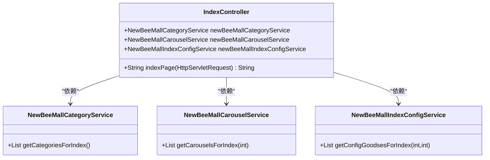
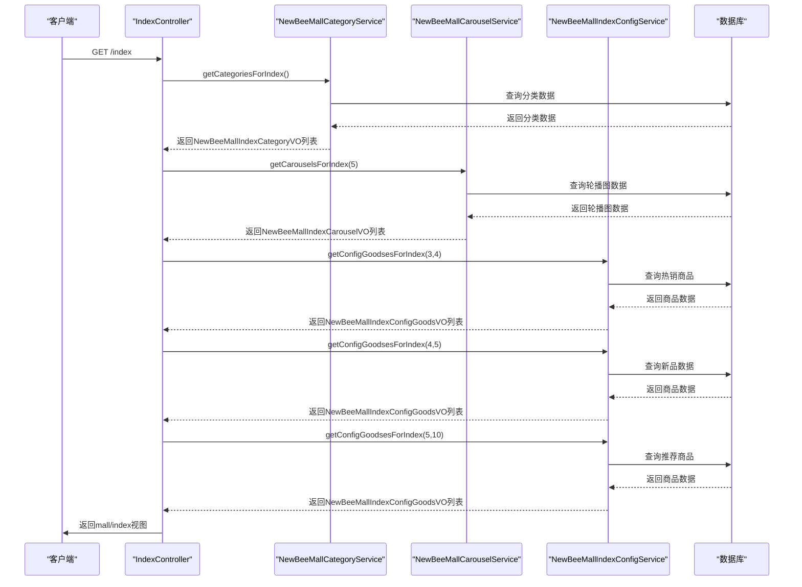
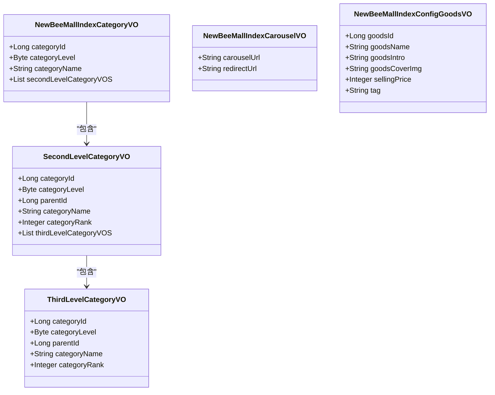
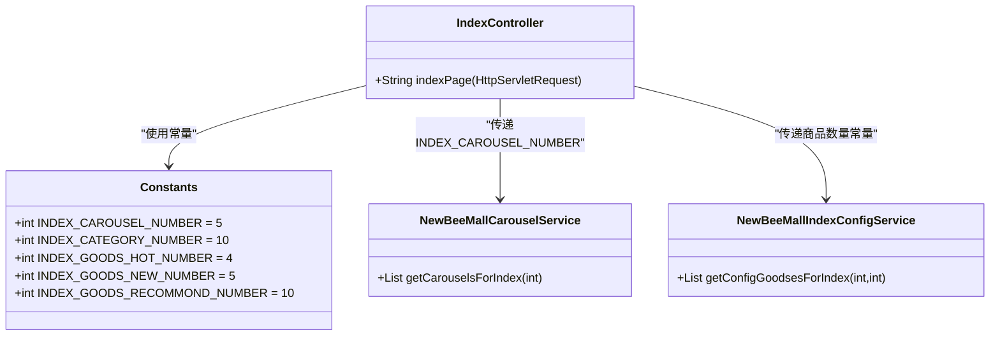
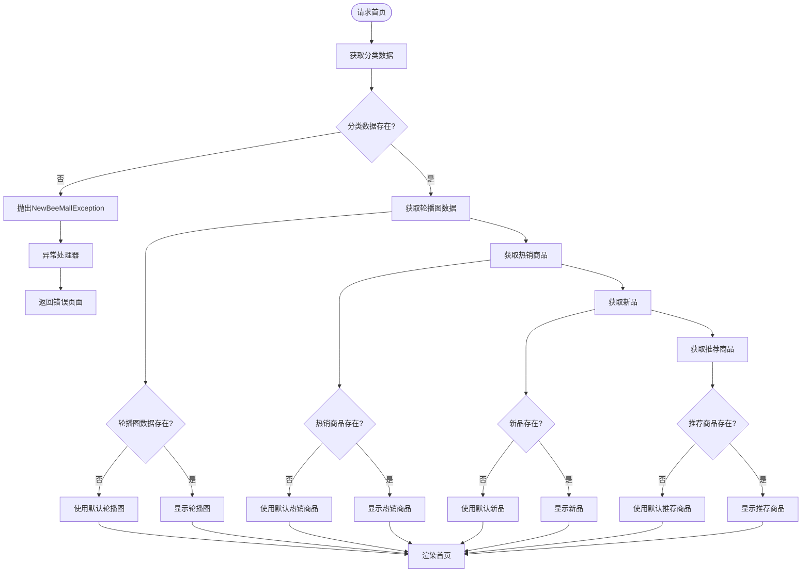
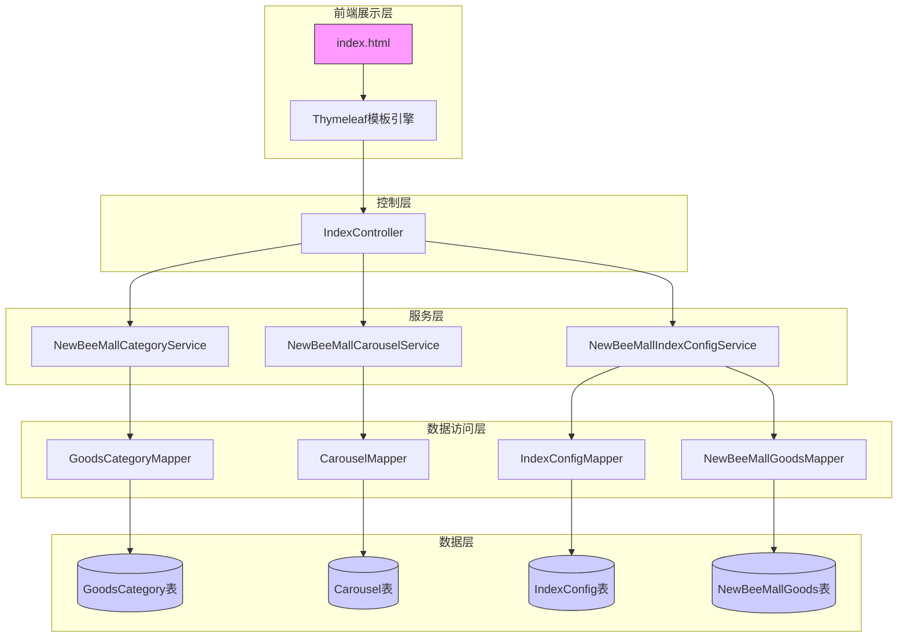

# 首页相关

<cite>
**本文档引用文件**  
- [IndexController.java](file://src/main/java/ltd/newbee/mall/controller/mall/IndexController.java)
- [NewBeeMallCategoryService.java](file://src/main/java/ltd/newbee/mall/service/NewBeeMallCategoryService.java)
- [NewBeeMallCategoryServiceImpl.java](file://src/main/java/ltd/newbee/mall/service/impl/NewBeeMallCategoryServiceImpl.java)
- [NewBeeMallCarouselService.java](file://src/main/java/ltd/newbee/mall/service/NewBeeMallCarouselService.java)
- [NewBeeMallCarouselServiceImpl.java](file://src/main/java/ltd/newbee/mall/service/impl/NewBeeMallCarouselServiceImpl.java)
- [NewBeeMallIndexConfigService.java](file://src/main/java/ltd/newbee/mall/service/NewBeeMallIndexConfigService.java)
- [NewBeeMallIndexConfigServiceImpl.java](file://src/main/java/ltd/newbee/mall/service/impl/NewBeeMallIndexConfigServiceImpl.java)
- [Constants.java](file://src/main/java/ltd/newbee/mall/common/Constants.java)
- [IndexConfigTypeEnum.java](file://src/main/java/ltd/newbee/mall/common/IndexConfigTypeEnum.java)
- [NewBeeMallIndexCategoryVO.java](file://src/main/java/ltd/newbee/mall/controller/vo/NewBeeMallIndexCategoryVO.java)
- [NewBeeMallIndexCarouselVO.java](file://src/main/java/ltd/newbee/mall/controller/vo/NewBeeMallIndexCarouselVO.java)
- [NewBeeMallIndexConfigGoodsVO.java](file://src/main/java/ltd/newbee/mall/controller/vo/NewBeeMallIndexConfigGoodsVO.java)
- [index.html](file://src/main/resources/templates/mall/index.html)
</cite>

## 目录
1. [接口概述](#接口概述)
2. [核心控制器分析](#核心控制器分析)
3. [数据获取流程](#数据获取流程)
4. [模型属性详解](#模型属性详解)
5. [分页常量使用](#分页常量使用)
6. [模板渲染机制](#模板渲染机制)
7. [错误处理场景](#错误处理场景)
8. [系统架构图](#系统架构图)

## 接口概述

`GET /`、`GET /index`和`GET /index.html`是newbee-mall商城的首页入口接口，这三个接口通过Spring MVC的路径映射功能被统一处理。这些接口的主要功能是渲染商城首页并返回Thymeleaf模板，为用户提供商品分类导航、轮播图展示、热销商品推荐等核心功能。

这些接口通过`IndexController`类中的`indexPage`方法实现，该方法处理所有三种URL路径的请求。接口返回的是一个逻辑视图名称"mall/index"，由Thymeleaf模板引擎解析为实际的HTML页面。在处理请求的过程中，系统会从数据库中获取必要的数据，并将其作为模型属性添加到HttpServletRequest对象中，供前端模板使用。

**接口来源**
- [IndexController.java](file://src/main/java/ltd/newbee/mall/controller/mall/IndexController.java#L40-L57)

## 核心控制器分析

`IndexController`是处理首页请求的核心控制器，负责协调各个服务组件获取所需数据并准备视图模型。该控制器通过`@Controller`注解声明为Spring MVC的控制器，并使用`@GetMapping`注解将多个URL路径映射到同一个处理方法。

控制器通过`@Resource`注解注入了三个关键服务：`NewBeeMallCategoryService`用于获取商品分类数据，`NewBeeMallCarouselService`用于获取轮播图数据，以及`NewBeeMallIndexConfigService`用于获取各种推荐商品数据。这种依赖注入的设计模式实现了组件间的松耦合，便于维护和测试。

**图示来源**
- [IndexController.java](file://src/main/java/ltd/newbee/mall/controller/mall/IndexController.java#L28-L57)

**本节来源**
- [IndexController.java](file://src/main/java/ltd/newbee/mall/controller/mall/IndexController.java#L28-L57)

## 数据获取流程

首页数据的获取流程是一个协调多个服务组件的复杂过程。当用户请求首页时，`IndexController`会依次调用三个服务组件来获取不同类型的数据。

首先，系统调用`NewBeeMallCategoryService`的`getCategoriesForIndex()`方法获取商品分类数据。这个方法会查询数据库中的一级、二级和三级分类，并构建一个层次化的分类结构。然后，系统调用`NewBeeMallCarouselService`的`getCarouselsForIndex()`方法获取轮播图数据，该方法根据指定的数量限制返回最新的轮播图记录。

最后，系统三次调用`NewBeeMallIndexConfigService`的`getConfigGoodsesForIndex()`方法，分别获取热销商品、新品和推荐商品数据。每次调用都使用不同的配置类型参数来区分商品类别。所有获取的数据都会被设置为HttpServletRequest的属性，以便在Thymeleaf模板中使用。

**图示来源**
- [IndexController.java](file://src/main/java/ltd/newbee/mall/controller/mall/IndexController.java#L41-L54)

**本节来源**
- [IndexController.java](file://src/main/java/ltd/newbee/mall/controller/mall/IndexController.java#L41-L54)

## 模型属性详解

首页接口通过HttpServletRequest的setAttribute方法设置了五个关键的模型属性，这些属性在Thymeleaf模板中被直接引用。

`categories`属性存储了商品分类数据，其类型为`List<NewBeeMallIndexCategoryVO>`。这个VO类包含了分类ID、分类级别、分类名称以及二级分类列表等信息，形成了一个完整的分类树结构。`carousels`属性存储了轮播图数据，其类型为`List<NewBeeMallIndexCarouselVO>`，包含轮播图的URL和跳转链接。

`hotGoodses`、`newGoodses`和`recommendGoodses`三个属性分别存储了热销商品、新品和推荐商品数据，它们的类型均为`List<NewBeeMallIndexConfigGoodsVO>`。这个VO类包含了商品ID、商品名称、商品简介、商品封面图、销售价格和标签等信息，为前端展示提供了完整的产品数据。

**图示来源**
- [NewBeeMallIndexCategoryVO.java](file://src/main/java/ltd/newbee/mall/controller/vo/NewBeeMallIndexCategoryVO.java#L17-L58)
- [NewBeeMallIndexCarouselVO.java](file://src/main/java/ltd/newbee/mall/controller/vo/NewBeeMallIndexCarouselVO.java#L16-L37)
- [NewBeeMallIndexConfigGoodsVO.java](file://src/main/java/ltd/newbee/mall/controller/vo/NewBeeMallIndexConfigGoodsVO.java#L16-L77)

**本节来源**
- [NewBeeMallIndexCategoryVO.java](file://src/main/java/ltd/newbee/mall/controller/vo/NewBeeMallIndexCategoryVO.java#L17-L58)
- [NewBeeMallIndexCarouselVO.java](file://src/main/java/ltd/newbee/mall/controller/vo/NewBeeMallIndexCarouselVO.java#L16-L37)
- [NewBeeMallIndexConfigGoodsVO.java](file://src/main/java/ltd/newbee/mall/controller/vo/NewBeeMallIndexConfigGoodsVO.java#L16-L77)

## 分页常量使用

系统在`Constants.java`类中定义了一系列常量，用于控制首页各模块的数据展示数量。这些常量确保了页面展示的数据量在合理范围内，既保证了用户体验，又避免了性能问题。

`INDEX_CAROUSEL_NUMBER`常量值为5，定义了首页轮播图的显示数量。`INDEX_CATEGORY_NUMBER`常量值为10，限制了一级分类的最大显示数量。对于商品展示，系统定义了三个不同的常量：`INDEX_GOODS_HOT_NUMBER`（值为4）用于热销商品，`INDEX_GOODS_NEW_NUMBER`（值为5）用于新品，以及`INDEX_GOODS_RECOMMOND_NUMBER`（值为10）用于推荐商品。

这些常量在服务调用时作为参数传递，例如在`getCarouselsForIndex(Constants.INDEX_CAROUSEL_NUMBER)`调用中，确保只获取指定数量的轮播图数据。这种设计使得数量限制的配置集中化，便于维护和调整。

**图示来源**
- [Constants.java](file://src/main/java/ltd/newbee/mall/common/Constants.java#L18-L30)

**本节来源**
- [Constants.java](file://src/main/java/ltd/newbee/mall/common/Constants.java#L18-L30)
- [IndexController.java](file://src/main/java/ltd/newbee/mall/controller/mall/IndexController.java#L46-L49)

## 模板渲染机制

首页的模板渲染基于Thymeleaf模板引擎，`index.html`文件位于`src/main/resources/templates/mall/`目录下。该模板通过Thymeleaf的表达式语言访问控制器设置的模型属性，并动态生成HTML内容。

模板使用`th:each`指令遍历`categories`属性，生成左侧的商品分类导航菜单。对于轮播图区域，模板首先检查`carousels`列表是否为空，如果不为空则遍历并显示后台配置的轮播图，否则显示默认的三张轮播图。类似的条件渲染也应用于热销商品、新品和推荐商品区域。

模板中的`th:href`和`th:src`指令用于动态生成链接和图片URL，确保了前后端的正确关联。例如，商品链接使用`th:href="@{'/goods/detail/'+${hotGoodse.goodsId}}"`语法，将商品ID嵌入到URL中。这种模板机制实现了数据与展示的分离，提高了系统的可维护性。

**本节来源**
- [index.html](file://src/main/resources/templates/mall/index.html#L1-L353)

## 错误处理场景

系统在首页数据获取过程中实现了完善的错误处理机制。最显著的错误处理场景出现在分类数据获取环节，当`getCategoriesForIndex()`方法返回空列表时，系统会抛出一个业务异常。

在`IndexController`的`indexPage`方法中，使用`CollectionUtils.isEmpty(categories)`检查分类数据是否为空。如果分类数据不完善或数据库中没有有效的分类记录，系统会调用`NewBeeMallException.fail("分类数据不完善")`方法抛出异常。这个异常会被全局异常处理器捕获，并返回相应的错误页面或JSON响应。

这种错误处理机制确保了系统的健壮性，避免了因关键数据缺失而导致的页面渲染错误。同时，明确的错误信息有助于管理员快速定位和解决问题。对于其他数据（如轮播图和推荐商品），系统采用了更宽容的处理方式，当数据为空时显示默认内容而非抛出异常。

**图示来源**
- [IndexController.java](file://src/main/java/ltd/newbee/mall/controller/mall/IndexController.java#L42-L45)

**本节来源**
- [IndexController.java](file://src/main/java/ltd/newbee/mall/controller/mall/IndexController.java#L42-L45)
- [NewBeeMallException.java](file://src/main/java/ltd/newbee/mall/common/NewBeeMallException.java)

## 系统架构图

以下架构图展示了首页API的整体系统架构，包括前端模板、控制器、服务层、数据访问层和数据库之间的关系。

**图示来源**
- [IndexController.java](file://src/main/java/ltd/newbee/mall/controller/mall/IndexController.java)
- [NewBeeMallCategoryServiceImpl.java](file://src/main/java/ltd/newbee/mall/service/impl/NewBeeMallCategoryServiceImpl.java)
- [NewBeeMallCarouselServiceImpl.java](file://src/main/java/ltd/newbee/mall/service/impl/NewBeeMallCarouselServiceImpl.java)
- [NewBeeMallIndexConfigServiceImpl.java](file://src/main/java/ltd/newbee/mall/service/impl/NewBeeMallIndexConfigServiceImpl.java)

**本节来源**
- [IndexController.java](file://src/main/java/ltd/newbee/mall/controller/mall/IndexController.java)
- [NewBeeMallCategoryServiceImpl.java](file://src/main/java/ltd/newbee/mall/service/impl/NewBeeMallCategoryServiceImpl.java)
- [NewBeeMallCarouselServiceImpl.java](file://src/main/java/ltd/newbee/mall/service/impl/NewBeeMallCarouselServiceImpl.java)
- [NewBeeMallIndexConfigServiceImpl.java](file://src/main/java/ltd/newbee/mall/service/impl/NewBeeMallIndexConfigServiceImpl.java)