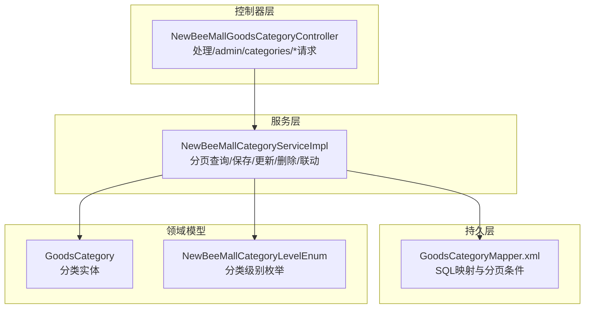
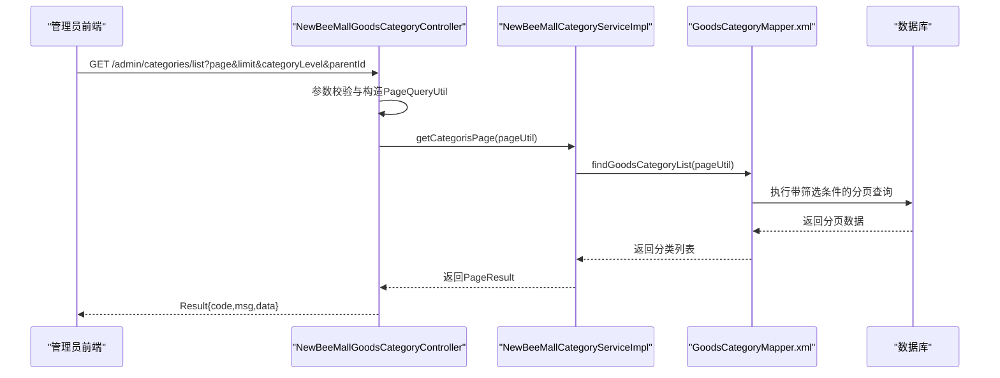
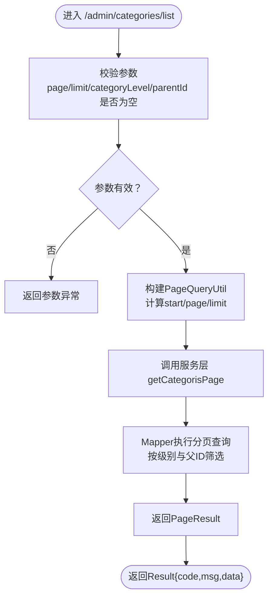
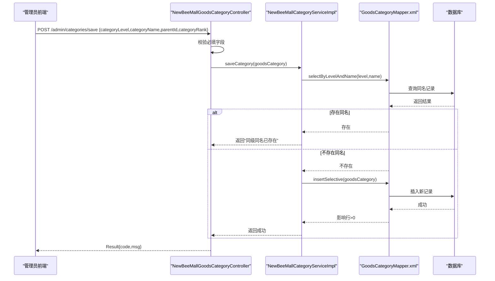
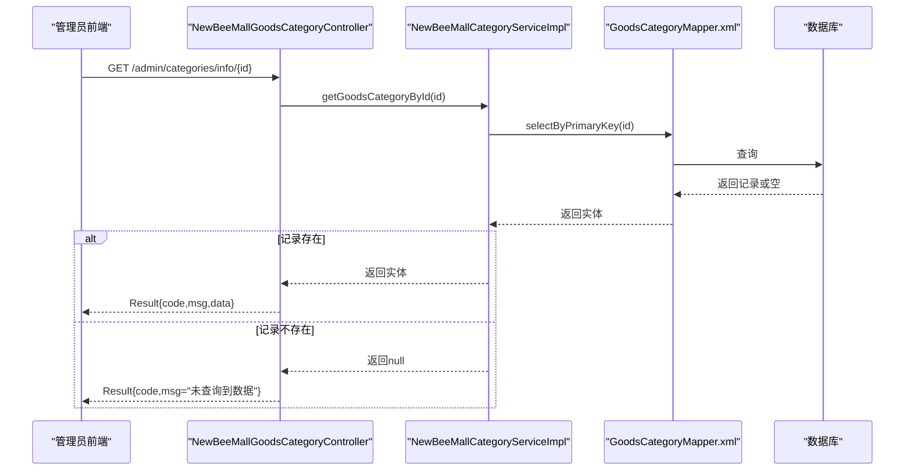
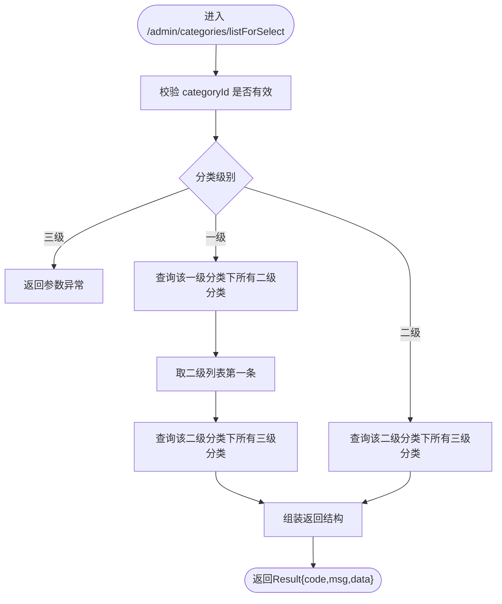
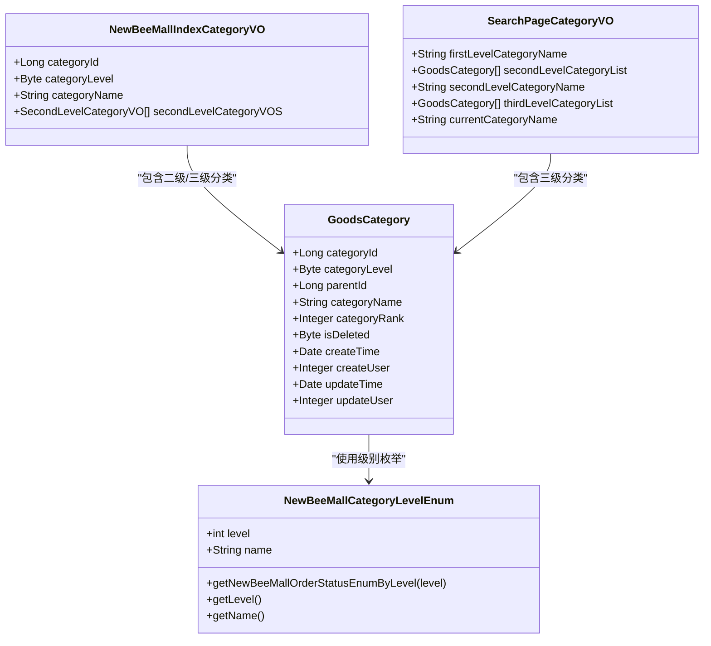
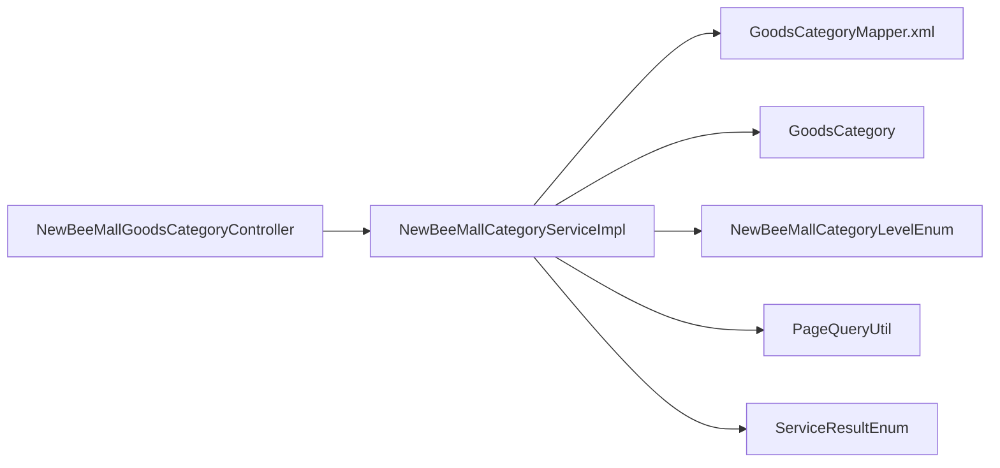

# 分类管理API

<cite>
**本文引用的文件**
- [NewBeeMallGoodsCategoryController.java](file://src/main/java/ltd/newbee/mall/controller/admin/NewBeeMallGoodsCategoryController.java)
- [NewBeeMallCategoryServiceImpl.java](file://src/main/java/ltd/newbee/mall/service/impl/NewBeeMallCategoryServiceImpl.java)
- [GoodsCategoryMapper.xml](file://src/main/resources/mapper/GoodsCategoryMapper.xml)
- [GoodsCategory.java](file://src/main/java/ltd/newbee/mall/entity/GoodsCategory.java)
- [NewBeeMallCategoryLevelEnum.java](file://src/main/java/ltd/newbee/mall/common/NewBeeMallCategoryLevelEnum.java)
- [PageQueryUtil.java](file://src/main/java/ltd/newbee/mall/util/PageQueryUtil.java)
- [ServiceResultEnum.java](file://src/main/java/ltd/newbee/mall/common/ServiceResultEnum.java)
- [NewBeeMallIndexCategoryVO.java](file://src/main/java/ltd/newbee/mall/controller/vo/NewBeeMallIndexCategoryVO.java)
- [SearchPageCategoryVO.java](file://src/main/java/ltd/newbee/mall/controller/vo/SearchPageCategoryVO.java)
</cite>

## 目录
1. [简介](#简介)
2. [项目结构](#项目结构)
3. [核心组件](#核心组件)
4. [架构总览](#架构总览)
5. [详细组件分析](#详细组件分析)
6. [依赖关系分析](#依赖关系分析)
7. [性能与分页特性](#性能与分页特性)
8. [故障排查指南](#故障排查指南)
9. [结论](#结论)
10. [附录：接口清单与示例](#附录接口清单与示例)

## 简介
本文件面向管理员端的商品分类管理模块，聚焦以下接口的完整说明与实现细节：
- 分类列表接口：/admin/categories/list（支持分页、按分类级别与父分类ID筛选）
- 添加分类接口：/admin/categories/save（请求体包含分类级别、分类名称、父分类ID、排序值等字段）
- 分类详情接口：/admin/categories/info/{id}
- 选择联动接口：/admin/categories/listForSelect（按选中分类动态返回二级/三级分类）

文档同时解析三级分类体系的实现逻辑，以及分类数据在首页与搜索页的商品管理联动应用。

## 项目结构
分类管理模块位于后端控制器层与服务层之间，采用典型的分层架构：
- 控制器层：负责HTTP请求接收、参数校验与结果封装
- 服务层：负责业务逻辑编排与DAO调用
- DAO层：MyBatis映射文件执行数据库查询与更新
- 实体与枚举：定义分类模型与级别枚举

图表来源
- [NewBeeMallGoodsCategoryController.java](file://src/main/java/ltd/newbee/mall/controller/admin/NewBeeMallGoodsCategoryController.java#L42-L173)
- [NewBeeMallCategoryServiceImpl.java](file://src/main/java/ltd/newbee/mall/service/impl/NewBeeMallCategoryServiceImpl.java#L33-L168)
- [GoodsCategoryMapper.xml](file://src/main/resources/mapper/GoodsCategoryMapper.xml#L20-L77)
- [GoodsCategory.java](file://src/main/java/ltd/newbee/mall/entity/GoodsCategory.java#L15-L137)
- [NewBeeMallCategoryLevelEnum.java](file://src/main/java/ltd/newbee/mall/common/NewBeeMallCategoryLevelEnum.java#L18-L59)

章节来源
- [NewBeeMallGoodsCategoryController.java](file://src/main/java/ltd/newbee/mall/controller/admin/NewBeeMallGoodsCategoryController.java#L42-L173)
- [NewBeeMallCategoryServiceImpl.java](file://src/main/java/ltd/newbee/mall/service/impl/NewBeeMallCategoryServiceImpl.java#L33-L168)
- [GoodsCategoryMapper.xml](file://src/main/resources/mapper/GoodsCategoryMapper.xml#L20-L77)

## 核心组件
- 控制器：负责接收请求、参数校验、调用服务层并返回统一结果包装
- 服务实现：封装分页查询、新增/修改、删除、首页与搜索页联动
- 映射文件：基于MyBatis的SQL映射，支持按分类级别与父ID筛选、分页与排序
- 实体与枚举：定义分类字段与级别枚举，确保业务一致性

章节来源
- [NewBeeMallGoodsCategoryController.java](file://src/main/java/ltd/newbee/mall/controller/admin/NewBeeMallGoodsCategoryController.java#L42-L173)
- [NewBeeMallCategoryServiceImpl.java](file://src/main/java/ltd/newbee/mall/service/impl/NewBeeMallCategoryServiceImpl.java#L33-L168)
- [GoodsCategoryMapper.xml](file://src/main/resources/mapper/GoodsCategoryMapper.xml#L20-L77)
- [GoodsCategory.java](file://src/main/java/ltd/newbee/mall/entity/GoodsCategory.java#L15-L137)
- [NewBeeMallCategoryLevelEnum.java](file://src/main/java/ltd/newbee/mall/common/NewBeeMallCategoryLevelEnum.java#L18-L59)

## 架构总览
分类管理的典型调用链如下：

图表来源
- [NewBeeMallGoodsCategoryController.java](file://src/main/java/ltd/newbee/mall/controller/admin/NewBeeMallGoodsCategoryController.java#L57-L65)
- [NewBeeMallCategoryServiceImpl.java](file://src/main/java/ltd/newbee/mall/service/impl/NewBeeMallCategoryServiceImpl.java#L39-L45)
- [GoodsCategoryMapper.xml](file://src/main/resources/mapper/GoodsCategoryMapper.xml#L20-L37)
- [PageQueryUtil.java](file://src/main/java/ltd/newbee/mall/util/PageQueryUtil.java#L20-L29)

## 详细组件分析

### 分类列表接口：/admin/categories/list
- 请求方式：GET
- 路径：/admin/categories/list
- 查询参数：
  - page：当前页码（整型）
  - limit：每页条数（整型）
  - categoryLevel：分类级别（1=一级，2=二级，3=三级）
  - parentId：父分类ID（当级别为1时传0或对应一级ID；为2时传对应一级ID；为3时传对应二级ID）
- 返回：Result对象，data为分页结果（列表+总数），按排序字段降序排列
- 关键实现点：
  - 控制器对必要参数进行非空校验，否则返回“参数异常”
  - 使用PageQueryUtil计算起始偏移量，传递给服务层
  - 服务层调用Mapper执行带筛选条件的分页查询，排序字段为分类排序值
  - Mapper通过动态WHERE子句支持按级别与父ID筛选，且过滤已删除记录

图表来源
- [NewBeeMallGoodsCategoryController.java](file://src/main/java/ltd/newbee/mall/controller/admin/NewBeeMallGoodsCategoryController.java#L57-L65)
- [PageQueryUtil.java](file://src/main/java/ltd/newbee/mall/util/PageQueryUtil.java#L20-L29)
- [NewBeeMallCategoryServiceImpl.java](file://src/main/java/ltd/newbee/mall/service/impl/NewBeeMallCategoryServiceImpl.java#L39-L45)
- [GoodsCategoryMapper.xml](file://src/main/resources/mapper/GoodsCategoryMapper.xml#L20-L37)

章节来源
- [NewBeeMallGoodsCategoryController.java](file://src/main/java/ltd/newbee/mall/controller/admin/NewBeeMallGoodsCategoryController.java#L57-L65)
- [GoodsCategoryMapper.xml](file://src/main/resources/mapper/GoodsCategoryMapper.xml#L20-L37)
- [PageQueryUtil.java](file://src/main/java/ltd/newbee/mall/util/PageQueryUtil.java#L20-L29)

### 添加分类接口：/admin/categories/save
- 请求方式：POST
- 路径：/admin/categories/save
- 请求体：GoodsCategory对象，必须包含以下字段
  - categoryLevel：分类级别（1=一级，2=二级，3=三级）
  - categoryName：分类名称（非空）
  - parentId：父分类ID（当级别为1时传0或对应一级ID；为2时传对应一级ID；为3时传对应二级ID）
  - categoryRank：排序值（整型，数值越大越靠前）
- 业务规则：
  - 名称在同一级别下唯一，重复会返回“已存在同级同名的分类”
  - 插入成功返回成功状态，失败返回数据库错误提示
- 关键实现点：
  - 控制器对必填字段进行非空校验
  - 服务层先检查同名冲突，再插入新记录
  - Mapper使用选择性插入，仅写入非空字段

图表来源
- [NewBeeMallGoodsCategoryController.java](file://src/main/java/ltd/newbee/mall/controller/admin/NewBeeMallGoodsCategoryController.java#L101-L119)
- [NewBeeMallCategoryServiceImpl.java](file://src/main/java/ltd/newbee/mall/service/impl/NewBeeMallCategoryServiceImpl.java#L47-L57)
- [GoodsCategoryMapper.xml](file://src/main/resources/mapper/GoodsCategoryMapper.xml#L56-L62)
- [GoodsCategoryMapper.xml](file://src/main/resources/mapper/GoodsCategoryMapper.xml#L99-L165)

章节来源
- [NewBeeMallGoodsCategoryController.java](file://src/main/java/ltd/newbee/mall/controller/admin/NewBeeMallGoodsCategoryController.java#L101-L119)
- [NewBeeMallCategoryServiceImpl.java](file://src/main/java/ltd/newbee/mall/service/impl/NewBeeMallCategoryServiceImpl.java#L47-L57)
- [GoodsCategoryMapper.xml](file://src/main/resources/mapper/GoodsCategoryMapper.xml#L56-L62)
- [GoodsCategoryMapper.xml](file://src/main/resources/mapper/GoodsCategoryMapper.xml#L99-L165)

### 分类详情接口：/admin/categories/info/{id}
- 请求方式：GET
- 路径：/admin/categories/info/{id}
- 行为：根据分类ID查询完整分类信息，若不存在返回“未查询到数据”，否则返回该分类实体
- 关键实现点：
  - 控制器从服务层获取分类详情
  - 服务层通过主键查询并返回

图表来源
- [NewBeeMallGoodsCategoryController.java](file://src/main/java/ltd/newbee/mall/controller/admin/NewBeeMallGoodsCategoryController.java#L143-L154)
- [NewBeeMallCategoryServiceImpl.java](file://src/main/java/ltd/newbee/mall/service/impl/NewBeeMallCategoryServiceImpl.java#L77-L81)
- [GoodsCategoryMapper.xml](file://src/main/resources/mapper/GoodsCategoryMapper.xml#L50-L55)

章节来源
- [NewBeeMallGoodsCategoryController.java](file://src/main/java/ltd/newbee/mall/controller/admin/NewBeeMallGoodsCategoryController.java#L143-L154)
- [NewBeeMallCategoryServiceImpl.java](file://src/main/java/ltd/newbee/mall/service/impl/NewBeeMallCategoryServiceImpl.java#L77-L81)
- [GoodsCategoryMapper.xml](file://src/main/resources/mapper/GoodsCategoryMapper.xml#L50-L55)

### 选择联动接口：/admin/categories/listForSelect
- 请求方式：GET
- 路径：/admin/categories/listForSelect?categoryId={id}
- 行为：
  - 若传入的分类为三级，则返回“参数异常”
  - 若传入的一级分类存在，则返回其下所有二级分类，以及二级分类列表中第一条数据下的所有三级分类
  - 若传入的是二级分类，则返回其下所有三级分类
- 关键实现点：
  - 服务层根据传入ID查询分类级别
  - 依据级别调用“按级别与父ID集合查询”的方法
  - 返回结构包含二级分类列表与三级分类列表

图表来源
- [NewBeeMallGoodsCategoryController.java](file://src/main/java/ltd/newbee/mall/controller/admin/NewBeeMallGoodsCategoryController.java#L70-L99)
- [NewBeeMallCategoryServiceImpl.java](file://src/main/java/ltd/newbee/mall/service/impl/NewBeeMallCategoryServiceImpl.java#L163-L167)
- [GoodsCategoryMapper.xml](file://src/main/resources/mapper/GoodsCategoryMapper.xml#L63-L77)

章节来源
- [NewBeeMallGoodsCategoryController.java](file://src/main/java/ltd/newbee/mall/controller/admin/NewBeeMallGoodsCategoryController.java#L70-L99)
- [NewBeeMallCategoryServiceImpl.java](file://src/main/java/ltd/newbee/mall/service/impl/NewBeeMallCategoryServiceImpl.java#L163-L167)
- [GoodsCategoryMapper.xml](file://src/main/resources/mapper/GoodsCategoryMapper.xml#L63-L77)

### 三级分类体系与商品管理联动
- 三级分类模型：
  - 一级分类：parentId=0
  - 二级分类：parentId=某一级分类ID
  - 三级分类：parentId=某二级分类ID
- 级别枚举：通过枚举定义1、2、3级别的含义，便于前后端一致理解
- 商品管理联动：
  - 首页：按一级分类加载固定数量的一级分类，再加载其对应的二级分类与三级分类，形成树形结构
  - 搜索页：根据当前三级分类定位到其二级分类与其同级三级分类列表

图表来源
- [GoodsCategory.java](file://src/main/java/ltd/newbee/mall/entity/GoodsCategory.java#L15-L137)
- [NewBeeMallCategoryLevelEnum.java](file://src/main/java/ltd/newbee/mall/common/NewBeeMallCategoryLevelEnum.java#L18-L59)
- [NewBeeMallIndexCategoryVO.java](file://src/main/java/ltd/newbee/mall/controller/vo/NewBeeMallIndexCategoryVO.java#L17-L59)
- [SearchPageCategoryVO.java](file://src/main/java/ltd/newbee/mall/controller/vo/SearchPageCategoryVO.java#L19-L71)

章节来源
- [NewBeeMallCategoryServiceImpl.java](file://src/main/java/ltd/newbee/mall/service/impl/NewBeeMallCategoryServiceImpl.java#L92-L161)
- [NewBeeMallCategoryLevelEnum.java](file://src/main/java/ltd/newbee/mall/common/NewBeeMallCategoryLevelEnum.java#L18-L59)

## 依赖关系分析
- 控制器依赖服务层接口与通用结果封装工具
- 服务层依赖DAO映射与分页工具
- DAO映射依赖数据库表结构与MyBatis框架
- 实体与枚举贯穿于控制器、服务与DAO层

图表来源
- [NewBeeMallGoodsCategoryController.java](file://src/main/java/ltd/newbee/mall/controller/admin/NewBeeMallGoodsCategoryController.java#L42-L173)
- [NewBeeMallCategoryServiceImpl.java](file://src/main/java/ltd/newbee/mall/service/impl/NewBeeMallCategoryServiceImpl.java#L33-L168)
- [GoodsCategoryMapper.xml](file://src/main/resources/mapper/GoodsCategoryMapper.xml#L20-L77)
- [GoodsCategory.java](file://src/main/java/ltd/newbee/mall/entity/GoodsCategory.java#L15-L137)
- [NewBeeMallCategoryLevelEnum.java](file://src/main/java/ltd/newbee/mall/common/NewBeeMallCategoryLevelEnum.java#L18-L59)
- [PageQueryUtil.java](file://src/main/java/ltd/newbee/mall/util/PageQueryUtil.java#L20-L29)
- [ServiceResultEnum.java](file://src/main/java/ltd/newbee/mall/common/ServiceResultEnum.java#L17-L91)

章节来源
- [NewBeeMallGoodsCategoryController.java](file://src/main/java/ltd/newbee/mall/controller/admin/NewBeeMallGoodsCategoryController.java#L42-L173)
- [NewBeeMallCategoryServiceImpl.java](file://src/main/java/ltd/newbee/mall/service/impl/NewBeeMallCategoryServiceImpl.java#L33-L168)

## 性能与分页特性
- 分页参数：page与limit由PageQueryUtil转换为start偏移量，避免一次性加载全量数据
- 筛选条件：Mapper在WHERE子句中按categoryLevel与parentId动态拼接，减少无关数据扫描
- 排序策略：按categoryRank降序，保证展示顺序可控
- 删除策略：采用软删除（is_deleted=1），不影响分页统计与查询性能
- 联动查询：listForSelect按需查询二级/三级分类，避免冗余数据传输

章节来源
- [PageQueryUtil.java](file://src/main/java/ltd/newbee/mall/util/PageQueryUtil.java#L20-L29)
- [GoodsCategoryMapper.xml](file://src/main/resources/mapper/GoodsCategoryMapper.xml#L20-L37)
- [GoodsCategoryMapper.xml](file://src/main/resources/mapper/GoodsCategoryMapper.xml#L78-L88)

## 故障排查指南
- 参数异常
  - /admin/categories/list：缺少page、limit、categoryLevel或parentId时返回“参数异常”
  - /admin/categories/save：缺少categoryLevel、categoryName、parentId或categoryRank时返回“参数异常”
  - /admin/categories/update：缺少categoryId、categoryLevel、categoryName、parentId或categoryRank时返回“参数异常”
  - /admin/categories/listForSelect：categoryId为空或为三级分类时返回“参数异常”
- 数据不存在
  - /admin/categories/info/{id}：未查询到数据时返回“未查询到数据”
- 业务冲突
  - 新增/修改：同级别下已存在同名分类时返回“已存在同级同名的分类”
- 数据库错误
  - 插入/更新失败时返回“database error”

章节来源
- [NewBeeMallGoodsCategoryController.java](file://src/main/java/ltd/newbee/mall/controller/admin/NewBeeMallGoodsCategoryController.java#L57-L65)
- [NewBeeMallGoodsCategoryController.java](file://src/main/java/ltd/newbee/mall/controller/admin/NewBeeMallGoodsCategoryController.java#L101-L119)
- [NewBeeMallGoodsCategoryController.java](file://src/main/java/ltd/newbee/mall/controller/admin/NewBeeMallGoodsCategoryController.java#L121-L141)
- [NewBeeMallGoodsCategoryController.java](file://src/main/java/ltd/newbee/mall/controller/admin/NewBeeMallGoodsCategoryController.java#L143-L154)
- [NewBeeMallGoodsCategoryController.java](file://src/main/java/ltd/newbee/mall/controller/admin/NewBeeMallGoodsCategoryController.java#L70-L99)
- [ServiceResultEnum.java](file://src/main/java/ltd/newbee/mall/common/ServiceResultEnum.java#L17-L91)

## 结论
分类管理模块以清晰的三层架构实现，接口职责明确、参数约束严格、业务规则可预期。三级分类体系与首页/搜索页联动设计合理，既满足后台管理需要，也为前台商品浏览提供了稳定的数据支撑。建议在生产环境中配合索引优化与缓存策略进一步提升性能。

## 附录：接口清单与示例

- 分类列表：/admin/categories/list
  - 方法：GET
  - 查询参数：page、limit、categoryLevel、parentId
  - 示例：GET /admin/categories/list?page=1&limit=20&categoryLevel=2&parentId=1
  - 返回：Result{code,msg,data}，data包含分页列表与总数
  - 错误：参数异常、数据库错误

- 添加分类：/admin/categories/save
  - 方法：POST
  - 请求体：GoodsCategory（categoryLevel、categoryName、parentId、categoryRank）
  - 示例：POST /admin/categories/save
  - 返回：Result{code,msg}
  - 错误：参数异常、同级同名已存在、数据库错误

- 更新分类：/admin/categories/update
  - 方法：POST
  - 请求体：GoodsCategory（categoryId必填，其余与保存相同）
  - 返回：Result{code,msg}
  - 错误：参数异常、数据不存在、同级同名已存在、数据库错误

- 分类详情：/admin/categories/info/{id}
  - 方法：GET
  - 路径参数：id
  - 返回：Result{code,msg,data=分类实体}
  - 错误：未查询到数据

- 选择联动：/admin/categories/listForSelect
  - 方法：GET
  - 查询参数：categoryId
  - 返回：Result{code,msg,data={secondLevelCategories,thirdLevelCategories}}
  - 错误：参数异常

章节来源
- [NewBeeMallGoodsCategoryController.java](file://src/main/java/ltd/newbee/mall/controller/admin/NewBeeMallGoodsCategoryController.java#L42-L173)
- [GoodsCategoryMapper.xml](file://src/main/resources/mapper/GoodsCategoryMapper.xml#L20-L77)
- [ServiceResultEnum.java](file://src/main/java/ltd/newbee/mall/common/ServiceResultEnum.java#L17-L91)