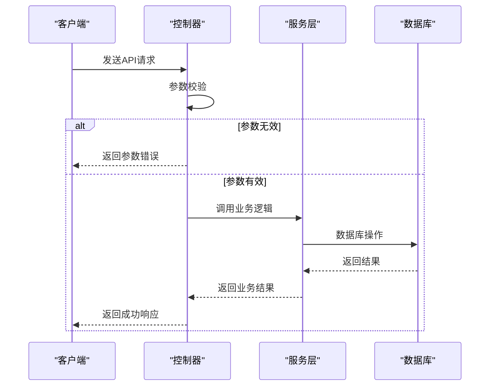

# 后台管理API

<cite>
**本文档引用文件**   
- [NewBeeMallGoodsController.java](file://src/main/java/ltd/newbee/mall/controller/admin/NewBeeMallGoodsController.java)
- [NewBeeMallOrderController.java](file://src/main/java/ltd/newbee/mall/controller/admin/NewBeeMallOrderController.java)
- [NewBeeMallUserController.java](file://src/main/java/ltd/newbee/mall/controller/admin/NewBeeMallUserController.java)
- [NewBeeMallCarouselController.java](file://src/main/java/ltd/newbee/mall/controller/admin/NewBeeMallCarouselController.java)
- [NewBeeMallGoodsCategoryController.java](file://src/main/java/ltd/newbee/mall/controller/admin/NewBeeMallGoodsCategoryController.java)
- [AdminController.java](file://src/main/java/ltd/newbee/mall/controller/admin/AdminController.java)
- [AdminLoginInterceptor.java](file://src/main/java/ltd/newbee/mall/interceptor/AdminLoginInterceptor.java)
- [NewBeeMallGoods.java](file://src/main/java/ltd/newbee/mall/entity/NewBeeMallGoods.java)
- [NewBeeMallOrder.java](file://src/main/java/ltd/newbee/mall/entity/NewBeeMallOrder.java)
- [PageResult.java](file://src/main/java/ltd/newbee/mall/util/PageResult.java)
- [Result.java](file://src/main/java/ltd/newbee/mall/util/Result.java)
- [Constants.java](file://src/main/java/ltd/newbee/mall/common/Constants.java)
- [API.md](file://docs/API.md)
</cite>

## 目录
1. [简介](#简介)
2. [管理员认证](#管理员认证)
3. [商品管理](#商品管理)
4. [订单管理](#订单管理)
5. [轮播图管理](#轮播图管理)
6. [分类管理](#分类管理)
7. [用户管理](#用户管理)
8. [公共响应结构](#公共响应结构)
9. [错误处理](#错误处理)

## 简介
本API文档详细描述了newbee-mall后台管理系统的核心功能接口，涵盖商品管理、订单处理、轮播图配置、分类维护和用户管理等后台功能。所有接口均以`/admin`为前缀，采用JSON格式进行数据交换，通过Session机制实现管理员身份认证。

**基础信息**
- 基础URL: http://localhost:28089
- 编码格式: UTF-8
- 响应格式: JSON
- 认证方式: 基于Session的Cookie认证

## 管理员认证
管理员认证系统通过用户名、密码和验证码三重验证机制确保系统安全。认证成功后，系统会创建Session并维护管理员登录状态。

### 管理员登录
管理员登录接口验证用户身份信息，成功后创建Session会话。

**接口信息**
- **HTTP方法**: POST
- **URL**: `/admin/login`
- **认证要求**: 无需认证

**请求参数**
| 参数名 | 类型 | 必填 | 说明 |
|--------|------|------|------|
| userName | String | 是 | 管理员用户名 |
| password | String | 是 | 密码（MD5加密） |
| verifyCode | String | 是 | 验证码 |

**成功响应示例**
```json
{
  "resultCode": 200,
  "message": "success"
}
```

**失败响应示例**
```json
{
  "resultCode": 500,
  "message": "验证码错误"
}
```

### 管理员登出
清除管理员Session会话，实现安全退出。

**接口信息**
- **HTTP方法**: GET
- **URL**: `/admin/logout`
- **认证要求**: 需要认证

**响应说明**
- 成功：重定向到登录页面
- 失败：返回当前页面

### 个人资料管理
管理员可以查看和修改个人资料信息。

**接口信息**
- **HTTP方法**: GET
- **URL**: `/admin/profile`
- **认证要求**: 需要认证

**修改密码接口**
- **HTTP方法**: POST
- **URL**: `/admin/profile/password`
- **请求参数**: originalPassword（原密码）、newPassword（新密码）

**修改用户名接口**
- **HTTP方法**: POST
- **URL**: `/admin/profile/name`
- **请求参数**: loginUserName（登录名）、nickName（昵称）

**Section sources**
- [AdminController.java](file://src/main/java/ltd/newbee/mall/controller/admin/AdminController.java#L37-L139)

## 商品管理
商品管理模块提供商品的增删改查、上下架等操作，是后台系统的核心功能之一。

### 商品列表查询
获取分页的商品列表数据，支持按名称和状态筛选。

**接口信息**
- **HTTP方法**: GET
- **URL**: `/admin/goods/list`
- **认证要求**: 需要认证

**请求参数**
| 参数名 | 类型 | 必填 | 说明 |
|--------|------|------|------|
| page | Integer | 是 | 当前页码 |
| limit | Integer | 是 | 每页数量 |
| goodsName | String | 否 | 商品名称（模糊查询） |
| goodsSellStatus | Integer | 否 | 上架状态（0:上架, 1:下架） |

**响应结构**
```json
{
  "resultCode": 200,
  "message": "success",
  "data": {
    "totalCount": 100,
    "pageSize": 10,
    "totalPage": 10,
    "currPage": 1,
    "list": [
      {
        "goodsId": 1,
        "goodsName": "商品名称",
        "originalPrice": 100,
        "sellingPrice": 80,
        "stockNum": 999,
        "goodsSellStatus": 0,
        "createTime": "2023-01-01 12:00:00"
      }
    ]
  }
}
```

### 添加商品
创建新的商品信息。

**接口信息**
- **HTTP方法**: POST
- **URL**: `/admin/goods/save`
- **认证要求**: 需要认证

**请求参数**
| 参数名 | 类型 | 必填 | 说明 |
|--------|------|------|------|
| goodsName | String | 是 | 商品名称 |
| goodsIntro | String | 是 | 商品简介 |
| goodsCategoryId | Long | 是 | 分类ID |
| goodsCoverImg | String | 是 | 封面图URL |
| originalPrice | Integer | 是 | 原价 |
| sellingPrice | Integer | 是 | 售价 |
| stockNum | Integer | 是 | 库存数量 |
| tag | String | 否 | 标签 |
| goodsSellStatus | Byte | 是 | 上架状态 |
| goodsDetailContent | String | 是 | 商品详情（HTML） |

**成功响应**
```json
{
  "resultCode": 200,
  "message": "保存成功"
}
```

### 修改商品
更新现有商品信息。

**接口信息**
- **HTTP方法**: POST
- **URL**: `/admin/goods/update`
- **认证要求**: 需要认证

**请求参数**
- 包含`goodsId`在内的所有商品信息字段

### 批量上下架
批量修改商品的上架状态。

**接口信息**
- **HTTP方法**: PUT
- **URL**: `/admin/goods/status/{sellStatus}`
- **认证要求**: 需要认证

**路径参数**
- **sellStatus**: 上架状态（0:上架, 1:下架）

**请求体参数**
- **ids**: 商品ID数组

**成功响应**
```json
{
  "resultCode": 200,
  "message": "修改成功"
}
```

**Section sources**
- [NewBeeMallGoodsController.java](file://src/main/java/ltd/newbee/mall/controller/admin/NewBeeMallGoodsController.java#L50-L228)
- [NewBeeMallGoods.java](file://src/main/java/ltd/newbee/mall/entity/NewBeeMallGoods.java#L1-L202)
- [Constants.java](file://src/main/java/ltd/newbee/mall/common/Constants.java#L44-L45)

## 订单管理
订单管理模块提供订单的查询、详情查看和状态变更功能。

### 订单列表查询
获取分页的订单列表数据。

**接口信息**
- **HTTP方法**: GET
- **URL**: `/admin/orders/list`
- **认证要求**: 需要认证

**请求参数**
| 参数名 | 类型 | 必填 | 说明 |
|--------|------|------|------|
| page | Integer | 是 | 当前页码 |
| limit | Integer | 是 | 每页数量 |
| orderNo | String | 否 | 订单号 |
| orderStatus | Integer | 否 | 订单状态 |

**响应结构**
```json
{
  "resultCode": 200,
  "message": "success",
  "data": {
    "totalCount": 50,
    "currPage": 1,
    "list": [
      {
        "orderId": 1,
        "orderNo": "202301010001",
        "totalPrice": 100,
        "orderStatus": 1,
        "payStatus": 1,
        "userAddress": "收货地址",
        "createTime": "2023-01-01 12:00:00"
      }
    ]
  }
}
```

### 订单详情
获取订单的详细信息，包括订单项。

**接口信息**
- **HTTP方法**: GET
- **URL**: `/admin/order-items/{id}`
- **认证要求**: 需要认证

**路径参数**
- **id**: 订单ID

**响应结构**
```json
{
  "resultCode": 200,
  "message": "success",
  "data": [
    {
      "goodsId": 1,
      "goodsName": "商品名称",
      "goodsCoverImg": "/upload/xxx.jpg",
      "sellingPrice": 80,
      "goodsCount": 1
    }
  ]
}
```

### 批量配货
将订单状态更新为"已配货"。

**接口信息**
- **HTTP方法**: POST
- **URL**: `/admin/orders/checkDone`
- **认证要求**: 需要认证

**请求参数**
- **ids**: 订单ID数组

### 批量出库
将订单状态更新为"已出库"。

**接口信息**
- **HTTP方法**: POST
- **URL**: `/admin/orders/checkOut`
- **认证要求**: 需要认证

### 关闭订单
关闭指定的订单。

**接口信息**
- **HTTP方法**: POST
- **URL**: `/admin/orders/close`
- **认证要求**: 需要认证

**Section sources**
- [NewBeeMallOrderController.java](file://src/main/java/ltd/newbee/mall/controller/admin/NewBeeMallOrderController.java#L43-L148)
- [NewBeeMallOrder.java](file://src/main/java/ltd/newbee/mall/entity/NewBeeMallOrder.java#L1-L169)

## 轮播图管理
轮播图管理模块提供轮播图的增删改查功能。

### 轮播图列表
获取分页的轮播图列表。

**接口信息**
- **HTTP方法**: GET
- **URL**: `/admin/carousels/list`
- **认证要求**: 需要认证

### 添加轮播图
创建新的轮播图。

**接口信息**
- **HTTP方法**: POST
- **URL**: `/admin/carousels/save`
- **认证要求**: 需要认证

**请求参数**
| 参数名 | 类型 | 必填 | 说明 |
|--------|------|------|------|
| carouselUrl | String | 是 | 图片URL |
| redirectUrl | String | 是 | 跳转URL |
| carouselRank | Integer | 是 | 排序值 |

### 修改轮播图
更新轮播图信息。

**接口信息**
- **HTTP方法**: POST
- **URL**: `/admin/carousels/update`
- **认证要求**: 需要认证

### 删除轮播图
批量删除轮播图。

**接口信息**
- **HTTP方法**: POST
- **URL**: `/admin/carousels/delete`
- **认证要求**: 需要认证

**请求参数**
- **ids**: 轮播图ID数组

**Section sources**
- [NewBeeMallCarouselController.java](file://src/main/java/ltd/newbee/mall/controller/admin/NewBeeMallCarouselController.java#L40-L126)

## 分类管理
分类管理模块提供商品分类的增删改查功能。

### 分类列表
获取分页的分类列表。

**接口信息**
- **HTTP方法**: GET
- **URL**: `/admin/categories/list`
- **认证要求**: 需要认证

**请求参数**
| 参数名 | 类型 | 必填 | 说明 |
|--------|------|------|------|
| page | Integer | 是 | 当前页码 |
| limit | Integer | 是 | 每页数量 |
| categoryLevel | Byte | 是 | 分类级别（1/2/3） |
| parentId | Long | 是 | 父分类ID |

### 添加分类
创建新的商品分类。

**接口信息**
- **HTTP方法**: POST
- **URL**: `/admin/categories/save`
- **认证要求**: 需要认证

**请求参数**
| 参数名 | 类型 | 必填 | 说明 |
|--------|------|------|------|
| categoryLevel | Byte | 是 | 分类级别 |
| categoryName | String | 是 | 分类名称 |
| parentId | Long | 是 | 父分类ID |
| categoryRank | Integer | 是 | 排序值 |

### 修改分类
更新分类信息。

**接口信息**
- **HTTP方法**: POST
- **URL**: `/admin/categories/update`
- **认证要求**: 需要认证

### 删除分类
批量删除分类。

**接口信息**
- **HTTP方法**: POST
- **URL**: `/admin/categories/delete`
- **认证要求**: 需要认证

**Section sources**
- [NewBeeMallGoodsCategoryController.java](file://src/main/java/ltd/newbee/mall/controller/admin/NewBeeMallGoodsCategoryController.java#L42-L173)

## 用户管理
用户管理模块提供会员的查询和状态管理功能。

### 用户列表
获取分页的用户列表。

**接口信息**
- **HTTP方法**: GET
- **URL**: `/admin/users/list`
- **认证要求**: 需要认证

### 用户状态管理
批量禁用或解禁用户。

**接口信息**
- **HTTP方法**: POST
- **URL**: `/admin/users/lock/{lockStatus}`
- **认证要求**: 需要认证

**路径参数**
- **lockStatus**: 锁定状态（0:正常, 1:锁定）

**请求参数**
- **ids**: 用户ID数组

**Section sources**
- [NewBeeMallUserController.java](file://src/main/java/ltd/newbee/mall/controller/admin/NewBeeMallUserController.java#L37-L74)

## 公共响应结构
所有API接口遵循统一的响应格式，便于前端处理。

### 分页响应结构
```json
{
  "resultCode": 200,
  "message": "success",
  "data": {
    "totalCount": 100,
    "pageSize": 10,
    "totalPage": 10,
    "currPage": 1,
    "list": []
  }
}
```

**字段说明**
| 字段名 | 类型 | 说明 |
|--------|------|------|
| resultCode | Integer | 状态码（200:成功, 500:失败） |
| message | String | 响应消息 |
| data | Object | 响应数据 |
| totalCount | Integer | 总记录数 |
| pageSize | Integer | 每页数量 |
| totalPage | Integer | 总页数 |
| currPage | Integer | 当前页码 |
| list | Array | 数据列表 |

### 成功响应
```json
{
  "resultCode": 200,
  "message": "success"
}
```

### 失败响应
```json
{
  "resultCode": 500,
  "message": "参数异常！"
}
```

**Section sources**
- [PageResult.java](file://src/main/java/ltd/newbee/mall/util/PageResult.java#L1-L84)
- [Result.java](file://src/main/java/ltd/newbee/mall/util/Result.java#L1-L58)

## 错误处理
系统采用统一的错误处理机制，确保API的稳定性和可预测性。

### 参数校验
所有接口都会对请求参数进行严格校验，包括：
- 必填字段检查
- 数据类型验证
- 数值范围检查
- 字符串长度限制

### 业务逻辑错误
当业务逻辑冲突时，系统会返回相应的错误信息：
- 商品已下架
- 订单不存在
- 库存不足
- 状态变更非法

### 权限控制
通过拦截器实现权限控制，未登录用户访问受保护接口时：
- 返回401状态码
- 重定向到登录页面
- 清除无效Session



**Diagram sources**
- [AdminLoginInterceptor.java](file://src/main/java/ltd/newbee/mall/interceptor/AdminLoginInterceptor.java#L27-L51)
- [NewBeeMallGoodsController.java](file://src/main/java/ltd/newbee/mall/controller/admin/NewBeeMallGoodsController.java#L135-L143)

**Section sources**
- [NewBeeMallExceptionHandler.java](file://src/main/java/ltd/newbee/mall/controller/common/NewBeeMallExceptionHandler.java)
- [ServiceResultEnum.java](file://src/main/java/ltd/newbee/mall/common/ServiceResultEnum.java)