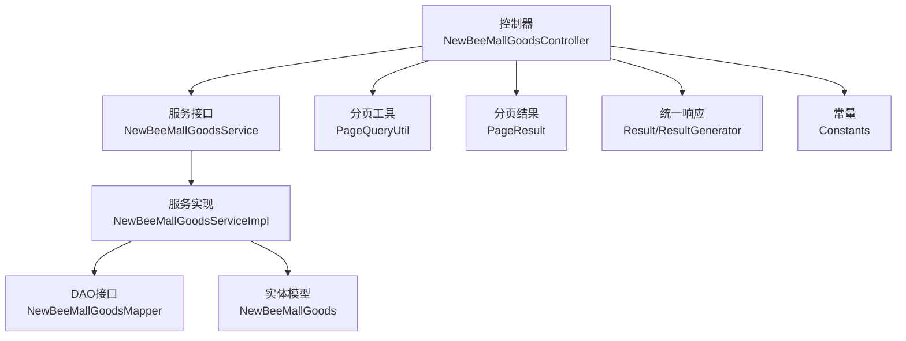
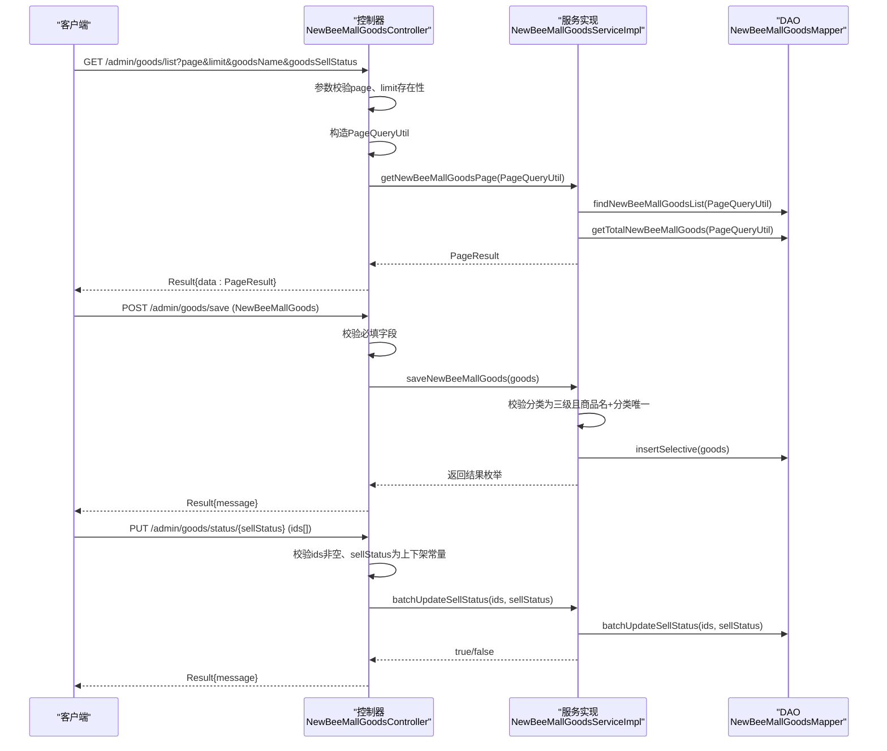
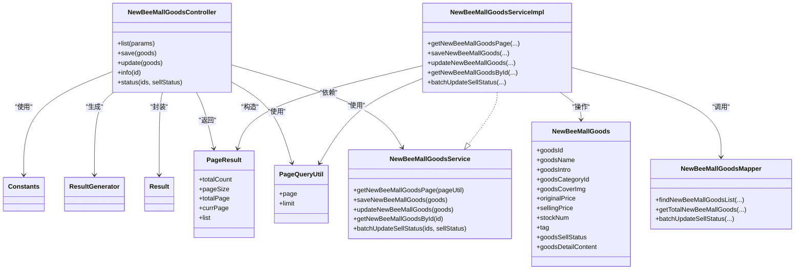

# 商品管理API

<cite>
**本文引用的文件**
- [NewBeeMallGoodsController.java](file://src/main/java/ltd/newbee/mall/controller/admin/NewBeeMallGoodsController.java)
- [NewBeeMallGoodsService.java](file://src/main/java/ltd/newbee/mall/service/NewBeeMallGoodsService.java)
- [NewBeeMallGoodsServiceImpl.java](file://src/main/java/ltd/newbee/mall/service/impl/NewBeeMallGoodsServiceImpl.java)
- [NewBeeMallGoods.java](file://src/main/java/ltd/newbee/mall/entity/NewBeeMallGoods.java)
- [PageQueryUtil.java](file://src/main/java/ltd/newbee/mall/util/PageQueryUtil.java)
- [PageResult.java](file://src/main/java/ltd/newbee/mall/util/PageResult.java)
- [Result.java](file://src/main/java/ltd/newbee/mall/util/Result.java)
- [ResultGenerator.java](file://src/main/java/ltd/newbee/mall/util/ResultGenerator.java)
- [Constants.java](file://src/main/java/ltd/newbee/mall/common/Constants.java)
- [NewBeeMallGoodsMapper.java](file://src/main/java/ltd/newbee/mall/dao/NewBeeMallGoodsMapper.java)
- [API.md](file://docs/API.md)
</cite>

## 目录
1. [简介](#简介)
2. [项目结构](#项目结构)
3. [核心组件](#核心组件)
4. [架构总览](#架构总览)
5. [详细组件分析](#详细组件分析)
6. [依赖关系分析](#依赖关系分析)
7. [性能与分页特性](#性能与分页特性)
8. [故障排查指南](#故障排查指南)
9. [结论](#结论)
10. [附录](#附录)

## 简介
本文件聚焦于newbee-mall后台商品管理模块的API设计与实现，围绕以下目标展开：
- 商品列表查询接口（/admin/goods/list）的分页参数与返回结构
- 添加商品（/admin/goods/save）与修改商品（/admin/goods/update）的请求体参数及校验规则
- 批量上架/下架接口（/admin/goods/status/{sellStatus}）的实现机制
- 结合控制器分析商品详情获取（/admin/goods/info/{id}）的业务逻辑
- 成功与失败响应的JSON示例，常见错误场景说明

## 项目结构
商品管理API位于后台控制器层，采用标准的MVC分层：
- 控制器层：处理HTTP请求、参数校验、调用服务层、封装统一响应
- 服务层：业务编排、领域规则校验、调用DAO层
- 数据访问层：MyBatis Mapper接口，执行SQL查询与更新
- 工具与模型：分页工具、统一响应结构、实体模型

图表来源
- [NewBeeMallGoodsController.java](file://src/main/java/ltd/newbee/mall/controller/admin/NewBeeMallGoodsController.java#L132-L228)
- [NewBeeMallGoodsService.java](file://src/main/java/ltd/newbee/mall/service/NewBeeMallGoodsService.java#L17-L74)
- [NewBeeMallGoodsServiceImpl.java](file://src/main/java/ltd/newbee/mall/service/impl/NewBeeMallGoodsServiceImpl.java#L32-L139)
- [NewBeeMallGoodsMapper.java](file://src/main/java/ltd/newbee/mall/dao/NewBeeMallGoodsMapper.java#L18-L53)
- [NewBeeMallGoods.java](file://src/main/java/ltd/newbee/mall/entity/NewBeeMallGoods.java#L16-L176)
- [PageQueryUtil.java](file://src/main/java/ltd/newbee/mall/util/PageQueryUtil.java#L14-L56)
- [PageResult.java](file://src/main/java/ltd/newbee/mall/util/PageResult.java#L14-L84)
- [Result.java](file://src/main/java/ltd/newbee/mall/util/Result.java#L11-L58)
- [ResultGenerator.java](file://src/main/java/ltd/newbee/mall/util/ResultGenerator.java#L13-L59)
- [Constants.java](file://src/main/java/ltd/newbee/mall/common/Constants.java#L18-L48)

章节来源
- [NewBeeMallGoodsController.java](file://src/main/java/ltd/newbee/mall/controller/admin/NewBeeMallGoodsController.java#L132-L228)
- [API.md](file://docs/API.md#L571-L667)

## 核心组件
- 控制器：负责接收HTTP请求、参数校验、调用服务层、返回统一响应
- 服务接口与实现：封装业务规则（如分类必须为三级、同名同分类唯一性、库存与价格单位等）、调用DAO
- 实体模型：承载商品字段（名称、简介、封面图、原价、售价、库存、标签、销售状态、详情内容等）
- 分页工具与结果：将page、limit转换为数据库偏移量，构造PageResult返回
- 统一响应：Result与ResultGenerator统一封装响应码、消息与数据

章节来源
- [NewBeeMallGoodsController.java](file://src/main/java/ltd/newbee/mall/controller/admin/NewBeeMallGoodsController.java#L132-L228)
- [NewBeeMallGoodsService.java](file://src/main/java/ltd/newbee/mall/service/NewBeeMallGoodsService.java#L17-L74)
- [NewBeeMallGoodsServiceImpl.java](file://src/main/java/ltd/newbee/mall/service/impl/NewBeeMallGoodsServiceImpl.java#L32-L139)
- [NewBeeMallGoods.java](file://src/main/java/ltd/newbee/mall/entity/NewBeeMallGoods.java#L16-L176)
- [PageQueryUtil.java](file://src/main/java/ltd/newbee/mall/util/PageQueryUtil.java#L14-L56)
- [PageResult.java](file://src/main/java/ltd/newbee/mall/util/PageResult.java#L14-L84)
- [Result.java](file://src/main/java/ltd/newbee/mall/util/Result.java#L11-L58)
- [ResultGenerator.java](file://src/main/java/ltd/newbee/mall/util/ResultGenerator.java#L13-L59)

## 架构总览
商品管理API的典型调用链如下：

图表来源
- [NewBeeMallGoodsController.java](file://src/main/java/ltd/newbee/mall/controller/admin/NewBeeMallGoodsController.java#L132-L228)
- [NewBeeMallGoodsServiceImpl.java](file://src/main/java/ltd/newbee/mall/service/impl/NewBeeMallGoodsServiceImpl.java#L32-L139)
- [NewBeeMallGoodsMapper.java](file://src/main/java/ltd/newbee/mall/dao/NewBeeMallGoodsMapper.java#L18-L53)
- [Constants.java](file://src/main/java/ltd/newbee/mall/common/Constants.java#L44-L46)

## 详细组件分析

### 商品列表查询 /admin/goods/list
- 请求方法与路径
  - GET /admin/goods/list
- 查询参数
  - page：当前页码（整数，必填）
  - limit：每页记录数（整数，必填）
  - goodsName：商品名称（可选，模糊查询）
  - goodsSellStatus：销售状态（可选，0上架/1下架）
- 参数校验
  - 控制器对page与limit进行存在性校验；若缺失则返回“参数异常”
- 分页实现
  - 使用PageQueryUtil将page、limit转换为数据库偏移量与起止位置
  - 服务层调用Mapper查询列表与总数，构造PageResult
- 返回结构
  - Result包装，data为PageResult
  - PageResult包含：totalCount、pageSize、totalPage、currPage、list
- 示例响应
  - 成功时data为PageResult对象，包含列表与分页元信息
  - 失败时返回统一错误响应

章节来源
- [NewBeeMallGoodsController.java](file://src/main/java/ltd/newbee/mall/controller/admin/NewBeeMallGoodsController.java#L132-L143)
- [PageQueryUtil.java](file://src/main/java/ltd/newbee/mall/util/PageQueryUtil.java#L14-L56)
- [NewBeeMallGoodsServiceImpl.java](file://src/main/java/ltd/newbee/mall/service/impl/NewBeeMallGoodsServiceImpl.java#L40-L46)
- [NewBeeMallGoodsMapper.java](file://src/main/java/ltd/newbee/mall/dao/NewBeeMallGoodsMapper.java#L35-L37)
- [PageResult.java](file://src/main/java/ltd/newbee/mall/util/PageResult.java#L14-L84)
- [API.md](file://docs/API.md#L579-L599)

### 添加商品 /admin/goods/save
- 请求方法与路径
  - POST /admin/goods/save
- 请求体参数（NewBeeMallGoods）
  - goodsName：字符串，必填
  - goodsIntro：字符串，必填
  - goodsCategoryId：Long，必填（必须为三级分类）
  - goodsCoverImg：字符串，必填
  - originalPrice：Integer，必填（单位：分）
  - sellingPrice：Integer，必填（单位：分）
  - stockNum：Integer，必填（库存数量）
  - tag：字符串，可选
  - goodsSellStatus：Byte，必填（0上架/1下架）
  - goodsDetailContent：字符串，必填（富文本详情）
- 参数校验
  - 控制器侧：对关键字段进行非空校验，缺失则返回“参数异常”
  - 服务侧：校验分类是否存在且为三级分类；校验同分类下商品名唯一；清理输入字符串
- 业务逻辑
  - 插入商品记录，返回服务结果枚举
- 响应
  - 成功：Result{message: "SUCCESS"}
  - 失败：Result{message: 具体错误信息或枚举描述}

章节来源
- [NewBeeMallGoodsController.java](file://src/main/java/ltd/newbee/mall/controller/admin/NewBeeMallGoodsController.java#L148-L169)
- [NewBeeMallGoodsServiceImpl.java](file://src/main/java/ltd/newbee/mall/service/impl/NewBeeMallGoodsServiceImpl.java#L48-L65)
- [NewBeeMallGoods.java](file://src/main/java/ltd/newbee/mall/entity/NewBeeMallGoods.java#L16-L176)
- [API.md](file://docs/API.md#L607-L628)

### 修改商品 /admin/goods/update
- 请求方法与路径
  - POST /admin/goods/update
- 请求体参数（NewBeeMallGoods）
  - goodsId：Long，必填（用于定位待修改商品）
  - 其余字段与添加一致（goodsName、goodsIntro、goodsCategoryId、goodsCoverImg、originalPrice、sellingPrice、stockNum、tag、goodsSellStatus、goodsDetailContent）
- 参数校验
  - 控制器侧：除goodsId外，其余字段均需非空
  - 服务侧：校验分类为三级；校验商品存在；校验同分类下商品名唯一（排除自身）
- 业务逻辑
  - 更新商品记录，设置更新时间，返回服务结果枚举
- 响应
  - 成功：Result{message: "SUCCESS"}
  - 失败：Result{message: 具体错误信息或枚举描述}

章节来源
- [NewBeeMallGoodsController.java](file://src/main/java/ltd/newbee/mall/controller/admin/NewBeeMallGoodsController.java#L175-L197)
- [NewBeeMallGoodsServiceImpl.java](file://src/main/java/ltd/newbee/mall/service/impl/NewBeeMallGoodsServiceImpl.java#L74-L98)
- [API.md](file://docs/API.md#L636-L644)

### 批量上架/下架 /admin/goods/status/{sellStatus}
- 请求方法与路径
  - PUT /admin/goods/status/{sellStatus}
- 路径参数
  - sellStatus：整数，0表示下架，1表示上架
- 请求体
  - ids：Long[]，商品ID数组（必填）
- 参数校验
  - 控制器侧：校验ids长度大于0；校验sellStatus仅允许0/1
- 业务逻辑
  - 调用服务层批量更新销售状态，底层通过Mapper执行批量更新
- 响应
  - 成功：Result{message: "SUCCESS"}
  - 失败：Result{message: "修改失败" 或具体错误信息}

章节来源
- [NewBeeMallGoodsController.java](file://src/main/java/ltd/newbee/mall/controller/admin/NewBeeMallGoodsController.java#L210-L226)
- [NewBeeMallGoodsServiceImpl.java](file://src/main/java/ltd/newbee/mall/service/impl/NewBeeMallGoodsServiceImpl.java#L109-L112)
- [NewBeeMallGoodsMapper.java](file://src/main/java/ltd/newbee/mall/dao/NewBeeMallGoodsMapper.java#L51-L51)
- [Constants.java](file://src/main/java/ltd/newbee/mall/common/Constants.java#L44-L46)
- [API.md](file://docs/API.md#L652-L665)

### 商品详情获取 /admin/goods/info/{id}
- 请求方法与路径
  - GET /admin/goods/info/{id}
- 路径参数
  - id：Long，商品ID
- 业务逻辑
  - 服务层按ID查询商品；若不存在则抛出异常
  - 控制器返回Result包裹商品实体
- 响应
  - 成功：Result{data: 商品实体}
  - 失败：Result{message: 具体错误信息}

章节来源
- [NewBeeMallGoodsController.java](file://src/main/java/ltd/newbee/mall/controller/admin/NewBeeMallGoodsController.java#L200-L207)
- [NewBeeMallGoodsServiceImpl.java](file://src/main/java/ltd/newbee/mall/service/impl/NewBeeMallGoodsServiceImpl.java#L100-L107)

## 依赖关系分析
- 控制器依赖服务接口与工具类（分页、响应），并使用常量定义销售状态
- 服务实现依赖DAO接口与实体模型，负责业务规则与数据清洗
- DAO接口定义分页查询、统计、批量更新等能力
- 统一响应Result与ResultGenerator提供一致的返回结构

图表来源
- [NewBeeMallGoodsController.java](file://src/main/java/ltd/newbee/mall/controller/admin/NewBeeMallGoodsController.java#L132-L228)
- [NewBeeMallGoodsService.java](file://src/main/java/ltd/newbee/mall/service/NewBeeMallGoodsService.java#L17-L74)
- [NewBeeMallGoodsServiceImpl.java](file://src/main/java/ltd/newbee/mall/service/impl/NewBeeMallGoodsServiceImpl.java#L32-L139)
- [NewBeeMallGoodsMapper.java](file://src/main/java/ltd/newbee/mall/dao/NewBeeMallGoodsMapper.java#L18-L53)
- [NewBeeMallGoods.java](file://src/main/java/ltd/newbee/mall/entity/NewBeeMallGoods.java#L16-L176)
- [PageQueryUtil.java](file://src/main/java/ltd/newbee/mall/util/PageQueryUtil.java#L14-L56)
- [PageResult.java](file://src/main/java/ltd/newbee/mall/util/PageResult.java#L14-L84)
- [Result.java](file://src/main/java/ltd/newbee/mall/util/Result.java#L11-L58)
- [ResultGenerator.java](file://src/main/java/ltd/newbee/mall/util/ResultGenerator.java#L13-L59)
- [Constants.java](file://src/main/java/ltd/newbee/mall/common/Constants.java#L44-L46)

## 性能与分页特性
- 分页参数
  - page、limit由PageQueryUtil解析并计算起始偏移，避免一次性加载全量数据
- 查询优化
  - 服务层分别查询列表与总数，构造PageResult，便于前端分页展示
- 批量操作
  - 批量上架/下架通过Mapper的批量更新减少网络往返与事务开销
- 数据类型与精度
  - 价格字段为Integer（单位：分），库存为Integer，避免浮点误差与跨语言精度问题

章节来源
- [PageQueryUtil.java](file://src/main/java/ltd/newbee/mall/util/PageQueryUtil.java#L14-L56)
- [NewBeeMallGoodsServiceImpl.java](file://src/main/java/ltd/newbee/mall/service/impl/NewBeeMallGoodsServiceImpl.java#L40-L46)
- [NewBeeMallGoodsMapper.java](file://src/main/java/ltd/newbee/mall/dao/NewBeeMallGoodsMapper.java#L51-L51)
- [NewBeeMallGoods.java](file://src/main/java/ltd/newbee/mall/entity/NewBeeMallGoods.java#L28-L36)

## 故障排查指南
- 参数校验失败
  - 缺少page或limit：返回“参数异常”
  - 缺少必填字段（添加/修改接口）：返回“参数异常”
- 销售状态非法
  - sellStatus非0/1：返回“状态异常”
- 商品不存在
  - 详情查询或修改时未找到对应商品：抛出异常并返回相应错误信息
- 分类无效或非三级分类
  - 添加/修改时分类不存在或非三级分类：返回分类错误提示
- 同名同分类重复
  - 添加/修改时同分类下已存在同名商品：返回重复提示
- 数据库异常
  - 插入/更新失败：返回数据库错误提示

章节来源
- [NewBeeMallGoodsController.java](file://src/main/java/ltd/newbee/mall/controller/admin/NewBeeMallGoodsController.java#L138-L143)
- [NewBeeMallGoodsController.java](file://src/main/java/ltd/newbee/mall/controller/admin/NewBeeMallGoodsController.java#L175-L197)
- [NewBeeMallGoodsController.java](file://src/main/java/ltd/newbee/mall/controller/admin/NewBeeMallGoodsController.java#L210-L226)
- [NewBeeMallGoodsServiceImpl.java](file://src/main/java/ltd/newbee/mall/service/impl/NewBeeMallGoodsServiceImpl.java#L48-L65)
- [NewBeeMallGoodsServiceImpl.java](file://src/main/java/ltd/newbee/mall/service/impl/NewBeeMallGoodsServiceImpl.java#L74-L98)
- [NewBeeMallGoodsServiceImpl.java](file://src/main/java/ltd/newbee/mall/service/impl/NewBeeMallGoodsServiceImpl.java#L100-L107)

## 结论
- 商品管理API在控制器层完成参数校验与统一响应封装，在服务层落实业务规则与数据一致性，在DAO层承担数据持久化
- 分页查询通过PageQueryUtil与PageResult实现高效、稳定的分页体验
- 批量上架/下架接口通过批量更新提升操作效率
- 建议在前端严格传入page与limit，避免参数缺失；在添加/修改时确保分类为三级且商品名唯一

## 附录

### API定义与示例

- 商品列表 /admin/goods/list
  - 方法：GET
  - 参数：page、limit、goodsName（可选）、goodsSellStatus（可选）
  - 响应：Result{data: PageResult{totalCount, currPage, list}}
  - 示例参考：[API.md](file://docs/API.md#L579-L599)

- 添加商品 /admin/goods/save
  - 方法：POST
  - 请求体：NewBeeMallGoods（必填字段见“添加商品”章节）
  - 响应：Result{message}
  - 示例参考：[API.md](file://docs/API.md#L607-L628)

- 修改商品 /admin/goods/update
  - 方法：POST
  - 请求体：NewBeeMallGoods（含goodsId）
  - 响应：Result{message}
  - 示例参考：[API.md](file://docs/API.md#L636-L644)

- 批量上架/下架 /admin/goods/status/{sellStatus}
  - 方法：PUT
  - 路径参数：sellStatus（0/1）
  - 请求体：ids（Long[]）
  - 响应：Result{message}
  - 示例参考：[API.md](file://docs/API.md#L652-L665)

- 商品详情 /admin/goods/info/{id}
  - 方法：GET
  - 路径参数：id（Long）
  - 响应：Result{data: 商品实体}
  - 示例参考：[API.md](file://docs/API.md#L579-L599)