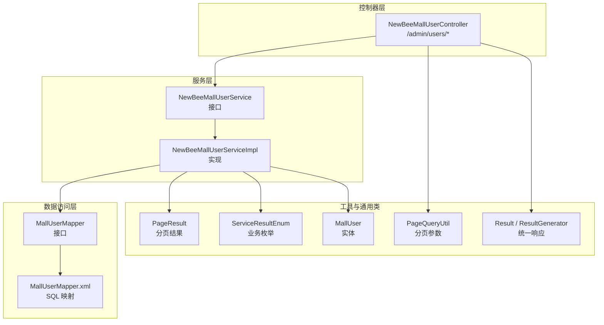
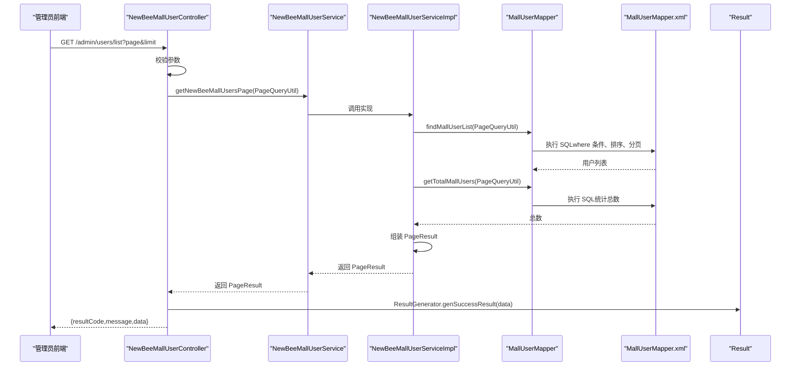
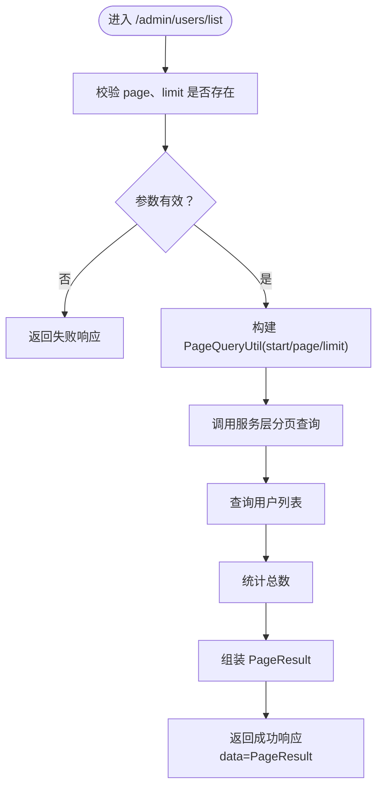
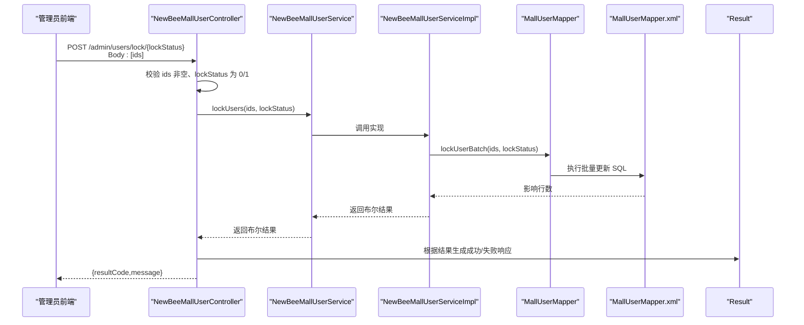
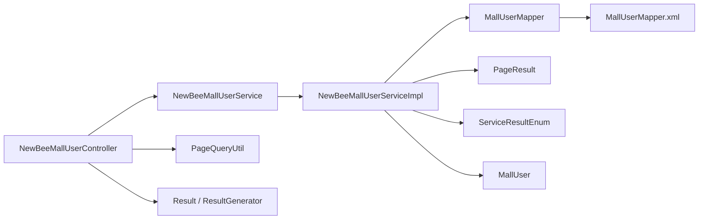

# 用户管理API

<cite>
**本文引用的文件**
- [NewBeeMallUserController.java](file://src/main/java/ltd/newbee/mall/controller/admin/NewBeeMallUserController.java)
- [NewBeeMallUserService.java](file://src/main/java/ltd/newbee/mall/service/NewBeeMallUserService.java)
- [NewBeeMallUserServiceImpl.java](file://src/main/java/ltd/newbee/mall/service/impl/NewBeeMallUserServiceImpl.java)
- [MallUserMapper.java](file://src/main/java/ltd/newbee/mall/dao/MallUserMapper.java)
- [MallUserMapper.xml](file://src/main/resources/mapper/MallUserMapper.xml)
- [PageQueryUtil.java](file://src/main/java/ltd/newbee/mall/util/PageQueryUtil.java)
- [PageResult.java](file://src/main/java/ltd/newbee/mall/util/PageResult.java)
- [Result.java](file://src/main/java/ltd/newbee/mall/util/Result.java)
- [ResultGenerator.java](file://src/main/java/ltd/newbee/mall/util/ResultGenerator.java)
- [ServiceResultEnum.java](file://src/main/java/ltd/newbee/mall/common/ServiceResultEnum.java)
- [MallUser.java](file://src/main/java/ltd/newbee/mall/entity/MallUser.java)
- [newbee_mall_user.js](file://src/main/resources/static/admin/dist/js/newbee_mall_user.js)
- [newbee_mall_user.html](file://src/main/resources/templates/admin/newbee_mall_user.html)
</cite>

## 目录
1. [简介](#简介)
2. [项目结构](#项目结构)
3. [核心组件](#核心组件)
4. [架构总览](#架构总览)
5. [详细组件分析](#详细组件分析)
6. [依赖关系分析](#依赖关系分析)
7. [性能考量](#性能考量)
8. [故障排查指南](#故障排查指南)
9. [结论](#结论)
10. [附录：接口规范与示例](#附录接口规范与示例)

## 简介
本文件为 newbee-mall 后台用户管理模块的完整 API 文档，聚焦以下接口：
- 用户列表分页查询：/admin/users/list
- 用户状态批量锁定/解锁：/admin/users/lock/{lockStatus}
- 用户信息修改（后台侧）：/admin/users/update（基于现有服务方法）
- 用户详情获取（基于现有服务方法）

文档将从架构、数据流、处理逻辑、参数校验、错误处理、性能与可维护性等方面进行深入解析，并提供请求示例、成功响应格式与常见错误场景说明。

## 项目结构
用户管理相关代码采用典型的分层架构：
- 控制器层：负责接收 HTTP 请求、参数校验与响应封装
- 服务层：定义业务契约与事务边界
- 实现层：具体业务逻辑与数据库交互
- 数据访问层：MyBatis 映射文件与 Mapper 接口
- 工具与通用类：分页参数、分页结果、统一响应体、枚举等

图表来源
- [NewBeeMallUserController.java](file://src/main/java/ltd/newbee/mall/controller/admin/NewBeeMallUserController.java#L37-L74)
- [NewBeeMallUserService.java](file://src/main/java/ltd/newbee/mall/service/NewBeeMallUserService.java#L18-L62)
- [NewBeeMallUserServiceImpl.java](file://src/main/java/ltd/newbee/mall/service/impl/NewBeeMallUserServiceImpl.java#L25-L108)
- [MallUserMapper.java](file://src/main/java/ltd/newbee/mall/dao/MallUserMapper.java#L17-L39)
- [MallUserMapper.xml](file://src/main/resources/mapper/MallUserMapper.xml#L19-L40)
- [PageQueryUtil.java](file://src/main/java/ltd/newbee/mall/util/PageQueryUtil.java#L14-L56)
- [PageResult.java](file://src/main/java/ltd/newbee/mall/util/PageResult.java#L14-L84)
- [Result.java](file://src/main/java/ltd/newbee/mall/util/Result.java#L11-L58)
- [ResultGenerator.java](file://src/main/java/ltd/newbee/mall/util/ResultGenerator.java#L13-L59)
- [ServiceResultEnum.java](file://src/main/java/ltd/newbee/mall/common/ServiceResultEnum.java#L17-L91)
- [MallUser.java](file://src/main/java/ltd/newbee/mall/entity/MallUser.java#L15-L125)

章节来源
- [NewBeeMallUserController.java](file://src/main/java/ltd/newbee/mall/controller/admin/NewBeeMallUserController.java#L37-L74)
- [NewBeeMallUserServiceImpl.java](file://src/main/java/ltd/newbee/mall/service/impl/NewBeeMallUserServiceImpl.java#L25-L108)
- [MallUserMapper.xml](file://src/main/resources/mapper/MallUserMapper.xml#L19-L40)

## 核心组件
- 控制器：提供用户列表、状态批量锁定/解锁等接口；负责参数校验与统一响应
- 服务接口与实现：定义分页查询、批量锁定、用户信息修改等业务能力
- 数据访问：MyBatis 映射用户表，提供分页查询、统计总数、批量锁定等 SQL
- 工具类：分页参数构造、分页结果封装、统一响应体与业务枚举

章节来源
- [NewBeeMallUserService.java](file://src/main/java/ltd/newbee/mall/service/NewBeeMallUserService.java#L18-L62)
- [NewBeeMallUserServiceImpl.java](file://src/main/java/ltd/newbee/mall/service/impl/NewBeeMallUserServiceImpl.java#L25-L108)
- [MallUserMapper.java](file://src/main/java/ltd/newbee/mall/dao/MallUserMapper.java#L17-L39)
- [MallUserMapper.xml](file://src/main/resources/mapper/MallUserMapper.xml#L19-L40)
- [PageQueryUtil.java](file://src/main/java/ltd/newbee/mall/util/PageQueryUtil.java#L14-L56)
- [PageResult.java](file://src/main/java/ltd/newbee/mall/util/PageResult.java#L14-L84)
- [Result.java](file://src/main/java/ltd/newbee/mall/util/Result.java#L11-L58)
- [ResultGenerator.java](file://src/main/java/ltd/newbee/mall/util/ResultGenerator.java#L13-L59)
- [ServiceResultEnum.java](file://src/main/java/ltd/newbee/mall/common/ServiceResultEnum.java#L17-L91)

## 架构总览
用户管理模块遵循“控制器-服务-数据访问-映射”的分层设计，统一使用 Result 包装响应，分页查询通过 PageQueryUtil 注入 start/limit 参数，最终由 MyBatis 执行 SQL 并返回 PageResult。

图表来源
- [NewBeeMallUserController.java](file://src/main/java/ltd/newbee/mall/controller/admin/NewBeeMallUserController.java#L43-L54)
- [NewBeeMallUserServiceImpl.java](file://src/main/java/ltd/newbee/mall/service/impl/NewBeeMallUserServiceImpl.java#L31-L37)
- [MallUserMapper.java](file://src/main/java/ltd/newbee/mall/dao/MallUserMapper.java#L34-L36)
- [MallUserMapper.xml](file://src/main/resources/mapper/MallUserMapper.xml#L19-L40)
- [ResultGenerator.java](file://src/main/java/ltd/newbee/mall/util/ResultGenerator.java#L19-L39)

## 详细组件分析

### 用户列表接口：/admin/users/list
- 功能概述：支持分页查询用户列表，默认按注册时间倒序排序；当前实现支持按登录名精确匹配过滤
- 请求方式与路径：GET /admin/users/list
- 查询参数
  - page：当前页码（必填）
  - limit：每页条数（必填）
  - loginName：登录名（可选，用于精确匹配）
- 处理流程
  - 控制器校验 page、limit 是否存在
  - 将参数封装为 PageQueryUtil，自动注入 start、page、limit
  - 调用服务层分页查询
  - 服务层调用 Mapper 查询列表与总数，组装 PageResult
  - 控制器以 Result 成功响应返回 PageResult
- 响应结构
  - 成功时 data 字段包含 PageResult（totalCount、pageSize、totalPage、currPage、list）
  - 失败时返回统一 Result（resultCode 非 200）
- 错误处理
  - 缺少必要参数：返回失败响应
  - SQL 执行异常：由 ResultGenerator 统一封装为服务器错误

图表来源
- [NewBeeMallUserController.java](file://src/main/java/ltd/newbee/mall/controller/admin/NewBeeMallUserController.java#L43-L54)
- [NewBeeMallUserServiceImpl.java](file://src/main/java/ltd/newbee/mall/service/impl/NewBeeMallUserServiceImpl.java#L31-L37)
- [MallUserMapper.xml](file://src/main/resources/mapper/MallUserMapper.xml#L19-L40)
- [ResultGenerator.java](file://src/main/java/ltd/newbee/mall/util/ResultGenerator.java#L19-L39)

章节来源
- [NewBeeMallUserController.java](file://src/main/java/ltd/newbee/mall/controller/admin/NewBeeMallUserController.java#L43-L54)
- [PageQueryUtil.java](file://src/main/java/ltd/newbee/mall/util/PageQueryUtil.java#L20-L29)
- [MallUserMapper.xml](file://src/main/resources/mapper/MallUserMapper.xml#L19-L40)
- [PageResult.java](file://src/main/java/ltd/newbee/mall/util/PageResult.java#L35-L41)
- [ResultGenerator.java](file://src/main/java/ltd/newbee/mall/util/ResultGenerator.java#L19-L39)

### 用户状态批量锁定/解锁：/admin/users/lock/{lockStatus}
- 功能概述：根据用户 ID 数组批量更新锁定状态（0-未锁定，1-已锁定）
- 请求方式与路径：POST /admin/users/lock/{lockStatus}
- 路径参数
  - lockStatus：目标锁定状态（0 或 1）
- 请求体
  - JSON 数组：Integer[] ids（至少一个）
- 处理流程
  - 控制器校验 ids 非空且 lockStatus 仅允许 0 或 1
  - 调用服务层 lockUsers(ids, lockStatus)
  - 服务层委托 Mapper 执行批量更新
  - 根据影响行数判断成功与否并返回统一响应
- 响应结构
  - 成功：resultCode=200，message 表示成功
  - 失败：resultCode=500，message 表示失败原因

图表来源
- [NewBeeMallUserController.java](file://src/main/java/ltd/newbee/mall/controller/admin/NewBeeMallUserController.java#L56-L74)
- [NewBeeMallUserServiceImpl.java](file://src/main/java/ltd/newbee/mall/service/impl/NewBeeMallUserServiceImpl.java#L100-L106)
- [MallUserMapper.java](file://src/main/java/ltd/newbee/mall/dao/MallUserMapper.java#L38-L38)
- [MallUserMapper.xml](file://src/main/resources/mapper/MallUserMapper.xml#L177-L183)
- [ResultGenerator.java](file://src/main/java/ltd/newbee/mall/util/ResultGenerator.java#L41-L50)

章节来源
- [NewBeeMallUserController.java](file://src/main/java/ltd/newbee/mall/controller/admin/NewBeeMallUserController.java#L56-L74)
- [MallUserMapper.xml](file://src/main/resources/mapper/MallUserMapper.xml#L177-L183)
- [ResultGenerator.java](file://src/main/java/ltd/newbee/mall/util/ResultGenerator.java#L41-L50)

### 用户信息修改接口：/admin/users/update
- 当前实现说明
  - 控制器未直接暴露 /admin/users/update 接口
  - 后台用户信息修改能力存在于服务层接口中，用于后台个人中心等场景
  - 该接口支持更新昵称、地址、签名等字段，并清洗输入内容后持久化
- 关键点
  - 更新字段：nickName、address、introduceSign
  - 输入清洗：对字符串字段进行清理
  - 会话同步：更新后将最新用户信息写回会话
- 注意事项
  - 若需对外提供“后台用户信息修改”接口，请在控制器新增对应方法并绑定服务层 updateUserInfo

章节来源
- [NewBeeMallUserService.java](file://src/main/java/ltd/newbee/mall/service/NewBeeMallUserService.java#L46-L53)
- [NewBeeMallUserServiceImpl.java](file://src/main/java/ltd/newbee/mall/service/impl/NewBeeMallUserServiceImpl.java#L76-L98)
- [MallUser.java](file://src/main/java/ltd/newbee/mall/entity/MallUser.java#L18-L31)

### 用户详情获取
- 当前实现说明
  - 控制器未直接暴露用户详情接口
  - 服务层提供分页查询与批量锁定等能力，未提供按用户 ID 获取详情的方法
- 建议扩展
  - 在服务层新增 getUserById 方法
  - 在控制器新增 GET /admin/users/{id} 接口
  - 使用 MallUserMapper.selectByPrimaryKey 完成查询

章节来源
- [MallUserMapper.java](file://src/main/java/ltd/newbee/mall/dao/MallUserMapper.java#L24-L24)
- [MallUserMapper.xml](file://src/main/resources/mapper/MallUserMapper.xml#L42-L59)

## 依赖关系分析
- 控制器依赖服务接口，服务实现依赖 Mapper 接口，Mapper 依赖 XML 映射
- 分页查询通过 PageQueryUtil 注入 start/limit，MyBatis 执行 SQL
- 统一响应通过 ResultGenerator 生成，错误码约定为 200/500

图表来源
- [NewBeeMallUserController.java](file://src/main/java/ltd/newbee/mall/controller/admin/NewBeeMallUserController.java#L37-L74)
- [NewBeeMallUserServiceImpl.java](file://src/main/java/ltd/newbee/mall/service/impl/NewBeeMallUserServiceImpl.java#L25-L108)
- [MallUserMapper.java](file://src/main/java/ltd/newbee/mall/dao/MallUserMapper.java#L17-L39)
- [MallUserMapper.xml](file://src/main/resources/mapper/MallUserMapper.xml#L19-L40)
- [PageQueryUtil.java](file://src/main/java/ltd/newbee/mall/util/PageQueryUtil.java#L14-L56)
- [PageResult.java](file://src/main/java/ltd/newbee/mall/util/PageResult.java#L14-L84)
- [ResultGenerator.java](file://src/main/java/ltd/newbee/mall/util/ResultGenerator.java#L13-L59)
- [ServiceResultEnum.java](file://src/main/java/ltd/newbee/mall/common/ServiceResultEnum.java#L17-L91)
- [MallUser.java](file://src/main/java/ltd/newbee/mall/entity/MallUser.java#L15-L125)

章节来源
- [NewBeeMallUserController.java](file://src/main/java/ltd/newbee/mall/controller/admin/NewBeeMallUserController.java#L37-L74)
- [NewBeeMallUserServiceImpl.java](file://src/main/java/ltd/newbee/mall/service/impl/NewBeeMallUserServiceImpl.java#L25-L108)
- [MallUserMapper.xml](file://src/main/resources/mapper/MallUserMapper.xml#L19-L40)

## 性能考量
- 分页查询
  - PageQueryUtil 计算 start=(page-1)*limit，避免一次性加载全量数据
  - SQL 中使用 limit 限制返回条数，减少网络与内存压力
- 统计总数
  - 通过 getTotalMallUsers 进行 count(*) 统计，避免额外计算
- 批量锁定
  - 使用 foreach in 子句批量更新，减少多次往返
- 建议
  - 为用户表关键字段建立索引（如 login_name、create_time），提升查询效率
  - 对高频查询增加缓存策略（如 Redis）以降低数据库压力

[本节为通用建议，不直接分析具体文件]

## 故障排查指南
- 常见错误与定位
  - 参数缺失：/admin/users/list 缺少 page 或 limit，控制器直接返回失败响应
  - 参数非法：/admin/users/lock/{lockStatus} 中 ids 为空或 lockStatus 非法，返回失败
  - 数据库异常：服务层执行 SQL 失败，ResultGenerator 统一封装为服务器错误
- 前端交互
  - 前端按钮触发批量锁定/解锁，点击后弹出确认框，成功后刷新表格
- 参考前端行为
  - 前端页面提供“解除禁用/禁用账户”按钮，调用 /admin/users/lock/{lockStatus} 并刷新表格

章节来源
- [NewBeeMallUserController.java](file://src/main/java/ltd/newbee/mall/controller/admin/NewBeeMallUserController.java#L43-L74)
- [newbee_mall_user.js](file://src/main/resources/static/admin/dist/js/newbee_mall_user.js#L72-L116)
- [newbee_mall_user.html](file://src/main/resources/templates/admin/newbee_mall_user.html#L35-L48)

## 结论
- 用户列表接口已具备完善的分页与过滤能力，支持按登录名精确匹配
- 批量锁定/解锁接口提供安全的批量状态变更能力
- 用户信息修改与详情获取在服务层已有基础实现，建议在控制器层补充相应接口以满足后台管理需求
- 统一响应与分页工具提升了系统的可维护性与一致性

[本节为总结性内容，不直接分析具体文件]

## 附录：接口规范与示例

### 用户列表接口：/admin/users/list
- 请求方式：GET
- 路径：/admin/users/list
- 查询参数
  - page：当前页码（必填）
  - limit：每页条数（必填）
  - loginName：登录名（可选，精确匹配）
- 成功响应
  - data：PageResult（包含 totalCount、pageSize、totalPage、currPage、list）
- 失败响应
  - message：失败原因
  - resultCode：非 200

章节来源
- [NewBeeMallUserController.java](file://src/main/java/ltd/newbee/mall/controller/admin/NewBeeMallUserController.java#L43-L54)
- [MallUserMapper.xml](file://src/main/resources/mapper/MallUserMapper.xml#L19-L40)
- [PageResult.java](file://src/main/java/ltd/newbee/mall/util/PageResult.java#L35-L41)
- [ResultGenerator.java](file://src/main/java/ltd/newbee/mall/util/ResultGenerator.java#L19-L39)

### 用户状态批量锁定/解锁：/admin/users/lock/{lockStatus}
- 请求方式：POST
- 路径：/admin/users/lock/{lockStatus}
- 路径参数
  - lockStatus：0（解除锁定）、1（锁定）
- 请求体
  - JSON 数组：Integer[] ids（至少一个）
- 成功响应
  - message：成功提示
  - resultCode：200
- 失败响应
  - message：失败原因
  - resultCode：500

章节来源
- [NewBeeMallUserController.java](file://src/main/java/ltd/newbee/mall/controller/admin/NewBeeMallUserController.java#L56-L74)
- [MallUserMapper.xml](file://src/main/resources/mapper/MallUserMapper.xml#L177-L183)
- [ResultGenerator.java](file://src/main/java/ltd/newbee/mall/util/ResultGenerator.java#L41-L50)

### 用户信息修改接口：/admin/users/update（建议新增）
- 请求方式：POST/PUT（建议）
- 路径：/admin/users/update
- 请求体
  - 支持字段：nickName、address、introduceSign
  - 输入将被清洗后保存
- 成功响应
  - data：最新用户信息（NewBeeMallUserVO）
- 失败响应
  - message：失败原因
  - resultCode：非 200

章节来源
- [NewBeeMallUserService.java](file://src/main/java/ltd/newbee/mall/service/NewBeeMallUserService.java#L46-L53)
- [NewBeeMallUserServiceImpl.java](file://src/main/java/ltd/newbee/mall/service/impl/NewBeeMallUserServiceImpl.java#L76-L98)
- [MallUser.java](file://src/main/java/ltd/newbee/mall/entity/MallUser.java#L18-L31)

### 用户详情接口：/admin/users/{id}（建议新增）
- 请求方式：GET
- 路径：/admin/users/{id}
- 成功响应
  - data：用户实体（MallUser）
- 失败响应
  - message：失败原因
  - resultCode：非 200

章节来源
- [MallUserMapper.java](file://src/main/java/ltd/newbee/mall/dao/MallUserMapper.java#L24-L24)
- [MallUserMapper.xml](file://src/main/resources/mapper/MallUserMapper.xml#L42-L59)