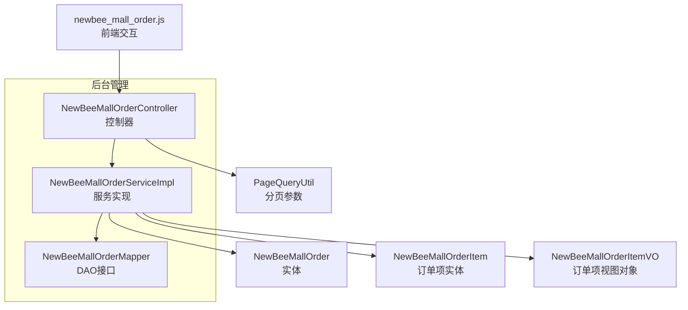
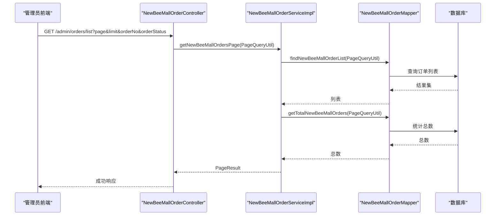
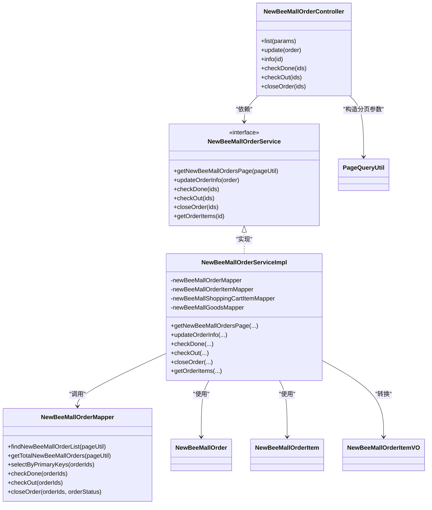

# 订单管理API

<cite>
**本文引用的文件**
- [NewBeeMallOrderController.java](file://src/main/java/ltd/newbee/mall/controller/admin/NewBeeMallOrderController.java)
- [NewBeeMallOrderService.java](file://src/main/java/ltd/newbee/mall/service/NewBeeMallOrderService.java)
- [NewBeeMallOrderServiceImpl.java](file://src/main/java/ltd/newbee/mall/service/impl/NewBeeMallOrderServiceImpl.java)
- [NewBeeMallOrder.java](file://src/main/java/ltd/newbee/mall/entity/NewBeeMallOrder.java)
- [NewBeeMallOrderItem.java](file://src/main/java/ltd/newbee/mall/entity/NewBeeMallOrderItem.java)
- [NewBeeMallOrderItemVO.java](file://src/main/java/ltd/newbee/mall/controller/vo/NewBeeMallOrderItemVO.java)
- [NewBeeMallOrderStatusEnum.java](file://src/main/java/ltd/newbee/mall/common/NewBeeMallOrderStatusEnum.java)
- [PageQueryUtil.java](file://src/main/java/ltd/newbee/mall/util/PageQueryUtil.java)
- [NewBeeMallOrderMapper.java](file://src/main/java/ltd/newbee/mall/dao/NewBeeMallOrderMapper.java)
- [newbee_mall_order.html](file://src/main/resources/templates/admin/newbee_mall_order.html)
- [newbee_mall_order.js](file://src/main/resources/static/admin/dist/js/newbee_mall_order.js)
- [API.md](file://docs/API.md)
</cite>

## 目录
1. [简介](#简介)
2. [项目结构](#项目结构)
3. [核心组件](#核心组件)
4. [架构总览](#架构总览)
5. [详细组件分析](#详细组件分析)
6. [依赖关系分析](#依赖关系分析)
7. [性能与扩展性](#性能与扩展性)
8. [故障排查指南](#故障排查指南)
9. [结论](#结论)
10. [附录](#附录)

## 简介
本文件面向管理员端订单管理模块，围绕以下目标展开：完整梳理订单列表分页查询、订单详情获取、订单状态变更（配货、出库、关闭）及订单信息修改的接口定义、参数校验、业务逻辑与错误处理；并结合前端交互与服务端实现，给出成功/失败响应示例与最佳实践建议。

## 项目结构
订单管理模块位于后台控制器层，采用“控制器-服务-持久层”三层架构：
- 控制器层：负责HTTP请求接收、参数校验与结果封装
- 服务层：负责业务编排、状态流转与事务控制
- 持久层：负责数据库访问与SQL映射

图表来源
- [NewBeeMallOrderController.java](file://src/main/java/ltd/newbee/mall/controller/admin/NewBeeMallOrderController.java#L49-L148)
- [NewBeeMallOrderServiceImpl.java](file://src/main/java/ltd/newbee/mall/service/impl/NewBeeMallOrderServiceImpl.java#L51-L183)
- [NewBeeMallOrderMapper.java](file://src/main/java/ltd/newbee/mall/dao/NewBeeMallOrderMapper.java#L18-L43)
- [NewBeeMallOrder.java](file://src/main/java/ltd/newbee/mall/entity/NewBeeMallOrder.java#L15-L169)
- [NewBeeMallOrderItem.java](file://src/main/java/ltd/newbee/mall/entity/NewBeeMallOrderItem.java#L1-L111)
- [NewBeeMallOrderItemVO.java](file://src/main/java/ltd/newbee/mall/controller/vo/NewBeeMallOrderItemVO.java#L1-L68)
- [PageQueryUtil.java](file://src/main/java/ltd/newbee/mall/util/PageQueryUtil.java#L14-L56)
- [newbee_mall_order.js](file://src/main/resources/static/admin/dist/js/newbee_mall_order.js#L1-L393)

章节来源
- [NewBeeMallOrderController.java](file://src/main/java/ltd/newbee/mall/controller/admin/NewBeeMallOrderController.java#L49-L148)
- [NewBeeMallOrderServiceImpl.java](file://src/main/java/ltd/newbee/mall/service/impl/NewBeeMallOrderServiceImpl.java#L51-L183)
- [newbee_mall_order.html](file://src/main/resources/templates/admin/newbee_mall_order.html#L40-L110)

## 核心组件
- 订单控制器：提供订单列表、详情、状态变更与信息修改等接口
- 订单服务：实现分页查询、状态变更、库存恢复、订单项查询等业务逻辑
- 实体与视图：订单与订单项实体，以及用于前端展示的视图对象
- 分页工具：统一的分页参数封装
- 前端交互：基于jqGrid的表格与模态框，调用后台接口

章节来源
- [NewBeeMallOrderController.java](file://src/main/java/ltd/newbee/mall/controller/admin/NewBeeMallOrderController.java#L49-L148)
- [NewBeeMallOrderService.java](file://src/main/java/ltd/newbee/mall/service/NewBeeMallOrderService.java#L21-L118)
- [NewBeeMallOrderServiceImpl.java](file://src/main/java/ltd/newbee/mall/service/impl/NewBeeMallOrderServiceImpl.java#L51-L183)
- [NewBeeMallOrder.java](file://src/main/java/ltd/newbee/mall/entity/NewBeeMallOrder.java#L15-L169)
- [NewBeeMallOrderItem.java](file://src/main/java/ltd/newbee/mall/entity/NewBeeMallOrderItem.java#L1-L111)
- [NewBeeMallOrderItemVO.java](file://src/main/java/ltd/newbee/mall/controller/vo/NewBeeMallOrderItemVO.java#L1-L68)
- [PageQueryUtil.java](file://src/main/java/ltd/newbee/mall/util/PageQueryUtil.java#L14-L56)
- [newbee_mall_order.js](file://src/main/resources/static/admin/dist/js/newbee_mall_order.js#L1-L393)

## 架构总览
订单管理API遵循REST风格，控制器通过@RequestMapping映射到/admin/orders路径，服务层承担状态机与事务控制，DAO层负责SQL执行。

图表来源
- [NewBeeMallOrderController.java](file://src/main/java/ltd/newbee/mall/controller/admin/NewBeeMallOrderController.java#L52-L60)
- [NewBeeMallOrderServiceImpl.java](file://src/main/java/ltd/newbee/mall/service/impl/NewBeeMallOrderServiceImpl.java#L51-L56)
- [NewBeeMallOrderMapper.java](file://src/main/java/ltd/newbee/mall/dao/NewBeeMallOrderMapper.java#L32-L34)

## 详细组件分析

### 接口一：订单列表（分页查询）
- 路径：GET /admin/orders/list
- 功能：分页查询订单列表，支持按订单号与订单状态过滤
- 请求参数：
  - page：页码，默认从1开始
  - limit：每页条数
  - orderNo：可选，按订单号过滤
  - orderStatus：可选，按订单状态过滤
- 响应：
  - 成功：返回PageResult，包含totalCount、currPage、list
  - 失败：参数异常或查询不到数据时返回错误信息

实现要点
- 控制器对page与limit进行非空校验，构造PageQueryUtil传给服务层
- 服务层调用DAO查询列表与总数，组装PageResult返回
- 前端通过jqGrid自动携带page与limit参数

章节来源
- [NewBeeMallOrderController.java](file://src/main/java/ltd/newbee/mall/controller/admin/NewBeeMallOrderController.java#L52-L60)
- [NewBeeMallOrderServiceImpl.java](file://src/main/java/ltd/newbee/mall/service/impl/NewBeeMallOrderServiceImpl.java#L51-L56)
- [PageQueryUtil.java](file://src/main/java/ltd/newbee/mall/util/PageQueryUtil.java#L20-L29)
- [newbee_mall_order.html](file://src/main/resources/templates/admin/newbee_mall_order.html#L40-L110)
- [API.md](file://docs/API.md#L747-L795)

### 接口二：订单详情（按订单ID获取订单项列表）
- 路径：GET /admin/order-items/{id}
- 功能：根据订单ID获取该订单的所有订单项列表
- 请求参数：
  - id：Long，订单ID（路径参数）
- 响应：
  - 成功：返回订单项列表（NewBeeMallOrderItemVO列表）
  - 失败：当订单不存在或订单项为空时返回错误信息

实现要点
- 服务层先查询订单是否存在，再查询订单项并转换为VO列表
- 控制器对空集合返回失败结果

章节来源
- [NewBeeMallOrderController.java](file://src/main/java/ltd/newbee/mall/controller/admin/NewBeeMallOrderController.java#L86-L94)
- [NewBeeMallOrderServiceImpl.java](file://src/main/java/ltd/newbee/mall/service/impl/NewBeeMallOrderServiceImpl.java#L396-L408)
- [NewBeeMallOrderItemVO.java](file://src/main/java/ltd/newbee/mall/controller/vo/NewBeeMallOrderItemVO.java#L1-L68)

### 接口三：配货（/admin/orders/checkDone）
- 路径：POST /admin/orders/checkDone
- 功能：将订单状态从“已支付”变更为“配货完成”
- 请求参数：
  - ids：Long[]，订单ID数组
- 响应：
  - 成功：返回成功结果
  - 失败：当订单状态不满足条件或数据库操作失败时返回错误信息

业务逻辑
- 服务层批量查询订单，校验isDeleted与orderStatus必须为1（已支付）
- 若全部满足，则批量更新状态为2（配货完成），否则返回具体错误信息

章节来源
- [NewBeeMallOrderController.java](file://src/main/java/ltd/newbee/mall/controller/admin/NewBeeMallOrderController.java#L99-L111)
- [NewBeeMallOrderServiceImpl.java](file://src/main/java/ltd/newbee/mall/service/impl/NewBeeMallOrderServiceImpl.java#L76-L109)
- [NewBeeMallOrderStatusEnum.java](file://src/main/java/ltd/newbee/mall/common/NewBeeMallOrderStatusEnum.java#L18-L30)
- [newbee_mall_order.js](file://src/main/resources/static/admin/dist/js/newbee_mall_order.js#L220-L282)

### 接口四：出库（/admin/orders/checkOut）
- 路径：POST /admin/orders/checkOut
- 功能：将订单状态从“已支付”或“配货完成”变更为“出库成功”
- 请求参数：
  - ids：Long[]，订单ID数组
- 响应：
  - 成功：返回成功结果
  - 失败：当订单状态不满足条件或数据库操作失败时返回错误信息

业务逻辑
- 服务层批量查询订单，校验isDeleted与orderStatus必须为1或2
- 若全部满足，则批量更新状态为3（出库成功），否则返回具体错误信息

章节来源
- [NewBeeMallOrderController.java](file://src/main/java/ltd/newbee/mall/controller/admin/NewBeeMallOrderController.java#L116-L128)
- [NewBeeMallOrderServiceImpl.java](file://src/main/java/ltd/newbee/mall/service/impl/NewBeeMallOrderServiceImpl.java#L112-L145)
- [NewBeeMallOrderStatusEnum.java](file://src/main/java/ltd/newbee/mall/common/NewBeeMallOrderStatusEnum.java#L18-L30)
- [newbee_mall_order.js](file://src/main/resources/static/admin/dist/js/newbee_mall_order.js#L284-L346)

### 接口五：关闭订单（/admin/orders/close）
- 路径：POST /admin/orders/close
- 功能：关闭订单并将库存恢复
- 请求参数：
  - ids：Long[]，订单ID数组
- 响应：
  - 成功：返回成功结果
  - 失败：当订单状态不满足条件或数据库操作失败时返回错误信息

业务逻辑
- 服务层批量查询订单，排除isDeleted=1的订单，且orderStatus不能为4或小于0
- 若全部满足，则将状态更新为-3（商家关闭），并调用库存恢复逻辑，否则返回具体错误信息

章节来源
- [NewBeeMallOrderController.java](file://src/main/java/ltd/newbee/mall/controller/admin/NewBeeMallOrderController.java#L133-L145)
- [NewBeeMallOrderServiceImpl.java](file://src/main/java/ltd/newbee/mall/service/impl/NewBeeMallOrderServiceImpl.java#L147-L183)
- [NewBeeMallOrderStatusEnum.java](file://src/main/java/ltd/newbee/mall/common/NewBeeMallOrderStatusEnum.java#L18-L30)
- [newbee_mall_order.js](file://src/main/resources/static/admin/dist/js/newbee_mall_order.js#L348-L386)

### 接口六：订单信息修改（/admin/orders/update）
- 路径：POST /admin/orders/update
- 功能：修改订单总价与收件人地址
- 请求体参数：
  - orderId：Long，订单ID（必填）
  - totalPrice：Integer，订单总价（必填）
  - userAddress：String，收件人地址（必填）
- 响应：
  - 成功：返回成功结果
  - 失败：当参数不合法或订单状态不允许修改时返回错误信息

参数校验规则
- orderId必须存在且≥1
- totalPrice必须存在且≥1
- userAddress必须非空
- 仅允许在订单状态为待支付、已支付、配货完成（orderStatus≥0且<3）时修改

章节来源
- [NewBeeMallOrderController.java](file://src/main/java/ltd/newbee/mall/controller/admin/NewBeeMallOrderController.java#L65-L81)
- [NewBeeMallOrderServiceImpl.java](file://src/main/java/ltd/newbee/mall/service/impl/NewBeeMallOrderServiceImpl.java#L60-L73)
- [NewBeeMallOrder.java](file://src/main/java/ltd/newbee/mall/entity/NewBeeMallOrder.java#L22-L42)
- [newbee_mall_order.html](file://src/main/resources/templates/admin/newbee_mall_order.html#L86-L107)
- [newbee_mall_order.js](file://src/main/resources/static/admin/dist/js/newbee_mall_order.js#L156-L218)

### 批量操作实现方式
- 前端通过jqGrid多选勾选多个订单，点击“配货完成/出库/关闭”按钮，将选中的orderId数组发送到后端
- 后端服务层使用批量查询与批量更新，减少数据库往返次数
- 事务控制保证状态变更与库存恢复的一致性

章节来源
- [newbee_mall_order.js](file://src/main/resources/static/admin/dist/js/newbee_mall_order.js#L220-L386)
- [NewBeeMallOrderServiceImpl.java](file://src/main/java/ltd/newbee/mall/service/impl/NewBeeMallOrderServiceImpl.java#L76-L183)

## 依赖关系分析

图表来源
- [NewBeeMallOrderController.java](file://src/main/java/ltd/newbee/mall/controller/admin/NewBeeMallOrderController.java#L49-L148)
- [NewBeeMallOrderService.java](file://src/main/java/ltd/newbee/mall/service/NewBeeMallOrderService.java#L21-L118)
- [NewBeeMallOrderServiceImpl.java](file://src/main/java/ltd/newbee/mall/service/impl/NewBeeMallOrderServiceImpl.java#L38-L183)
- [NewBeeMallOrderMapper.java](file://src/main/java/ltd/newbee/mall/dao/NewBeeMallOrderMapper.java#L18-L43)
- [NewBeeMallOrder.java](file://src/main/java/ltd/newbee/mall/entity/NewBeeMallOrder.java#L15-L169)
- [NewBeeMallOrderItem.java](file://src/main/java/ltd/newbee/mall/entity/NewBeeMallOrderItem.java#L1-L111)
- [NewBeeMallOrderItemVO.java](file://src/main/java/ltd/newbee/mall/controller/vo/NewBeeMallOrderItemVO.java#L1-L68)
- [PageQueryUtil.java](file://src/main/java/ltd/newbee/mall/util/PageQueryUtil.java#L14-L56)

## 性能与扩展性
- 分页查询：通过PageQueryUtil统一构造start/page/limit参数，避免重复计算
- 批量操作：DAO层提供批量查询与批量更新方法，降低网络往返与事务开销
- 事务边界：状态变更与库存恢复均在事务内执行，确保一致性
- 前端优化：jqGrid本地分页与格式化函数减少后端压力

[本节为通用建议，无需列出章节来源]

## 故障排查指南
常见问题与定位思路
- 参数异常
  - 现象：返回“参数异常！”
  - 原因：缺少page或limit，或ids为空
  - 处理：确保传递page、limit与非空ids
- 订单状态不符
  - 现象：返回“订单的状态不是支付成功/配货完成无法执行...”等错误
  - 原因：所选订单状态不在允许范围内
  - 处理：在前端确认订单状态后再提交
- 数据不存在
  - 现象：返回“数据不存在”
  - 原因：订单ID无效或已被删除
  - 处理：刷新页面后重试
- 数据库错误
  - 现象：返回“数据库错误”
  - 原因：状态更新或库存恢复失败
  - 处理：检查数据库连接与权限，重试操作

章节来源
- [NewBeeMallOrderController.java](file://src/main/java/ltd/newbee/mall/controller/admin/NewBeeMallOrderController.java#L52-L60)
- [NewBeeMallOrderServiceImpl.java](file://src/main/java/ltd/newbee/mall/service/impl/NewBeeMallOrderServiceImpl.java#L76-L183)
- [newbee_mall_order.js](file://src/main/resources/static/admin/dist/js/newbee_mall_order.js#L220-L386)

## 结论
订单管理模块通过清晰的接口划分与严格的参数校验，实现了从列表查询、详情展示到状态变更与信息修改的完整闭环。服务层的状态机与事务控制保障了业务正确性，前端交互提供了直观的操作体验。建议在生产环境中配合日志与监控，持续优化分页查询与批量操作的性能表现。

[本节为总结性内容，无需列出章节来源]

## 附录

### 接口一览与示例

- 订单列表（分页查询）
  - 方法与路径：GET /admin/orders/list
  - 请求参数：page、limit、orderNo（可选）、orderStatus（可选）
  - 成功响应：包含totalCount、currPage、list
  - 失败响应：参数异常或查询不到数据

- 订单详情（按订单ID获取订单项列表）
  - 方法与路径：GET /admin/order-items/{id}
  - 请求参数：id（Long）
  - 成功响应：订单项列表（NewBeeMallOrderItemVO）
  - 失败响应：数据不存在

- 配货
  - 方法与路径：POST /admin/orders/checkDone
  - 请求参数：ids（Long[]）
  - 成功响应：成功结果
  - 失败响应：状态不符或数据库错误

- 出库
  - 方法与路径：POST /admin/orders/checkOut
  - 请求参数：ids（Long[]）
  - 成功响应：成功结果
  - 失败响应：状态不符或数据库错误

- 关闭订单
  - 方法与路径：POST /admin/orders/close
  - 请求参数：ids（Long[]）
  - 成功响应：成功结果
  - 失败响应：状态不符或数据库错误

- 订单信息修改
  - 方法与路径：POST /admin/orders/update
  - 请求体参数：orderId、totalPrice、userAddress
  - 成功响应：成功结果
  - 失败响应：参数异常或状态不允许修改

章节来源
- [API.md](file://docs/API.md#L747-L831)
- [NewBeeMallOrderController.java](file://src/main/java/ltd/newbee/mall/controller/admin/NewBeeMallOrderController.java#L52-L145)
- [NewBeeMallOrderServiceImpl.java](file://src/main/java/ltd/newbee/mall/service/impl/NewBeeMallOrderServiceImpl.java#L60-L183)
- [newbee_mall_order.html](file://src/main/resources/templates/admin/newbee_mall_order.html#L86-L107)
- [newbee_mall_order.js](file://src/main/resources/static/admin/dist/js/newbee_mall_order.js#L156-L386)