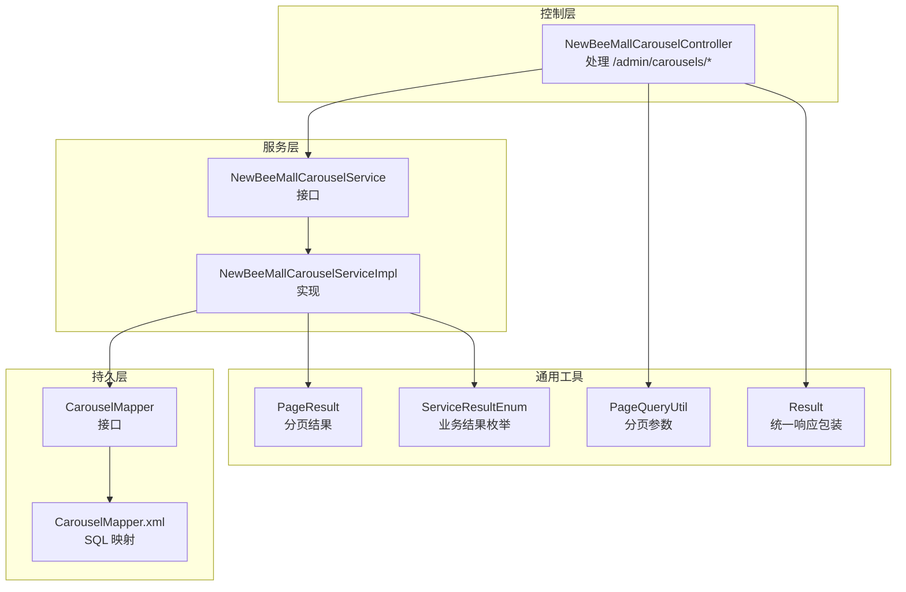
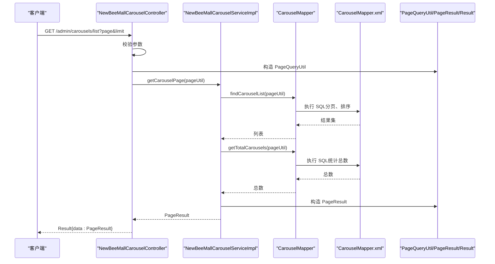
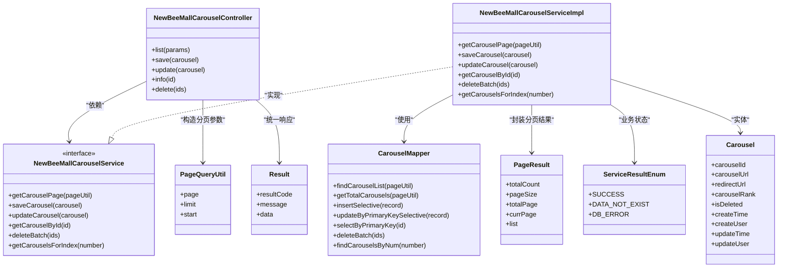

# 轮播图管理API

<cite>
**本文引用的文件**
- [NewBeeMallCarouselController.java](file://src/main/java/ltd/newbee/mall/controller/admin/NewBeeMallCarouselController.java)
- [NewBeeMallCarouselService.java](file://src/main/java/ltd/newbee/mall/service/NewBeeMallCarouselService.java)
- [NewBeeMallCarouselServiceImpl.java](file://src/main/java/ltd/newbee/mall/service/impl/NewBeeMallCarouselServiceImpl.java)
- [Carousel.java](file://src/main/java/ltd/newbee/mall/entity/Carousel.java)
- [CarouselMapper.java](file://src/main/java/ltd/newbee/mall/dao/CarouselMapper.java)
- [CarouselMapper.xml](file://src/main/resources/mapper/CarouselMapper.xml)
- [PageQueryUtil.java](file://src/main/java/ltd/newbee/mall/util/PageQueryUtil.java)
- [PageResult.java](file://src/main/java/ltd/newbee/mall/util/PageResult.java)
- [Result.java](file://src/main/java/ltd/newbee/mall/util/Result.java)
- [ServiceResultEnum.java](file://src/main/java/ltd/newbee/mall/common/ServiceResultEnum.java)
- [API.md](file://docs/API.md)
</cite>

## 目录
1. [简介](#简介)
2. [项目结构](#项目结构)
3. [核心组件](#核心组件)
4. [架构总览](#架构总览)
5. [详细组件分析](#详细组件分析)
6. [依赖关系分析](#依赖关系分析)
7. [性能与分页特性](#性能与分页特性)
8. [故障排查指南](#故障排查指南)
9. [结论](#结论)
10. [附录：接口定义与示例](#附录接口定义与示例)

## 简介
本文件为 newbee-mall 后台轮播图管理模块的完整 API 文档，覆盖以下接口：
- 轮播图列表（分页）
- 新增轮播图
- 修改轮播图
- 查询轮播图详情
- 删除轮播图（批量软删除）

文档重点说明各接口的请求参数、响应结构、分页实现细节、参数校验规则与错误处理策略，并给出请求示例与响应格式参考。

## 项目结构
轮播图管理模块采用经典的三层架构：
- 控制层：负责接收 HTTP 请求、参数校验、返回统一结果包装
- 服务层：封装业务逻辑，协调持久层与 VO 映射
- 持久层：MyBatis Mapper 提供数据库访问能力

图表来源
- [NewBeeMallCarouselController.java](file://src/main/java/ltd/newbee/mall/controller/admin/NewBeeMallCarouselController.java#L40-L126)
- [NewBeeMallCarouselService.java](file://src/main/java/ltd/newbee/mall/service/NewBeeMallCarouselService.java#L18-L42)
- [NewBeeMallCarouselServiceImpl.java](file://src/main/java/ltd/newbee/mall/service/impl/NewBeeMallCarouselServiceImpl.java#L30-L88)
- [CarouselMapper.java](file://src/main/java/ltd/newbee/mall/dao/CarouselMapper.java#L17-L37)
- [CarouselMapper.xml](file://src/main/resources/mapper/CarouselMapper.xml#L19-L171)
- [PageQueryUtil.java](file://src/main/java/ltd/newbee/mall/util/PageQueryUtil.java#L14-L56)
- [PageResult.java](file://src/main/java/ltd/newbee/mall/util/PageResult.java#L14-L84)
- [Result.java](file://src/main/java/ltd/newbee/mall/util/Result.java#L11-L58)
- [ServiceResultEnum.java](file://src/main/java/ltd/newbee/mall/common/ServiceResultEnum.java#L17-L91)

章节来源
- [NewBeeMallCarouselController.java](file://src/main/java/ltd/newbee/mall/controller/admin/NewBeeMallCarouselController.java#L40-L126)
- [NewBeeMallCarouselService.java](file://src/main/java/ltd/newbee/mall/service/NewBeeMallCarouselService.java#L18-L42)
- [NewBeeMallCarouselServiceImpl.java](file://src/main/java/ltd/newbee/mall/service/impl/NewBeeMallCarouselServiceImpl.java#L30-L88)
- [CarouselMapper.java](file://src/main/java/ltd/newbee/mall/dao/CarouselMapper.java#L17-L37)
- [CarouselMapper.xml](file://src/main/resources/mapper/CarouselMapper.xml#L19-L171)
- [PageQueryUtil.java](file://src/main/java/ltd/newbee/mall/util/PageQueryUtil.java#L14-L56)
- [PageResult.java](file://src/main/java/ltd/newbee/mall/util/PageResult.java#L14-L84)
- [Result.java](file://src/main/java/ltd/newbee/mall/util/Result.java#L11-L58)
- [ServiceResultEnum.java](file://src/main/java/ltd/newbee/mall/common/ServiceResultEnum.java#L17-L91)

## 核心组件
- 控制器：处理 /admin/carousels/* 的 HTTP 请求，完成参数校验与结果包装
- 服务接口与实现：提供分页查询、新增、修改、详情查询、批量删除等业务方法
- 实体与映射：Carousel 实体与 MyBatis Mapper XML 定义
- 分页工具：PageQueryUtil 构造分页参数；PageResult 封装分页结果
- 统一响应：Result 包装 resultCode、message、data
- 业务结果枚举：ServiceResultEnum 统一封装业务状态字符串

章节来源
- [NewBeeMallCarouselController.java](file://src/main/java/ltd/newbee/mall/controller/admin/NewBeeMallCarouselController.java#L40-L126)
- [NewBeeMallCarouselService.java](file://src/main/java/ltd/newbee/mall/service/NewBeeMallCarouselService.java#L18-L42)
- [NewBeeMallCarouselServiceImpl.java](file://src/main/java/ltd/newbee/mall/service/impl/NewBeeMallCarouselServiceImpl.java#L30-L88)
- [Carousel.java](file://src/main/java/ltd/newbee/mall/entity/Carousel.java#L15-L126)
- [CarouselMapper.java](file://src/main/java/ltd/newbee/mall/dao/CarouselMapper.java#L17-L37)
- [CarouselMapper.xml](file://src/main/resources/mapper/CarouselMapper.xml#L19-L171)
- [PageQueryUtil.java](file://src/main/java/ltd/newbee/mall/util/PageQueryUtil.java#L14-L56)
- [PageResult.java](file://src/main/java/ltd/newbee/mall/util/PageResult.java#L14-L84)
- [Result.java](file://src/main/java/ltd/newbee/mall/util/Result.java#L11-L58)
- [ServiceResultEnum.java](file://src/main/java/ltd/newbee/mall/common/ServiceResultEnum.java#L17-L91)

## 架构总览
轮播图管理接口的调用链路如下：

图表来源
- [NewBeeMallCarouselController.java](file://src/main/java/ltd/newbee/mall/controller/admin/NewBeeMallCarouselController.java#L49-L57)
- [NewBeeMallCarouselServiceImpl.java](file://src/main/java/ltd/newbee/mall/service/impl/NewBeeMallCarouselServiceImpl.java#L33-L39)
- [CarouselMapper.java](file://src/main/java/ltd/newbee/mall/dao/CarouselMapper.java#L30-L33)
- [CarouselMapper.xml](file://src/main/resources/mapper/CarouselMapper.xml#L19-L32)
- [PageQueryUtil.java](file://src/main/java/ltd/newbee/mall/util/PageQueryUtil.java#L20-L29)
- [PageResult.java](file://src/main/java/ltd/newbee/mall/util/PageResult.java#L35-L41)
- [Result.java](file://src/main/java/ltd/newbee/mall/util/Result.java#L11-L58)

## 详细组件分析

### 轮播图列表（分页）/admin/carousels/list
- 方法与路径：GET /admin/carousels/list
- 请求参数
  - page：页码（整数，必填）
  - limit：每页条数（整数，必填）
- 参数校验
  - 控制器在进入业务层前校验 page 与 limit 是否为空，任一缺失即返回“参数异常”
- 分页实现
  - 使用 PageQueryUtil 将 page、limit 注入 Map，并计算 start 偏移量
  - 服务层调用 Mapper 的 findCarouselList(pageUtil) 获取列表
  - 同时调用 getTotalCarousels(pageUtil) 获取总数
  - 构造 PageResult 并返回
- 响应结构
  - Result 包裹 PageResult，包含 totalCount、pageSize、totalPage、currPage、list
- 错误处理
  - 参数异常：返回失败 Result
  - 数据库异常：返回数据库错误字符串

章节来源
- [NewBeeMallCarouselController.java](file://src/main/java/ltd/newbee/mall/controller/admin/NewBeeMallCarouselController.java#L49-L57)
- [NewBeeMallCarouselServiceImpl.java](file://src/main/java/ltd/newbee/mall/service/impl/NewBeeMallCarouselServiceImpl.java#L33-L39)
- [CarouselMapper.java](file://src/main/java/ltd/newbee/mall/dao/CarouselMapper.java#L30-L33)
- [CarouselMapper.xml](file://src/main/resources/mapper/CarouselMapper.xml#L19-L32)
- [PageQueryUtil.java](file://src/main/java/ltd/newbee/mall/util/PageQueryUtil.java#L20-L29)
- [PageResult.java](file://src/main/java/ltd/newbee/mall/util/PageResult.java#L35-L41)
- [Result.java](file://src/main/java/ltd/newbee/mall/util/Result.java#L11-L58)

### 新增轮播图 /admin/carousels/save
- 方法与路径：POST /admin/carousels/save
- 请求体参数（Carousel 对象）
  - carouselUrl：字符串，必填
  - redirectUrl：字符串，非必填（控制器未强制校验）
  - carouselRank：整数，必填
  - 其他字段（如 create_time、update_time 等）由后端填充或忽略
- 参数校验
  - 控制器要求 carouselUrl 非空且 carouselRank 非空，否则返回“参数异常”
- 业务流程
  - 服务层调用 Mapper.insertSelective 插入新记录
  - 成功返回 SUCCESS，失败返回 DB_ERROR
- 响应结构
  - Result，成功时 message 为“保存成功”，失败时 message 为具体错误信息

章节来源
- [NewBeeMallCarouselController.java](file://src/main/java/ltd/newbee/mall/controller/admin/NewBeeMallCarouselController.java#L62-L75)
- [NewBeeMallCarouselServiceImpl.java](file://src/main/java/ltd/newbee/mall/service/impl/NewBeeMallCarouselServiceImpl.java#L42-L47)
- [CarouselMapper.xml](file://src/main/resources/mapper/CarouselMapper.xml#L61-L121)
- [ServiceResultEnum.java](file://src/main/java/ltd/newbee/mall/common/ServiceResultEnum.java#L17-L91)

### 修改轮播图 /admin/carousels/update
- 方法与路径：POST /admin/carousels/update
- 请求体参数（Carousel 对象）
  - carouselId：整数，必填（用于定位待更新记录）
  - carouselUrl：字符串，必填
  - redirectUrl：字符串，非必填
  - carouselRank：整数，必填
- 参数校验
  - 控制器要求 carouselId、carouselUrl、carouselRank 均非空，否则返回“参数异常”
- 业务流程
  - 服务层先按主键查询是否存在该记录，不存在则返回 DATA_NOT_EXIST
  - 存在则更新 carouselUrl、redirectUrl、carouselRank，并设置更新时间
  - 成功返回 SUCCESS，失败返回 DB_ERROR
- 响应结构
  - Result，成功时 message 为“修改成功”，失败时 message 为具体错误信息

章节来源
- [NewBeeMallCarouselController.java](file://src/main/java/ltd/newbee/mall/controller/admin/NewBeeMallCarouselController.java#L81-L95)
- [NewBeeMallCarouselServiceImpl.java](file://src/main/java/ltd/newbee/mall/service/impl/NewBeeMallCarouselServiceImpl.java#L50-L63)
- [CarouselMapper.xml](file://src/main/resources/mapper/CarouselMapper.xml#L122-L163)
- [ServiceResultEnum.java](file://src/main/java/ltd/newbee/mall/common/ServiceResultEnum.java#L17-L91)

### 查询轮播图详情 /admin/carousels/info/{id}
- 方法与路径：GET /admin/carousels/info/{id}
- 路径参数
  - id：整数，轮播图主键
- 业务流程
  - 服务层按主键查询记录
  - 若不存在，返回 DATA_NOT_EXIST
  - 存在则返回该记录
- 响应结构
  - Result，data 为 Carousel 实体对象

章节来源
- [NewBeeMallCarouselController.java](file://src/main/java/ltd/newbee/mall/controller/admin/NewBeeMallCarouselController.java#L100-L108)
- [NewBeeMallCarouselServiceImpl.java](file://src/main/java/ltd/newbee/mall/service/impl/NewBeeMallCarouselServiceImpl.java#L65-L68)
- [CarouselMapper.xml](file://src/main/resources/mapper/CarouselMapper.xml#L33-L46)

### 删除轮播图 /admin/carousels/delete（批量软删除）
- 方法与路径：POST /admin/carousels/delete
- 请求体参数
  - ids：整数数组，至少包含一个 ID
- 业务流程
  - 控制器要求 ids 数组长度大于 0，否则返回“参数异常”
  - 服务层调用 Mapper.deleteBatch(ids)，执行软删除（设置 is_deleted=1 并更新时间）
  - 返回布尔结果：成功 true，失败 false
- 响应结构
  - Result，成功时 message 为“删除成功”，失败时 message 为“删除失败”

章节来源
- [NewBeeMallCarouselController.java](file://src/main/java/ltd/newbee/mall/controller/admin/NewBeeMallCarouselController.java#L113-L124)
- [NewBeeMallCarouselServiceImpl.java](file://src/main/java/ltd/newbee/mall/service/impl/NewBeeMallCarouselServiceImpl.java#L71-L77)
- [CarouselMapper.xml](file://src/main/resources/mapper/CarouselMapper.xml#L164-L171)
- [ServiceResultEnum.java](file://src/main/java/ltd/newbee/mall/common/ServiceResultEnum.java#L17-L91)

## 依赖关系分析

图表来源
- [NewBeeMallCarouselController.java](file://src/main/java/ltd/newbee/mall/controller/admin/NewBeeMallCarouselController.java#L40-L126)
- [NewBeeMallCarouselService.java](file://src/main/java/ltd/newbee/mall/service/NewBeeMallCarouselService.java#L18-L42)
- [NewBeeMallCarouselServiceImpl.java](file://src/main/java/ltd/newbee/mall/service/impl/NewBeeMallCarouselServiceImpl.java#L30-L88)
- [CarouselMapper.java](file://src/main/java/ltd/newbee/mall/dao/CarouselMapper.java#L17-L37)
- [Carousel.java](file://src/main/java/ltd/newbee/mall/entity/Carousel.java#L15-L126)
- [PageQueryUtil.java](file://src/main/java/ltd/newbee/mall/util/PageQueryUtil.java#L14-L56)
- [PageResult.java](file://src/main/java/ltd/newbee/mall/util/PageResult.java#L14-L84)
- [Result.java](file://src/main/java/ltd/newbee/mall/util/Result.java#L11-L58)
- [ServiceResultEnum.java](file://src/main/java/ltd/newbee/mall/common/ServiceResultEnum.java#L17-L91)

## 性能与分页特性
- 分页参数
  - page、limit 由 PageQueryUtil 解析并注入 Map，同时计算 start 偏移量
  - SQL 层通过 LIMIT 与 OFFSET 实现分页
- 排序
  - SQL 默认按 carousel_rank 降序排列
- 统计
  - getTotalCarousels 仅统计 is_deleted=0 的记录，确保软删除不影响总数
- 性能建议
  - 建议在 carousel_rank 字段建立索引以优化排序与分页
  - 合理设置 limit，避免一次性加载过多数据

章节来源
- [PageQueryUtil.java](file://src/main/java/ltd/newbee/mall/util/PageQueryUtil.java#L20-L29)
- [CarouselMapper.xml](file://src/main/resources/mapper/CarouselMapper.xml#L19-L32)
- [NewBeeMallCarouselServiceImpl.java](file://src/main/java/ltd/newbee/mall/service/impl/NewBeeMallCarouselServiceImpl.java#L33-L39)

## 故障排查指南
- 参数异常
  - 列表接口缺少 page 或 limit 会直接返回失败
  - 新增/修改接口缺少 carouselUrl 或 carouselRank 会返回失败
- 数据不存在
  - 修改接口若根据主键查不到记录，返回 DATA_NOT_EXIST
- 数据库错误
  - 插入或更新失败返回 DB_ERROR
- 删除失败
  - 批量删除 ids 为空或 SQL 执行失败时返回“删除失败”

章节来源
- [NewBeeMallCarouselController.java](file://src/main/java/ltd/newbee/mall/controller/admin/NewBeeMallCarouselController.java#L52-L57)
- [NewBeeMallCarouselController.java](file://src/main/java/ltd/newbee/mall/controller/admin/NewBeeMallCarouselController.java#L65-L75)
- [NewBeeMallCarouselController.java](file://src/main/java/ltd/newbee/mall/controller/admin/NewBeeMallCarouselController.java#L84-L95)
- [NewBeeMallCarouselController.java](file://src/main/java/ltd/newbee/mall/controller/admin/NewBeeMallCarouselController.java#L115-L124)
- [NewBeeMallCarouselServiceImpl.java](file://src/main/java/ltd/newbee/mall/service/impl/NewBeeMallCarouselServiceImpl.java#L50-L63)
- [ServiceResultEnum.java](file://src/main/java/ltd/newbee/mall/common/ServiceResultEnum.java#L17-L91)

## 结论
轮播图管理模块接口清晰、职责明确，采用统一的 Result 包装与分页工具，便于前端集成与维护。新增、修改、删除均具备基础参数校验与错误处理，分页查询通过 SQL 层面实现高效的数据检索。建议在生产环境中为 carousel_rank 建立索引以提升排序与分页性能。

## 附录：接口定义与示例

### 接口一览
- GET /admin/carousels/list
  - 功能：轮播图列表（分页）
  - 请求参数：page、limit（均为整数）
  - 响应：Result.data 为 PageResult（包含 totalCount、pageSize、totalPage、currPage、list）
- POST /admin/carousels/save
  - 功能：新增轮播图
  - 请求体：Carousel 对象（carouselUrl、carouselRank 必填；redirectUrl 非必填）
  - 响应：Result
- POST /admin/carousels/update
  - 功能：修改轮播图
  - 请求体：Carousel 对象（carouselId、carouselUrl、carouselRank 必填；redirectUrl 非必填）
  - 响应：Result
- GET /admin/carousels/info/{id}
  - 功能：查询轮播图详情
  - 路径参数：id（整数）
  - 响应：Result.data 为 Carousel 对象
- POST /admin/carousels/delete
  - 功能：批量删除（软删除）
  - 请求体：ids（整数数组，至少一个）
  - 响应：Result

章节来源
- [NewBeeMallCarouselController.java](file://src/main/java/ltd/newbee/mall/controller/admin/NewBeeMallCarouselController.java#L49-L124)
- [API.md](file://docs/API.md#L476-L559)

### 请求与响应示例（基于仓库现有文档）
- 列表请求
  - GET /admin/carousels/list?page=1&limit=10
  - 响应示例（来自仓库文档）：
    - {
        "resultCode": 200,
        "message": "success",
        "data": {
          "totalCount": 100,
          "currPage": 1,
          "list": []
        }
      }
- 新增请求
  - POST /admin/carousels/save
  - 请求体示例（来自仓库文档）：
    - {
        "carouselUrl": "https://example.com/image.jpg",
        "redirectUrl": "https://example.com/target",
        "carouselRank": 1
      }
  - 响应示例（来自仓库文档）：
    - {
        "resultCode": 200,
        "message": "保存成功"
      }
- 修改请求
  - POST /admin/carousels/update
  - 请求体示例（来自仓库文档）：
    - {
        "carouselId": 1,
        "carouselUrl": "https://example.com/image2.jpg",
        "redirectUrl": "https://example.com/target2",
        "carouselRank": 2
      }
  - 响应示例（来自仓库文档）：
    - {
        "resultCode": 200,
        "message": "修改成功"
      }
- 删除请求
  - POST /admin/carousels/delete
  - 请求体示例（来自仓库文档）：
    - [1, 2, 3]
  - 响应示例（来自仓库文档）：
    - {
        "resultCode": 200,
        "message": "删除成功"
      }

章节来源
- [API.md](file://docs/API.md#L476-L559)