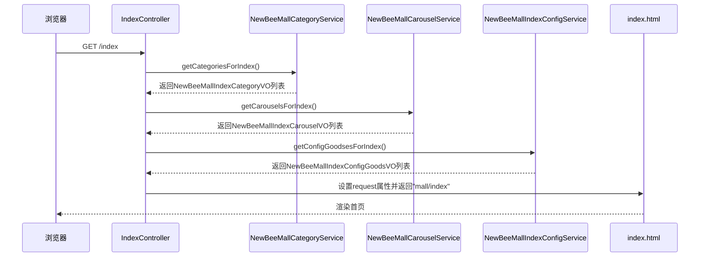
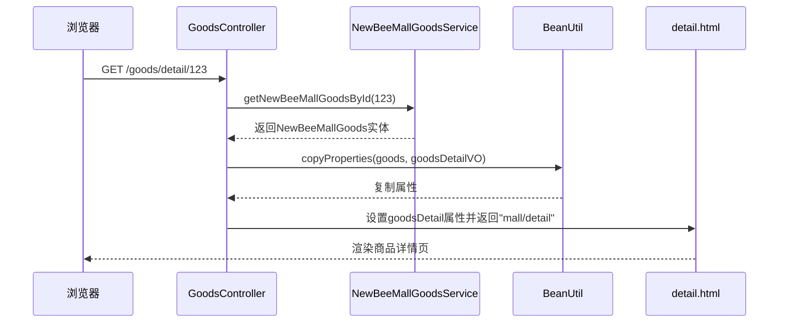
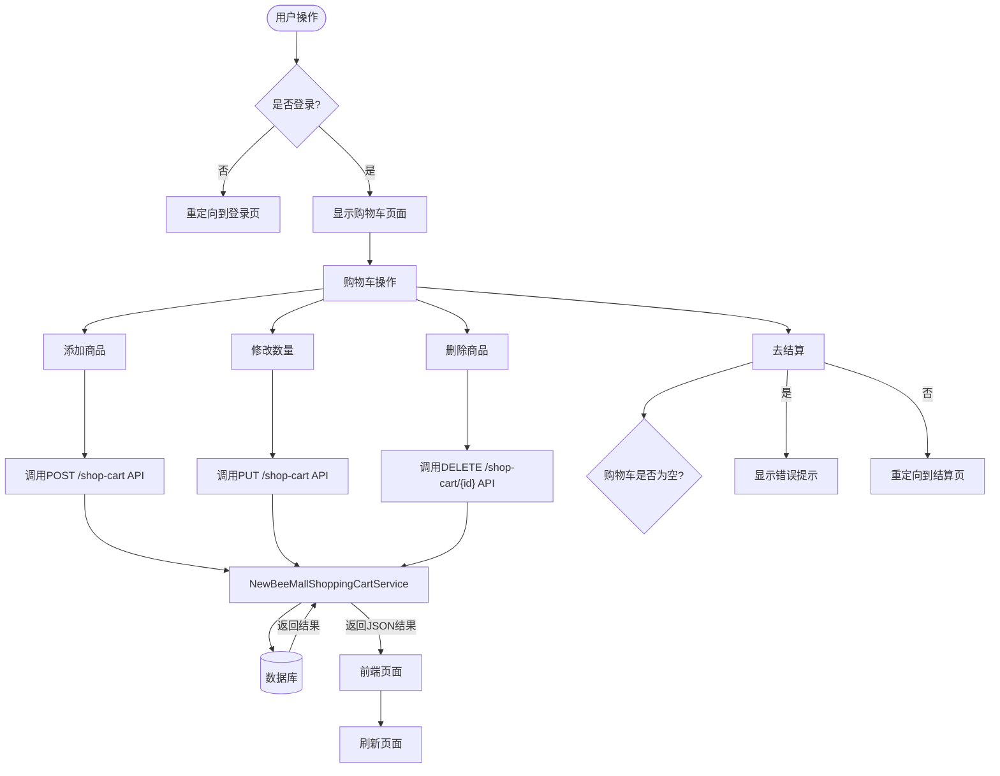
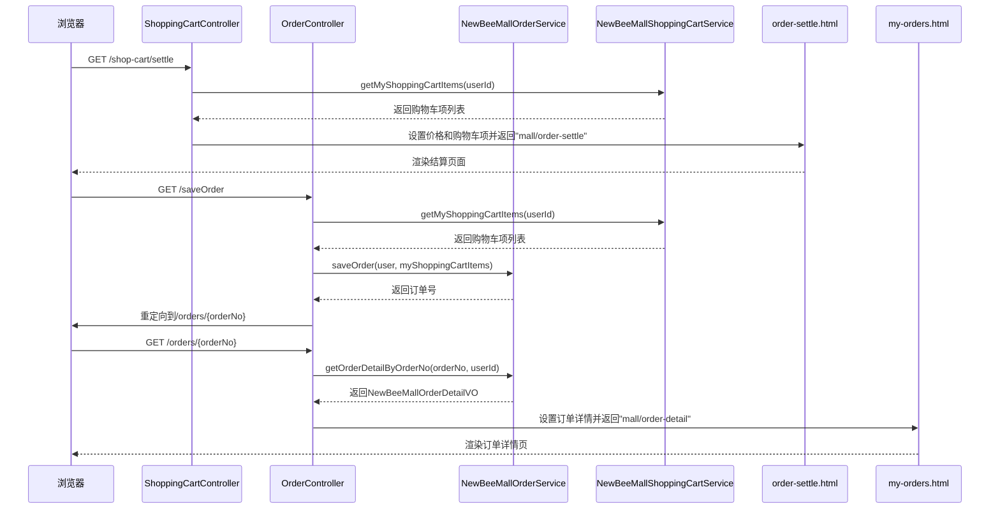
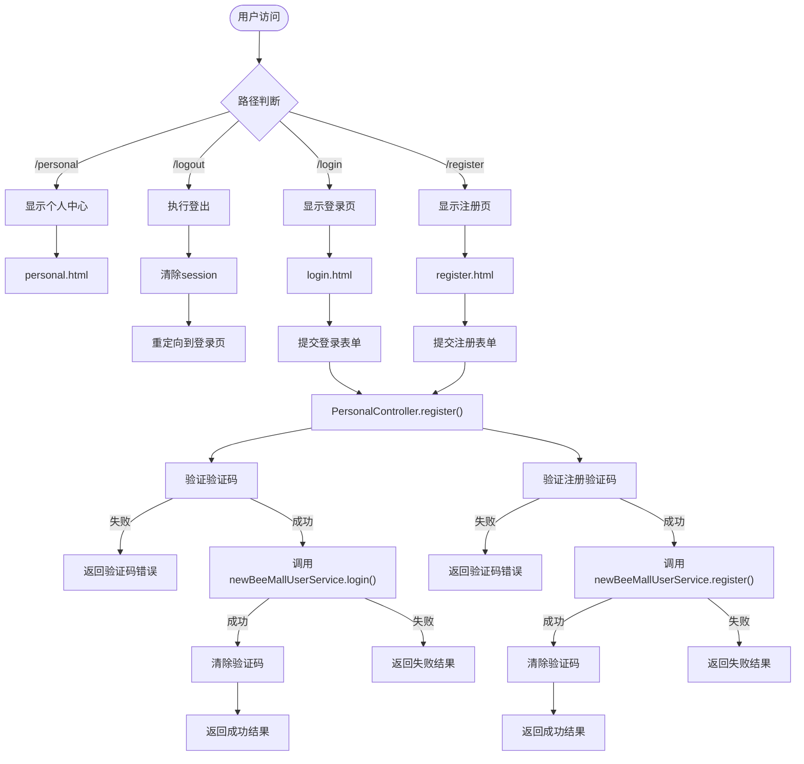
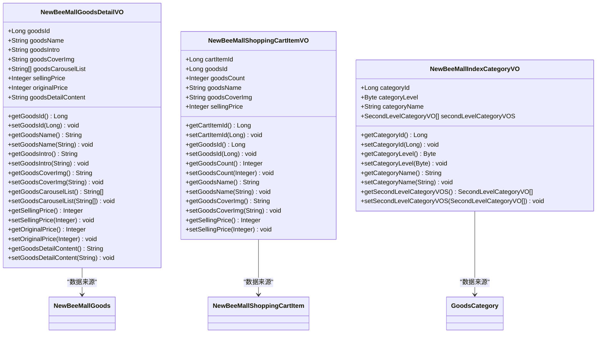
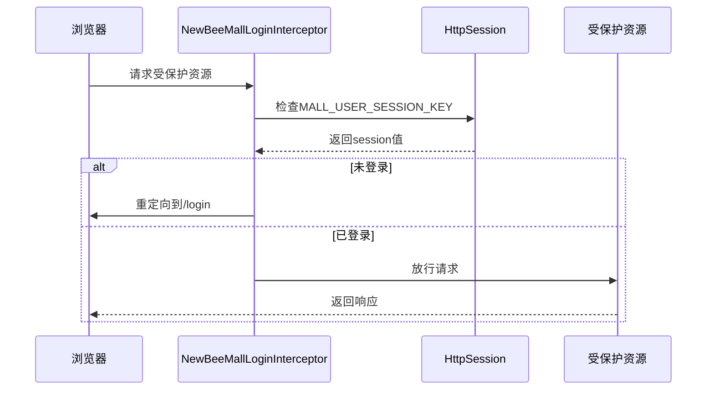

# 前台功能详解

<cite>
**本文档引用文件**  
- [IndexController.java](file://src/main/java/ltd/newbee/mall/controller/mall/IndexController.java)
- [GoodsController.java](file://src/main/java/ltd/newbee/mall/controller/mall/GoodsController.java)
- [ShoppingCartController.java](file://src/main/java/ltd/newbee/mall/controller/mall/ShoppingCartController.java)
- [OrderController.java](file://src/main/java/ltd/newbee/mall/controller/mall/OrderController.java)
- [PersonalController.java](file://src/main/java/ltd/newbee/mall/controller/mall/PersonalController.java)
- [NewBeeMallGoodsDetailVO.java](file://src/main/java/ltd/newbee/mall/controller/vo/NewBeeMallGoodsDetailVO.java)
- [NewBeeMallIndexCategoryVO.java](file://src/main/java/ltd/newbee/mall/controller/vo/NewBeeMallIndexCategoryVO.java)
- [NewBeeMallShoppingCartItemVO.java](file://src/main/java/ltd/newbee/mall/controller/vo/NewBeeMallShoppingCartItemVO.java)
- [NewBeeMallLoginInterceptor.java](file://src/main/java/ltd/newbee/mall/interceptor/NewBeeMallLoginInterceptor.java)
- [NeeBeeMallWebMvcConfigurer.java](file://src/main/java/ltd/newbee/mall/config/NeeBeeMallWebMvcConfigurer.java)
- [NewBeeMallShoppingCartServiceImpl.java](file://src/main/java/ltd/newbee/mall/service/impl/NewBeeMallShoppingCartServiceImpl.java)
- [index.html](file://src/main/resources/templates/mall/index.html)
- [detail.html](file://src/main/resources/templates/mall/detail.html)
- [cart.html](file://src/main/resources/templates/mall/cart.html)
- [order-settle.html](file://src/main/resources/templates/mall/order-settle.html)
</cite>

## 目录
1. [首页展示](#首页展示)
2. [商品浏览](#商品浏览)
3. [购物车管理](#购物车管理)
4. [订单创建](#订单创建)
5. [用户个人中心](#用户个人中心)
6. [视图对象(VO)作用](#视图对象vo作用)
7. [拦截器安全机制](#拦截器安全机制)

## 首页展示

首页功能由`IndexController`控制器和`index.html`模板文件共同实现。`IndexController`的`indexPage`方法处理根路径、`/index`和`/index.html`的GET请求，从服务层获取分类、轮播图和推荐商品数据，并通过`HttpServletRequest`的`setAttribute`方法将数据传递给前端模板。

**图示来源**
- [IndexController.java](file://src/main/java/ltd/newbee/mall/controller/mall/IndexController.java#L40-L55)
- [index.html](file://src/main/resources/templates/mall/index.html)

**章节来源**
- [IndexController.java](file://src/main/java/ltd/newbee/mall/controller/mall/IndexController.java#L28-L57)
- [index.html](file://src/main/resources/templates/mall/index.html)

## 商品浏览

商品浏览功能由`GoodsController`控制器和`detail.html`模板文件实现。`GoodsController`的`detailPage`方法处理`/goods/detail/{goodsId}`的GET请求，通过`NewBeeMallGoodsService`获取商品详情，并将`NewBeeMallGoods`实体转换为`NewBeeMallGoodsDetailVO`视图对象，最后传递给前端模板。

**图示来源**
- [GoodsController.java](file://src/main/java/ltd/newbee/mall/controller/mall/GoodsController.java#L74-L87)
- [detail.html](file://src/main/resources/templates/mall/detail.html)

**章节来源**
- [GoodsController.java](file://src/main/java/ltd/newbee/mall/controller/mall/GoodsController.java#L32-L90)
- [NewBeeMallGoodsDetailVO.java](file://src/main/java/ltd/newbee/mall/controller/vo/NewBeeMallGoodsDetailVO.java)
- [detail.html](file://src/main/resources/templates/mall/detail.html)

## 购物车管理

购物车管理功能由`ShoppingCartController`控制器和`cart.html`模板文件实现。该功能支持购物车项的增删改查操作，通过RESTful API设计，使用不同的HTTP方法处理不同操作。

**图示来源**
- [ShoppingCartController.java](file://src/main/java/ltd/newbee/mall/controller/mall/ShoppingCartController.java)
- [cart.html](file://src/main/resources/templates/mall/cart.html)

**章节来源**
- [ShoppingCartController.java](file://src/main/java/ltd/newbee/mall/controller/mall/ShoppingCartController.java#L30-L129)
- [NewBeeMallShoppingCartServiceImpl.java](file://src/main/java/ltd/newbee/mall/service/impl/NewBeeMallShoppingCartServiceImpl.java)
- [cart.html](file://src/main/resources/templates/mall/cart.html)

## 订单创建

订单创建功能由`OrderController`和`ShoppingCartController`协同完成，涉及`order-settle.html`和`my-orders.html`等多个模板文件。用户从购物车页面进入结算流程，最终生成订单。

**图示来源**
- [ShoppingCartController.java](file://src/main/java/ltd/newbee/mall/controller/mall/ShoppingCartController.java#L107-L128)
- [OrderController.java](file://src/main/java/ltd/newbee/mall/controller/mall/OrderController.java#L67-L82)
- [order-settle.html](file://src/main/resources/templates/mall/order-settle.html)

**章节来源**
- [OrderController.java](file://src/main/java/ltd/newbee/mall/controller/mall/OrderController.java#L37-L158)
- [order-settle.html](file://src/main/resources/templates/mall/order-settle.html)
- [my-orders.html](file://src/main/resources/templates/mall/my-orders.html)

## 用户个人中心

用户个人中心功能由`PersonalController`控制器实现，包含用户登录、注册、信息更新等核心功能。该控制器通过`@PostMapping`注解处理表单提交，并使用`ResultGenerator`返回JSON格式的响应结果。

**图示来源**
- [PersonalController.java](file://src/main/java/ltd/newbee/mall/controller/mall/PersonalController.java)
- [login.html](file://src/main/resources/templates/mall/login.html)
- [register.html](file://src/main/resources/templates/mall/register.html)

**章节来源**
- [PersonalController.java](file://src/main/java/ltd/newbee/mall/controller/mall/PersonalController.java#L28-L136)

## 视图对象(VO)作用

视图对象(VO)在前后端数据交互中起着关键作用，主要用于封装和转换数据，避免直接暴露实体类给前端。系统中定义了多种VO类，如`NewBeeMallGoodsDetailVO`、`NewBeeMallShoppingCartItemVO`等，这些VO类只包含前端需要的属性，提高了数据传输的安全性和效率。

**图示来源**
- [NewBeeMallGoodsDetailVO.java](file://src/main/java/ltd/newbee/mall/controller/vo/NewBeeMallGoodsDetailVO.java)
- [NewBeeMallShoppingCartItemVO.java](file://src/main/java/ltd/newbee/mall/controller/vo/NewBeeMallShoppingCartItemVO.java)
- [NewBeeMallIndexCategoryVO.java](file://src/main/java/ltd/newbee/mall/controller/vo/NewBeeMallIndexCategoryVO.java)

**章节来源**
- [NewBeeMallGoodsDetailVO.java](file://src/main/java/ltd/newbee/mall/controller/vo/NewBeeMallGoodsDetailVO.java)
- [NewBeeMallShoppingCartItemVO.java](file://src/main/java/ltd/newbee/mall/controller/vo/NewBeeMallShoppingCartItemVO.java)
- [NewBeeMallIndexCategoryVO.java](file://src/main/java/ltd/newbee/mall/controller/vo/NewBeeMallIndexCategoryVO.java)

## 拦截器安全机制

系统通过`NewBeeMallLoginInterceptor`拦截器保障用户会话安全，确保只有登录用户才能访问受保护的资源。该拦截器在`NeeBeeMallWebMvcConfigurer`配置类中注册，对特定路径进行拦截。

**图示来源**
- [NewBeeMallLoginInterceptor.java](file://src/main/java/ltd/newbee/mall/interceptor/NewBeeMallLoginInterceptor.java)
- [NeeBeeMallWebMvcConfigurer.java](file://src/main/java/ltd/newbee/mall/config/NeeBeeMallWebMvcConfigurer.java)

**章节来源**
- [NewBeeMallLoginInterceptor.java](file://src/main/java/ltd/newbee/mall/interceptor/NewBeeMallLoginInterceptor.java#L28-L38)
- [NeeBeeMallWebMvcConfigurer.java](file://src/main/java/ltd/newbee/mall/config/NeeBeeMallWebMvcConfigurer.java#L31-L59)