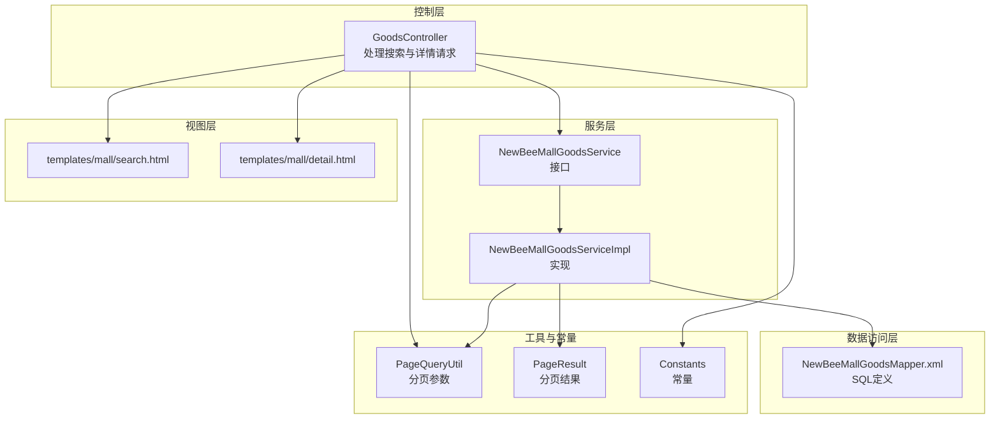
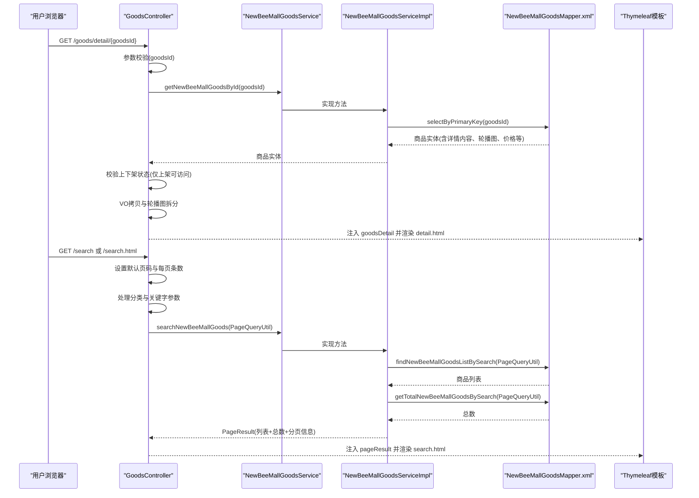
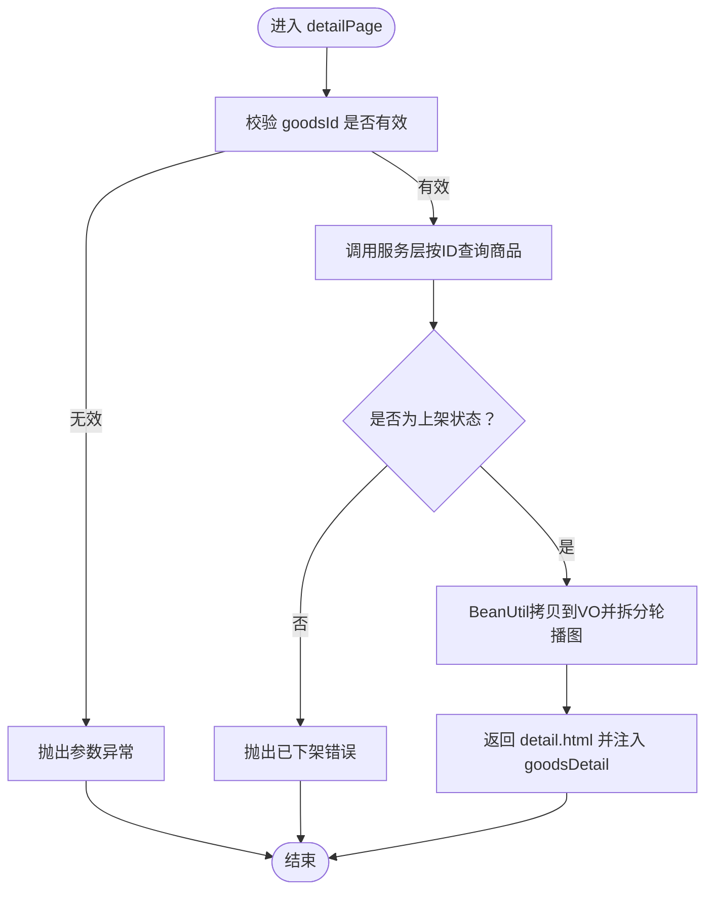
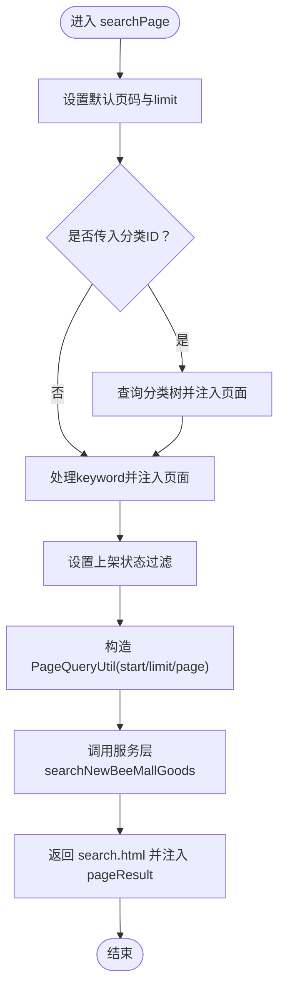
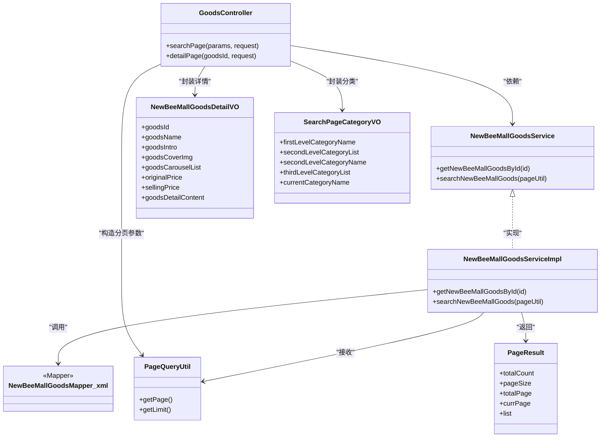

# 商品浏览与搜索

<cite>
**本文引用的文件**
- [GoodsController.java](file://src/main/java/ltd/newbee/mall/controller/mall/GoodsController.java)
- [NewBeeMallGoodsDetailVO.java](file://src/main/java/ltd/newbee/mall/controller/vo/NewBeeMallGoodsDetailVO.java)
- [SearchPageCategoryVO.java](file://src/main/java/ltd/newbee/mall/controller/vo/SearchPageCategoryVO.java)
- [NewBeeMallSearchGoodsVO.java](file://src/main/java/ltd/newbee/mall/controller/vo/NewBeeMallSearchGoodsVO.java)
- [PageQueryUtil.java](file://src/main/java/ltd/newbee/mall/util/PageQueryUtil.java)
- [PageResult.java](file://src/main/java/ltd/newbee/mall/util/PageResult.java)
- [NewBeeMallGoodsService.java](file://src/main/java/ltd/newbee/mall/service/NewBeeMallGoodsService.java)
- [NewBeeMallGoodsServiceImpl.java](file://src/main/java/ltd/newbee/mall/service/impl/NewBeeMallGoodsServiceImpl.java)
- [NewBeeMallGoodsMapper.xml](file://src/main/resources/mapper/NewBeeMallGoodsMapper.xml)
- [Constants.java](file://src/main/java/ltd/newbee/mall/common/Constants.java)
- [detail.html](file://src/main/resources/templates/mall/detail.html)
- [search.html](file://src/main/resources/templates/mall/search.html)
- [newbee_mall_schema.sql](file://src/main/resources/newbee_mall_schema.sql)
</cite>

## 目录
1. [简介](#简介)
2. [项目结构](#项目结构)
3. [核心组件](#核心组件)
4. [架构总览](#架构总览)
5. [详细组件分析](#详细组件分析)
6. [依赖关系分析](#依赖关系分析)
7. [性能考量](#性能考量)
8. [故障排查指南](#故障排查指南)
9. [结论](#结论)

## 简介
本文件聚焦于商品浏览与搜索功能，围绕 GoodsController 的两个核心接口进行深入解析：商品详情页（detail）与商品搜索（searchList）。文档将阐明 NewBeeMallGoodsDetailVO 如何封装商品详情数据（含轮播图、库存状态、分类信息），解释搜索功能的分页查询实现（PageQueryUtil）与模糊匹配逻辑，给出从用户点击商品到渲染 detail.html 的完整数据流，并覆盖商品状态管理（上架/下架）、库存显示逻辑与搜索排序规则等业务细节，最后提供处理商品信息加载失败的调试指南。

## 项目结构
- 控制层：mall 包下的 GoodsController 负责接收请求并组织数据返回视图模板。
- 视图层：Thymeleaf 模板位于 templates/mall，分别负责搜索页与详情页的渲染。
- 服务层：NewBeeMallGoodsService 接口及其实现 NewBeeMallGoodsServiceImpl 提供商品查询与分页能力。
- 数据访问层：MyBatis 映射器 NewBeeMallGoodsMapper.xml 定义 SQL 查询与排序规则。
- 工具类：PageQueryUtil 封装分页参数；PageResult 组织分页结果；Constants 定义常量（如每页条数、上下架状态）。
- VO 层：NewBeeMallGoodsDetailVO、NewBeeMallSearchGoodsVO、SearchPageCategoryVO 用于前后端数据传输。

图表来源
- [GoodsController.java](file://src/main/java/ltd/newbee/mall/controller/mall/GoodsController.java#L40-L91)
- [NewBeeMallGoodsService.java](file://src/main/java/ltd/newbee/mall/service/NewBeeMallGoodsService.java#L17-L74)
- [NewBeeMallGoodsServiceImpl.java](file://src/main/java/ltd/newbee/mall/service/impl/NewBeeMallGoodsServiceImpl.java#L114-L137)
- [NewBeeMallGoodsMapper.xml](file://src/main/resources/mapper/NewBeeMallGoodsMapper.xml#L102-L151)
- [PageQueryUtil.java](file://src/main/java/ltd/newbee/mall/util/PageQueryUtil.java#L14-L56)
- [PageResult.java](file://src/main/java/ltd/newbee/mall/util/PageResult.java#L14-L84)
- [Constants.java](file://src/main/java/ltd/newbee/mall/common/Constants.java#L38-L47)
- [search.html](file://src/main/resources/templates/mall/search.html#L1-L111)
- [detail.html](file://src/main/resources/templates/mall/detail.html#L1-L166)

章节来源
- [GoodsController.java](file://src/main/java/ltd/newbee/mall/controller/mall/GoodsController.java#L40-L91)
- [NewBeeMallGoodsService.java](file://src/main/java/ltd/newbee/mall/service/NewBeeMallGoodsService.java#L17-L74)
- [NewBeeMallGoodsServiceImpl.java](file://src/main/java/ltd/newbee/mall/service/impl/NewBeeMallGoodsServiceImpl.java#L114-L137)
- [NewBeeMallGoodsMapper.xml](file://src/main/resources/mapper/NewBeeMallGoodsMapper.xml#L102-L151)
- [PageQueryUtil.java](file://src/main/java/ltd/newbee/mall/util/PageQueryUtil.java#L14-L56)
- [PageResult.java](file://src/main/java/ltd/newbee/mall/util/PageResult.java#L14-L84)
- [Constants.java](file://src/main/java/ltd/newbee/mall/common/Constants.java#L38-L47)
- [search.html](file://src/main/resources/templates/mall/search.html#L1-L111)
- [detail.html](file://src/main/resources/templates/mall/detail.html#L1-L166)

## 核心组件
- GoodsController：提供搜索页与详情页的请求入口，负责参数校验、分类数据封装、搜索条件拼装与分页结果注入。
- NewBeeMallGoodsDetailVO：封装详情页所需字段，包括轮播图数组、封面图、名称、简介、价格、详情内容等。
- PageQueryUtil：将请求参数转换为分页查询所需的 start/limit/page，并计算起始偏移。
- NewBeeMallGoodsServiceImpl.searchNewBeeMallGoods：执行搜索查询，统计总数，包装为 PageResult 返回。
- NewBeeMallGoodsMapper.xml：定义搜索 SQL，支持关键词模糊匹配、分类过滤、上下架状态过滤与排序规则。
- Thymeleaf 模板：search.html 与 detail.html 负责渲染搜索结果与商品详情。

章节来源
- [GoodsController.java](file://src/main/java/ltd/newbee/mall/controller/mall/GoodsController.java#L40-L91)
- [NewBeeMallGoodsDetailVO.java](file://src/main/java/ltd/newbee/mall/controller/vo/NewBeeMallGoodsDetailVO.java#L1-L99)
- [PageQueryUtil.java](file://src/main/java/ltd/newbee/mall/util/PageQueryUtil.java#L14-L56)
- [NewBeeMallGoodsServiceImpl.java](file://src/main/java/ltd/newbee/mall/service/impl/NewBeeMallGoodsServiceImpl.java#L114-L137)
- [NewBeeMallGoodsMapper.xml](file://src/main/resources/mapper/NewBeeMallGoodsMapper.xml#L102-L151)
- [search.html](file://src/main/resources/templates/mall/search.html#L1-L111)
- [detail.html](file://src/main/resources/templates/mall/detail.html#L1-L166)

## 架构总览
从用户点击商品链接到页面渲染的完整流程如下：

图表来源
- [GoodsController.java](file://src/main/java/ltd/newbee/mall/controller/mall/GoodsController.java#L40-L91)
- [NewBeeMallGoodsService.java](file://src/main/java/ltd/newbee/mall/service/NewBeeMallGoodsService.java#L56-L74)
- [NewBeeMallGoodsServiceImpl.java](file://src/main/java/ltd/newbee/mall/service/impl/NewBeeMallGoodsServiceImpl.java#L114-L137)
- [NewBeeMallGoodsMapper.xml](file://src/main/resources/mapper/NewBeeMallGoodsMapper.xml#L102-L151)
- [detail.html](file://src/main/resources/templates/mall/detail.html#L1-L166)
- [search.html](file://src/main/resources/templates/mall/search.html#L1-L111)

## 详细组件分析

### 商品详情页（detail）接口
- 请求路径：GET /goods/detail/{goodsId}
- 关键逻辑：
  - 参数校验：非法 ID 直接抛出异常。
  - 查询商品：通过服务层按 ID 查询商品实体。
  - 状态校验：仅当商品处于“上架”状态才允许访问，否则抛出“已下架”的错误。
  - VO 封装：使用 BeanUtil 将实体属性复制到 NewBeeMallGoodsDetailVO；将商品轮播图字符串按逗号拆分为数组。
  - 视图渲染：将 goodsDetail 注入 request 并返回 detail.html。

图表来源
- [GoodsController.java](file://src/main/java/ltd/newbee/mall/controller/mall/GoodsController.java#L74-L91)
- [Constants.java](file://src/main/java/ltd/newbee/mall/common/Constants.java#L44-L47)
- [NewBeeMallGoodsDetailVO.java](file://src/main/java/ltd/newbee/mall/controller/vo/NewBeeMallGoodsDetailVO.java#L1-L99)

章节来源
- [GoodsController.java](file://src/main/java/ltd/newbee/mall/controller/mall/GoodsController.java#L74-L91)
- [Constants.java](file://src/main/java/ltd/newbee/mall/common/Constants.java#L44-L47)
- [NewBeeMallGoodsDetailVO.java](file://src/main/java/ltd/newbee/mall/controller/vo/NewBeeMallGoodsDetailVO.java#L1-L99)
- [detail.html](file://src/main/resources/templates/mall/detail.html#L1-L166)

### 商品搜索（searchList）接口
- 请求路径：GET /search 或 /search.html
- 关键逻辑：
  - 默认参数：若未传 page，默认第 1 页；limit 固定为 Constants.GOODS_SEARCH_PAGE_LIMIT。
  - 分类数据：若传入 goodsCategoryId，则查询二级/三级分类树并注入页面，便于展示面包屑与子分类链接。
  - 关键字处理：对 keyword 做空格过滤后注入页面与查询参数。
  - 上架过滤：强制只查询上架商品（goodsSellStatus=SELL_STATUS_UP）。
  - 分页封装：构造 PageQueryUtil，自动计算 start=(page-1)*limit。
  - 查询执行：调用服务层 searchNewBeeMallGoods，内部执行 SQL 查询与总数统计，返回 PageResult。
  - 视图渲染：将 pageResult 注入 request 并返回 search.html。

图表来源
- [GoodsController.java](file://src/main/java/ltd/newbee/mall/controller/mall/GoodsController.java#L40-L72)
- [Constants.java](file://src/main/java/ltd/newbee/mall/common/Constants.java#L40-L47)
- [PageQueryUtil.java](file://src/main/java/ltd/newbee/mall/util/PageQueryUtil.java#L20-L30)
- [NewBeeMallGoodsServiceImpl.java](file://src/main/java/ltd/newbee/mall/service/impl/NewBeeMallGoodsServiceImpl.java#L114-L137)
- [NewBeeMallGoodsMapper.xml](file://src/main/resources/mapper/NewBeeMallGoodsMapper.xml#L102-L151)

章节来源
- [GoodsController.java](file://src/main/java/ltd/newbee/mall/controller/mall/GoodsController.java#L40-L72)
- [Constants.java](file://src/main/java/ltd/newbee/mall/common/Constants.java#L40-L47)
- [PageQueryUtil.java](file://src/main/java/ltd/newbee/mall/util/PageQueryUtil.java#L20-L30)
- [NewBeeMallGoodsServiceImpl.java](file://src/main/java/ltd/newbee/mall/service/impl/NewBeeMallGoodsServiceImpl.java#L114-L137)
- [NewBeeMallGoodsMapper.xml](file://src/main/resources/mapper/NewBeeMallGoodsMapper.xml#L102-L151)
- [search.html](file://src/main/resources/templates/mall/search.html#L1-L111)

### NewBeeMallGoodsDetailVO 数据封装
- 字段覆盖：goodsId、goodsName、goodsIntro、goodsCoverImg、goodsDetailContent、originalPrice、sellingPrice。
- 轮播图：goodsCarouselList 为字符串数组，由商品实体的 goodsCarousel 字符串按逗号拆分而来。
- 用途：作为 detail.html 的数据载体，驱动前端展示图片轮播、标题、简介、价格与详情内容。

章节来源
- [NewBeeMallGoodsDetailVO.java](file://src/main/java/ltd/newbee/mall/controller/vo/NewBeeMallGoodsDetailVO.java#L1-L99)
- [GoodsController.java](file://src/main/java/ltd/newbee/mall/controller/mall/GoodsController.java#L74-L88)

### 搜索分页查询实现（PageQueryUtil）
- 输入：Map<String,Object>，包含 page、limit、keyword、goodsCategoryId、orderBy、goodsSellStatus 等。
- 输出：在构造函数中计算 start=(page-1)*limit，并将 page、limit、start 写入内部 Map。
- 使用：服务层将 PageQueryUtil 传递给 Mapper，Mapper 在 SQL 中使用 start/limit 实现分页。

章节来源
- [PageQueryUtil.java](file://src/main/java/ltd/newbee/mall/util/PageQueryUtil.java#L14-L56)
- [NewBeeMallGoodsMapper.xml](file://src/main/resources/mapper/NewBeeMallGoodsMapper.xml#L133-L136)

### 搜索模糊匹配与排序规则
- 模糊匹配：
  - 关键词：对 goods_name 与 goods_intro 同时进行 LIKE '%keyword%' 匹配。
  - 分类：按 goods_category_id 精确匹配。
  - 上架：强制 goods_sell_status=SELL_STATUS_UP。
- 排序规则：
  - orderBy=new：按商品 ID 倒序（新品优先）。
  - orderBy=price：按 selling_price 升序（价格从低到高）。
  - 默认：按 stock_num 降序（库存从多到少）。

章节来源
- [NewBeeMallGoodsMapper.xml](file://src/main/resources/mapper/NewBeeMallGoodsMapper.xml#L102-L151)
- [Constants.java](file://src/main/java/ltd/newbee/mall/common/Constants.java#L44-L47)
- [search.html](file://src/main/resources/templates/mall/search.html#L43-L56)

### 库存显示逻辑与状态管理
- 商品状态：
  - 上架：SELL_STATUS_UP=0，详情页仅允许访问上架商品。
  - 下架：SELL_STATUS_DOWN=1，详情页直接拒绝访问。
- 库存显示：
  - 搜索页默认按 stock_num 降序展示，体现库存充足优先。
  - 详情页不直接展示库存，但库存字段存在于实体与 Mapper 结果映射中。
- 数据库字段：
  - goods_sell_status：tinyint，0 表示上架，1 表示下架。
  - stock_num：库存数量。

章节来源
- [GoodsController.java](file://src/main/java/ltd/newbee/mall/controller/mall/GoodsController.java#L74-L88)
- [Constants.java](file://src/main/java/ltd/newbee/mall/common/Constants.java#L44-L47)
- [newbee_mall_schema.sql](file://src/main/resources/newbee_mall_schema.sql#L208-L215)
- [NewBeeMallGoodsMapper.xml](file://src/main/resources/mapper/NewBeeMallGoodsMapper.xml#L102-L151)

### 分类信息与搜索页面包屑
- SearchPageCategoryVO：封装一级、二级、三级分类名称与列表，用于搜索页的分类导航与当前分类名展示。
- GoodsController 在搜索页中根据 goodsCategoryId 加载分类树并注入页面，支持从二级分类跳转到三级分类。

章节来源
- [SearchPageCategoryVO.java](file://src/main/java/ltd/newbee/mall/controller/vo/SearchPageCategoryVO.java#L1-L71)
- [GoodsController.java](file://src/main/java/ltd/newbee/mall/controller/mall/GoodsController.java#L40-L72)
- [search.html](file://src/main/resources/templates/mall/search.html#L11-L41)

## 依赖关系分析

图表来源
- [GoodsController.java](file://src/main/java/ltd/newbee/mall/controller/mall/GoodsController.java#L40-L91)
- [NewBeeMallGoodsService.java](file://src/main/java/ltd/newbee/mall/service/NewBeeMallGoodsService.java#L17-L74)
- [NewBeeMallGoodsServiceImpl.java](file://src/main/java/ltd/newbee/mall/service/impl/NewBeeMallGoodsServiceImpl.java#L114-L137)
- [NewBeeMallGoodsMapper.xml](file://src/main/resources/mapper/NewBeeMallGoodsMapper.xml#L102-L151)
- [PageQueryUtil.java](file://src/main/java/ltd/newbee/mall/util/PageQueryUtil.java#L14-L56)
- [PageResult.java](file://src/main/java/ltd/newbee/mall/util/PageResult.java#L14-L84)
- [NewBeeMallGoodsDetailVO.java](file://src/main/java/ltd/newbee/mall/controller/vo/NewBeeMallGoodsDetailVO.java#L1-L99)
- [SearchPageCategoryVO.java](file://src/main/java/ltd/newbee/mall/controller/vo/SearchPageCategoryVO.java#L1-L71)

章节来源
- [GoodsController.java](file://src/main/java/ltd/newbee/mall/controller/mall/GoodsController.java#L40-L91)
- [NewBeeMallGoodsService.java](file://src/main/java/ltd/newbee/mall/service/NewBeeMallGoodsService.java#L17-L74)
- [NewBeeMallGoodsServiceImpl.java](file://src/main/java/ltd/newbee/mall/service/impl/NewBeeMallGoodsServiceImpl.java#L114-L137)
- [NewBeeMallGoodsMapper.xml](file://src/main/resources/mapper/NewBeeMallGoodsMapper.xml#L102-L151)
- [PageQueryUtil.java](file://src/main/java/ltd/newbee/mall/util/PageQueryUtil.java#L14-L56)
- [PageResult.java](file://src/main/java/ltd/newbee/mall/util/PageResult.java#L14-L84)
- [NewBeeMallGoodsDetailVO.java](file://src/main/java/ltd/newbee/mall/controller/vo/NewBeeMallGoodsDetailVO.java#L1-L99)
- [SearchPageCategoryVO.java](file://src/main/java/ltd/newbee/mall/controller/vo/SearchPageCategoryVO.java#L1-L71)

## 性能考量
- 分页参数：PageQueryUtil 自动计算 start，避免重复计算；建议在 goods_category_id、goods_name、goods_sell_status 上建立索引以提升搜索性能。
- 模糊匹配：LIKE '%keyword%' 对索引不友好，建议结合全文检索或增加前缀索引策略，或限制 keyword 长度。
- 排序：默认按 stock_num 降序，若数据量大建议评估库存字段的索引策略。
- 页面渲染：search.html 使用 Thymeleaf 循环渲染商品卡片，注意避免一次性渲染过多商品导致页面卡顿。

## 故障排查指南
- 商品详情无法访问：
  - 检查 goodsId 是否有效（小于 1 会被拒绝）。
  - 确认商品状态为上架（SELL_STATUS_UP=0），否则会抛出“已下架”错误。
  - 查看服务层按 ID 查询是否返回空值，避免空指针。
- 搜索结果为空：
  - 确认 keyword 是否被正确过滤与注入。
  - 检查 goodsSellStatus 是否被设置为上架状态。
  - 核对 goods_category_id 是否正确传入。
- 分页异常：
  - 检查 page 与 limit 是否为整数且大于 0。
  - 确认 start 计算是否正确：start=(page-1)*limit。
- 模糊匹配效果差：
  - 调整 keyword 长度与输入格式，避免过短或过长。
  - 评估数据库索引与 LIKE 使用方式，必要时引入全文检索。
- 页面渲染问题：
  - 检查 Thymeleaf 模板中变量名与控制器注入的属性名是否一致（如 goodsDetail、pageResult）。
  - 确认模板中对空集合的判断与分页链接拼装逻辑。

章节来源
- [GoodsController.java](file://src/main/java/ltd/newbee/mall/controller/mall/GoodsController.java#L74-L91)
- [NewBeeMallGoodsServiceImpl.java](file://src/main/java/ltd/newbee/mall/service/impl/NewBeeMallGoodsServiceImpl.java#L100-L137)
- [NewBeeMallGoodsMapper.xml](file://src/main/resources/mapper/NewBeeMallGoodsMapper.xml#L102-L151)
- [PageQueryUtil.java](file://src/main/java/ltd/newbee/mall/util/PageQueryUtil.java#L20-L30)
- [detail.html](file://src/main/resources/templates/mall/detail.html#L1-L166)
- [search.html](file://src/main/resources/templates/mall/search.html#L1-L111)

## 结论
本文件系统性梳理了商品浏览与搜索功能的实现路径，明确了 GoodsController 的两个核心接口职责、NewBeeMallGoodsDetailVO 的数据封装要点、PageQueryUtil 的分页参数计算、搜索 SQL 的模糊匹配与排序规则，以及商品状态与库存在业务层面的约束。通过上述分析与排障指南，开发者可以快速定位问题、优化性能并稳定交付商品浏览体验。