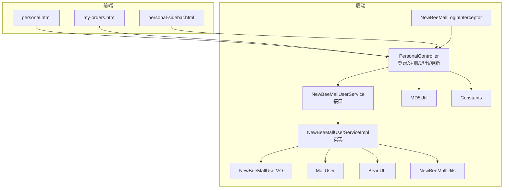
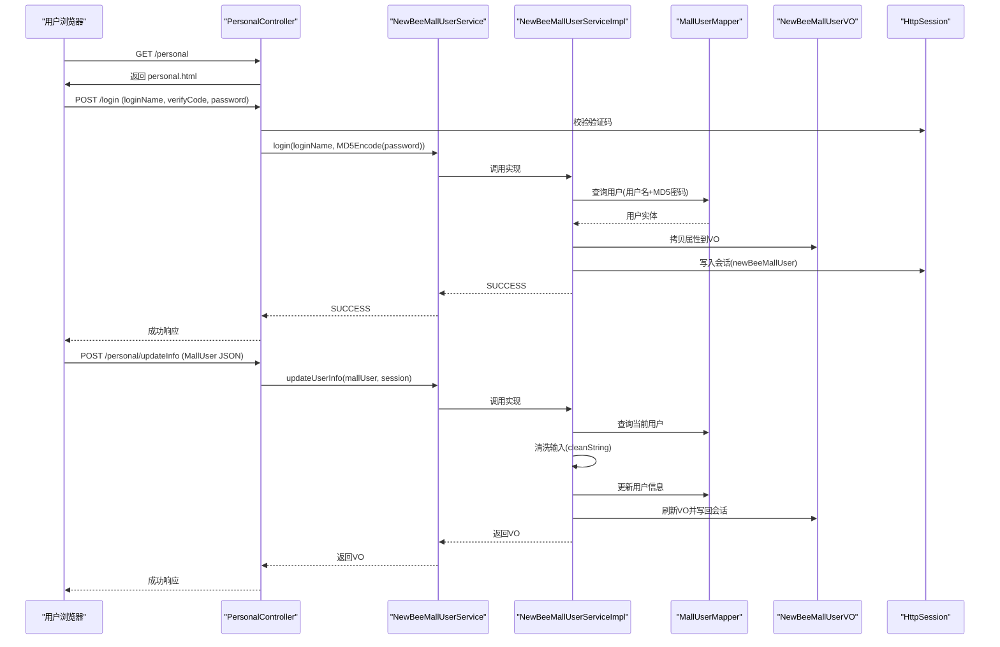
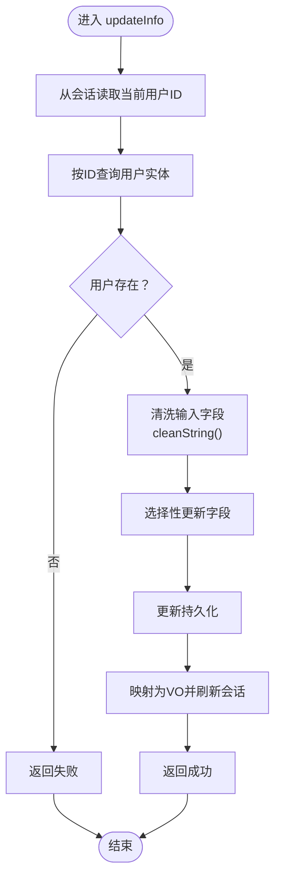
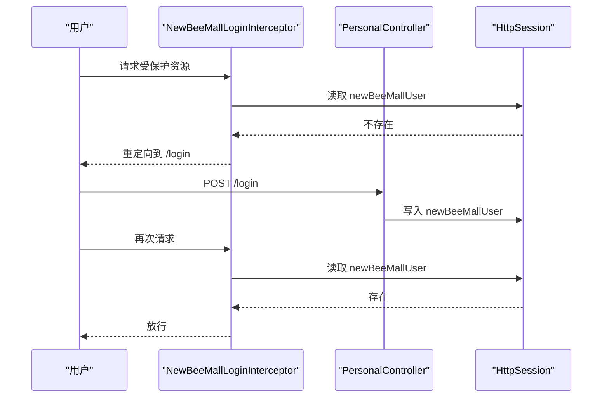
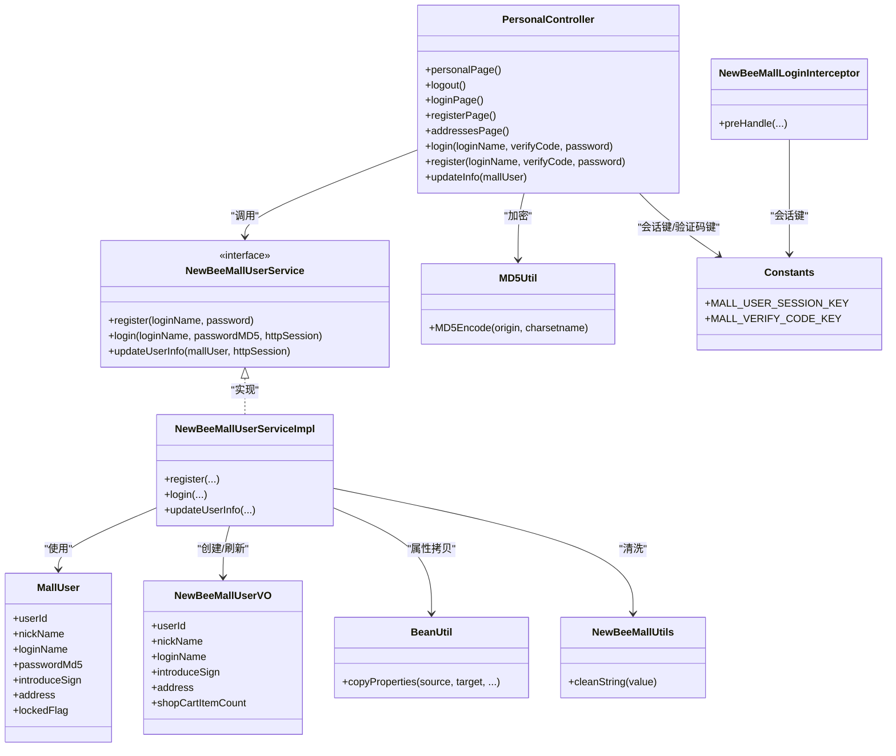

# 用户个人中心

<cite>
**本文引用的文件**
- [PersonalController.java](file://src/main/java/ltd/newbee/mall/controller/mall/PersonalController.java)
- [NewBeeMallUserVO.java](file://src/main/java/ltd/newbee/mall/controller/vo/NewBeeMallUserVO.java)
- [NewBeeMallUserService.java](file://src/main/java/ltd/newbee/mall/service/NewBeeMallUserService.java)
- [NewBeeMallUserServiceImpl.java](file://src/main/java/ltd/newbee/mall/service/impl/NewBeeMallUserServiceImpl.java)
- [MD5Util.java](file://src/main/java/ltd/newbee/mall/util/MD5Util.java)
- [BeanUtil.java](file://src/main/java/ltd/newbee/mall/util/BeanUtil.java)
- [NewBeeMallUtils.java](file://src/main/java/ltd/newbee/mall/util/NewBeeMallUtils.java)
- [Constants.java](file://src/main/java/ltd/newbee/mall/common/Constants.java)
- [NewBeeMallLoginInterceptor.java](file://src/main/java/ltd/newbee/mall/interceptor/NewBeeMallLoginInterceptor.java)
- [MallUser.java](file://src/main/java/ltd/newbee/mall/entity/MallUser.java)
- [personal.html](file://src/main/resources/templates/mall/personal.html)
- [my-orders.html](file://src/main/resources/templates/mall/my-orders.html)
- [personal-sidebar.html](file://src/main/resources/templates/mall/personal-sidebar.html)
</cite>

## 目录
1. [简介](#简介)
2. [项目结构](#项目结构)
3. [核心组件](#核心组件)
4. [架构总览](#架构总览)
5. [组件详解](#组件详解)
6. [依赖关系分析](#依赖关系分析)
7. [性能与安全考量](#性能与安全考量)
8. [故障排查指南](#故障排查指南)
9. [结论](#结论)
10. [附录](#附录)

## 简介
本文件围绕“用户个人中心”功能进行系统化技术文档梳理，重点解析 PersonalController 中的个人信息管理、密码修改入口、收货地址维护等能力，说明 NewBeeMallUserVO 如何在前端安全地暴露用户信息并保护敏感数据；结合 MD5Util 的密码加密策略与数据完整性校验流程，解释个人中心页面如何集成订单历史（my-orders.html）与其他用户相关功能；并提供用户会话管理、密码安全策略与敏感操作验证机制的说明，以及用户信息同步失败等常见问题的解决方案。

## 项目结构
个人中心相关的后端控制器、服务层、工具类与前端模板分布如下：
- 控制器：PersonalController 负责登录、注册、退出、个人信息更新等接口
- 服务层：NewBeeMallUserService 接口及其实现 NewBeeMallUserServiceImpl 提供业务逻辑
- VO 层：NewBeeMallUserVO 作为前后端交互的安全载体
- 工具类：MD5Util、BeanUtil、NewBeeMallUtils、Constants
- 拦截器：NewBeeMallLoginInterceptor 实现会话校验
- 前端模板：personal.html、my-orders.html、personal-sidebar.html

图表来源
- [PersonalController.java](file://src/main/java/ltd/newbee/mall/controller/mall/PersonalController.java#L1-L137)
- [NewBeeMallUserService.java](file://src/main/java/ltd/newbee/mall/service/NewBeeMallUserService.java#L1-L63)
- [NewBeeMallUserServiceImpl.java](file://src/main/java/ltd/newbee/mall/service/impl/NewBeeMallUserServiceImpl.java#L1-L108)
- [NewBeeMallUserVO.java](file://src/main/java/ltd/newbee/mall/controller/vo/NewBeeMallUserVO.java#L1-L75)
- [MallUser.java](file://src/main/java/ltd/newbee/mall/entity/MallUser.java#L1-L125)
- [MD5Util.java](file://src/main/java/ltd/newbee/mall/util/MD5Util.java#L1-L49)
- [BeanUtil.java](file://src/main/java/ltd/newbee/mall/util/BeanUtil.java#L1-L94)
- [NewBeeMallUtils.java](file://src/main/java/ltd/newbee/mall/util/NewBeeMallUtils.java#L1-L57)
- [Constants.java](file://src/main/java/ltd/newbee/mall/common/Constants.java#L1-L48)
- [NewBeeMallLoginInterceptor.java](file://src/main/java/ltd/newbee/mall/interceptor/NewBeeMallLoginInterceptor.java#L1-L49)
- [personal.html](file://src/main/resources/templates/mall/personal.html#L1-L157)
- [my-orders.html](file://src/main/resources/templates/mall/my-orders.html#L1-L144)
- [personal-sidebar.html](file://src/main/resources/templates/mall/personal-sidebar.html#L1-L14)

章节来源
- [PersonalController.java](file://src/main/java/ltd/newbee/mall/controller/mall/PersonalController.java#L1-L137)
- [personal.html](file://src/main/resources/templates/mall/personal.html#L1-L157)
- [my-orders.html](file://src/main/resources/templates/mall/my-orders.html#L1-L144)

## 核心组件
- PersonalController：提供个人中心页面路由、登录/注册/退出、个人信息更新等接口
- NewBeeMallUserService / NewBeeMallUserServiceImpl：封装用户登录、注册、信息更新等业务
- NewBeeMallUserVO：面向前端的安全用户视图对象，仅暴露必要字段
- MD5Util：密码摘要工具，统一使用 MD5 加密
- BeanUtil / NewBeeMallUtils：属性拷贝与字符串清洗
- Constants：会话键名、验证码键名等常量
- NewBeeMallLoginInterceptor：全局登录拦截器，强制校验会话有效性
- MallUser：持久化实体，包含密码MD5、锁定标志等

章节来源
- [NewBeeMallUserVO.java](file://src/main/java/ltd/newbee/mall/controller/vo/NewBeeMallUserVO.java#L1-L75)
- [NewBeeMallUserService.java](file://src/main/java/ltd/newbee/mall/service/NewBeeMallUserService.java#L1-L63)
- [NewBeeMallUserServiceImpl.java](file://src/main/java/ltd/newbee/mall/service/impl/NewBeeMallUserServiceImpl.java#L1-L108)
- [MD5Util.java](file://src/main/java/ltd/newbee/mall/util/MD5Util.java#L1-L49)
- [BeanUtil.java](file://src/main/java/ltd/newbee/mall/util/BeanUtil.java#L1-L94)
- [NewBeeMallUtils.java](file://src/main/java/ltd/newbee/mall/util/NewBeeMallUtils.java#L1-L57)
- [Constants.java](file://src/main/java/ltd/newbee/mall/common/Constants.java#L1-L48)
- [NewBeeMallLoginInterceptor.java](file://src/main/java/ltd/newbee/mall/interceptor/NewBeeMallLoginInterceptor.java#L1-L49)
- [MallUser.java](file://src/main/java/ltd/newbee/mall/entity/MallUser.java#L1-L125)

## 架构总览
个人中心采用“控制器-服务-DAO-模板”的分层架构，配合拦截器实现会话校验，前端通过 Thymeleaf 渲染页面并与控制器交互。

图表来源
- [PersonalController.java](file://src/main/java/ltd/newbee/mall/controller/mall/PersonalController.java#L62-L135)
- [NewBeeMallUserServiceImpl.java](file://src/main/java/ltd/newbee/mall/service/impl/NewBeeMallUserServiceImpl.java#L55-L98)
- [BeanUtil.java](file://src/main/java/ltd/newbee/mall/util/BeanUtil.java#L1-L94)
- [NewBeeMallUtils.java](file://src/main/java/ltd/newbee/mall/util/NewBeeMallUtils.java#L1-L57)
- [Constants.java](file://src/main/java/ltd/newbee/mall/common/Constants.java#L36-L39)

## 组件详解

### 个人信息管理（更新）
- 接口路径：POST /personal/updateInfo
- 输入：MallUser 对象（JSON），包含 userId、nickName、introduceSign、address
- 流程要点：
  - 从会话读取当前用户标识
  - 从数据库加载用户实体
  - 使用 NewBeeMallUtils.cleanString 对输入进行安全清洗
  - 选择性更新昵称、个性签名、收货地址
  - 将变更后的实体映射为 NewBeeMallUserVO 并刷新会话
  - 返回成功结果

图表来源
- [PersonalController.java](file://src/main/java/ltd/newbee/mall/controller/mall/PersonalController.java#L123-L135)
- [NewBeeMallUserServiceImpl.java](file://src/main/java/ltd/newbee/mall/service/impl/NewBeeMallUserServiceImpl.java#L76-L98)
- [NewBeeMallUtils.java](file://src/main/java/ltd/newbee/mall/util/NewBeeMallUtils.java#L22-L55)
- [BeanUtil.java](file://src/main/java/ltd/newbee/mall/util/BeanUtil.java#L1-L94)

章节来源
- [PersonalController.java](file://src/main/java/ltd/newbee/mall/controller/mall/PersonalController.java#L123-L135)
- [NewBeeMallUserServiceImpl.java](file://src/main/java/ltd/newbee/mall/service/impl/NewBeeMallUserServiceImpl.java#L76-L98)

### 密码修改机制
- 当前实现：PersonalController 提供登录/注册/退出等接口，但未提供专门的“修改密码”接口
- 安全策略：
  - 登录时对明文密码进行 MD5 加密后再校验
  - 注册时同样对明文密码进行 MD5 存储
  - 用户信息更新接口不涉及密码字段，避免直接暴露密码修改入口
- 建议扩展：新增 POST /personal/updatePassword 接口，参数包含旧密码（MD5）、新密码（MD5），服务层先校验旧密码再更新

章节来源
- [PersonalController.java](file://src/main/java/ltd/newbee/mall/controller/mall/PersonalController.java#L62-L121)
- [NewBeeMallUserServiceImpl.java](file://src/main/java/ltd/newbee/mall/service/impl/NewBeeMallUserServiceImpl.java#L39-L53)
- [MD5Util.java](file://src/main/java/ltd/newbee/mall/util/MD5Util.java#L30-L44)

### 收货地址维护
- 前端表单：personal.html 中的模态框包含 address 字段输入
- 验证规则：前端 JS 对 address 长度进行校验（长度阈值在模板中定义）
- 后端更新：PersonalController 接收 MallUser.address 并由服务层选择性更新

章节来源
- [personal.html](file://src/main/resources/templates/mall/personal.html#L67-L71)
- [personal.html](file://src/main/resources/templates/mall/personal.html#L100-L124)
- [PersonalController.java](file://src/main/java/ltd/newbee/mall/controller/mall/PersonalController.java#L123-L135)
- [NewBeeMallUserServiceImpl.java](file://src/main/java/ltd/newbee/mall/service/impl/NewBeeMallUserServiceImpl.java#L84-L89)

### NewBeeMallUserVO 的安全设计
- 字段选择：仅暴露 userId、nickName、loginName、introduceSign、address、shopCartItemCount 等非敏感字段
- 前端渲染：personal.html 通过 Thymeleaf 从会话读取 newBeeMallUser，避免直接暴露数据库实体
- 敏感信息保护：passwordMd5、createTime 等未出现在 VO 中，防止泄露

章节来源
- [NewBeeMallUserVO.java](file://src/main/java/ltd/newbee/mall/controller/vo/NewBeeMallUserVO.java#L1-L75)
- [personal.html](file://src/main/resources/templates/mall/personal.html#L23-L36)
- [NewBeeMallUserServiceImpl.java](file://src/main/java/ltd/newbee/mall/service/impl/NewBeeMallUserServiceImpl.java#L67-L70)

### 个人中心页面与订单历史集成
- 侧边栏导航：personal-sidebar.html 提供“个人信息”“我的订单”“退出登录”跳转
- 订单列表：my-orders.html 通过 Thymeleaf 渲染订单分页列表，支持分页导航
- 页面联动：从“个人信息”可跳转至“我的订单”，形成统一的用户中心体验

章节来源
- [personal-sidebar.html](file://src/main/resources/templates/mall/personal-sidebar.html#L1-L14)
- [my-orders.html](file://src/main/resources/templates/mall/my-orders.html#L1-L144)
- [personal.html](file://src/main/resources/templates/mall/personal.html#L1-L157)

### 用户会话管理与拦截
- 会话键：Constants 中定义 MALL_USER_SESSION_KEY 为 newBeeMallUser
- 登录成功：服务层将 NewBeeMallUserVO 写入会话
- 全局拦截：NewBeeMallLoginInterceptor 在请求到达控制器前校验会话是否存在
- 退出登录：PersonalController 清除会话键并重定向到登录页

图表来源
- [NewBeeMallLoginInterceptor.java](file://src/main/java/ltd/newbee/mall/interceptor/NewBeeMallLoginInterceptor.java#L30-L38)
- [PersonalController.java](file://src/main/java/ltd/newbee/mall/controller/mall/PersonalController.java#L41-L45)
- [Constants.java](file://src/main/java/ltd/newbee/mall/common/Constants.java#L36-L39)
- [NewBeeMallUserServiceImpl.java](file://src/main/java/ltd/newbee/mall/service/impl/NewBeeMallUserServiceImpl.java#L67-L70)

章节来源
- [Constants.java](file://src/main/java/ltd/newbee/mall/common/Constants.java#L36-L39)
- [NewBeeMallLoginInterceptor.java](file://src/main/java/ltd/newbee/mall/interceptor/NewBeeMallLoginInterceptor.java#L30-L38)
- [PersonalController.java](file://src/main/java/ltd/newbee/mall/controller/mall/PersonalController.java#L41-L45)

## 依赖关系分析

图表来源
- [PersonalController.java](file://src/main/java/ltd/newbee/mall/controller/mall/PersonalController.java#L1-L137)
- [NewBeeMallUserService.java](file://src/main/java/ltd/newbee/mall/service/NewBeeMallUserService.java#L1-L63)
- [NewBeeMallUserServiceImpl.java](file://src/main/java/ltd/newbee/mall/service/impl/NewBeeMallUserServiceImpl.java#L1-L108)
- [NewBeeMallUserVO.java](file://src/main/java/ltd/newbee/mall/controller/vo/NewBeeMallUserVO.java#L1-L75)
- [MallUser.java](file://src/main/java/ltd/newbee/mall/entity/MallUser.java#L1-L125)
- [MD5Util.java](file://src/main/java/ltd/newbee/mall/util/MD5Util.java#L1-L49)
- [BeanUtil.java](file://src/main/java/ltd/newbee/mall/util/BeanUtil.java#L1-L94)
- [NewBeeMallUtils.java](file://src/main/java/ltd/newbee/mall/util/NewBeeMallUtils.java#L1-L57)
- [Constants.java](file://src/main/java/ltd/newbee/mall/common/Constants.java#L1-L48)
- [NewBeeMallLoginInterceptor.java](file://src/main/java/ltd/newbee/mall/interceptor/NewBeeMallLoginInterceptor.java#L1-L49)

## 性能与安全考量
- 密码安全
  - 明文密码统一经 MD5Util 进行摘要存储与比对，降低明文泄露风险
  - 建议引入盐值与更安全的哈希算法（如 bcrypt）以提升抗破解能力
- 输入清洗
  - 使用 NewBeeMallUtils.cleanString 对输入进行 XSS 风险字符替换，减少注入风险
- 会话安全
  - 通过拦截器强制校验会话，避免未登录访问
  - 登录成功后及时清理验证码键，降低验证码复用风险
- 数据完整性
  - updateUserInfo 采用选择性更新，避免覆盖空字段
  - 前端对 address、introduceSign、nickName 等字段进行最小长度校验，减少无效数据入库

章节来源
- [MD5Util.java](file://src/main/java/ltd/newbee/mall/util/MD5Util.java#L30-L44)
- [NewBeeMallUtils.java](file://src/main/java/ltd/newbee/mall/util/NewBeeMallUtils.java#L22-L55)
- [NewBeeMallLoginInterceptor.java](file://src/main/java/ltd/newbee/mall/interceptor/NewBeeMallLoginInterceptor.java#L30-L38)
- [PersonalController.java](file://src/main/java/ltd/newbee/mall/controller/mall/PersonalController.java#L62-L121)
- [NewBeeMallUserServiceImpl.java](file://src/main/java/ltd/newbee/mall/service/impl/NewBeeMallUserServiceImpl.java#L76-L98)

## 故障排查指南
- 登录失败
  - 现象：返回错误码或提示
  - 排查：确认验证码是否正确、用户名是否存在、账户是否被锁定、密码是否匹配
  - 参考路径：[PersonalController.java](file://src/main/java/ltd/newbee/mall/controller/mall/PersonalController.java#L62-L91)、[NewBeeMallUserServiceImpl.java](file://src/main/java/ltd/newbee/mall/service/impl/NewBeeMallUserServiceImpl.java#L55-L74)
- 注册失败
  - 现象：用户名重复或数据库异常
  - 排查：检查用户名唯一性、数据库连接与事务
  - 参考路径：[NewBeeMallUserServiceImpl.java](file://src/main/java/ltd/newbee/mall/service/impl/NewBeeMallUserServiceImpl.java#L39-L53)
- 个人信息更新失败
  - 现象：返回失败或页面未刷新
  - 排查：确认会话中存在 newBeeMallUser、用户存在且可更新、前端传参完整
  - 参考路径：[PersonalController.java](file://src/main/java/ltd/newbee/mall/controller/mall/PersonalController.java#L123-L135)、[NewBeeMallUserServiceImpl.java](file://src/main/java/ltd/newbee/mall/service/impl/NewBeeMallUserServiceImpl.java#L76-L98)
- 会话失效
  - 现象：访问受保护页面被重定向到登录页
  - 排查：确认会话键 newBeeMallUser 是否存在、拦截器是否生效
  - 参考路径：[NewBeeMallLoginInterceptor.java](file://src/main/java/ltd/newbee/mall/interceptor/NewBeeMallLoginInterceptor.java#L30-L38)、[Constants.java](file://src/main/java/ltd/newbee/mall/common/Constants.java#L36-L39)
- 收货地址长度校验失败
  - 现象：前端弹出错误提示
  - 排查：确认 address 字段长度满足模板要求
  - 参考路径：[personal.html](file://src/main/resources/templates/mall/personal.html#L100-L124)

章节来源
- [PersonalController.java](file://src/main/java/ltd/newbee/mall/controller/mall/PersonalController.java#L62-L135)
- [NewBeeMallUserServiceImpl.java](file://src/main/java/ltd/newbee/mall/service/impl/NewBeeMallUserServiceImpl.java#L39-L98)
- [NewBeeMallLoginInterceptor.java](file://src/main/java/ltd/newbee/mall/interceptor/NewBeeMallLoginInterceptor.java#L30-L38)
- [Constants.java](file://src/main/java/ltd/newbee/mall/common/Constants.java#L36-L39)
- [personal.html](file://src/main/resources/templates/mall/personal.html#L100-L124)

## 结论
个人中心功能通过 PersonalController 提供统一入口，结合 NewBeeMallUserService 的业务实现与 NewBeeMallUserVO 的安全视图，实现了个人信息的可控暴露与更新；配合 MD5Util 的密码处理与拦截器的会话校验，保障了基本的安全性。建议后续补充独立的密码修改接口与更强的密码安全策略，进一步完善用户体验与安全性。

## 附录
- 常用路径参考
  - 个人中心页面：personal.html
  - 订单列表页面：my-orders.html
  - 侧边栏导航：personal-sidebar.html
  - 登录接口：POST /login
  - 注册接口：POST /register
  - 退出接口：GET /logout
  - 个人信息更新接口：POST /personal/updateInfo

章节来源
- [personal.html](file://src/main/resources/templates/mall/personal.html#L1-L157)
- [my-orders.html](file://src/main/resources/templates/mall/my-orders.html#L1-L144)
- [personal-sidebar.html](file://src/main/resources/templates/mall/personal-sidebar.html#L1-L14)
- [PersonalController.java](file://src/main/java/ltd/newbee/mall/controller/mall/PersonalController.java#L34-L135)