# 订单管理

<cite>
**本文档引用的文件**  
- [OrderController.java](file://src/main/java/ltd/newbee/mall/controller/mall/OrderController.java)
- [NewBeeMallOrderService.java](file://src/main/java/ltd/newbee/mall/service/NewBeeMallOrderService.java)
- [NewBeeMallOrderServiceImpl.java](file://src/main/java/ltd/newbee/mall/service/impl/NewBeeMallOrderServiceImpl.java)
- [NewBeeMallOrderStatusEnum.java](file://src/main/java/ltd/newbee/mall/common/NewBeeMallOrderStatusEnum.java)
- [NewBeeMallOrderListVO.java](file://src/main/java/ltd/newbee/mall/controller/vo/NewBeeMallOrderListVO.java)
- [NewBeeMallOrderDetailVO.java](file://src/main/java/ltd/newbee/mall/controller/vo/NewBeeMallOrderDetailVO.java)
- [NumberUtil.java](file://src/main/java/ltd/newbee/mall/util/NumberUtil.java)
- [NewBeeMallOrder.java](file://src/main/java/ltd/newbee/mall/entity/NewBeeMallOrder.java)
- [NewBeeMallOrderItem.java](file://src/main/java/ltd/newbee/mall/entity/NewBeeMallOrderItem.java)
- [NewBeeMallOrderMapper.java](file://src/main/java/ltd/newbee/mall/dao/NewBeeMallOrderMapper.java)
- [NewBeeMallOrderItemMapper.java](file://src/main/java/ltd/newbee/mall/dao/NewBeeMallOrderItemMapper.java)
- [PayStatusEnum.java](file://src/main/java/ltd/newbee/mall/common/PayStatusEnum.java)
- [PayTypeEnum.java](file://src/main/java/ltd/newbee/mall/common/PayTypeEnum.java)
</cite>

## 目录
1. [项目结构](#项目结构)
2. [核心组件](#核心组件)
3. [订单创建流程](#订单创建流程)
4. [订单结算流程](#订单结算流程)
5. [订单查询功能](#订单查询功能)
6. [订单状态机管理](#订单状态机管理)
7. [订单号生成策略](#订单号生成策略)
8. [价格计算逻辑](#价格计算逻辑)
9. [订单数据VO结构](#订单数据vo结构)
10. [订单超时处理](#订单超时处理)
11. [支付状态同步](#支付状态同步)
12. [订单取消流程](#订单取消流程)
13. [数据一致性排查](#数据一致性排查)

## 项目结构

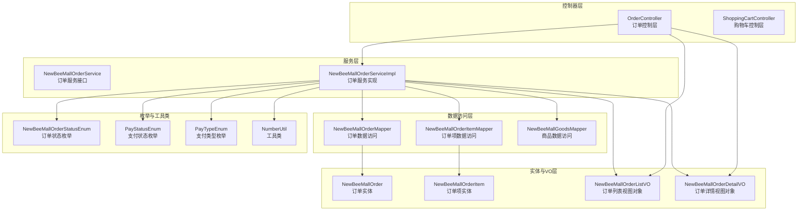

**图示来源**
- [OrderController.java](file://src/main/java/ltd/newbee/mall/controller/mall/OrderController.java)
- [NewBeeMallOrderService.java](file://src/main/java/ltd/newbee/mall/service/NewBeeMallOrderService.java)
- [NewBeeMallOrderServiceImpl.java](file://src/main/java/ltd/newbee/mall/service/impl/NewBeeMallOrderServiceImpl.java)
- [NewBeeMallOrderMapper.java](file://src/main/java/ltd/newbee/mall/dao/NewBeeMallOrderMapper.java)
- [NewBeeMallOrderItemMapper.java](file://src/main/java/ltd/newbee/mall/dao/NewBeeMallOrderItemMapper.java)
- [NewBeeMallOrderStatusEnum.java](file://src/main/java/ltd/newbee/mall/common/NewBeeMallOrderStatusEnum.java)
- [PayStatusEnum.java](file://src/main/java/ltd/newbee/mall/common/PayStatusEnum.java)
- [PayTypeEnum.java](file://src/main/java/ltd/newbee/mall/common/PayTypeEnum.java)
- [NumberUtil.java](file://src/main/java/ltd/newbee/mall/util/NumberUtil.java)

**章节来源**
- [OrderController.java](file://src/main/java/ltd/newbee/mall/controller/mall/OrderController.java)
- [NewBeeMallOrderService.java](file://src/main/java/ltd/newbee/mall/service/NewBeeMallOrderService.java)
- [NewBeeMallOrderServiceImpl.java](file://src/main/java/ltd/newbee/mall/service/impl/NewBeeMallOrderServiceImpl.java)

## 核心组件

订单管理功能的核心组件包括订单控制器（OrderController）、订单服务（NewBeeMallOrderService）、订单数据访问层（NewBeeMallOrderMapper）以及相关的视图对象（VO）和枚举类。系统采用典型的三层架构，控制器层负责处理HTTP请求，服务层实现核心业务逻辑，数据访问层负责与数据库交互。

订单创建、结算和查询等核心功能通过事务管理确保数据一致性，特别是在库存扣减和订单生成过程中。系统使用MyBatis作为ORM框架，通过Mapper接口与数据库进行交互。

**章节来源**
- [OrderController.java](file://src/main/java/ltd/newbee/mall/controller/mall/OrderController.java)
- [NewBeeMallOrderService.java](file://src/main/java/ltd/newbee/mall/service/NewBeeMallOrderService.java)
- [NewBeeMallOrderServiceImpl.java](file://src/main/java/ltd/newbee/mall/service/impl/NewBeeMallOrderServiceImpl.java)

## 订单创建流程

订单创建流程从购物车提交开始，通过`saveOrder`方法实现完整的事务处理。该流程包括收货地址验证、购物车数据获取、商品状态检查、库存验证、购物车项删除、库存扣减、订单号生成、订单创建和订单项创建等步骤。

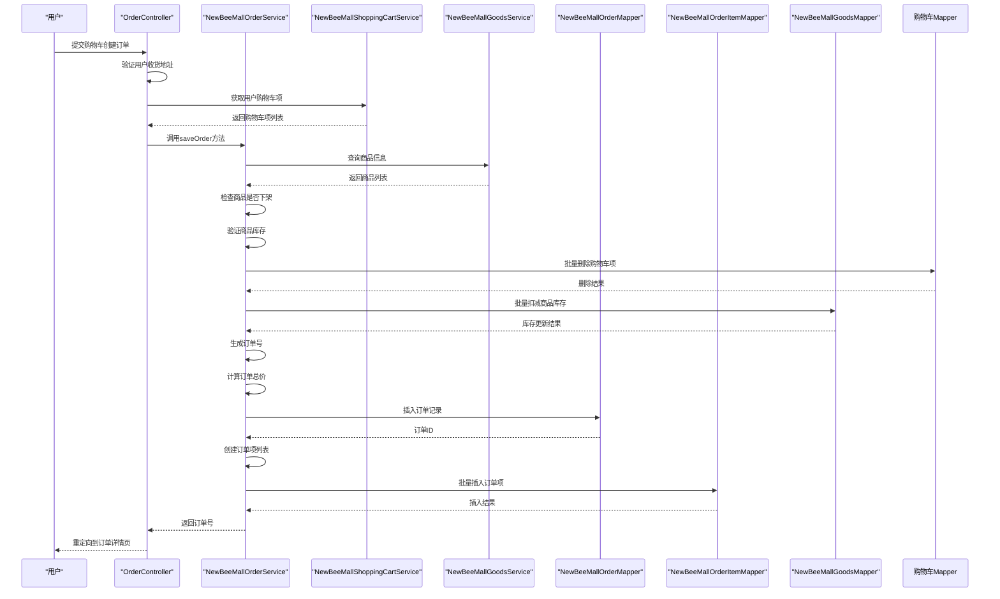

**图示来源**
- [OrderController.java](file://src/main/java/ltd/newbee/mall/controller/mall/OrderController.java#L67-L83)
- [NewBeeMallOrderServiceImpl.java](file://src/main/java/ltd/newbee/mall/service/impl/NewBeeMallOrderServiceImpl.java#L186-L262)

**章节来源**
- [OrderController.java](file://src/main/java/ltd/newbee/mall/controller/mall/OrderController.java#L67-L83)
- [NewBeeMallOrderServiceImpl.java](file://src/main/java/ltd/newbee/mall/service/impl/NewBeeMallOrderServiceImpl.java#L186-L262)

## 订单结算流程

订单结算流程涉及支付方式选择、支付页面跳转和支付成功处理。用户在订单详情页选择支付方式后，系统验证订单状态和用户权限，然后跳转到相应的支付页面。支付成功后，通过回调接口更新订单状态。

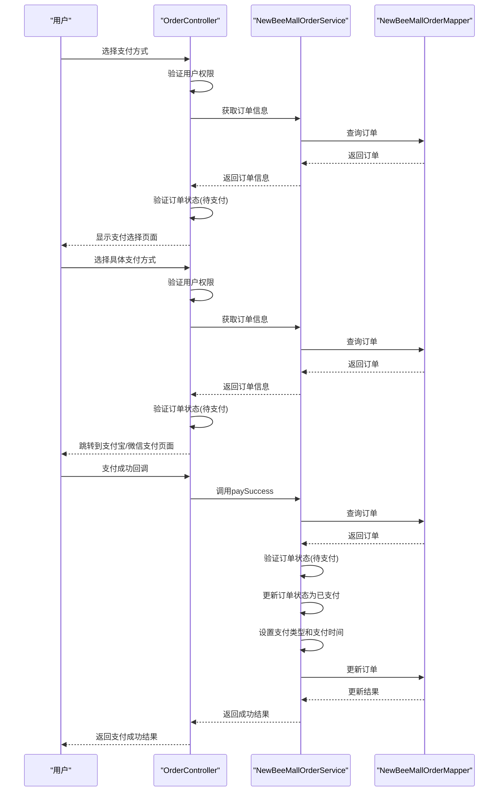

**图示来源**
- [OrderController.java](file://src/main/java/ltd/newbee/mall/controller/mall/OrderController.java#L109-L157)
- [NewBeeMallOrderServiceImpl.java](file://src/main/java/ltd/newbee/mall/service/impl/NewBeeMallOrderServiceImpl.java#L374-L394)

**章节来源**
- [OrderController.java](file://src/main/java/ltd/newbee/mall/controller/mall/OrderController.java#L109-L157)
- [NewBeeMallOrderServiceImpl.java](file://src/main/java/ltd/newbee/mall/service/impl/NewBeeMallOrderServiceImpl.java#L374-L394)

## 订单查询功能

订单查询功能包括订单详情查询和订单列表查询，通过不同的VO对象为不同页面提供定制化数据。订单详情查询返回完整的订单信息，包括订单项列表；订单列表查询返回分页的订单摘要信息。

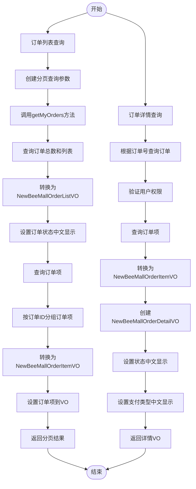

**图示来源**
- [OrderController.java](file://src/main/java/ltd/newbee/mall/controller/mall/OrderController.java#L52-L65)
- [NewBeeMallOrderServiceImpl.java](file://src/main/java/ltd/newbee/mall/service/impl/NewBeeMallOrderServiceImpl.java#L294-L323)
- [NewBeeMallOrderServiceImpl.java](file://src/main/java/ltd/newbee/mall/service/impl/NewBeeMallOrderServiceImpl.java#L264-L287)

**章节来源**
- [OrderController.java](file://src/main/java/ltd/newbee/mall/controller/mall/OrderController.java#L52-L65)
- [NewBeeMallOrderServiceImpl.java](file://src/main/java/ltd/newbee/mall/service/impl/NewBeeMallOrderServiceImpl.java#L264-L323)

## 订单状态机管理

订单状态机通过NewBeeMallOrderStatusEnum枚举类实现，定义了订单的完整生命周期。系统通过状态码控制订单状态的转换，确保业务流程的正确性。

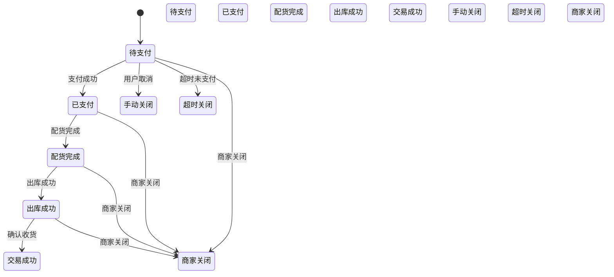

**图示来源**
- [NewBeeMallOrderStatusEnum.java](file://src/main/java/ltd/newbee/mall/common/NewBeeMallOrderStatusEnum.java)

**章节来源**
- [NewBeeMallOrderStatusEnum.java](file://src/main/java/ltd/newbee/mall/common/NewBeeMallOrderStatusEnum.java)

## 订单号生成策略

订单号生成策略通过NumberUtil工具类的genOrderNo方法实现，采用时间戳加随机数的方式生成唯一订单号，确保订单号的全局唯一性和可追溯性。

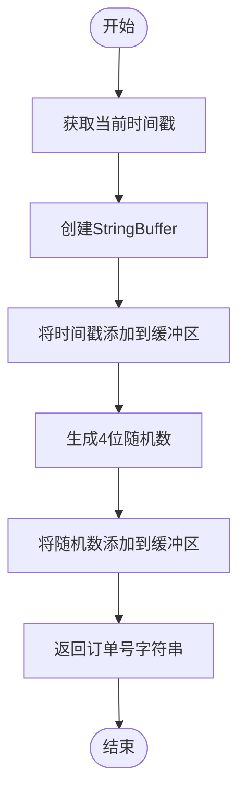

**图示来源**
- [NumberUtil.java](file://src/main/java/ltd/newbee/mall/util/NumberUtil.java#L53-L58)

**章节来源**
- [NumberUtil.java](file://src/main/java/ltd/newbee/mall/util/NumberUtil.java#L53-L58)

## 价格计算逻辑

订单价格计算逻辑在订单创建时执行，系统遍历购物车中的每个商品项，将商品销售价格乘以购买数量，累加得到订单总价。系统在计算前会验证商品是否下架和库存是否充足。

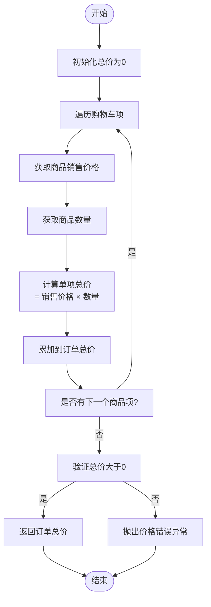

**图示来源**
- [NewBeeMallOrderServiceImpl.java](file://src/main/java/ltd/newbee/mall/service/impl/NewBeeMallOrderServiceImpl.java#L220-L234)

**章节来源**
- [NewBeeMallOrderServiceImpl.java](file://src/main/java/ltd/newbee/mall/service/impl/NewBeeMallOrderServiceImpl.java#L220-L234)

## 订单数据VO结构

订单系统使用两种视图对象（VO）为不同页面提供定制化数据：NewBeeMallOrderListVO用于订单列表页面，NewBeeMallOrderDetailVO用于订单详情页面。

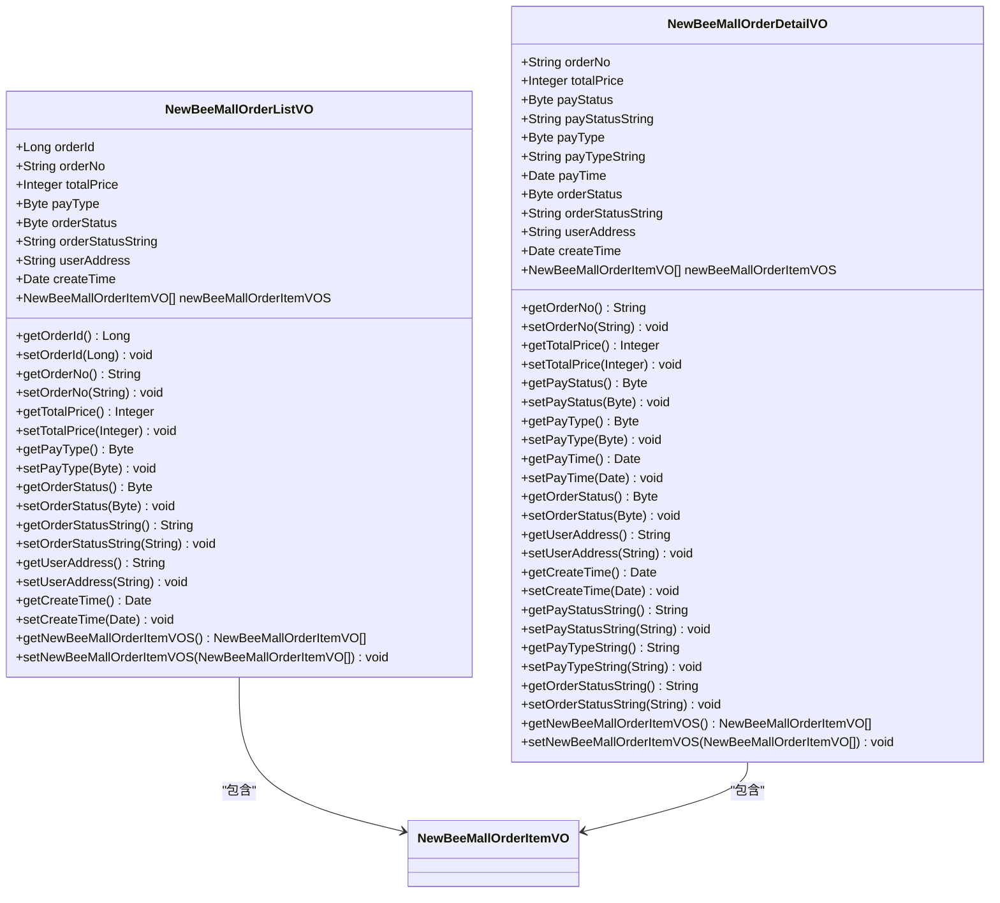

**图示来源**
- [NewBeeMallOrderListVO.java](file://src/main/java/ltd/newbee/mall/controller/vo/NewBeeMallOrderListVO.java)
- [NewBeeMallOrderDetailVO.java](file://src/main/java/ltd/newbee/mall/controller/vo/NewBeeMallOrderDetailVO.java)

**章节来源**
- [NewBeeMallOrderListVO.java](file://src/main/java/ltd/newbee/mall/controller/vo/NewBeeMallOrderListVO.java)
- [NewBeeMallOrderDetailVO.java](file://src/main/java/ltd/newbee/mall/controller/vo/NewBeeMallOrderDetailVO.java)

## 订单超时处理

订单超时处理通过系统定时任务或外部监控服务实现，当订单处于"待支付"状态超过规定时间（通常为30分钟）时，系统自动将订单状态更新为"超时关闭"，并恢复相应的商品库存。

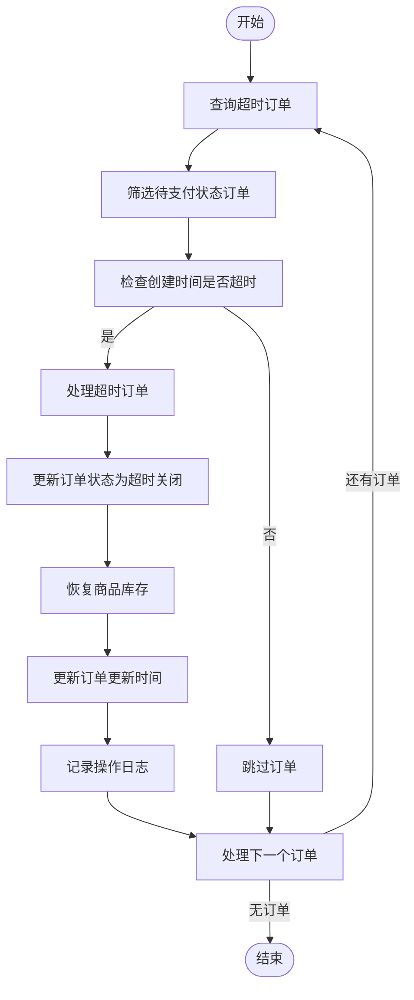

**图示来源**
- [NewBeeMallOrderStatusEnum.java](file://src/main/java/ltd/newbee/mall/common/NewBeeMallOrderStatusEnum.java)
- [NewBeeMallOrderServiceImpl.java](file://src/main/java/ltd/newbee/mall/service/impl/NewBeeMallOrderServiceImpl.java#L147-L183)

**章节来源**
- [NewBeeMallOrderStatusEnum.java](file://src/main/java/ltd/newbee/mall/common/NewBeeMallOrderStatusEnum.java)
- [NewBeeMallOrderServiceImpl.java](file://src/main/java/ltd/newbee/mall/service/impl/NewBeeMallOrderServiceImpl.java#L147-L183)

## 支付状态同步

支付状态同步通过支付成功回调接口实现，当第三方支付平台完成支付后，会调用系统的paySuccess接口，系统验证订单状态后更新支付相关信息。

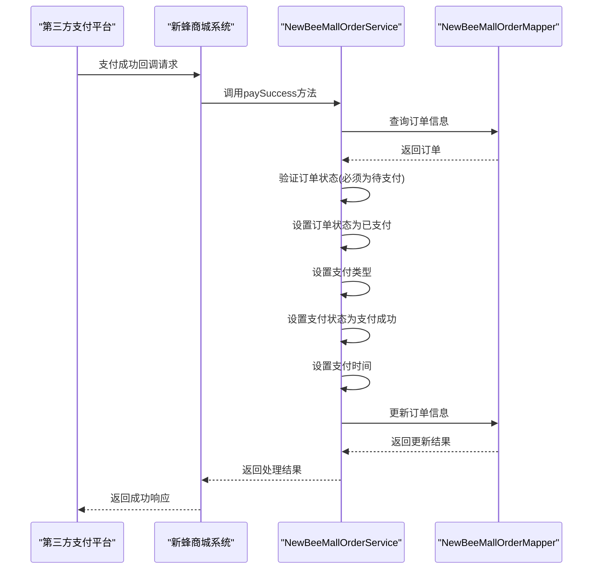

**图示来源**
- [NewBeeMallOrderServiceImpl.java](file://src/main/java/ltd/newbee/mall/service/impl/NewBeeMallOrderServiceImpl.java#L374-L394)
- [PayStatusEnum.java](file://src/main/java/ltd/newbee/mall/common/PayStatusEnum.java)
- [PayTypeEnum.java](file://src/main/java/ltd/newbee/mall/common/PayTypeEnum.java)

**章节来源**
- [NewBeeMallOrderServiceImpl.java](file://src/main/java/ltd/newbee/mall/service/impl/NewBeeMallOrderServiceImpl.java#L374-L394)

## 订单取消流程

订单取消流程允许用户在订单未完成前手动取消订单，系统会验证订单状态，更新订单状态为"手动关闭"，并恢复相应的商品库存。

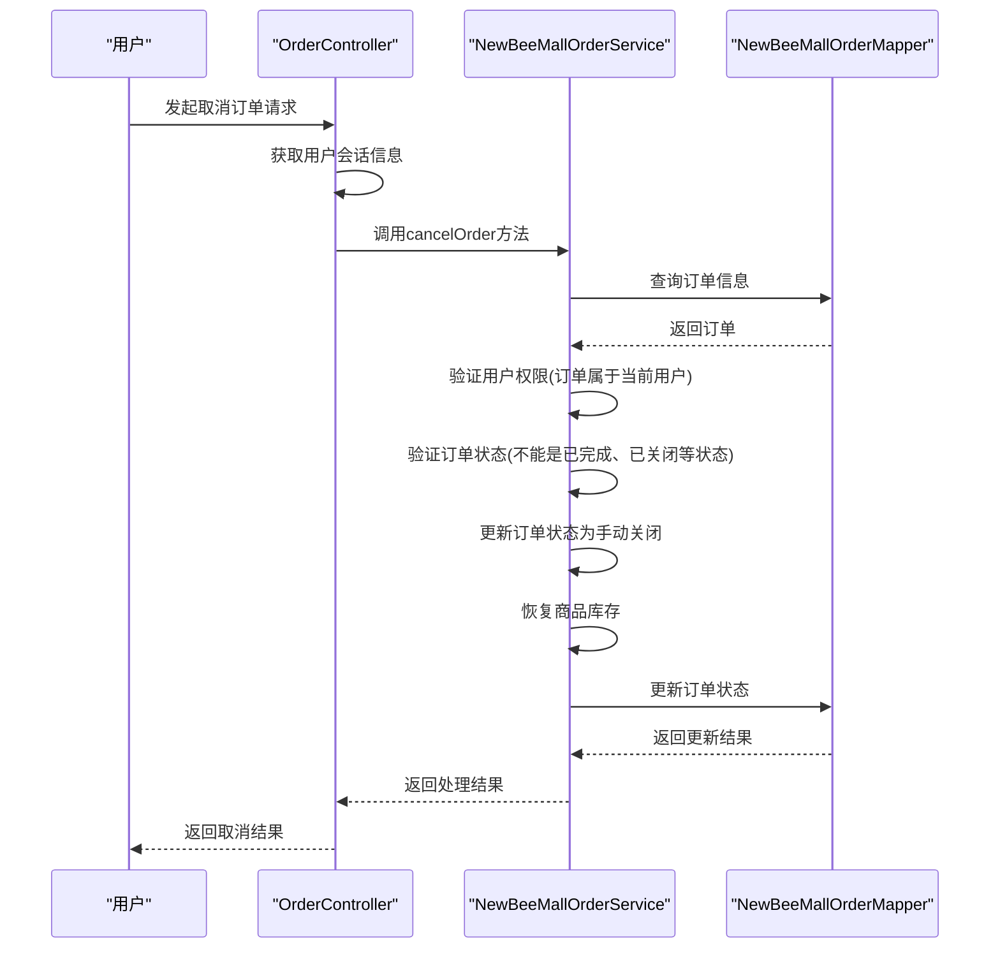

**图示来源**
- [OrderController.java](file://src/main/java/ltd/newbee/mall/controller/mall/OrderController.java#L85-L95)
- [NewBeeMallOrderServiceImpl.java](file://src/main/java/ltd/newbee/mall/service/impl/NewBeeMallOrderServiceImpl.java#L325-L349)

**章节来源**
- [OrderController.java](file://src/main/java/ltd/newbee/mall/controller/mall/OrderController.java#L85-L95)
- [NewBeeMallOrderServiceImpl.java](file://src/main/java/ltd/newbee/mall/service/impl/NewBeeMallOrderServiceImpl.java#L325-L349)

## 数据一致性排查

订单数据不一致问题可能出现在订单创建、支付状态更新或库存管理等环节。以下是常见的排查方法和解决方案。

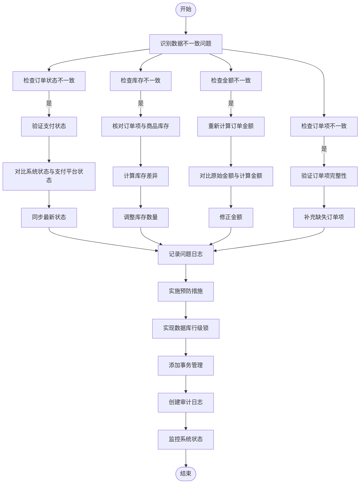

**图示来源**
- [NewBeeMallOrderServiceImpl.java](file://src/main/java/ltd/newbee/mall/service/impl/NewBeeMallOrderServiceImpl.java)
- [NewBeeMallOrderMapper.java](file://src/main/java/ltd/newbee/mall/dao/NewBeeMallOrderMapper.java)
- [NewBeeMallOrderItemMapper.java](file://src/main/java/ltd/newbee/mall/dao/NewBeeMallOrderItemMapper.java)

**章节来源**
- [NewBeeMallOrderServiceImpl.java](file://src/main/java/ltd/newbee/mall/service/impl/NewBeeMallOrderServiceImpl.java)
- [NewBeeMallOrderMapper.java](file://src/main/java/ltd/newbee/mall/dao/NewBeeMallOrderMapper.java)
- [NewBeeMallOrderItemMapper.java](file://src/main/java/ltd/newbee/mall/dao/NewBeeMallOrderItemMapper.java)