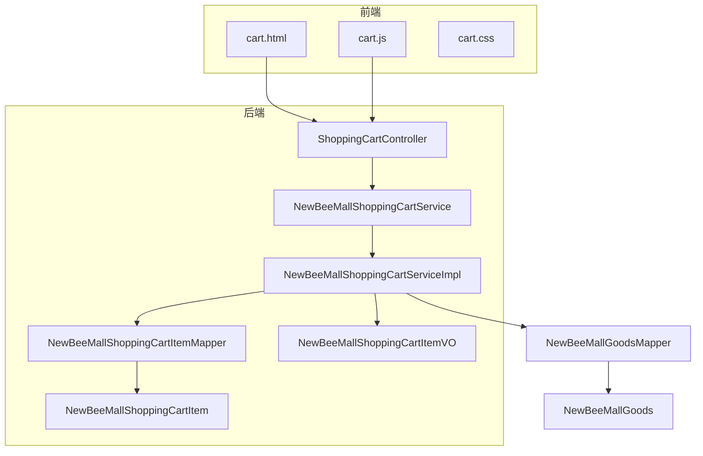
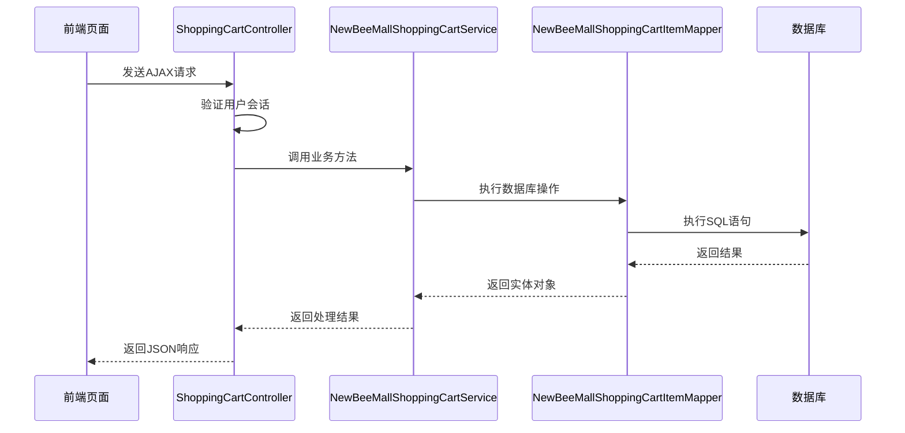
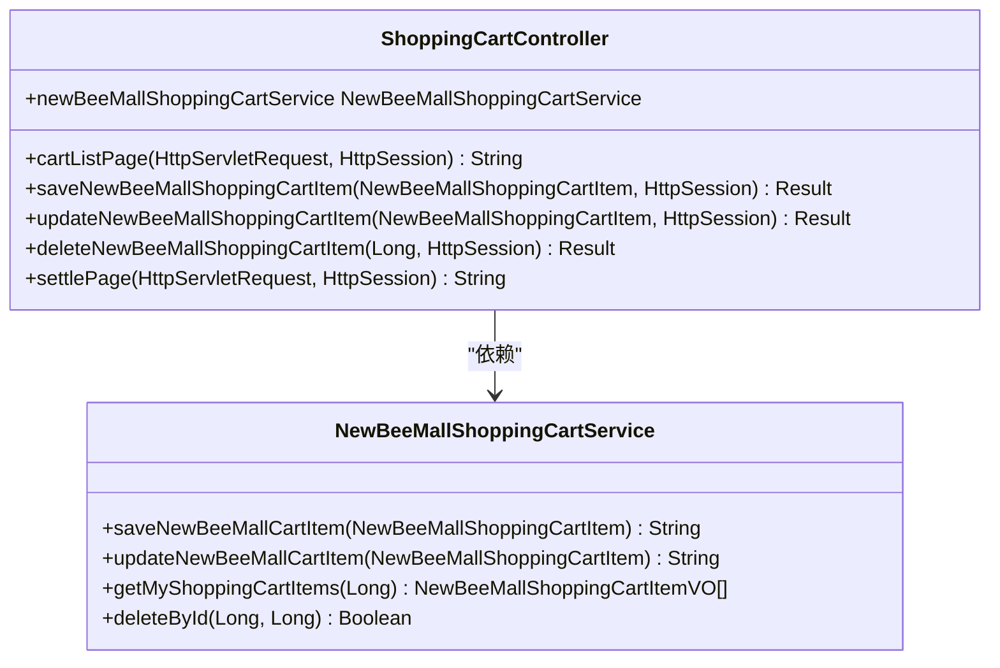
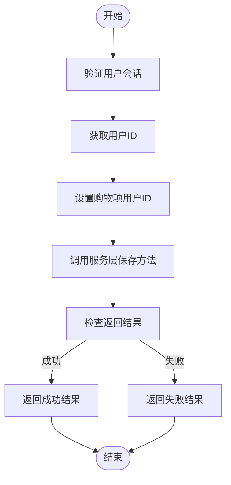
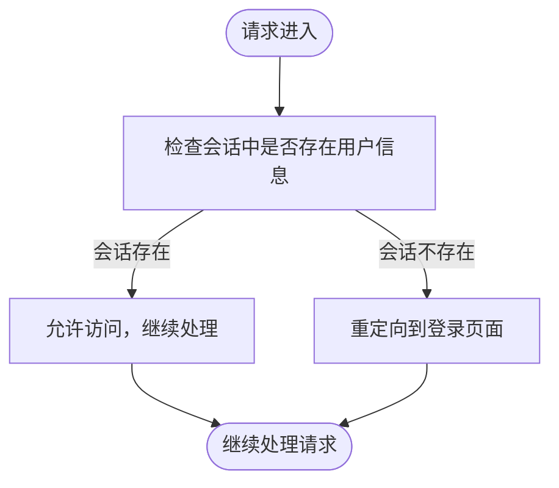
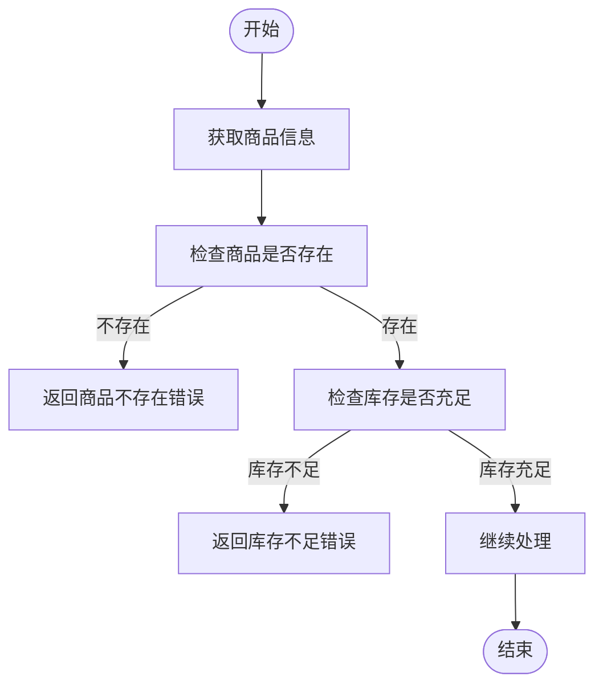
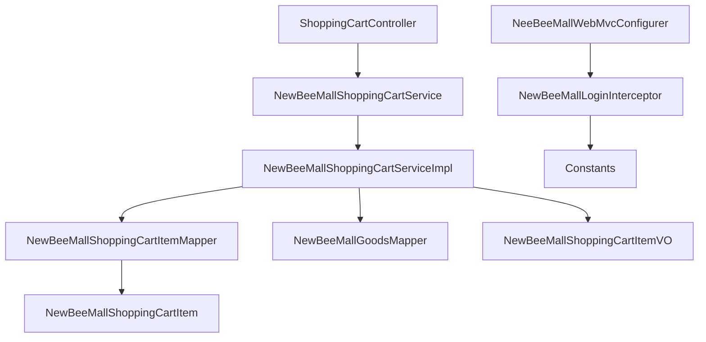

# 购物车管理

<cite>
**本文档引用的文件**   
- [ShoppingCartController.java](file://src/main/java/ltd/newbee/mall/controller/mall/ShoppingCartController.java)
- [NewBeeMallShoppingCartService.java](file://src/main/java/ltd/newbee/mall/service/NewBeeMallShoppingCartService.java)
- [NewBeeMallShoppingCartServiceImpl.java](file://src/main/java/ltd/newbee/mall/service/impl/NewBeeMallShoppingCartServiceImpl.java)
- [NewBeeMallShoppingCartItem.java](file://src/main/java/ltd/newbee/mall/entity/NewBeeMallShoppingCartItem.java)
- [NewBeeMallShoppingCartItemMapper.java](file://src/main/java/ltd/newbee/mall/dao/NewBeeMallShoppingCartItemMapper.java)
- [NewBeeMallShoppingCartItemMapper.xml](file://src/main/resources/mapper/NewBeeMallShoppingCartItemMapper.xml)
- [NewBeeMallLoginInterceptor.java](file://src/main/java/ltd/newbee/mall/interceptor/NewBeeMallLoginInterceptor.java)
- [NeeBeeMallWebMvcConfigurer.java](file://src/main/java/ltd/newbee/mall/config/NeeBeeMallWebMvcConfigurer.java)
- [Constants.java](file://src/main/java/ltd/newbee/mall/common/Constants.java)
- [ServiceResultEnum.java](file://src/main/java/ltd/newbee/mall/common/ServiceResultEnum.java)
- [NewBeeMallShoppingCartItemVO.java](file://src/main/java/ltd/newbee/mall/controller/vo/NewBeeMallShoppingCartItemVO.java)
- [NewBeeMallGoods.java](file://src/main/java/ltd/newbee/mall/entity/NewBeeMallGoods.java)
- [NewBeeMallGoodsMapper.java](file://src/main/java/ltd/newbee/mall/dao/NewBeeMallGoodsMapper.java)
- [cart.html](file://src/main/resources/templates/mall/cart.html)
- [order-settle.html](file://src/main/resources/templates/mall/order-settle.html)
</cite>

## 目录
1. [简介](#简介)
2. [项目结构](#项目结构)
3. [核心组件](#核心组件)
4. [架构概述](#架构概述)
5. [详细组件分析](#详细组件分析)
6. [依赖分析](#依赖分析)
7. [性能考虑](#性能考虑)
8. [故障排除指南](#故障排除指南)
9. [结论](#结论)

## 简介
本文档详细阐述了NewBee商城系统的购物车管理功能，重点分析了购物车的增删改查操作实现逻辑、用户会话安全机制、库存校验防止超卖策略以及前后端交互流程。文档涵盖了从用户登录验证到购物车数据展示的完整流程，包括异常处理和并发场景解决方案。

## 项目结构
该购物车管理系统采用典型的分层架构设计，主要包含控制器层、服务层、数据访问层和实体层。前端使用Thymeleaf模板引擎渲染页面，通过AJAX与后端进行数据交互。系统通过拦截器确保用户会话安全，并实现了完整的购物车业务逻辑。

**图示来源**
- [cart.html](file://src/main/resources/templates/mall/cart.html)
- [ShoppingCartController.java](file://src/main/java/ltd/newbee/mall/controller/mall/ShoppingCartController.java)
- [NewBeeMallShoppingCartService.java](file://src/main/java/ltd/newbee/mall/service/NewBeeMallShoppingCartService.java)
- [NewBeeMallShoppingCartServiceImpl.java](file://src/main/java/ltd/newbee/mall/service/impl/NewBeeMallShoppingCartServiceImpl.java)
- [NewBeeMallShoppingCartItemMapper.java](file://src/main/java/ltd/newbee/mall/dao/NewBeeMallShoppingCartItemMapper.java)
- [NewBeeMallShoppingCartItem.java](file://src/main/java/ltd/newbee/mall/entity/NewBeeMallShoppingCartItem.java)
- [NewBeeMallShoppingCartItemVO.java](file://src/main/java/ltd/newbee/mall/controller/vo/NewBeeMallShoppingCartItemVO.java)

**章节来源**
- [ShoppingCartController.java](file://src/main/java/ltd/newbee/mall/controller/mall/ShoppingCartController.java)
- [NewBeeMallShoppingCartService.java](file://src/main/java/ltd/newbee/mall/service/NewBeeMallShoppingCartService.java)
- [NewBeeMallShoppingCartServiceImpl.java](file://src/main/java/ltd/newbee/mall/service/impl/NewBeeMallShoppingCartServiceImpl.java)

## 核心组件
购物车管理功能的核心组件包括ShoppingCartController、NewBeeMallShoppingCartService接口及其实现类、NewBeeMallShoppingCartItem实体类以及相应的DAO组件。这些组件协同工作，实现了购物车的完整业务逻辑，包括添加、更新、删除和查询购物项等操作。

**章节来源**
- [ShoppingCartController.java](file://src/main/java/ltd/newbee/mall/controller/mall/ShoppingCartController.java)
- [NewBeeMallShoppingCartService.java](file://src/main/java/ltd/newbee/mall/service/NewBeeMallShoppingCartService.java)
- [NewBeeMallShoppingCartServiceImpl.java](file://src/main/java/ltd/newbee/mall/service/impl/NewBeeMallShoppingCartServiceImpl.java)

## 架构概述
系统采用MVC架构模式，前端通过Thymeleaf模板渲染购物车页面，使用AJAX与后端进行异步通信。后端控制器接收请求，通过服务层处理业务逻辑，数据访问层与数据库交互。整个流程通过拦截器确保用户身份验证和会话安全。

**图示来源**
- [ShoppingCartController.java](file://src/main/java/ltd/newbee/mall/controller/mall/ShoppingCartController.java)
- [NewBeeMallShoppingCartServiceImpl.java](file://src/main/java/ltd/newbee/mall/service/impl/NewBeeMallShoppingCartServiceImpl.java)
- [NewBeeMallShoppingCartItemMapper.java](file://src/main/java/ltd/newbee/mall/dao/NewBeeMallShoppingCartItemMapper.java)
- [NewBeeMallShoppingCartItemMapper.xml](file://src/main/resources/mapper/NewBeeMallShoppingCartItemMapper.xml)

## 详细组件分析

### 购物车控制器分析
ShoppingCartController是购物车功能的核心控制器，负责处理所有与购物车相关的HTTP请求。它提供了添加、更新、删除和查询购物项的RESTful API接口。

#### 控制器类图

**图示来源**
- [ShoppingCartController.java](file://src/main/java/ltd/newbee/mall/controller/mall/ShoppingCartController.java)
- [NewBeeMallShoppingCartService.java](file://src/main/java/ltd/newbee/mall/service/NewBeeMallShoppingCartService.java)

#### 添加购物项流程

**图示来源**
- [ShoppingCartController.java](file://src/main/java/ltd/newbee/mall/controller/mall/ShoppingCartController.java#L63-L76)
- [NewBeeMallShoppingCartServiceImpl.java](file://src/main/java/ltd/newbee/mall/service/impl/NewBeeMallShoppingCartServiceImpl.java#L37-L64)

**章节来源**
- [ShoppingCartController.java](file://src/main/java/ltd/newbee/mall/controller/mall/ShoppingCartController.java)
- [NewBeeMallShoppingCartServiceImpl.java](file://src/main/java/ltd/newbee/mall/service/impl/NewBeeMallShoppingCartServiceImpl.java)

### 用户会话安全分析
系统通过NewBeeMallLoginInterceptor拦截器确保用户会话安全，防止未授权访问购物车功能。

#### 登录拦截器流程

**图示来源**
- [NewBeeMallLoginInterceptor.java](file://src/main/java/ltd/newbee/mall/interceptor/NewBeeMallLoginInterceptor.java#L30-L37)
- [NeeBeeMallWebMvcConfigurer.java](file://src/main/java/ltd/newbee/mall/config/NeeBeeMallWebMvcConfigurer.java#L45-L59)

**章节来源**
- [NewBeeMallLoginInterceptor.java](file://src/main/java/ltd/newbee/mall/interceptor/NewBeeMallLoginInterceptor.java)
- [NeeBeeMallWebMvcConfigurer.java](file://src/main/java/ltd/newbee/mall/config/NeeBeeMallWebMvcConfigurer.java)

### 库存校验机制分析
系统在添加和更新购物项时会进行库存校验，防止超卖情况发生。

#### 库存校验流程

**图示来源**
- [NewBeeMallShoppingCartServiceImpl.java](file://src/main/java/ltd/newbee/mall/service/impl/NewBeeMallShoppingCartServiceImpl.java#L45-L49)
- [NewBeeMallGoodsMapper.java](file://src/main/java/ltd/newbee/mall/dao/NewBeeMallGoodsMapper.java#L25)
- [NewBeeMallGoods.java](file://src/main/java/ltd/newbee/mall/entity/NewBeeMallGoods.java)

**章节来源**
- [NewBeeMallShoppingCartServiceImpl.java](file://src/main/java/ltd/newbee/mall/service/impl/NewBeeMallShoppingCartServiceImpl.java)
- [NewBeeMallGoodsMapper.java](file://src/main/java/ltd/newbee/mall/dao/NewBeeMallGoodsMapper.java)

## 依赖分析
购物车管理功能涉及多个组件之间的依赖关系，形成了清晰的调用链路。

**图示来源**
- [ShoppingCartController.java](file://src/main/java/ltd/newbee/mall/controller/mall/ShoppingCartController.java)
- [NewBeeMallShoppingCartService.java](file://src/main/java/ltd/newbee/mall/service/NewBeeMallShoppingCartService.java)
- [NewBeeMallShoppingCartServiceImpl.java](file://src/main/java/ltd/newbee/mall/service/impl/NewBeeMallShoppingCartServiceImpl.java)
- [NewBeeMallShoppingCartItemMapper.java](file://src/main/java/ltd/newbee/mall/dao/NewBeeMallShoppingCartItemMapper.java)
- [NewBeeMallGoodsMapper.java](file://src/main/java/ltd/newbee/mall/dao/NewBeeMallGoodsMapper.java)
- [Constants.java](file://src/main/java/ltd/newbee/mall/common/Constants.java)
- [NeeBeeMallWebMvcConfigurer.java](file://src/main/java/ltd/newbee/mall/config/NeeBeeMallWebMvcConfigurer.java)

**章节来源**
- [ShoppingCartController.java](file://src/main/java/ltd/newbee/mall/controller/mall/ShoppingCartController.java)
- [NewBeeMallShoppingCartService.java](file://src/main/java/ltd/newbee/mall/service/NewBeeMallShoppingCartService.java)
- [NewBeeMallShoppingCartServiceImpl.java](file://src/main/java/ltd/newbee/mall/service/impl/NewBeeMallShoppingCartServiceImpl.java)
- [NewBeeMallShoppingCartItemMapper.java](file://src/main/java/ltd/newbee/mall/dao/NewBeeMallShoppingCartItemMapper.java)
- [NewBeeMallGoodsMapper.java](file://src/main/java/ltd/newbee/mall/dao/NewBeeMallGoodsMapper.java)
- [Constants.java](file://src/main/java/ltd/newbee/mall/common/Constants.java)
- [NeeBeeMallWebMvcConfigurer.java](file://src/main/java/ltd/newbee/mall/config/NeeBeeMallWebMvcConfigurer.java)

## 性能考虑
系统在设计购物车功能时考虑了多项性能优化措施。首先，通过分页限制购物车中商品的最大数量（默认13个），防止数据量过大影响性能。其次，在查询购物车数据时，采用批量查询商品信息的方式，减少数据库访问次数。此外，系统还设置了单个商品的最大购买数量限制（默认5个），避免异常数据导致性能问题。

## 故障排除指南
### 常见问题及解决方案
1. **购物车为空时无法结算**
   - 问题原因：前端在购物车为空时禁用结算按钮
   - 解决方案：确保购物车中有商品后再尝试结算

2. **商品下架提示**
   - 问题原因：商品状态为下架状态（SELL_STATUS_DOWN）
   - 解决方案：系统会返回"商品已下架！"的错误信息

3. **库存不足提示**
   - 问题原因：购物车中商品数量超过库存
   - 解决方案：系统会返回"库存不足！"的错误信息

4. **并发修改问题**
   - 问题原因：多个用户同时修改同一购物车项
   - 解决方案：系统通过数据库乐观锁机制处理并发问题

**章节来源**
- [ServiceResultEnum.java](file://src/main/java/ltd/newbee/mall/common/ServiceResultEnum.java)
- [NewBeeMallShoppingCartServiceImpl.java](file://src/main/java/ltd/newbee/mall/service/impl/NewBeeMallShoppingCartServiceImpl.java)
- [cart.html](file://src/main/resources/templates/mall/cart.html)

## 结论
NewBee商城的购物车管理系统实现了完整的购物车业务逻辑，包括添加、更新、删除和查询购物项等操作。系统通过拦截器确保用户会话安全，采用合理的库存校验机制防止超卖，并通过清晰的前后端分离架构实现了良好的用户体验。整体设计考虑了性能优化和异常处理，为电商平台提供了可靠的购物车管理功能。