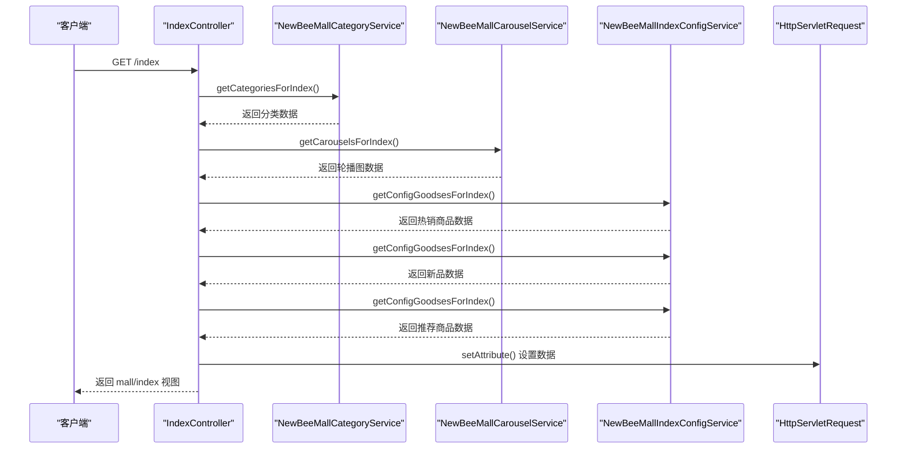
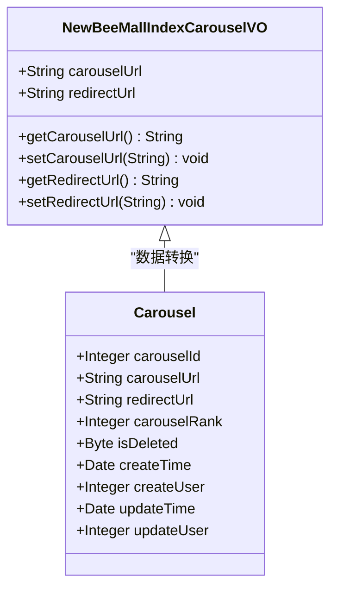
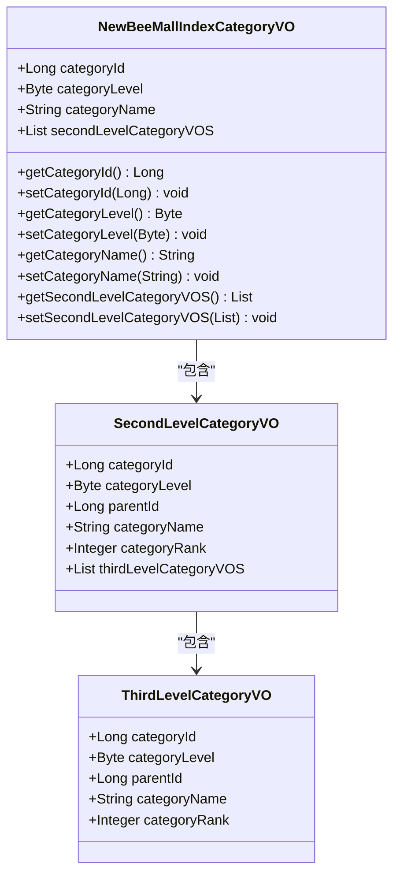
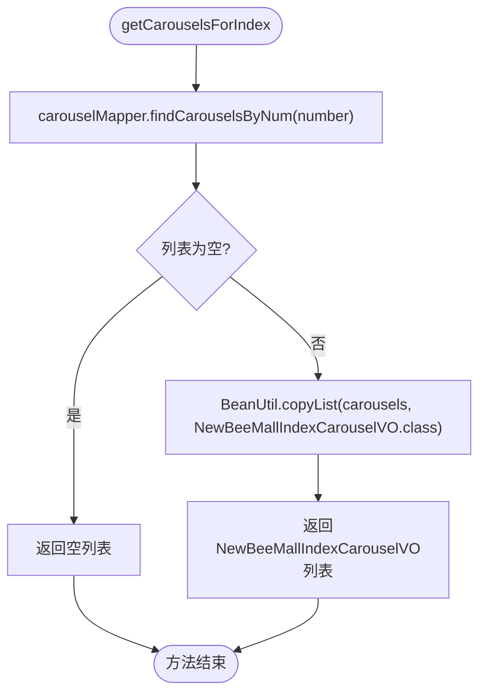
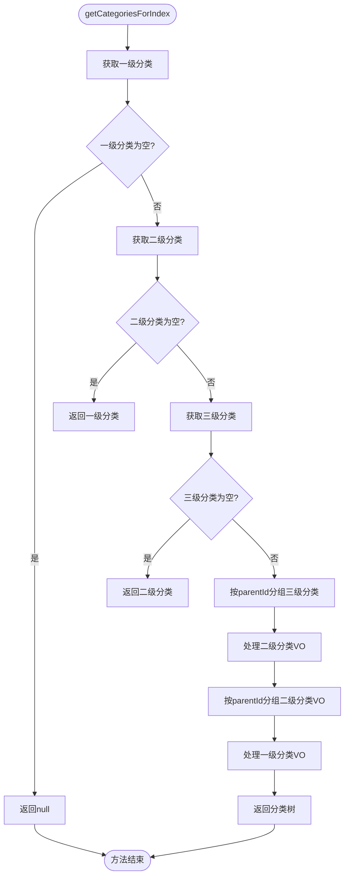
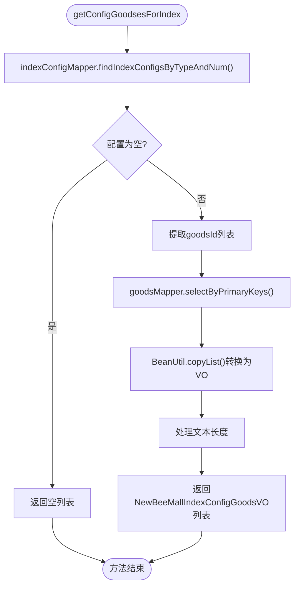
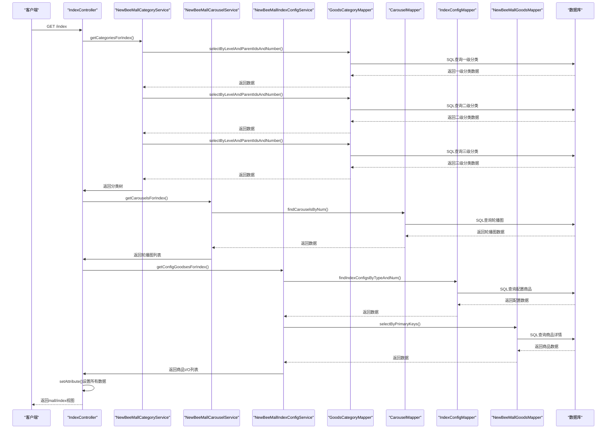

# 首页功能

<cite>
**本文档引用文件**   
- [IndexController.java](file://src/main/java/ltd/newbee/mall/controller/mall/IndexController.java)
- [NewBeeMallIndexCarouselVO.java](file://src/main/java/ltd/newbee/mall/controller/vo/NewBeeMallIndexCarouselVO.java)
- [NewBeeMallIndexCategoryVO.java](file://src/main/java/ltd/newbee/mall/controller/vo/NewBeeMallIndexCategoryVO.java)
- [NewBeeMallIndexConfigGoodsVO.java](file://src/main/java/ltd/newbee/mall/controller/vo/NewBeeMallIndexConfigGoodsVO.java)
- [NewBeeMallCarouselService.java](file://src/main/java/ltd/newbee/mall/service/NewBeeMallCarouselService.java)
- [NewBeeMallCategoryService.java](file://src/main/java/ltd/newbee/mall/service/NewBeeMallCategoryService.java)
- [NewBeeMallIndexConfigService.java](file://src/main/java/ltd/newbee/mall/service/NewBeeMallIndexConfigService.java)
- [NewBeeMallCarouselServiceImpl.java](file://src/main/java/ltd/newbee/mall/service/impl/NewBeeMallCarouselServiceImpl.java)
- [NewBeeMallCategoryServiceImpl.java](file://src/main/java/ltd/newbee/mall/service/impl/NewBeeMallCategoryServiceImpl.java)
- [NewBeeMallIndexConfigServiceImpl.java](file://src/main/java/ltd/newbee/mall/service/impl/NewBeeMallIndexConfigServiceImpl.java)
- [Carousel.java](file://src/main/java/ltd/newbee/mall/entity/Carousel.java)
- [GoodsCategory.java](file://src/main/java/ltd/newbee/mall/entity/GoodsCategory.java)
- [index.html](file://src/main/resources/templates/mall/index.html)
- [Constants.java](file://src/main/java/ltd/newbee/mall/common/Constants.java)
- [BeanUtil.java](file://src/main/java/ltd/newbee/mall/util/BeanUtil.java)
</cite>

## 目录
1. [首页功能概述](#首页功能概述)
2. [IndexController请求处理流程](#indexcontroller请求处理流程)
3. [视图对象数据组装](#视图对象数据组装)
4. [前端模板渲染机制](#前端模板渲染机制)
5. [服务层实现细节](#服务层实现细节)
6. [数据加载完整流程](#数据加载完整流程)
7. [页面性能优化策略](#页面性能优化策略)
8. [常见问题排查](#常见问题排查)

## 首页功能概述

newbee-mall首页功能是整个电商平台的入口，负责展示轮播图、分类导航和推荐商品等核心内容。首页通过`IndexController`处理根路径请求，协调多个服务组件获取数据，并通过Thymeleaf模板引擎渲染动态内容。首页设计采用响应式布局，支持PC端和移动端访问。

首页主要包含以下几个核心模块：
- **轮播图区域**：展示商品促销、活动推广等图片轮播
- **分类导航区域**：显示商品的一级、二级和三级分类结构
- **热销商品区域**：展示销量最高的商品
- **新品上线区域**：展示最新上架的商品
- **为你推荐区域**：根据用户偏好推荐商品

这些模块的数据通过后端服务从数据库获取，并在前端模板中动态渲染，为用户提供个性化的购物体验。

## IndexController请求处理流程

`IndexController`是首页功能的核心控制器，负责处理根路径（/、/index、/index.html）的GET请求。该控制器通过依赖注入的方式获取`NewBeeMallCarouselService`、`NewBeeMallIndexConfigService`和`NewBeeMallCategoryService`三个服务实例，用于获取轮播图、推荐商品和分类数据。



**图示来源**
- [IndexController.java](file://src/main/java/ltd/newbee/mall/controller/mall/IndexController.java#L40-L55)

**本节来源**
- [IndexController.java](file://src/main/java/ltd/newbee/mall/controller/mall/IndexController.java#L28-L57)

## 视图对象数据组装

首页功能使用了多个视图对象（VO）来封装和传输数据，这些对象位于`ltd.newbee.mall.controller.vo`包中，专门用于前端展示。

### NewBeeMallIndexCarouselVO

`NewBeeMallIndexCarouselVO`是轮播图视图对象，包含两个核心属性：
- `carouselUrl`：轮播图图片的URL地址
- `redirectUrl`：点击轮播图后跳转的目标URL

该对象通过`BeanUtil.copyList()`方法从`Carousel`实体对象批量转换而来，实现了数据层到展示层的解耦。



**图示来源**
- [NewBeeMallIndexCarouselVO.java](file://src/main/java/ltd/newbee/mall/controller/vo/NewBeeMallIndexCarouselVO.java#L16-L37)
- [Carousel.java](file://src/main/java/ltd/newbee/mall/entity/Carousel.java#L15-L125)

**本节来源**
- [NewBeeMallIndexCarouselVO.java](file://src/main/java/ltd/newbee/mall/controller/vo/NewBeeMallIndexCarouselVO.java#L16-L37)
- [NewBeeMallCarouselServiceImpl.java](file://src/main/java/ltd/newbee/mall/service/impl/NewBeeMallCarouselServiceImpl.java#L80-L86)

### NewBeeMallIndexCategoryVO

`NewBeeMallIndexCategoryVO`是分类导航视图对象，采用树形结构组织数据：
- `categoryId`：分类ID
- `categoryLevel`：分类级别（一级、二级、三级）
- `categoryName`：分类名称
- `secondLevelCategoryVOS`：包含二级分类VO列表

该对象与`SecondLevelCategoryVO`和`ThirdLevelCategoryVO`共同构成三级分类树，通过`BeanUtil.copyProperties()`和`BeanUtil.copyList()`方法从`GoodsCategory`实体对象转换而来。



**图示来源**
- [NewBeeMallIndexCategoryVO.java](file://src/main/java/ltd/newbee/mall/controller/vo/NewBeeMallIndexCategoryVO.java#L17-L58)
- [SecondLevelCategoryVO.java](file://src/main/java/ltd/newbee/mall/controller/vo/SecondLevelCategoryVO.java)
- [ThirdLevelCategoryVO.java](file://src/main/java/ltd/newbee/mall/controller/vo/ThirdLevelCategoryVO.java)

**本节来源**
- [NewBeeMallIndexCategoryVO.java](file://src/main/java/ltd/newbee/mall/controller/vo/NewBeeMallIndexCategoryVO.java#L17-L58)
- [NewBeeMallCategoryServiceImpl.java](file://src/main/java/ltd/newbee/mall/service/impl/NewBeeMallCategoryServiceImpl.java#L92-L138)

### NewBeeMallIndexConfigGoodsVO

`NewBeeMallIndexConfigGoodsVO`是首页配置商品视图对象，用于展示热销、新品和推荐商品：
- `goodsId`：商品ID
- `goodsName`：商品名称（长度超过30字符时自动截断）
- `goodsIntro`：商品简介（长度超过22字符时自动截断）
- `goodsCoverImg`：商品封面图URL
- `sellingPrice`：销售价格
- `tag`：商品标签

该对象通过`BeanUtil.copyList()`方法从`NewBeeMallGoods`实体对象转换而来，并在转换过程中对过长的文本进行截断处理，避免前端显示溢出。

**本节来源**
- [NewBeeMallIndexConfigGoodsVO.java](file://src/main/java/ltd/newbee/mall/controller/vo/NewBeeMallIndexConfigGoodsVO.java)
- [NewBeeMallIndexConfigServiceImpl.java](file://src/main/java/ltd/newbee/mall/service/impl/NewBeeMallIndexConfigServiceImpl.java#L88-L110)

## 前端模板渲染机制

首页使用Thymeleaf模板引擎进行动态内容渲染，模板文件位于`src/main/resources/templates/mall/index.html`。Thymeleaf通过`th:`前缀的属性实现数据绑定和条件渲染。

### 轮播图渲染

轮播图区域使用`th:block`和`th:each`指令遍历`carousels`列表，为每个轮播图项生成相应的HTML结构：

```html
<th:block th:each="carousel : ${carousels}">
    <div class="swiper-slide">
        <a th:href="@{${carousel.redirectUrl}}">
            
        </a>
    </div>
</th:block>
```

当`carousels`列表为空时，显示默认的三张轮播图作为占位符，确保页面布局的完整性。

### 分类导航渲染

分类导航采用嵌套循环的方式渲染三级分类结构：

```html
<th:block th:each="category : ${categories}">
    <div class="item">
        <h3><a href="#"><th:block th:text="${category.categoryName}"></th:block></a></h3>
        <div class="item-list clearfix">
            <div class="subitem">
                <th:block th:each="secondLevelCategory : ${category.secondLevelCategoryVOS}">
                    <dl class="fore1">
                        <dt><a href="#"><th:block th:text="${secondLevelCategory.categoryName}"></th:block></a></dt>
                        <dd>
                            <th:block th:each="thirdLevelCategory : ${secondLevelCategory.thirdLevelCategoryVOS}">
                                <em><a th:href="@{'/search?goodsCategoryId='+${thirdLevelCategory.categoryId}}">
                                    <th:block th:text="${thirdLevelCategory.categoryName}"></th:block>
                                </a></em>
                            </th:block>
                        </dd>
                    </dl>
                </th:block>
            </div>
        </div>
    </div>
</th:block>
```

### 推荐商品渲染

推荐商品区域根据商品类型（热销、新品、推荐）分别渲染，使用`th:unless`和`th:if`指令实现条件显示：

```html
<th:block th:unless="${#lists.isEmpty(hotGoodses)}">
    <th:block th:each="hotGoodse : ${hotGoodses}">
        <div class="hot-image">
            <a th:href="@{'/goods/detail/'+${hotGoodse.goodsId}}">
                
            </a>
        </div>
    </th:block>
</th:block>
```

当对应商品列表为空时，显示默认商品作为占位符，提升用户体验。

**本节来源**
- [index.html](file://src/main/resources/templates/mall/index.html#L10-L353)

## 服务层实现细节

### NewBeeMallCarouselService实现

`NewBeeMallCarouselServiceImpl`实现了轮播图服务接口，通过`CarouselMapper`访问数据库。`getCarouselsForIndex()`方法根据指定数量查询轮播图数据：



**图示来源**
- [NewBeeMallCarouselServiceImpl.java](file://src/main/java/ltd/newbee/mall/service/impl/NewBeeMallCarouselServiceImpl.java#L80-L86)

**本节来源**
- [NewBeeMallCarouselService.java](file://src/main/java/ltd/newbee/mall/service/NewBeeMallCarouselService.java#L41-L42)
- [NewBeeMallCarouselServiceImpl.java](file://src/main/java/ltd/newbee/mall/service/impl/NewBeeMallCarouselServiceImpl.java#L79-L87)

### NewBeeMallCategoryService实现

`NewBeeMallCategoryServiceImpl`实现了分类服务，通过`GoodsCategoryMapper`获取分类数据。`getCategoriesForIndex()`方法构建三级分类树结构：



**图示来源**
- [NewBeeMallCategoryServiceImpl.java](file://src/main/java/ltd/newbee/mall/service/impl/NewBeeMallCategoryServiceImpl.java#L92-L138)

**本节来源**
- [NewBeeMallCategoryService.java](file://src/main/java/ltd/newbee/mall/service/NewBeeMallCategoryService.java#L41-L42)
- [NewBeeMallCategoryServiceImpl.java](file://src/main/java/ltd/newbee/mall/service/impl/NewBeeMallCategoryServiceImpl.java#L92-L138)

### NewBeeMallIndexConfigService实现

`NewBeeMallIndexConfigServiceImpl`实现了首页配置商品服务，通过`IndexConfigMapper`和`NewBeeMallGoodsMapper`获取商品数据。`getConfigGoodsesForIndex()`方法的执行流程如下：



**图示来源**
- [NewBeeMallIndexConfigServiceImpl.java](file://src/main/java/ltd/newbee/mall/service/impl/NewBeeMallIndexConfigServiceImpl.java#L88-L110)

**本节来源**
- [NewBeeMallIndexConfigService.java](file://src/main/java/ltd/newbee/mall/service/NewBeeMallIndexConfigService.java#L39-L40)
- [NewBeeMallIndexConfigServiceImpl.java](file://src/main/java/ltd/newbee/mall/service/impl/NewBeeMallIndexConfigServiceImpl.java#L88-L110)

## 数据加载完整流程

首页数据加载是一个多步骤的协调过程，从请求到达控制器开始，经过服务层处理，最终在前端模板中渲染。完整的数据加载流程如下：



**图示来源**
- [IndexController.java](file://src/main/java/ltd/newbee/mall/controller/mall/IndexController.java#L40-L55)
- [NewBeeMallCategoryServiceImpl.java](file://src/main/java/ltd/newbee/mall/service/impl/NewBeeMallCategoryServiceImpl.java#L92-L138)
- [NewBeeMallCarouselServiceImpl.java](file://src/main/java/ltd/newbee/mall/service/impl/NewBeeMallCarouselServiceImpl.java#L80-L86)
- [NewBeeMallIndexConfigServiceImpl.java](file://src/main/java/ltd/newbee/mall/service/impl/NewBeeMallIndexConfigServiceImpl.java#L88-L110)

**本节来源**
- [IndexController.java](file://src/main/java/ltd/newbee/mall/controller/mall/IndexController.java#L40-L55)

## 页面性能优化策略

### 数据缓存机制

虽然当前代码中没有显式使用缓存，但可以通过以下方式优化性能：
1. **Redis缓存**：将首页数据缓存到Redis中，设置合理的过期时间
2. **本地缓存**：使用Caffeine或Ehcache进行本地缓存
3. **缓存预热**：在系统启动时预加载首页数据到缓存

```java
// 示例：使用@Cacheable注解
@Cacheable(value = "indexData", key = "#root.method.name")
public List<NewBeeMallIndexCategoryVO> getCategoriesForIndex() {
    // 业务逻辑
}
```

### 异步加载模式

可以采用异步加载策略提升首页响应速度：
1. **核心数据同步加载**：分类导航等核心数据同步加载
2. **非核心数据异步加载**：轮播图、推荐商品等非核心数据异步加载
3. **懒加载**：用户滚动到相应区域时再加载数据

### 数据库优化

通过以下方式优化数据库查询性能：
1. **索引优化**：为常用查询字段添加索引
2. **分页查询**：避免一次性加载大量数据
3. **批量查询**：使用批量查询减少数据库交互次数

### 前端优化

前端层面的优化策略包括：
1. **资源压缩**：压缩CSS、JavaScript和图片资源
2. **CDN加速**：使用CDN分发静态资源
3. **懒加载**：图片懒加载，减少初始加载时间
4. **浏览器缓存**：设置合理的缓存策略

**本节来源**
- [FAQ.md](file://docs/FAQ.md#L204-L210)

## 常见问题排查

### 轮播图不显示

当轮播图不显示时，可以按照以下步骤排查：

1. **检查数据库数据**
   ```sql
   SELECT * FROM tb_newbee_mall_carousel WHERE is_deleted = 0 ORDER BY carousel_rank DESC;
   ```
   确认轮播图数据是否存在且状态正常。

2. **检查配置数量**
   查看`Constants.java`中的`INDEX_CAROUSEL_NUMBER`常量，确保查询数量合理。

3. **检查图片路径**
   确认`carouselUrl`中的图片路径是否正确，图片文件是否存在。

4. **查看控制台错误**
   检查浏览器开发者工具中的网络请求和控制台错误信息。

**本节来源**
- [NewBeeMallCarouselServiceImpl.java](file://src/main/java/ltd/newbee/mall/service/impl/NewBeeMallCarouselServiceImpl.java#L80-L86)
- [index.html](file://src/main/resources/templates/mall/index.html#L37-L45)
- [Constants.java](file://src/main/java/ltd/newbee/mall/common/Constants.java#L22)

### 分类数据错乱

当分类数据出现错乱时，可以按照以下步骤排查：

1. **检查分类层级**
   确认`GoodsCategory`表中的`categoryLevel`字段值正确（1:一级, 2:二级, 3:三级）。

2. **检查父级关系**
   确认`parentId`字段值正确，一级分类的`parentId`应为0。

3. **检查排序权重**
   确认`categoryRank`字段值合理，数值越大排序越靠前。

4. **检查数据完整性**
   确保每个二级分类都有对应的一级分类，每个三级分类都有对应的二级分类。

```sql
-- 检查分类数据完整性
SELECT * FROM tb_newbee_mall_goods_category 
WHERE is_deleted = 0 
ORDER BY category_level, parent_id, category_rank DESC;
```

**本节来源**
- [NewBeeMallCategoryServiceImpl.java](file://src/main/java/ltd/newbee/mall/service/impl/NewBeeMallCategoryServiceImpl.java#L92-L138)
- [GoodsCategoryMapper.xml](file://src/main/resources/mapper/GoodsCategoryMapper.xml#L63-L76)

### 推荐商品不显示

当推荐商品不显示时，可以按照以下步骤排查：

1. **检查配置数据**
   ```sql
   SELECT * FROM tb_newbee_mall_index_config WHERE config_type = ?;
   ```
   确认对应类型（热销、新品、推荐）的配置数据是否存在。

2. **检查商品状态**
   确认`NewBeeMallGoods`表中对应商品的销售状态正常。

3. **检查数量配置**
   查看`Constants.java`中的`INDEX_GOODS_HOT_NUMBER`、`INDEX_GOODS_NEW_NUMBER`和`INDEX_GOODS_RECOMMOND_NUMBER`常量值。

4. **查看服务日志**
   检查后端服务日志，确认是否有异常信息。

**本节来源**
- [NewBeeMallIndexConfigServiceImpl.java](file://src/main/java/ltd/newbee/mall/service/impl/NewBeeMallIndexConfigServiceImpl.java#L88-L110)
- [Constants.java](file://src/main/java/ltd/newbee/mall/common/Constants.java#L28-L30)