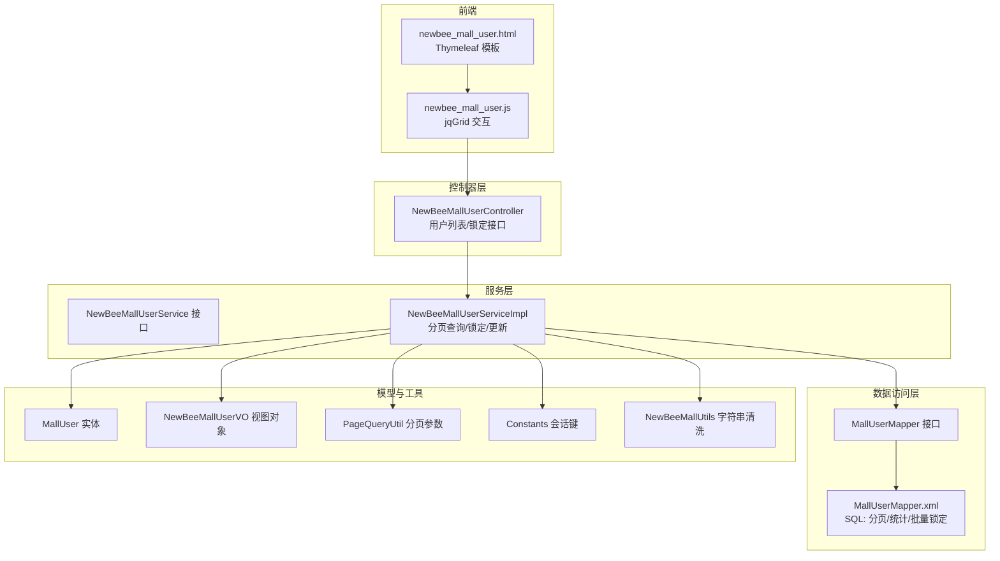
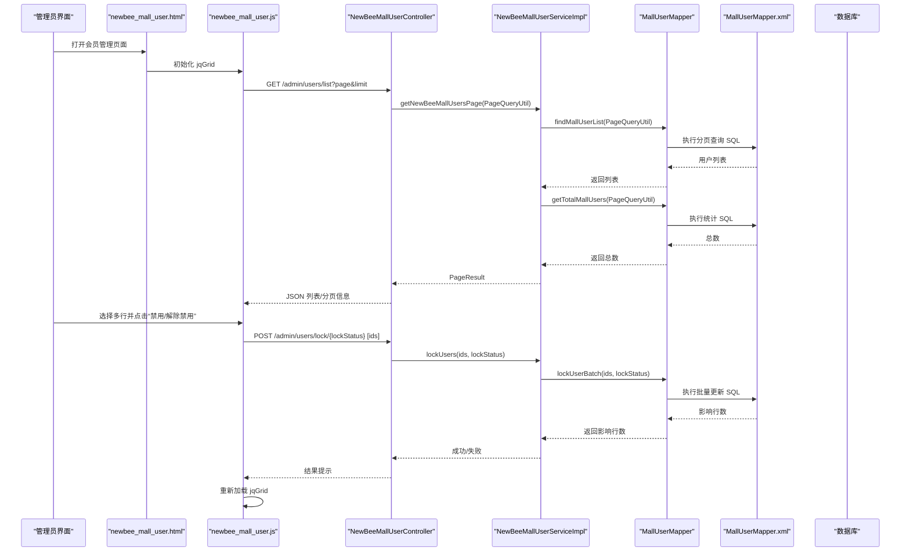
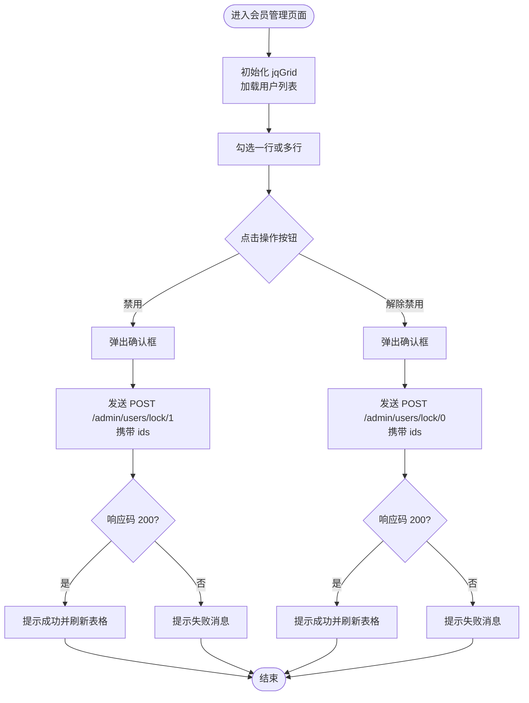
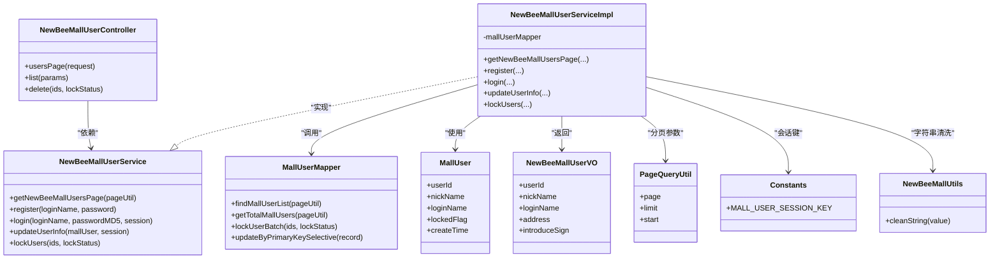

# 会员管理功能

<cite>
**本文引用的文件**
- [NewBeeMallUserController.java](file://src/main/java/ltd/newbee/mall/controller/admin/NewBeeMallUserController.java)
- [NewBeeMallUserServiceImpl.java](file://src/main/java/ltd/newbee/mall/service/impl/NewBeeMallUserServiceImpl.java)
- [NewBeeMallUserService.java](file://src/main/java/ltd/newbee/mall/service/NewBeeMallUserService.java)
- [MallUserMapper.java](file://src/main/java/ltd/newbee/mall/dao/MallUserMapper.java)
- [MallUserMapper.xml](file://src/main/resources/mapper/MallUserMapper.xml)
- [MallUser.java](file://src/main/java/ltd/newbee/mall/entity/MallUser.java)
- [newbee_mall_user.html](file://src/main/resources/templates/admin/newbee_mall_user.html)
- [newbee_mall_user.js](file://src/main/resources/static/admin/dist/js/newbee_mall_user.js)
- [Constants.java](file://src/main/java/ltd/newbee/mall/common/Constants.java)
- [PageQueryUtil.java](file://src/main/java/ltd/newbee/mall/util/PageQueryUtil.java)
- [NewBeeMallUserVO.java](file://src/main/java/ltd/newbee/mall/controller/vo/NewBeeMallUserVO.java)
- [NewBeeMallUtils.java](file://src/main/java/ltd/newbee/mall/util/NewBeeMallUtils.java)
</cite>

## 目录
1. [简介](#简介)
2. [项目结构](#项目结构)
3. [核心组件](#核心组件)
4. [架构总览](#架构总览)
5. [详细组件分析](#详细组件分析)
6. [依赖关系分析](#依赖关系分析)
7. [性能考量](#性能考量)
8. [故障排查指南](#故障排查指南)
9. [结论](#结论)
10. [附录](#附录)

## 简介
本文件面向“会员管理功能”的技术实现进行系统性解析，重点覆盖：
- 后台控制器 NewBeeMallUserController 提供的用户列表查询与账户锁定/解锁接口
- 服务层 NewBeeMallUserServiceImpl 的业务逻辑：用户信息更新、状态变更与数据持久化
- 实体类 MallUser 关键字段（昵称、登录名、锁定标志、创建时间）的业务语义
- 前端页面 newbee_mall_user.html 通过 jqGrid 渲染用户列表，并由 newbee_mall_user.js 实现搜索、分页与状态修改交互
- 用户状态管理流程图与数据安全建议（如敏感信息脱敏）

## 项目结构
会员管理相关代码采用典型的分层架构组织：
- 控制器层：处理 HTTP 请求，负责参数校验与结果封装
- 服务层：编排业务流程，调用数据访问层完成持久化
- 数据访问层：MyBatis 映射器与 XML SQL 定义
- 实体与 VO：数据模型与视图对象
- 前端模板与脚本：Thymeleaf 页面与 jqGrid 交互脚本

图表来源
- [NewBeeMallUserController.java](file://src/main/java/ltd/newbee/mall/controller/admin/NewBeeMallUserController.java#L37-L74)
- [NewBeeMallUserServiceImpl.java](file://src/main/java/ltd/newbee/mall/service/impl/NewBeeMallUserServiceImpl.java#L31-L107)
- [MallUserMapper.java](file://src/main/java/ltd/newbee/mall/dao/MallUserMapper.java#L17-L39)
- [MallUserMapper.xml](file://src/main/resources/mapper/MallUserMapper.xml#L19-L40)
- [MallUser.java](file://src/main/java/ltd/newbee/mall/entity/MallUser.java#L16-L105)
- [NewBeeMallUserVO.java](file://src/main/java/ltd/newbee/mall/controller/vo/NewBeeMallUserVO.java#L14-L74)
- [PageQueryUtil.java](file://src/main/java/ltd/newbee/mall/util/PageQueryUtil.java#L14-L56)
- [Constants.java](file://src/main/java/ltd/newbee/mall/common/Constants.java#L36-L41)
- [NewBeeMallUtils.java](file://src/main/java/ltd/newbee/mall/util/NewBeeMallUtils.java#L22-L55)
- [newbee_mall_user.html](file://src/main/resources/templates/admin/newbee_mall_user.html#L35-L69)
- [newbee_mall_user.js](file://src/main/resources/static/admin/dist/js/newbee_mall_user.js#L1-L116)

章节来源
- [NewBeeMallUserController.java](file://src/main/java/ltd/newbee/mall/controller/admin/NewBeeMallUserController.java#L37-L74)
- [NewBeeMallUserServiceImpl.java](file://src/main/java/ltd/newbee/mall/service/impl/NewBeeMallUserServiceImpl.java#L31-L107)
- [MallUserMapper.java](file://src/main/java/ltd/newbee/mall/dao/MallUserMapper.java#L17-L39)
- [MallUserMapper.xml](file://src/main/resources/mapper/MallUserMapper.xml#L19-L40)
- [MallUser.java](file://src/main/java/ltd/newbee/mall/entity/MallUser.java#L16-L105)
- [NewBeeMallUserVO.java](file://src/main/java/ltd/newbee/mall/controller/vo/NewBeeMallUserVO.java#L14-L74)
- [PageQueryUtil.java](file://src/main/java/ltd/newbee/mall/util/PageQueryUtil.java#L14-L56)
- [Constants.java](file://src/main/java/ltd/newbee/mall/common/Constants.java#L36-L41)
- [NewBeeMallUtils.java](file://src/main/java/ltd/newbee/mall/util/NewBeeMallUtils.java#L22-L55)
- [newbee_mall_user.html](file://src/main/resources/templates/admin/newbee_mall_user.html#L35-L69)
- [newbee_mall_user.js](file://src/main/resources/static/admin/dist/js/newbee_mall_user.js#L1-L116)

## 核心组件
- 控制器 NewBeeMallUserController
  - 提供后台页面跳转与用户列表查询接口
  - 提供批量锁定/解锁接口，基于 lockedFlag 字段控制
- 服务层 NewBeeMallUserServiceImpl
  - 实现分页查询、用户信息更新、批量锁定/解锁
  - 调用 MallUserMapper 完成数据库操作
- 数据访问层 MallUserMapper 与 XML
  - 提供分页查询、总数统计、批量锁定 SQL
- 实体类 MallUser
  - 关键字段：昵称、登录名、锁定标志、创建时间
- 前端 newbee_mall_user.html 与 newbee_mall_user.js
  - 使用 jqGrid 渲染表格，支持多选、分页、格式化显示与批量状态变更

章节来源
- [NewBeeMallUserController.java](file://src/main/java/ltd/newbee/mall/controller/admin/NewBeeMallUserController.java#L37-L74)
- [NewBeeMallUserServiceImpl.java](file://src/main/java/ltd/newbee/mall/service/impl/NewBeeMallUserServiceImpl.java#L31-L107)
- [MallUserMapper.java](file://src/main/java/ltd/newbee/mall/dao/MallUserMapper.java#L17-L39)
- [MallUserMapper.xml](file://src/main/resources/mapper/MallUserMapper.xml#L19-L40)
- [MallUser.java](file://src/main/java/ltd/newbee/mall/entity/MallUser.java#L16-L105)
- [newbee_mall_user.html](file://src/main/resources/templates/admin/newbee_mall_user.html#L35-L69)
- [newbee_mall_user.js](file://src/main/resources/static/admin/dist/js/newbee_mall_user.js#L1-L116)

## 架构总览
会员管理功能遵循“控制器-服务-数据访问-实体”的分层设计，前后端通过 REST 接口与 jqGrid 交互，形成闭环的数据流。

图表来源
- [NewBeeMallUserController.java](file://src/main/java/ltd/newbee/mall/controller/admin/NewBeeMallUserController.java#L43-L74)
- [NewBeeMallUserServiceImpl.java](file://src/main/java/ltd/newbee/mall/service/impl/NewBeeMallUserServiceImpl.java#L31-L107)
- [MallUserMapper.java](file://src/main/java/ltd/newbee/mall/dao/MallUserMapper.java#L34-L39)
- [MallUserMapper.xml](file://src/main/resources/mapper/MallUserMapper.xml#L19-L40)
- [newbee_mall_user.js](file://src/main/resources/static/admin/dist/js/newbee_mall_user.js#L1-L116)

## 详细组件分析

### 控制器：NewBeeMallUserController
职责与行为
- 页面入口：GET /admin/users 跳转到会员管理页面
- 列表查询：GET /admin/users/list?page&limit 返回分页结果
- 批量锁定/解锁：POST /admin/users/lock/{lockStatus} 接收 ids 数组，lockStatus 为 0 或 1

参数与校验
- 列表接口要求必须包含 page 与 limit 参数，否则返回错误
- 锁定接口要求 ids 非空且 lockStatus 仅允许 0/1

响应封装
- 使用 ResultGenerator 统一封装成功/失败响应

章节来源
- [NewBeeMallUserController.java](file://src/main/java/ltd/newbee/mall/controller/admin/NewBeeMallUserController.java#L37-L74)

### 服务层：NewBeeMallUserServiceImpl
职责与行为
- 分页查询：从 MallUserMapper 查询用户列表与总数，构造 PageResult 返回
- 用户信息更新：从 Session 获取当前用户，按需清洗并更新昵称、地址、签名等字段
- 批量锁定/解锁：调用 MallUserMapper.lockUserBatch 执行批量更新

数据持久化
- 分页查询与统计：通过 XML 中的 findMallUserList 与 getTotalMallUsers 实现
- 批量锁定：通过 XML 中的 lockUserBatch 实现

安全与健壮性
- 更新时使用 NewBeeMallUtils.cleanString 对输入进行清洗，降低 XSS 风险
- Session 中存储 NewBeeMallUserVO，避免直接暴露实体

章节来源
- [NewBeeMallUserServiceImpl.java](file://src/main/java/ltd/newbee/mall/service/impl/NewBeeMallUserServiceImpl.java#L31-L107)
- [NewBeeMallUserService.java](file://src/main/java/ltd/newbee/mall/service/NewBeeMallUserService.java#L18-L62)
- [MallUserMapper.java](file://src/main/java/ltd/newbee/mall/dao/MallUserMapper.java#L34-L39)
- [MallUserMapper.xml](file://src/main/resources/mapper/MallUserMapper.xml#L19-L40)
- [NewBeeMallUtils.java](file://src/main/java/ltd/newbee/mall/util/NewBeeMallUtils.java#L22-L55)
- [Constants.java](file://src/main/java/ltd/newbee/mall/common/Constants.java#L36-L41)

### 数据访问层：MallUserMapper 与 XML
分页与统计
- findMallUserList：按条件查询用户列表，支持排序与分页
- getTotalMallUsers：按条件统计总数

批量锁定
- lockUserBatch：根据 ids 批量更新 locked_flag 字段

SQL 特性
- 使用 <if> 动态拼接 where 条件，支持 loginName 过滤
- 分页通过 PageQueryUtil 计算 start 与 limit

章节来源
- [MallUserMapper.java](file://src/main/java/ltd/newbee/mall/dao/MallUserMapper.java#L17-L39)
- [MallUserMapper.xml](file://src/main/resources/mapper/MallUserMapper.xml#L19-L40)
- [PageQueryUtil.java](file://src/main/java/ltd/newbee/mall/util/PageQueryUtil.java#L14-L56)

### 实体类：MallUser
关键字段与语义
- nickName：用户昵称，支持更新与展示
- loginName：登录名，唯一标识
- lockedFlag：锁定标志，0 表示正常，1 表示锁定
- createTime：注册时间，用于排序与展示
- 其他字段：密码摘要、个人签名、地址、删除标记等

章节来源
- [MallUser.java](file://src/main/java/ltd/newbee/mall/entity/MallUser.java#L16-L105)

### 前端：newbee_mall_user.html 与 newbee_mall_user.js
页面布局
- 引入 jqGrid 与中文本地化
- 提供“解除禁用”“禁用账户”两个按钮触发批量锁定/解锁

jqGrid 配置
- 列定义：userId、nickName、loginName、lockedFlag、isDeleted、createTime
- 分页参数：page/pageSize 映射为 page/limit
- 数据读取：url 指向 /admin/users/list
- 格式化：lockedFlag 与 isDeleted 使用自定义 formatter 展示按钮样式

交互逻辑
- 选择多行后调用 lockUser(lockStatus)，弹出确认对话框
- 发送 POST /admin/users/lock/{lockStatus}，携带 ids 数组
- 成功后刷新 jqGrid

章节来源
- [newbee_mall_user.html](file://src/main/resources/templates/admin/newbee_mall_user.html#L35-L69)
- [newbee_mall_user.js](file://src/main/resources/static/admin/dist/js/newbee_mall_user.js#L1-L116)

### 用户状态管理流程图

图表来源
- [newbee_mall_user.js](file://src/main/resources/static/admin/dist/js/newbee_mall_user.js#L72-L116)
- [NewBeeMallUserController.java](file://src/main/java/ltd/newbee/mall/controller/admin/NewBeeMallUserController.java#L59-L74)

## 依赖关系分析
- 控制器依赖服务接口，运行时注入具体实现
- 服务实现依赖 Mapper 接口，Mapper 通过 XML 映射 SQL
- 前端脚本依赖控制器提供的 REST 接口
- 服务层依赖工具类与常量，确保会话键一致

图表来源
- [NewBeeMallUserController.java](file://src/main/java/ltd/newbee/mall/controller/admin/NewBeeMallUserController.java#L37-L74)
- [NewBeeMallUserService.java](file://src/main/java/ltd/newbee/mall/service/NewBeeMallUserService.java#L18-L62)
- [NewBeeMallUserServiceImpl.java](file://src/main/java/ltd/newbee/mall/service/impl/NewBeeMallUserServiceImpl.java#L31-L107)
- [MallUserMapper.java](file://src/main/java/ltd/newbee/mall/dao/MallUserMapper.java#L17-L39)
- [MallUser.java](file://src/main/java/ltd/newbee/mall/entity/MallUser.java#L16-L105)
- [NewBeeMallUserVO.java](file://src/main/java/ltd/newbee/mall/controller/vo/NewBeeMallUserVO.java#L14-L74)
- [PageQueryUtil.java](file://src/main/java/ltd/newbee/mall/util/PageQueryUtil.java#L14-L56)
- [Constants.java](file://src/main/java/ltd/newbee/mall/common/Constants.java#L36-L41)
- [NewBeeMallUtils.java](file://src/main/java/ltd/newbee/mall/util/NewBeeMallUtils.java#L22-L55)

## 性能考量
- 分页查询
  - PageQueryUtil 将 page/limit 转换为 start/limit，减少全表扫描
  - SQL 使用 limit 与排序，避免一次性加载大量数据
- 批量更新
  - lockUserBatch 使用 foreach in 子句，减少多次往返
- 前端渲染
  - jqGrid 支持本地分页与多选，提升交互体验
- 建议
  - 在用户表上为 loginName、lockedFlag、create_time 建立索引，优化查询与排序
  - 对高频查询增加缓存策略（如 Redis），降低数据库压力

[本节为通用性能建议，不直接分析具体文件]

## 故障排查指南
常见问题与定位
- 列表接口报错“参数异常”
  - 检查前端是否正确传递 page 与 limit
  - 确认 jqGrid 的 jsonReader 与 prmNames 配置一致
- 批量锁定/解锁失败
  - 检查 ids 是否为空或类型不匹配
  - 确认 lockStatus 仅允许 0/1
  - 查看服务层返回值与 SQL 影响行数
- 前端无数据或分页异常
  - 核对 /admin/users/list 返回的 data 结构与 jqGrid 的 root/page/total/records 映射
  - 检查页面是否正确引入 jqGrid 与中文语言包

章节来源
- [NewBeeMallUserController.java](file://src/main/java/ltd/newbee/mall/controller/admin/NewBeeMallUserController.java#L43-L74)
- [newbee_mall_user.js](file://src/main/resources/static/admin/dist/js/newbee_mall_user.js#L1-L116)
- [MallUserMapper.xml](file://src/main/resources/mapper/MallUserMapper.xml#L19-L40)

## 结论
会员管理功能在控制器、服务层、数据访问层与前端之间形成了清晰的职责边界与稳定的交互链路。通过 jqGrid 实现的用户列表展示与批量状态变更，配合服务层的安全清洗与分页查询，满足了后台运营对用户治理的基本需求。建议后续在数据库层面补充索引与缓存策略，进一步提升性能与稳定性。

[本节为总结性内容，不直接分析具体文件]

## 附录

### 关键字段业务含义（MallUser）
- nickName：用户昵称，支持更新与展示
- loginName：登录名，唯一标识
- lockedFlag：锁定标志，0 正常，1 锁定
- createTime：注册时间，用于排序与展示

章节来源
- [MallUser.java](file://src/main/java/ltd/newbee/mall/entity/MallUser.java#L16-L105)

### 数据安全建议
- 输入清洗：服务层使用 NewBeeMallUtils.cleanString 对用户输入进行清洗，降低 XSS 风险
- 敏感信息脱敏：前端展示时可对 loginName 等敏感字段进行脱敏处理（如仅显示前缀/后缀）
- 传输安全：建议启用 HTTPS，防止中间人攻击
- 权限控制：确保仅管理员可访问 /admin/users 相关接口
- 日志审计：记录批量锁定/解锁操作日志，便于追溯

章节来源
- [NewBeeMallUserServiceImpl.java](file://src/main/java/ltd/newbee/mall/service/impl/NewBeeMallUserServiceImpl.java#L76-L107)
- [NewBeeMallUtils.java](file://src/main/java/ltd/newbee/mall/util/NewBeeMallUtils.java#L22-L55)