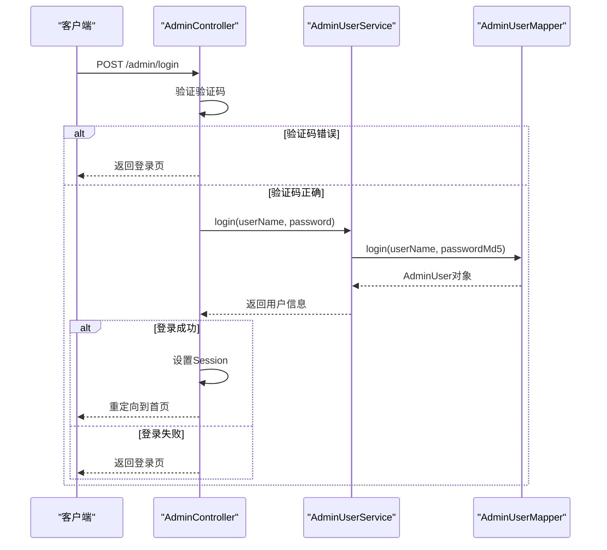
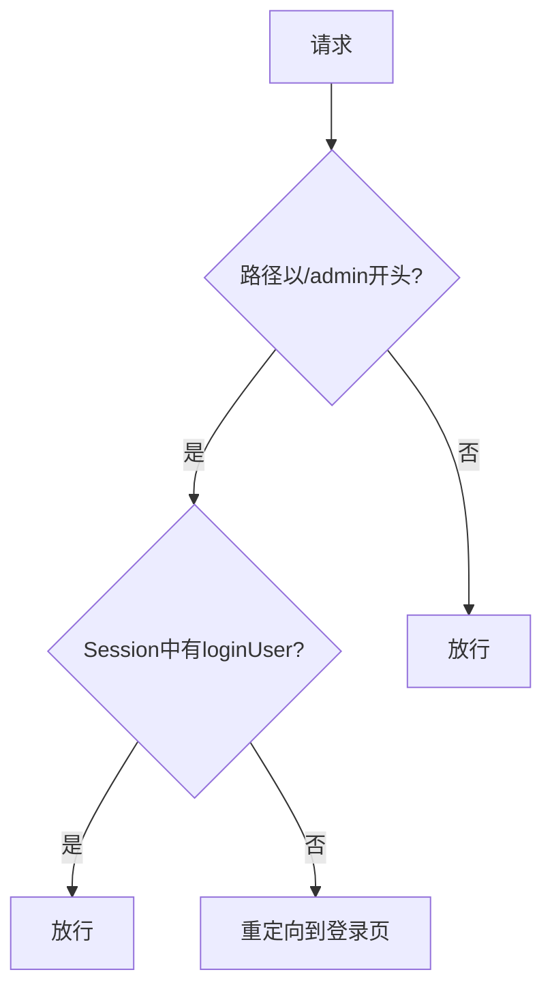
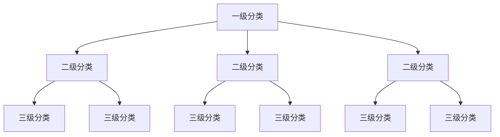
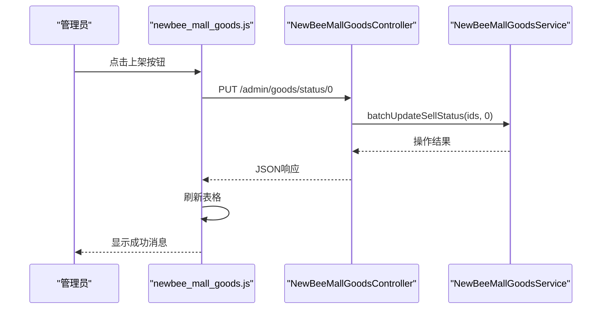
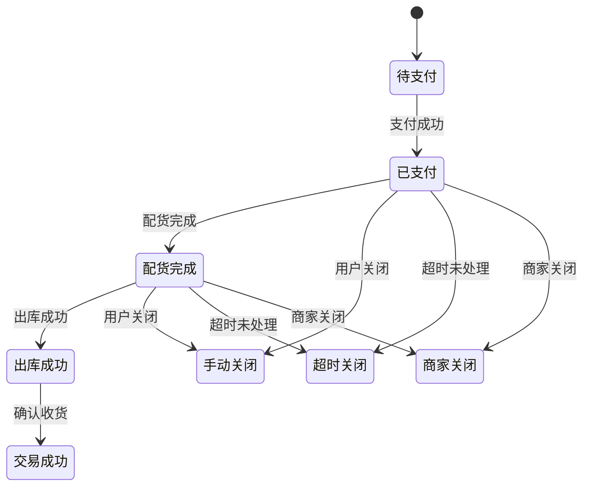
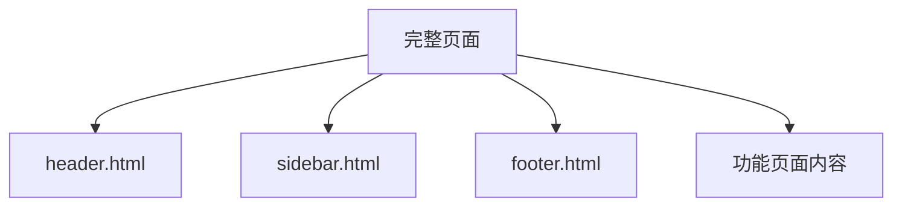
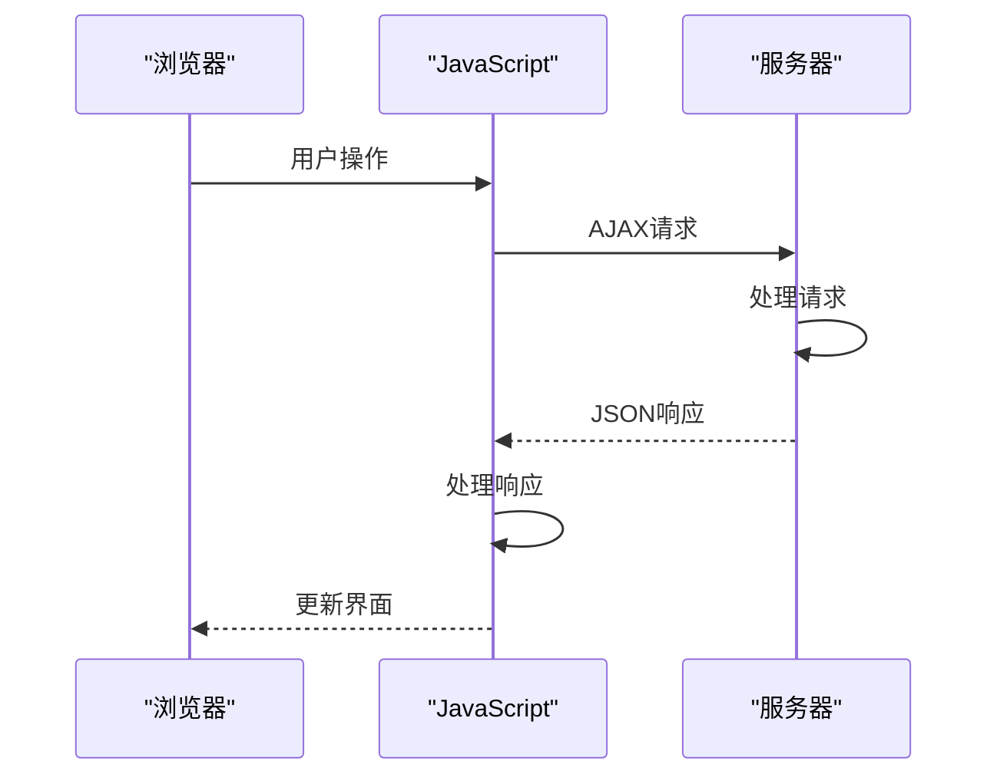

# 后台管理功能详解

<cite>
**本文档引用的文件**  
- [AdminController.java](file://src/main/java/ltd/newbee/mall/controller/admin/AdminController.java)
- [AdminLoginInterceptor.java](file://src/main/java/ltd/newbee/mall/interceptor/AdminLoginInterceptor.java)
- [NewBeeMallGoodsController.java](file://src/main/java/ltd/newbee/mall/controller/admin/NewBeeMallGoodsController.java)
- [NewBeeMallGoodsCategoryController.java](file://src/main/java/ltd/newbee/mall/controller/admin/NewBeeMallGoodsCategoryController.java)
- [NewBeeMallOrderController.java](file://src/main/java/ltd/newbee/mall/controller/admin/NewBeeMallOrderController.java)
- [NewBeeMallOrderStatusEnum.java](file://src/main/java/ltd/newbee/mall/common/NewBeeMallOrderStatusEnum.java)
- [NeeBeeMallWebMvcConfigurer.java](file://src/main/java/ltd/newbee/mall/config/NeeBeeMallWebMvcConfigurer.java)
- [login.html](file://src/main/resources/templates/admin/login.html)
- [newbee_mall_goods.js](file://src/main/resources/static/admin/dist/js/newbee_mall_goods.js)
- [newbee_mall_category.js](file://src/main/resources/static/admin/dist/js/newbee_mall_category.js)
- [newbee_mall_order.js](file://src/main/resources/static/admin/dist/js/newbee_mall_order.js)
- [header.html](file://src/main/resources/templates/admin/header.html)
- [sidebar.html](file://src/main/resources/templates/admin/sidebar.html)
- [Constants.java](file://src/main/java/ltd/newbee/mall/common/Constants.java)
- [AdminUserServiceImpl.java](file://src/main/java/ltd/newbee/mall/service/impl/AdminUserServiceImpl.java)
</cite>

## 目录
1. [管理员登录认证](#管理员登录认证)
2. [轮播图管理](#轮播图管理)
3. [商品管理](#商品管理)
4. [订单处理](#订单处理)
5. [会员管理](#会员管理)
6. [界面布局与数据绑定](#界面布局与数据绑定)

## 管理员登录认证

管理员登录认证功能由 `AdminController` 和 `AdminLoginInterceptor` 两个核心组件协同实现。`AdminController` 负责处理登录请求，而 `AdminLoginInterceptor` 负责在请求到达控制器之前进行权限验证。

`AdminController` 的 `login` 方法处理 POST 请求，接收用户名、密码和验证码三个参数。该方法首先验证验证码是否为空以及是否正确，然后调用 `AdminUserService` 的 `login` 方法进行用户认证。认证成功后，将用户信息存储在 Session 中，并重定向到后台首页。认证失败则返回错误信息。

**Diagram sources**
- [AdminController.java](file://src/main/java/ltd/newbee/mall/controller/admin/AdminController.java#L54-L82)
- [AdminUserServiceImpl.java](file://src/main/java/ltd/newbee/mall/service/impl/AdminUserServiceImpl.java#L26-L29)

**Section sources**
- [AdminController.java](file://src/main/java/ltd/newbee/mall/controller/admin/AdminController.java#L37-L82)
- [AdminUserServiceImpl.java](file://src/main/java/ltd/newbee/mall/service/impl/AdminUserServiceImpl.java#L26-L29)

`AdminLoginInterceptor` 实现了 `HandlerInterceptor` 接口，通过 `preHandle` 方法在请求处理前进行拦截。该拦截器检查请求路径是否以 `/admin` 开头，并验证 Session 中是否存在 `loginUser` 属性。如果不存在，则重定向到登录页面，从而实现后台管理系统的权限控制。

**Diagram sources**
- [AdminLoginInterceptor.java](file://src/main/java/ltd/newbee/mall/interceptor/AdminLoginInterceptor.java#L30-L35)
- [NeeBeeMallWebMvcConfigurer.java](file://src/main/java/ltd/newbee/mall/config/NeeBeeMallWebMvcConfigurer.java#L31-L37)

**Section sources**
- [AdminLoginInterceptor.java](file://src/main/java/ltd/newbee/mall/interceptor/AdminLoginInterceptor.java#L30-L39)
- [NeeBeeMallWebMvcConfigurer.java](file://src/main/java/ltd/newbee/mall/config/NeeBeeMallWebMvcConfigurer.java#L31-L37)

## 轮播图管理

轮播图管理功能允许管理员配置首页的轮播图展示。系统通过 `NewBeeMallCarouselController` 处理轮播图相关的 CRUD 操作，包括轮播图的添加、修改、删除和查询。

轮播图的配置界面位于后台管理系统的"首页配置"菜单下，通过侧边栏的"轮播图配置"链接访问。管理员可以设置轮播图的跳转链接、图片地址和排序值，系统会根据排序值决定轮播图的展示顺序。

轮播图的最大数量由 `Constants.java` 文件中的 `INDEX_CAROUSEL_NUMBER` 常量定义，默认值为 5。这个常量控制了首页展示的轮播图数量，可以根据实际需求进行调整。

**Section sources**
- [NewBeeMallCarouselController.java](file://src/main/java/ltd/newbee/mall/controller/admin/NewBeeMallCarouselController.java)
- [Constants.java](file://src/main/java/ltd/newbee/mall/common/Constants.java#L22)

## 商品管理

商品管理是后台系统的核心功能之一，主要由 `NewBeeMallGoodsController` 和 `NewBeeMallGoodsCategoryController` 两个控制器协同工作完成。这两个控制器分别负责商品信息和商品分类的管理。

### 分类树构建

商品分类采用三级树形结构，分别为一级分类、二级分类和三级分类。`NewBeeMallGoodsCategoryController` 提供了分类管理的完整功能，包括分类的添加、修改、删除和查询。分类的层级关系通过 `GoodsCategory` 实体的 `parent_id` 字段维护。

在商品编辑页面，系统通过 `listForSelect` 接口动态加载分类数据。当选择一级分类时，系统会自动加载该一级分类下的所有二级分类；选择二级分类时，会加载对应的三级分类。这种级联加载机制确保了分类选择的准确性和用户体验。

**Diagram sources**
- [NewBeeMallGoodsCategoryController.java](file://src/main/java/ltd/newbee/mall/controller/admin/NewBeeMallGoodsCategoryController.java#L70-L98)
- [NewBeeMallGoodsController.java](file://src/main/java/ltd/newbee/mall/controller/admin/NewBeeMallGoodsController.java#L56-L74)

**Section sources**
- [NewBeeMallGoodsCategoryController.java](file://src/main/java/ltd/newbee/mall/controller/admin/NewBeeMallGoodsCategoryController.java#L70-L98)
- [NewBeeMallGoodsController.java](file://src/main/java/ltd/newbee/mall/controller/admin/NewBeeMallGoodsController.java#L56-L74)

### 商品上下架操作

商品上下架操作通过 `NewBeeMallGoodsController` 的 `batchUpdateSellStatus` 方法实现。系统定义了两个常量来表示商品的销售状态：`SELL_STATUS_UP` (0) 表示上架，`SELL_STATUS_DOWN` (1) 表示下架。这些常量在 `Constants.java` 文件中定义。

在前端界面，`newbee_mall_goods.js` 文件中的 `putUpGoods` 和 `putDownGoods` 函数分别处理上架和下架操作。当管理员选择商品并点击相应按钮时，JavaScript 会发送 PUT 请求到 `/admin/goods/status/{sellStatus}` 接口，其中 `{sellStatus}` 为 0 或 1，表示上架或下架状态。

**Diagram sources**
- [NewBeeMallGoodsController.java](file://src/main/java/ltd/newbee/mall/controller/admin/NewBeeMallGoodsController.java#L212-L225)
- [newbee_mall_goods.js](file://src/main/resources/static/admin/dist/js/newbee_mall_goods.js#L100-L137)

**Section sources**
- [NewBeeMallGoodsController.java](file://src/main/java/ltd/newbee/mall/controller/admin/NewBeeMallGoodsController.java#L212-L225)
- [newbee_mall_goods.js](file://src/main/resources/static/admin/dist/js/newbee_mall_goods.js#L100-L137)

## 订单处理

订单处理功能由 `NewBeeMallOrderController` 负责，提供了订单的查询、修改和状态变更等操作。订单状态的变更机制与 `NewBeeMallOrderStatusEnum` 枚举紧密关联，确保了订单状态流转的规范性和一致性。

### 订单状态变更机制

`NewBeeMallOrderStatusEnum` 枚举定义了订单的多种状态，包括待支付(0)、已支付(1)、配货完成(2)、出库成功(3)、交易成功(4)以及各种关闭状态。这些状态值在订单处理过程中被广泛使用，确保了系统各组件对订单状态的理解一致。

订单状态的变更通过一系列专门的接口实现：
- `checkDone`：将订单状态从"已支付"变更为"配货完成"
- `checkOut`：将订单状态从"配货完成"变更为"出库成功"
- `closeOrder`：关闭订单，变更为相应的关闭状态

**Diagram sources**
- [NewBeeMallOrderStatusEnum.java](file://src/main/java/ltd/newbee/mall/common/NewBeeMallOrderStatusEnum.java#L18-L28)
- [NewBeeMallOrderController.java](file://src/main/java/ltd/newbee/mall/controller/admin/NewBeeMallOrderController.java#L99-L145)

**Section sources**
- [NewBeeMallOrderStatusEnum.java](file://src/main/java/ltd/newbee/mall/common/NewBeeMallOrderStatusEnum.java#L18-L28)
- [NewBeeMallOrderController.java](file://src/main/java/ltd/newbee/mall/controller/admin/NewBeeMallOrderController.java#L99-L145)

在前端界面，`newbee_mall_order.js` 文件实现了订单状态变更的交互逻辑。当管理员选择订单并点击"配货完成"或"出库"按钮时，系统会先检查所选订单的状态是否符合变更条件，然后发送相应的 POST 请求到服务器。

## 会员管理

会员管理功能允许管理员查看和管理商城的注册用户。通过 `NewBeeMallUserController` 提供的接口，管理员可以查询用户列表、查看用户详情以及管理用户状态。

会员管理界面位于后台管理系统的"管理模块"菜单下，通过侧边栏的"会员管理"链接访问。管理员可以查看用户的注册时间、最后登录时间、账户状态等信息，并可以根据需要进行相应的管理操作。

用户数据存储在 `MallUser` 实体中，包含用户的基本信息如用户名、昵称、手机号、邮箱等。系统通过 `NewBeeMallUserService` 提供用户管理的服务接口，实现了用户数据的增删改查功能。

**Section sources**
- [NewBeeMallUserController.java](file://src/main/java/ltd/newbee/mall/controller/admin/NewBeeMallUserController.java)
- [NewBeeMallUserService.java](file://src/main/java/ltd/newbee/mall/service/NewBeeMallUserService.java)

## 界面布局与数据绑定

后台管理系统的界面布局采用标准的管理后台设计模式，包含顶部导航栏、侧边栏和主要内容区域。这种布局通过 Thymeleaf 模板引擎实现，确保了界面的一致性和可维护性。

### 模板文件结构

系统使用了多个模板文件来构建完整的页面布局：
- `header.html`：定义顶部导航栏，包含系统标题和用户信息
- `sidebar.html`：定义侧边栏菜单，提供系统各功能模块的导航
- `footer.html`：定义页面底部信息

这些模板文件通过 Thymeleaf 的 `th:fragment` 和 `th:replace` 指令组合成完整的页面。例如，每个功能页面都会引入这三个模板文件，形成统一的界面风格。

**Diagram sources**
- [header.html](file://src/main/resources/templates/admin/header.html)
- [sidebar.html](file://src/main/resources/templates/admin/sidebar.html)

**Section sources**
- [header.html](file://src/main/resources/templates/admin/header.html)
- [sidebar.html](file://src/main/resources/templates/admin/sidebar.html)

### 数据绑定与动态交互

系统使用 jqGrid 插件实现数据表格的展示和交互。每个管理模块的列表页面都使用 jqGrid 来显示数据，提供了分页、排序、搜索等丰富的功能。

JavaScript 文件在数据绑定和动态交互中扮演着重要角色：
- `newbee_mall_goods.js`：处理商品管理模块的交互，包括商品的添加、编辑、上下架等操作
- `newbee_mall_category.js`：处理分类管理模块的交互，包括分类的添加、编辑、删除和层级导航
- `newbee_mall_order.js`：处理订单管理模块的交互，包括订单状态变更、订单详情查看等操作

这些 JavaScript 文件通过 AJAX 调用后端 REST API，实现了无刷新的数据操作。例如，在商品管理页面，`newbee_mall_goods.js` 文件中的 `putUpGoods` 函数会收集选中的商品 ID，然后通过 PUT 请求调用后端的 `/admin/goods/status/0` 接口，实现商品的批量上架。

**Diagram sources**
- [newbee_mall_goods.js](file://src/main/resources/static/admin/dist/js/newbee_mall_goods.js)
- [newbee_mall_category.js](file://src/main/resources/static/admin/dist/js/newbee_mall_category.js)
- [newbee_mall_order.js](file://src/main/resources/static/admin/dist/js/newbee_mall_order.js)

**Section sources**
- [newbee_mall_goods.js](file://src/main/resources/static/admin/dist/js/newbee_mall_goods.js)
- [newbee_mall_category.js](file://src/main/resources/static/admin/dist/js/newbee_mall_category.js)
- [newbee_mall_order.js](file://src/main/resources/static/admin/dist/js/newbee_mall_order.js)

通过这种前后端分离的设计，系统实现了良好的用户体验和高效的开发模式。后端专注于业务逻辑和数据处理，前端专注于用户界面和交互体验，两者通过清晰的 API 接口进行通信。