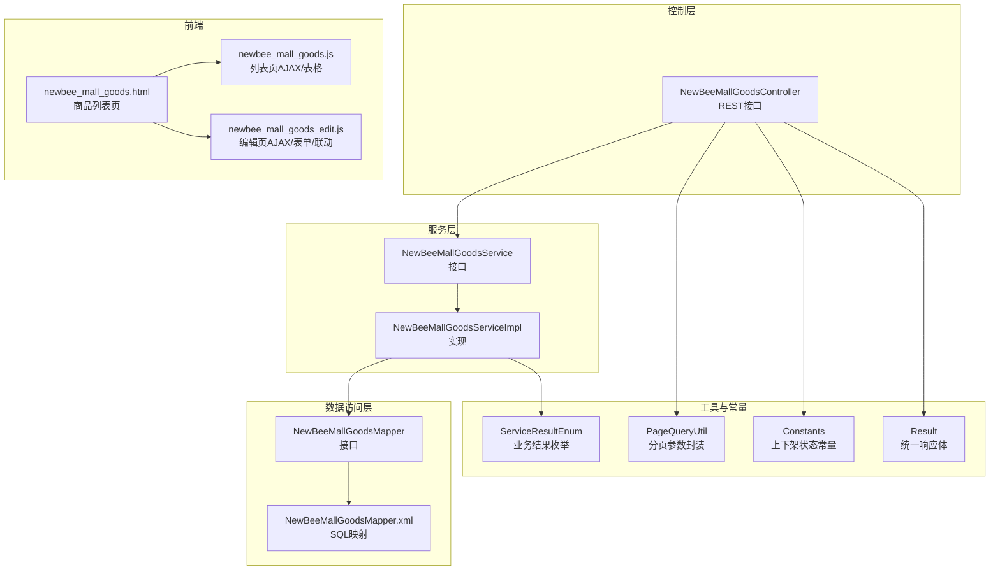
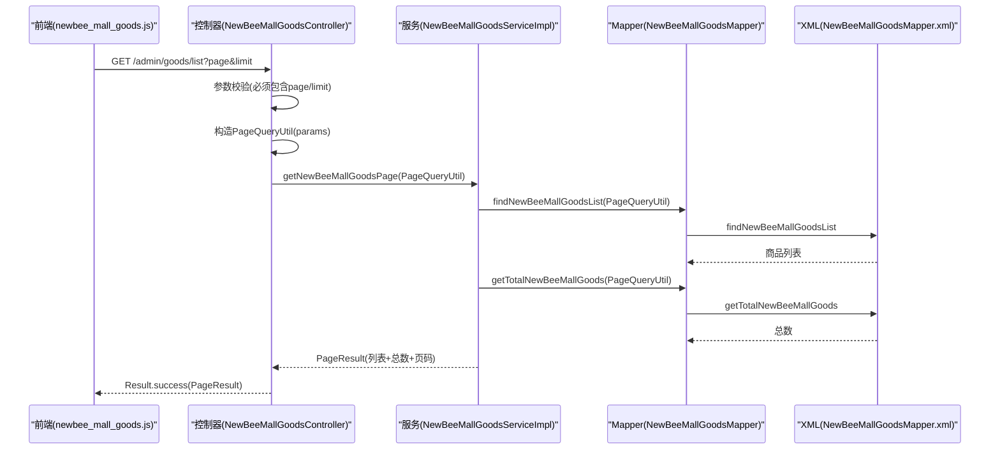
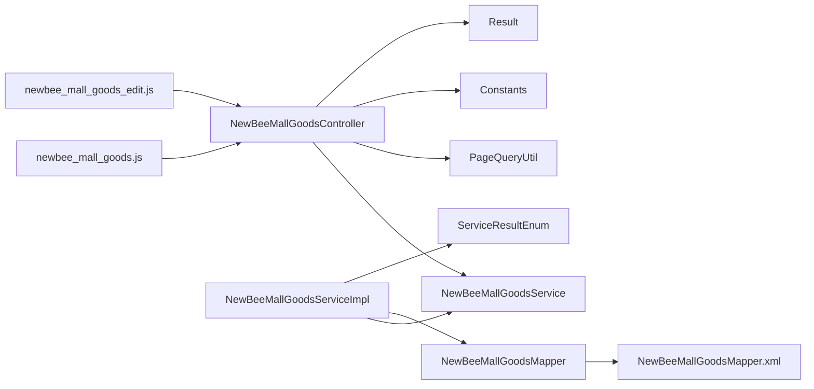

# 商品CRUD管理

<cite>
**本文引用的文件**
- [NewBeeMallGoodsController.java](file://src/main/java/ltd/newbee/mall/controller/admin/NewBeeMallGoodsController.java)
- [NewBeeMallGoodsService.java](file://src/main/java/ltd/newbee/mall/service/NewBeeMallGoodsService.java)
- [NewBeeMallGoodsServiceImpl.java](file://src/main/java/ltd/newbee/mall/service/impl/NewBeeMallGoodsServiceImpl.java)
- [NewBeeMallGoodsMapper.java](file://src/main/java/ltd/newbee/mall/dao/NewBeeMallGoodsMapper.java)
- [NewBeeMallGoodsMapper.xml](file://src/main/resources/mapper/NewBeeMallGoodsMapper.xml)
- [PageQueryUtil.java](file://src/main/java/ltd/newbee/mall/util/PageQueryUtil.java)
- [Constants.java](file://src/main/java/ltd/newbee/mall/common/Constants.java)
- [ServiceResultEnum.java](file://src/main/java/ltd/newbee/mall/common/ServiceResultEnum.java)
- [Result.java](file://src/main/java/ltd/newbee/mall/util/Result.java)
- [newbee_mall_goods.js](file://src/main/resources/static/admin/dist/js/newbee_mall_goods.js)
- [newbee_mall_goods_edit.js](file://src/main/resources/static/admin/dist/js/newbee_mall_goods_edit.js)
- [newbee_mall_goods.html](file://src/main/resources/templates/admin/newbee_mall_goods.html)
</cite>

## 目录
1. [引言](#引言)
2. [项目结构](#项目结构)
3. [核心组件](#核心组件)
4. [架构总览](#架构总览)
5. [详细组件分析](#详细组件分析)
6. [依赖分析](#依赖分析)
7. [性能考虑](#性能考虑)
8. [故障排查指南](#故障排查指南)
9. [结论](#结论)
10. [附录](#附录)

## 引言
本文件围绕商品CRUD管理展开，系统性梳理从控制器到服务层、持久层的完整链路，重点覆盖以下目标：
- NewBeeMallGoodsController 的 list、save、update、info、batchUpdateSellStatus 接口行为与参数校验
- 分页查询 PageQueryUtil 的构造与使用
- 商品保存/更新的业务规则校验与返回结果处理
- MyBatis Mapper 与 XML 映射中 findNewBeeMallGoodsList/getTotalNewBeeMallGoods 的分页实现
- 前端通过 AJAX 实现表格动态加载、表单提交与验证、三级分类联动选择的 JavaScript 逻辑

## 项目结构
后端采用典型的三层架构：Controller（控制层）- Service（服务层）- DAO/MyBatis（数据访问层）。商品管理模块位于后台管理路径下，前端模板与静态资源分别在 templates 与 static 目录中。

图表来源
- [NewBeeMallGoodsController.java](file://src/main/java/ltd/newbee/mall/controller/admin/NewBeeMallGoodsController.java#L132-L228)
- [NewBeeMallGoodsService.java](file://src/main/java/ltd/newbee/mall/service/NewBeeMallGoodsService.java#L17-L74)
- [NewBeeMallGoodsServiceImpl.java](file://src/main/java/ltd/newbee/mall/service/impl/NewBeeMallGoodsServiceImpl.java#L41-L137)
- [NewBeeMallGoodsMapper.java](file://src/main/java/ltd/newbee/mall/dao/NewBeeMallGoodsMapper.java#L18-L53)
- [NewBeeMallGoodsMapper.xml](file://src/main/resources/mapper/NewBeeMallGoodsMapper.xml#L78-L183)
- [PageQueryUtil.java](file://src/main/java/ltd/newbee/mall/util/PageQueryUtil.java#L14-L56)
- [Constants.java](file://src/main/java/ltd/newbee/mall/common/Constants.java#L44-L46)
- [ServiceResultEnum.java](file://src/main/java/ltd/newbee/mall/common/ServiceResultEnum.java#L17-L77)
- [Result.java](file://src/main/java/ltd/newbee/mall/util/Result.java#L11-L58)
- [newbee_mall_goods.html](file://src/main/resources/templates/admin/newbee_mall_goods.html#L40-L88)
- [newbee_mall_goods.js](file://src/main/resources/static/admin/dist/js/newbee_mall_goods.js#L1-L181)
- [newbee_mall_goods_edit.js](file://src/main/resources/static/admin/dist/js/newbee_mall_goods_edit.js#L1-L358)

章节来源
- [NewBeeMallGoodsController.java](file://src/main/java/ltd/newbee/mall/controller/admin/NewBeeMallGoodsController.java#L132-L228)
- [newbee_mall_goods.html](file://src/main/resources/templates/admin/newbee_mall_goods.html#L40-L88)

## 核心组件
- 控制器 NewBeeMallGoodsController：提供商品列表、保存、更新、详情、批量上下架状态修改等接口；负责参数校验与结果包装。
- 服务接口与实现 NewBeeMallGoodsService/Impl：封装业务规则（如三级分类校验、重复校验、状态变更），协调 Mapper 完成数据库操作。
- 数据访问层 NewBeeMallGoodsMapper/XML：定义 SQL 查询与更新，支持分页、条件过滤、批量更新等。
- 工具与常量：PageQueryUtil 封装分页参数；Constants 提供上下架状态常量；ServiceResultEnum 统一业务结果；Result 统一响应体。
- 前端：newbee_mall_goods.js 使用 jqGrid 动态加载表格数据；newbee_mall_goods_edit.js 处理表单提交、富文本编辑器、图片上传、三级分类联动。

章节来源
- [NewBeeMallGoodsController.java](file://src/main/java/ltd/newbee/mall/controller/admin/NewBeeMallGoodsController.java#L132-L228)
- [NewBeeMallGoodsService.java](file://src/main/java/ltd/newbee/mall/service/NewBeeMallGoodsService.java#L17-L74)
- [NewBeeMallGoodsServiceImpl.java](file://src/main/java/ltd/newbee/mall/service/impl/NewBeeMallGoodsServiceImpl.java#L41-L137)
- [NewBeeMallGoodsMapper.java](file://src/main/java/ltd/newbee/mall/dao/NewBeeMallGoodsMapper.java#L18-L53)
- [NewBeeMallGoodsMapper.xml](file://src/main/resources/mapper/NewBeeMallGoodsMapper.xml#L78-L183)
- [PageQueryUtil.java](file://src/main/java/ltd/newbee/mall/util/PageQueryUtil.java#L14-L56)
- [Constants.java](file://src/main/java/ltd/newbee/mall/common/Constants.java#L44-L46)
- [ServiceResultEnum.java](file://src/main/java/ltd/newbee/mall/common/ServiceResultEnum.java#L17-L77)
- [Result.java](file://src/main/java/ltd/newbee/mall/util/Result.java#L11-L58)
- [newbee_mall_goods.js](file://src/main/resources/static/admin/dist/js/newbee_mall_goods.js#L1-L181)
- [newbee_mall_goods_edit.js](file://src/main/resources/static/admin/dist/js/newbee_mall_goods_edit.js#L1-L358)

## 架构总览
下面以序列图展示“列表分页查询”的端到端流程，包括前端请求、控制器、服务层、Mapper 与 XML 的调用顺序。

图表来源
- [NewBeeMallGoodsController.java](file://src/main/java/ltd/newbee/mall/controller/admin/NewBeeMallGoodsController.java#L132-L143)
- [PageQueryUtil.java](file://src/main/java/ltd/newbee/mall/util/PageQueryUtil.java#L20-L30)
- [NewBeeMallGoodsServiceImpl.java](file://src/main/java/ltd/newbee/mall/service/impl/NewBeeMallGoodsServiceImpl.java#L41-L46)
- [NewBeeMallGoodsMapper.java](file://src/main/java/ltd/newbee/mall/dao/NewBeeMallGoodsMapper.java#L35-L37)
- [NewBeeMallGoodsMapper.xml](file://src/main/resources/mapper/NewBeeMallGoodsMapper.xml#L78-L100)
- [NewBeeMallGoodsMapper.xml](file://src/main/resources/mapper/NewBeeMallGoodsMapper.xml#L167-L183)
- [Result.java](file://src/main/java/ltd/newbee/mall/util/Result.java#L11-L58)

## 详细组件分析

### 控制器：NewBeeMallGoodsController
- 列表接口 list
  - 参数要求：必须包含 page 与 limit，否则直接返回参数异常。
  - 分页参数封装：通过 PageQueryUtil 构造 start/page/limit，并传递给服务层。
  - 返回值：Result.success(PageResult)。
- 保存接口 save
  - 参数校验：对商品名称、简介、标签、原价、分类、售卖价、库存、状态、封面图、详情内容进行非空校验。
  - 业务处理：调用服务层保存，依据返回的业务结果字符串判断成功或失败并返回统一结果。
- 更新接口 update
  - 参数校验：除 goodsId 必填外，其余字段与保存一致。
  - 业务处理：调用服务层更新，依据返回的业务结果字符串判断成功或失败并返回统一结果。
- 详情接口 info
  - 参数：路径变量 id。
  - 行为：查询商品详情并返回 Result.success。
- 批量上下架接口 status
  - 方法：PUT /admin/goods/status/{sellStatus}
  - 参数：ids 数组与 sellStatus（0 上架/1 下架）。
  - 校验：ids 非空；sellStatus 仅允许 0 或 1。
  - 行为：调用服务层批量更新，返回统一结果。

章节来源
- [NewBeeMallGoodsController.java](file://src/main/java/ltd/newbee/mall/controller/admin/NewBeeMallGoodsController.java#L132-L228)
- [Constants.java](file://src/main/java/ltd/newbee/mall/common/Constants.java#L44-L46)
- [Result.java](file://src/main/java/ltd/newbee/mall/util/Result.java#L11-L58)

### 服务层：NewBeeMallGoodsService 与 Impl
- 分页查询 getNewBeeMallGoodsPage
  - 逻辑：先查列表，再查总数，组装 PageResult 返回。
- 保存 saveNewBeeMallGoods
  - 业务规则：
    - 校验三级分类：分类必须存在且级别为三级，否则返回分类异常。
    - 唯一性校验：同分类下同名商品不允许重复，否则返回已存在。
    - 内容清洗：对名称、简介、标签进行清洗处理。
    - 插入：insertSelective 成功返回成功，否则返回数据库错误。
- 更新 updateNewBeeMallGoods
  - 业务规则：
    - 校验三级分类：分类必须存在且级别为三级，否则返回分类异常。
    - 存在性校验：按主键查询，不存在返回不存在。
    - 唯一性校验：同分类下同名商品（排除自身）不允许重复，否则返回已存在。
    - 内容清洗：对名称、简介、标签进行清洗处理。
    - 更新：updateByPrimaryKeySelective 成功返回成功，否则返回数据库错误。
- 详情 getNewBeeMallGoodsById
  - 逻辑：按主键查询，不存在抛出异常并转换为业务结果。
- 批量上下架 batchUpdateSellStatus
  - 逻辑：调用 Mapper 的批量更新 SQL，返回是否受影响行数大于 0 的布尔值。

章节来源
- [NewBeeMallGoodsService.java](file://src/main/java/ltd/newbee/mall/service/NewBeeMallGoodsService.java#L17-L74)
- [NewBeeMallGoodsServiceImpl.java](file://src/main/java/ltd/newbee/mall/service/impl/NewBeeMallGoodsServiceImpl.java#L41-L137)
- [ServiceResultEnum.java](file://src/main/java/ltd/newbee/mall/common/ServiceResultEnum.java#L17-L77)

### 数据访问层：NewBeeMallGoodsMapper 与 XML
- 列表与总数
  - findNewBeeMallGoodsList：支持按名称模糊匹配、销售状态过滤、时间范围过滤，最后按 goods_id 倒序并分页。
  - getTotalNewBeeMallGoods：统计满足条件的商品总数。
- 批量上下架
  - batchUpdateSellStatus：根据 goods_id 列表批量更新 goods_sell_status 与更新时间。
- 其他常用操作
  - selectByPrimaryKey/selectByCategoryIdAndName/updateByPrimaryKeySelective 等，支撑服务层的业务逻辑。

章节来源
- [NewBeeMallGoodsMapper.java](file://src/main/java/ltd/newbee/mall/dao/NewBeeMallGoodsMapper.java#L18-L53)
- [NewBeeMallGoodsMapper.xml](file://src/main/resources/mapper/NewBeeMallGoodsMapper.xml#L78-L183)

### 分页查询工具：PageQueryUtil
- 作用：将 page/limit 解析为 start/page/limit 并放入 Map，供 Mapper 使用。
- 关键点：start = (page - 1) * limit，确保 SQL limit 子句正确生效。

章节来源
- [PageQueryUtil.java](file://src/main/java/ltd/newbee/mall/util/PageQueryUtil.java#L20-L30)

### 前端：表格动态加载与表单提交
- 商品列表页 newbee_mall_goods.html
  - 引入 jqGrid、本地化、SweetAlert2、公共脚本与 newbee_mall_goods.js。
- newbee_mall_goods.js
  - jqGrid 初始化：指定数据源 URL、列模型、分页参数映射、JSONReader 结构、多选等。
  - 动态加载：reload 函数重置当前页并触发 reloadGrid。
  - 上架/下架：通过 PUT /admin/goods/status/{status} 触发批量状态更新，成功后刷新表格。
- newbee_mall_goods_edit.js
  - 富文本编辑器：基于 wangEditor，支持图片上传回调与插入。
  - 图片上传：AjaxUpload 组件上传封面图，校验文件类型与大小，成功后回填到页面。
  - 表单校验：对分类、名称、标签、简介、价格、库存、状态、详情内容、封面图进行前端校验。
  - 三级联动：监听一级/二级下拉变化，向 /admin/categories/listForSelect 发起 AJAX 请求，动态填充二级/三级选项。
  - 保存/更新：根据是否存在 goodsId 决定调用 /admin/goods/save 或 /admin/goods/update，提交 JSON 数据，成功后提示并跳转列表页。

章节来源
- [newbee_mall_goods.html](file://src/main/resources/templates/admin/newbee_mall_goods.html#L40-L88)
- [newbee_mall_goods.js](file://src/main/resources/static/admin/dist/js/newbee_mall_goods.js#L1-L181)
- [newbee_mall_goods_edit.js](file://src/main/resources/static/admin/dist/js/newbee_mall_goods_edit.js#L1-L358)

## 依赖分析
- 控制器依赖服务接口，服务实现依赖 Mapper 接口，Mapper 依赖 XML 中的 SQL。
- 控制器依赖分页工具与常量；服务实现依赖业务结果枚举；统一返回体由 Result 提供。
- 前端依赖 jqGrid、SweetAlert2、AjaxUpload 等插件，与后端 REST 接口耦合。

图表来源
- [NewBeeMallGoodsController.java](file://src/main/java/ltd/newbee/mall/controller/admin/NewBeeMallGoodsController.java#L132-L228)
- [NewBeeMallGoodsService.java](file://src/main/java/ltd/newbee/mall/service/NewBeeMallGoodsService.java#L17-L74)
- [NewBeeMallGoodsServiceImpl.java](file://src/main/java/ltd/newbee/mall/service/impl/NewBeeMallGoodsServiceImpl.java#L41-L137)
- [NewBeeMallGoodsMapper.java](file://src/main/java/ltd/newbee/mall/dao/NewBeeMallGoodsMapper.java#L18-L53)
- [NewBeeMallGoodsMapper.xml](file://src/main/resources/mapper/NewBeeMallGoodsMapper.xml#L78-L183)
- [PageQueryUtil.java](file://src/main/java/ltd/newbee/mall/util/PageQueryUtil.java#L20-L30)
- [Constants.java](file://src/main/java/ltd/newbee/mall/common/Constants.java#L44-L46)
- [ServiceResultEnum.java](file://src/main/java/ltd/newbee/mall/common/ServiceResultEnum.java#L17-L77)
- [Result.java](file://src/main/java/ltd/newbee/mall/util/Result.java#L11-L58)
- [newbee_mall_goods.js](file://src/main/resources/static/admin/dist/js/newbee_mall_goods.js#L1-L181)
- [newbee_mall_goods_edit.js](file://src/main/resources/static/admin/dist/js/newbee_mall_goods_edit.js#L1-L358)

## 性能考虑
- 分页查询
  - SQL 层面：findNewBeeMallGoodsList 与 getTotalNewBeeMallGoods 支持按名称、销售状态、时间范围过滤，建议在 goods_name、goods_sell_status、create_time 等关键字段建立索引以提升查询效率。
  - 服务层面：PageQueryUtil 的 start 计算避免了不必要的全表扫描，但需确保传入的 page/limit 合理，防止超大偏移导致慢查询。
- 批量更新
  - batchUpdateSellStatus 使用 IN 列表批量更新，建议控制 ids 数量，避免过长 IN 列表影响性能。
- 前端渲染
  - jqGrid 的 formatter 仅做简单展示，避免在前端做复杂计算；必要时可在后端返回裁剪后的字段。

[本节为通用建议，无需列出具体文件来源]

## 故障排查指南
- 控制器参数异常
  - 现象：返回“参数异常”。
  - 排查：确认前端是否正确传递 page/limit；检查控制器参数校验逻辑。
- 业务规则失败
  - 现象：返回“分类数据异常/已存在相同的商品信息/商品不存在/database error”等。
  - 排查：核对三级分类是否正确；检查同分类下商品名称唯一性；确认数据库连接与事务配置。
- 批量上下架失败
  - 现象：返回“修改失败”。
  - 排查：确认 sellStatus 是否为 0/1；ids 是否为空；Mapper 返回受影响行数是否为 0。
- 前端交互问题
  - 表格不刷新：确认 jqGrid 的 reloadGrid 是否被调用；检查 AJAX 回调中的判断逻辑。
  - 三级联动无效：确认 /admin/categories/listForSelect 接口可用；检查下拉框选择事件绑定与 DOM 更新。

章节来源
- [NewBeeMallGoodsController.java](file://src/main/java/ltd/newbee/mall/controller/admin/NewBeeMallGoodsController.java#L132-L228)
- [ServiceResultEnum.java](file://src/main/java/ltd/newbee/mall/common/ServiceResultEnum.java#L17-L77)
- [newbee_mall_goods.js](file://src/main/resources/static/admin/dist/js/newbee_mall_goods.js#L1-L181)
- [newbee_mall_goods_edit.js](file://src/main/resources/static/admin/dist/js/newbee_mall_goods_edit.js#L1-L358)

## 结论
本模块以清晰的分层设计实现了商品的完整 CRUD 流程：控制器负责参数校验与结果封装，服务层承载业务规则与数据一致性，Mapper/XML 提供稳定的 SQL 执行能力。前端通过 jqGrid 与 AJAX 实现了表格动态加载与表单交互，配合三级分类联动提升了用户体验。整体架构职责明确、扩展性强，适合进一步引入缓存、异步任务与更细粒度的权限控制。

[本节为总结性内容，无需列出具体文件来源]

## 附录
- 关键接口一览
  - 列表：GET /admin/goods/list?page&limit
  - 保存：POST /admin/goods/save
  - 更新：POST /admin/goods/update
  - 详情：GET /admin/goods/info/{id}
  - 批量上下架：PUT /admin/goods/status/{sellStatus}
- 常量与结果
  - 上下架状态：0 上架，1 下架
  - 业务结果：SUCCESS/DATA_NOT_EXIST/SAME_GOODS_EXIST/GOODS_CATEGORY_ERROR/DB_ERROR 等

[本节为概览性内容，无需列出具体文件来源]