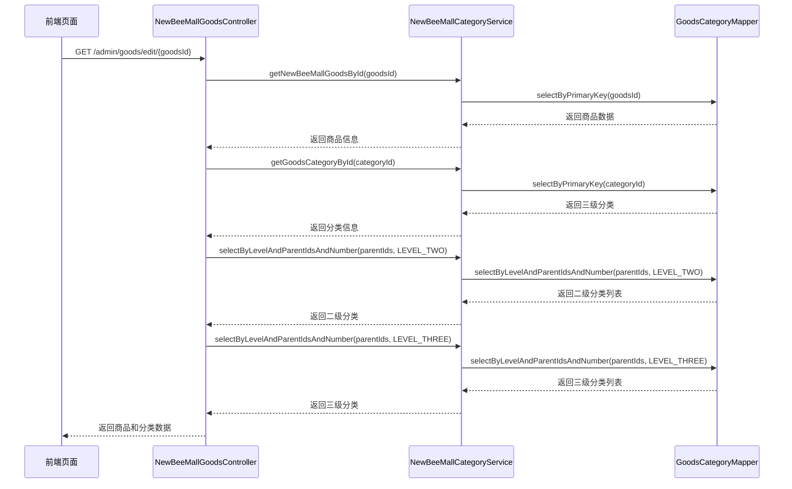
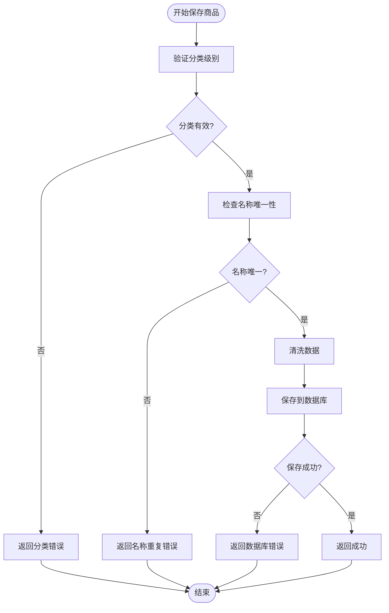
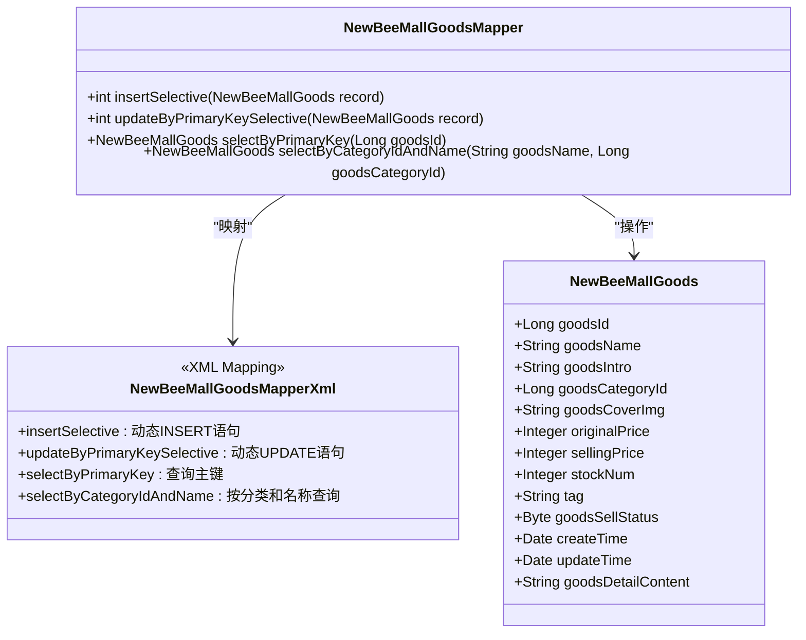
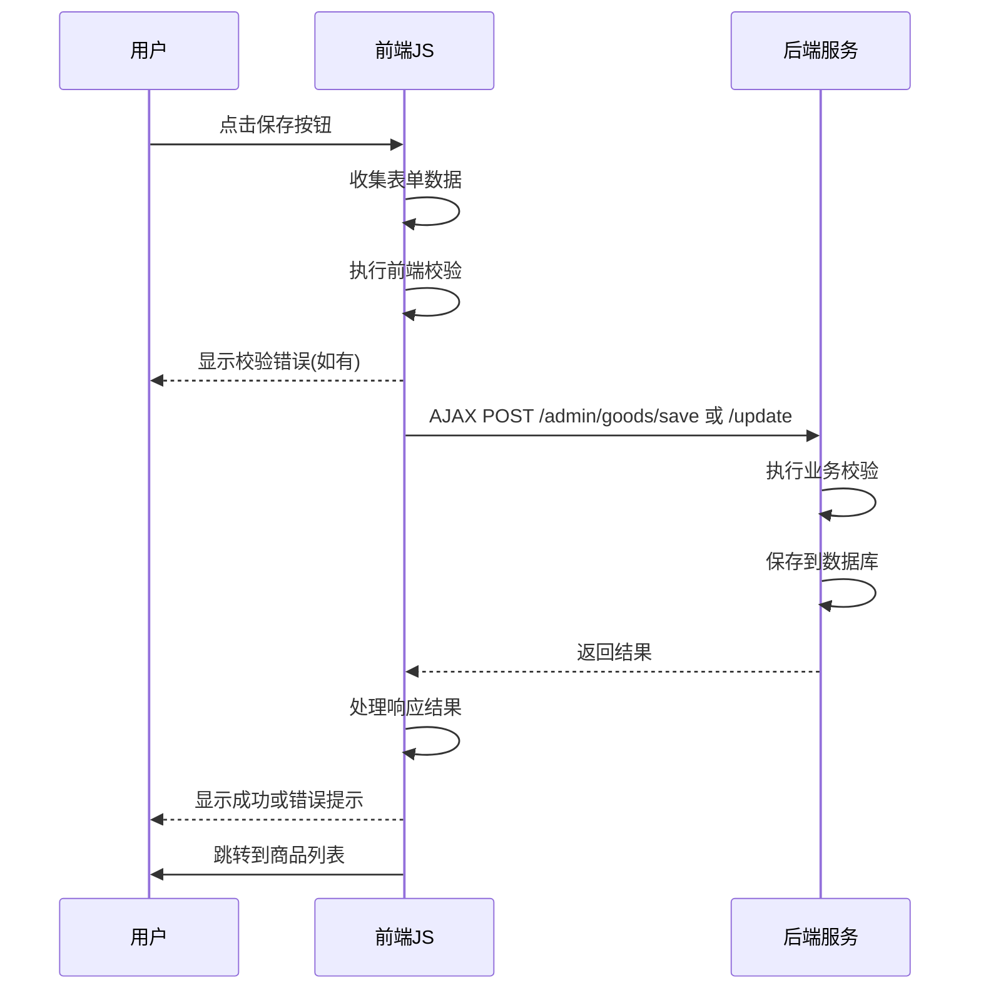

# 商品信息管理

<cite>
**本文档引用文件**   
- [NewBeeMallGoodsController.java](file://src/main/java/ltd/newbee/mall/controller/admin/NewBeeMallGoodsController.java)
- [NewBeeMallGoodsService.java](file://src/main/java/ltd/newbee/mall/service/NewBeeMallGoodsService.java)
- [NewBeeMallGoodsServiceImpl.java](file://src/main/java/ltd/newbee/mall/service/impl/NewBeeMallGoodsServiceImpl.java)
- [NewBeeMallGoodsMapper.java](file://src/main/java/ltd/newbee/mall/dao/NewBeeMallGoodsMapper.java)
- [NewBeeMallGoodsMapper.xml](file://src/main/resources/mapper/NewBeeMallGoodsMapper.xml)
- [newbee_mall_goods_edit.html](file://src/main/resources/templates/admin/newbee_mall_goods_edit.html)
- [newbee_mall_goods_edit.js](file://src/main/resources/static/admin/dist/js/newbee_mall_goods_edit.js)
- [NewBeeMallGoods.java](file://src/main/java/ltd/newbee/mall/entity/NewBeeMallGoods.java)
- [NewBeeMallCategoryService.java](file://src/main/java/ltd/newbee/mall/service/NewBeeMallCategoryService.java)
- [NewBeeMallCategoryServiceImpl.java](file://src/main/java/ltd/newbee/mall/service/impl/NewBeeMallCategoryServiceImpl.java)
- [GoodsCategoryMapper.java](file://src/main/java/ltd/newbee/mall/dao/GoodsCategoryMapper.java)
- [GoodsCategoryMapper.xml](file://src/main/resources/mapper/GoodsCategoryMapper.xml)
- [NewBeeMallCategoryLevelEnum.java](file://src/main/java/ltd/newbee/mall/common/NewBeeMallCategoryLevelEnum.java)
- [ServiceResultEnum.java](file://src/main/java/ltd/newbee/mall/common/ServiceResultEnum.java)
- [Constants.java](file://src/main/java/ltd/newbee/mall/common/Constants.java)
- [NewBeeMallUtils.java](file://src/main/java/ltd/newbee/mall/util/NewBeeMallUtils.java)
</cite>

## 目录
1. [商品信息创建与编辑流程](#商品信息创建与编辑流程)
2. [商品表单页面渲染逻辑](#商品表单页面渲染逻辑)
3. [三级分类联动数据加载机制](#三级分类联动数据加载机制)
4. [商品保存业务规则校验](#商品保存业务规则校验)
5. [MyBatis动态SQL执行细节](#mybatis动态sql执行细节)
6. [前端表单交互逻辑](#前端表单交互逻辑)

## 商品信息创建与编辑流程

商品信息的创建与编辑流程主要通过 `NewBeeMallGoodsController` 中的 `save` 和 `update` 接口实现。当管理员访问商品管理页面时，系统会调用 `goodsPage` 方法渲染商品列表页面。创建新商品时，用户点击"添加商品"按钮，系统跳转至商品编辑页面，此时调用 `edit` 方法（无参数版本）初始化表单数据。

编辑现有商品时，系统通过 `edit/{goodsId}` 接口加载指定商品的详细信息。该接口首先查询商品基本信息，然后根据商品分类ID获取完整的三级分类路径，确保表单中的分类选择器能够正确显示当前商品的分类层级。商品数据加载完成后，系统将商品信息和分类数据一并传递给前端模板进行渲染。

商品信息的保存和更新操作分别由 `save` 和 `update` 接口处理。这两个接口都采用 `@RequestBody` 注解接收前端提交的JSON数据，通过 `NewBeeMallGoodsService` 服务层进行业务逻辑处理。保存成功后返回成功结果，失败则返回相应的错误信息。

**本节来源**
- [NewBeeMallGoodsController.java](file://src/main/java/ltd/newbee/mall/controller/admin/NewBeeMallGoodsController.java#L50-L228)

## 商品表单页面渲染逻辑

商品表单页面的渲染逻辑主要在 `newbee_mall_goods_edit.html` 模板文件中实现。该页面采用Thymeleaf模板引擎，通过 `th:replace` 指令引入页面头部、侧边栏和页脚等公共组件，实现了页面结构的模块化。

表单包含多个输入字段，包括商品名称、简介、价格、库存、标签等基本信息，以及商品主图和详情内容等多媒体信息。分类选择采用三级联动下拉框设计，分别对应一级、二级和三级分类。每个下拉框通过 `th:block` 和 `th:each` 指令遍历后端传递的分类数据列表，动态生成选项。

商品主图显示区域根据商品是否存在来决定显示默认上传图片还是实际商品图片。商品详情内容使用富文本编辑器实现，通过隐藏的输入框存储编辑器内容，确保数据能够正确提交。表单提交按钮绑定JavaScript事件处理函数，实现前端验证和AJAX提交功能。

**本节来源**
- [newbee_mall_goods_edit.html](file://src/main/resources/templates/admin/newbee_mall_goods_edit.html#L1-L174)

## 三级分类联动数据加载机制

三级分类联动数据加载机制通过前后端协同实现。后端控制器 `NewBeeMallGoodsController` 的 `edit` 方法负责在页面初始化时加载分类数据。对于新商品创建，系统首先查询所有一级分类，然后获取第一个一级分类下的所有二级分类，再获取第一个二级分类下的所有三级分类，形成初始的分类数据链。

对于已有商品的编辑，系统首先获取商品的三级分类信息，然后向上追溯其父级二级分类和一级分类，构建完整的分类路径。同时，系统还会查询该分类路径下的所有同级分类，确保分类选择器能够显示完整的选项列表。

前端通过AJAX调用 `listForSelect` 接口实现动态加载。当用户选择一级分类时，触发 `$('#levelOne').on('change')` 事件，向后端发送请求获取对应的二级和三级分类数据。同样，选择二级分类时会触发 `$('#levelTwo').on('change')` 事件，仅获取对应的三级分类数据。这种按需加载机制减少了不必要的数据传输，提高了页面响应速度。

**本节来源**
- [NewBeeMallGoodsController.java](file://src/main/java/ltd/newbee/mall/controller/admin/NewBeeMallGoodsController.java#L56-L130)
- [NewBeeMallGoodsCategoryController.java](file://src/main/java/ltd/newbee/mall/controller/admin/NewBeeMallGoodsCategoryController.java#L72-L98)
- [newbee_mall_goods_edit.js](file://src/main/resources/static/admin/dist/js/newbee_mall_goods_edit.js#L292-L357)

## 商品保存业务规则校验

商品保存时的业务规则校验主要在 `NewBeeMallGoodsServiceImpl` 服务实现类中完成。`saveNewBeeMallGoods` 和 `updateNewBeeMallGoods` 方法都包含严格的校验逻辑，确保数据的完整性和一致性。

首要校验是分类级别校验。系统通过 `GoodsCategoryMapper` 查询商品分类信息，验证分类是否存在且为三级分类。如果分类不存在或不是三级分类，则返回 `GOODS_CATEGORY_ERROR` 错误结果。这一校验确保了商品只能归属于最细粒度的分类。

其次是商品名称唯一性校验。系统调用 `selectByCategoryIdAndName` 方法，检查在相同分类下是否存在同名商品。如果存在且不是当前正在编辑的商品（更新操作时），则返回 `SAME_GOODS_EXIST` 错误结果。这一校验避免了同一分类下商品名称重复的问题。

在数据处理方面，系统使用 `NewBeeMallUtils.cleanString` 方法对商品名称、简介和标签等字符串字段进行清洗，防止XSS攻击。该方法会转义HTML标签、JavaScript关键字等潜在危险字符，同时对特殊SQL关键字进行替换，增强了系统的安全性。

**本节来源**
- [NewBeeMallGoodsServiceImpl.java](file://src/main/java/ltd/newbee/mall/service/impl/NewBeeMallGoodsServiceImpl.java#L48-L65)
- [NewBeeMallGoodsServiceImpl.java](file://src/main/java/ltd/newbee/mall/service/impl/NewBeeMallGoodsServiceImpl.java#L75-L98)
- [NewBeeMallUtils.java](file://src/main/java/ltd/newbee/mall/util/NewBeeMallUtils.java#L22-L54)

## MyBatis动态SQL执行细节

MyBatis Mapper接口与XML映射文件中的 `insertSelective` 和 `updateByPrimaryKeySelective` 方法实现了动态字段更新的机制。这种设计允许只更新实际修改的字段，提高了数据库操作的效率和灵活性。

`insertSelective` 方法在 `NewBeeMallGoodsMapper.xml` 文件中通过 `<trim>` 标签实现。该标签包含 `prefix` 和 `suffixOverrides` 属性，用于构建动态的INSERT语句。每个字段都包裹在 `<if>` 标签中，只有当对应字段不为null时才会包含在SQL语句中。这种设计避免了插入null值导致的数据库约束问题。

`updateByPrimaryKeySelective` 方法采用 `<set>` 标签实现动态更新。`<set>` 标签会自动处理逗号分隔问题，只包含非null字段的更新语句。每个字段更新同样使用 `<if>` 标签进行条件判断，确保只更新实际修改的字段。这种方法特别适合部分字段更新的场景，减少了不必要的数据库写操作。

在商品更新操作中，系统还会自动设置更新时间戳。`updateNewBeeMallGoods` 方法在调用Mapper之前，会调用 `setUpdateTime(new Date())` 设置当前时间，确保每次更新都能记录准确的时间信息。

**本节来源**
- [NewBeeMallGoodsMapper.java](file://src/main/java/ltd/newbee/mall/dao/NewBeeMallGoodsMapper.java#L23-L29)
- [NewBeeMallGoodsMapper.xml](file://src/main/resources/mapper/NewBeeMallGoodsMapper.xml#L203-L355)

## 前端表单交互逻辑

前端页面通过JavaScript实现了完整的表单提交、参数校验、富文本编辑器集成以及分类选择器联动功能。`newbee_mall_goods_edit.js` 文件包含了所有前端交互逻辑。

表单提交通过 `$('#saveButton').click()` 事件处理函数实现。该函数首先收集表单所有字段的值，包括从富文本编辑器获取的HTML内容和从图片元素获取的URL。然后进行前端参数校验，检查必填字段是否为空、数值是否有效、字符串长度是否超限等。

参数校验使用 `Swal.fire()` 显示友好的错误提示。校验通过后，系统根据是否存在商品ID决定是执行保存还是更新操作。数据通过AJAX以JSON格式提交到后端，避免了页面刷新，提升了用户体验。

富文本编辑器采用wangEditor实现，通过 `E.createEditor()` 初始化。编辑器配置了图片上传功能，指向 `/admin/upload/files` 接口。上传成功后通过 `customInsert` 回调函数将图片插入编辑器，实现了无缝的图片插入体验。

分类选择器联动通过监听 `change` 事件实现。当一级或二级分类发生变化时，系统通过AJAX调用 `listForSelect` 接口获取对应的子分类数据，并动态更新下拉框选项。这种设计确保了分类选择的准确性和一致性。

**本节来源**
- [newbee_mall_goods_edit.js](file://src/main/resources/static/admin/dist/js/newbee_mall_goods_edit.js#L109-L286)
- [newbee_mall_goods_edit.js](file://src/main/resources/static/admin/dist/js/newbee_mall_goods_edit.js#L3-L71)
- [newbee_mall_goods_edit.js](file://src/main/resources/static/admin/dist/js/newbee_mall_goods_edit.js#L292-L357)