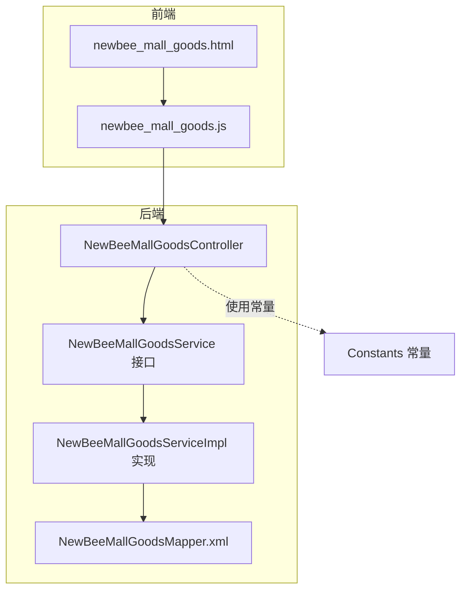
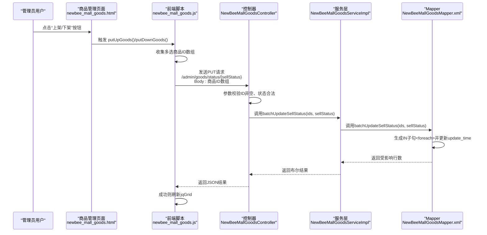
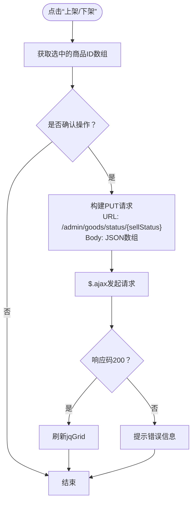
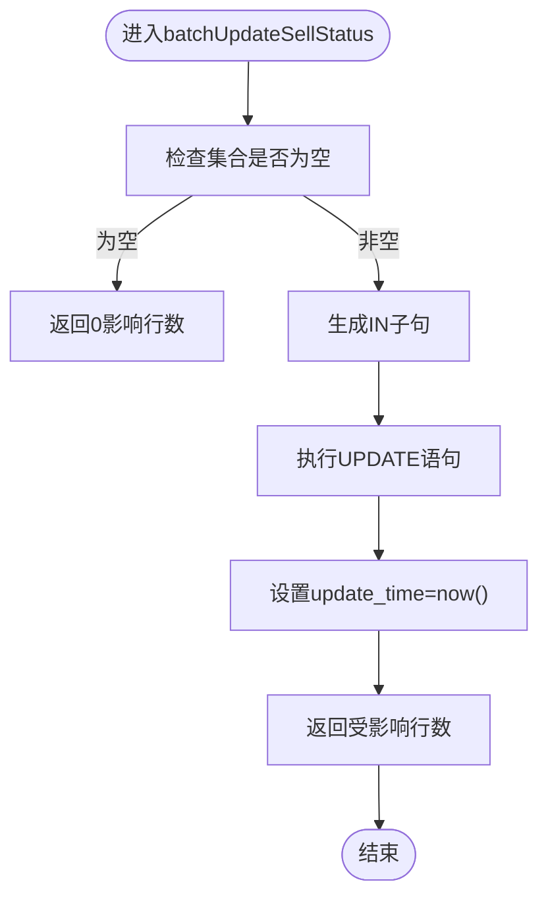
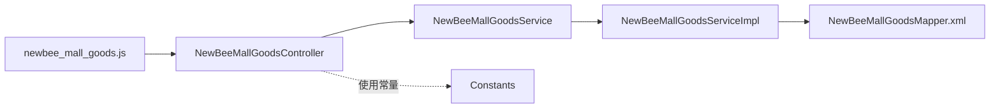

# 商品状态管理

<cite>
**本文引用的文件**
- [NewBeeMallGoodsController.java](file://src/main/java/ltd/newbee/mall/controller/admin/NewBeeMallGoodsController.java)
- [NewBeeMallGoodsService.java](file://src/main/java/ltd/newbee/mall/service/NewBeeMallGoodsService.java)
- [NewBeeMallGoodsServiceImpl.java](file://src/main/java/ltd/newbee/mall/service/impl/NewBeeMallGoodsServiceImpl.java)
- [NewBeeMallGoodsMapper.xml](file://src/main/resources/mapper/NewBeeMallGoodsMapper.xml)
- [newbee_mall_goods.js](file://src/main/resources/static/admin/dist/js/newbee_mall_goods.js)
- [newbee_mall_goods.html](file://src/main/resources/templates/admin/newbee_mall_goods.html)
- [Constants.java](file://src/main/java/ltd/newbee/mall/common/Constants.java)
</cite>

## 目录
1. [引言](#引言)
2. [项目结构](#项目结构)
3. [核心组件](#核心组件)
4. [架构总览](#架构总览)
5. [详细组件分析](#详细组件分析)
6. [依赖关系分析](#依赖关系分析)
7. [性能考量](#性能考量)
8. [故障排查指南](#故障排查指南)
9. [结论](#结论)

## 引言
本文围绕“商品上下架状态的批量管理机制”展开，以 NewBeeMallGoodsController 的批量状态更新接口 PUT /admin/goods/status/{sellStatus} 为入口，系统性梳理从前端 AJAX 请求、后端控制器与服务层校验、到 MyBatis Mapper 批量 SQL 生成与执行的完整链路，并解释前端 jqGrid 表格组件在触发状态变更时的 JavaScript 事件处理流程。同时，重点说明服务层对状态参数的合法性校验策略，以及 Mapper 中利用 <foreach> 标签生成 IN 子句实现批量更新的 SQL 逻辑与 update_time 字段的同步更新策略。

## 项目结构
与“商品状态管理”直接相关的模块与文件如下：
- 控制器：NewBeeMallGoodsController（提供批量状态更新接口）
- 服务接口与实现：NewBeeMallGoodsService、NewBeeMallGoodsServiceImpl（提供批量状态更新业务逻辑）
- 数据访问层：NewBeeMallGoodsMapper.xml（包含批量更新 SQL 配置）
- 前端页面与脚本：newbee_mall_goods.html（jqGrid 页面）、newbee_mall_goods.js（AJAX 与事件处理）
- 常量定义：Constants（SELL_STATUS_UP、SELL_STATUS_DOWN）

图表来源
- [newbee_mall_goods.html](file://src/main/resources/templates/admin/newbee_mall_goods.html#L40-L88)
- [newbee_mall_goods.js](file://src/main/resources/static/admin/dist/js/newbee_mall_goods.js#L1-L181)
- [NewBeeMallGoodsController.java](file://src/main/java/ltd/newbee/mall/controller/admin/NewBeeMallGoodsController.java#L210-L226)
- [NewBeeMallGoodsService.java](file://src/main/java/ltd/newbee/mall/service/NewBeeMallGoodsService.java#L58-L65)
- [NewBeeMallGoodsServiceImpl.java](file://src/main/java/ltd/newbee/mall/service/impl/NewBeeMallGoodsServiceImpl.java#L109-L112)
- [NewBeeMallGoodsMapper.xml](file://src/main/resources/mapper/NewBeeMallGoodsMapper.xml#L71-L77)
- [Constants.java](file://src/main/java/ltd/newbee/mall/common/Constants.java#L44-L46)

章节来源
- [newbee_mall_goods.html](file://src/main/resources/templates/admin/newbee_mall_goods.html#L40-L88)
- [newbee_mall_goods.js](file://src/main/resources/static/admin/dist/js/newbee_mall_goods.js#L1-L181)
- [NewBeeMallGoodsController.java](file://src/main/java/ltd/newbee/mall/controller/admin/NewBeeMallGoodsController.java#L210-L226)
- [NewBeeMallGoodsService.java](file://src/main/java/ltd/newbee/mall/service/NewBeeMallGoodsService.java#L58-L65)
- [NewBeeMallGoodsServiceImpl.java](file://src/main/java/ltd/newbee/mall/service/impl/NewBeeMallGoodsServiceImpl.java#L109-L112)
- [NewBeeMallGoodsMapper.xml](file://src/main/resources/mapper/NewBeeMallGoodsMapper.xml#L71-L77)
- [Constants.java](file://src/main/java/ltd/newbee/mall/common/Constants.java#L44-L46)

## 核心组件
- 控制器层：提供批量状态更新接口，负责接收前端传入的商品 ID 数组与目标状态值，进行参数校验与调用服务层。
- 服务层：对状态参数进行合法性校验（仅允许上架或下架），并将批量更新委托给 Mapper。
- 数据访问层：MyBatis Mapper 的 batchUpdateSellStatus 使用 <foreach> 动态生成 IN 子句，实现批量更新；同时同步更新 update_time 字段。
- 前端层：jqGrid 表格支持多选，通过按钮触发 putUpGoods()/putDownGoods()，构造 AJAX 请求体发送商品 ID 数组与路径参数 {sellStatus}。

章节来源
- [NewBeeMallGoodsController.java](file://src/main/java/ltd/newbee/mall/controller/admin/NewBeeMallGoodsController.java#L210-L226)
- [NewBeeMallGoodsService.java](file://src/main/java/ltd/newbee/mall/service/NewBeeMallGoodsService.java#L58-L65)
- [NewBeeMallGoodsServiceImpl.java](file://src/main/java/ltd/newbee/mall/service/impl/NewBeeMallGoodsServiceImpl.java#L109-L112)
- [NewBeeMallGoodsMapper.xml](file://src/main/resources/mapper/NewBeeMallGoodsMapper.xml#L71-L77)
- [newbee_mall_goods.js](file://src/main/resources/static/admin/dist/js/newbee_mall_goods.js#L97-L181)
- [Constants.java](file://src/main/java/ltd/newbee/mall/common/Constants.java#L44-L46)

## 架构总览
下面的序列图展示了从前端点击“上架/下架”按钮到数据库批量更新的完整调用链路。

图表来源
- [newbee_mall_goods.html](file://src/main/resources/templates/admin/newbee_mall_goods.html#L48-L60)
- [newbee_mall_goods.js](file://src/main/resources/static/admin/dist/js/newbee_mall_goods.js#L97-L181)
- [NewBeeMallGoodsController.java](file://src/main/java/ltd/newbee/mall/controller/admin/NewBeeMallGoodsController.java#L210-L226)
- [NewBeeMallGoodsServiceImpl.java](file://src/main/java/ltd/newbee/mall/service/impl/NewBeeMallGoodsServiceImpl.java#L109-L112)
- [NewBeeMallGoodsMapper.xml](file://src/main/resources/mapper/NewBeeMallGoodsMapper.xml#L71-L77)

## 详细组件分析

### 1) 前端 AJAX 请求与 jqGrid 事件处理
- 页面结构：newbee_mall_goods.html 提供“上架/下架”按钮与 jqGrid 容器，引入 newbee_mall_goods.js。
- 多选与选择：jqGrid 初始化启用 multiselect，支持多选商品行。
- 事件绑定：
  - putUpGoods()：收集多选 ID 数组，发起 PUT 请求至 /admin/goods/status/0，请求体为 JSON 数组。
  - putDownGoods()：收集多选 ID 数组，发起 PUT 请求至 /admin/goods/status/1，请求体为 JSON 数组。
- 成功回调：当 resultCode 为 200 时，弹出成功提示并触发 jqGrid 重新加载；否则弹出错误提示。

图表来源
- [newbee_mall_goods.html](file://src/main/resources/templates/admin/newbee_mall_goods.html#L48-L60)
- [newbee_mall_goods.js](file://src/main/resources/static/admin/dist/js/newbee_mall_goods.js#L97-L181)

章节来源
- [newbee_mall_goods.html](file://src/main/resources/templates/admin/newbee_mall_goods.html#L48-L60)
- [newbee_mall_goods.js](file://src/main/resources/static/admin/dist/js/newbee_mall_goods.js#L97-L181)

### 2) 控制器层：批量状态更新接口
- 接口定义：PUT /admin/goods/status/{sellStatus}
- 参数：
  - 路径变量：{sellStatus}（0 上架，1 下架）
  - 请求体：Long[] ids（商品ID数组）
- 校验逻辑：
  - 校验 ID 数组长度必须大于 0
  - 校验 sellStatus 必须等于 Constants.SELL_STATUS_UP 或 Constants.SELL_STATUS_DOWN
  - 将校验后的参数交给服务层执行批量更新
- 返回：统一 Result 结果封装

章节来源
- [NewBeeMallGoodsController.java](file://src/main/java/ltd/newbee/mall/controller/admin/NewBeeMallGoodsController.java#L210-L226)
- [Constants.java](file://src/main/java/ltd/newbee/mall/common/Constants.java#L44-L46)

### 3) 服务层：状态参数合法性与批量更新委托
- 方法签名：Boolean batchUpdateSellStatus(Long[] ids, int sellStatus)
- 业务职责：
  - 对 sellStatus 进行合法性校验（仅允许上架或下架）
  - 将批量更新委托给 Mapper，并返回受影响行数是否大于 0 的布尔结果
- 更新策略：服务层不直接拼接 SQL，而是通过 Mapper 执行批量更新

章节来源
- [NewBeeMallGoodsService.java](file://src/main/java/ltd/newbee/mall/service/NewBeeMallGoodsService.java#L58-L65)
- [NewBeeMallGoodsServiceImpl.java](file://src/main/java/ltd/newbee/mall/service/impl/NewBeeMallGoodsServiceImpl.java#L109-L112)

### 4) 数据访问层：MyBatis 批量更新 SQL 与 <foreach> 生成 IN 子句
- Mapper 方法：batchUpdateSellStatus(Long[] ids, int sellStatus)
- SQL 关键点：
  - 使用 SET goods_sell_status = #{sellStatus} 设置目标状态
  - 使用 WHERE goods_id IN (<foreach>) 动态生成 IN 子句，集合参数命名为 orderIds（注意：虽然方法参数名为 ids，但 XML 中使用了 orderIds）
  - 同步更新 update_time 字段为当前时间
- 性能与安全：
  - <foreach> 自动处理集合为空的情况，避免生成非法 SQL
  - 使用预编译参数绑定，防止注入风险

图表来源
- [NewBeeMallGoodsMapper.xml](file://src/main/resources/mapper/NewBeeMallGoodsMapper.xml#L71-L77)

章节来源
- [NewBeeMallGoodsMapper.xml](file://src/main/resources/mapper/NewBeeMallGoodsMapper.xml#L71-L77)

### 5) 前端页面与 jqGrid 组件
- 页面布局：newbee_mall_goods.html 包含按钮区（添加、修改、上架、下架）与 jqGrid 容器。
- jqGrid 配置要点：
  - 支持多选（multiselect: true）
  - 列定义包含“上架状态”列，使用自定义格式化函数展示按钮样式
  - 通过 getSelectedRows()/getSelectedRow() 获取选中行 ID
- 交互流程：点击“上架/下架”按钮 -> 构造 AJAX -> 控制器校验 -> 服务层委托 -> Mapper 批量更新 -> 成功后刷新表格

章节来源
- [newbee_mall_goods.html](file://src/main/resources/templates/admin/newbee_mall_goods.html#L40-L88)
- [newbee_mall_goods.js](file://src/main/resources/static/admin/dist/js/newbee_mall_goods.js#L1-L66)

## 依赖关系分析
- 控制器依赖服务接口，服务实现依赖 Mapper，前端依赖控制器提供的接口。
- 常量 Constants 为控制器与前端提供状态枚举值（0/1）。
- Mapper 的 batchUpdateSellStatus 依赖 MyBatis 的 <foreach> 动态 SQL 能力。

图表来源
- [newbee_mall_goods.js](file://src/main/resources/static/admin/dist/js/newbee_mall_goods.js#L97-L181)
- [NewBeeMallGoodsController.java](file://src/main/java/ltd/newbee/mall/controller/admin/NewBeeMallGoodsController.java#L210-L226)
- [NewBeeMallGoodsService.java](file://src/main/java/ltd/newbee/mall/service/NewBeeMallGoodsService.java#L58-L65)
- [NewBeeMallGoodsServiceImpl.java](file://src/main/java/ltd/newbee/newbee_mall/service/impl/NewBeeMallGoodsServiceImpl.java#L109-L112)
- [NewBeeMallGoodsMapper.xml](file://src/main/resources/mapper/NewBeeMallGoodsMapper.xml#L71-L77)
- [Constants.java](file://src/main/java/ltd/newbee/mall/common/Constants.java#L44-L46)

章节来源
- [newbee_mall_goods.js](file://src/main/resources/static/admin/dist/js/newbee_mall_goods.js#L97-L181)
- [NewBeeMallGoodsController.java](file://src/main/java/ltd/newbee/mall/controller/admin/NewBeeMallGoodsController.java#L210-L226)
- [NewBeeMallGoodsService.java](file://src/main/java/ltd/newbee/mall/service/NewBeeMallGoodsService.java#L58-L65)
- [NewBeeMallGoodsServiceImpl.java](file://src/main/java/ltd/newbee/mall/service/impl/NewBeeMallGoodsServiceImpl.java#L109-L112)
- [NewBeeMallGoodsMapper.xml](file://src/main/resources/mapper/NewBeeMallGoodsMapper.xml#L71-L77)
- [Constants.java](file://src/main/java/ltd/newbee/mall/common/Constants.java#L44-L46)

## 性能考量
- 批量更新效率：使用单条 UPDATE 语句配合 IN 子句一次性更新多个商品状态，避免逐条更新带来的网络往返与事务开销。
- 动态 SQL 安全：通过 MyBatis 参数绑定与 <foreach> 自动生成 IN 子句，减少手写 SQL 的复杂度与风险。
- 前端刷新策略：成功后仅刷新 jqGrid，避免整页重载，提升用户体验。
- 注意事项：
  - 当批量 ID 数组过大时，IN 子句可能超过数据库限制，需评估分批提交策略。
  - update_time 使用 now()，确保每次批量更新均记录最新时间戳。

[本节为通用性能建议，无需具体文件引用]

## 故障排查指南
- 常见问题与定位：
  - 参数异常：前端未选择任何行或请求体为空，控制器会返回参数异常提示。
  - 状态异常：sellStatus 不为 0/1，控制器返回状态异常提示。
  - 更新失败：服务层返回布尔结果为 false，通常由 Mapper 返回受影响行数为 0 导致。
- 建议排查步骤：
  - 检查前端 getSelectedRows() 是否正确返回 ID 数组。
  - 检查 AJAX 请求 URL 与路径参数 {sellStatus} 是否匹配（0 上架，1 下架）。
  - 检查后端控制器参数校验逻辑与服务层 batchUpdateSellStatus 返回值。
  - 检查 Mapper 的 IN 子句是否生成正确，以及 update_time 是否被同步更新。

章节来源
- [NewBeeMallGoodsController.java](file://src/main/java/ltd/newbee/mall/controller/admin/NewBeeMallGoodsController.java#L210-L226)
- [NewBeeMallGoodsServiceImpl.java](file://src/main/java/ltd/newbee/mall/service/impl/NewBeeMallGoodsServiceImpl.java#L109-L112)
- [NewBeeMallGoodsMapper.xml](file://src/main/resources/mapper/NewBeeMallGoodsMapper.xml#L71-L77)
- [newbee_mall_goods.js](file://src/main/resources/static/admin/dist/js/newbee_mall_goods.js#L97-L181)

## 结论
本机制通过“前端 jqGrid 多选 + AJAX 批量提交 + 控制器参数校验 + 服务层委托 + MyBatis 批量更新”的完整链路，实现了高效、安全的商品状态批量管理。其中：
- 前端通过 putUpGoods()/putDownGoods() 构造请求，将商品 ID 数组与目标状态一并提交；
- 控制器严格校验参数合法性；
- 服务层仅做状态合法性校验与委托；
- Mapper 使用 <foreach> 动态生成 IN 子句并同步更新 update_time，保证一致性与可审计性。