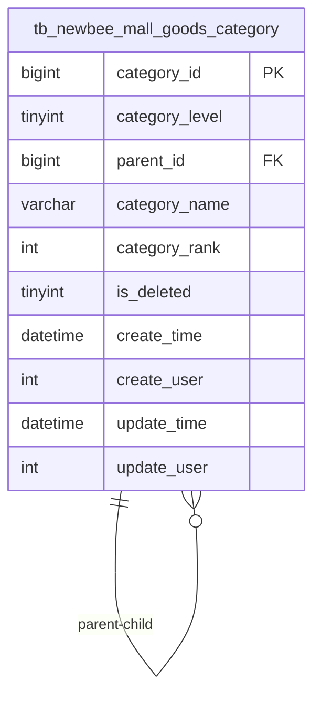
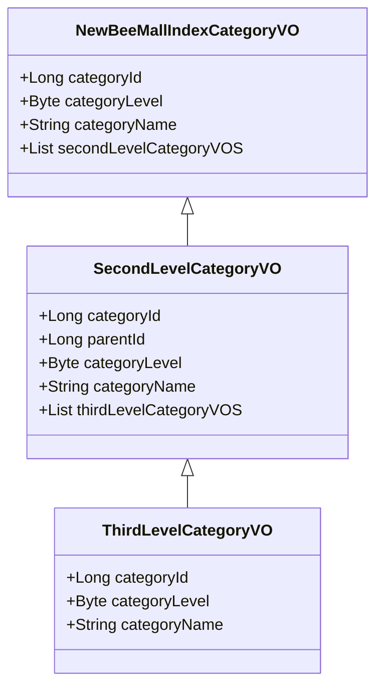
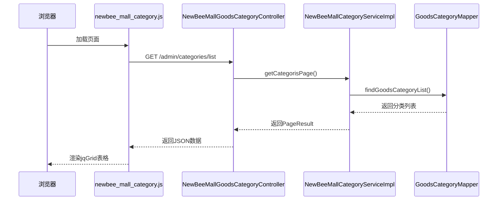

# 商品分类管理

<cite>
**本文档引用文件**  
- [GoodsCategory.java](file://src/main/java/ltd/newbee/mall/entity/GoodsCategory.java)
- [NewBeeMallCategoryServiceImpl.java](file://src/main/java/ltd/newbee/mall/service/impl/NewBeeMallCategoryServiceImpl.java)
- [GoodsCategoryMapper.xml](file://src/main/resources/mapper/GoodsCategoryMapper.xml)
- [NewBeeMallGoodsCategoryController.java](file://src/main/java/ltd/newbee/mall/controller/admin/NewBeeMallGoodsCategoryController.java)
- [newbee_mall_category.js](file://src/main/resources/static/admin/dist/js/newbee_mall_category.js)
- [newbee_mall_category.html](file://src/main/resources/templates/admin/newbee_mall_category.html)
- [newbee_mall_schema.sql](file://src/main/resources/newbee_mall_schema.sql)
- [NewBeeMallCategoryLevelEnum.java](file://src/main/java/ltd/newbee/mall/common/NewBeeMallCategoryLevelEnum.java)
- [Constants.java](file://src/main/java/ltd/newbee/mall/common/Constants.java)
- [NewBeeMallIndexCategoryVO.java](file://src/main/java/ltd/newbee/mall/controller/vo/NewBeeMallIndexCategoryVO.java)
- [SecondLevelCategoryVO.java](file://src/main/java/ltd/newbee/mall/controller/vo/SecondLevelCategoryVO.java)
- [ThirdLevelCategoryVO.java](file://src/main/java/ltd/newbee/mall/controller/vo/ThirdLevelCategoryVO.java)
</cite>

## 目录
1. [商品分类实体设计](#商品分类实体设计)
2. [三级分类体系实现机制](#三级分类体系实现机制)
3. [分类树结构构建逻辑](#分类树结构构建逻辑)
4. [首页分类导航VO构建](#首页分类导航vo构建)
5. [前端分类管理功能实现](#前端分类管理功能实现)
6. [分类数据查询SQL执行流程](#分类数据查询sql执行流程)
7. [性能优化建议](#性能优化建议)

## 商品分类实体设计

`GoodsCategory` 实体类是商品分类管理的核心数据模型，通过 `categoryLevel`、`parentId` 和 `categoryRank` 三个关键字段实现了灵活的三级分类体系。

**字段业务含义：**
- **categoryLevel**: 分类级别标识，取值为 1、2、3，分别对应一级、二级、三级分类。该字段通过 `NewBeeMallCategoryLevelEnum` 枚举类进行管理，确保了分类级别的类型安全和可读性。
- **parentId**: 父分类ID，用于建立分类间的层级关系。一级分类的 `parentId` 固定为 0，表示无父级；二级分类的 `parentId` 指向一级分类ID；三级分类的 `parentId` 指向二级分类ID。
- **categoryRank**: 分类排序值，数值越大排序越靠前。该字段用于控制分类在前端页面的显示顺序，是实现分类导航栏有序展示的关键。

**Section sources**
- [GoodsCategory.java](file://src/main/java/ltd/newbee/mall/entity/GoodsCategory.java#L18-L24)
- [NewBeeMallCategoryLevelEnum.java](file://src/main/java/ltd/newbee/mall/common/NewBeeMallCategoryLevelEnum.java#L18-L23)

## 三级分类体系实现机制

系统通过 `GoodsCategory` 实体与数据库表 `tb_newbee_mall_goods_category` 的映射，构建了一个清晰的树形分类结构。该结构遵循严格的层级规则：

1.  **层级约束**：每个分类只能属于一级、二级或三级中的一个级别，由 `categoryLevel` 字段明确标识。
2.  **父子关系**：通过 `parentId` 字段建立从子节点到父节点的引用，形成 `一级分类 -> 二级分类 -> 三级分类` 的单向链路。
3.  **数据完整性**：`is_deleted` 字段实现逻辑删除，避免物理删除导致的层级断裂。

例如，一个典型的分类路径为：`家电 数码 手机 (一级, parentId=0)` -> `手机 (二级, parentId=15)` -> `iPhone 11 (三级, parentId=19)`。



**Diagram sources**
- [GoodsCategory.java](file://src/main/java/ltd/newbee/mall/entity/GoodsCategory.java#L16-L37)
- [newbee_mall_schema.sql](file://src/main/resources/newbee_mall_schema.sql#L76-L86)

## 分类树结构构建逻辑

`NewBeeMallCategoryServiceImpl` 类中的 `selectByLevelAndParentIdsAndNumber` 方法是构建分类树的核心。该方法通过分层查询的方式，高效地组装出完整的分类树。

**方法实现流程：**
1.  **查询一级分类**：调用 `GoodsCategoryMapper.selectByLevelAndParentIdsAndNumber`，传入 `parentIds=[0]` 和 `categoryLevel=1`，获取所有一级分类，并按 `categoryRank` 降序排列。
2.  **查询二级分类**：将上一步获取的一级分类ID列表作为 `parentIds`，传入 `categoryLevel=2`，查询所有二级分类。
3.  **查询三级分类**：将上一步获取的二级分类ID列表作为 `parentIds`，传入 `categoryLevel=3`，查询所有三级分类。

**SQL执行逻辑：**
```sql
SELECT category_id, category_level, parent_id, category_name, category_rank, ...
FROM tb_newbee_mall_goods_category
WHERE parent_id IN (?, ?, ?) -- 由Java代码中的parentIds集合填充
  AND category_level = ?
  AND is_deleted = 0
ORDER BY category_rank DESC;
```

该方法利用了MyBatis的`<foreach>`标签动态生成IN子句，避免了多次数据库查询，显著提升了性能。

**Section sources**
- [NewBeeMallCategoryServiceImpl.java](file://src/main/java/ltd/newbee/mall/service/impl/NewBeeMallCategoryServiceImpl.java#L164-L166)
- [GoodsCategoryMapper.xml](file://src/main/resources/mapper/GoodsCategoryMapper.xml#L63-L77)

## 首页分类导航VO构建

`getCategoriesForIndex` 方法负责为首页构建分类导航数据，其目标是返回一个包含固定数量一级分类及其下所有子分类的VO对象列表。

**构建流程：**
1.  **获取一级分类**：调用 `selectByLevelAndParentIdsAndNumber` 获取最多 `Constants.INDEX_CATEGORY_NUMBER` (默认10个) 的一级分类。
2.  **获取二级分类**：将一级分类ID列表作为参数，获取所有相关的二级分类。
3.  **获取三级分类**：将二级分类ID列表作为参数，获取所有相关的三级分类。
4.  **数据组装**：
    -   使用Java 8 Stream API的 `groupingBy` 将三级分类按 `parentId` 分组，形成 `Map<Long, List<GoodsCategory>>`。
    -   遍历二级分类，从分组Map中取出其对应的三级分类列表，并封装成 `SecondLevelCategoryVO` 对象。
    -   再次使用 `groupingBy` 将 `SecondLevelCategoryVO` 按 `parentId` 分组。
    -   遍历一级分类，从VO分组Map中取出其对应的二级分类VO列表，并封装成 `NewBeeMallIndexCategoryVO` 对象。

最终返回的 `List<NewBeeMallIndexCategoryVO>` 包含了完整的、可用于前端渲染的分类树结构。



**Diagram sources**
- [NewBeeMallIndexCategoryVO.java](file://src/main/java/ltd/newbee/mall/controller/vo/NewBeeMallIndexCategoryVO.java#L19-L25)
- [SecondLevelCategoryVO.java](file://src/main/java/ltd/newbee/mall/controller/vo/SecondLevelCategoryVO.java#L19-L27)
- [ThirdLevelCategoryVO.java](file://src/main/java/ltd/newbee/mall/controller/vo/ThirdLevelCategoryVO.java#L18-L22)
- [NewBeeMallCategoryServiceImpl.java](file://src/main/java/ltd/newbee/mall/service/impl/NewBeeMallCategoryServiceImpl.java#L92-L138)

## 前端分类管理功能实现

前端通过 `newbee_mall_category.html` 页面和 `newbee_mall_category.js` 脚本实现了分类的增删改查和层级管理。

**核心功能实现：**
- **表格渲染**：使用 `jqGrid` 插件渲染分类列表。通过 `url: '/admin/categories/list'` 发起AJAX请求，后端返回分页数据，`jsonReader` 配置指定了数据路径。
- **层级联动选择**：
  - **进入下级**：点击“管理下级”按钮，调用 `categoryManage()` 函数。该函数获取当前选中的分类ID，并通过 `window.location.href` 跳转到下一级分类的管理页面，同时将当前ID作为 `parentId` 传递。
  - **返回上级**：点击“返回上一层”按钮，调用 `categoryBack()` 函数，利用 `backParentId` 参数实现页面回退。
- **排序功能**：`categoryRank` 字段在表格中以“排序值”列展示。用户在添加或编辑分类时可以输入该值，数值越大，在前端展示时排序越靠前。



**Section sources**
- [newbee_mall_category.html](file://src/main/resources/templates/admin/newbee_mall_category.html)
- [newbee_mall_category.js](file://src/main/resources/static/admin/dist/js/newbee_mall_category.js#L5-L39)
- [NewBeeMallGoodsCategoryController.java](file://src/main/java/ltd/newbee/mall/controller/admin/NewBeeMallGoodsCategoryController.java#L57-L65)

## 分类数据查询SQL执行流程

分类数据的查询主要通过 `GoodsCategoryMapper.xml` 中的SQL语句完成，其执行流程如下：

1.  **入口**：前端发起 `/admin/categories/list` 请求。
2.  **参数处理**：`NewBeeMallGoodsCategoryController.list()` 方法接收 `categoryLevel` 和 `parentId` 参数，并将其封装到 `PageQueryUtil` 对象中。
3.  **服务调用**：`NewBeeMallCategoryService.getCategorisPage()` 方法被调用。
4.  **DAO查询**：
    -   `findGoodsCategoryList` SQL语句被执行，根据传入的 `categoryLevel` 和 `parentId` 进行过滤。
    -   查询条件中包含 `and is_deleted = 0`，确保只返回未删除的数据。
    -   结果按 `category_rank desc` 排序。
    -   使用 `limit #{start},#{limit}` 实现分页。
5.  **结果返回**：查询结果被封装成 `PageResult` 对象，最终以JSON格式返回给前端。

**Section sources**
- [GoodsCategoryMapper.xml](file://src/main/resources/mapper/GoodsCategoryMapper.xml#L20-L37)
- [NewBeeMallGoodsCategoryController.java](file://src/main/java/ltd/newbee/mall/controller/admin/NewBeeMallGoodsCategoryController.java#L57-L65)

## 性能优化建议

为了提升分类管理模块的性能，建议采取以下优化措施：

### 索引设计
在 `tb_newbee_mall_goods_category` 表上创建复合索引，以加速核心查询：
```sql
CREATE INDEX idx_level_parent_deleted_rank ON tb_newbee_mall_goods_category 
(category_level, parent_id, is_deleted, category_rank DESC);
```
该索引覆盖了 `findGoodsCategoryList` 和 `selectByLevelAndParentIdsAndNumber` 查询中的所有WHERE和ORDER BY条件，能极大提升查询效率。

### 缓存策略
1.  **Redis缓存**：对于 `getCategoriesForIndex` 方法返回的首页分类导航数据，由于其变更频率较低但访问频率极高，非常适合使用Redis进行缓存。
    -   **缓存键**：`newbee_mall:index:categories`
    -   **缓存策略**：在分类数据发生增删改操作时（`saveCategory`, `updateGoodsCategory`, `deleteBatch`），主动删除该缓存键，实现缓存与数据库的最终一致性。
2.  **本地缓存**：对于 `NewBeeMallCategoryLevelEnum` 这类静态枚举数据，可直接在应用启动时加载到内存中，无需任何外部缓存。

**Section sources**
- [GoodsCategoryMapper.xml](file://src/main/resources/mapper/GoodsCategoryMapper.xml#L20-L37)
- [NewBeeMallCategoryServiceImpl.java](file://src/main/java/ltd/newbee/mall/service/impl/NewBeeMallCategoryServiceImpl.java#L92-L138)
- [newbee_mall_schema.sql](file://src/main/resources/newbee_mall_schema.sql#L76-L86)