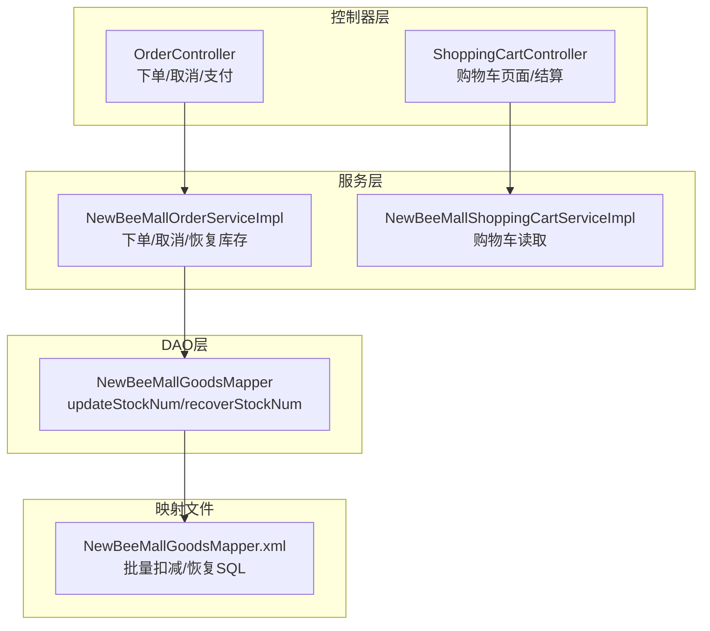
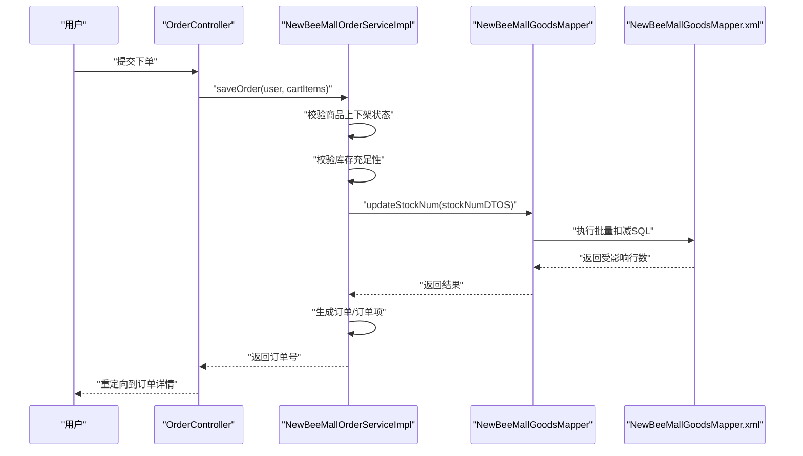
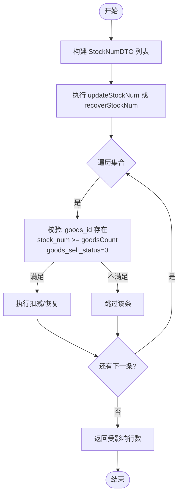
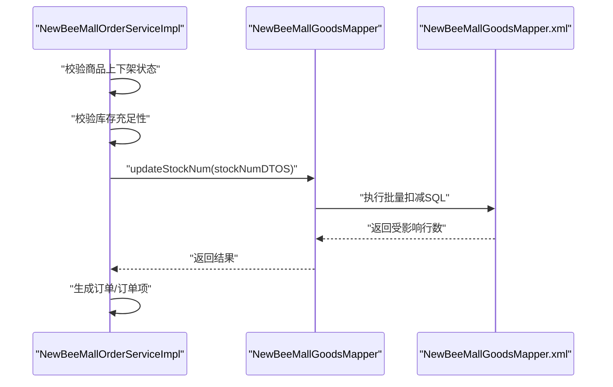
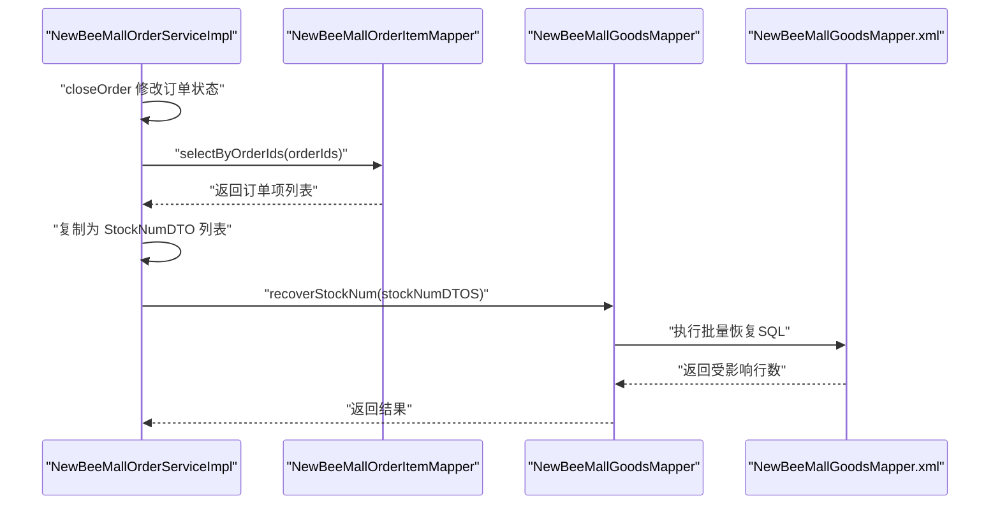
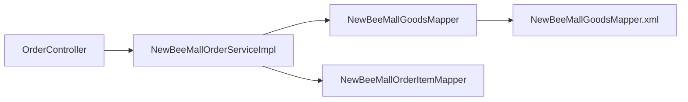

# 商品库存管理

<cite>
**本文引用的文件**
- [StockNumDTO.java](file://src/main/java/ltd/newbee/mall/entity/StockNumDTO.java)
- [NewBeeMallGoodsMapper.java](file://src/main/java/ltd/newbee/mall/dao/NewBeeMallGoodsMapper.java)
- [NewBeeMallGoodsMapper.xml](file://src/main/resources/mapper/NewBeeMallGoodsMapper.xml)
- [NewBeeMallOrderServiceImpl.java](file://src/main/java/ltd/newbee/mall/service/impl/NewBeeMallOrderServiceImpl.java)
- [OrderController.java](file://src/main/java/ltd/newbee/mall/controller/mall/OrderController.java)
- [ShoppingCartController.java](file://src/main/java/ltd/newbee/mall/controller/mall/ShoppingCartController.java)
- [NewBeeMallShoppingCartServiceImpl.java](file://src/main/java/ltd/newbee/mall/service/impl/NewBeeMallShoppingCartServiceImpl.java)
- [Constants.java](file://src/main/java/ltd/newbee/mall/common/Constants.java)
- [BeanUtil.java](file://src/main/java/ltd/newbee/mall/util/BeanUtil.java)
- [NewBeeMallOrderStatusEnum.java](file://src/main/java/ltd/newbee/mall/common/NewBeeMallOrderStatusEnum.java)
- [PayStatusEnum.java](file://src/main/java/ltd/newbee/mall/common/PayStatusEnum.java)
</cite>

## 目录
1. [引言](#引言)
2. [项目结构](#项目结构)
3. [核心组件](#核心组件)
4. [架构总览](#架构总览)
5. [详细组件分析](#详细组件分析)
6. [依赖关系分析](#依赖关系分析)
7. [性能与并发优化](#性能与并发优化)
8. [故障排查指南](#故障排查指南)
9. [结论](#结论)
10. [附录](#附录)

## 引言
本文件围绕商品库存管理机制展开，重点说明以下内容：
- 基于 StockNumDTO 的库存批量变更设计模式
- MyBatis 层 updateStockNum 与 recoverStockNum 的 SQL 实现原理及 @Param 参数传递方式
- 订单创建成功后扣减库存、订单取消后恢复库存的业务流程与一致性保障
- 购物车下单前的库存预校验，防止超卖
- 事务管理策略与高并发场景下的优化建议

## 项目结构
本项目的库存管理涉及控制器、服务层、DAO 层与 XML 映射文件，形成清晰的分层职责：
- 控制器层：负责接收用户请求，调用服务层完成下单、取消等操作
- 服务层：编排业务流程，执行事务控制，协调 DAO 完成库存扣减与恢复
- DAO 层：定义库存变更接口（updateStockNum、recoverStockNum）
- XML 映射：实现批量库存扣减与恢复的 SQL 逻辑

图表来源
- [OrderController.java](file://src/main/java/ltd/newbee/mall/controller/mall/OrderController.java#L67-L83)
- [NewBeeMallOrderServiceImpl.java](file://src/main/java/ltd/newbee/mall/service/impl/NewBeeMallOrderServiceImpl.java#L186-L263)
- [NewBeeMallGoodsMapper.java](file://src/main/java/ltd/newbee/mall/dao/NewBeeMallGoodsMapper.java#L45-L50)
- [NewBeeMallGoodsMapper.xml](file://src/main/resources/mapper/NewBeeMallGoodsMapper.xml#L59-L70)

章节来源
- [OrderController.java](file://src/main/java/ltd/newbee/mall/controller/mall/OrderController.java#L67-L83)
- [ShoppingCartController.java](file://src/main/java/ltd/newbee/mall/controller/mall/ShoppingCartController.java#L107-L128)
- [NewBeeMallOrderServiceImpl.java](file://src/main/java/ltd/newbee/mall/service/impl/NewBeeMallOrderServiceImpl.java#L186-L263)
- [NewBeeMallGoodsMapper.java](file://src/main/java/ltd/newbee/mall/dao/NewBeeMallGoodsMapper.java#L45-L50)
- [NewBeeMallGoodsMapper.xml](file://src/main/resources/mapper/NewBeeMallGoodsMapper.xml#L59-L70)

## 核心组件
- StockNumDTO：库存批量变更的数据传输对象，包含商品 ID 与扣减数量
- NewBeeMallGoodsMapper：定义库存扣减与恢复的接口方法
- NewBeeMallGoodsMapper.xml：实现批量扣减与恢复的 SQL，包含条件校验
- NewBeeMallOrderServiceImpl：订单服务实现，负责下单时扣减库存、取消时恢复库存
- OrderController：对外暴露下单、取消等接口，驱动服务层执行

章节来源
- [StockNumDTO.java](file://src/main/java/ltd/newbee/mall/entity/StockNumDTO.java#L14-L34)
- [NewBeeMallGoodsMapper.java](file://src/main/java/ltd/newbee/mall/dao/NewBeeMallGoodsMapper.java#L45-L50)
- [NewBeeMallGoodsMapper.xml](file://src/main/resources/mapper/NewBeeMallGoodsMapper.xml#L59-L70)
- [NewBeeMallOrderServiceImpl.java](file://src/main/java/ltd/newbee/mall/service/impl/NewBeeMallOrderServiceImpl.java#L186-L263)

## 架构总览
下面的序列图展示了“下单成功扣减库存”的完整流程，包括购物车预校验、库存扣减与订单落库。

图表来源
- [OrderController.java](file://src/main/java/ltd/newbee/mall/controller/mall/OrderController.java#L67-L83)
- [NewBeeMallOrderServiceImpl.java](file://src/main/java/ltd/newbee/mall/service/impl/NewBeeMallOrderServiceImpl.java#L186-L263)
- [NewBeeMallGoodsMapper.java](file://src/main/java/ltd/newbee/mall/dao/NewBeeMallGoodsMapper.java#L45-L50)
- [NewBeeMallGoodsMapper.xml](file://src/main/resources/mapper/NewBeeMallGoodsMapper.xml#L59-L64)

## 详细组件分析

### StockNumDTO 数据传输对象
- 字段含义
  - goodsId：商品 ID
  - goodsCount：扣减数量
- 作用
  - 作为批量库存扣减/恢复的载体，便于服务层构造 List 并传入 DAO 接口
- 复杂度
  - DTO 本身为简单对象，构造与拷贝开销极低

章节来源
- [StockNumDTO.java](file://src/main/java/ltd/newbee/mall/entity/StockNumDTO.java#L14-L34)

### NewBeeMallGoodsMapper 接口与 @Param 注解
- 方法
  - updateStockNum(@Param("stockNumDTOS") List<StockNumDTO>)：批量扣减库存
  - recoverStockNum(@Param("stockNumDTOS") List<StockNumDTO>)：批量恢复库存
- 参数传递
  - 使用 @Param 将集合参数命名为 stockNumDTOS，MyBatis 在 XML 中通过该名称引用集合元素
- 批量处理
  - 通过 foreach 遍历集合，逐条执行 SQL 更新

章节来源
- [NewBeeMallGoodsMapper.java](file://src/main/java/ltd/newbee/mall/dao/NewBeeMallGoodsMapper.java#L45-L50)

### SQL 实现原理（NewBeeMallGoodsMapper.xml）
- updateStockNum
  - 对每一条 StockNumDTO，执行 stock_num = stock_num - goodsCount
  - 条件：goods_id 匹配、stock_num >= goodsCount、商品销售状态为上架（0）
  - 结果：仅当满足条件的记录被更新，返回受影响行数
- recoverStockNum
  - 与扣减逻辑类似，但为加回库存
  - 同样包含库存与状态校验条件
- 性能与一致性
  - 条件校验确保不会出现负库存与对下架商品的误操作
  - foreach 逐条更新，保证原子性与可见性

图表来源
- [NewBeeMallGoodsMapper.xml](file://src/main/resources/mapper/NewBeeMallGoodsMapper.xml#L59-L70)

章节来源
- [NewBeeMallGoodsMapper.xml](file://src/main/resources/mapper/NewBeeMallGoodsMapper.xml#L59-L70)

### 订单创建成功后的库存扣减流程
- 关键步骤
  - 从购物车读取商品清单
  - 校验商品是否上架（SELL_STATUS_UP）
  - 校验每种商品库存是否足够
  - 删除购物车项
  - 将购物车项转换为 StockNumDTO 列表
  - 调用 updateStockNum，若受影响行数小于 1，抛出异常
  - 生成订单与订单项
- 事务特性
  - saveOrder 方法标注 @Transactional，确保扣减库存与订单落库在同一个事务内
  - 若任一步骤失败，事务回滚，库存不会被扣减

图表来源
- [NewBeeMallOrderServiceImpl.java](file://src/main/java/ltd/newbee/mall/service/impl/NewBeeMallOrderServiceImpl.java#L186-L263)
- [NewBeeMallGoodsMapper.java](file://src/main/java/ltd/newbee/mall/dao/NewBeeMallGoodsMapper.java#L45-L50)
- [NewBeeMallGoodsMapper.xml](file://src/main/resources/mapper/NewBeeMallGoodsMapper.xml#L59-L64)

章节来源
- [NewBeeMallOrderServiceImpl.java](file://src/main/java/ltd/newbee/mall/service/impl/NewBeeMallOrderServiceImpl.java#L186-L263)

### 订单取消后的库存恢复流程
- 关键步骤
  - 调用 closeOrder 修改订单状态
  - 调用 recoverStockNum：查询订单项，将订单项转换为 StockNumDTO 列表，执行恢复
  - 事务保证：取消与恢复在同一事务内
- 异常处理
  - 若恢复库存受影响行数小于 1，抛出异常并回滚

图表来源
- [NewBeeMallOrderServiceImpl.java](file://src/main/java/ltd/newbee/mall/service/impl/NewBeeMallOrderServiceImpl.java#L326-L349)
- [NewBeeMallOrderServiceImpl.java](file://src/main/java/ltd/newbee/mall/service/impl/NewBeeMallOrderServiceImpl.java#L410-L429)
- [NewBeeMallGoodsMapper.java](file://src/main/java/ltd/newbee/mall/dao/NewBeeMallGoodsMapper.java#L45-L50)
- [NewBeeMallGoodsMapper.xml](file://src/main/resources/mapper/NewBeeMallGoodsMapper.xml#L65-L70)

章节来源
- [NewBeeMallOrderServiceImpl.java](file://src/main/java/ltd/newbee/mall/service/impl/NewBeeMallOrderServiceImpl.java#L326-L349)
- [NewBeeMallOrderServiceImpl.java](file://src/main/java/ltd/newbee/mall/service/impl/NewBeeMallOrderServiceImpl.java#L410-L429)

### 购物车模块的库存预校验
- 下单前校验
  - 从购物车读取商品清单
  - 校验商品是否上架（SELL_STATUS_UP）
  - 校验每种商品库存是否足够（数量 <= stock_num）
- 超卖防护
  - 若任一商品库存不足，直接抛出异常，阻止下单
- 限制与边界
  - 购物车单项上限与总量上限由 Constants 控制

章节来源
- [NewBeeMallOrderServiceImpl.java](file://src/main/java/ltd/newbee/mall/service/impl/NewBeeMallOrderServiceImpl.java#L186-L210)
- [Constants.java](file://src/main/java/ltd/newbee/mall/common/Constants.java#L32-L35)

### @Param 注解与复杂参数列表传递
- 作用
  - 将 List<StockNumDTO> 以 stockNumDTOS 名称传入 XML
- 使用方式
  - Mapper 接口方法使用 @Param("stockNumDTOS")
  - XML 中通过 collection="stockNumDTOS" 引用集合
- 影响
  - 支持 foreach 遍历，实现批量更新

章节来源
- [NewBeeMallGoodsMapper.java](file://src/main/java/ltd/newbee/mall/dao/NewBeeMallGoodsMapper.java#L45-L50)
- [NewBeeMallGoodsMapper.xml](file://src/main/resources/mapper/NewBeeMallGoodsMapper.xml#L59-L70)

### BeanUtil 工具在库存批量操作中的应用
- 用途
  - 将购物车项或订单项列表复制为 StockNumDTO 列表，便于传入 updateStockNum/recoverStockNum
- 行为
  - 提供 copyList 方法，支持泛型与回调扩展

章节来源
- [BeanUtil.java](file://src/main/java/ltd/newbee/mall/util/BeanUtil.java#L22-L45)
- [NewBeeMallOrderServiceImpl.java](file://src/main/java/ltd/newbee/mall/service/impl/NewBeeMallOrderServiceImpl.java#L214-L219)
- [NewBeeMallOrderServiceImpl.java](file://src/main/java/ltd/newbee/mall/service/impl/NewBeeMallOrderServiceImpl.java#L418-L421)

## 依赖关系分析
- 组件耦合
  - OrderController 依赖 NewBeeMallOrderService
  - NewBeeMallOrderServiceImpl 依赖 NewBeeMallGoodsMapper 与订单项 Mapper
  - NewBeeMallGoodsMapper 依赖 NewBeeMallGoodsMapper.xml
- 关键依赖链
  - 下单路径：OrderController -> NewBeeMallOrderServiceImpl -> NewBeeMallGoodsMapper -> NewBeeMallGoodsMapper.xml
  - 取消路径：NewBeeMallOrderServiceImpl -> NewBeeMallOrderItemMapper -> NewBeeMallGoodsMapper -> NewBeeMallGoodsMapper.xml

图表来源
- [OrderController.java](file://src/main/java/ltd/newbee/mall/controller/mall/OrderController.java#L67-L83)
- [NewBeeMallOrderServiceImpl.java](file://src/main/java/ltd/newbee/mall/service/impl/NewBeeMallOrderServiceImpl.java#L186-L263)
- [NewBeeMallGoodsMapper.java](file://src/main/java/ltd/newbee/mall/dao/NewBeeMallGoodsMapper.java#L45-L50)
- [NewBeeMallGoodsMapper.xml](file://src/main/resources/mapper/NewBeeMallGoodsMapper.xml#L59-L70)

章节来源
- [OrderController.java](file://src/main/java/ltd/newbee/mall/controller/mall/OrderController.java#L67-L83)
- [NewBeeMallOrderServiceImpl.java](file://src/main/java/ltd/newbee/mall/service/impl/NewBeeMallOrderServiceImpl.java#L186-L263)
- [NewBeeMallGoodsMapper.java](file://src/main/java/ltd/newbee/mall/dao/NewBeeMallGoodsMapper.java#L45-L50)
- [NewBeeMallGoodsMapper.xml](file://src/main/resources/mapper/NewBeeMallGoodsMapper.xml#L59-L70)

## 性能与并发优化
- 当前实现特点
  - 扣减与恢复均通过 foreach 逐条更新，SQL 内部带条件校验，避免负库存与对下架商品操作
  - 事务包裹下单与取消流程，保证一致性
- 潜在瓶颈
  - foreach 逐条更新在商品种类较多时可能产生多条写入，存在锁竞争与日志放大
- 优化建议
  - 批量更新策略
    - 使用 CASE WHEN 或一次性多值 INSERT/UPDATE，减少往返次数
    - 在事务内合并更新语句，降低锁粒度与冲突概率
  - 锁与隔离
    - 使用数据库行级锁（如 SELECT ... FOR UPDATE）在扣减前锁定商品记录
    - 适当提升事务隔离级别，减少幻读与脏读风险
  - 缓存与预热
    - 对热销商品库存进行缓存预热，减少热点商品的数据库压力
  - 分布式锁
    - 在高并发场景引入分布式锁，确保同一商品的并发扣减原子性
  - 异步补偿
    - 对于失败的库存恢复，采用异步补偿任务，定期重试修复

[本节为通用性能建议，不直接分析具体代码文件]

## 故障排查指南
- 常见问题定位
  - 下单失败：检查购物车预校验是否通过（上下架状态、库存充足）
  - 库存未扣减：确认受影响行数是否为 1；核对 SQL 条件（库存、销售状态）
  - 取消订单后库存未恢复：确认 recoverStockNum 是否被调用，受影响行数是否为 1
- 关键断点
  - saveOrder 中 updateStockNum 返回值判断
  - cancelOrder 与 closeOrder 中 recoverStockNum 的调用
- 订单状态枚举参考
  - 订单状态与支付状态枚举用于判断业务前置条件

章节来源
- [NewBeeMallOrderServiceImpl.java](file://src/main/java/ltd/newbee/mall/service/impl/NewBeeMallOrderServiceImpl.java#L214-L219)
- [NewBeeMallOrderServiceImpl.java](file://src/main/java/ltd/newbee/mall/service/impl/NewBeeMallOrderServiceImpl.java#L326-L349)
- [NewBeeMallOrderServiceImpl.java](file://src/main/java/ltd/newbee/mall/service/impl/NewBeeMallOrderServiceImpl.java#L410-L429)
- [NewBeeMallOrderStatusEnum.java](file://src/main/java/ltd/newbee/mall/common/NewBeeMallOrderStatusEnum.java#L18-L30)
- [PayStatusEnum.java](file://src/main/java/ltd/newbee/mall/common/PayStatusEnum.java#L18-L24)

## 结论
- 本系统通过 StockNumDTO 与 MyBatis 批量更新实现了高效的库存扣减与恢复
- 事务包裹下单与取消流程，配合 SQL 条件校验，有效避免超卖与对下架商品的操作
- 购物车下单前的预校验进一步增强了前端体验与后端一致性
- 高并发场景建议引入批量更新、行级锁、缓存与分布式锁等优化手段，持续提升系统稳定性与吞吐量

[本节为总结性内容，不直接分析具体代码文件]

## 附录
- 相关常量
  - 上下架状态常量：SELL_STATUS_UP、SELL_STATUS_DOWN
  - 购物车限制：单项上限、总量上限
- 订单状态与支付状态枚举
  - 订单状态枚举：ORDER_PRE_PAY、ORDER_PAID、ORDER_PACKAGED、ORDER_EXPRESS、ORDER_SUCCESS、ORDER_CLOSED_BY_MALLUSER、ORDER_CLOSED_BY_EXPIRED、ORDER_CLOSED_BY_JUDGE
  - 支付状态枚举：PAY_ING、PAY_SUCCESS

章节来源
- [Constants.java](file://src/main/java/ltd/newbee/mall/common/Constants.java#L44-L47)
- [NewBeeMallOrderStatusEnum.java](file://src/main/java/ltd/newbee/mall/common/NewBeeMallOrderStatusEnum.java#L18-L30)
- [PayStatusEnum.java](file://src/main/java/ltd/newbee/mall/common/PayStatusEnum.java#L18-L24)