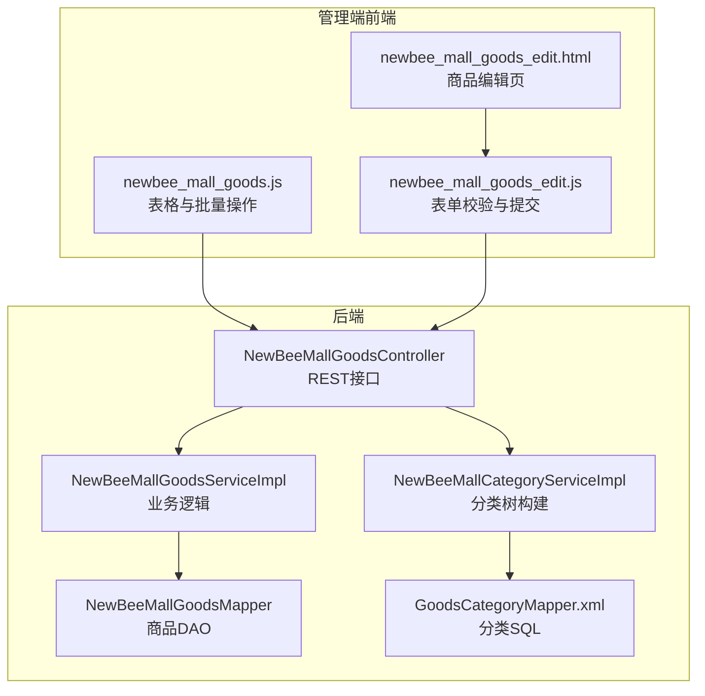
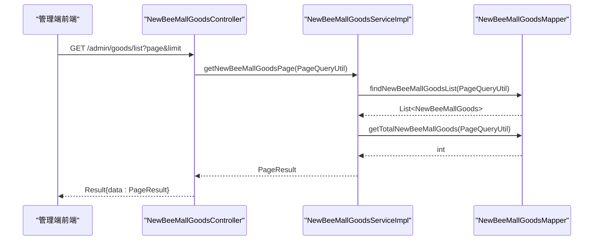
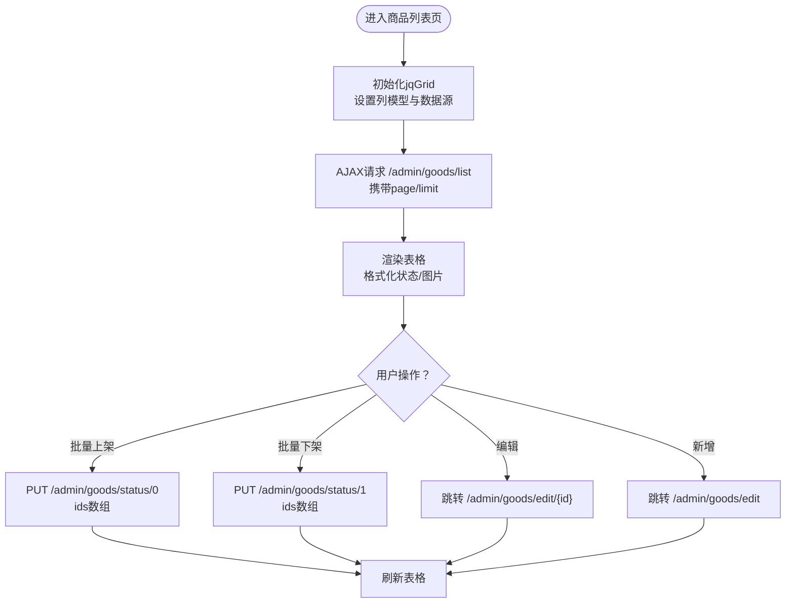
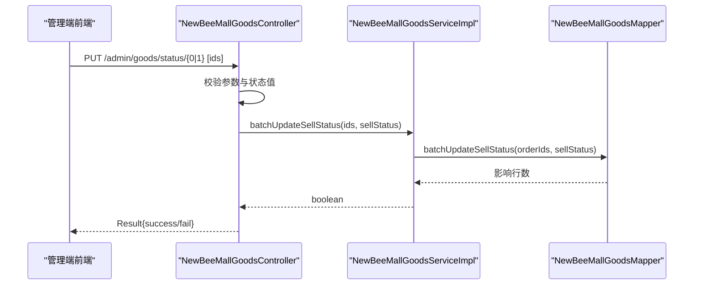
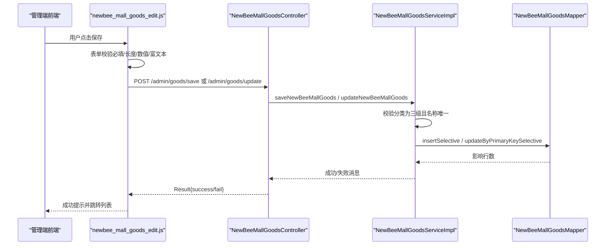
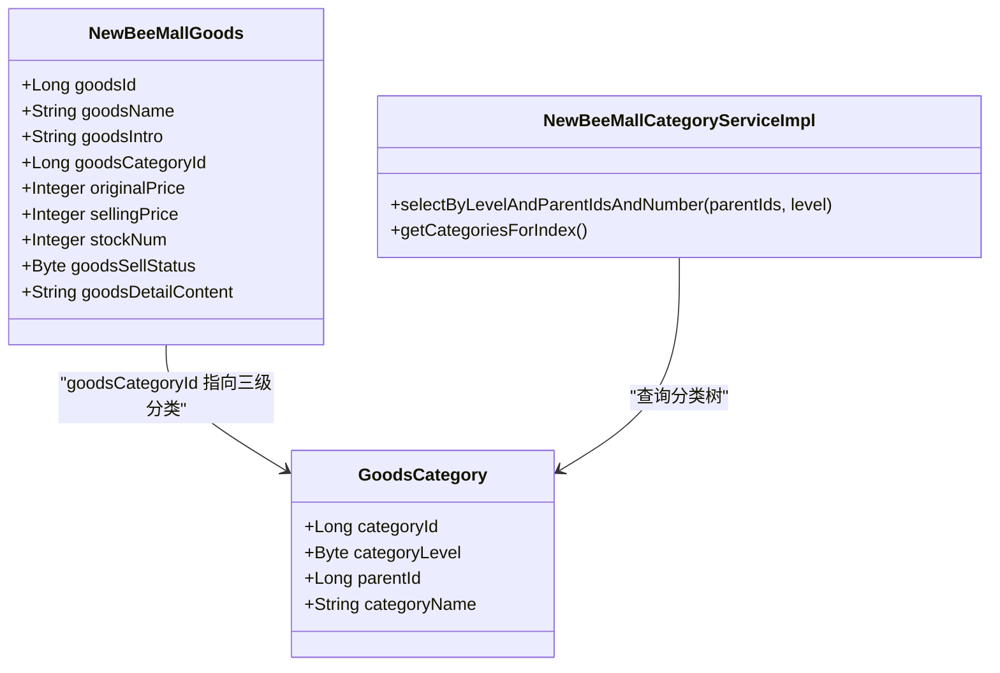
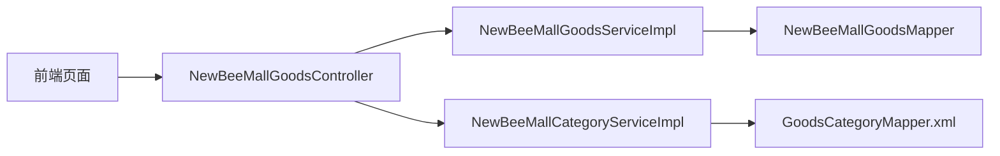

# 商品管理功能

<cite>
**本文引用的文件**
- [NewBeeMallGoodsController.java](file://src/main/java/ltd/newbee/mall/controller/admin/NewBeeMallGoodsController.java)
- [NewBeeMallGoodsServiceImpl.java](file://src/main/java/ltd/newbee/mall/service/impl/NewBeeMallGoodsServiceImpl.java)
- [NewBeeMallCategoryServiceImpl.java](file://src/main/java/ltd/newbee/mall/service/impl/NewBeeMallCategoryServiceImpl.java)
- [NewBeeMallGoods.java](file://src/main/java/ltd/newbee/mall/entity/NewBeeMallGoods.java)
- [NewBeeMallGoodsMapper.java](file://src/main/java/ltd/newbee/mall/dao/NewBeeMallGoodsMapper.java)
- [GoodsCategoryMapper.xml](file://src/main/resources/mapper/GoodsCategoryMapper.xml)
- [newbee_mall_goods.js](file://src/main/resources/static/admin/dist/js/newbee_mall_goods.js)
- [newbee_mall_goods_edit.html](file://src/main/resources/templates/admin/newbee_mall_goods_edit.html)
- [newbee_mall_goods_edit.js](file://src/main/resources/static/admin/dist/js/newbee_mall_goods_edit.js)
- [Constants.java](file://src/main/java/ltd/newbee/mall/common/Constants.java)
- [NewBeeMallCategoryLevelEnum.java](file://src/main/java/ltd/newbee/mall/common/NewBeeMallCategoryLevelEnum.java)
</cite>

## 目录
1. [引言](#引言)
2. [项目结构](#项目结构)
3. [核心组件](#核心组件)
4. [架构总览](#架构总览)
5. [详细组件分析](#详细组件分析)
6. [依赖关系分析](#依赖关系分析)
7. [性能考虑](#性能考虑)
8. [故障排查指南](#故障排查指南)
9. [结论](#结论)

## 引言
本文件围绕商品管理模块的完整实现进行深入解析，覆盖以下目标：
- 商品列表分页查询与表格交互
- 商品上下架操作（基于销售状态字段）
- 商品详情编辑流程与表单校验
- 商品与分类的关联关系与三级分类树构建
- 关键实体字段的业务含义
- 前端页面交互与提交逻辑
- 商品状态转换流程图与性能优化建议

## 项目结构
商品管理模块位于后端控制器、服务层、DAO 层与前端静态资源模板之间，形成清晰的 MVC 分层与职责划分。Admin 管理端通过控制器暴露 REST 接口，服务层负责业务规则与数据校验，DAO 层负责数据库访问，前端使用 jqGrid 展示表格、SweetAlert 提示与富文本编辑器完成表单交互。

图表来源
- [NewBeeMallGoodsController.java](file://src/main/java/ltd/newbee/mall/controller/admin/NewBeeMallGoodsController.java#L1-L228)
- [NewBeeMallGoodsServiceImpl.java](file://src/main/java/ltd/newbee/mall/service/impl/NewBeeMallGoodsServiceImpl.java#L1-L139)
- [NewBeeMallCategoryServiceImpl.java](file://src/main/java/ltd/newbee/mall/service/impl/NewBeeMallCategoryServiceImpl.java#L1-L168)
- [NewBeeMallGoodsMapper.java](file://src/main/java/ltd/newbee/mall/dao/NewBeeMallGoodsMapper.java#L1-L53)
- [GoodsCategoryMapper.xml](file://src/main/resources/mapper/GoodsCategoryMapper.xml#L1-L212)
- [newbee_mall_goods.js](file://src/main/resources/static/admin/dist/js/newbee_mall_goods.js#L1-L181)
- [newbee_mall_goods_edit.html](file://src/main/resources/templates/admin/newbee_mall_goods_edit.html#L1-L174)
- [newbee_mall_goods_edit.js](file://src/main/resources/static/admin/dist/js/newbee_mall_goods_edit.js#L1-L358)

章节来源
- [NewBeeMallGoodsController.java](file://src/main/java/ltd/newbee/mall/controller/admin/NewBeeMallGoodsController.java#L1-L228)
- [newbee_mall_goods.js](file://src/main/resources/static/admin/dist/js/newbee_mall_goods.js#L1-L181)

## 核心组件
- 控制器：处理商品列表、新增、修改、详情、批量上下架等请求，负责参数校验与结果封装。
- 服务层：
  - 商品服务：分页查询、保存/更新、批量上下架、按条件搜索。
  - 分类服务：按层级与父级 ID 查询分类，构建三级分类树供前端选择。
- 实体与DAO：商品实体定义关键字段；商品DAO提供分页查询、统计、批量更新等 SQL 映射。
- 前端：jqGrid 表格展示与交互，SweetAlert 提示，富文本编辑器与图片上传插件。

章节来源
- [NewBeeMallGoodsController.java](file://src/main/java/ltd/newbee/mall/controller/admin/NewBeeMallGoodsController.java#L132-L228)
- [NewBeeMallGoodsServiceImpl.java](file://src/main/java/ltd/newbee/mall/service/impl/NewBeeMallGoodsServiceImpl.java#L1-L139)
- [NewBeeMallCategoryServiceImpl.java](file://src/main/java/ltd/newbee/mall/service/impl/NewBeeMallCategoryServiceImpl.java#L91-L167)
- [NewBeeMallGoods.java](file://src/main/java/ltd/newbee/mall/entity/NewBeeMallGoods.java#L1-L202)
- [NewBeeMallGoodsMapper.java](file://src/main/java/ltd/newbee/mall/dao/NewBeeMallGoodsMapper.java#L1-L53)

## 架构总览
商品管理采用典型的 Spring MVC + MyBatis 架构：
- 控制器接收请求，调用服务层执行业务逻辑。
- 服务层对输入参数进行校验，访问 DAO 完成数据库操作。
- DAO 使用 XML 映射文件执行 SQL，返回结果。
- 前端通过 AJAX 与控制器交互，使用 jqGrid 渲染表格，SweetAlert 给出反馈。

图表来源
- [NewBeeMallGoodsController.java](file://src/main/java/ltd/newbee/mall/controller/admin/NewBeeMallGoodsController.java#L132-L143)
- [NewBeeMallGoodsServiceImpl.java](file://src/main/java/ltd/newbee/mall/service/impl/NewBeeMallGoodsServiceImpl.java#L41-L46)
- [NewBeeMallGoodsMapper.java](file://src/main/java/ltd/newbee/mall/dao/NewBeeMallGoodsMapper.java#L35-L40)

## 详细组件分析

### 商品列表分页查询与表格交互
- 后端：
  - 控制器接收 page、limit 参数，构造 PageQueryUtil 并调用服务层分页查询。
  - 服务层查询商品列表与总数，封装为 PageResult 返回。
- 前端：
  - jqGrid 初始化列模型，绑定 /admin/goods/list 获取数据。
  - 支持多选、分页、行内状态与封面图格式化。
  - 提供“添加”“编辑”“批量上架/下架”等交互入口。

图表来源
- [newbee_mall_goods.js](file://src/main/resources/static/admin/dist/js/newbee_mall_goods.js#L1-L181)
- [NewBeeMallGoodsController.java](file://src/main/java/ltd/newbee/mall/controller/admin/NewBeeMallGoodsController.java#L132-L143)

章节来源
- [NewBeeMallGoodsController.java](file://src/main/java/ltd/newbee/mall/controller/admin/NewBeeMallGoodsController.java#L132-L143)
- [newbee_mall_goods.js](file://src/main/resources/static/admin/dist/js/newbee_mall_goods.js#L1-L181)

### 商品上下架操作（销售状态字段）
- 销售状态字段：goodsSellStatus（0-上架，1-下架），由常量定义。
- 控制器：
  - PUT /admin/goods/status/{sellStatus} 接收 ids 数组与 sellStatus。
  - 校验 sellStatus 是否为 0 或 1。
  - 调用服务层批量更新销售状态。
- 服务层：
  - 调用 DAO 的批量更新 SQL，返回是否成功。
- 前端：
  - 通过 SweetAlert 确认弹窗，成功后刷新表格。

图表来源
- [NewBeeMallGoodsController.java](file://src/main/java/ltd/newbee/mall/controller/admin/NewBeeMallGoodsController.java#L210-L227)
- [NewBeeMallGoodsServiceImpl.java](file://src/main/java/ltd/newbee/mall/service/impl/NewBeeMallGoodsServiceImpl.java#L110-L112)
- [NewBeeMallGoodsMapper.java](file://src/main/java/ltd/newbee/mall/dao/NewBeeMallGoodsMapper.java#L51-L51)
- [Constants.java](file://src/main/java/ltd/newbee/mall/common/Constants.java#L44-L46)

章节来源
- [NewBeeMallGoodsController.java](file://src/main/java/ltd/newbee/mall/controller/admin/NewBeeMallGoodsController.java#L210-L227)
- [NewBeeMallGoodsServiceImpl.java](file://src/main/java/ltd/newbee/mall/service/impl/NewBeeMallGoodsServiceImpl.java#L110-L112)
- [Constants.java](file://src/main/java/ltd/newbee/mall/common/Constants.java#L44-L46)

### 商品详情编辑（新增/修改）
- 编辑页模板：
  - 提供三级分类联动选择（一级→二级→三级）。
  - 表单项包括名称、简介、原价、现价、库存、标签、封面图、富文本详情、上架状态。
- 前端交互：
  - 富文本编辑器集成图片上传与插入。
  - 图片上传插件限制文件类型与大小，并回显到封面图预览。
  - 表单校验包含必填项、长度、数值范围、富文本长度等。
  - 新增与修改使用同一表单，通过 goodsId 区分。
- 控制器：
  - 新增：POST /admin/goods/save，参数校验后调用服务层保存。
  - 修改：POST /admin/goods/update，参数校验后调用服务层更新。
- 服务层：
  - 校验分类必须为三级分类，且商品名称在该分类下唯一。
  - 进行字符串清理与更新时间设置，最终持久化。

图表来源
- [newbee_mall_goods_edit.html](file://src/main/resources/templates/admin/newbee_mall_goods_edit.html#L1-L174)
- [newbee_mall_goods_edit.js](file://src/main/resources/static/admin/dist/js/newbee_mall_goods_edit.js#L1-L358)
- [NewBeeMallGoodsController.java](file://src/main/java/ltd/newbee/mall/controller/admin/NewBeeMallGoodsController.java#L148-L197)
- [NewBeeMallGoodsServiceImpl.java](file://src/main/java/ltd/newbee/mall/service/impl/NewBeeMallGoodsServiceImpl.java#L49-L98)
- [NewBeeMallGoodsMapper.java](file://src/main/java/ltd/newbee/mall/dao/NewBeeMallGoodsMapper.java#L21-L34)

章节来源
- [newbee_mall_goods_edit.html](file://src/main/resources/templates/admin/newbee_mall_goods_edit.html#L1-L174)
- [newbee_mall_goods_edit.js](file://src/main/resources/static/admin/dist/js/newbee_mall_goods_edit.js#L1-L358)
- [NewBeeMallGoodsController.java](file://src/main/java/ltd/newbee/mall/controller/admin/NewBeeMallGoodsController.java#L148-L197)
- [NewBeeMallGoodsServiceImpl.java](file://src/main/java/ltd/newbee/mall/service/impl/NewBeeMallGoodsServiceImpl.java#L49-L98)

### 商品与分类的关联关系与三级分类树
- 关联关系：
  - 商品实体包含 goodsCategoryId 字段，指向三级分类。
  - 控制器在编辑页加载时，会根据商品当前分类回显三级联动的选中值。
- 分类树构建：
  - 分类服务按层级与父级 ID 查询，支持“查询所有”或限定数量。
  - 在首页/搜索场景中，服务层按一级→二级→三级分组构建 VO 树，供前端渲染。
- 前端联动：
  - 编辑页通过 AJAX 请求分类列表，动态填充二级与三级下拉框。

图表来源
- [NewBeeMallGoods.java](file://src/main/java/ltd/newbee/mall/entity/NewBeeMallGoods.java#L1-L202)
- [NewBeeMallCategoryServiceImpl.java](file://src/main/java/ltd/newbee/mall/service/impl/NewBeeMallCategoryServiceImpl.java#L91-L167)
- [GoodsCategoryMapper.xml](file://src/main/resources/mapper/GoodsCategoryMapper.xml#L63-L77)

章节来源
- [NewBeeMallGoods.java](file://src/main/java/ltd/newbee/mall/entity/NewBeeMallGoods.java#L1-L202)
- [NewBeeMallCategoryServiceImpl.java](file://src/main/java/ltd/newbee/mall/service/impl/NewBeeMallCategoryServiceImpl.java#L91-L167)
- [GoodsCategoryMapper.xml](file://src/main/resources/mapper/GoodsCategoryMapper.xml#L63-L77)

### 关键字段业务含义（NewBeeMallGoods）
- goodsName：商品名称，用于展示与检索。
- goodsIntro：商品简介，限制长度并在搜索页截断显示。
- originalPrice：商品原价（单位：分），用于标价对比。
- sellingPrice：商品现价（单位：分），实际售卖价格。
- stockNum：商品库存数量，支持负数（如预售/缺货标记）。
- goodsSellStatus：销售状态（0-上架，1-下架），用于前端展示与筛选。
- goodsDetailContent：富文本详情，支持图片上传与编辑。
- goodsCategoryId：商品所属三级分类 ID，用于分类树与搜索过滤。

章节来源
- [NewBeeMallGoods.java](file://src/main/java/ltd/newbee/mall/entity/NewBeeMallGoods.java#L1-L202)
- [NewBeeMallGoodsServiceImpl.java](file://src/main/java/ltd/newbee/mall/service/impl/NewBeeMallGoodsServiceImpl.java#L115-L137)

### 前端页面交互与表单验证
- 商品列表页：
  - jqGrid 列模型包含商品编号、名称、简介、封面图、库存、售价、状态、创建时间。
  - 状态列与封面图列使用自定义格式化器。
  - 提供批量上架/下架按钮，使用 SweetAlert 确认。
- 商品编辑页：
  - 三级分类联动：一级变化触发二级/三级重载；二级变化触发三级重载。
  - 表单校验：必填、长度、数值范围、富文本长度、封面图非空。
  - 富文本编辑器：支持图片上传与插入，上传地址为 /admin/upload/files。
  - 图片上传插件：限制类型与大小，成功后回显预览。

章节来源
- [newbee_mall_goods.js](file://src/main/resources/static/admin/dist/js/newbee_mall_goods.js#L1-L181)
- [newbee_mall_goods_edit.html](file://src/main/resources/templates/admin/newbee_mall_goods_edit.html#L1-L174)
- [newbee_mall_goods_edit.js](file://src/main/resources/static/admin/dist/js/newbee_mall_goods_edit.js#L1-L358)

## 依赖关系分析
- 控制器依赖服务层接口，服务层依赖 DAO 接口与枚举/常量。
- 分类服务依赖分类 Mapper 的 XML 查询，支持按层级与父级 ID 查询。
- 商品服务依赖商品 Mapper 的分页查询与批量更新。
- 前端依赖 jQuery、jqGrid、SweetAlert、AjaxUpload、wangEditor 等插件。

图表来源
- [NewBeeMallGoodsController.java](file://src/main/java/ltd/newbee/mall/controller/admin/NewBeeMallGoodsController.java#L1-L228)
- [NewBeeMallGoodsServiceImpl.java](file://src/main/java/ltd/newbee/mall/service/impl/NewBeeMallGoodsServiceImpl.java#L1-L139)
- [NewBeeMallCategoryServiceImpl.java](file://src/main/java/ltd/newbee/mall/service/impl/NewBeeMallCategoryServiceImpl.java#L1-L168)
- [NewBeeMallGoodsMapper.java](file://src/main/java/ltd/newbee/mall/dao/NewBeeMallGoodsMapper.java#L1-L53)
- [GoodsCategoryMapper.xml](file://src/main/resources/mapper/GoodsCategoryMapper.xml#L1-L212)

章节来源
- [NewBeeMallGoodsController.java](file://src/main/java/ltd/newbee/mall/controller/admin/NewBeeMallGoodsController.java#L1-L228)
- [NewBeeMallGoodsServiceImpl.java](file://src/main/java/ltd/newbee/mall/service/impl/NewBeeMallGoodsServiceImpl.java#L1-L139)
- [NewBeeMallCategoryServiceImpl.java](file://src/main/java/ltd/newbee/mall/service/impl/NewBeeMallCategoryServiceImpl.java#L1-L168)
- [NewBeeMallGoodsMapper.java](file://src/main/java/ltd/newbee/mall/dao/NewBeeMallGoodsMapper.java#L1-L53)
- [GoodsCategoryMapper.xml](file://src/main/resources/mapper/GoodsCategoryMapper.xml#L1-L212)

## 性能考虑
- 分类缓存策略：
  - 首页与搜索页的分类树构建频繁使用，可引入本地缓存（如 Guava/Caffeine）或 Redis 缓存分类树结果，减少多次分组与查询开销。
  - 缓存键可按“层级+父级ID+数量”组合，避免脏读。
- 数据库索引：
  - 商品表与分类表应确保常用查询字段（如 goodsCategoryId、categoryLevel、parentId）建立合适索引，提升分页与过滤性能。
- 前端渲染优化：
  - jqGrid 大数据量时启用虚拟滚动或服务端分页，避免一次性渲染过多节点。
  - 图片预览与富文本编辑器可延迟加载，减少首屏压力。
- 批量操作：
  - 批量上下架使用一次 SQL 批量更新，避免循环逐条更新带来的网络与事务开销。
- 文本清理与长度限制：
  - 服务层对名称/简介/标签进行清理与长度限制，减少异常数据与数据库写放大。

[本节为通用建议，无需特定文件来源]

## 故障排查指南
- 参数异常：
  - 控制器对必填参数进行校验，若缺失或格式不正确，返回失败结果。
- 销售状态异常：
  - PUT /admin/goods/status 接口仅接受 0/1，其他值将被拒绝。
- 分类非法：
  - 保存/更新商品时，若分类不存在或非三级分类，返回错误。
- 商品重复：
  - 同一分类下商品名称重复将被拦截。
- 前端校验失败：
  - 表单校验失败会弹出 SweetAlert 提示，需修正后再提交。
- 图片上传失败：
  - AjaxUpload 插件限制文件类型与大小，失败时弹出错误提示。

章节来源
- [NewBeeMallGoodsController.java](file://src/main/java/ltd/newbee/mall/controller/admin/NewBeeMallGoodsController.java#L138-L169)
- [NewBeeMallGoodsController.java](file://src/main/java/ltd/newbee/mall/controller/admin/NewBeeMallGoodsController.java#L210-L227)
- [NewBeeMallGoodsServiceImpl.java](file://src/main/java/ltd/newbee/mall/service/impl/NewBeeMallGoodsServiceImpl.java#L49-L98)
- [newbee_mall_goods_edit.js](file://src/main/resources/static/admin/dist/js/newbee_mall_goods_edit.js#L109-L286)

## 结论
商品管理模块通过清晰的分层设计与完善的前后端交互，实现了商品列表分页、批量上下架、详情编辑与分类联动选择。关键在于：
- 控制器严格参数校验与状态约束；
- 服务层在保存/更新时强制三级分类与名称唯一性；
- 前端提供良好的用户体验与强校验；
- 分类树构建与缓存策略可进一步优化性能。