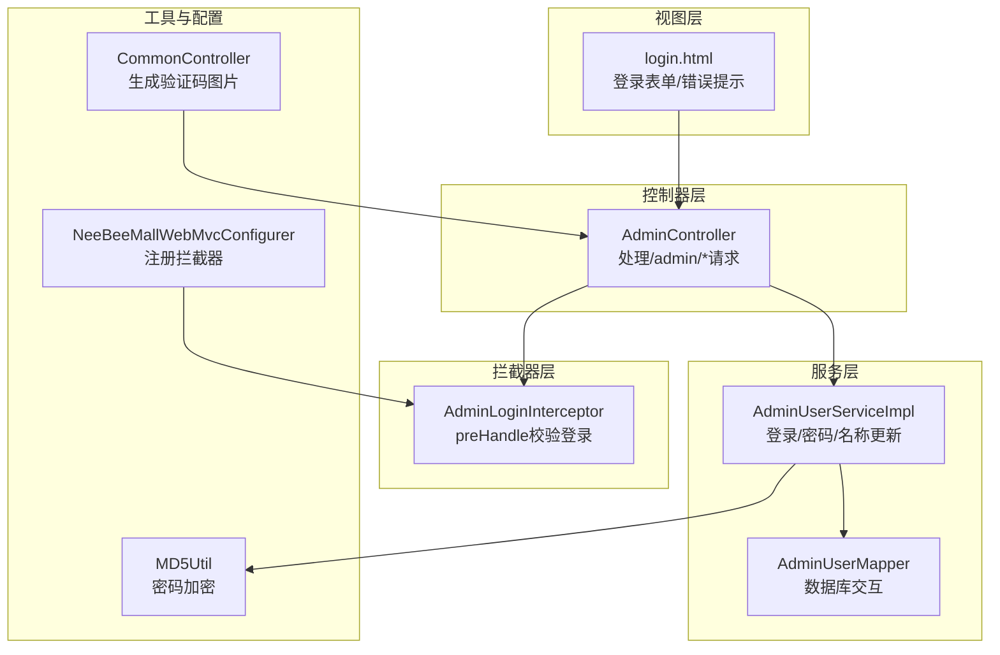
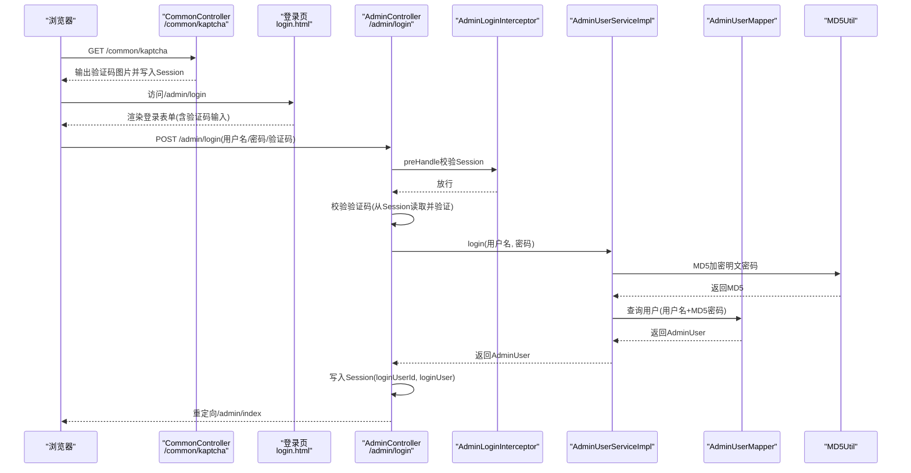
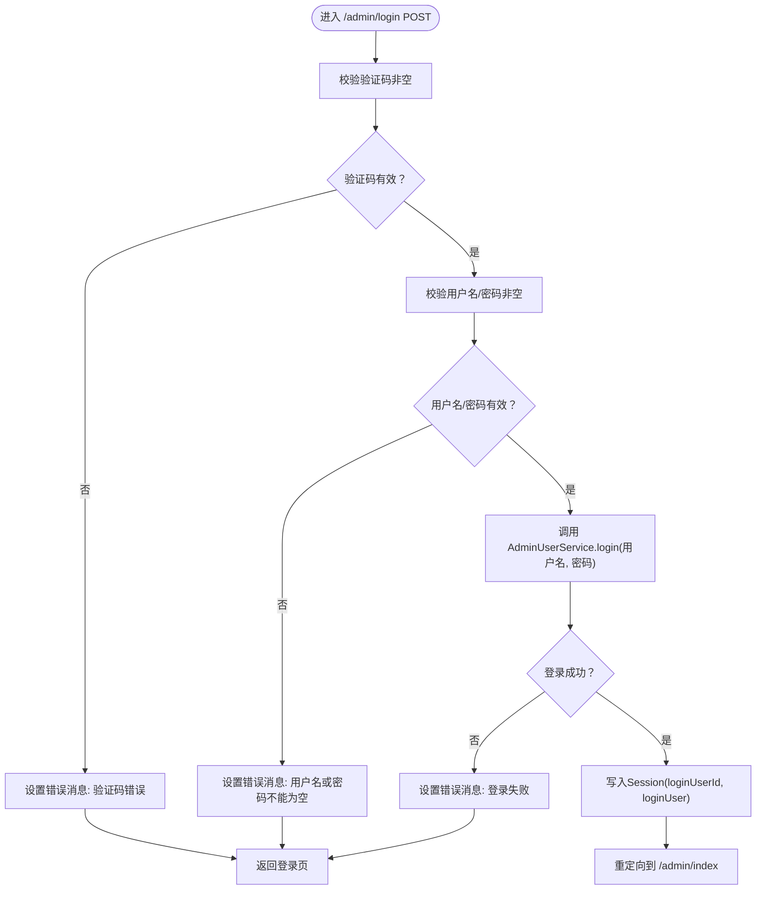
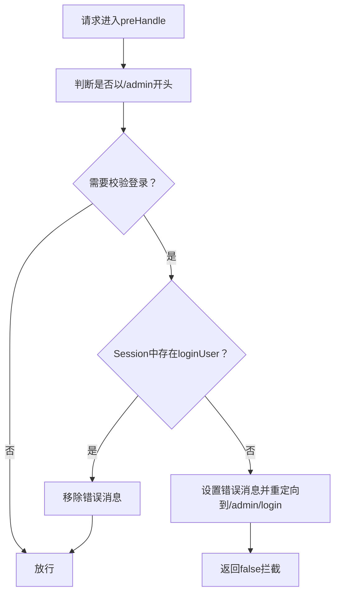
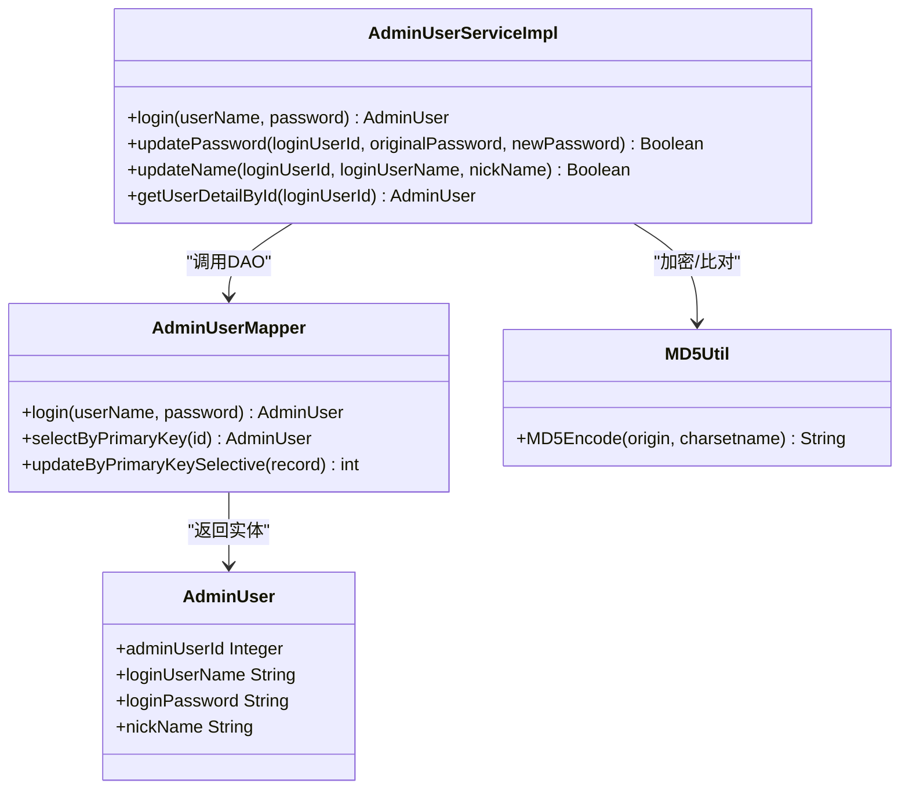
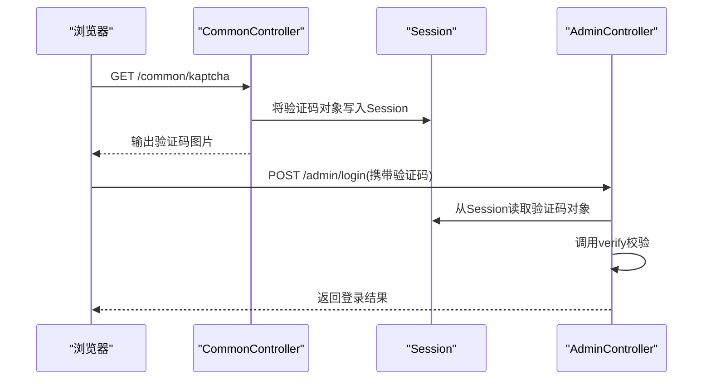
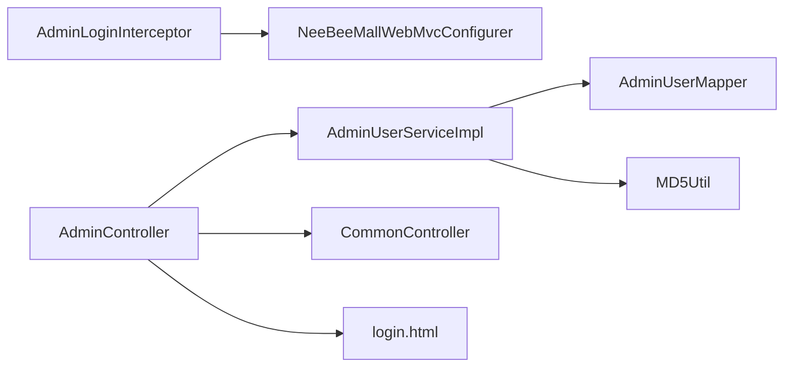

# 管理员认证与会话管理

<cite>
**本文引用的文件**
- [AdminController.java](file://src/main/java/ltd/newbee/mall/controller/admin/AdminController.java)
- [AdminLoginInterceptor.java](file://src/main/java/ltd/newbee/mall/interceptor/AdminLoginInterceptor.java)
- [AdminUserServiceImpl.java](file://src/main/java/ltd/newbee/mall/service/impl/AdminUserServiceImpl.java)
- [AdminUserService.java](file://src/main/java/ltd/newbee/mall/service/AdminUserService.java)
- [AdminUserMapper.java](file://src/main/java/ltd/newbee/mall/dao/AdminUserMapper.java)
- [MD5Util.java](file://src/main/java/ltd/newbee/mall/util/MD5Util.java)
- [CommonController.java](file://src/main/java/ltd/newbee/mall/controller/common/CommonController.java)
- [NeeBeeMallWebMvcConfigurer.java](file://src/main/java/ltd/newbee/mall/config/NeeBeeMallWebMvcConfigurer.java)
- [login.html](file://src/main/resources/templates/admin/login.html)
- [AdminUser.java](file://src/main/java/ltd/newbee/mall/entity/AdminUser.java)
</cite>

## 目录
1. [简介](#简介)
2. [项目结构](#项目结构)
3. [核心组件](#核心组件)
4. [架构总览](#架构总览)
5. [详细组件分析](#详细组件分析)
6. [依赖关系分析](#依赖关系分析)
7. [性能考量](#性能考量)
8. [故障排查指南](#故障排查指南)
9. [结论](#结论)
10. [附录](#附录)

## 简介
本文件围绕新蜂商城后台的管理员登录认证与会话管理机制展开，重点覆盖以下内容：
- AdminController 中 /admin/login 接口的 POST 处理流程：用户名密码验证、验证码校验（ShearCaptcha）、会话创建与重定向。
- AdminLoginInterceptor 拦截器通过 preHandle 实现全局权限控制，拦截未登录请求并重定向至登录页。
- 用户信息在 Session 中的存储结构（loginUserId、loginUser）及登出时的会话清理逻辑。
- 结合 AdminUserServiceImpl 服务层，说明密码加密（MD5Util）与比对过程。
- 登录失败常见原因分析（如验证码错误、账号不存在）及解决方案。
- 登录流程时序图与安全最佳实践建议。

## 项目结构
后台认证相关的关键模块分布如下：
- 控制层：Admin 控制器负责登录页面渲染、登录提交处理、登出、个人信息维护等。
- 拦截器：AdminLoginInterceptor 对 /admin/** 路径进行统一登录校验。
- 服务层：AdminUserService 接口与 AdminUserServiceImpl 实现登录、密码更新、名称更新等业务。
- 数据访问层：AdminUserMapper 提供登录查询与用户信息更新。
- 工具类：MD5Util 提供密码加密工具。
- 公共验证码：CommonController 生成并输出验证码图片，并将验证码对象放入 Session。
- 配置：NeeBeeMallWebMvcConfigurer 注册拦截器并排除静态资源与登录页。
- 视图：Thymeleaf 模板 login.html 展示登录表单与错误提示。

图表来源
- [AdminController.java](file://src/main/java/ltd/newbee/mall/controller/admin/AdminController.java#L37-L83)
- [AdminLoginInterceptor.java](file://src/main/java/ltd/newbee/mall/interceptor/AdminLoginInterceptor.java#L26-L40)
- [AdminUserServiceImpl.java](file://src/main/java/ltd/newbee/mall/service/impl/AdminUserServiceImpl.java#L25-L30)
- [AdminUserMapper.java](file://src/main/java/ltd/newbee/mall/dao/AdminUserMapper.java#L19-L33)
- [MD5Util.java](file://src/main/java/ltd/newbee/mall/util/MD5Util.java#L30-L44)
- [CommonController.java](file://src/main/java/ltd/newbee/mall/controller/common/CommonController.java#L29-L43)
- [NeeBeeMallWebMvcConfigurer.java](file://src/main/java/ltd/newbee/mall/config/NeeBeeMallWebMvcConfigurer.java#L31-L40)
- [login.html](file://src/main/resources/templates/admin/login.html#L44-L76)

章节来源
- [AdminController.java](file://src/main/java/ltd/newbee/mall/controller/admin/AdminController.java#L37-L83)
- [AdminLoginInterceptor.java](file://src/main/java/ltd/newbee/mall/interceptor/AdminLoginInterceptor.java#L26-L40)
- [AdminUserServiceImpl.java](file://src/main/java/ltd/newbee/mall/service/impl/AdminUserServiceImpl.java#L25-L30)
- [AdminUserMapper.java](file://src/main/java/ltd/newbee/mall/dao/AdminUserMapper.java#L19-L33)
- [MD5Util.java](file://src/main/java/ltd/newbee/mall/util/MD5Util.java#L30-L44)
- [CommonController.java](file://src/main/java/ltd/newbee/mall/controller/common/CommonController.java#L29-L43)
- [NeeBeeMallWebMvcConfigurer.java](file://src/main/java/ltd/newbee/mall/config/NeeBeeMallWebMvcConfigurer.java#L31-L40)
- [login.html](file://src/main/resources/templates/admin/login.html#L44-L76)

## 核心组件
- AdminController：负责渲染登录页、处理登录 POST、会话创建、登出清理、个人资料修改等。
- AdminLoginInterceptor：全局拦截 /admin/** 请求，未登录直接重定向到登录页。
- AdminUserServiceImpl：封装登录、密码与名称更新逻辑，调用 MD5Util 进行密码加密与比对。
- AdminUserMapper：提供登录查询与用户信息更新的持久化操作。
- CommonController：生成验证码图片并将验证码对象写入 Session，供登录页使用。
- NeeBeeMallWebMvcConfigurer：注册拦截器并排除登录页与静态资源。
- login.html：登录表单模板，展示错误消息并加载验证码图片。

章节来源
- [AdminController.java](file://src/main/java/ltd/newbee/mall/controller/admin/AdminController.java#L37-L83)
- [AdminLoginInterceptor.java](file://src/main/java/ltd/newbee/mall/interceptor/AdminLoginInterceptor.java#L26-L40)
- [AdminUserServiceImpl.java](file://src/main/java/ltd/newbee/mall/service/impl/AdminUserServiceImpl.java#L25-L30)
- [AdminUserMapper.java](file://src/main/java/ltd/newbee/mall/dao/AdminUserMapper.java#L19-L33)
- [CommonController.java](file://src/main/java/ltd/newbee/mall/controller/common/CommonController.java#L29-L43)
- [NeeBeeMallWebMvcConfigurer.java](file://src/main/java/ltd/newbee/mall/config/NeeBeeMallWebMvcConfigurer.java#L31-L40)
- [login.html](file://src/main/resources/templates/admin/login.html#L44-L76)

## 架构总览
后台认证采用“控制器-拦截器-服务-数据访问-工具”的分层设计，登录流程通过验证码图片生成、Session 存储、服务层加密比对与会话创建完成。

图表来源
- [CommonController.java](file://src/main/java/ltd/newbee/mall/controller/common/CommonController.java#L29-L43)
- [login.html](file://src/main/resources/templates/admin/login.html#L44-L76)
- [AdminController.java](file://src/main/java/ltd/newbee/mall/controller/admin/AdminController.java#L54-L83)
- [AdminLoginInterceptor.java](file://src/main/java/ltd/newbee/mall/interceptor/AdminLoginInterceptor.java#L26-L40)
- [AdminUserServiceImpl.java](file://src/main/java/ltd/newbee/mall/service/impl/AdminUserServiceImpl.java#L25-L30)
- [AdminUserMapper.java](file://src/main/java/ltd/newbee/mall/dao/AdminUserMapper.java#L19-L33)
- [MD5Util.java](file://src/main/java/ltd/newbee/mall/util/MD5Util.java#L30-L44)

## 详细组件分析

### AdminController 登录 POST 流程
- 参数校验：用户名与密码非空校验；验证码非空校验。
- 验证码校验：从 Session 中取出验证码对象，使用 ShearCaptcha 的 verify 方法进行校验。
- 登录调用：调用 AdminUserService.login(用户名, 密码)，返回 AdminUser。
- 会话创建：将用户昵称与主键写入 Session，键名分别为 loginUser 与 loginUserId。
- 成功重定向：重定向到 /admin/index；失败回显错误消息并返回登录页。

图表来源
- [AdminController.java](file://src/main/java/ltd/newbee/mall/controller/admin/AdminController.java#L54-L83)

章节来源
- [AdminController.java](file://src/main/java/ltd/newbee/mall/controller/admin/AdminController.java#L54-L83)

### AdminLoginInterceptor 全局权限控制
- preHandle：当请求路径以 /admin 开头且 Session 中不存在 loginUser 时，设置错误消息并重定向到 /admin/login，返回 false 拦截；否则移除错误消息并放行。
- 注册与排除：在 WebMvcConfigurer 中注册拦截器，排除 /admin/login、静态资源目录等。

图表来源
- [AdminLoginInterceptor.java](file://src/main/java/ltd/newbee/mall/interceptor/AdminLoginInterceptor.java#L26-L40)
- [NeeBeeMallWebMvcConfigurer.java](file://src/main/java/ltd/newbee/mall/config/NeeBeeMallWebMvcConfigurer.java#L31-L40)

章节来源
- [AdminLoginInterceptor.java](file://src/main/java/ltd/newbee/mall/interceptor/AdminLoginInterceptor.java#L26-L40)
- [NeeBeeMallWebMvcConfigurer.java](file://src/main/java/ltd/newbee/mall/config/NeeBeeMallWebMvcConfigurer.java#L31-L40)

### 会话存储结构与登出清理
- 登录成功后写入 Session 的键：
  - loginUserId：管理员主键
  - loginUser：管理员昵称
  - errorMsg：临时错误消息（登录失败时设置）
- 登出时清理：
  - 移除 loginUserId、loginUser、errorMsg
  - 返回登录页

章节来源
- [AdminController.java](file://src/main/java/ltd/newbee/mall/controller/admin/AdminController.java#L73-L83)
- [AdminController.java](file://src/main/java/ltd/newbee/mall/controller/admin/AdminController.java#L132-L138)

### 密码加密与比对（MD5Util）
- 登录流程：将明文密码按 UTF-8 编码后经 MD5Util.MD5Encode 加密，再与数据库中存储的 MD5 密码进行匹配。
- 密码更新流程：先对原密码进行 MD5 加密，与数据库中保存的 MD5 密码比对，一致后再对新密码进行 MD5 加密并更新。

图表来源
- [AdminUserServiceImpl.java](file://src/main/java/ltd/newbee/mall/service/impl/AdminUserServiceImpl.java#L25-L30)
- [AdminUserServiceImpl.java](file://src/main/java/ltd/newbee/mall/service/impl/AdminUserServiceImpl.java#L37-L54)
- [AdminUserMapper.java](file://src/main/java/ltd/newbee/mall/dao/AdminUserMapper.java#L19-L33)
- [MD5Util.java](file://src/main/java/ltd/newbee/mall/util/MD5Util.java#L30-L44)
- [AdminUser.java](file://src/main/java/ltd/newbee/mall/entity/AdminUser.java#L11-L76)

章节来源
- [AdminUserServiceImpl.java](file://src/main/java/ltd/newbee/mall/service/impl/AdminUserServiceImpl.java#L25-L30)
- [AdminUserServiceImpl.java](file://src/main/java/ltd/newbee/mall/service/impl/AdminUserServiceImpl.java#L37-L54)
- [MD5Util.java](file://src/main/java/ltd/newbee/mall/util/MD5Util.java#L30-L44)
- [AdminUser.java](file://src/main/java/ltd/newbee/mall/entity/AdminUser.java#L11-L76)

### 验证码生成与校验（ShearCaptcha）
- 生成：CommonController 通过 CaptchaUtil 创建 ShearCaptcha，设置响应头禁止缓存，将验证码对象写入 Session 并输出 PNG 图片。
- 校验：AdminController 在登录 POST 中从 Session 读取验证码对象并调用 verify 进行校验。

图表来源
- [CommonController.java](file://src/main/java/ltd/newbee/mall/controller/common/CommonController.java#L29-L43)
- [AdminController.java](file://src/main/java/ltd/newbee/mall/controller/admin/AdminController.java#L67-L71)

章节来源
- [CommonController.java](file://src/main/java/ltd/newbee/mall/controller/common/CommonController.java#L29-L43)
- [AdminController.java](file://src/main/java/ltd/newbee/mall/controller/admin/AdminController.java#L67-L71)

### 登录失败常见原因与解决方案
- 验证码错误：检查验证码输入是否与 Session 中验证码一致；刷新验证码图片后重试。
- 验证码为空：确保表单中验证码字段非空。
- 用户名或密码为空：确保用户名与密码均填写。
- 账号不存在或密码不正确：确认管理员账户是否存在且密码正确（注意大小写与特殊字符）。
- 会话异常：清除浏览器 Cookie 或重新登录；检查服务器 Session 配置与有效期。

章节来源
- [AdminController.java](file://src/main/java/ltd/newbee/mall/controller/admin/AdminController.java#L59-L82)
- [login.html](file://src/main/resources/templates/admin/login.html#L44-L76)

## 依赖关系分析
- 控制器依赖服务层与拦截器；服务层依赖 DAO 与工具类；拦截器依赖配置类注册。
- 关键耦合点：
  - AdminController 依赖 AdminUserService 与 ShearCaptcha（来自 Session）。
  - AdminUserServiceImpl 依赖 AdminUserMapper 与 MD5Util。
  - AdminLoginInterceptor 依赖 Session 中的登录标识。
  - NeeBeeMallWebMvcConfigurer 统一注册拦截器并排除登录页与静态资源。

图表来源
- [AdminController.java](file://src/main/java/ltd/newbee/mall/controller/admin/AdminController.java#L37-L83)
- [AdminUserServiceImpl.java](file://src/main/java/ltd/newbee/mall/service/impl/AdminUserServiceImpl.java#L25-L30)
- [AdminUserMapper.java](file://src/main/java/ltd/newbee/mall/dao/AdminUserMapper.java#L19-L33)
- [MD5Util.java](file://src/main/java/ltd/newbee/mall/util/MD5Util.java#L30-L44)
- [AdminLoginInterceptor.java](file://src/main/java/ltd/newbee/mall/interceptor/AdminLoginInterceptor.java#L26-L40)
- [NeeBeeMallWebMvcConfigurer.java](file://src/main/java/ltd/newbee/mall/config/NeeBeeMallWebMvcConfigurer.java#L31-L40)
- [CommonController.java](file://src/main/java/ltd/newbee/mall/controller/common/CommonController.java#L29-L43)
- [login.html](file://src/main/resources/templates/admin/login.html#L44-L76)

章节来源
- [AdminController.java](file://src/main/java/ltd/newbee/mall/controller/admin/AdminController.java#L37-L83)
- [AdminUserServiceImpl.java](file://src/main/java/ltd/newbee/mall/service/impl/AdminUserServiceImpl.java#L25-L30)
- [AdminUserMapper.java](file://src/main/java/ltd/newbee/mall/dao/AdminUserMapper.java#L19-L33)
- [MD5Util.java](file://src/main/java/ltd/newbee/mall/util/MD5Util.java#L30-L44)
- [AdminLoginInterceptor.java](file://src/main/java/ltd/newbee/mall/interceptor/AdminLoginInterceptor.java#L26-L40)
- [NeeBeeMallWebMvcConfigurer.java](file://src/main/java/ltd/newbee/mall/config/NeeBeeMallWebMvcConfigurer.java#L31-L40)
- [CommonController.java](file://src/main/java/ltd/newbee/mall/controller/common/CommonController.java#L29-L43)
- [login.html](file://src/main/resources/templates/admin/login.html#L44-L76)

## 性能考量
- 验证码生成：验证码图片为即时生成，建议合理设置缓存策略与并发限制，避免高并发下的 CPU 压力。
- Session 存储：仅存放少量必要信息（loginUserId、loginUser、errorMsg），避免过大对象导致内存压力。
- 登录查询：数据库层面应为用户名与密码建立索引，减少登录查询耗时。
- 拦截器开销：preHandle 仅做简单判断，对性能影响较小。

## 故障排查指南
- 登录页无法显示验证码：检查 /common/kaptcha 是否可访问；确认响应头设置与 Session 写入。
- 登录后被重定向到登录页：检查拦截器是否生效；确认 Session 中 loginUserId 与 loginUser 是否正确写入。
- 密码错误：确认是否使用了正确的编码（UTF-8）与 MD5 加密；核对数据库中存储的密码是否为 MD5。
- 登出无效：确认登出接口是否执行了 Session 清理逻辑。

章节来源
- [CommonController.java](file://src/main/java/ltd/newbee/mall/controller/common/CommonController.java#L29-L43)
- [AdminController.java](file://src/main/java/ltd/newbee/mall/controller/admin/AdminController.java#L132-L138)
- [AdminLoginInterceptor.java](file://src/main/java/ltd/newbee/mall/interceptor/AdminLoginInterceptor.java#L26-L40)

## 结论
该后台认证体系通过“验证码+Session+拦截器+服务层加密”的组合实现了基础的安全登录流程。登录 POST 在控制器内完成参数校验、验证码校验与会话创建；拦截器保障 /admin/** 路径的统一登录校验；服务层负责密码加密与数据库交互；模板负责用户交互与错误提示。建议在生产环境中进一步引入更严格的安全措施（如 HTTPS、CSRF、强口令策略、登录失败锁定等）以提升整体安全性。

## 附录
- 登录流程时序图与会话存储结构已在前述章节中给出。
- 安全最佳实践建议：
  - 强制 HTTPS 传输，防止明文泄露。
  - 使用更安全的哈希算法（如 bcrypt）替代 MD5。
  - 引入 CSRF Token 与请求频率限制。
  - 设置 Session 超时与自动登出策略。
  - 对登录失败次数进行限制与日志记录。