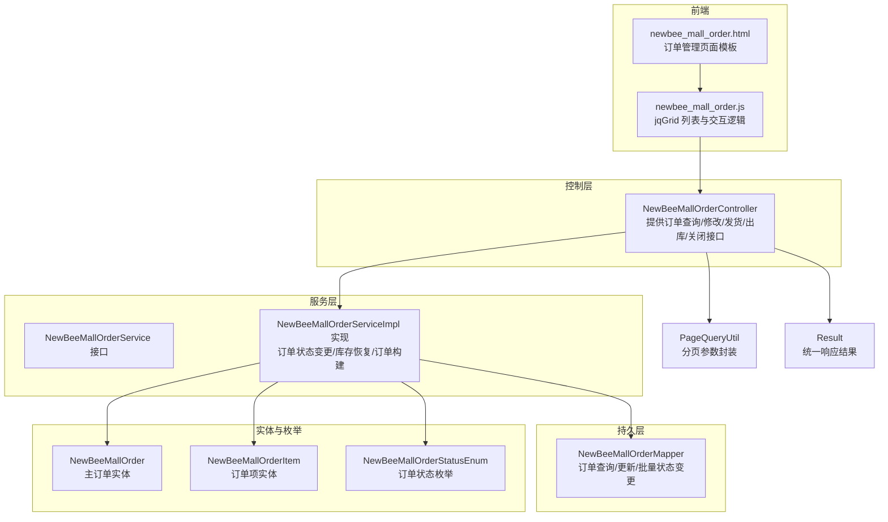
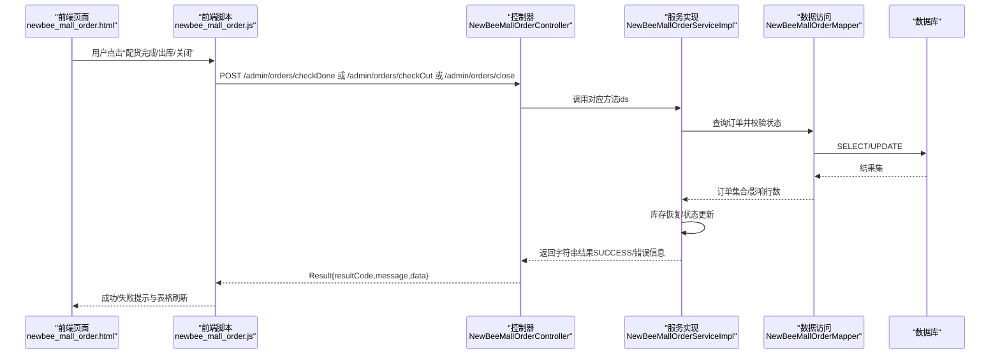
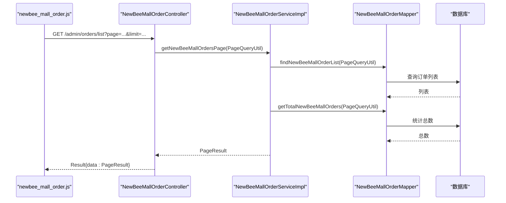
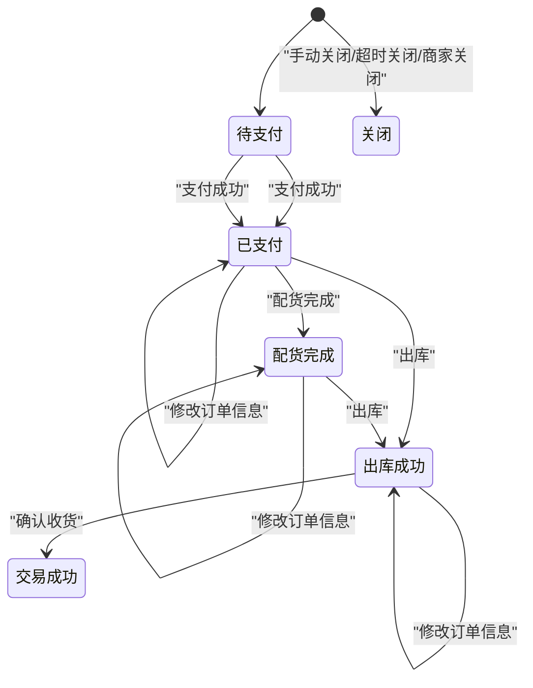
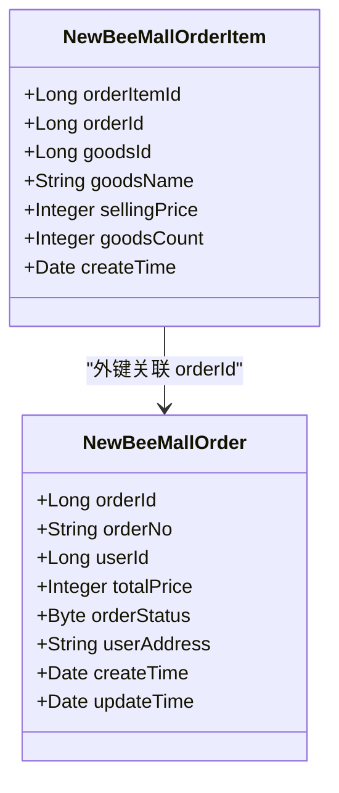
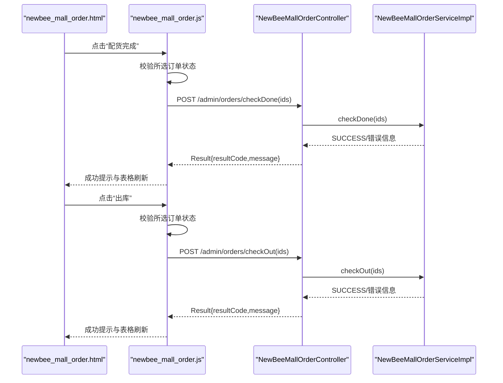
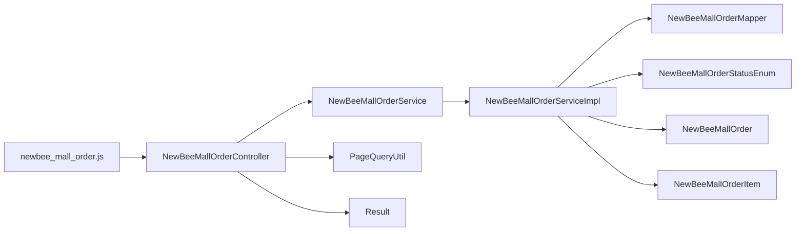

# 订单管理功能

<cite>
**本文引用的文件**
- [NewBeeMallOrderController.java](file://src/main/java/ltd/newbee/mall/controller/admin/NewBeeMallOrderController.java)
- [NewBeeMallOrderServiceImpl.java](file://src/main/java/ltd/newbee/mall/service/impl/NewBeeMallOrderServiceImpl.java)
- [NewBeeMallOrderStatusEnum.java](file://src/main/java/ltd/newbee/mall/common/NewBeeMallOrderStatusEnum.java)
- [NewBeeMallOrder.java](file://src/main/java/ltd/newbee/mall/entity/NewBeeMallOrder.java)
- [NewBeeMallOrderItem.java](file://src/main/java/ltd/newbee/mall/entity/NewBeeMallOrderItem.java)
- [NewBeeMallOrderService.java](file://src/main/java/ltd/newbee/mall/service/NewBeeMallOrderService.java)
- [NewBeeMallOrderMapper.java](file://src/main/java/ltd/newbee/mall/dao/NewBeeMallOrderMapper.java)
- [PageQueryUtil.java](file://src/main/java/ltd/newbee/mall/util/PageQueryUtil.java)
- [Result.java](file://src/main/java/ltd/newbee/mall/util/Result.java)
- [newbee_mall_order.js](file://src/main/resources/static/admin/dist/js/newbee_mall_order.js)
- [newbee_mall_order.html](file://src/main/resources/templates/admin/newbee_mall_order.html)
</cite>

## 目录
1. [引言](#引言)
2. [项目结构](#项目结构)
3. [核心组件](#核心组件)
4. [架构总览](#架构总览)
5. [详细组件分析](#详细组件分析)
6. [依赖分析](#依赖分析)
7. [性能考虑](#性能考虑)
8. [故障排查指南](#故障排查指南)
9. [结论](#结论)
10. [附录](#附录)

## 引言
本文件系统化讲解新蜂商城后台订单管理功能的实现机制，重点覆盖：
- NewBeeMallOrderController 提供的订单查询接口与分页处理逻辑
- NewBeeMallOrderServiceImpl 中订单状态变更流程与状态机转换规则
- 订单项（NewBeeMallOrderItem）与主订单的关联关系及数据一致性保障
- 前端通过 jqGrid 展示订单列表，并通过 newbee_mall_order.js 实现发货等操作的交互流程
- 订单状态流转图与异常处理策略（如超时未支付自动关闭）

## 项目结构
订单管理相关代码采用典型的三层架构：控制层（Controller）、服务层（Service）、持久层（DAO），配合实体与 VO 类型，以及前端模板与脚本。

图表来源
- [NewBeeMallOrderController.java](file://src/main/java/ltd/newbee/mall/controller/admin/NewBeeMallOrderController.java#L49-L148)
- [NewBeeMallOrderServiceImpl.java](file://src/main/java/ltd/newbee/mall/service/impl/NewBeeMallOrderServiceImpl.java#L51-L183)
- [NewBeeMallOrderMapper.java](file://src/main/java/ltd/newbee/mall/dao/NewBeeMallOrderMapper.java#L18-L43)
- [NewBeeMallOrder.java](file://src/main/java/ltd/newbee/mall/entity/NewBeeMallOrder.java#L16-L169)
- [NewBeeMallOrderItem.java](file://src/main/java/ltd/newbee/mall/entity/NewBeeMallOrderItem.java#L14-L111)
- [NewBeeMallOrderStatusEnum.java](file://src/main/java/ltd/newbee/mall/common/NewBeeMallOrderStatusEnum.java#L18-L64)
- [PageQueryUtil.java](file://src/main/java/ltd/newbee/mall/util/PageQueryUtil.java#L14-L56)
- [Result.java](file://src/main/java/ltd/newbee/mall/util/Result.java#L11-L58)
- [newbee_mall_order.html](file://src/main/resources/templates/admin/newbee_mall_order.html#L40-L177)
- [newbee_mall_order.js](file://src/main/resources/static/admin/dist/js/newbee_mall_order.js#L1-L393)

章节来源
- [NewBeeMallOrderController.java](file://src/main/java/ltd/newbee/mall/controller/admin/NewBeeMallOrderController.java#L49-L148)
- [NewBeeMallOrderServiceImpl.java](file://src/main/java/ltd/newbee/mall/service/impl/NewBeeMallOrderServiceImpl.java#L51-L183)
- [newbee_mall_order.html](file://src/main/resources/templates/admin/newbee_mall_order.html#L40-L177)

## 核心组件
- 控制器：提供订单列表查询、订单信息修改、配货完成、出库、关闭等接口；负责参数校验与统一响应包装。
- 服务实现：负责订单状态变更、库存恢复、订单构建与查询；实现业务规则与事务控制。
- 数据访问：封装订单查询、统计、批量状态更新等数据库操作。
- 实体与枚举：定义订单与订单项的数据模型，以及订单状态枚举。
- 前端：基于 jqGrid 展示订单列表，提供发货、出库、关闭等交互操作。

章节来源
- [NewBeeMallOrderController.java](file://src/main/java/ltd/newbee/mall/controller/admin/NewBeeMallOrderController.java#L49-L148)
- [NewBeeMallOrderServiceImpl.java](file://src/main/java/ltd/newbee/mall/service/impl/NewBeeMallOrderServiceImpl.java#L51-L183)
- [NewBeeMallOrderMapper.java](file://src/main/java/ltd/newbee/mall/dao/NewBeeMallOrderMapper.java#L18-L43)
- [NewBeeMallOrder.java](file://src/main/java/ltd/newbee/mall/entity/NewBeeMallOrder.java#L16-L169)
- [NewBeeMallOrderItem.java](file://src/main/java/ltd/newbee/mall/entity/NewBeeMallOrderItem.java#L14-L111)
- [NewBeeMallOrderStatusEnum.java](file://src/main/java/ltd/newbee/mall/common/NewBeeMallOrderStatusEnum.java#L18-L64)
- [newbee_mall_order.js](file://src/main/resources/static/admin/dist/js/newbee_mall_order.js#L1-L393)

## 架构总览
订单管理采用前后端分离的典型 MVC 架构：
- 前端通过 jqGrid 发起请求到控制器接口
- 控制器调用服务层执行业务逻辑
- 服务层通过 Mapper 访问数据库，必要时进行库存恢复与状态更新
- 统一响应 Result 包装返回给前端

图表来源
- [newbee_mall_order.html](file://src/main/resources/templates/admin/newbee_mall_order.html#L40-L177)
- [newbee_mall_order.js](file://src/main/resources/static/admin/dist/js/newbee_mall_order.js#L220-L386)
- [NewBeeMallOrderController.java](file://src/main/java/ltd/newbee/mall/controller/admin/NewBeeMallOrderController.java#L99-L145)
- [NewBeeMallOrderServiceImpl.java](file://src/main/java/ltd/newbee/mall/service/impl/NewBeeMallOrderServiceImpl.java#L75-L183)
- [NewBeeMallOrderMapper.java](file://src/main/java/ltd/newbee/mall/dao/NewBeeMallOrderMapper.java#L32-L43)
- [Result.java](file://src/main/java/ltd/newbee/mall/util/Result.java#L11-L58)

## 详细组件分析

### 订单查询接口与分页处理
- 接口路径与方法
  - GET /admin/orders/list：返回订单列表与分页信息
  - 参数要求：必须包含 page 与 limit，否则返回参数异常
- 分页参数封装
  - PageQueryUtil 将 page、limit 转换为数据库偏移量 start，并注入查询条件
- 服务层查询
  - NewBeeMallOrderServiceImpl 调用 Mapper 的 findNewBeeMallOrderList 与 getTotalNewBeeMallOrders
  - 返回 PageResult（包含 list、total、limit、page）
- 前端 jqGrid
  - 初始化列模型，指定数据源 URL 为 /admin/orders/list
  - 使用 jsonReader 映射 data.list、data.currPage、data.totalPage、data.totalCount
  - 支持多选、分页、重载

图表来源
- [NewBeeMallOrderController.java](file://src/main/java/ltd/newbee/mall/controller/admin/NewBeeMallOrderController.java#L52-L60)
- [NewBeeMallOrderServiceImpl.java](file://src/main/java/ltd/newbee/mall/service/impl/NewBeeMallOrderServiceImpl.java#L51-L56)
- [PageQueryUtil.java](file://src/main/java/ltd/newbee/mall/util/PageQueryUtil.java#L14-L56)
- [newbee_mall_order.js](file://src/main/resources/static/admin/dist/js/newbee_mall_order.js#L1-L40)

章节来源
- [NewBeeMallOrderController.java](file://src/main/java/ltd/newbee/mall/controller/admin/NewBeeMallOrderController.java#L52-L60)
- [NewBeeMallOrderServiceImpl.java](file://src/main/java/ltd/newbee/mall/service/impl/NewBeeMallOrderServiceImpl.java#L51-L56)
- [PageQueryUtil.java](file://src/main/java/ltd/newbee/mall/util/PageQueryUtil.java#L14-L56)
- [newbee_mall_order.js](file://src/main/resources/static/admin/dist/js/newbee_mall_order.js#L1-L40)

### 订单状态变更流程与状态机
- 状态枚举
  - 待支付（0）、已支付（1）、配货完成（2）、出库成功（3）、交易成功（4）
  - 关闭类型：手动关闭（-1）、超时关闭（-2）、商家关闭（-3）
- 状态变更入口
  - 配货完成（checkDone）：仅允许从“已支付”状态进入“配货完成”
  - 出库（checkOut）：仅允许从“已支付”或“配货完成”状态进入“出库成功”
  - 关闭（closeOrder）：禁止对已关闭或已完成订单再次关闭
  - 完成（finishOrder）：仅允许从“出库成功”进入“交易成功”
  - 支付成功（paySuccess）：仅允许从“待支付”进入“已支付”，并设置支付方式与支付状态
- 事务与一致性
  - 所有状态变更均在事务内执行，确保数据库一致性
  - 关闭订单时会恢复库存，避免超卖或重复扣减

图表来源
- [NewBeeMallOrderStatusEnum.java](file://src/main/java/ltd/newbee/mall/common/NewBeeMallOrderStatusEnum.java#L18-L64)
- [NewBeeMallOrderServiceImpl.java](file://src/main/java/ltd/newbee/mall/service/impl/NewBeeMallOrderServiceImpl.java#L75-L183)

章节来源
- [NewBeeMallOrderStatusEnum.java](file://src/main/java/ltd/newbee/mall/common/NewBeeMallOrderStatusEnum.java#L18-L64)
- [NewBeeMallOrderServiceImpl.java](file://src/main/java/ltd/newbee/mall/service/impl/NewBeeMallOrderServiceImpl.java#L75-L183)

### 订单项与主订单的关联关系与一致性
- 关联关系
  - NewBeeMallOrderItem 中包含 orderId 字段，指向 NewBeeMallOrder 主键
  - 服务层在生成订单时，将购物车项复制为订单项快照并写入数据库
- 一致性保障
  - 生成订单与订单项写入在同一事务内，保证原子性
  - 关闭订单时通过 recoverStockNum 恢复库存，避免数据不一致
  - 查询订单详情时，先校验订单存在性与权限，再加载订单项列表

图表来源
- [NewBeeMallOrder.java](file://src/main/java/ltd/newbee/mall/entity/NewBeeMallOrder.java#L16-L169)
- [NewBeeMallOrderItem.java](file://src/main/java/ltd/newbee/mall/entity/NewBeeMallOrderItem.java#L14-L111)
- [NewBeeMallOrderServiceImpl.java](file://src/main/java/ltd/newbee/mall/service/impl/NewBeeMallOrderServiceImpl.java#L239-L256)

章节来源
- [NewBeeMallOrder.java](file://src/main/java/ltd/newbee/mall/entity/NewBeeMallOrder.java#L16-L169)
- [NewBeeMallOrderItem.java](file://src/main/java/ltd/newbee/mall/entity/NewBeeMallOrderItem.java#L14-L111)
- [NewBeeMallOrderServiceImpl.java](file://src/main/java/ltd/newbee/mall/service/impl/NewBeeMallOrderServiceImpl.java#L239-L256)

### 前端交互流程（jqGrid 与发货操作）
- 页面与初始化
  - newbee_mall_order.html 加载 jqGrid、样式与脚本
  - newbee_mall_order.js 初始化 jqGrid，设置列、分页、数据映射与格式化函数
- 列表与操作
  - 列表：订单号、总价、状态、支付方式、创建时间等
  - 操作：查看订单项、查看收件人信息、修改订单、配货完成、出库、关闭
- 发货操作（updateOrderInfo）
  - 通过 orderEdit 打开模态框，提交 POST /admin/orders/update
  - 服务层仅允许在“出库前”（orderStatus >= 0 且 < 3）修改总价与收件人地址
- 配货完成与出库
  - orderCheckDone：校验所选订单状态必须为“已支付”
  - orderCheckOut：校验所选订单状态必须为“已支付”或“配货完成”
  - 两者均通过 AJAX 调用 /admin/orders/checkDone 与 /admin/orders/checkOut

图表来源
- [newbee_mall_order.html](file://src/main/resources/templates/admin/newbee_mall_order.html#L40-L177)
- [newbee_mall_order.js](file://src/main/resources/static/admin/dist/js/newbee_mall_order.js#L1-L393)
- [NewBeeMallOrderController.java](file://src/main/java/ltd/newbee/mall/controller/admin/NewBeeMallOrderController.java#L99-L145)
- [NewBeeMallOrderServiceImpl.java](file://src/main/java/ltd/newbee/mall/service/impl/NewBeeMallOrderServiceImpl.java#L75-L145)

章节来源
- [newbee_mall_order.html](file://src/main/resources/templates/admin/newbee_mall_order.html#L40-L177)
- [newbee_mall_order.js](file://src/main/resources/static/admin/dist/js/newbee_mall_order.js#L1-L393)
- [NewBeeMallOrderController.java](file://src/main/java/ltd/newbee/mall/controller/admin/NewBeeMallOrderController.java#L99-L145)
- [NewBeeMallOrderServiceImpl.java](file://src/main/java/ltd/newbee/mall/service/impl/NewBeeMallOrderServiceImpl.java#L75-L145)

## 依赖分析
- 控制器依赖服务接口与分页工具
- 服务实现依赖 Mapper、实体、枚举与工具类
- 前端依赖 jqGrid、SweetAlert2 与公共脚本
- 统一响应 Result 作为前后端契约

图表来源
- [newbee_mall_order.js](file://src/main/resources/static/admin/dist/js/newbee_mall_order.js#L1-L393)
- [NewBeeMallOrderController.java](file://src/main/java/ltd/newbee/mall/controller/admin/NewBeeMallOrderController.java#L49-L148)
- [NewBeeMallOrderServiceImpl.java](file://src/main/java/ltd/newbee/mall/service/impl/NewBeeMallOrderServiceImpl.java#L51-L183)
- [NewBeeMallOrderMapper.java](file://src/main/java/ltd/newbee/mall/dao/NewBeeMallOrderMapper.java#L18-L43)
- [NewBeeMallOrderStatusEnum.java](file://src/main/java/ltd/newbee/mall/common/NewBeeMallOrderStatusEnum.java#L18-L64)
- [NewBeeMallOrder.java](file://src/main/java/ltd/newbee/mall/entity/NewBeeMallOrder.java#L16-L169)
- [NewBeeMallOrderItem.java](file://src/main/java/ltd/newbee/mall/entity/NewBeeMallOrderItem.java#L14-L111)
- [PageQueryUtil.java](file://src/main/java/ltd/newbee/mall/util/PageQueryUtil.java#L14-L56)
- [Result.java](file://src/main/java/ltd/newbee/mall/util/Result.java#L11-L58)

章节来源
- [NewBeeMallOrderController.java](file://src/main/java/ltd/newbee/mall/controller/admin/NewBeeMallOrderController.java#L49-L148)
- [NewBeeMallOrderServiceImpl.java](file://src/main/java/ltd/newbee/mall/service/impl/NewBeeMallOrderServiceImpl.java#L51-L183)
- [newbee_mall_order.js](file://src/main/resources/static/admin/dist/js/newbee_mall_order.js#L1-L393)

## 性能考虑
- 分页查询：PageQueryUtil 将 page、limit 转换为数据库偏移量，建议在订单表建立复合索引（如 order_status、create_time）以优化排序与过滤
- 批量操作：checkDone/checkOut/closeOrder 使用批量更新，减少网络往返与事务次数
- 前端渲染：jqGrid 默认开启 Bootstrap 风格，注意大数据量时的虚拟滚动与懒加载策略
- 事务边界：状态变更与库存恢复均在事务内，避免中间状态导致的数据不一致

## 故障排查指南
- 参数异常
  - /admin/orders/list 缺少 page 或 limit 时返回参数异常
- 状态校验失败
  - 配货完成：仅允许“已支付”状态；出库：仅允许“已支付”或“配货完成”状态
  - 关闭：禁止对已完成或已关闭订单再次关闭
- 修改订单信息
  - 仅允许在“出库前”（orderStatus >= 0 且 < 3）修改总价与收件人地址
- 库存恢复
  - 关闭订单会触发库存恢复，若恢复失败返回数据库错误
- 前端交互
  - 使用 SweetAlert2 提示错误/成功；若网络异常或服务端异常，前端统一捕获并提示

章节来源
- [NewBeeMallOrderController.java](file://src/main/java/ltd/newbee/mall/controller/admin/NewBeeMallOrderController.java#L52-L60)
- [NewBeeMallOrderServiceImpl.java](file://src/main/java/ltd/newbee/mall/service/impl/NewBeeMallOrderServiceImpl.java#L75-L183)
- [newbee_mall_order.js](file://src/main/resources/static/admin/dist/js/newbee_mall_order.js#L220-L386)

## 结论
订单管理模块通过清晰的分层设计与严格的业务规则，实现了从订单查询、状态变更到库存恢复的完整闭环。前端基于 jqGrid 提供直观的批量操作体验，服务层在事务内保障数据一致性。状态机设计明确、可扩展性强，便于后续接入支付回调与自动关闭等能力。

## 附录
- 订单状态枚举值与含义
  - 待支付（0）、已支付（1）、配货完成（2）、出库成功（3）、交易成功（4）
  - 关闭类型：手动关闭（-1）、超时关闭（-2）、商家关闭（-3）
- 前端常用交互
  - 列表加载：GET /admin/orders/list
  - 修改订单：POST /admin/orders/update
  - 配货完成：POST /admin/orders/checkDone
  - 出库：POST /admin/orders/checkOut
  - 关闭订单：POST /admin/orders/close
  - 查看订单项：GET /admin/order-items/{id}