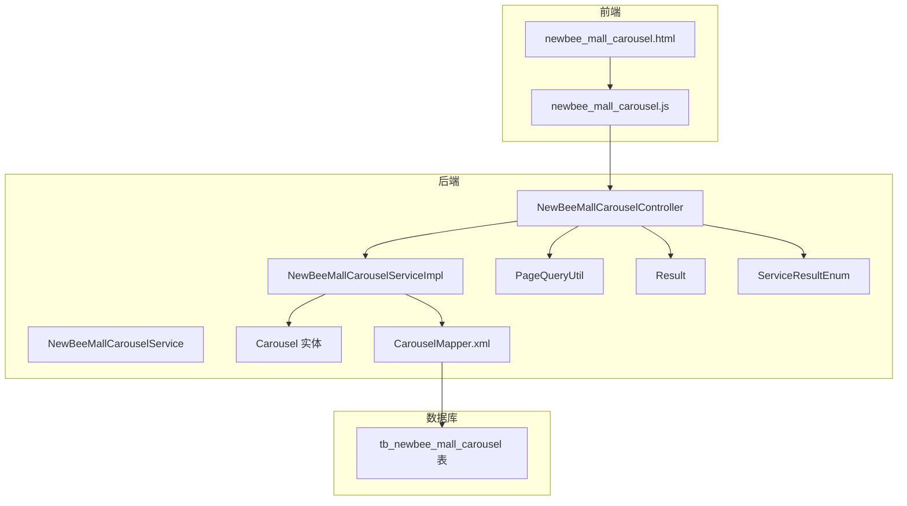
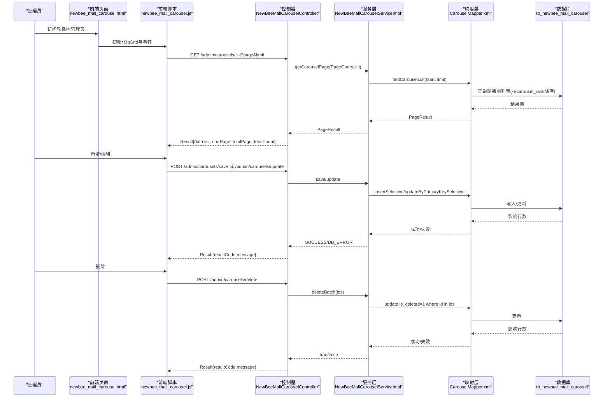
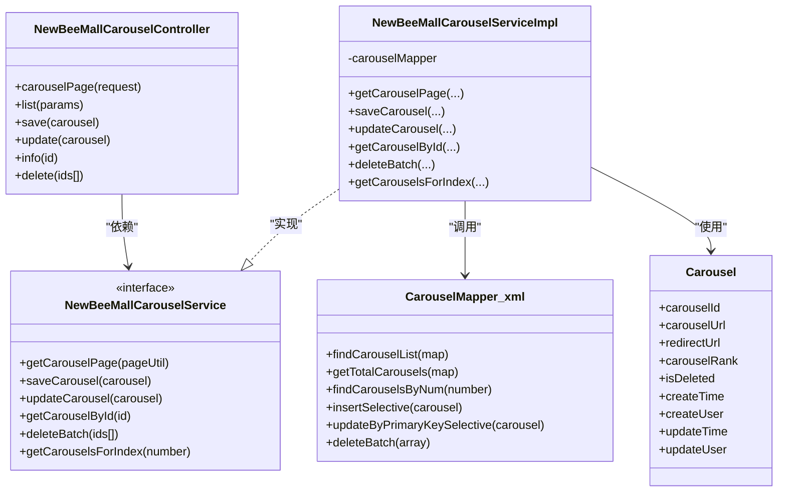

# 轮播图管理功能

<cite>
**本文引用的文件列表**
- [NewBeeMallCarouselController.java](file://src/main/java/ltd/newbee/mall/controller/admin/NewBeeMallCarouselController.java)
- [NewBeeMallCarouselServiceImpl.java](file://src/main/java/ltd/newbee/mall/service/impl/NewBeeMallCarouselServiceImpl.java)
- [NewBeeMallCarouselService.java](file://src/main/java/ltd/newbee/mall/service/NewBeeMallCarouselService.java)
- [Carousel.java](file://src/main/java/ltd/newbee/mall/entity/Carousel.java)
- [CarouselMapper.xml](file://src/main/resources/mapper/CarouselMapper.xml)
- [newbee_mall_carousel.html](file://src/main/resources/templates/admin/newbee_mall_carousel.html)
- [newbee_mall_carousel.js](file://src/main/resources/static/admin/dist/js/newbee_mall_carousel.js)
- [PageQueryUtil.java](file://src/main/java/ltd/newbee/mall/util/PageQueryUtil.java)
- [Result.java](file://src/main/java/ltd/newbee/mall/util/Result.java)
- [ServiceResultEnum.java](file://src/main/java/ltd/newbee/mall/common/ServiceResultEnum.java)
- [newbee_mall_schema.sql](file://src/main/resources/newbee_mall_schema.sql)
</cite>

## 目录
1. [引言](#引言)
2. [项目结构](#项目结构)
3. [核心组件](#核心组件)
4. [架构总览](#架构总览)
5. [详细组件分析](#详细组件分析)
6. [依赖关系分析](#依赖关系分析)
7. [性能考量](#性能考量)
8. [故障排查指南](#故障排查指南)
9. [结论](#结论)
10. [附录](#附录)

## 引言
本文件面向新蜂商城后台的“轮播图管理”功能，系统性梳理前后端实现：后端提供RESTful接口，服务层完成业务逻辑（分页、保存、更新、删除、首页展示），持久层基于MyBatis映射轮播图表；前端通过jqGrid渲染表格，结合jQuery与SweetAlert2实现交互与提示。文档重点覆盖接口规范、排序规则、启用状态管理、数据持久化流程、字段语义与数据库表结构，并给出常见问题排查方法与接口调用示例路径。

## 项目结构
轮播图管理涉及的关键模块与文件如下：
- 控制器层：NewBeeMallCarouselController 提供/carousels/list、/carousels/save、/carousels/update、/carousels/info/{id}、/carousels/delete 等接口
- 服务层：NewBeeMallCarouselService 接口与 NewBeeMallCarouselServiceImpl 实现，包含分页查询、保存、更新、批量删除、首页轮播图获取
- 实体与映射：Carousel 实体类与 CarouselMapper.xml 映射文件
- 前端页面与脚本：newbee_mall_carousel.html 页面模板与 newbee_mall_carousel.js 交互脚本
- 工具与通用返回：PageQueryUtil 分页参数封装、Result 通用响应体、ServiceResultEnum 枚举

图表来源
- [NewBeeMallCarouselController.java](file://src/main/java/ltd/newbee/mall/controller/admin/NewBeeMallCarouselController.java#L1-L126)
- [NewBeeMallCarouselServiceImpl.java](file://src/main/java/ltd/newbee/mall/service/impl/NewBeeMallCarouselServiceImpl.java#L1-L89)
- [CarouselMapper.xml](file://src/main/resources/mapper/CarouselMapper.xml#L1-L171)
- [newbee_mall_carousel.js](file://src/main/resources/static/admin/dist/js/newbee_mall_carousel.js#L1-L211)
- [newbee_mall_carousel.html](file://src/main/resources/templates/admin/newbee_mall_carousel.html#L1-L131)

章节来源
- [NewBeeMallCarouselController.java](file://src/main/java/ltd/newbee/mall/controller/admin/NewBeeMallCarouselController.java#L1-L126)
- [NewBeeMallCarouselServiceImpl.java](file://src/main/java/ltd/newbee/mall/service/impl/NewBeeMallCarouselServiceImpl.java#L1-L89)
- [CarouselMapper.xml](file://src/main/resources/mapper/CarouselMapper.xml#L1-L171)
- [newbee_mall_carousel.html](file://src/main/resources/templates/admin/newbee_mall_carousel.html#L1-L131)
- [newbee_mall_carousel.js](file://src/main/resources/static/admin/dist/js/newbee_mall_carousel.js#L1-L211)

## 核心组件
- 控制器 NewBeeMallCarouselController
  - 提供后台管理页面路由与REST接口
  - 参数校验与统一返回封装
- 服务接口与实现 NewBeeMallCarouselService / NewBeeMallCarouselServiceImpl
  - 分页查询、保存、更新、删除、首页轮播图获取
- 实体与映射 Carousel / CarouselMapper.xml
  - 字段映射与SQL查询/更新/删除
- 前端模板与脚本 newbee_mall_carousel.html / newbee_mall_carousel.js
  - jqGrid表格渲染、上传图片、增删改交互

章节来源
- [NewBeeMallCarouselController.java](file://src/main/java/ltd/newbee/mall/controller/admin/NewBeeMallCarouselController.java#L1-L126)
- [NewBeeMallCarouselService.java](file://src/main/java/ltd/newbee/mall/service/NewBeeMallCarouselService.java#L1-L43)
- [NewBeeMallCarouselServiceImpl.java](file://src/main/java/ltd/newbee/mall/service/impl/NewBeeMallCarouselServiceImpl.java#L1-L89)
- [Carousel.java](file://src/main/java/ltd/newbee/mall/entity/Carousel.java#L1-L126)
- [CarouselMapper.xml](file://src/main/resources/mapper/CarouselMapper.xml#L1-L171)
- [newbee_mall_carousel.html](file://src/main/resources/templates/admin/newbee_mall_carousel.html#L1-L131)
- [newbee_mall_carousel.js](file://src/main/resources/static/admin/dist/js/newbee_mall_carousel.js#L1-L211)

## 架构总览
后端采用经典的三层架构：控制器负责HTTP请求与响应封装，服务层承载业务逻辑，持久层通过MyBatis映射数据库。前端通过jqGrid渲染表格，Ajax调用后端接口，实现轮播图的增删改查与排序展示。

图表来源
- [NewBeeMallCarouselController.java](file://src/main/java/ltd/newbee/mall/controller/admin/NewBeeMallCarouselController.java#L46-L124)
- [NewBeeMallCarouselServiceImpl.java](file://src/main/java/ltd/newbee/mall/service/impl/NewBeeMallCarouselServiceImpl.java#L30-L88)
- [CarouselMapper.xml](file://src/main/resources/mapper/CarouselMapper.xml#L19-L171)
- [newbee_mall_carousel.js](file://src/main/resources/static/admin/dist/js/newbee_mall_carousel.js#L1-L211)

## 详细组件分析

### 后端REST接口与参数规范
- 页面路由
  - GET /admin/carousels：跳转到轮播图管理页
- 列表接口
  - GET /admin/carousels/list
  - 请求参数：page（当前页）、limit（每页条数）
  - 返回：Result，data为分页结果对象（包含list、currPage、totalPage、totalCount）
- 新增接口
  - POST /admin/carousels/save
  - 请求体：Carousel 对象（carouselUrl、redirectUrl、carouselRank）
  - 校验：carouselUrl非空、carouselRank非空
- 修改接口
  - POST /admin/carousels/update
  - 请求体：Carousel 对象（carouselId、carouselUrl、redirectUrl、carouselRank）
  - 校验：carouselId非空、carouselUrl非空、carouselRank非空
- 详情接口
  - GET /admin/carousels/info/{id}
  - 返回：Result，data为Carousel对象
- 删除接口
  - POST /admin/carousels/delete
  - 请求体：整型数组 ids[]
  - 校验：ids长度>=1
  - 删除策略：软删除（is_deleted=1）

章节来源
- [NewBeeMallCarouselController.java](file://src/main/java/ltd/newbee/mall/controller/admin/NewBeeMallCarouselController.java#L46-L124)
- [PageQueryUtil.java](file://src/main/java/ltd/newbee/mall/util/PageQueryUtil.java#L1-L56)
- [Result.java](file://src/main/java/ltd/newbee/mall/util/Result.java#L1-L58)
- [ServiceResultEnum.java](file://src/main/java/ltd/newbee/mall/common/ServiceResultEnum.java#L1-L91)

### 服务层业务逻辑
- 分页查询
  - getCarouselPage：调用Mapper查询列表与总数，按carousel_rank降序，支持分页起始位置计算
- 保存
  - saveCarousel：插入新记录，返回SUCCESS或DB_ERROR
- 更新
  - updateCarousel：先按主键查询是否存在，再更新carouselRank、redirectUrl、carouselUrl、updateTime，返回SUCCESS或DATA_NOT_EXIST/DB_ERROR
- 删除
  - deleteBatch：批量软删除（is_deleted=1），返回true/false
- 首页轮播图
  - getCarouselsForIndex：按数量限制查询，返回VO列表（用于首页展示）

章节来源
- [NewBeeMallCarouselServiceImpl.java](file://src/main/java/ltd/newbee/mall/service/impl/NewBeeMallCarouselServiceImpl.java#L30-L88)
- [NewBeeMallCarouselService.java](file://src/main/java/ltd/newbee/mall/service/NewBeeMallCarouselService.java#L18-L42)

### 数据模型与数据库表结构
- 实体类 Carousel 字段
  - carouselId：主键
  - carouselUrl：轮播图URL
  - redirectUrl：点击跳转链接
  - carouselRank：排序值（数值越大越靠前）
  - isDeleted：逻辑删除标记（0未删除，1已删除）
  - createTime/updateTime：创建/更新时间
  - createUser/updateUser：创建/更新用户ID
- 数据库表 tb_newbee_mall_carousel
  - 主键 carousel_id
  - 字段 carousel_url、redirect_url、carousel_rank、is_deleted、create_time、create_user、update_time、update_user
  - 查询排序：ORDER BY carousel_rank DESC
  - 删除策略：软删除（UPDATE ... SET is_deleted=1）

章节来源
- [Carousel.java](file://src/main/java/ltd/newbee/mall/entity/Carousel.java#L1-L126)
- [CarouselMapper.xml](file://src/main/resources/mapper/CarouselMapper.xml#L19-L46)
- [newbee_mall_schema.sql](file://src/main/resources/newbee_mall_schema.sql#L1-L200)

### 前端页面与交互
- 页面模板 newbee_mall_carousel.html
  - 引入jqGrid、SweetAlert2、AjaxUpload等插件
  - 定义表格列：carouselId、carouselUrl（图片格式化）、redirectUrl、carouselRank、createTime
  - 定义模态框用于新增/编辑轮播图
- 前端脚本 newbee_mall_carousel.js
  - jqGrid初始化：url=/admin/carousels/list，jsonReader映射data.list等
  - 上传图片：AjaxUpload提交到 /admin/upload/file，成功后回填carouselImg
  - 新增/编辑：组装Carousel对象，POST到 /admin/carousels/save 或 /admin/carousels/update
  - 删除：POST ids[]到 /admin/carousels/delete
  - 重新加载：reload()触发jqGrid刷新

章节来源
- [newbee_mall_carousel.html](file://src/main/resources/templates/admin/newbee_mall_carousel.html#L1-L131)
- [newbee_mall_carousel.js](file://src/main/resources/static/admin/dist/js/newbee_mall_carousel.js#L1-L211)

### 排序规则与启用状态管理
- 排序规则
  - 列表与首页查询均按 carousel_rank 降序排列，数值越大越靠前
- 启用状态
  - 通过 is_deleted 字段实现软删除：删除时仅更新 is_deleted=1，查询时过滤 is_deleted=0
  - 逻辑删除不影响排序与展示，仅影响可见性

章节来源
- [CarouselMapper.xml](file://src/main/resources/mapper/CarouselMapper.xml#L19-L46)
- [NewBeeMallCarouselServiceImpl.java](file://src/main/java/ltd/newbee/mall/service/impl/NewBeeMallCarouselServiceImpl.java#L70-L77)

### 数据持久化过程
- 插入：insertSelective（按非空字段插入）
- 更新：updateByPrimaryKeySelective（按非空字段更新）
- 删除：deleteBatch（批量软删除，设置is_deleted=1）
- 查询：findCarouselList（分页+排序）、findCarouselsByNum（首页数量限制+排序）

章节来源
- [CarouselMapper.xml](file://src/main/resources/mapper/CarouselMapper.xml#L51-L171)
- [NewBeeMallCarouselServiceImpl.java](file://src/main/java/ltd/newbee/mall/service/impl/NewBeeMallCarouselServiceImpl.java#L30-L88)

## 依赖关系分析
- 控制器依赖服务接口与工具类（分页、返回体、枚举）
- 服务实现依赖Mapper与实体
- Mapper映射到数据库表，遵循排序与软删除约定
- 前端依赖jqGrid、SweetAlert2、AjaxUpload等插件

图表来源
- [NewBeeMallCarouselController.java](file://src/main/java/ltd/newbee/mall/controller/admin/NewBeeMallCarouselController.java#L1-L126)
- [NewBeeMallCarouselService.java](file://src/main/java/ltd/newbee/mall/service/NewBeeMallCarouselService.java#L1-L43)
- [NewBeeMallCarouselServiceImpl.java](file://src/main/java/ltd/newbee/mall/service/impl/NewBeeMallCarouselServiceImpl.java#L1-L89)
- [Carousel.java](file://src/main/java/ltd/newbee/mall/entity/Carousel.java#L1-L126)
- [CarouselMapper.xml](file://src/main/resources/mapper/CarouselMapper.xml#L1-L171)

## 性能考量
- 排序与分页
  - 列表查询按 carousel_rank 降序，建议在 carousel_rank 上建立索引以提升排序与分页性能
- 软删除
  - 使用 is_deleted 过滤，避免全表扫描；统计总数时同样过滤 is_deleted=0
- 前端渲染
  - jqGrid本地分页与排序，注意大数据量时建议后端分页，避免一次性传输过多数据
- 图片资源
  - carouselUrl 指向图片URL，建议使用CDN与合适的图片尺寸，减少首屏加载时间

[本节为通用指导，无需列出具体文件来源]

## 故障排查指南
- 常见错误与定位
  - 参数异常：/admin/carousels/list 缺少 page/limit；/admin/carousels/save 或 /admin/carousels/update 缺少必要字段
  - 数据不存在：/admin/carousels/info/{id} 返回未查询到记录
  - 数据库错误：保存/更新返回 database error
  - 删除失败：ids为空或删除失败
- 排查步骤
  - 检查请求参数是否完整（page、limit、carouselId、carouselUrl、carouselRank）
  - 检查数据库 is_deleted 字段是否正确（删除应为1）
  - 查看服务层返回码与消息（SUCCESS/DATA_NOT_EXIST/DB_ERROR）
  - 前端提示：SweetAlert2会弹出错误信息，便于快速定位
- 排序值重复
  - 若多条记录 carousel_rank 相同，排序可能不稳定；建议为每条记录设置唯一值或在业务层强制去重

章节来源
- [NewBeeMallCarouselController.java](file://src/main/java/ltd/newbee/mall/controller/admin/NewBeeMallCarouselController.java#L46-L124)
- [ServiceResultEnum.java](file://src/main/java/ltd/newbee/mall/common/ServiceResultEnum.java#L1-L91)
- [newbee_mall_carousel.js](file://src/main/resources/static/admin/dist/js/newbee_mall_carousel.js#L92-L162)

## 结论
轮播图管理功能通过清晰的前后端分工与稳定的分页/排序机制，实现了高效的内容运营能力。后端以服务层为核心，结合MyBatis映射与软删除策略，保障了数据一致性与可追溯性；前端以jqGrid为基础，辅以图片上传与交互提示，提升了管理效率。建议在生产环境中完善索引、监控与告警，持续优化用户体验与系统性能。

[本节为总结性内容，无需列出具体文件来源]

## 附录

### 接口调用示例（路径参考）
- 获取列表
  - GET /admin/carousels/list?page=1&limit=10
- 新增轮播图
  - POST /admin/carousels/save
  - 请求体字段：carouselUrl、redirectUrl、carouselRank
- 更新轮播图
  - POST /admin/carousels/update
  - 请求体字段：carouselId、carouselUrl、redirectUrl、carouselRank
- 获取详情
  - GET /admin/carousels/info/{id}
- 删除轮播图
  - POST /admin/carousels/delete
  - 请求体：ids[]（整型数组）

章节来源
- [NewBeeMallCarouselController.java](file://src/main/java/ltd/newbee/mall/controller/admin/NewBeeMallCarouselController.java#L46-L124)
- [newbee_mall_carousel.js](file://src/main/resources/static/admin/dist/js/newbee_mall_carousel.js#L92-L162)