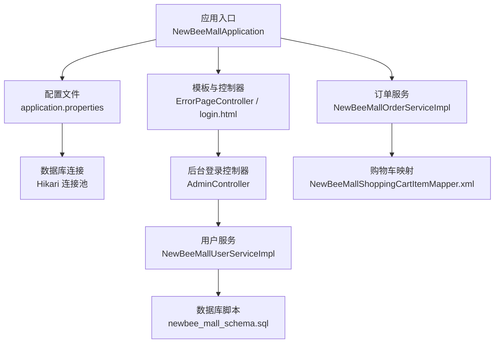
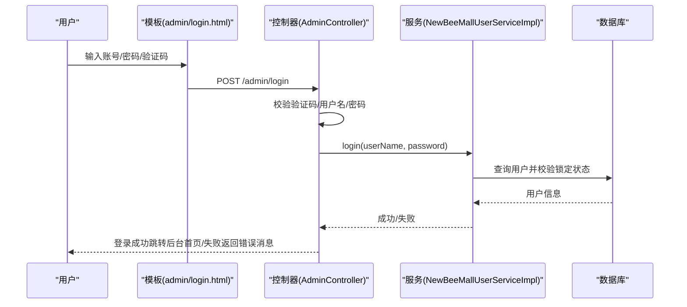
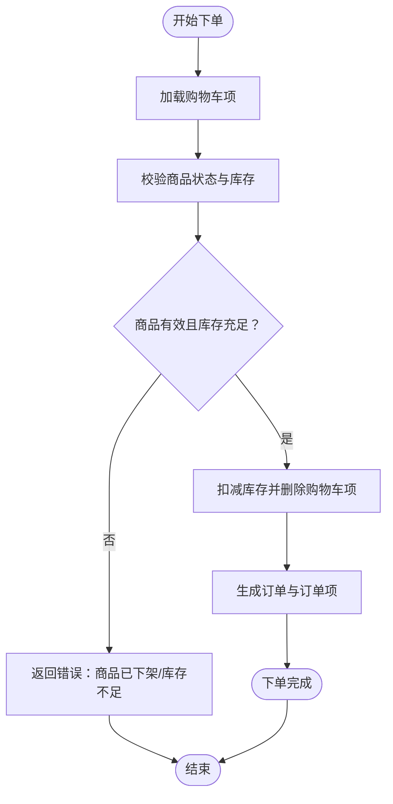
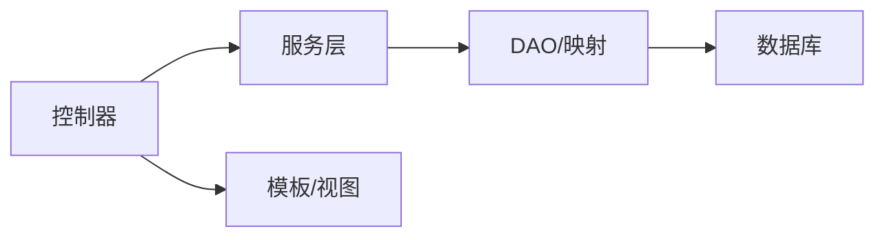

# 常见问题与故障排除

<cite>
**本文引用的文件**
- [FAQ.md](file://docs/FAQ.md)
- [application.properties](file://src/main/resources/application.properties)
- [NewBeeMallApplication.java](file://src/main/java/ltd/newbee/mall/NewBeeMallApplication.java)
- [newbee_mall_schema.sql](file://src/main/resources/newbee_mall_schema.sql)
- [ErrorPageController.java](file://src/main/java/ltd/newbee/mall/controller/common/ErrorPageController.java)
- [login.html（后台）](file://src/main/resources/templates/admin/login.html)
- [login.html（前台）](file://src/main/resources/templates/mall/login.html)
- [AdminController.java](file://src/main/java/ltd/newbee/mall/controller/admin/AdminController.java)
- [NewBeeMallUserServiceImpl.java](file://src/main/java/ltd/newbee/mall/service/impl/NewBeeMallUserServiceImpl.java)
- [NewBeeMallOrderServiceImpl.java](file://src/main/java/ltd/newbee/mall/service/impl/NewBeeMallOrderServiceImpl.java)
- [NewBeeMallShoppingCartItemMapper.xml](file://src/main/resources/mapper/NewBeeMallShoppingCartItemMapper.xml)
- [MD5Util.java](file://src/main/java/ltd/newbee/mall/util/MD5Util.java)
- [my-orders.html](file://src/main/resources/templates/mall/my-orders.html)
- [order-detail.html](file://src/main/resources/templates/mall/order-detail.html)
- [order-settle.html](file://src/main/resources/templates/mall/order-settle.html)
</cite>

## 目录
1. [引言](#引言)
2. [项目结构](#项目结构)
3. [核心组件](#核心组件)
4. [架构总览](#架构总览)
5. [详细组件分析](#详细组件分析)
6. [依赖关系分析](#依赖关系分析)
7. [性能考虑](#性能考虑)
8. [故障排除指南](#故障排除指南)
9. [结论](#结论)

## 引言
本手册基于仓库中的 FAQ 文档与实际代码实现，系统梳理了安装配置、数据库连接、登录失败、页面 404、接口调用错误、购物车异常、订单状态不更新等高频问题的成因与解决方案，并提供可操作的诊断步骤与调试建议，帮助快速定位与恢复系统正常运行。

## 项目结构
- 应用入口与配置
  - 应用启动类：NewBeeMallApplication
  - 配置文件：application.properties（端口、数据库、MyBatis 映射路径、Hikari 连接池参数）
- 数据模型与持久化
  - 初始化脚本：newbee_mall_schema.sql（含管理员、商品、分类、购物车、订单等表）
  - MyBatis 映射：NewBeeMallShoppingCartItemMapper.xml（购物车表映射）
- 控制层与模板
  - 错误页面控制器：ErrorPageController（404/5xx 页面映射）
  - 登录模板：admin/login.html、mall/login.html
  - 后台登录控制器：AdminController（校验验证码、用户名/密码、登录成功/失败跳转）
- 业务层
  - 用户服务：NewBeeMallUserServiceImpl（注册、登录、锁定用户）
  - 订单服务：NewBeeMallOrderServiceImpl（下单、支付、配货、出库、关闭、完成等流程）

图表来源
- [NewBeeMallApplication.java](file://src/main/java/ltd/newbee/mall/NewBeeMallApplication.java#L1-L28)
- [application.properties](file://src/main/resources/application.properties#L1-L22)
- [ErrorPageController.java](file://src/main/java/ltd/newbee/mall/controller/common/ErrorPageController.java#L1-L49)
- [login.html（后台）](file://src/main/resources/templates/admin/login.html#L38-L91)
- [login.html（前台）](file://src/main/resources/templates/mall/login.html#L47-L87)
- [AdminController.java](file://src/main/java/ltd/newbee/mall/controller/admin/AdminController.java#L54-L83)
- [NewBeeMallUserServiceImpl.java](file://src/main/java/ltd/newbee/mall/service/impl/NewBeeMallUserServiceImpl.java#L1-L108)
- [NewBeeMallOrderServiceImpl.java](file://src/main/java/ltd/newbee/mall/service/impl/NewBeeMallOrderServiceImpl.java#L1-L429)
- [NewBeeMallShoppingCartItemMapper.xml](file://src/main/resources/mapper/NewBeeMallShoppingCartItemMapper.xml#L1-L144)
- [newbee_mall_schema.sql](file://src/main/resources/newbee_mall_schema.sql#L1-L200)

章节来源
- [NewBeeMallApplication.java](file://src/main/java/ltd/newbee/mall/NewBeeMallApplication.java#L1-L28)
- [application.properties](file://src/main/resources/application.properties#L1-L22)

## 核心组件
- 数据库连接与配置
  - 端口：server.port
  - 数据源：Hikari 连接池参数（最小空闲、最大连接数、连接超时、空闲超时、连接测试语句）
  - MyBatis 映射：mapper-locations
- 登录与会话
  - 后台登录：AdminController 校验验证码、用户名/密码，成功后写入会话
  - 前台登录：mall/login.html 前端校验手机号/密码/验证码，AJAX 提交 /login
  - 用户服务：NewBeeMallUserServiceImpl 注册时 MD5 加密密码，登录时校验锁定状态
- 订单与购物车
  - 购物车：NewBeeMallShoppingCartItemMapper.xml 操作 tb_newbee_mall_shopping_cart_item
  - 订单：NewBeeMallOrderServiceImpl 实现下单、支付、配货、出库、关闭、完成等状态流转
- 错误页面
  - ErrorPageController 根据状态码返回 error_400/404/5xx 模板

章节来源
- [application.properties](file://src/main/resources/application.properties#L1-L22)
- [AdminController.java](file://src/main/java/ltd/newbee/mall/controller/admin/AdminController.java#L54-L83)
- [NewBeeMallUserServiceImpl.java](file://src/main/java/ltd/newbee/mall/service/impl/NewBeeMallUserServiceImpl.java#L1-L108)
- [NewBeeMallOrderServiceImpl.java](file://src/main/java/ltd/newbee/mall/service/impl/NewBeeMallOrderServiceImpl.java#L1-L429)
- [NewBeeMallShoppingCartItemMapper.xml](file://src/main/resources/mapper/NewBeeMallShoppingCartItemMapper.xml#L1-L144)
- [ErrorPageController.java](file://src/main/java/ltd/newbee/mall/controller/common/ErrorPageController.java#L1-L49)

## 架构总览
- 启动流程
  - Spring Boot 启动 NewBeeMallApplication，加载 application.properties，扫描 Mapper 包
- 登录流程（后台）
  - admin/login.html 提交表单，AdminController 校验验证码与账号密码，成功写入会话并跳转后台首页
- 登录流程（前台）
  - mall/login.html 前端校验输入，AJAX 提交 /login，服务端校验后返回结果
- 订单流程
  - 从前台提交购物车项，NewBeeMallOrderServiceImpl 校验库存、生成订单、写入订单项、扣减库存
- 错误处理
  - ErrorPageController 根据状态码返回对应错误页面模板

图表来源
- [login.html（后台）](file://src/main/resources/templates/admin/login.html#L38-L91)
- [AdminController.java](file://src/main/java/ltd/newbee/mall/controller/admin/AdminController.java#L54-L83)
- [NewBeeMallUserServiceImpl.java](file://src/main/java/ltd/newbee/mall/service/impl/NewBeeMallUserServiceImpl.java#L1-L108)

## 详细组件分析

### 登录失败（后台）
- 常见原因
  - 验证码为空或不匹配
  - 用户名或密码为空
  - 用户被锁定
- 排查要点
  - 检查 admin/login.html 是否正确提交验证码
  - 检查 AdminController 的登录逻辑与会话写入
  - 检查 NewBeeMallUserServiceImpl 的登录校验与锁定状态
- 诊断步骤
  - 打开后台登录页，确认验证码图片可加载
  - 在浏览器开发者工具 Network 标签查看 /admin/login 请求与响应
  - 查看 application.properties 的日志配置，确认是否输出登录相关日志

章节来源
- [login.html（后台）](file://src/main/resources/templates/admin/login.html#L38-L91)
- [AdminController.java](file://src/main/java/ltd/newbee/mall/controller/admin/AdminController.java#L54-L83)
- [NewBeeMallUserServiceImpl.java](file://src/main/java/ltd/newbee/mall/service/impl/NewBeeMallUserServiceImpl.java#L1-L108)
- [application.properties](file://src/main/resources/application.properties#L1-L22)

### 登录失败（前台）
- 常见原因
  - 前端校验失败（手机号/密码/验证码格式）
  - AJAX 提交失败或服务端返回错误
- 排查要点
  - mall/login.html 的前端校验逻辑
  - /login 接口的请求参数与响应
- 诊断步骤
  - 打开 mall/login.html，打开浏览器开发者工具 Console/Network
  - 观察 login() 方法的 AJAX 请求，确认请求体与响应
  - 若返回错误，检查服务端登录逻辑与异常处理

章节来源
- [login.html（前台）](file://src/main/resources/templates/mall/login.html#L47-L87)
- [NewBeeMallUserServiceImpl.java](file://src/main/java/ltd/newbee/mall/service/impl/NewBeeMallUserServiceImpl.java#L1-L108)

### 页面 404
- 常见原因
  - 访问不存在的路由或静态资源路径错误
- 排查要点
  - ErrorPageController 根据状态码返回 error_404 模板
  - 检查模板路径与静态资源路径
- 诊断步骤
  - 访问不存在的 URL，观察返回的 404 页面
  - 查看 templates/error/error_404.html 是否存在
  - 检查静态资源路径是否正确

章节来源
- [ErrorPageController.java](file://src/main/java/ltd/newbee/mall/controller/common/ErrorPageController.java#L1-L49)
- [application.properties](file://src/main/resources/application.properties#L1-L22)

### 数据库连接失败
- 常见原因
  - MySQL 未启动、数据库名/用户名/密码错误、防火墙阻断
  - application.properties 中数据库 URL/凭证未正确配置
- 排查要点
  - application.properties 的 spring.datasource.* 配置
  - Hikari 连接池参数（最小空闲、最大连接、超时）
  - 数据库初始化脚本 newbee_mall_schema.sql 是否执行
- 诊断步骤
  - 使用命令行连接 MySQL 验证 URL/账号/密码
  - 查看应用启动日志中的数据库连接错误堆栈
  - 确认 newbee_mall_db 数据库与表已创建

章节来源
- [application.properties](file://src/main/resources/application.properties#L1-L22)
- [newbee_mall_schema.sql](file://src/main/resources/newbee_mall_schema.sql#L1-L200)

### 购物车异常（数据不一致/无法下单）
- 常见原因
  - 商品已下架
  - 购买数量超过库存
  - 购物车项与商品不匹配
- 排查要点
  - NewBeeMallOrderServiceImpl.saveOrder 的校验逻辑
  - NewBeeMallShoppingCartItemMapper.xml 对应的购物车表操作
  - 商品库存字段 stock_num 与销售状态 sell_status
- 诊断步骤
  - 在下单前检查商品 sell_status 与库存
  - 查看下单接口返回的异常提示（如已下架、库存不足）
  - 核对购物车表 tb_newbee_mall_shopping_cart_item 的数据一致性

图表来源
- [NewBeeMallOrderServiceImpl.java](file://src/main/java/ltd/newbee/mall/service/impl/NewBeeMallOrderServiceImpl.java#L185-L263)
- [NewBeeMallShoppingCartItemMapper.xml](file://src/main/resources/mapper/NewBeeMallShoppingCartItemMapper.xml#L1-L144)

章节来源
- [NewBeeMallOrderServiceImpl.java](file://src/main/java/ltd/newbee/mall/service/impl/NewBeeMallOrderServiceImpl.java#L185-L263)
- [NewBeeMallShoppingCartItemMapper.xml](file://src/main/resources/mapper/NewBeeMallShoppingCartItemMapper.xml#L1-L144)

### 订单状态不更新
- 常见原因
  - 订单状态不符合变更前置条件（如未支付、未配货完成、已关闭/已完成）
  - 支付回调或手动操作未触发
- 排查要点
  - NewBeeMallOrderServiceImpl 中各状态变更方法的前置校验
  - 订单状态枚举与页面展示映射
- 诊断步骤
  - 查看订单详情页与我的订单页的状态文案
  - 确认当前状态是否允许执行目标操作
  - 检查后台订单管理中对应状态变更按钮是否可用

章节来源
- [NewBeeMallOrderServiceImpl.java](file://src/main/java/ltd/newbee/mall/service/impl/NewBeeMallOrderServiceImpl.java#L57-L183)
- [order-detail.html](file://src/main/resources/templates/mall/order-detail.html#L53-L64)
- [my-orders.html](file://src/main/resources/templates/mall/my-orders.html#L39-L56)
- [order-settle.html](file://src/main/resources/templates/mall/order-settle.html#L34-L52)

### 接口调用错误（支付/取消/完成）
- 常见原因
  - 订单不存在或无权限
  - 订单状态不允许当前操作
  - 参数不合法
- 排查要点
  - NewBeeMallOrderServiceImpl 的各接口方法（cancelOrder、finishOrder、paySuccess）
  - 前端调用的接口路径与参数
- 诊断步骤
  - 打开浏览器开发者工具 Network，查看接口请求与响应
  - 根据返回的错误码定位具体问题（如状态错误、权限错误、订单不存在）

章节来源
- [NewBeeMallOrderServiceImpl.java](file://src/main/java/ltd/newbee/mall/service/impl/NewBeeMallOrderServiceImpl.java#L325-L394)
- [order-detail.html](file://src/main/resources/templates/mall/order-detail.html#L53-L64)

### 端口被占用
- 常见原因
  - 默认端口 28089 已被其他进程占用
- 排查要点
  - application.properties 的 server.port
  - 通过系统命令查找占用进程并终止
- 诊断步骤
  - 修改 application.properties 中的端口后重启
  - 或关闭占用端口的进程

章节来源
- [application.properties](file://src/main/resources/application.properties#L1-L22)
- [FAQ.md](file://docs/FAQ.md#L62-L68)

### 日志与调试
- 常见问题
  - 日志未输出或找不到日志文件
- 排查要点
  - application.properties 中 logging.* 配置
  - MyBatis SQL 调试配置
- 诊断步骤
  - 启用 MyBatis SQL 输出与 DAO 层日志
  - 查看控制台输出或日志文件路径

章节来源
- [application.properties](file://src/main/resources/application.properties#L1-L22)
- [FAQ.md](file://docs/FAQ.md#L127-L140)

## 依赖关系分析
- 组件耦合
  - 控制器依赖服务层，服务层依赖 DAO 与实体
  - 模板依赖控制器返回的数据模型
- 外部依赖
  - MySQL/Hikari 连接池
  - MyBatis 映射
  - Thymeleaf 模板引擎
- 潜在风险
  - 数据库连接池参数不当可能导致连接泄漏或超时
  - 前端校验与后端校验不一致可能导致用户体验差

图表来源
- [NewBeeMallApplication.java](file://src/main/java/ltd/newbee/mall/NewBeeMallApplication.java#L1-L28)
- [application.properties](file://src/main/resources/application.properties#L1-L22)
- [NewBeeMallOrderServiceImpl.java](file://src/main/java/ltd/newbee/mall/service/impl/NewBeeMallOrderServiceImpl.java#L1-L429)
- [NewBeeMallShoppingCartItemMapper.xml](file://src/main/resources/mapper/NewBeeMallShoppingCartItemMapper.xml#L1-L144)

## 性能考虑
- 数据库查询优化
  - 为常用查询字段建立索引
  - 使用分页查询避免一次性加载大量数据
- 缓存策略
  - 可集成 Redis 缓存热点数据（如商品详情、分类）
- 连接池配置
  - 合理设置 Hikari 最小空闲、最大连接、超时参数
- 日志与监控
  - 启用 SQL 与关键业务日志，便于定位性能瓶颈

## 故障排除指南
- 安装与环境
  - 确认 JDK/Maven/MySQL 版本满足要求
  - 按 FAQ 步骤执行数据库初始化脚本
- 启动与端口
  - 修改 application.properties 的 server.port
  - 检查端口占用并关闭占用进程
- 数据库连接
  - 校验 spring.datasource.url/username/password
  - 确认 Hikari 连接池参数合理
- 登录问题
  - 后台：核对验证码、用户名/密码、用户锁定状态
  - 前台：核对手机号/密码/验证码格式与 AJAX 请求
- 页面 404
  - 检查模板路径与静态资源路径
- 购物车与下单
  - 校验商品 sell_status 与库存
  - 确认购物车项与商品匹配
- 订单状态
  - 根据当前状态判断是否允许变更
  - 检查后台订单管理中的状态按钮
- 接口调用
  - 使用浏览器开发者工具查看请求与响应
  - 根据返回的错误码定位问题
- 日志与调试
  - 启用 MyBatis SQL 输出与 DAO 日志
  - 查看控制台输出或日志文件

章节来源
- [FAQ.md](file://docs/FAQ.md#L1-L276)
- [application.properties](file://src/main/resources/application.properties#L1-L22)
- [newbee_mall_schema.sql](file://src/main/resources/newbee_mall_schema.sql#L1-L200)
- [ErrorPageController.java](file://src/main/java/ltd/newbee/mall/controller/common/ErrorPageController.java#L1-L49)
- [login.html（后台）](file://src/main/resources/templates/admin/login.html#L38-L91)
- [login.html（前台）](file://src/main/resources/templates/mall/login.html#L47-L87)
- [AdminController.java](file://src/main/java/ltd/newbee/mall/controller/admin/AdminController.java#L54-L83)
- [NewBeeMallUserServiceImpl.java](file://src/main/java/ltd/newbee/mall/service/impl/NewBeeMallUserServiceImpl.java#L1-L108)
- [NewBeeMallOrderServiceImpl.java](file://src/main/java/ltd/newbee/mall/service/impl/NewBeeMallOrderServiceImpl.java#L1-L429)
- [NewBeeMallShoppingCartItemMapper.xml](file://src/main/resources/mapper/NewBeeMallShoppingCartItemMapper.xml#L1-L144)
- [my-orders.html](file://src/main/resources/templates/mall/my-orders.html#L39-L56)
- [order-detail.html](file://src/main/resources/templates/mall/order-detail.html#L53-L64)
- [order-settle.html](file://src/main/resources/templates/mall/order-settle.html#L34-L52)

## 结论
本手册将 FAQ 内容与代码实现相结合，提供了覆盖安装配置、数据库连接、登录失败、页面 404、接口调用错误、购物车异常、订单状态不更新等常见问题的系统化排查方案。通过日志、浏览器开发者工具、数据库脚本与服务端逻辑的协同诊断，可高效定位并解决问题，确保系统稳定运行。