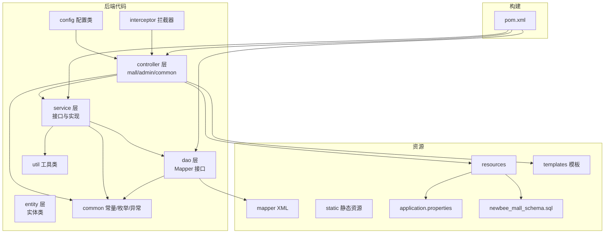
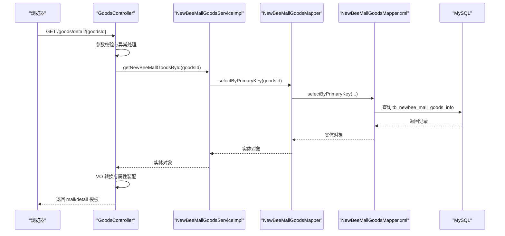
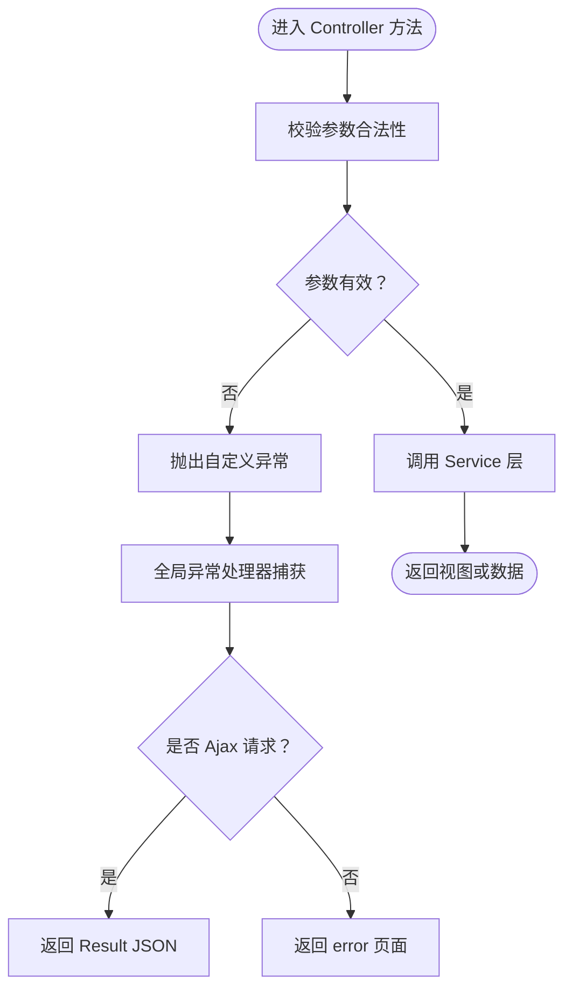
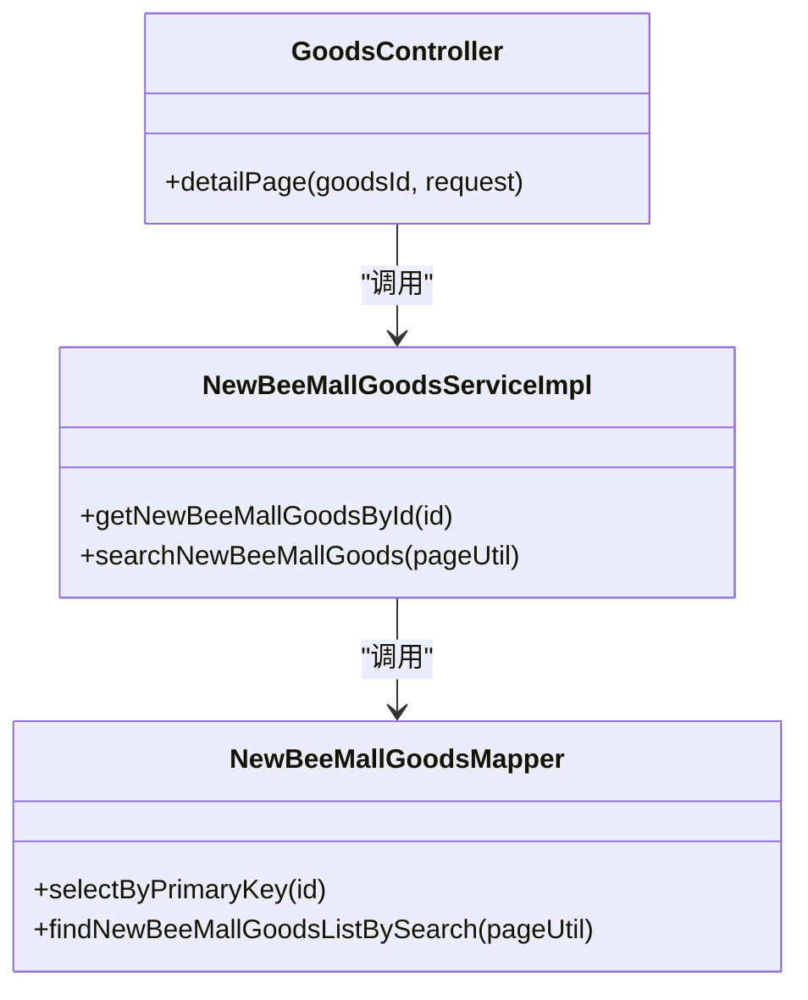
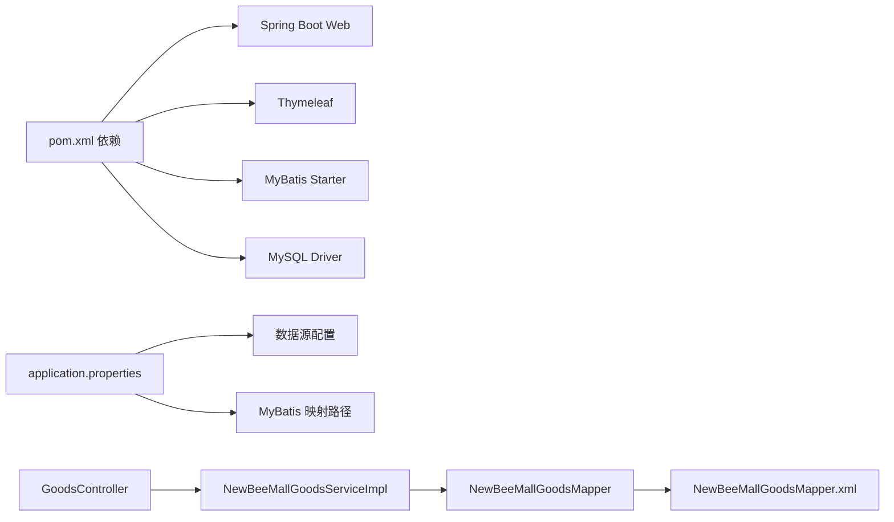

# 本地开发指南

<cite>
**本文引用的文件**
- [DEVELOPMENT.md](file://docs/DEVELOPMENT.md)
- [application.properties](file://src/main/resources/application.properties)
- [pom.xml](file://pom.xml)
- [newbee_mall_schema.sql](file://src/main/resources/newbee_mall_schema.sql)
- [GoodsController.java](file://src/main/java/ltd/newbee/mall/controller/mall/GoodsController.java)
- [NewBeeMallGoodsServiceImpl.java](file://src/main/java/ltd/newbee/mall/service/impl/NewBeeMallGoodsServiceImpl.java)
- [NewBeeMallGoodsMapper.java](file://src/main/java/ltd/newbee/mall/dao/NewBeeMallGoodsMapper.java)
- [NewBeeMallGoodsMapper.xml](file://src/main/resources/mapper/NewBeeMallGoodsMapper.xml)
- [NewBeeMallException.java](file://src/main/java/ltd/newbee/mall/common/NewBeeMallException.java)
- [ServiceResultEnum.java](file://src/main/java/ltd/newbee/mall/common/ServiceResultEnum.java)
- [Result.java](file://src/main/java/ltd/newbee/mall/util/Result.java)
- [NewBeeMallExceptionHandler.java](file://src/main/java/ltd/newbee/mall/controller/common/NewBeeMallExceptionHandler.java)
</cite>

## 目录
1. [引言](#引言)
2. [项目结构](#项目结构)
3. [核心组件](#核心组件)
4. [架构总览](#架构总览)
5. [详细组件分析](#详细组件分析)
6. [依赖关系分析](#依赖关系分析)
7. [性能与开发建议](#性能与开发建议)
8. [故障排查指南](#故障排查指南)
9. [结论](#结论)
10. [附录](#附录)

## 引言
本指南面向首次参与 newbee-mall 本地开发的工程师，基于仓库中的开发文档与现有代码，提供从环境准备、数据库初始化、项目启动、调试到新增页面与 API 的完整流程说明。文档严格依据仓库文件内容，避免臆造信息，确保新手能快速上手。

## 项目结构
newbee-mall 采用典型的 Spring Boot + MyBatis 分层架构，资源与代码组织如下：
- 后端代码位于 src/main/java，按领域分层：controller、service、dao、entity、common、util、interceptor、config
- 资源位于 src/main/resources，包含数据库脚本、MyBatis 映射 XML、静态资源与模板
- 构建配置使用 Maven（pom.xml）

图表来源
- [pom.xml](file://pom.xml#L1-L83)
- [application.properties](file://src/main/resources/application.properties#L1-L22)
- [newbee_mall_schema.sql](file://src/main/resources/newbee_mall_schema.sql#L1-L120)

章节来源
- [pom.xml](file://pom.xml#L1-L83)
- [application.properties](file://src/main/resources/application.properties#L1-L22)

## 核心组件
- 数据库连接与 MyBatis 配置：application.properties 中定义了数据源、连接池与 MyBatis 映射路径
- 控制器层：以 GoodsController 为例，负责接收请求、参数校验、调用服务层并返回视图或数据
- 服务层：以 NewBeeMallGoodsServiceImpl 为例，封装业务逻辑、事务边界与 DAO 调用
- 数据访问层：以 NewBeeMallGoodsMapper 与 NewBeeMallGoodsMapper.xml 为例，提供 CRUD 与分页查询能力
- 异常与返回：统一异常处理器、业务枚举与返回对象

章节来源
- [application.properties](file://src/main/resources/application.properties#L1-L22)
- [GoodsController.java](file://src/main/java/ltd/newbee/mall/controller/mall/GoodsController.java#L1-L91)
- [NewBeeMallGoodsServiceImpl.java](file://src/main/java/ltd/newbee/mall/service/impl/NewBeeMallGoodsServiceImpl.java#L1-L139)
- [NewBeeMallGoodsMapper.java](file://src/main/java/ltd/newbee/mall/dao/NewBeeMallGoodsMapper.java#L1-L53)
- [NewBeeMallGoodsMapper.xml](file://src/main/resources/mapper/NewBeeMallGoodsMapper.xml#L1-L391)
- [NewBeeMallExceptionHandler.java](file://src/main/java/ltd/newbee/mall/controller/common/NewBeeMallExceptionHandler.java#L1-L56)
- [ServiceResultEnum.java](file://src/main/java/ltd/newbee/mall/common/ServiceResultEnum.java#L1-L91)
- [Result.java](file://src/main/java/ltd/newbee/mall/util/Result.java#L1-L58)

## 架构总览
下图展示了从前端请求到数据库的典型调用链路，体现 Controller-Service-DAO 的分层职责与 MyBatis XML 的映射关系。

图表来源
- [GoodsController.java](file://src/main/java/ltd/newbee/mall/controller/mall/GoodsController.java#L74-L91)
- [NewBeeMallGoodsServiceImpl.java](file://src/main/java/ltd/newbee/mall/service/impl/NewBeeMallGoodsServiceImpl.java#L100-L107)
- [NewBeeMallGoodsMapper.java](file://src/main/java/ltd/newbee/mall/dao/NewBeeMallGoodsMapper.java#L21-L28)
- [NewBeeMallGoodsMapper.xml](file://src/main/resources/mapper/NewBeeMallGoodsMapper.xml#L43-L58)

## 详细组件分析

### 开发环境搭建与项目启动
- 安装必要软件
  - JDK 1.8 或以上
  - Maven 3.x
  - MySQL 5.7 或以上
  - 推荐 IDE：IntelliJ IDEA 或 Eclipse
- 克隆项目并导入数据库
  - 克隆仓库后，使用提供的 SQL 脚本初始化数据库
- 配置项目
  - 修改 application.properties 中的数据源 URL、用户名与密码
  - 可选：配置服务器端口
- 启动方式
  - IDEA 启动：找到启动类，右键运行
  - Maven 启动：mvn spring-boot:run
  - 命令行打包启动：mvn package 后 java -jar 启动

章节来源
- [DEVELOPMENT.md](file://docs/DEVELOPMENT.md#L135-L239)
- [application.properties](file://src/main/resources/application.properties#L1-L22)
- [pom.xml](file://pom.xml#L1-L83)

### 数据库初始化与连接配置
- 初始化数据库
  - 使用 newbee_mall_schema.sql 创建表结构与初始数据
- 连接配置
  - application.properties 中包含数据库驱动、URL、用户名、密码、连接池参数与 MyBatis 映射路径

章节来源
- [newbee_mall_schema.sql](file://src/main/resources/newbee_mall_schema.sql#L1-L120)
- [application.properties](file://src/main/resources/application.properties#L1-L22)

### 控制器层：参数校验与异常处理
- 参数校验
  - 对路径参数进行合法性判断，非法参数直接抛出自定义异常
- 异常处理
  - 全局异常处理器区分自定义异常与未知异常，Ajax 请求返回 JSON，非 Ajax 返回错误页面

图表来源
- [GoodsController.java](file://src/main/java/ltd/newbee/mall/controller/mall/GoodsController.java#L74-L91)
- [NewBeeMallExceptionHandler.java](file://src/main/java/ltd/newbee/mall/controller/common/NewBeeMallExceptionHandler.java#L25-L55)
- [NewBeeMallException.java](file://src/main/java/ltd/newbee/mall/common/NewBeeMallException.java#L1-L30)

章节来源
- [GoodsController.java](file://src/main/java/ltd/newbee/mall/controller/mall/GoodsController.java#L74-L91)
- [NewBeeMallExceptionHandler.java](file://src/main/java/ltd/newbee/mall/controller/common/NewBeeMallExceptionHandler.java#L1-L56)
- [NewBeeMallException.java](file://src/main/java/ltd/newbee/mall/common/NewBeeMallException.java#L1-L30)

### 服务层：业务逻辑与事务边界
- 业务逻辑
  - 服务层封装业务规则、参数清洗、调用 DAO、组装 VO
- 事务边界
  - 示例中未标注 @Transactional，但开发规范建议在需要事务的场景使用

图表来源
- [GoodsController.java](file://src/main/java/ltd/newbee/mall/controller/mall/GoodsController.java#L74-L91)
- [NewBeeMallGoodsServiceImpl.java](file://src/main/java/ltd/newbee/mall/service/impl/NewBeeMallGoodsServiceImpl.java#L100-L139)
- [NewBeeMallGoodsMapper.java](file://src/main/java/ltd/newbee/mall/dao/NewBeeMallGoodsMapper.java#L18-L53)

章节来源
- [NewBeeMallGoodsServiceImpl.java](file://src/main/java/ltd/newbee/mall/service/impl/NewBeeMallGoodsServiceImpl.java#L1-L139)
- [NewBeeMallGoodsMapper.java](file://src/main/java/ltd/newbee/mall/dao/NewBeeMallGoodsMapper.java#L1-L53)

### DAO 层与 MyBatis 映射
- Mapper 接口
  - 定义 CRUD、分页查询、批量更新等方法
- XML 映射
  - 定义 SQL、条件拼接、排序与分页片段
- 关键点
  - BLOB 字段映射与批量操作
  - 搜索与排序策略

章节来源
- [NewBeeMallGoodsMapper.java](file://src/main/java/ltd/newbee/mall/dao/NewBeeMallGoodsMapper.java#L1-L53)
- [NewBeeMallGoodsMapper.xml](file://src/main/resources/mapper/NewBeeMallGoodsMapper.xml#L1-L391)

### 新增页面与 API 的完整示例（基于现有代码结构）
以下示例遵循项目既有的分层与命名规范，帮助你快速新增页面与 API：

- 新增页面
  - 控制器：在 mall 或 admin 包下新增 Controller，返回模板路径
  - 模板：在 templates 下对应目录新增 HTML
  - 静态资源：在 static 下对应目录新增 CSS/JS
- 新增 API
  - 实体类：在 entity 下新增实体
  - Mapper 接口：在 dao 下新增接口
  - Mapper XML：在 mapper 下新增 XML 映射
  - Service 接口与实现：在 service 下新增接口与实现
  - Controller：在 controller 下新增 REST 控制器，返回 Result

章节来源
- [DEVELOPMENT.md](file://docs/DEVELOPMENT.md#L600-L721)

## 依赖关系分析
- 构建与运行
  - Spring Boot Starter Web、Thymeleaf、MyBatis Starter、MySQL Connector
- 运行时配置
  - 数据源、连接池、MyBatis 映射路径
- 代码依赖
  - Controller 依赖 Service，Service 依赖 Mapper，Mapper 依赖 XML
  - 异常与返回对象贯穿各层

图表来源
- [pom.xml](file://pom.xml#L1-L83)
- [application.properties](file://src/main/resources/application.properties#L1-L22)
- [GoodsController.java](file://src/main/java/ltd/newbee/mall/controller/mall/GoodsController.java#L1-L91)
- [NewBeeMallGoodsServiceImpl.java](file://src/main/java/ltd/newbee/mall/service/impl/NewBeeMallGoodsServiceImpl.java#L1-L139)
- [NewBeeMallGoodsMapper.java](file://src/main/java/ltd/newbee/mall/dao/NewBeeMallGoodsMapper.java#L1-L53)
- [NewBeeMallGoodsMapper.xml](file://src/main/resources/mapper/NewBeeMallGoodsMapper.xml#L1-L391)

章节来源
- [pom.xml](file://pom.xml#L1-L83)
- [application.properties](file://src/main/resources/application.properties#L1-L22)

## 性能与开发建议
- 数据库连接池与超时配置已在 application.properties 中设置，可根据环境调整
- MyBatis 映射文件建议使用条件片段与排序策略，避免全表扫描
- 分页查询应结合索引与合理排序，避免大 offset
- 服务层方法建议明确事务边界，保证一致性
- 控制器仅做参数校验与响应，避免业务逻辑下沉

[本节为通用建议，不直接分析具体文件]

## 故障排查指南
- 启动失败
  - 检查数据库连接配置与数据库是否启动
  - 查看全局异常处理器对未知异常的输出
- 页面 500
  - 检查控制器参数校验与异常抛出
  - 查看异常处理器对 Ajax 与非 Ajax 的差异化返回
- API 返回错误
  - 使用业务枚举与返回对象，核对 resultCode 与 message

章节来源
- [NewBeeMallExceptionHandler.java](file://src/main/java/ltd/newbee/mall/controller/common/NewBeeMallExceptionHandler.java#L25-L55)
- [NewBeeMallException.java](file://src/main/java/ltd/newbee/mall/common/NewBeeMallException.java#L1-L30)
- [ServiceResultEnum.java](file://src/main/java/ltd/newbee/mall/common/ServiceResultEnum.java#L1-L91)
- [Result.java](file://src/main/java/ltd/newbee/mall/util/Result.java#L1-L58)

## 结论
通过本指南，你可以完成本地环境搭建、数据库初始化、项目启动与调试，并掌握新增页面与 API 的标准流程。建议在开发过程中严格遵守分层架构与异常处理规范，确保代码可维护性与一致性。

[本节为总结，不直接分析具体文件]

## 附录
- 开发规范要点
  - 命名规范：类名大驼峰、方法小驼峰、常量全大写、包全小写
  - 注释规范：类/接口/公共方法需注释，复杂逻辑需行内注释
  - 代码格式：4 空格缩进、左大括号不换行、长行不超过 120 字符
  - 分层规范：Controller 只负责请求与响应、Service 负责业务与事务、DAO 仅负责数据库操作
  - 异常处理：统一异常处理、自定义业务异常、返回统一 Result 对象

章节来源
- [DEVELOPMENT.md](file://docs/DEVELOPMENT.md#L241-L399)