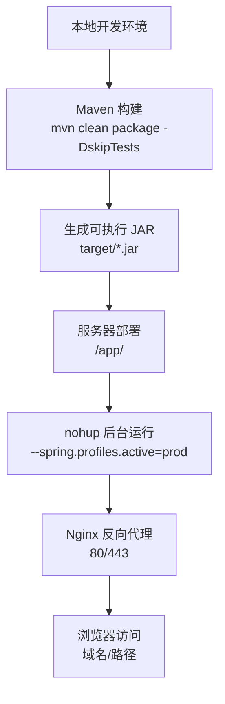
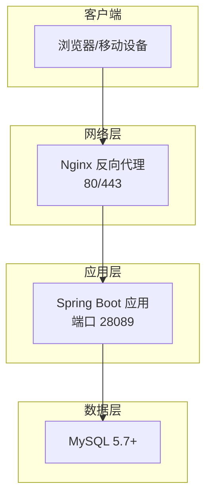
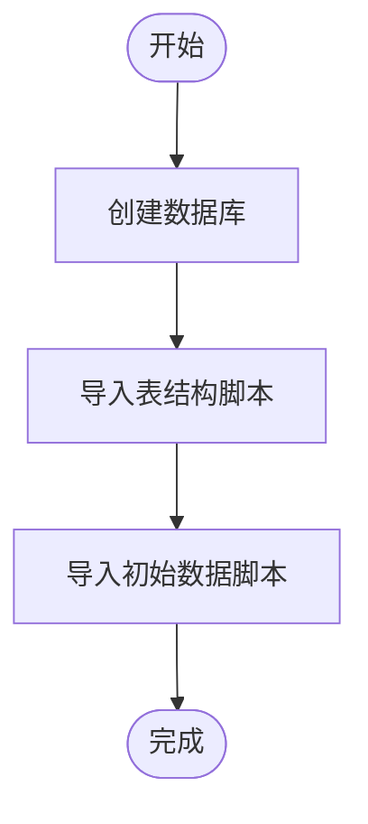
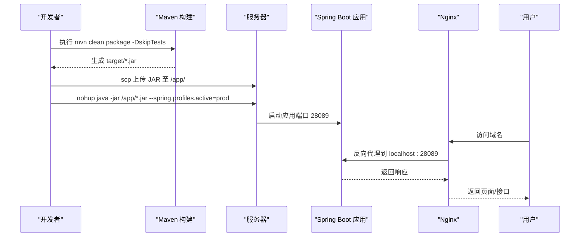
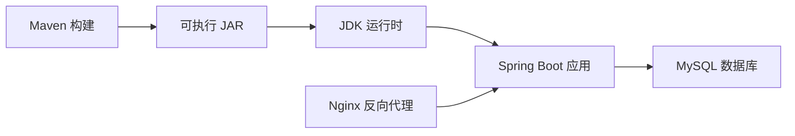

# 生产部署指南

<cite>
**本文引用的文件**
- [DEVELOPMENT.md](file://docs/DEVELOPMENT.md)
- [pom.xml](file://pom.xml)
- [application.properties](file://src/main/resources/application.properties)
- [newbee_mall_schema.sql](file://src/main/resources/newbee_mall_schema.sql)
- [NewBeeMallApplication.java](file://src/main/java/ltd/newbee/mall/NewBeeMallApplication.java)
</cite>

## 目录
1. [引言](#引言)
2. [项目结构](#项目结构)
3. [核心组件](#核心组件)
4. [架构总览](#架构总览)
5. [详细组件分析](#详细组件分析)
6. [依赖关系分析](#依赖关系分析)
7. [性能与稳定性建议](#性能与稳定性建议)
8. [故障排查指南](#故障排查指南)
9. [结论](#结论)
10. [附录](#附录)

## 引言
本指南面向生产环境部署，基于仓库中的开发文档与工程配置，提供从本地打包到服务器运行、数据库初始化、Nginx 反向代理、HTTPS 证书配置、日志与进程管理、以及系统监控与日志轮转的完整操作步骤。目标是帮助运维与开发团队以最小成本、最高可靠性完成上线。

## 项目结构
- 后端采用 Spring Boot 2.7.5 + MyBatis，打包为可执行 JAR。
- 默认端口为 28089，数据库连接配置位于 application.properties。
- Maven 构建由 spring-boot-maven-plugin 提供可执行 JAR 支持。
- 数据库脚本位于 resources 目录，包含表结构与初始数据。

图表来源
- [DEVELOPMENT.md](file://docs/DEVELOPMENT.md#L752-L799)
- [pom.xml](file://pom.xml#L69-L76)
- [application.properties](file://src/main/resources/application.properties#L6-L22)

章节来源
- [DEVELOPMENT.md](file://docs/DEVELOPMENT.md#L752-L799)
- [pom.xml](file://pom.xml#L69-L76)
- [application.properties](file://src/main/resources/application.properties#L6-L22)

## 核心组件
- 应用入口：Spring Boot 启动类负责扫描 Mapper 并启动 Web 容器。
- 数据库连接：HikariCP 连接池配置，支持多查询与自动重连。
- 配置文件：application.properties 提供默认开发配置；生产环境建议通过 profiles 切换。
- 构建插件：spring-boot-maven-plugin 生成可执行 JAR，便于直接 java -jar 启动。

章节来源
- [NewBeeMallApplication.java](file://src/main/java/ltd/newbee/mall/NewBeeMallApplication.java#L1-L28)
- [application.properties](file://src/main/resources/application.properties#L6-L22)
- [pom.xml](file://pom.xml#L69-L76)

## 架构总览
生产部署涉及三层：应用层（Spring Boot）、反向代理层（Nginx）、安全层（Let’s Encrypt 证书）。应用通过 nohup 在后台运行，Nginx 将外部请求转发至应用端口，HTTPS 由证书与 Nginx 配置共同保障。

图表来源
- [DEVELOPMENT.md](file://docs/DEVELOPMENT.md#L752-L799)
- [application.properties](file://src/main/resources/application.properties#L6-L22)

## 详细组件分析

### 1. 本地打包与产物
- 使用 Maven 清理并打包，跳过测试，生成可执行 JAR。
- 插件提供可执行能力，无需额外装配。

章节来源
- [DEVELOPMENT.md](file://docs/DEVELOPMENT.md#L752-L759)
- [pom.xml](file://pom.xml#L69-L76)

### 2. 服务器环境准备
- JDK 1.8+：确保运行时可用。
- MySQL 5.7+：安装并创建数据库。
- 初始化数据库：执行脚本创建表结构与初始数据。

章节来源
- [DEVELOPMENT.md](file://docs/DEVELOPMENT.md#L760-L766)
- [newbee_mall_schema.sql](file://src/main/resources/newbee_mall_schema.sql#L1-L200)

### 3. 上传与后台运行
- 上传 JAR：使用 scp 将本地构建产物上传至服务器指定目录。
- 后台运行：使用 nohup 与 java -jar 启动，输出日志到 app.log，并激活 prod profile。

章节来源
- [DEVELOPMENT.md](file://docs/DEVELOPMENT.md#L766-L778)

### 4. Nginx 反向代理配置
- 监听 80 端口，server_name 指定域名。
- location / 下设置 proxy_pass 指向应用端口。
- 传递必要的头部以便应用识别真实来源与协议。

章节来源
- [DEVELOPMENT.md](file://docs/DEVELOPMENT.md#L779-L793)

### 5. HTTPS 与 Let’s Encrypt
- 使用 Let’s Encrypt 获取免费证书，配置 Nginx 的 443 端口与证书路径。
- 将 80 请求重定向至 443，确保全站 HTTPS。

章节来源
- [DEVELOPMENT.md](file://docs/DEVELOPMENT.md#L795-L799)

### 6. 日志查看与进程管理
- 查看日志：tail -f /app/logs/app.log。
- 进程管理：ps 查找进程，kill 终止异常进程。
- 建议：结合 systemd 或进程守护工具实现自启与健康检查。

章节来源
- [DEVELOPMENT.md](file://docs/DEVELOPMENT.md#L766-L778)

### 7. 数据库初始化流程
- 创建数据库与用户（按实际环境调整）。
- 导入表结构与初始数据脚本。

图表来源
- [DEVELOPMENT.md](file://docs/DEVELOPMENT.md#L187-L193)
- [newbee_mall_schema.sql](file://src/main/resources/newbee_mall_schema.sql#L1-L200)

章节来源
- [DEVELOPMENT.md](file://docs/DEVELOPMENT.md#L187-L193)
- [newbee_mall_schema.sql](file://src/main/resources/newbee_mall_schema.sql#L1-L200)

### 8. 应用启动序列
- 本地构建 -> 上传 JAR -> nohup 启动 -> Nginx 反代 -> 健康检查 -> 上线。

图表来源
- [DEVELOPMENT.md](file://docs/DEVELOPMENT.md#L752-L799)
- [application.properties](file://src/main/resources/application.properties#L6-L22)

章节来源
- [DEVELOPMENT.md](file://docs/DEVELOPMENT.md#L752-L799)
- [application.properties](file://src/main/resources/application.properties#L6-L22)

## 依赖关系分析
- 构建阶段：Maven 依赖 Spring Boot、MyBatis、MySQL Connector 等。
- 运行阶段：应用依赖 JDK 与 MySQL；Nginx 作为反向代理。
- 配置阶段：application.properties 提供数据库与端口配置；生产 profile 通过命令行参数激活。

图表来源
- [pom.xml](file://pom.xml#L31-L67)
- [application.properties](file://src/main/resources/application.properties#L6-L22)
- [DEVELOPMENT.md](file://docs/DEVELOPMENT.md#L752-L799)

章节来源
- [pom.xml](file://pom.xml#L31-L67)
- [application.properties](file://src/main/resources/application.properties#L6-L22)
- [DEVELOPMENT.md](file://docs/DEVELOPMENT.md#L752-L799)

## 性能与稳定性建议
- JVM 参数优化：根据机器内存设置堆大小、GC 参数，避免频繁 Full GC。
- 连接池调优：依据并发与数据库性能调整 HikariCP 最大连接数、超时时间。
- Nginx 限流与超时：对上游应用设置合理的 proxy_connect_timeout、proxy_send_timeout、proxy_read_timeout。
- 健康检查：在 Nginx 中配置简单 GET 探针，失败自动摘除节点。
- 备份策略：定期备份数据库与应用日志，保留至少 7 天滚动日志。
- 自动化：结合 CI/CD 与 systemd，实现一键发布与自动重启。

## 故障排查指南
- 应用无法启动
  - 检查端口占用与防火墙放行。
  - 查看 /app/logs/app.log 是否有数据库连接错误。
- 数据库连接失败
  - 核对 application.properties 中的数据库 URL、用户名、密码。
  - 确认 MySQL 服务运行与网络可达。
- Nginx 502/504
  - 检查 upstream（应用）是否在线。
  - 调整 proxy 超时参数，确认应用端口正确。
- HTTPS 证书问题
  - 确认证书路径与权限。
  - 检查域名解析与防火墙 80/443 端口放行。

章节来源
- [DEVELOPMENT.md](file://docs/DEVELOPMENT.md#L766-L799)
- [application.properties](file://src/main/resources/application.properties#L6-L22)

## 结论
通过本指南，您可以完成从本地构建到服务器上线的全流程部署。建议在正式上线前进行压测与演练，确保 Nginx、应用与数据库协同工作稳定可靠。同时建立完善的日志与监控体系，保障线上问题可追溯、可恢复。

## 附录
- 关键命令参考
  - 构建：mvn clean package -DskipTests
  - 上传：scp target/*.jar user@server:/app/
  - 启动：nohup java -jar /app/*.jar --spring.profiles.active=prod > /app/logs/app.log 2>&1 &
  - 查看日志：tail -f /app/logs/app.log
  - 进程管理：ps aux | grep java，kill -TERM PID
- 建议的生产配置要点
  - 使用独立的生产配置文件或通过命令行参数覆盖关键配置。
  - 在 Nginx 中启用 gzip、缓存静态资源，减少应用压力。
  - 对敏感信息使用环境变量或密钥管理服务注入。